# Django for Everybody：4.5：通用视图内部机制与所属行回顾 🧠

在本节课中，我们将深入探讨Django通用编辑视图的内部工作原理。我们将学习如何通过重写和扩展其内部方法，将一个通用的编辑视图改造为支持“所属行”功能的视图。理解这些机制是自定义视图行为的关键。

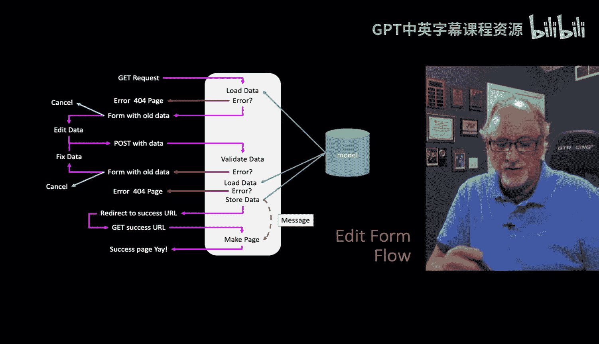

## 通用编辑视图流程回顾 🔄

上一节我们介绍了CRUD操作的基本概念，本节中我们来看看通用编辑视图的内部处理流程。这是一个复习内容，我们将快速回顾编辑表单的完整生命周期。

当用户点击编辑按钮时，会发起一个GET请求（例如 `/1` 或 `/15`）。视图会执行以下步骤：

1.  根据主键（1、2或15）从数据库加载数据。
2.  如果未找到对应数据，则返回404错误。
3.  用加载的旧数据填充表单，并呈现给用户。
4.  用户编辑数据并提交POST请求。
5.  根据表单规则验证提交的数据（**注意**：模型处理后端逻辑，表单处理前端交互，验证是表单的职责）。
6.  如果验证出错，则返回表单让用户修正。
7.  如果数据有效，则重新加载对应的模型实例。
8.  检查该模型实例是否可访问（这对我们即将实现的“所属行”功能至关重要）。如果实例不存在或用户无权访问，则返回404错误（这可能是因为用户篡改了表单或提交到了错误的URL）。
9.  如果可访问，则更新数据并保存。
10. 最后，重定向到成功URL。

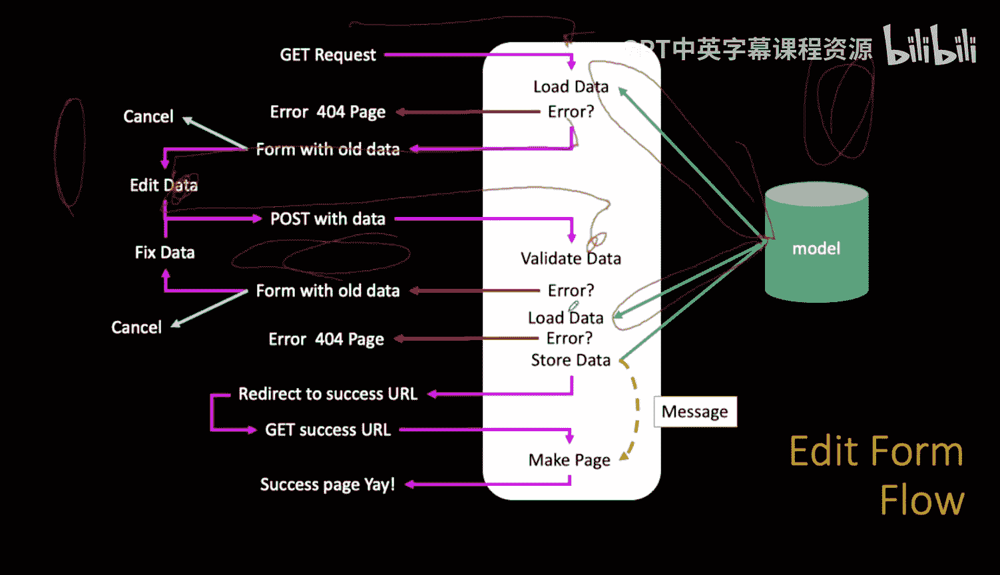

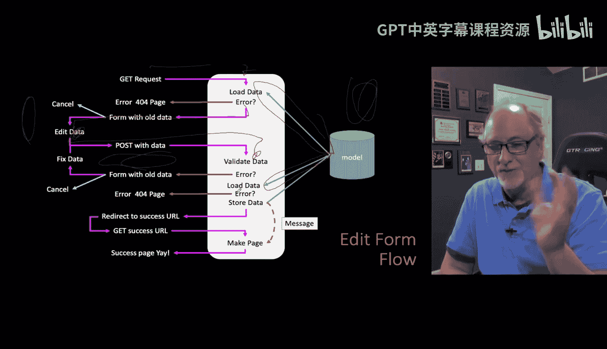

这就是基本的表单处理流程，我们在之前实现每个CRUD功能时都遵循了类似的模式。

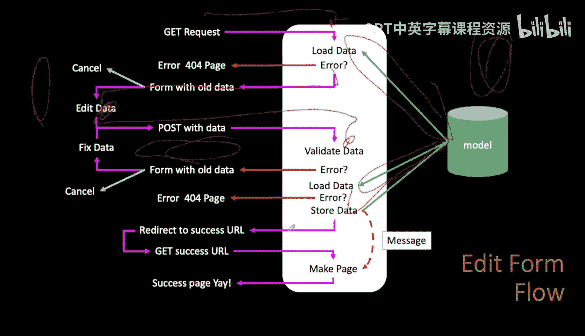

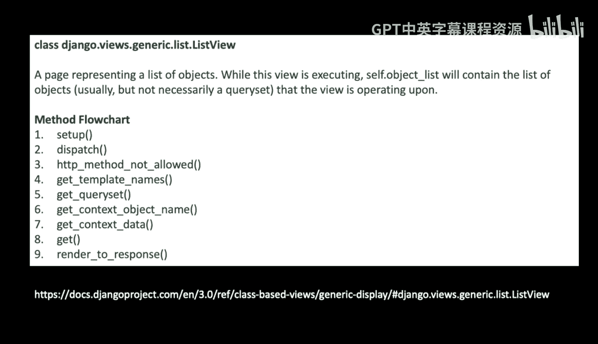

## 通用视图的方法流程图 📊

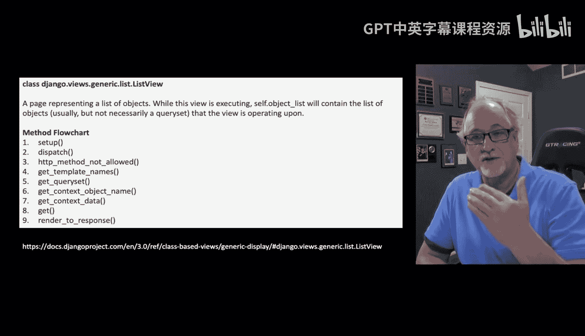

Django文档揭示了通用视图类内部的运作机制。通过方法流程图，我们可以看到类是如何一步步执行其“魔法”的。

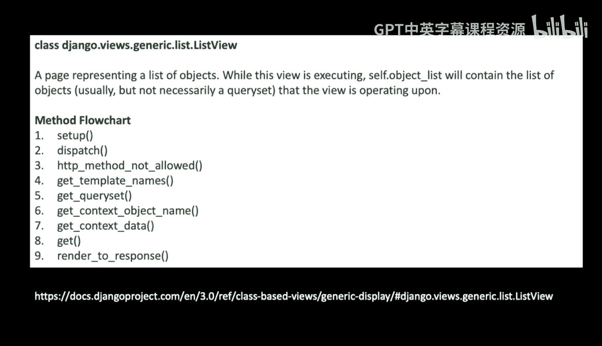

以下是通用列表视图（部分编辑视图也类似）的典型方法调用顺序：

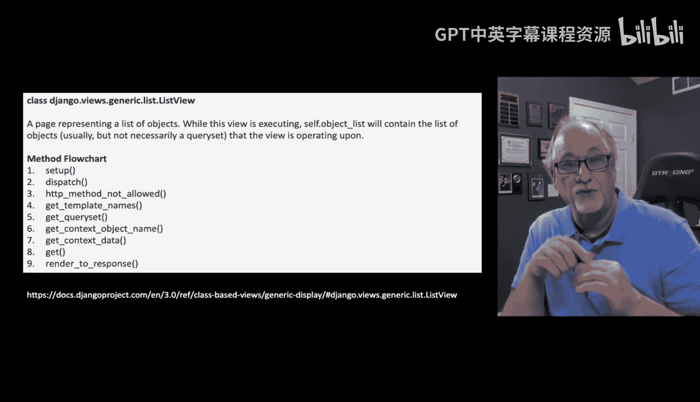

1.  `setup()`
2.  `dispatch()`：检查请求方法是否被允许。
3.  `get_template_names()`
4.  `get_queryset()`：从数据库加载数据。
5.  `get_context_object_name()`
6.  `get_context_data()`：获取模板上下文数据。
7.  `render_to_response()`

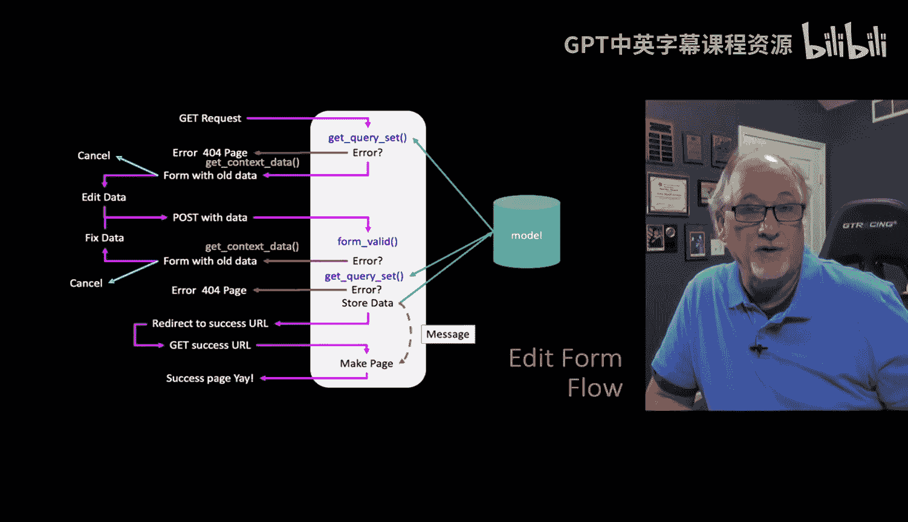

你可能会问，为什么文档要展示这些？答案是，这为我们提供了介入和修改这些内置类行为的接入点。通过重写这些方法，我们可以在不深入了解整个类的情况下，扩展其功能。

## 编辑视图中的关键方法 🎯

现在，让我们从方法调用的角度，来看待通用编辑视图的处理过程。

以下是编辑视图中关键方法被调用的时刻：

*   **GET请求阶段**：请求携带主键进入。视图通过 `get_queryset()` 方法读取数据。随后，在渲染模板前，会调用 `get_context_data()` 方法来准备上下文数据。这是我们之后可以介入并添加自定义逻辑的地方。
*   **POST请求阶段**：用户提交表单后，视图首先在 `form_valid()` 方法中进行验证。我们也可以在 `form_valid()` 中加入自己的代码。如果验证失败，视图会再次使用 `get_context_data()` 渲染带错误信息的表单。如果验证通过，视图会再次调用 `get_queryset()` 获取数据对象，然后修改并保存数据。

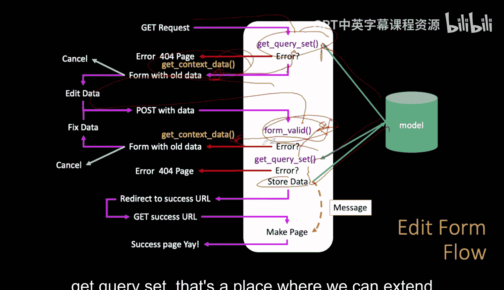

**核心要点**：`form_valid()`、`get_queryset()` 和 `get_context_data()` 这些关键时刻，正是我们扩展这个内置类行为的切入点。

## 方法重写技术：完全覆盖 🛠️

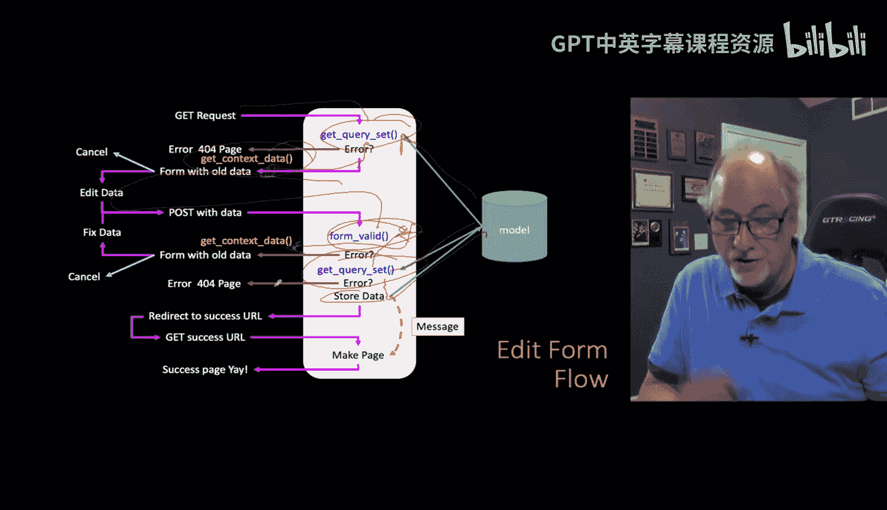

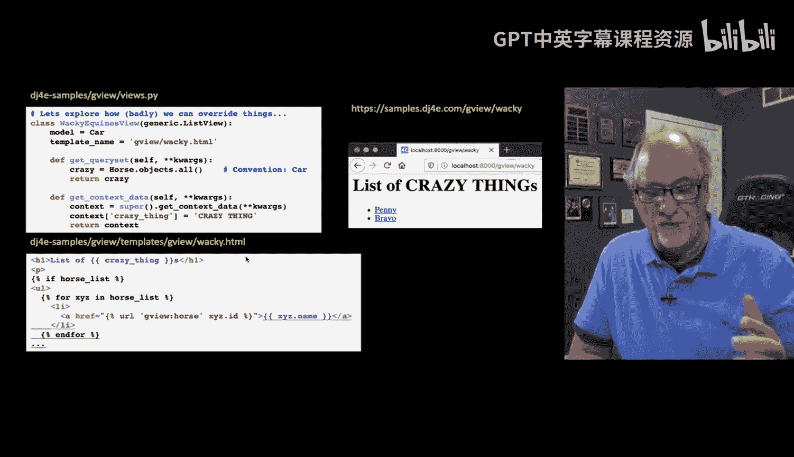

之前课程中，我展示了一个重写 `get_queryset()` 方法的示例。以下是其代码结构：

```python
class WackyEquineView(generic.ListView):
    model = Car
    template_name = 'myapp/car_list.html'

    def get_queryset(self):
        # 完全忽略父类的 model (Car)，返回 Horse 对象的列表
        return Horse.objects.all()
```

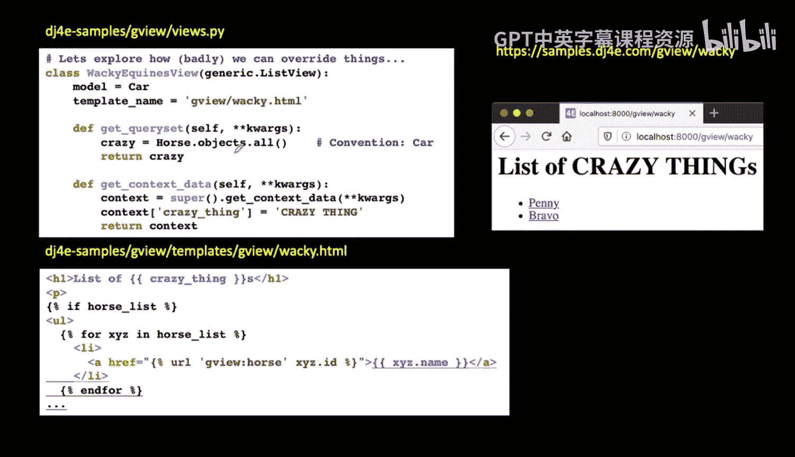

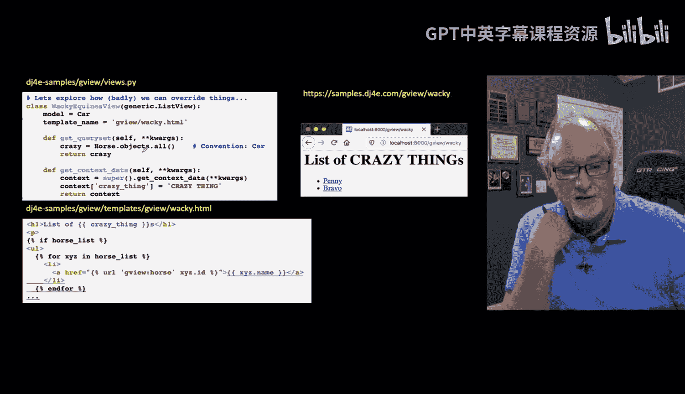

在这个 `get_queryset` 方法中，我完全覆盖并忽略了父类 `generic.ListView` 中的 `get_queryset` 逻辑。原本视图会根据 `model = Car` 查询汽车，但由于我的重写，它现在调用的是 `WackyEquineView` 中的方法，返回一个马匹对象的列表。因此，模板最终渲染的是马匹列表，而非汽车列表。

**代码解析**：
*   我创建了一个继承自 `generic.ListView` 的派生类 `WackyEquineView`。
*   我重写了 `get_queryset` 方法，使其返回 `Horse.objects.all()`。
*   这样做的结果是，我彻底改变了父类的行为，而我的代码完全无视了类属性中定义的 `model = Car`。

这个示例的目的纯粹是为了演示：**我可以在创建派生类时，通过完全重写方法来改变父类的行为**。你需要了解被重写方法的规则（例如返回值类型）。编写这样的代码可能需要参考Django源码或Stack Overflow，并非轻而易举。

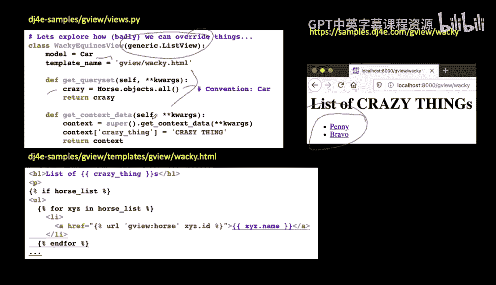


## 方法重写技术：增强扩展 ⚡

另一种重写方法是“增强”或“扩展”父类方法，而不是完全替换。以 `get_context_data` 方法为例。

`get_context_data` 的作用是准备传递给模板的上下文数据。在通用列表视图中，`get_queryset` 返回的列表（例如马匹列表）会被自动放入上下文（例如变量 `horse_list`），供模板循环渲染。

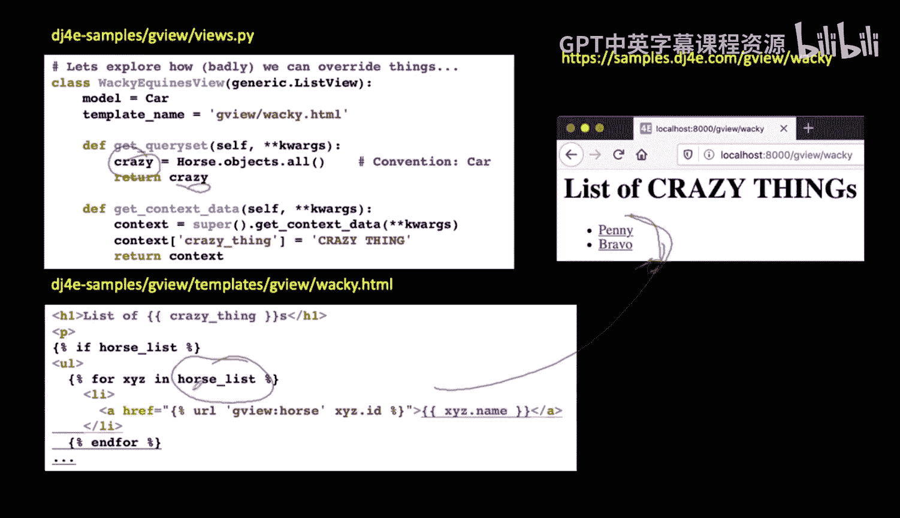

我不想完全替换 `get_context_data`，而是希望在父类提供的上下文基础上，额外添加一些数据。

以下是实现方式：

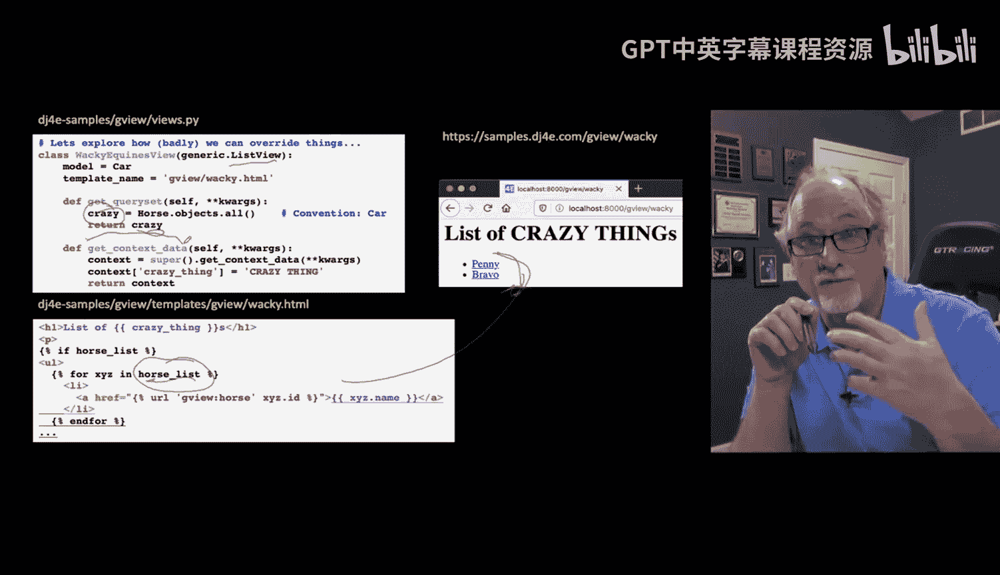

```python
def get_context_data(self, **kwargs):
    # 1. 首先调用父类（generic.ListView）的 get_context_data 方法
    context = super().get_context_data(**kwargs)
    # 2. 然后添加自定义数据到上下文中
    context['crazy_thing'] = 'Crazy Thing'
    # 3. 返回合并后的上下文
    return context
```

**代码解析**：
*   `super().get_context_data(**kwargs)`：这行代码调用了父类（`generic.ListView`）的 `get_context_data` 方法。`super()` 关键字用于调用父类的方法。`**kwargs` 确保所有参数都被传递进去。
*   父类方法执行后，会返回一个包含 `horse_list` 等数据的上下文字典 `context`。
*   `context['crazy_thing'] = 'Crazy Thing'`：我向这个字典中添加了一个新的键值对。
*   最后，返回这个增强后的上下文字典。

这样，模板中既能访问到由父类逻辑生成的 `horse_list`，也能访问到我额外添加的 `crazy_thing` 变量。

**两种技术的对比**：
*   **完全覆盖**：就像 `get_queryset` 示例，彻底替换父类逻辑，适用于需要完全不同行为的情况。
*   **增强扩展**：就像 `get_context_data` 示例，先调用父类逻辑获取结果，然后在此基础上修改或添加内容，最后返回组合后的结果。

## 总结 📝

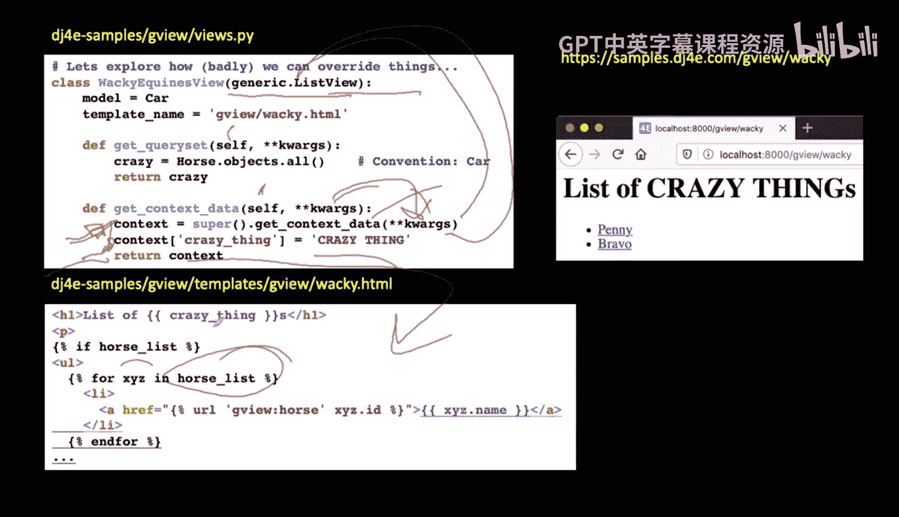

本节课中我们一起学习了Django通用视图的内部机制与自定义方法。

1.  我们回顾了通用编辑视图处理GET和POST请求的完整流程。
2.  我们了解了Django通过方法流程图暴露的内部接入点，如 `get_queryset`、`get_context_data` 和 `form_valid`。
3.  我们掌握了两种关键的方法重写技术：
    *   **完全覆盖**：彻底替换父类方法的行为（如 `get_queryset` 示例）。
    *   **增强扩展**：调用父类方法后，在其结果上添加额外逻辑（如 `get_context_data` 示例）。

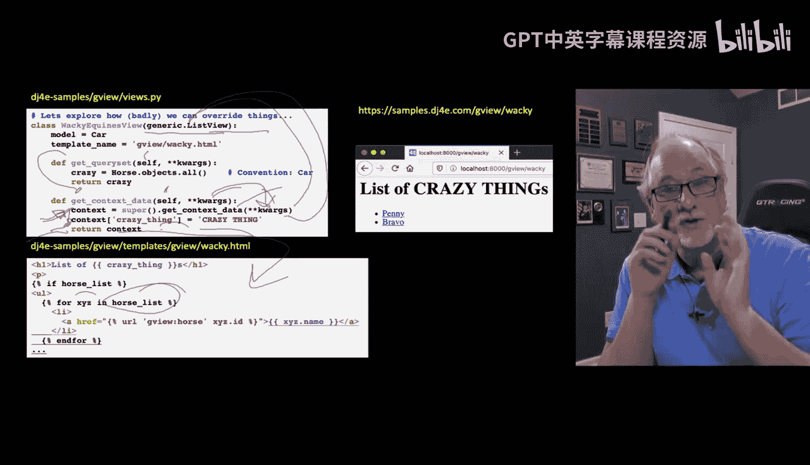

在接下来的课程中，我们将运用这两种技术，通过创建 `owner.py` 代码并“介入”到这些通用视图中，来实现“所属行”字段的功能，确保用户只能访问和修改自己拥有的数据。