# 006：Django中的所属行-owner.py文件 🔐

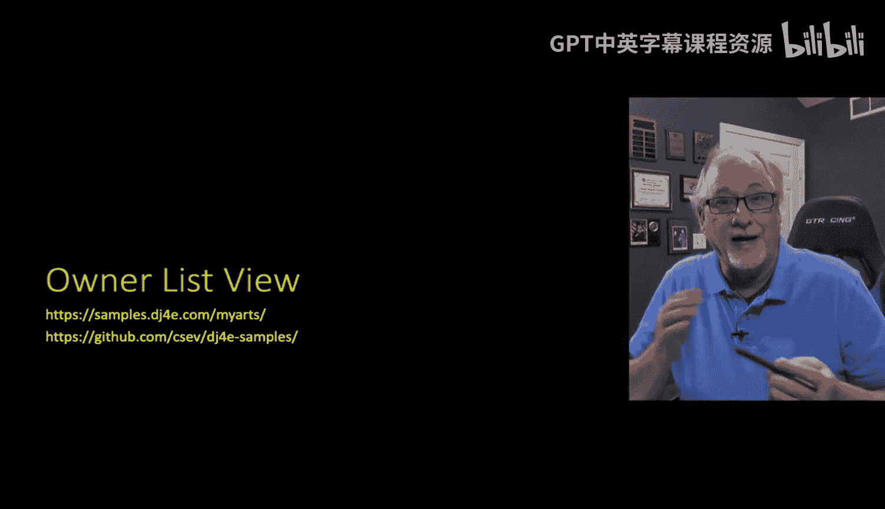

在本节课中，我们将学习如何在Django应用中实现“所属行”功能，即确保用户只能查看、编辑或删除他们自己拥有的数据。我们将通过创建一个自定义的`owner.py`文件，并利用Django的类视图和面向对象编程来实现这一功能。

---

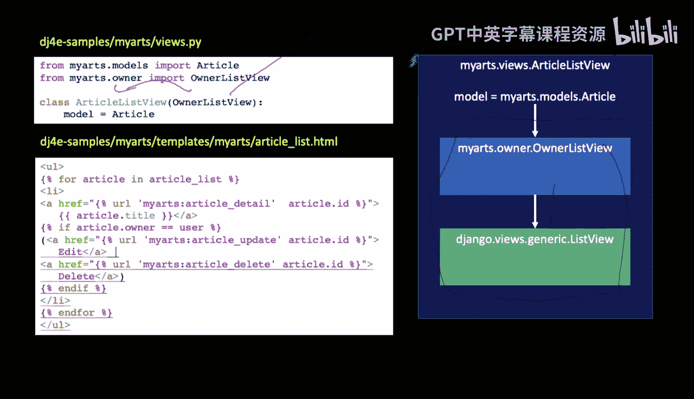

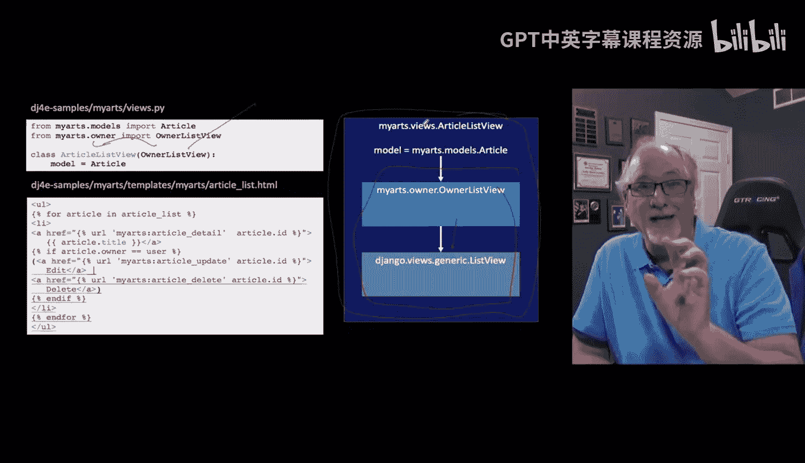

## 概述

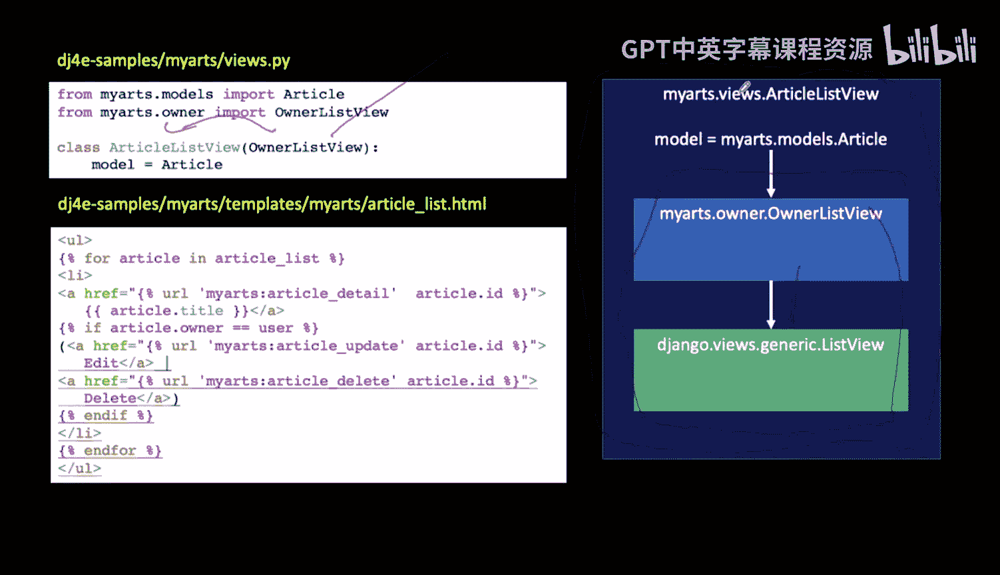

我们将创建一个名为`owner.py`的文件，其中包含一系列自定义的视图类（如`OwnerListView`、`OwnerUpdateView`等）。这些类将扩展Django的通用视图，并添加额外的逻辑来根据当前登录的用户过滤数据。核心思想是：在模型中添加一个`owner`字段（外键关联到Django的用户模型），然后在视图中重写某些方法，以确保数据操作的安全性。

---

## 模型层的修改

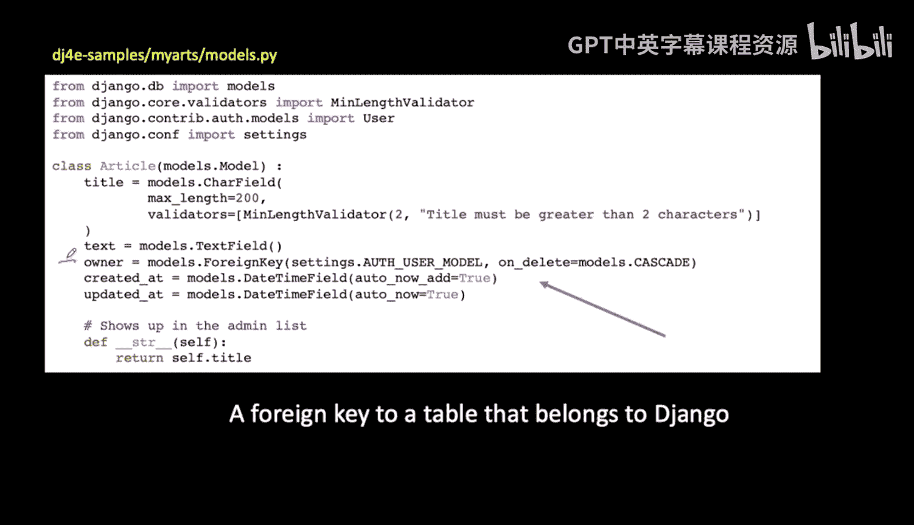


上一节我们介绍了视图的基本结构，本节中我们来看看如何修改模型以支持所属行功能。

首先，我们需要在`Article`模型中添加一个`owner`字段。这个字段是一个外键，指向Django内置的`User`模型。以下是修改后的模型代码：

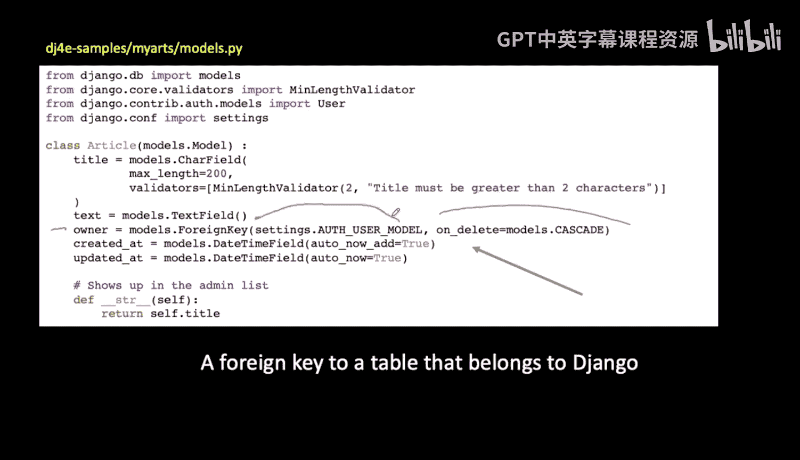

```python
from django.db import models
from django.conf import settings

class Article(models.Model):
    title = models.CharField(max_length=200)
    text = models.TextField()
    created_at = models.DateTimeField(auto_now_add=True)
    updated_at = models.DateTimeField(auto_now=True)
    owner = models.ForeignKey(
        settings.AUTH_USER_MODEL,
        on_delete=models.CASCADE
    )
```

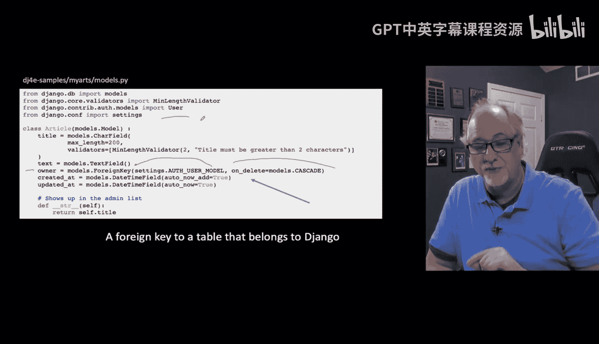

**代码解释**：
*   `owner = models.ForeignKey(...)`：这行代码是关键。它创建了一个指向用户模型的外键关系。
*   `settings.AUTH_USER_MODEL`：这是Django推荐的方式，用于引用用户模型。它允许项目灵活地使用自定义用户模型。
*   `on_delete=models.CASCADE`：这是一个级联删除选项。它意味着如果关联的用户被删除，那么属于该用户的所有文章也将被自动删除，以保持数据的一致性。

这个`owner`字段将用于在数据库层面建立文章与用户之间的关联。

---

## 视图层的实现

现在，我们来看看如何创建自定义的视图类。我们将不再直接使用Django的通用视图（如`generic.ListView`），而是创建自己的视图类（如`OwnerListView`），并在其中添加所属逻辑。

以下是`owner.py`文件的基本结构：

```python
from django.views.generic import ListView, DetailView, CreateView, UpdateView, DeleteView
from django.contrib.auth.mixins import LoginRequiredMixin

class OwnerListView(ListView):
    """所有者的列表视图基类。"""
    pass

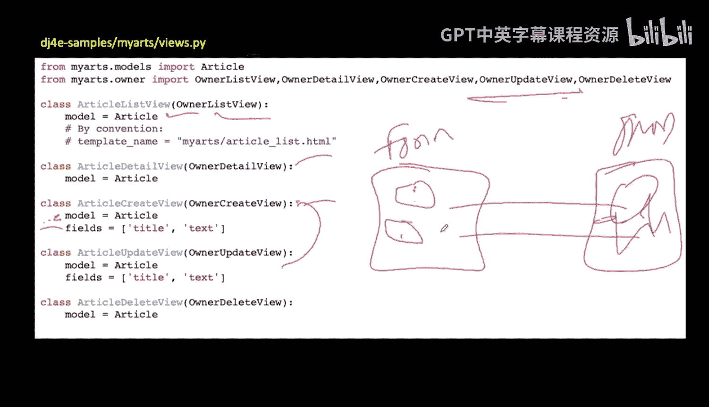

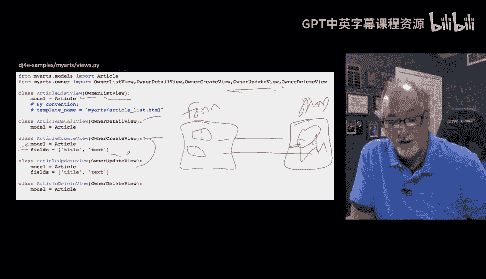

class OwnerDetailView(DetailView):
    """所有者的详情视图基类。"""
    pass

class OwnerCreateView(LoginRequiredMixin, CreateView):
    """所有者的创建视图基类。"""
    pass

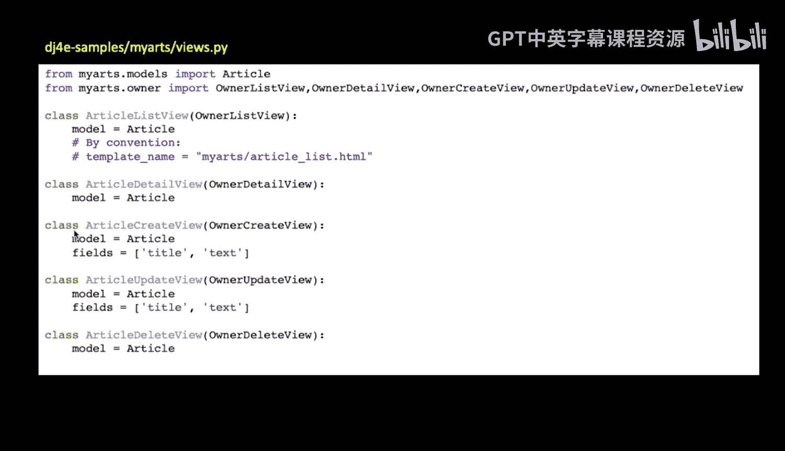

class OwnerUpdateView(LoginRequiredMixin, UpdateView):
    """所有者的更新视图基类。"""
    pass


class OwnerDeleteView(LoginRequiredMixin, DeleteView):
    """所有者的删除视图基类。"""
    pass
```

**注意**：对于`CreateView`、`UpdateView`和`DeleteView`，我们混入了`LoginRequiredMixin`。这确保了只有登录的用户才能访问这些视图。如果未登录的用户尝试访问，他们将被重定向到登录页面。

---

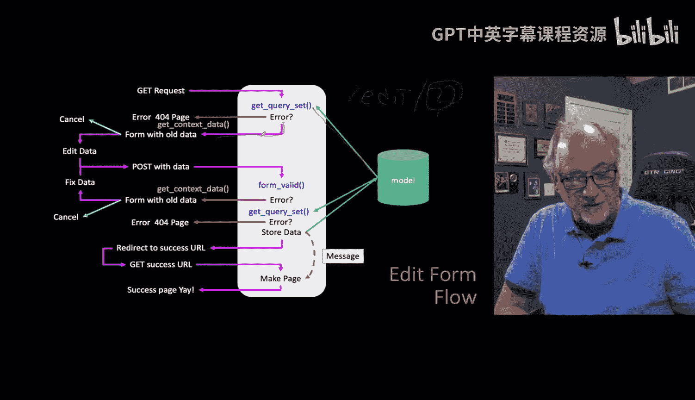

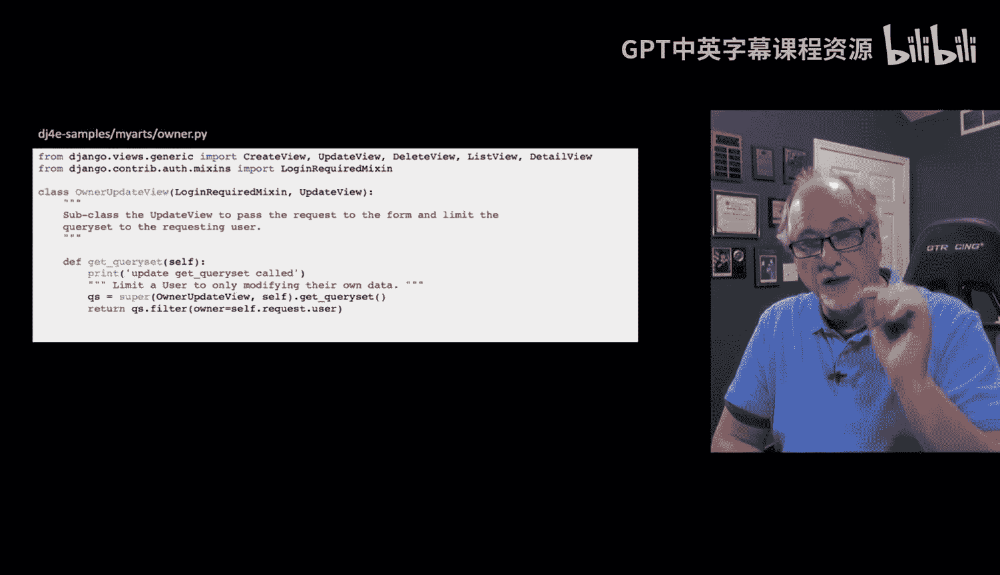


### 重写 `get_queryset` 方法

对于`OwnerUpdateView`和`OwnerDeleteView`，我们需要确保用户只能修改或删除他们自己拥有的数据。这可以通过重写`get_queryset`方法来实现。

以下是`OwnerUpdateView`中重写`get_queryset`的示例：

```python
class OwnerUpdateView(LoginRequiredMixin, UpdateView):
    def get_queryset(self):
        """
        重写此方法，只返回当前用户拥有的对象。
        """
        qs = super().get_queryset()
        return qs.filter(owner=self.request.user)
```

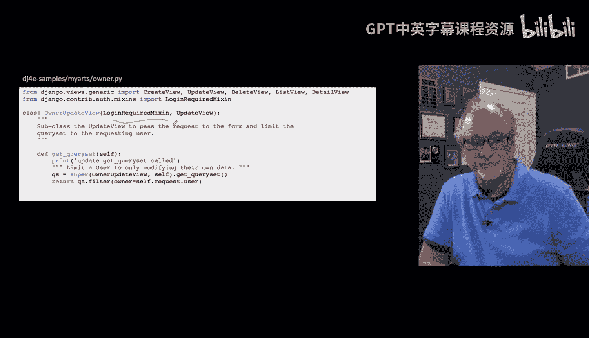

**方法解释**：
1.  `qs = super().get_queryset()`：首先调用父类（`UpdateView`）的`get_queryset`方法，获取默认的查询集。
2.  `return qs.filter(owner=self.request.user)`：然后，我们在这个查询集上添加一个额外的过滤器，只保留`owner`字段等于当前登录用户（`self.request.user`）的记录。

这样，当用户尝试编辑一个不属于他们的文章时，`get_queryset`将返回一个空的查询集，Django会自动返回一个404（未找到）错误，从而保护了数据。

---

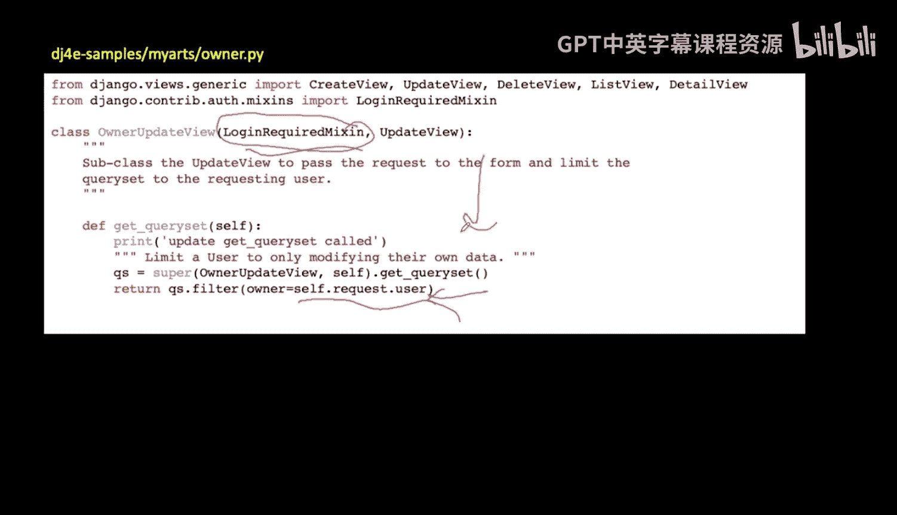


### 重写 `form_valid` 方法

对于`OwnerCreateView`，我们需要在保存新文章时自动将当前用户设置为`owner`。这可以通过重写`form_valid`方法来实现。

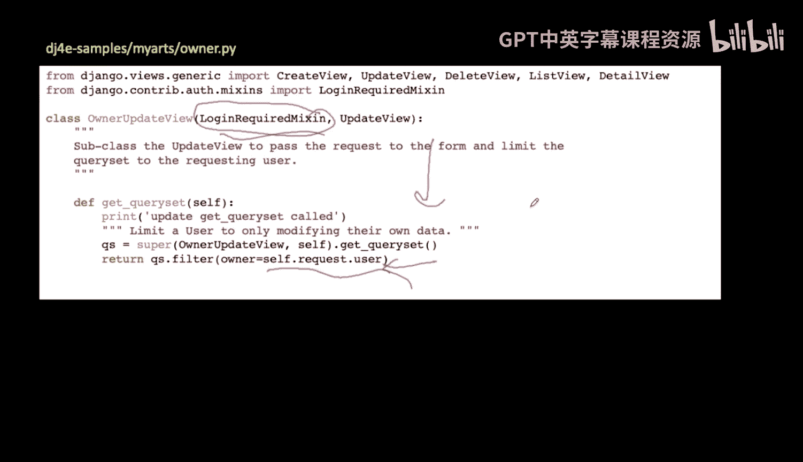

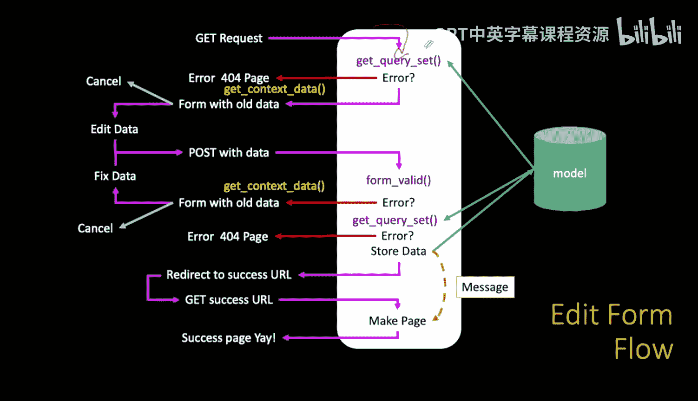

以下是`OwnerCreateView`中重写`form_valid`的示例：

```python
class OwnerCreateView(LoginRequiredMixin, CreateView):
    def form_valid(self, form):
        """
        在表单验证通过后，自动设置owner为当前用户。
        """
        # 暂时不保存到数据库，先获取对象实例
        object = form.save(commit=False)
        # 将当前用户设置为owner
        object.owner = self.request.user
        # 现在保存到数据库
        object.save()
        # 调用父类的form_valid方法完成后续操作（如重定向）
        return super().form_valid(form)
```

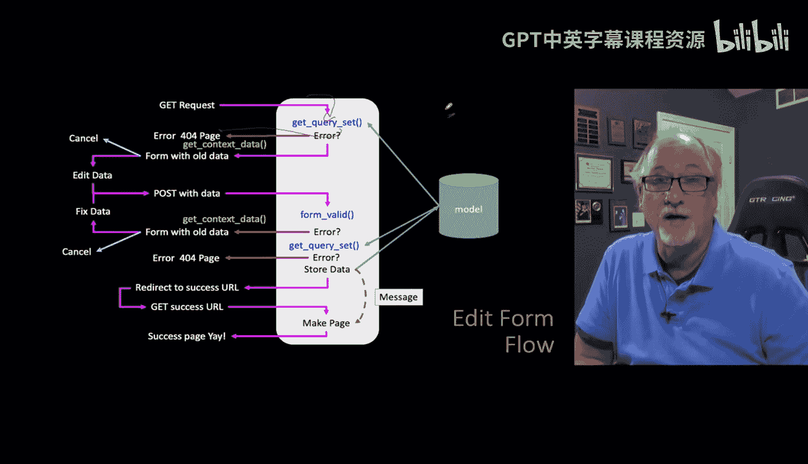

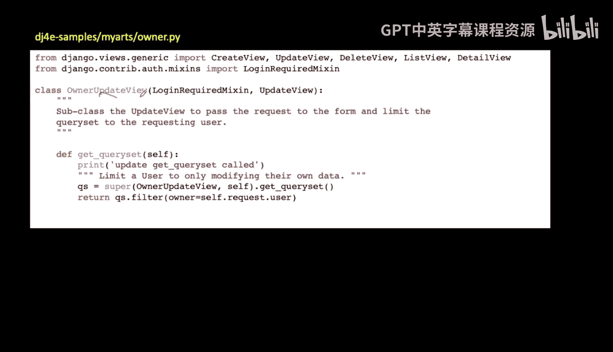

**方法解释**：
1.  `object = form.save(commit=False)`：`form.save(commit=False)`会创建一个模型对象实例，但不会立即保存到数据库。这允许我们在保存之前修改对象的属性。
2.  `object.owner = self.request.user`：我们将当前登录的用户赋值给对象的`owner`字段。
3.  `object.save()`：现在，我们将对象（包含新设置的`owner`）保存到数据库。
4.  `return super().form_valid(form)`：最后，我们调用父类的`form_valid`方法来执行标准的后续操作，例如重定向到成功页面。

这样，即使用户在表单中看不到`owner`字段，新创建的文章也会自动关联到他们。

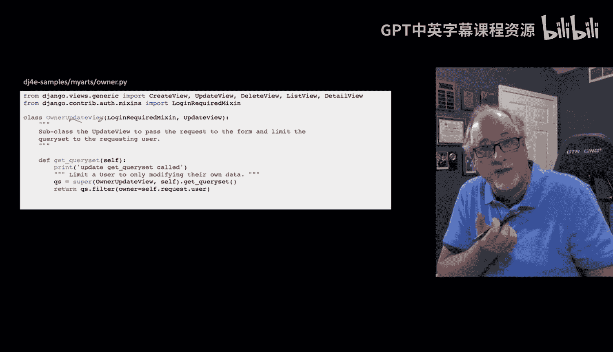

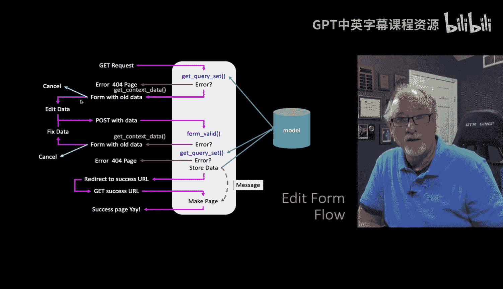

---

## 在应用中使用自定义视图

创建了`owner.py`中的基类后，我们在应用的`views.py`中使用它们就非常简单了。以下是`Article`相关的视图示例：

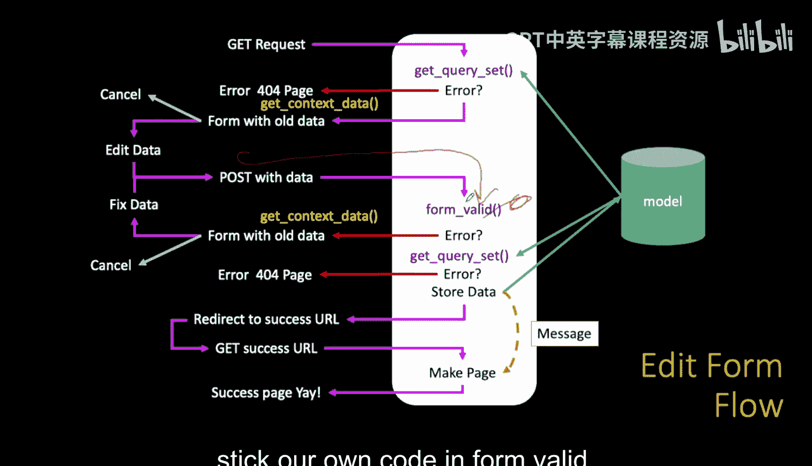

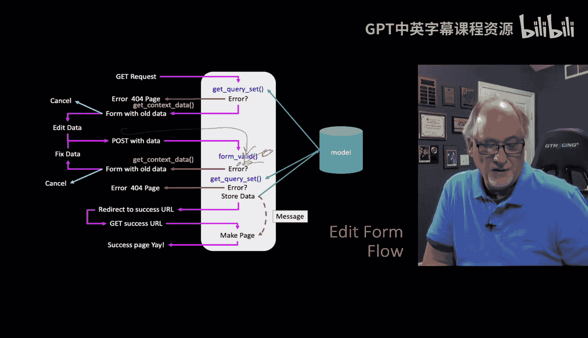

```python
from .models import Article
from .owner import OwnerCreateView, OwnerUpdateView, OwnerDeleteView, OwnerListView, OwnerDetailView

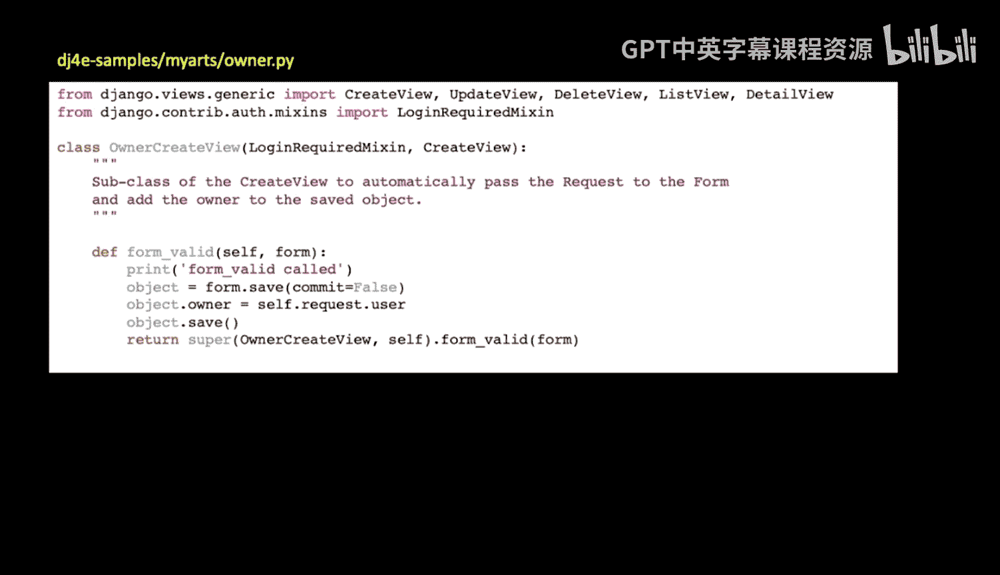

class ArticleListView(OwnerListView):
    model = Article
    # template_name 默认为 'article_list.html'
    # context_object_name 默认为 'article_list'

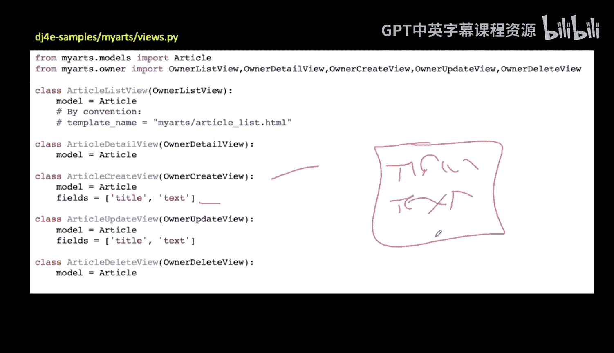

class ArticleDetailView(OwnerDetailView):
    model = Article

class ArticleCreateView(OwnerCreateView):
    model = Article
    fields = ['title', 'text'] # 只允许用户编辑标题和内容

class ArticleUpdateView(OwnerUpdateView):
    model = Article
    fields = ['title', 'text']

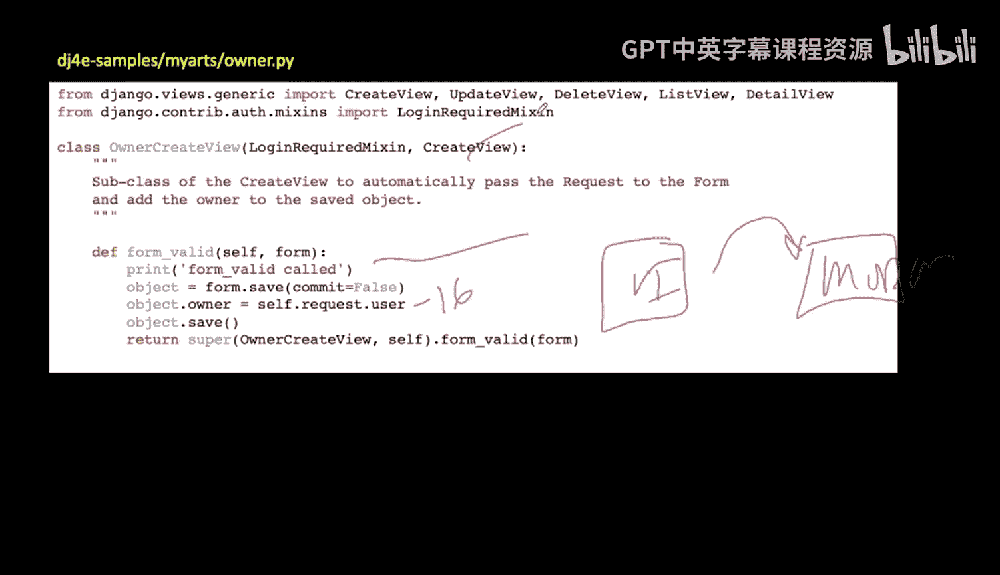

class ArticleDeleteView(OwnerDeleteView):
    model = Article
```

**代码解释**：
*   我们的`ArticleListView`现在继承自`OwnerListView`，而不是`generic.ListView`。对于列表和详情视图，`Owner`版本目前没有额外逻辑，但为未来扩展提供了统一的基础。
*   `ArticleCreateView`和`ArticleUpdateView`的`fields`属性指定了哪些字段应该出现在表单中。注意，我们没有包含`owner`、`created_at`或`updated_at`字段，因为这些字段是自动处理的。
*   通过继承`OwnerDeleteView`，删除操作也自动受到了保护，用户只能删除自己的文章。

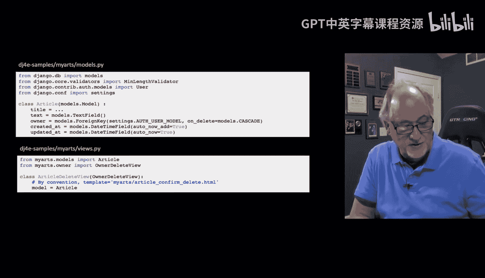

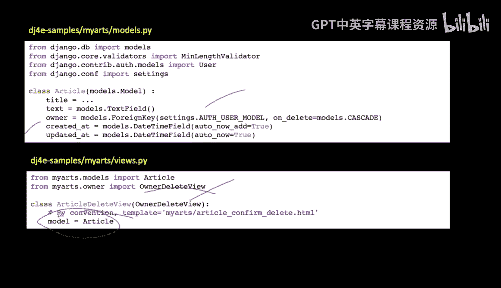

---

## 总结

本节课中我们一起学习了如何在Django中实现“所属行”功能。我们主要完成了以下工作：

1.  **修改模型**：在`Article`模型中添加了`owner`字段，作为指向用户模型的外键。
2.  **创建自定义视图基类**：在`owner.py`文件中创建了`OwnerListView`、`OwnerCreateView`、`OwnerUpdateView`和`OwnerDeleteView`等类。
3.  **实现访问控制**：
    *   通过`LoginRequiredMixin`确保只有登录用户才能进行创建、更新和删除操作。
    *   通过重写`OwnerUpdateView`和`OwnerDeleteView`的`get_queryset`方法，确保用户只能操作自己拥有的数据。
    *   通过重写`OwnerCreateView`的`form_valid`方法，在创建新对象时自动关联当前用户。
4.  **应用自定义视图**：在应用的`views.py`中，让我们自己的视图（如`ArticleCreateView`）继承自`owner.py`中的基类，从而轻松获得所有安全功能。

这种方法充分体现了Django“不要重复自己”（DRY）的原则和面向对象编程的强大之处。我们通过创建可重用的基类，将所属逻辑封装在一处，从而简化了具体视图的代码，并确保了整个应用数据访问的一致性。