# Django for Everybody：4：浏览器中的JavaScript

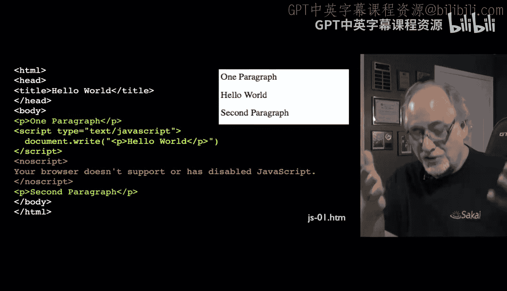

## 概述

在本节中，我们将学习如何在浏览器中使用JavaScript。这是JavaScript最原始和核心的用途之一，即增强HTML页面的交互性。我们将探讨JavaScript与HTML结合的基本方式、调试技巧以及开发工具的使用。

## 在HTML中嵌入JavaScript

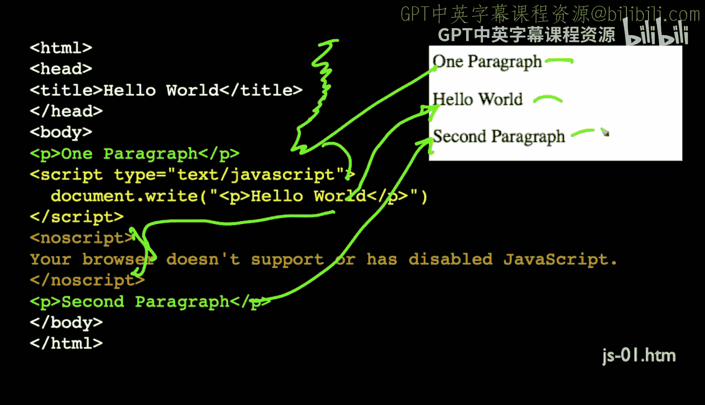

上一节我们介绍了JavaScript的基本概念，本节中我们来看看如何将其与HTML结合使用。JavaScript最初的设计目的就是在浏览器中运行，以增强HTML页面的功能。

以下是一个简单的HTML示例，其中包含了JavaScript代码：

```html
<!DOCTYPE html>
<html>
<body>
    <p>第一段来自HTML。</p>
    <script>
        document.write("第二段来自JavaScript。");
    </script>
    <noscript>您的浏览器不支持JavaScript。</noscript>
    <p>第三段来自HTML。</p>
</body>
</html>
```

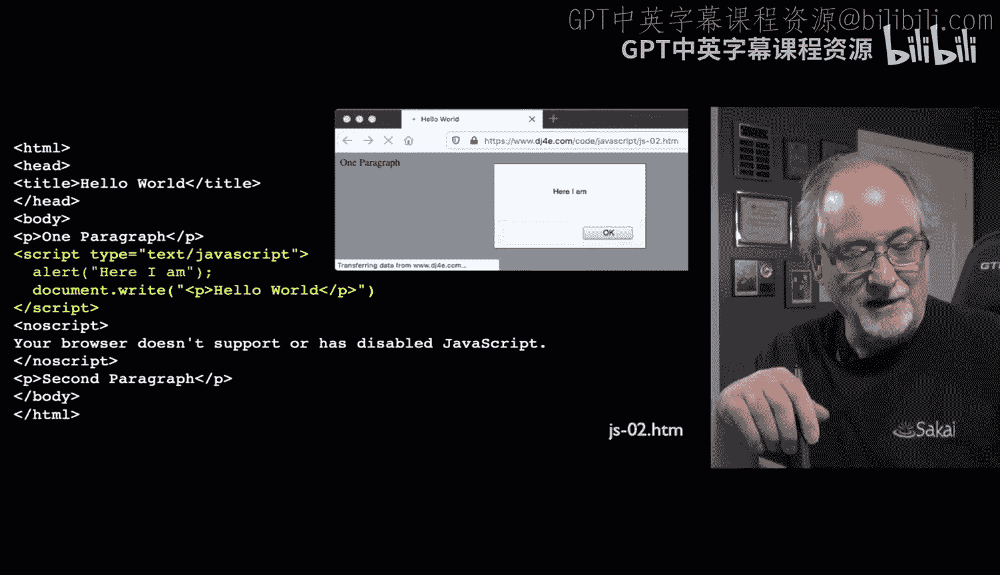

在这段代码中，`<script>`标签标志着我们离开了HTML语法，开始编写JavaScript代码。`document`对象代表了浏览器中你看到的页面部分（即文档对象模型DOM）。通过`document.write()`方法，JavaScript可以直接向屏幕输出内容。

当浏览器解析此页面时，会依次输出：第一段HTML文本、JavaScript写入的文本、以及最后的第三段HTML文本。这演示了JavaScript在网页加载过程中能够访问并修改屏幕内容的能力，这种能力非常强大。

## 使用`alert()`进行调试

学习新编程语言时，第一件事通常是打印调试信息。在浏览器JavaScript中，我们可以使用`alert()`函数。

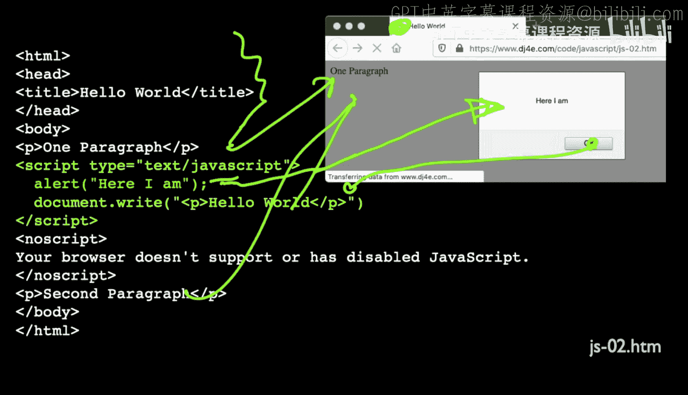

```javascript
alert("Hello World");
```

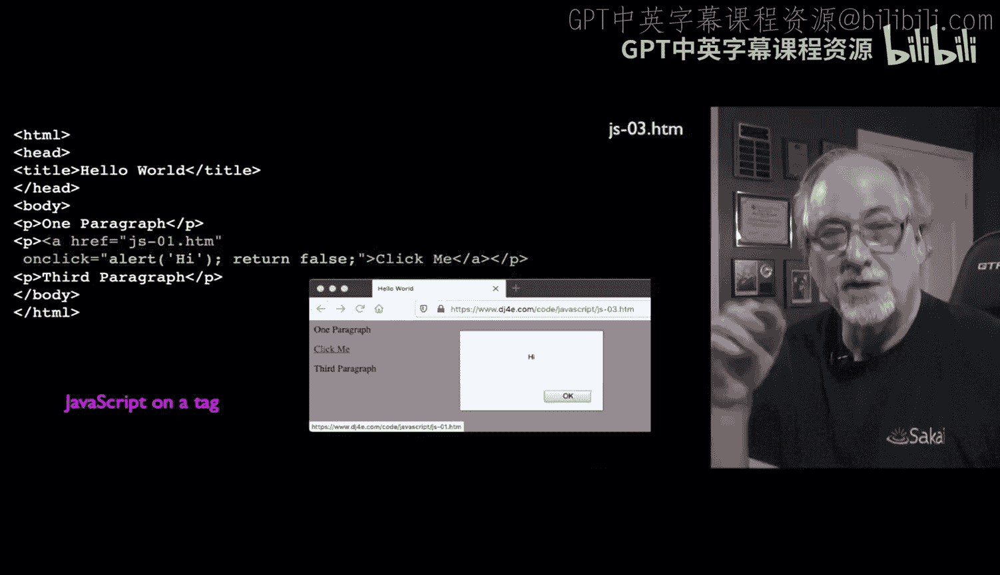

`alert()`函数会弹出一个对话框显示传入的字符串，并**暂停**JavaScript的执行。用户必须点击“确定”按钮后，程序才会继续运行。这对于快速检查某段代码是否被执行非常有用。

请看以下示例：

```html
<p>页面加载中...</p>
<script>
    alert("我在这里！");
    document.write("Hello World");
</script>
<p>页面加载完成。</p>
```

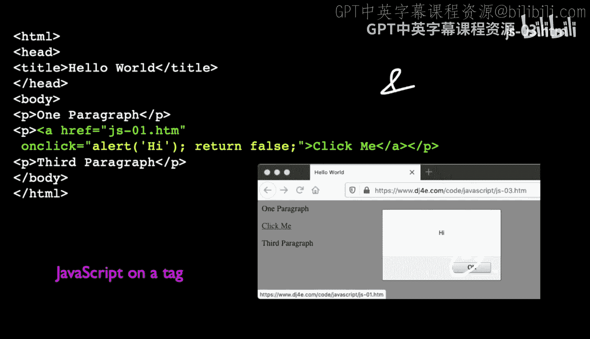

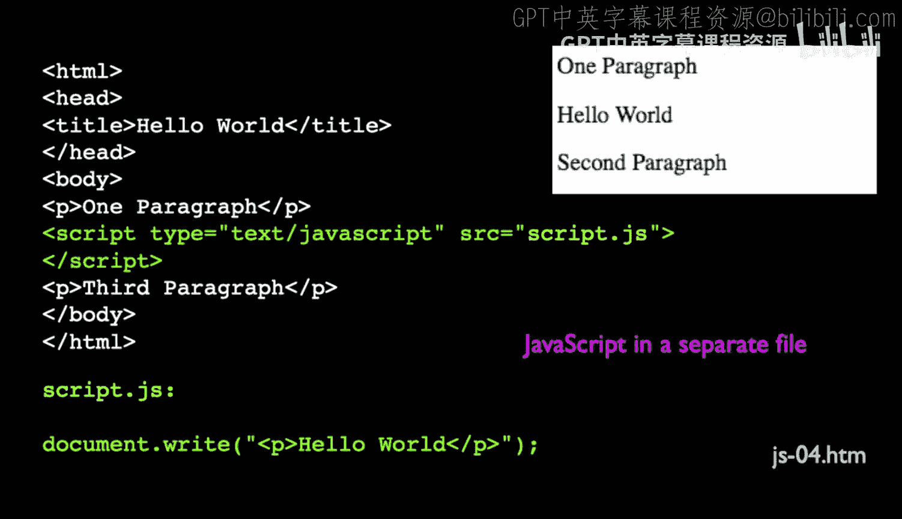

当浏览器解析到`<script>`标签时，会切换到JavaScript执行模式。`alert()`弹窗会阻塞浏览器，整个页面渲染过程会暂停，直到用户点击确认。之后，JavaScript会继续执行`document.write(“Hello World”)`，并最终渲染最后一个段落。

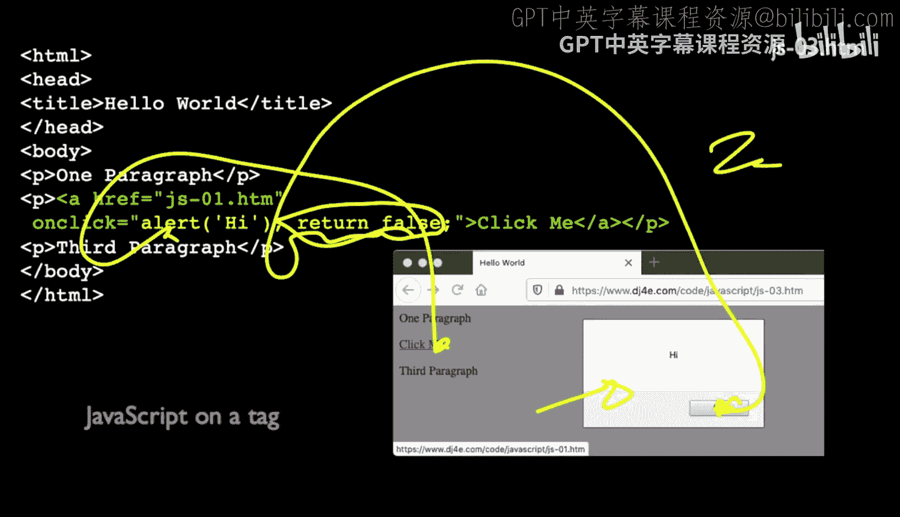

需要注意的是，`alert()`会完全中断用户体验，因此不宜过度使用，尤其在循环中。

## 引入JavaScript的三种方式

有三种主要方式可以将JavaScript代码引入网页。

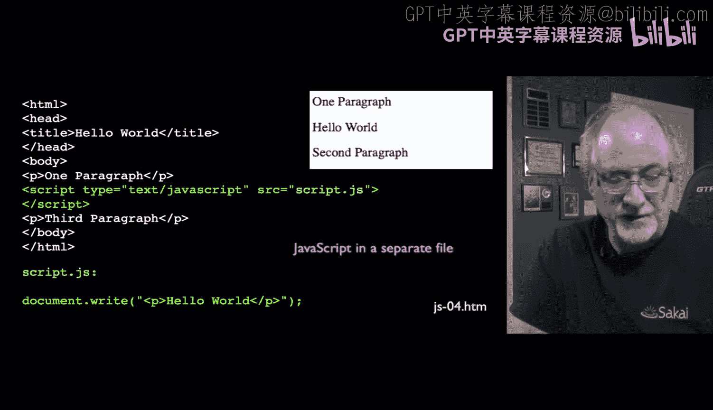

### 1. 内联脚本
即直接在HTML文件中使用`<script>`标签包裹代码，如上文所示。

### 2. 事件处理程序
我们可以将JavaScript代码作为HTML标签的事件属性值。这是一种事件驱动编程。

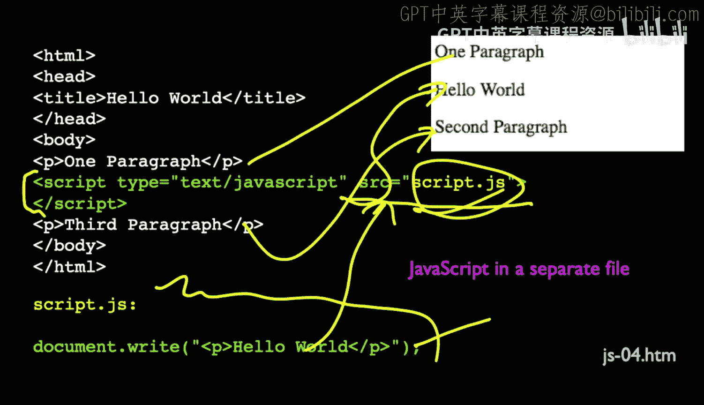

```html
<a href="http://www.dr-chuck.com" onclick="alert('已点击'); return false;">点击我</a>
```

在这个例子中，`onclick`属性内的`alert(‘已点击’); return false;`就是JavaScript代码。当用户点击这个链接时，会触发`onclick`事件，执行这段代码。`return false;`的作用是告诉浏览器不要跟随链接的`href`跳转，即由JavaScript完全处理这次点击事件。

### 3. 外部脚本文件
最常用的方式是将JavaScript代码保存在独立的`.js`文件中，然后在HTML中引用。

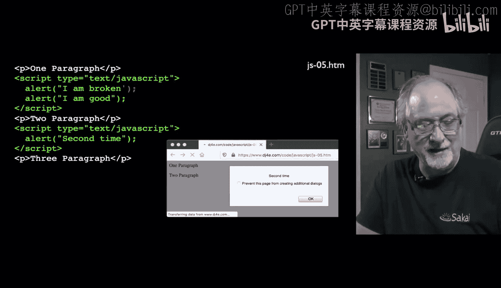

假设我们有一个`script.js`文件：
```javascript
// script.js
document.write("Hello World");
```

在HTML中这样引入它：
```html
<script src="script.js"></script>
```

浏览器会加载并解析`script.js`文件中的代码并执行。通常，外部脚本文件用于定义一系列函数，构成一个函数库，供页面中的其他脚本后续调用。

## 处理JavaScript语法错误

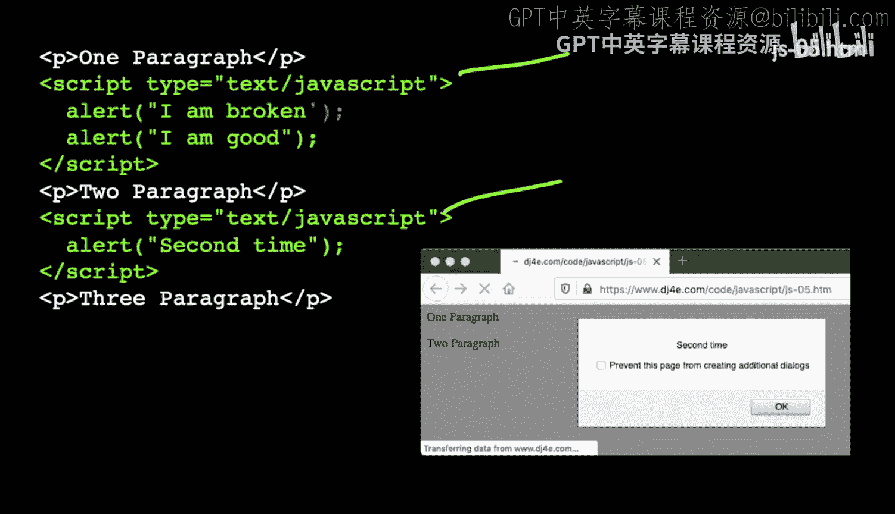

在编程中难免会出现语法错误。但在网页环境中，如果JavaScript代码存在语法错误，浏览器默认不会向普通用户显示错误信息，而是会**停止执行**出错点之后的所有JavaScript代码。

请看以下示例：
```html
<script>
    alert("第一个警告"); // 假设此行有语法错误
    alert("你不会看到这个警告");
</script>
<p>第一段文本</p>
<script>
    alert("第二个警告");
</script>
<p>第二段文本</p>
```

如果第一个`<script>`块的第一行存在语法错误，那么该块内其后的所有代码都会被忽略。浏览器会继续解析HTML，渲染段落，直到遇到下一个`<script>`标签时，才会重新开始解析和执行JavaScript。因此，用户会看到“第一段文本”，但看不到第一个警告和“你不会看到这个警告”这个警告，然后会看到“第二个警告”和“第二段文本”。

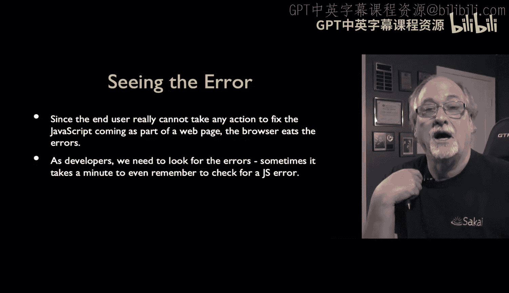

这意味着，一个脚本文件中的语法错误可能会使该文件中定义的大量函数失效。因此，在开发过程中，及时发现错误至关重要。

## 使用开发者控制台

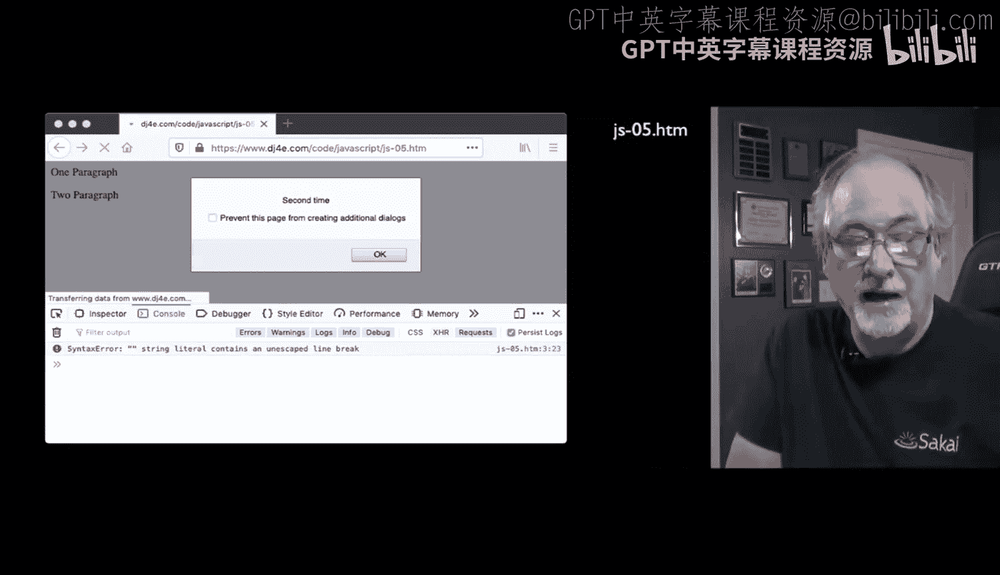

由于错误对用户不可见，开发者必须借助浏览器提供的“开发者工具”来调试。

所有现代浏览器（Chrome, Firefox, Safari等）都内置了开发者工具。你可以通过右键点击页面选择“检查”或按F12键打开它。在开发者工具中，“控制台”（Console）标签页专门用于显示JavaScript的错误信息和调试输出。

在开发JavaScript时，务必保持控制台处于打开状态。否则，代码修改后看似没有效果，可能仅仅是因为一个上游的语法错误导致后续代码被忽略，而你却无从知晓。

## 更好的调试方法：`console.log()`

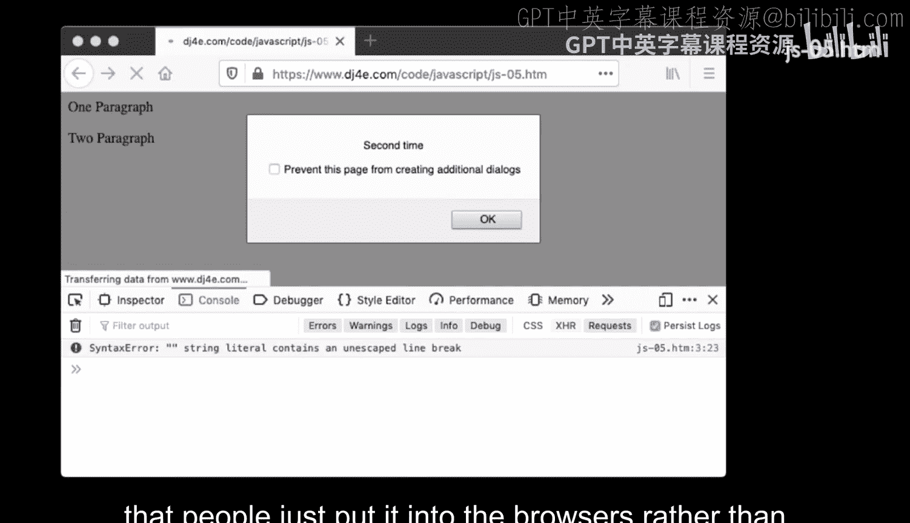

虽然`alert()`可以用于调试，但它会中断程序。更优的选择是使用`console.log()`函数。

```javascript
console.log("这是一个调试信息");
```

`console.log()`会将信息输出到浏览器的开发者控制台，而**不会**暂停脚本执行。你可以在循环中或任何地方使用它，不会干扰用户体验。

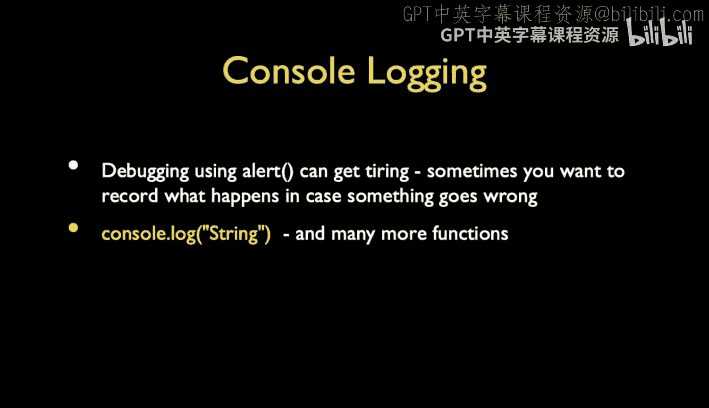

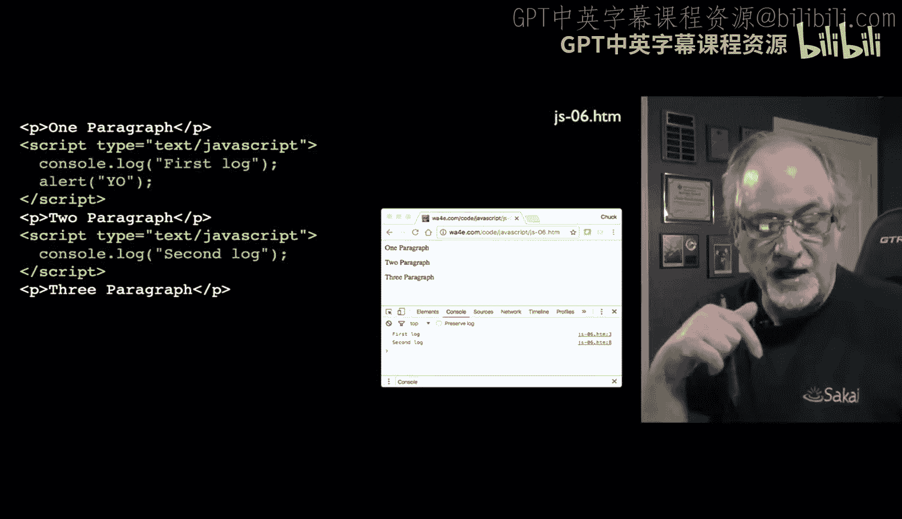

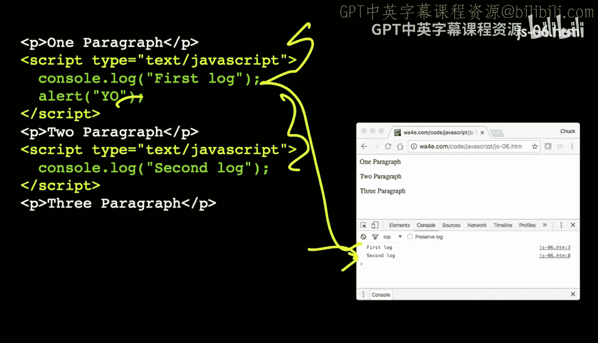

例如：
```html
<button onclick="console.log('按钮被点击'); alert('弹出框！'); console.log('弹出框已确认');">点击测试</button>
```

点击按钮后，你可以在控制台看到两条日志，同时页面上会弹出警告框。这是一种更高效、更专业的调试方式。在复杂的系统中，有时甚至会保留一些`console.log()`语句，以便在生产环境中为其他开发者提供线索。

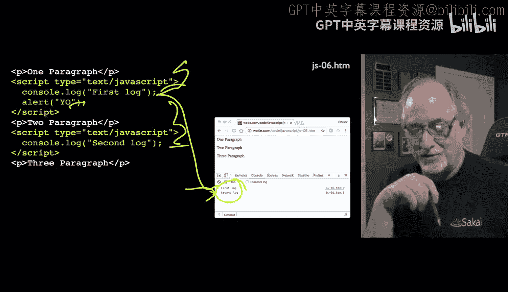

## 使用调试器设置断点

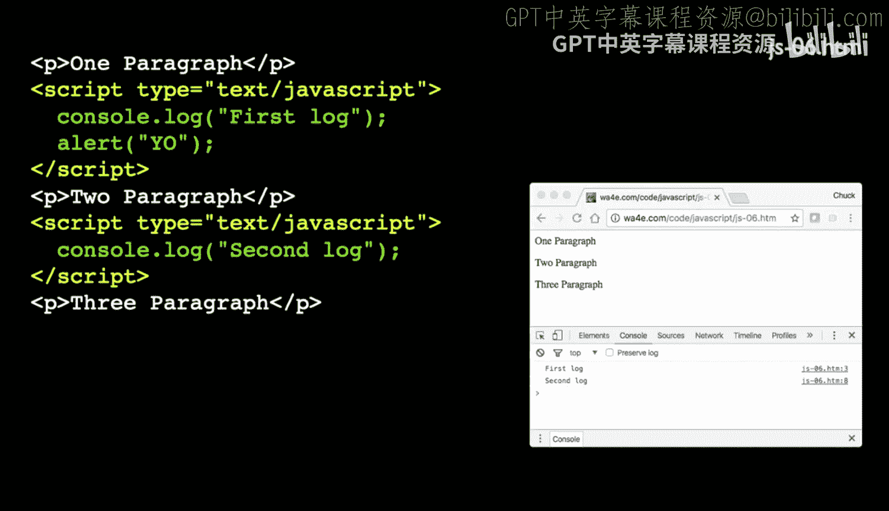

浏览器开发者工具还提供了功能完整的JavaScript调试器。在“源代码”（Sources）标签页中，你可以查看页面加载的所有JavaScript文件。

你可以点击行号来设置断点。设置断点后，需要刷新页面。当JavaScript执行到该断点时，程序会暂停，此时你可以检查变量的值、单步执行代码，从而深入理解程序的运行状态。

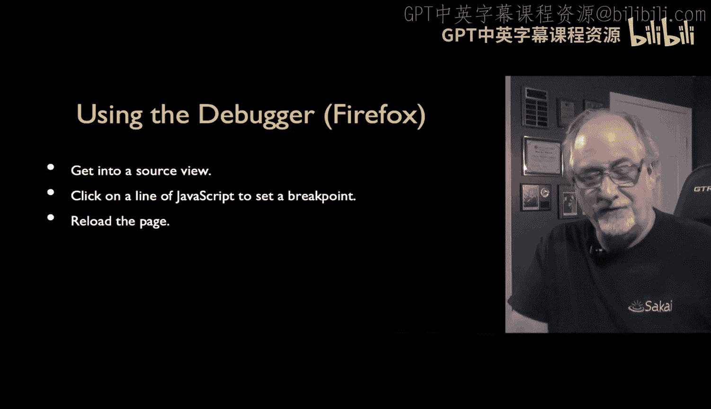

需要注意的是，你不能在代码执行过后再“回溯”设置断点。必须提前设置好断点，然后刷新页面，让浏览器在重新执行时捕获它。

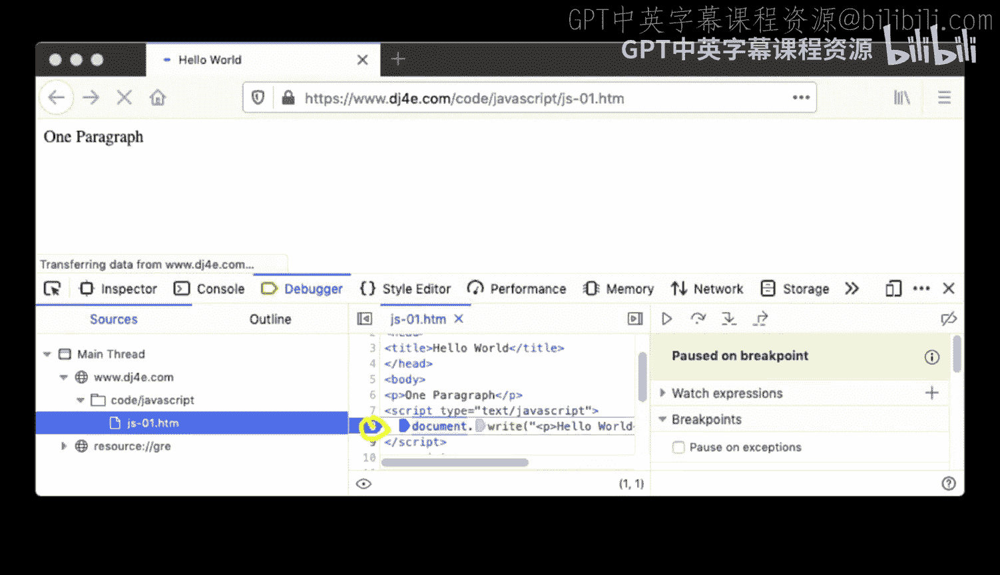

## 总结

本节课中我们一起学习了在浏览器中使用JavaScript的核心知识。我们了解了三种引入JavaScript代码的方式：内联脚本、事件处理属性和外部文件。我们掌握了使用`alert()`进行快速调试，以及更优的`console.log()`方法和开发者控制台的使用。我们还学习了如何处理语法错误以及如何利用浏览器内置的调试器设置断点。这些技能是进行前端Web开发的基础，无论后续学习jQuery、Vue等库或框架，还是Node.js服务器端开发，理解这些原生JavaScript在浏览器中的行为都至关重要。