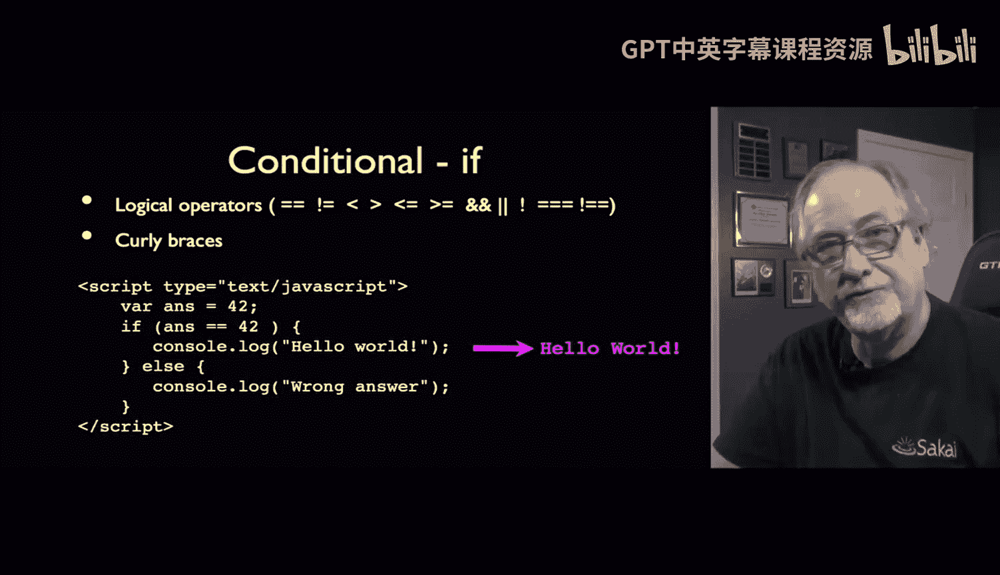
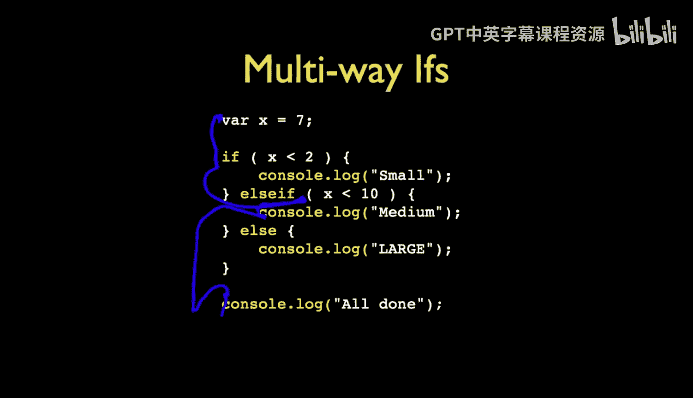
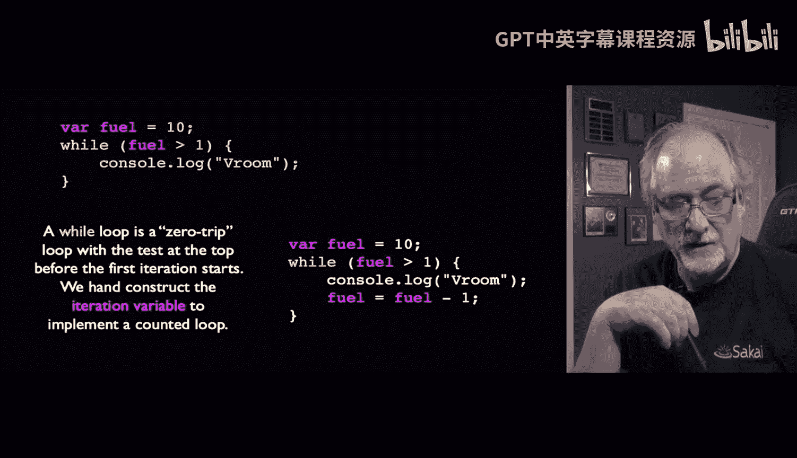
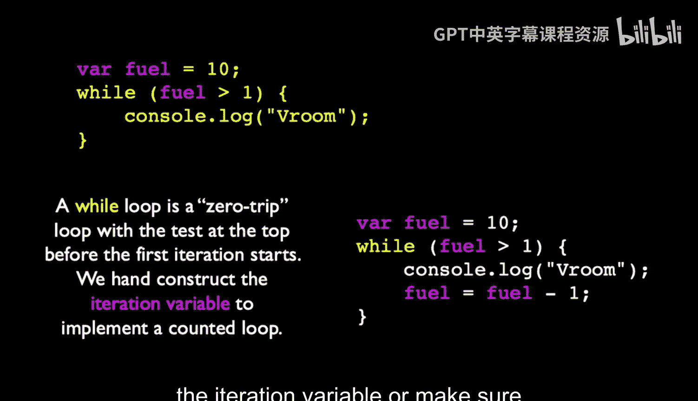
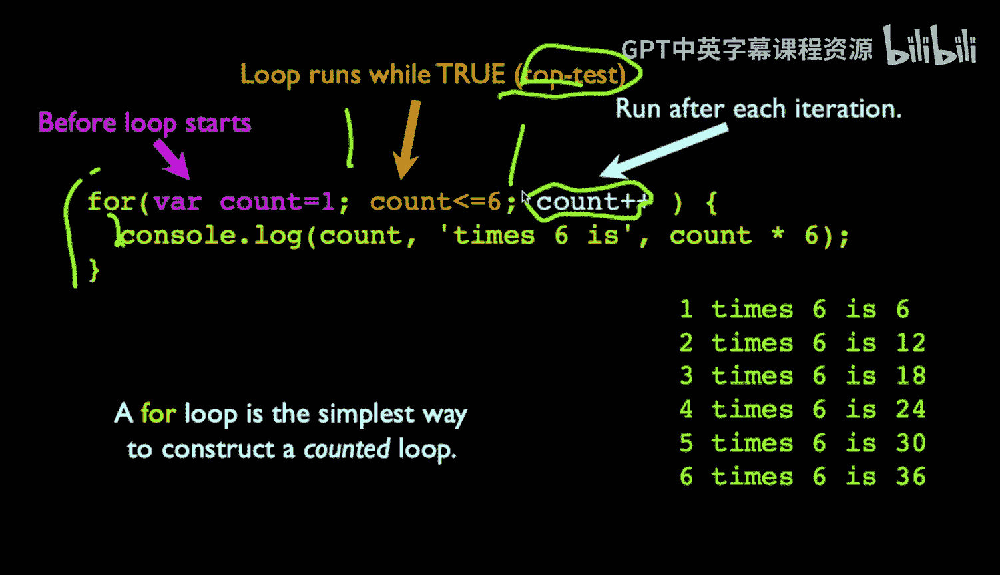
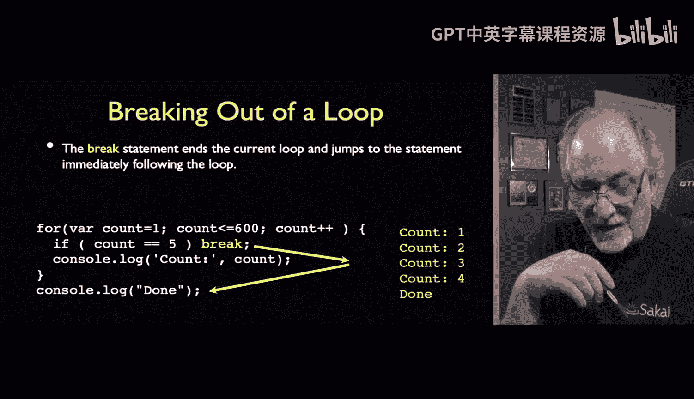
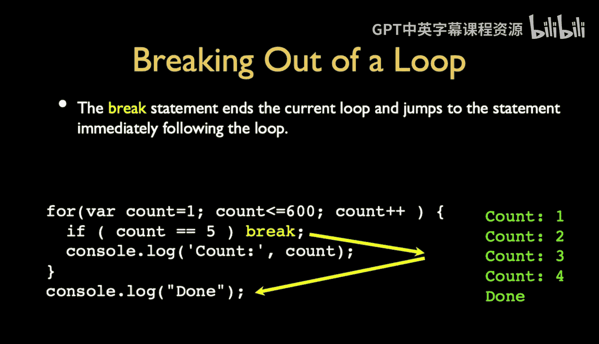
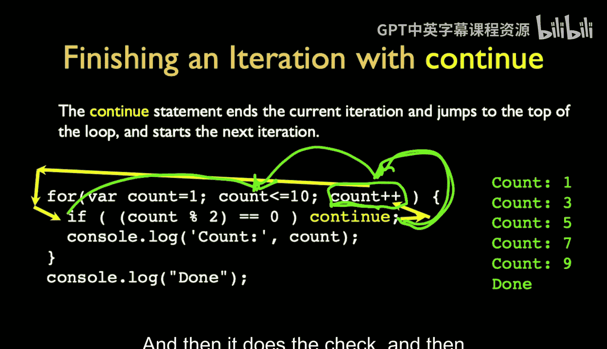
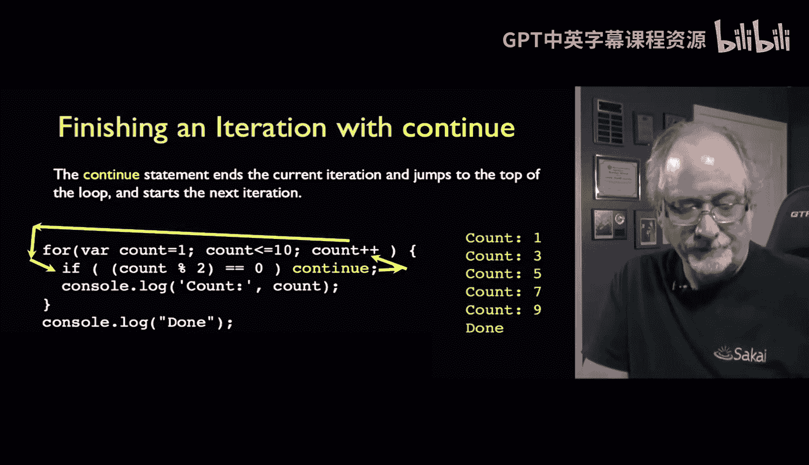
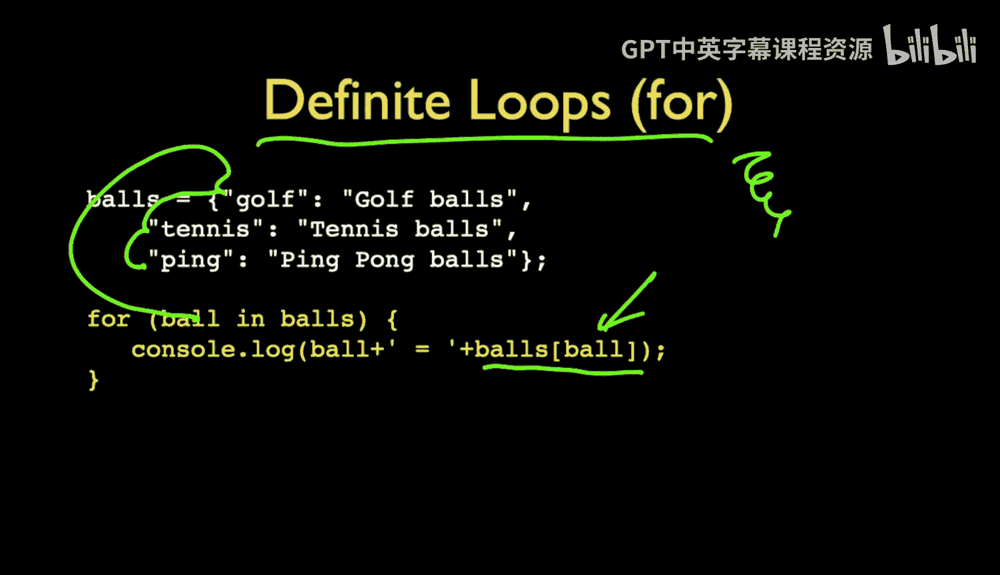

# 016：JavaScript控制结构

在本节课中，我们将要学习JavaScript中的控制结构，包括条件判断和循环。理解这些概念是编写任何程序逻辑的基础。



## 条件判断：if语句

上一节我们介绍了变量和运算符，本节中我们来看看如何使用它们进行条件判断。每种编程语言都有`if`语句，JavaScript也不例外。

我们使用花括号 `{}` 来标记受`if`语句影响的代码块的开始和结束。

以下是`if`语句的基本结构：
```javascript
if (answer === 42) {
    console.log("Hello world");
} else {
    console.log("Goodbye");
}
```
在这段代码中，如果变量`answer`的值严格等于42，则执行第一个代码块，打印“Hello world”；否则，执行`else`块中的代码，打印“Goodbye”。代码块内可以包含多行语句，这里为简洁只展示了一行。

## 多路分支：else if





你可以通过`else if`将多个条件串联起来，就像在Python中一样。程序会按顺序检查这些条件。

以下是多路`if`语句的示例：
```javascript
if (score >= 90) {
    grade = 'A';
} else if (score >= 80) {
    grade = 'B';
} else if (score >= 70) {
    grade = 'C';
} else {
    grade = 'F';
}
```
程序会从上到下依次检查条件。一旦某个条件为真，就会执行对应的代码块，然后直接跳到整个`if`语句的末尾，不会同时检查所有条件。最后的`else`子句是可选的，如果所有`if`和`else if`条件都不满足，则会执行`else`块中的代码。

## 不定循环：while循环

接下来，我们看看循环结构。`while`循环是一种不定循环，只要条件为真就会一直执行。它是一个“零次或多次”循环，意味着循环体可能一次都不执行。

以下是`while`循环的示例：
```javascript
let fuel = 10;
while (fuel > 1) {
    console.log("vroom");
    fuel = fuel - 1;
}
```
在这个例子中，只要`fuel`大于1，就会不断打印“vroom”并将`fuel`减1，直到`fuel`不大于1时循环结束。如果忘记在循环体内更新条件变量（例如`fuel`），就可能导致无限循环。因此，构造`while`循环时需要确保循环最终能够终止。

## 计数循环：for循环



`for`循环是一种计数循环，结构上包含三个部分，用分号分隔。

以下是`for`循环的结构：
```javascript
for (let count = 1; count <= 6; count++) {
    console.log(count);
}
```
*   第一部分 (`let count = 1`)：在循环开始前执行，用于初始化迭代变量。
*   第二部分 (`count <= 6`)：这是循环条件，在每次迭代前检查。只要条件为真，就执行循环体。
*   第三部分 (`count++`)：在每次循环体执行完毕后执行，通常用于更新迭代变量。

这个循环会依次打印数字1到6。当`count`变为7时，条件`count <= 6`为假，循环结束。在Python中，我们常用`range()`函数来实现类似功能。

## 循环控制：break与continue



在循环中，有时我们需要更精细地控制流程。JavaScript提供了`break`和`continue`语句。



`break`语句用于立即跳出当前所在的循环（如果是嵌套循环，则跳出最内层循环），继续执行循环之后的代码。



`continue`语句用于跳过当前循环迭代中剩余的语句，直接开始下一次迭代。在`for`循环中，执行`continue`后，仍会执行第三部分的增量表达式，然后再进行条件判断。

它们的用法与在Python中基本相同。





## 遍历对象与数组

最后，我们来看看如何遍历数据结构。对于对象（类似于Python的字典或关联数组），可以使用`for...in`循环来遍历其属性键。

以下是遍历对象的示例：
```javascript
let balls = {golf: "Titleist", tennis: "Wilson", ping: "Ping"};
for (let ball in balls) {
    console.log(ball + ": " + balls[ball]);
}
```
在这个循环中，迭代变量`ball`会依次代表对象的每个键（如“golf”、“tennis”、“ping”），然后我们可以通过`balls[ball]`来获取对应的值。



而对于数组（线性列表），我们通常使用前面介绍的计数`for`循环来遍历，而不是`for...in`循环。

本节课中我们一起学习了JavaScript的核心控制结构：使用`if`、`else if`和`else`进行条件分支；使用`while`和`for`进行循环迭代；以及使用`break`和`continue`控制循环流程。我们还了解了如何遍历对象和数组。掌握这些知识能帮助你阅读和理解大部分JavaScript代码的逻辑。