# 025：使用JavaScript操作文档对象模型(DOM) 🧩

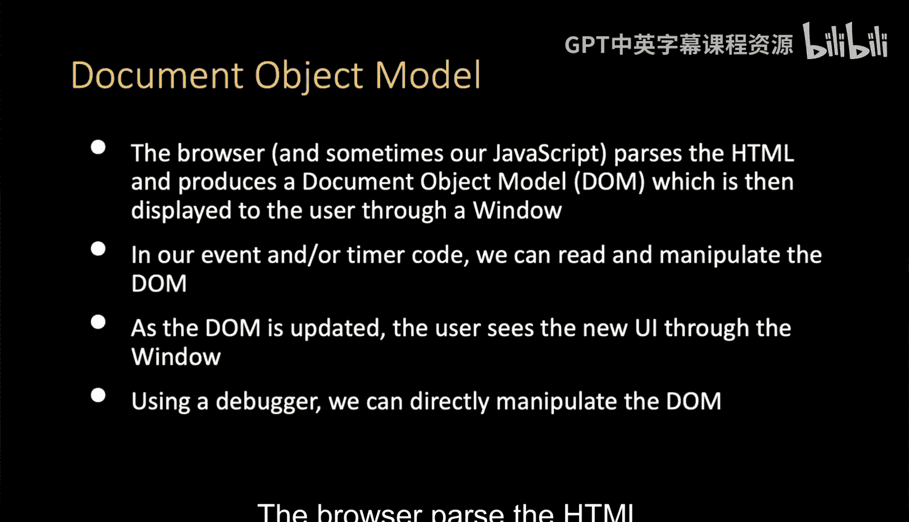

在本节课中，我们将要学习JavaScript如何控制浏览器中的文档对象模型（DOM）。DOM是网页内容的结构化表示，JavaScript可以读取、修改和更新它，从而动态改变用户看到的界面。

---

上一节我们介绍了JavaScript在浏览器中的角色，本节中我们来看看它如何具体操作DOM。

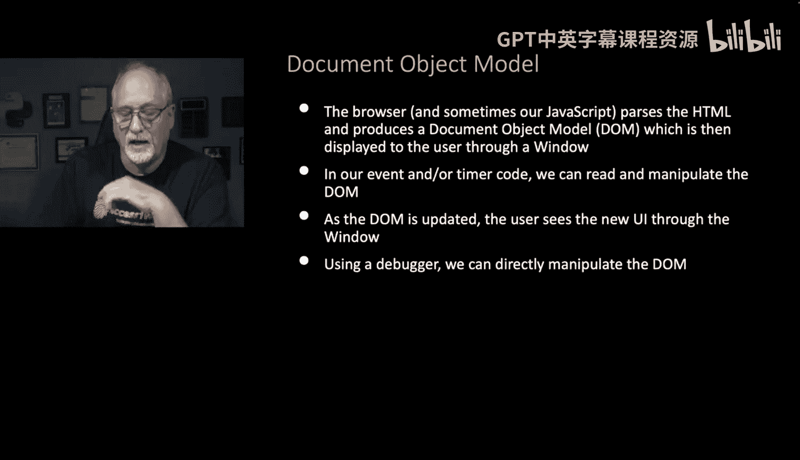

JavaScript拥有对文档对象模型的控制权。文档对象模型是我们查看浏览器时所看到的内容。浏览器解析HTML，有时我们的JavaScript会写入内容，然后创建这个我们称之为文档对象模型的对象，最终通过一个窗口展示给用户。窗口是文档对象模型的一个子集。

在我们编写的任何JavaScript代码中，都可以读取、操作和更新DOM。一旦DOM被更新，用户就能通过窗口立即看到这些变化。

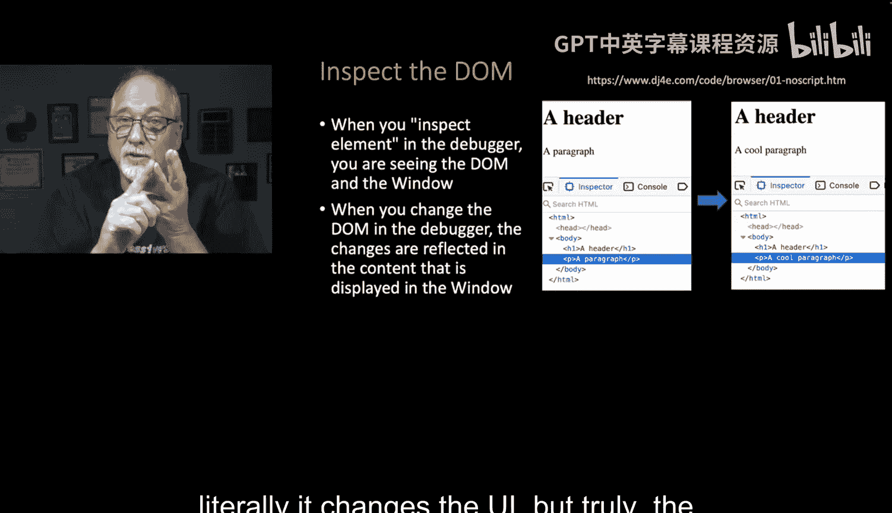

我们也可以直接进入调试器并操作文档对象模型。例如，回到一个没有JavaScript的页面（01 No script），它只显示一个标题和一个段落，这就是一个文档对象模型。但如果你进入“检查元素”模式，然后定位到那个段落标签，你可以修改它，比如添加单词“Co”。

从某种意义上说，调试器本身就是JavaScript，如果你操作得当，实际上可以在调试器中输入JavaScript命令。调试器同样“拥有”文档对象模型。因此，你可以简单地改变文档对象模型，并且这确实会改变用户界面。你甚至可以改变标签的类型，比如将一个段落标签改为锚点标签，或者添加一些属性。你改变了DOM，你就能看到变化。

---

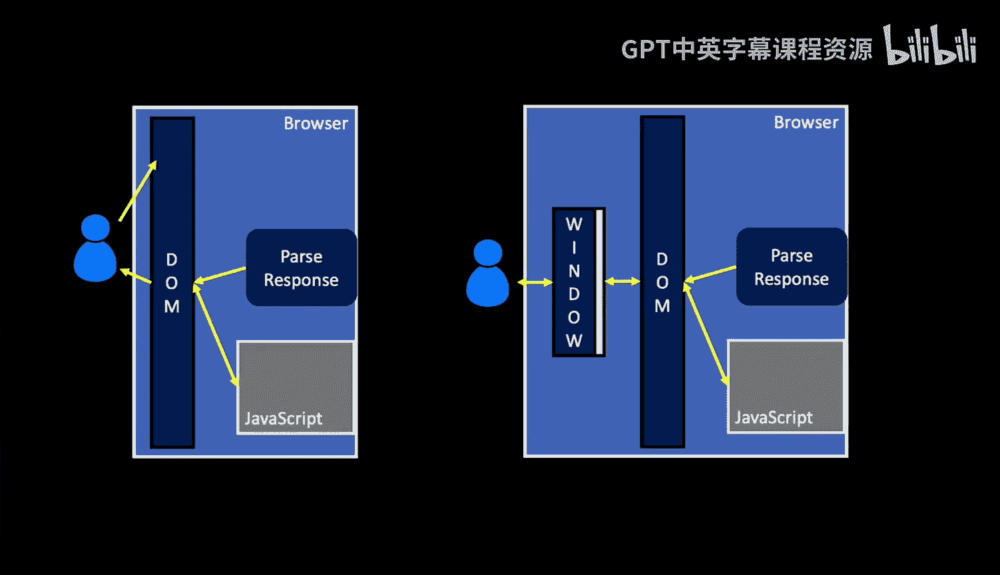

之前提到了“窗口”这个概念。在浏览器的JavaScript环境中，有两个基础对象：DOM和窗口。

DOM是一个抽象概念，它是标签（或元素）的结构化层次。窗口是我们看到它的方式。你可以想象我展示的这张图：解析响应、运行一些JavaScript、调整文档对象模型，然后展示给用户。

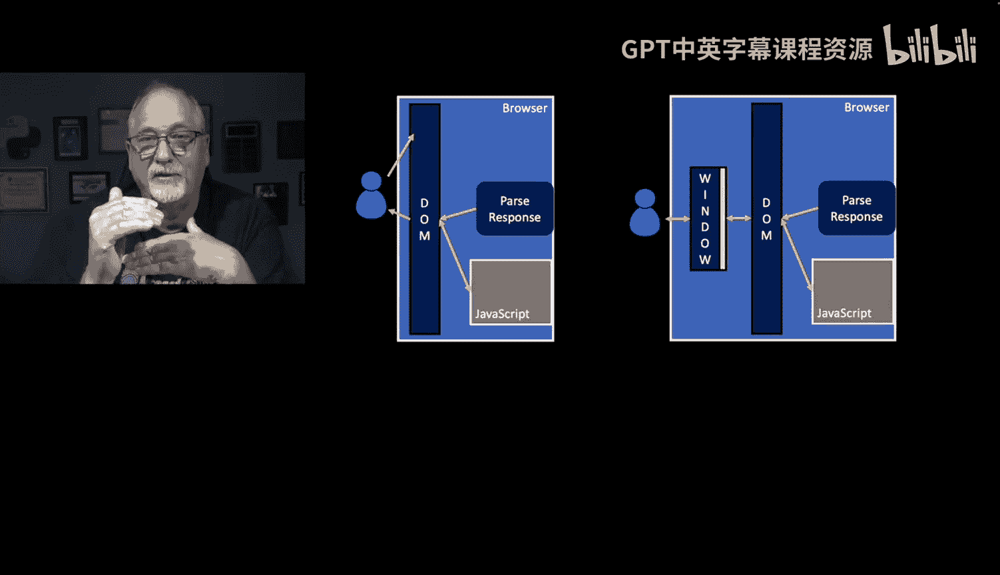

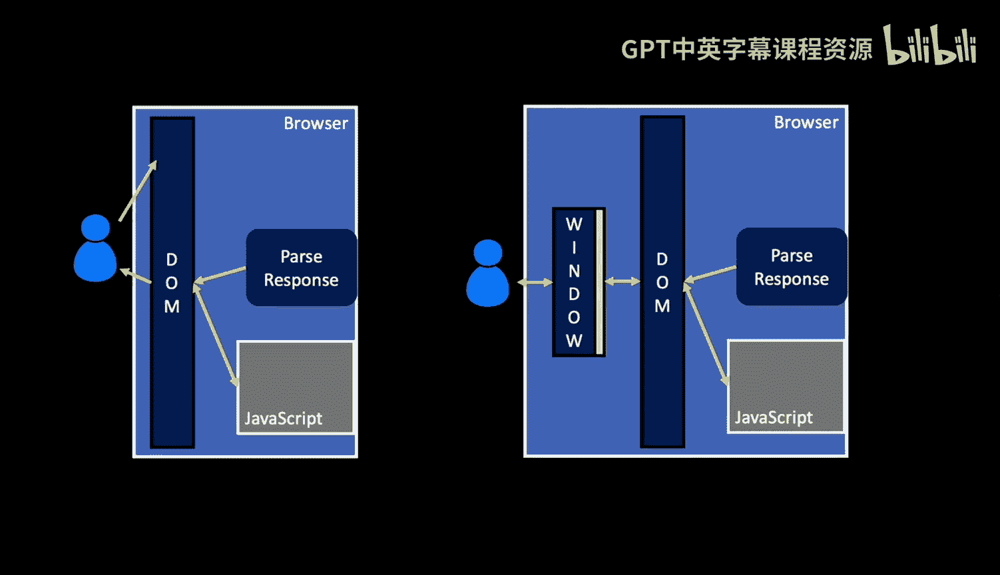

如果你改变了文档对象模型，它会立即更新。左边的图是一种简化，因为我们实际上是通过窗口来查看文档对象模型的。窗口就是你屏幕上的内容。

最容易演示这一点的方法是理解：文档对象模型可能非常大，而窗口可能非常小。文档对象模型本身不变，但你可以来回调整窗口大小。所以有时你会看到滚动条。滚动条不是文档对象模型中的概念，而是窗口的概念。窗口有特定的高度，文档对象模型可能无法完全放入窗口，这就与窗口高度有关，从而产生了滚动条。

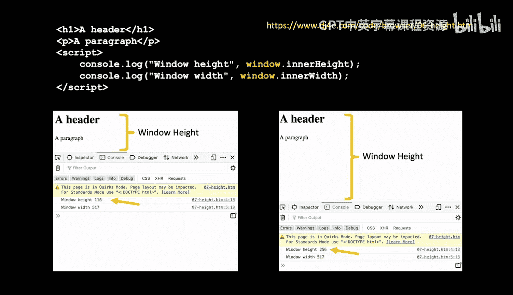

---

例如，如果你查看 `06height.html` 这个文件，它只是输出一个标题、一个段落，然后打印出窗口的高度和宽度：`window.innerHeight` 和 `window.innerWidth`。这些是窗口的高度和宽度，而不是文档对象模型的尺寸，是我们查看它的窗口的尺寸。因此，如果你在一个非常小的窗口中打开这个页面并开启调试器，它会显示高度是116。如果你把窗口调大并重新加载，高度会变成256。所以，在JavaScript中，我们可以询问窗口的信息，也可以对窗口进行操作。我们可以做的一件事是上下滚动窗口，这在JavaScript中很常见。如果你有一个很大的文档对象模型和一个带滚动条的窗口，并且你想向用户展示特定内容（比如跳到底部），JavaScript可以将窗口滚动到底部或顶部。我们可以控制窗口。在这个例子中，我们只是询问它有多高多宽，但我们也可以控制它。

---

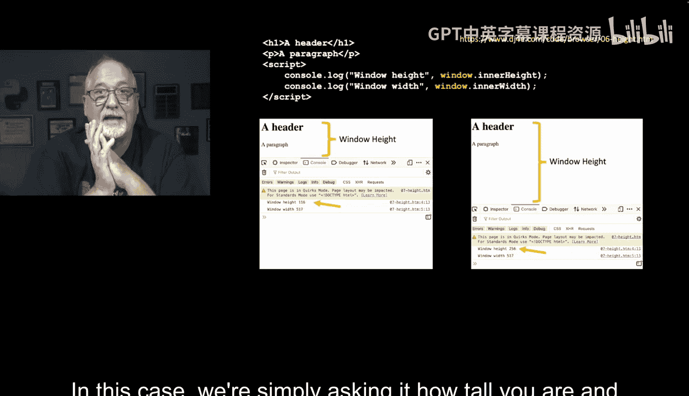

现在，如果我们查看 `07scroll.html`，可以看到它有一个标题和九个段落，这就是实际内容。

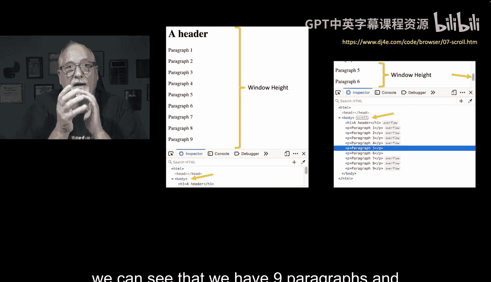

如果我们有一个很高的窗口，可以看到整个文档。但如果我们把窗口调小，就只能看到文档对象模型的一部分，这时窗口高度就变了。

现在你有了一个滚动条。滚动条的作用是什么？它只是上下移动文档对象模型。更准确地说，它移动的是我们对文档对象模型的视图部分。如果你在某些浏览器中进行“检查元素”操作，你会看到它通过一些小的标注告诉我们，当前正文正在滚动，段落4以上的内容溢出到屏幕上方，段落7、8、9则溢出到屏幕下方。如果你调整窗口大小并刷新页面，你会看到这些变化。在窗口足够大时，整个内容都显示出来，正文就不会被标记为可滚动元素，标题也没有溢出，等等。你可以用不同尺寸的窗口尝试，刷新页面，然后检查元素，观察滚动、溢出和滚动条的行为。在这个例子中，我没有打印高度，但你会看到高度实际上在变化。

---

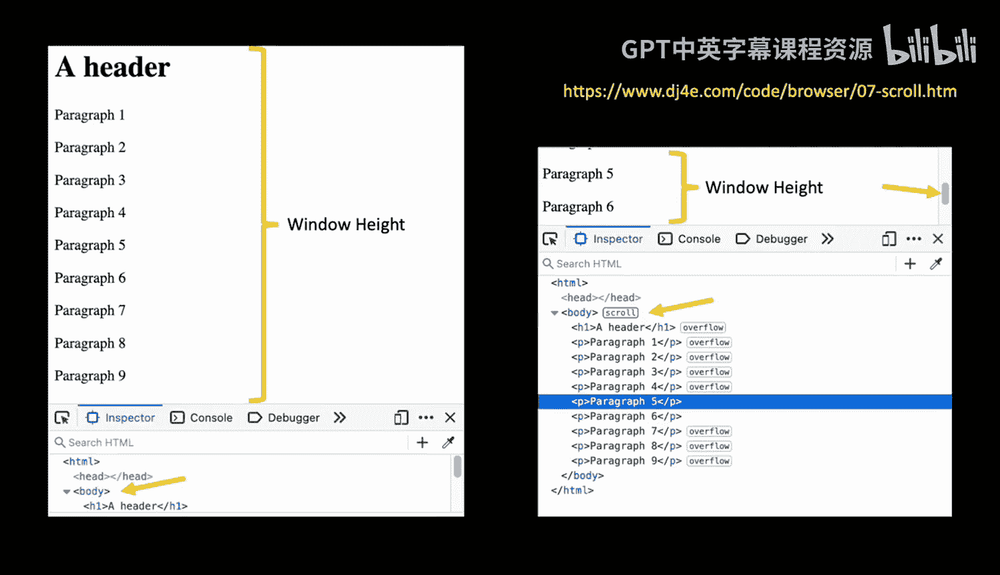

接下来我们要做的一件事，就是在JavaScript中修改文档对象模型。

---

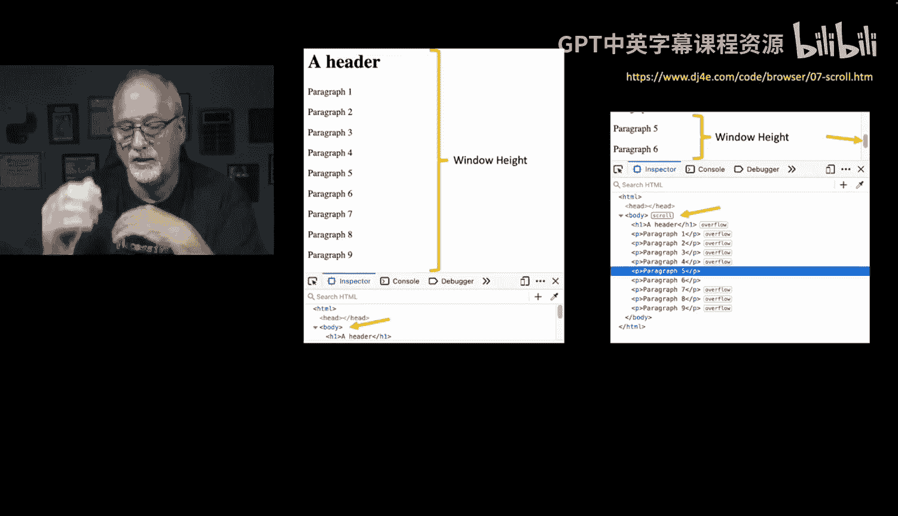

本节课中我们一起学习了JavaScript如何通过操作文档对象模型（DOM）来动态控制网页内容。我们了解了DOM与窗口的区别，以及如何通过JavaScript读取和修改DOM，从而实时更新用户界面。我们还看到了如何通过调试器直接操作DOM，并理解了窗口尺寸和滚动行为对视图的影响。