# 027：浏览器中的JavaScript事件处理

在本节课中，我们将学习浏览器中的JavaScript事件处理机制。我们将了解什么是事件、如何注册事件监听器，以及一些常见的事件类型，如点击事件、窗口调整大小事件和页面内容加载完成事件。

## 事件处理概述

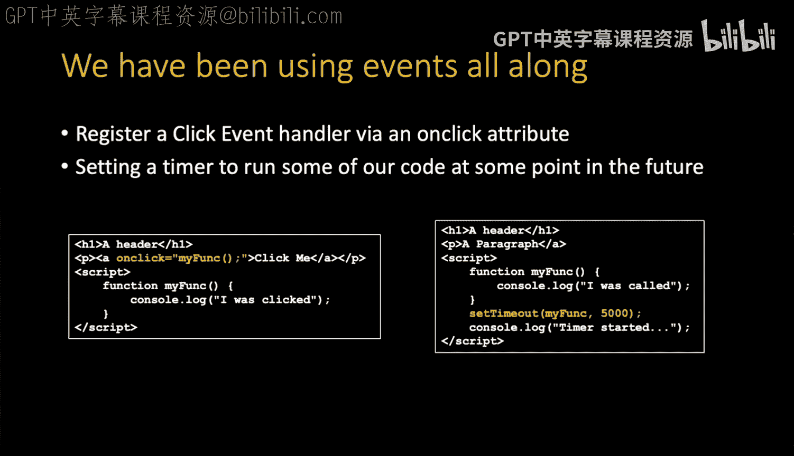

上一节我们介绍了JavaScript的基本概念。本节中，我们来看看浏览器中的事件处理。事件是浏览器中发生的特定动作，例如用户点击按钮、调整窗口大小或页面加载完成。JavaScript允许我们“监听”这些事件，并在事件发生时执行特定的代码。

## 事件注册的两种方式

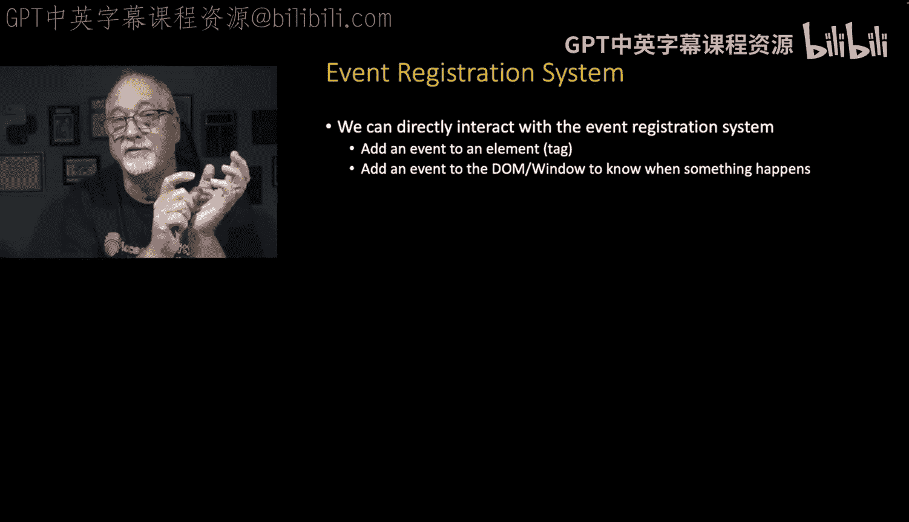

在JavaScript中，有两种主要方式可以为HTML元素注册事件处理程序。


### 使用 `onclick` 属性

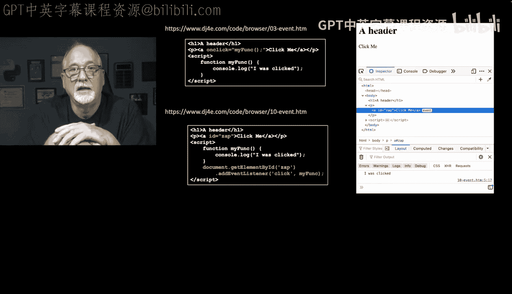

第一种方式是使用HTML元素的 `onclick` 属性。这是一种快捷方式，直接在HTML标签内指定当点击事件发生时要调用的函数。

```html
<a href="#" onclick="myFunc()">点击我</a>
```

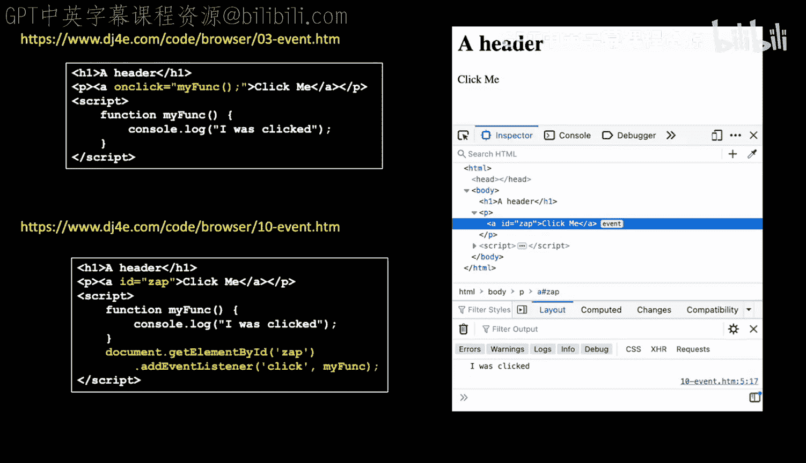

当您使用浏览器开发者工具检查此元素时，会看到它有一个关联的点击事件。

### 使用 `addEventListener` 方法

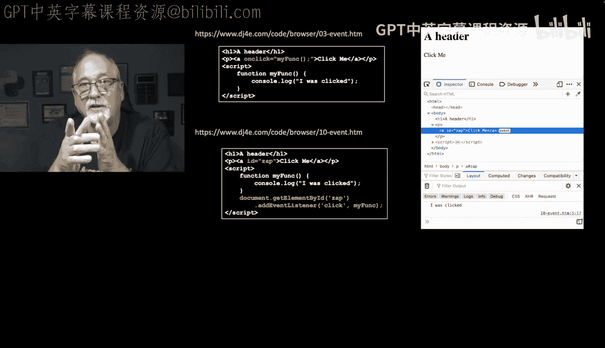

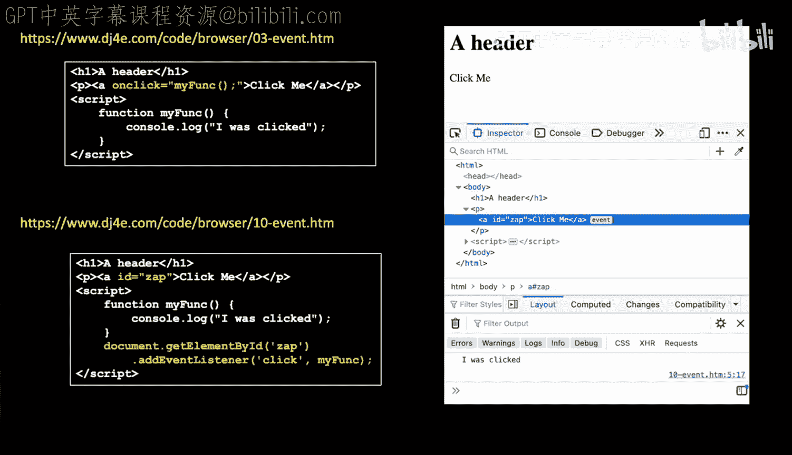

第二种方式是使用更通用的 `addEventListener` 方法。这种方法允许我们通过JavaScript代码动态地注册事件监听器。

以下是实现相同功能的步骤：

1.  在HTML中为元素设置一个ID，以便在JavaScript中能够找到它。
    ```html
    <a href="#" id="zap">点击我</a>
    ```
2.  在JavaScript中，首先定义一个函数。
    ```javascript
    function myFunc() {
        // 要执行的代码
    }
    ```
3.  获取该HTML元素。
    ```javascript
    let element = document.getElementById('zap');
    ```
4.  为该元素添加事件监听器。
    ```javascript
    element.addEventListener('click', myFunc);
    ```

这两种方法在功能上是等效的。`onclick` 属性可以看作是 `addEventListener` 的一个快捷方式。使用 `addEventListener` 的优势在于它更灵活，可以处理多种类型的事件，并且允许为同一个事件添加多个处理函数。

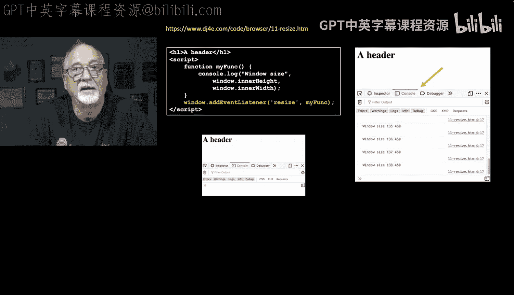

## 其他类型的事件

除了点击事件，浏览器还支持许多其他类型的事件。让我们看看两个重要的例子。

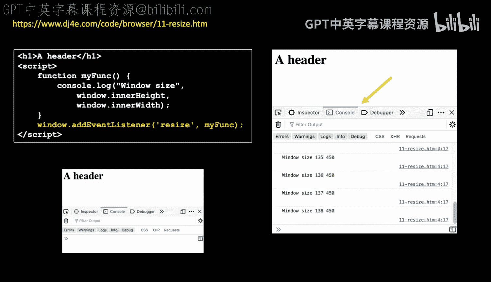

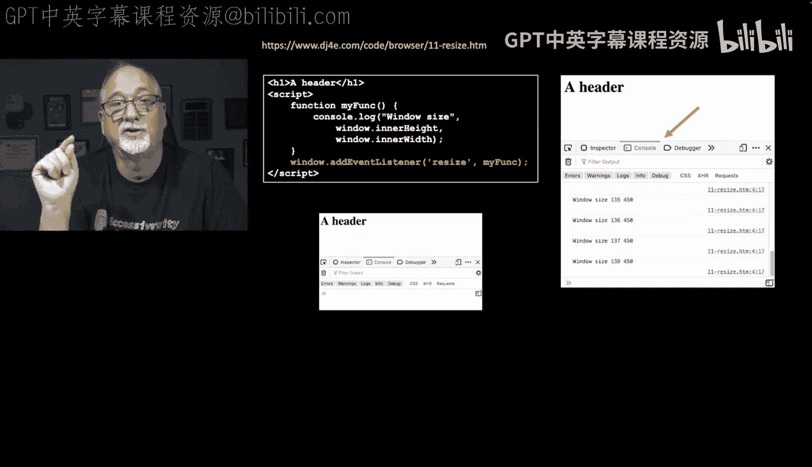

### 窗口调整大小事件

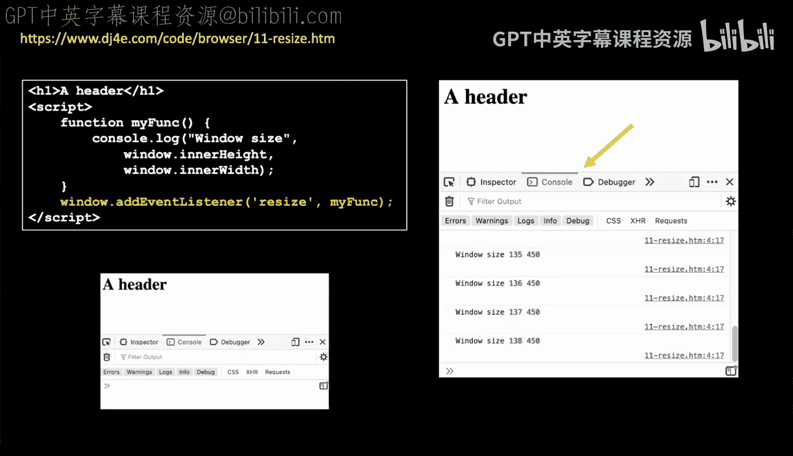

当用户调整浏览器窗口大小时，会触发 `resize` 事件。这对于实现响应式网页设计非常重要，因为您可以根据窗口尺寸动态调整页面布局。

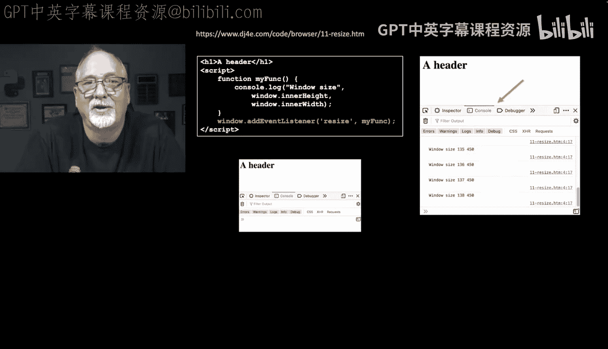

以下是注册窗口调整大小事件监听器的代码：

```javascript
function myFunc() {
    console.log('窗口高度：' + window.innerHeight);
    console.log('窗口宽度：' + window.innerWidth);
}

window.addEventListener('resize', myFunc);
```

当您运行此代码并调整浏览器窗口时，控制台会不断输出当前窗口的高度和宽度。像Bootstrap这样的框架内部就使用了这个事件来适配不同尺寸的屏幕。

### 页面内容加载完成事件

现代网页通常包含HTML、CSS、JavaScript和图片等多种资源。浏览器需要时间加载和解析所有这些资源。`DOMContentLoaded` 事件会在初始HTML文档被完全加载和解析后触发，而无需等待样式表、图像和子框架的完全加载。

如果您需要在页面所有元素都就绪后再执行JavaScript操作（例如，操作某个特定的图片或DOM元素），就应该监听这个事件。

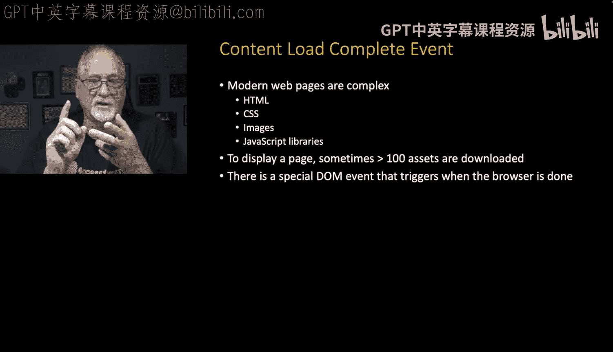

以下是注册该事件监听器的代码：

```javascript
function myFunc() {
    console.log('DOM内容已加载完成！');
}

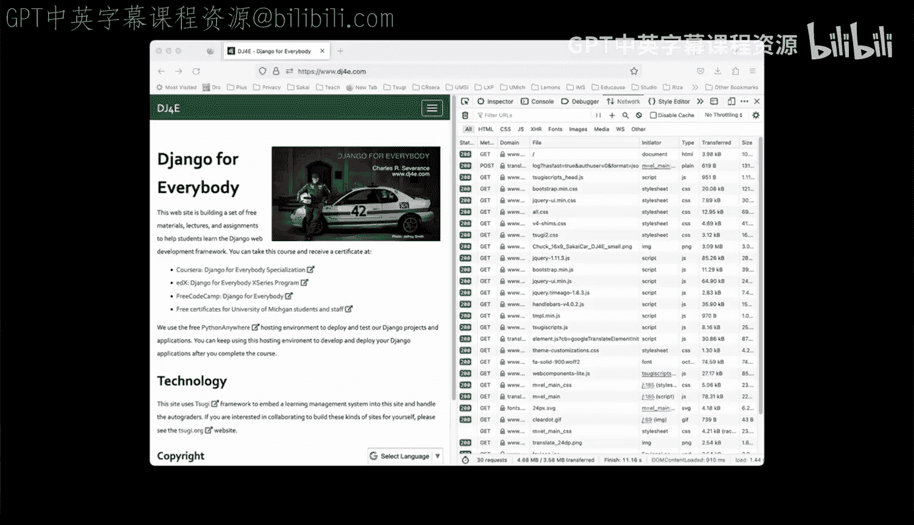

document.addEventListener('DOMContentLoaded', myFunc);
```

通常，包含此监听器的 `<script>` 标签会放在HTML文档的 `<body>` 末尾，以确保它不会阻塞页面的渲染。

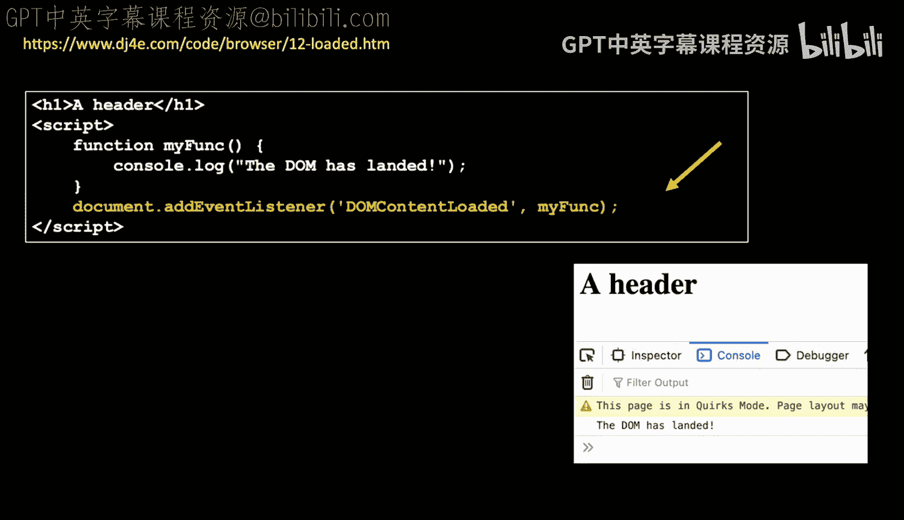

## 总结

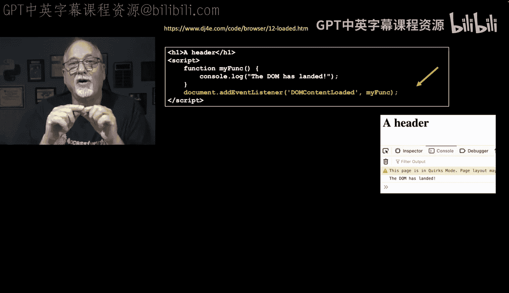

本节课中我们一起学习了浏览器中的JavaScript事件处理。我们了解了事件的基本概念，比较了使用 `onclick` 属性和 `addEventListener` 方法注册事件监听器的区别。我们还探讨了 `click`、`resize` 和 `DOMContentLoaded` 等常见事件类型的应用场景。掌握事件处理是创建交互式网页应用的基础。