# 028：使用Fetch进行JavaScript网络请求 🚀

在本节课中，我们将要学习JavaScript中的网络事件处理，特别是如何使用`fetch`函数进行异步网络请求。我们将了解为什么网络操作必须是异步的，以及如何使用Promise链式调用来处理请求和响应。

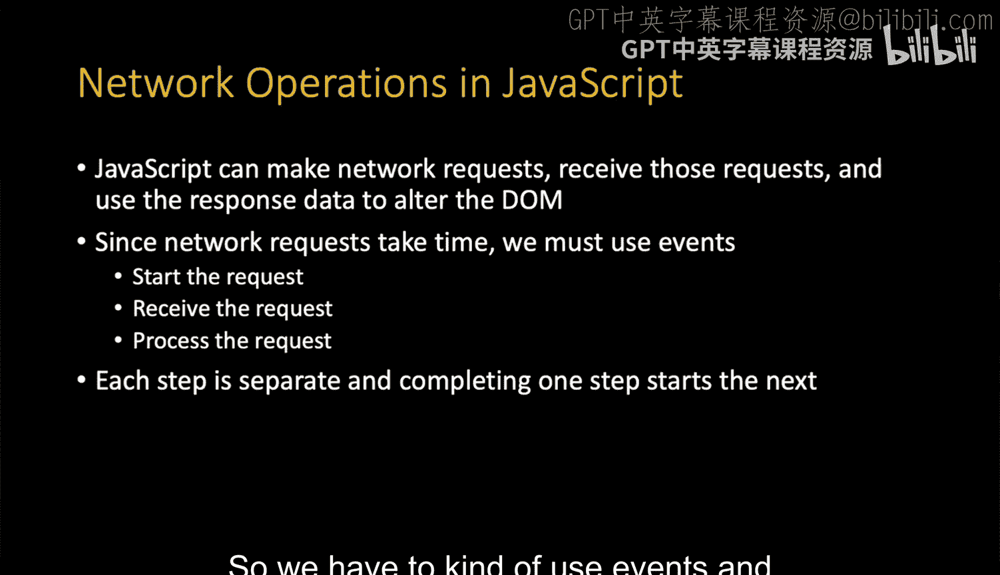

## 概述

上一节我们介绍了浏览器中的各种事件处理。本节中我们来看看JavaScript如何处理网络请求。由于网络操作耗时，浏览器不能因此“冻结”，所以我们必须使用异步编程模式。

## 网络请求的异步性

在JavaScript中执行网络操作时，整个过程必须是异步的。代码不能暂停等待服务器响应，否则浏览器界面会失去响应。

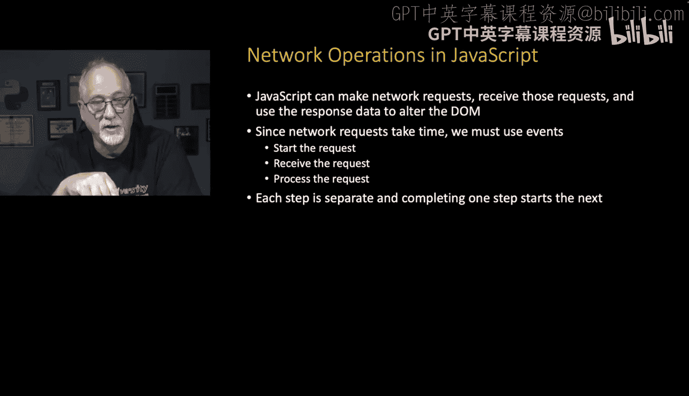

因此，我们需要使用事件驱动的方式，将请求过程分解为多个步骤并串联起来。我们发起请求，然后等待“请求完成”事件，接着在数据接收过程中和全部接收完毕后处理响应。这是一个多步骤过程，每一步都触发下一步，但代码本身从不“等待”，它总是响应一个事件，然后触发下一个事件。


## 使用Fetch函数

以下是一个使用`fetch`函数的示例代码（文件：`14_fetch.htm`）：

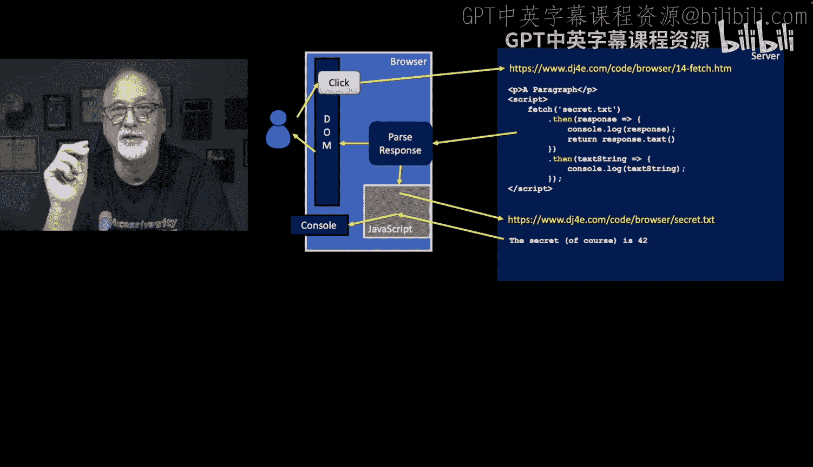

```javascript
fetch('secret.txt')
```

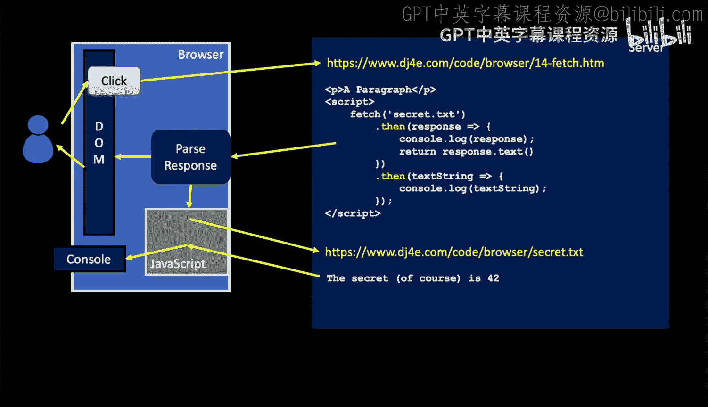

`fetch`是一个内置函数，其参数是一个URL（本例中为`secret.txt``）。`fetch`函数返回一个**Promise**对象。

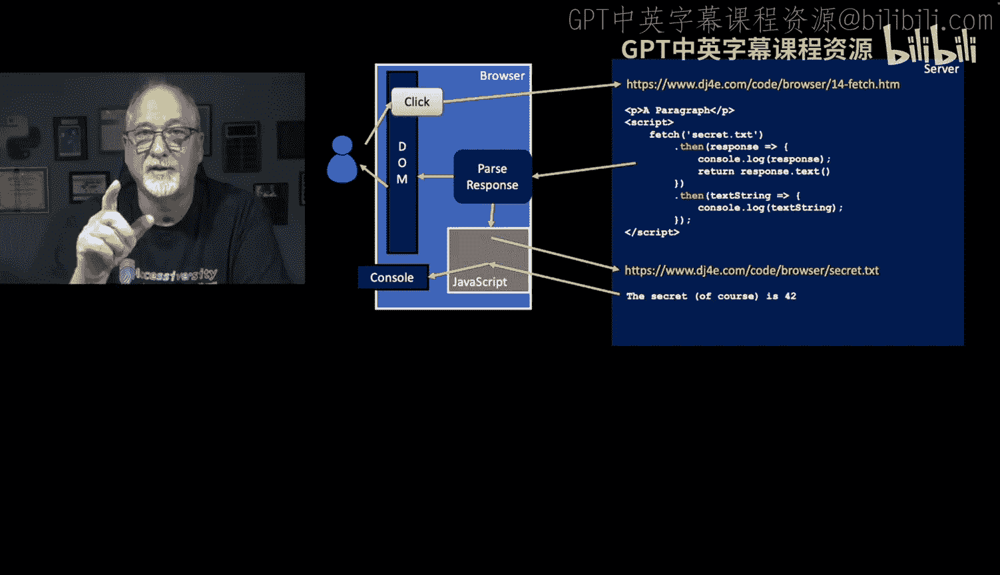

## 理解Promise

一个**Promise**代表一个尚未完成但将来会完成的操作。你可以使用`.then()`方法来指定当Promise完成（即“兑现”）时要运行的代码。

```javascript
fetch('secret.txt')
  .then(function(response) {
    console.log(response);
    return response.text();
  })
```


在这段代码中，`.then()`方法内的函数接收一个参数（这里命名为`response`）。我们首先在控制台记录响应对象，然后调用`response.text()`。

`response.text()`方法本身也返回一个**Promise**，因为它需要时间去从服务器获取文本内容。因此，第一个`.then()`的返回值是另一个Promise。

## 链式调用Promise

这就是为什么你会看到第二个`.then()`：

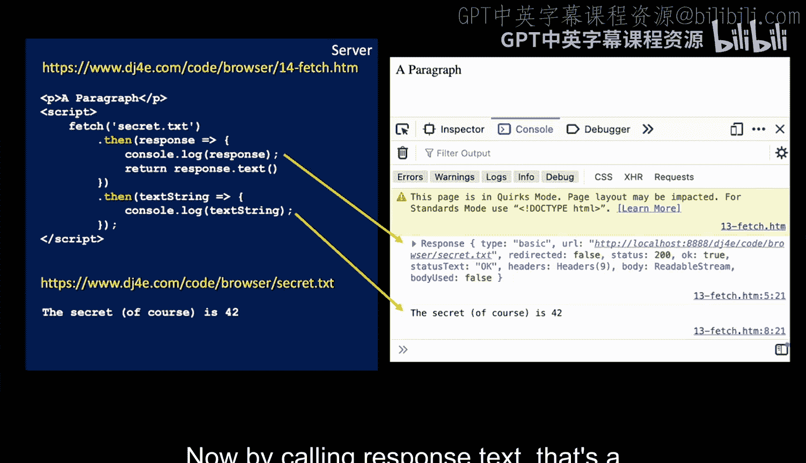

```javascript
fetch('secret.txt')
  .then(function(response) {
    console.log(response);
    return response.text();
  })
  .then(function(textString) {
    console.log(textString);
  });
```

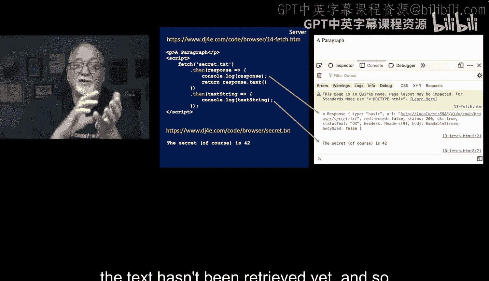

第二个`.then()`在文本内容被成功获取后执行。此时，服务器返回的文本字符串（例如“42”）会作为参数（`textString`）传递给这个函数，我们将其记录到控制台。

整个过程包含三个快速步骤：
1.  启动`fetch`请求（返回Promise A）。
2.  Promise A兑现，运行第一个`.then()`中的代码，并返回`response.text()`产生的Promise B。
3.  Promise B兑现，运行第二个`.then()`中的代码，处理最终的文本数据。

每一步都是瞬时或尽可能快地执行，代码中没有“等待”，我们只是注册函数来响应每个阶段的完成事件。

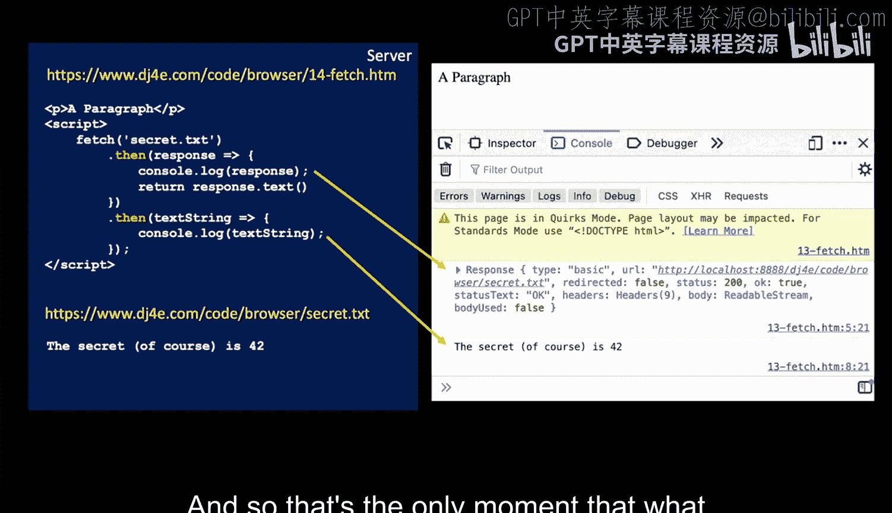

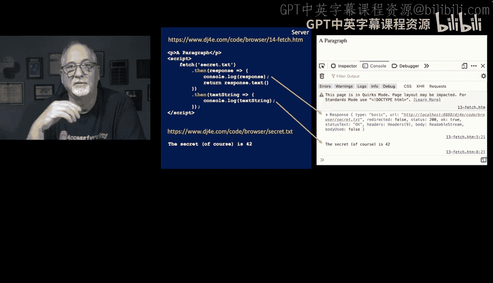

## 解析执行过程

你可以观察这个过程：`fetch`启动，第一个Promise兑现。控制台输出的`response`对象显示状态码200（表示成功），并且`bodyUsed: false`，这表示请求已发出且看起来顺利，但响应体（数据）尚未被读取。

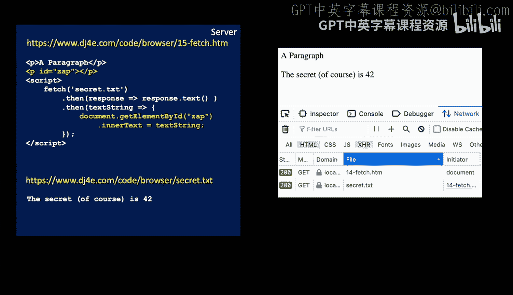

当我们调用`response.text()`时，它返回一个新的Promise。此时，在第一个`.then()`中执行`console.log(response)`时，文本数据其实还未从网络到达。

这个新Promise将在文本数据实际接收完成后（可能需要几秒钟）兑现。届时，JavaScript会“回调”我们，兑现这个Promise并将文本字符串传递进来，这才是我们能够打印出服务器返回内容（例如“42”）的时刻。

## 更简洁的写法与DOM操作

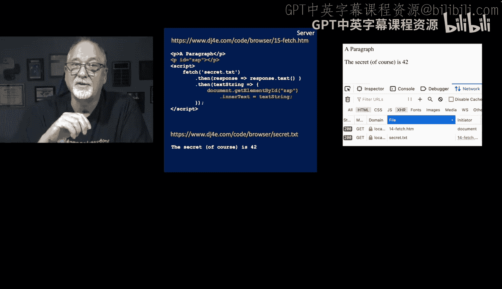

我们可以让代码更简洁，并利用获取的数据做些实际工作，而不仅仅是打印。以下是更典型的写法（文件：`15_fetch.htm`）：

```javascript
fetch('secret.txt')
  .then(response => response.text())
  .then(textString => {
    document.getElementById('zap').innerText = textString;
  });
```

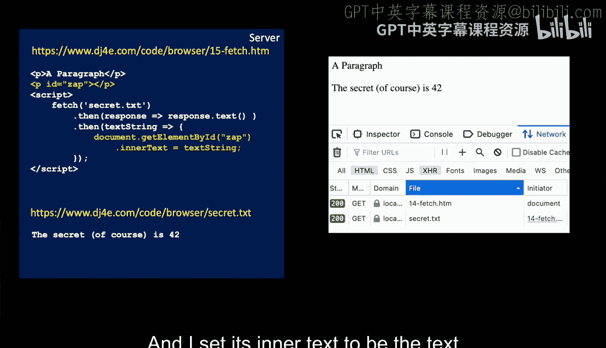

这段代码做了以下事情：
1.  使用箭头函数`response => response.text()`简化了第一个`.then()`的处理。它获取响应并立即调用`.text()`方法返回下一个Promise。
2.  第二个`.then()`接收最终解析出来的文本字符串（参数`textString`），然后通过`document.getElementById('zap')`找到ID为“zap”的HTML元素（例如一个`<p>`标签），并将其内部文本设置为从服务器获取的字符串。

这样，我们就实现了从服务器获取数据，然后动态更新网页文档对象模型（DOM）的内容。

## 总结

本节课中我们一起学习了JavaScript中的异步网络请求。我们了解到由于浏览器不能阻塞，网络操作必须通过事件和Promise进行异步处理。我们深入探讨了`fetch`API的使用方法，包括如何发起请求，如何通过`.then()`链式处理返回的Promise，以及如何将获取的数据用于更新网页内容。我们还看到了如何用更简洁的箭头函数语法来书写这些操作。这为后续学习更复杂的数据交换格式（如JSON）奠定了基础。

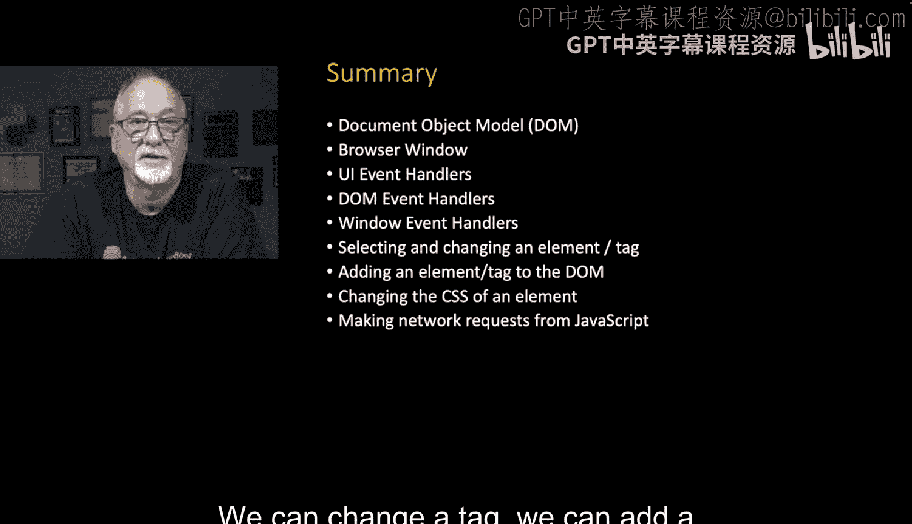

至此，我们已经快速浏览了浏览器中JavaScript的核心工作机制：我们讨论了文档对象模型（DOM）、浏览器窗口、UI事件处理程序（无论是通过`onclick`属性还是`addEventListener`方法添加）、DOM事件（如`DOMContentLoaded`）、窗口事件（如`resize`）。我们学会了如何修改标签、添加新标签、更改CSS样式，甚至如何从JavaScript发起网络请求。