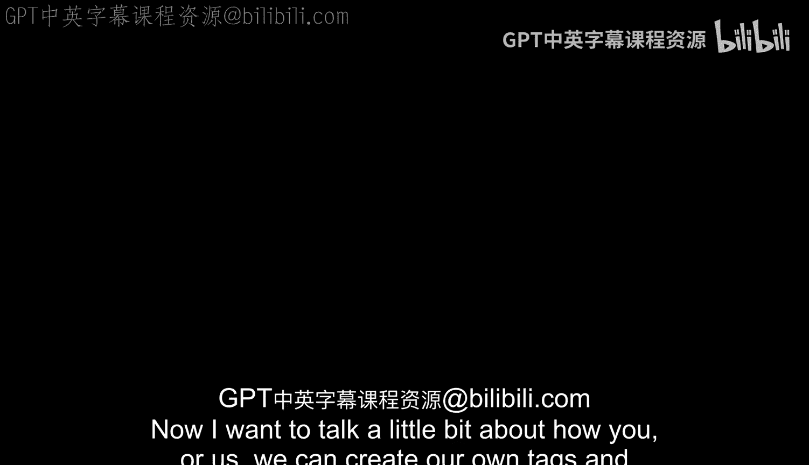
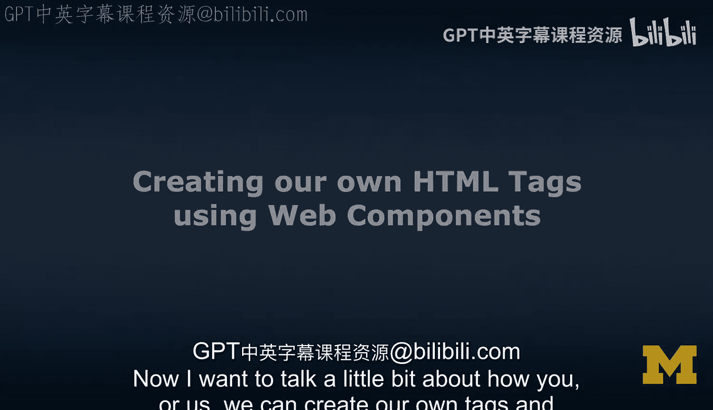
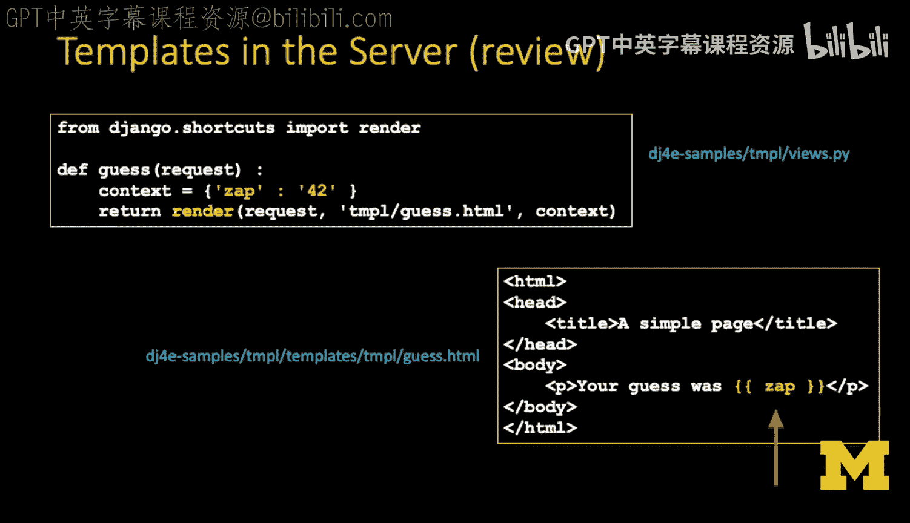
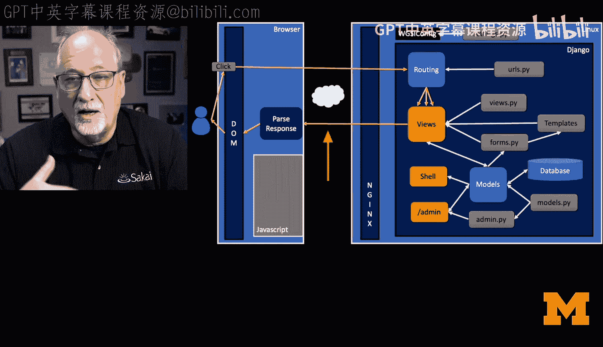
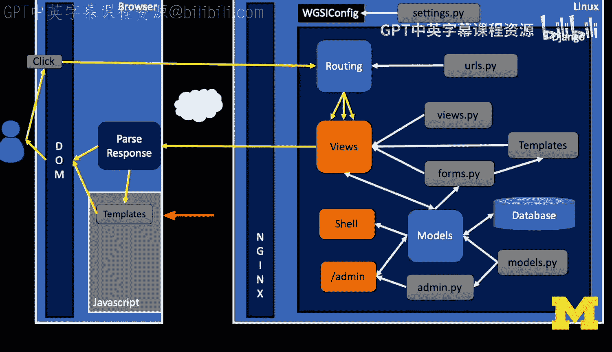
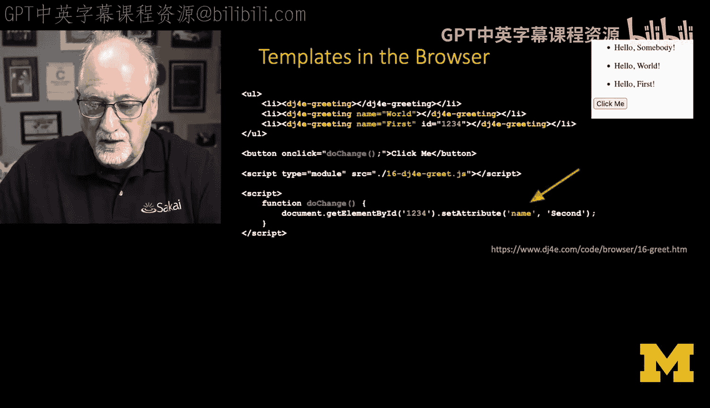
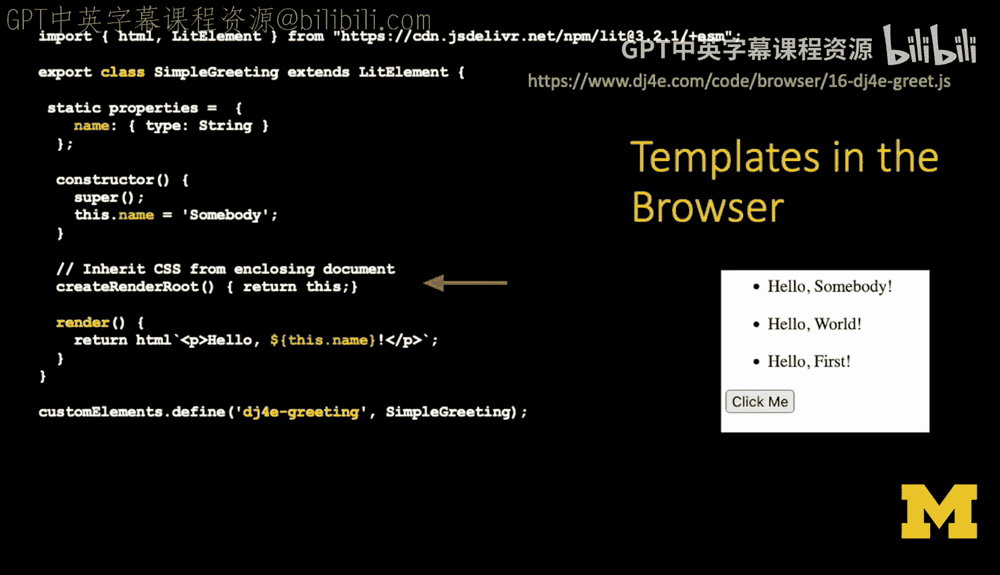
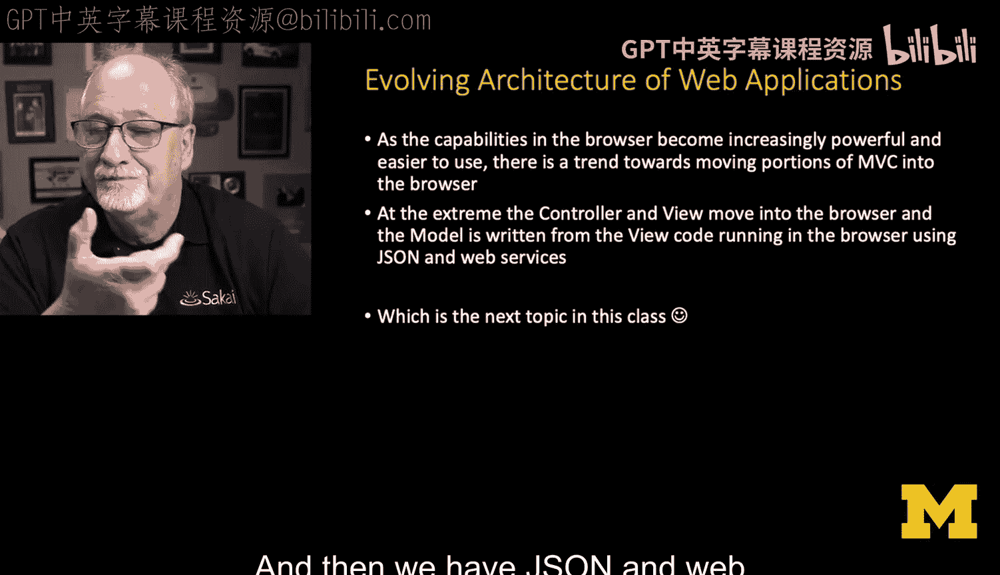
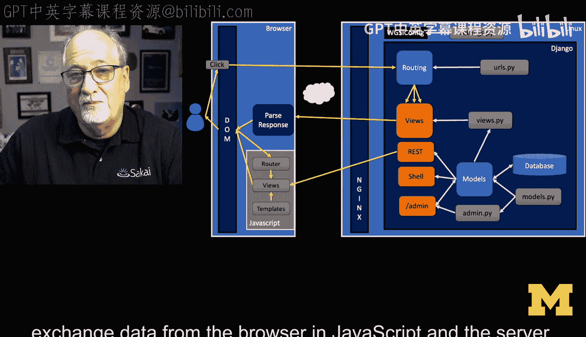
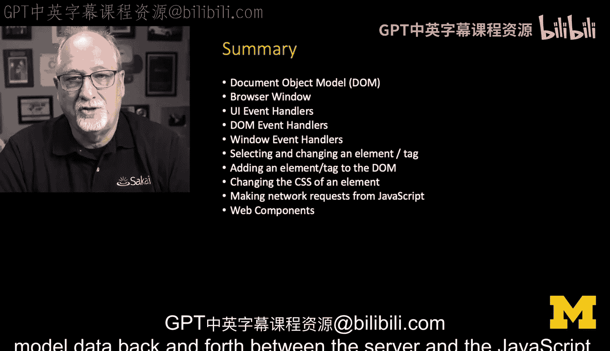

# 029：使用Web Components创建自定义HTML标签 🏷️





在本节课中，我们将学习如何创建和使用自定义的HTML标签，即Web Components。这能帮助我们避免代码重复，并构建更模块化、响应式的用户界面。

## 概述

程序员不喜欢重复自己。从学习编写软件的第三周起，核心原则就是“不要重复自己”（DRY）。重复代码，尤其是包含微小差异的代码，容易导致错误。如果代码中存在一个错误，并且你复制粘贴了40次，那么就需要在40个地方进行相同的修改，这非常令人沮丧。因此，软件设计的一个重要部分就是如何避免重复。

我们之前一直在服务器端进行模板渲染。例如，在Django的视图函数中，我们使用`render`函数，它接收一个模板和一个上下文字典，生成HTML后发送给浏览器。这是一种经典的请求-响应循环，属于模型-视图-控制器模式。

现在，我们将把一小部分模板处理功能移到浏览器中。我们仍然会有服务器端的模板，但也会在浏览器中拥有一个微小的模板。



## 创建自定义标签





我们通过创建自定义标签来实现这个目标。例如，我们可以定义一个名为`<dj4e-greeting>`的标签。这是一个我们自己发明的标签。

我们可以向这个标签传递参数（属性），并定义这些属性的行为。我们还可以为标签设置ID以便操作。下面是一个示例，其中包含一个按钮，点击后会动态改变标签的属性。

```html
<dj4e-greeting id="greet" name="First"></dj4e-greeting>
<button onclick="change()">Click Me</button>
<script type="module" src="./16_dj4e_greet.js"></script>
```



`<script>`标签引入的JavaScript代码会将`<dj4e-greeting>`这个自定义标签添加到浏览器中。一旦导入，我们就可以使用这个标签了。另一个小脚本则用于动态更改标签的`name`属性。

## 理解Web Components的实现



自定义元素的概念在浏览器中已经存在一段时间了。虽然你可以直接编写自定义元素，但过程会比较冗长。因此，我们使用一个名为`lit-element`的小型库，它基于面向对象编程，提供了许多基础功能，让我们无需重复编写样板代码。

我们通过扩展`lit-element`来创建一个名为`SimpleGreeting`的类。在构造函数中，我们调用父类的构造函数并设置默认值。这里涉及一个“影子DOM”的概念，它允许你选择是否从外部文档继承CSS样式，或者在自定义元素内部拥有自己的CSS。在本例中，我们选择不隔离标记，让元素继承外部文档的样式。

以下是`SimpleGreeting`类的核心代码：

```javascript
import { LitElement, html } from './lit-element.js';

class SimpleGreeting extends LitElement {
  static get properties() {
    return {
      name: { type: String },
    };
  }
  constructor() {
    super();
    this.name = 'Somebody';
  }
  createRenderRoot() {
    return this; // 不使用影子DOM，直接渲染到元素本身
  }
  render() {
    return html`<p>Hello, ${this.name}!</p>`;
  }
}
customElements.define('dj4e-greeting', SimpleGreeting);
```

代码的核心是`render`方法。它使用模板字符串（反引号 `` ` `` 定义）来生成HTML。`${this.name}`部分是一个JavaScript表达式，它会将`this.name`属性的值插入到模板中。这个模板是响应式的：如果`<dj4e-greeting>`标签的`name`属性发生变化，浏览器中的文本会自动重新渲染。

## 与其他框架的关系

这种模式可能让你联想到React、Vue、Svelte等框架，它们都提供了自定义组件的生态系统。`lit-element`更像是一种基础能力，而非一个庞大的框架生态系统。它直接利用了浏览器的原生功能，使用起来相对简单直接。



从趋势上看，模板处理，乃至整个视图和控制器逻辑，都在向浏览器端迁移。在最极端的情况下，控制器和视图完全在浏览器中运行，模型则部分在浏览器、部分在服务器中。持久化数据仍然存储在服务器端，通过JSON和Web服务（如REST API）与浏览器前端进行数据交换。这使得应用能够非常响应迅速。我们将在接下来的课程中学习如何通过JSON在服务器和这些自定义标签之间传递数据。

## 本节总结



在本节中，我们探讨了JavaScript与浏览器文档对象模型，包括窗口对象、添加事件处理器、操作DOM数据、扩展DOM、控制CSS显示隐藏、使用`fetch`进行网络请求，最后学习了如何创建Web Components。当我们开始在前端JavaScript和服务器之间来回传递模型数据时，这一切会变得非常有趣和强大。




---
**本节课中我们一起学习了**：如何利用Web Components创建自定义HTML标签来避免代码重复，初步了解了`lit-element`库的使用，以及浏览器端模板渲染如何使应用更加模块化和响应式。