# Django for Everybody：4.3：Django中的简单多对多示例

在本节课中，我们将要学习Django中“多对多”关系的基本概念和实现方式。我们将通过一个具体的例子，理解如何通过一个中间表来建立两个模型之间的多对多关联。

## 概述

多对多关系是指一个模型（例如“作者”）的实例可以关联到另一个模型（例如“图书”）的多个实例，反之亦然。在关系型数据库中，我们无法直接建立多对多关系，因此需要将其拆解为两个“一对多”关系，并通过一个“中间表”（也称为连接表或关联表）来实现。

## 多对多关系的本质

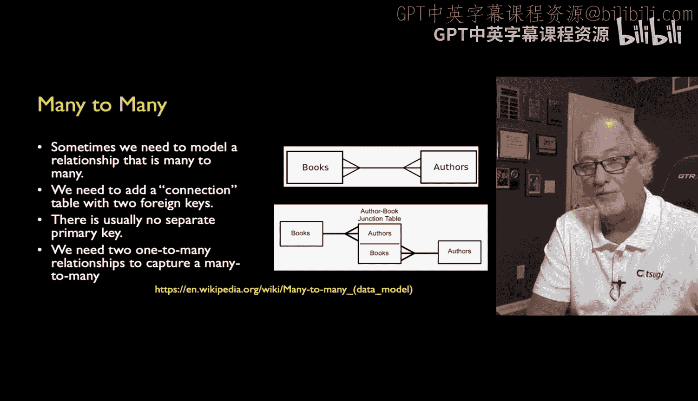

上一节我们介绍了数据库关系的基本类型，本节中我们来看看多对多关系的具体实现。

在关系型数据库中，我们无法直接建模多对多关系。我们的做法是将其分解为两个“一对多”关系，并创建一个连接表。

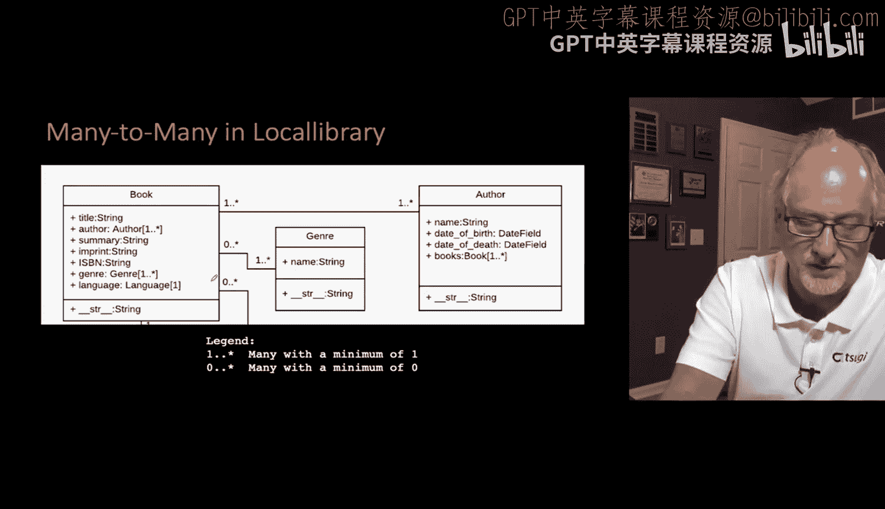

你可以称这个表为“作者-图书”表。稍后，我会称它为“著作”表。这个表非常简短，它只记录“这位作者著作了这本书”、“那位作者著作了那本书”这样的信息。通过这个表，我们可以查询某本书的所有作者，或者某位作者的所有著作。

我们称其为连接表、关联表或中间表。在Django术语中，我们称之为“through”表。它的目的是建立两个向外的“一对多”关系，这本质上就是我们捕获多对多关系的方式。

这就是为什么我说：**一对多 + 一对多 = 多对多**。

## 本地图书馆应用中的多对多关系

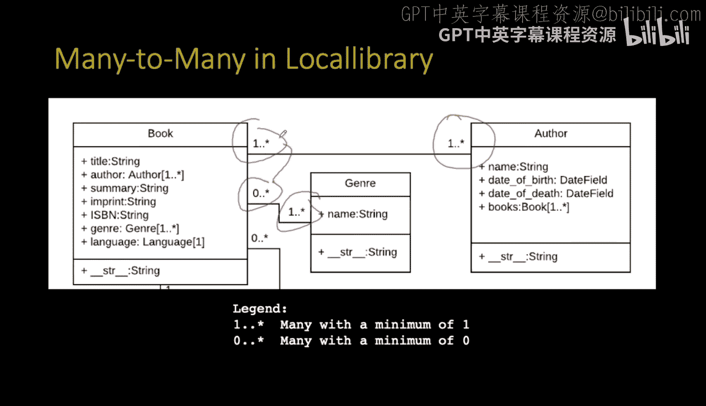

在我们的本地图书馆应用中，存在两个多对多关系。

*   一本书可以有多位作者，一位作者可以有多本书。我们用 `1..*` 来表示这种关系。
*   同样，一个流派可以与多本书关联。有趣的是，从书到流派的关系是 `0..*`，这意味着一本书可以没有流派。

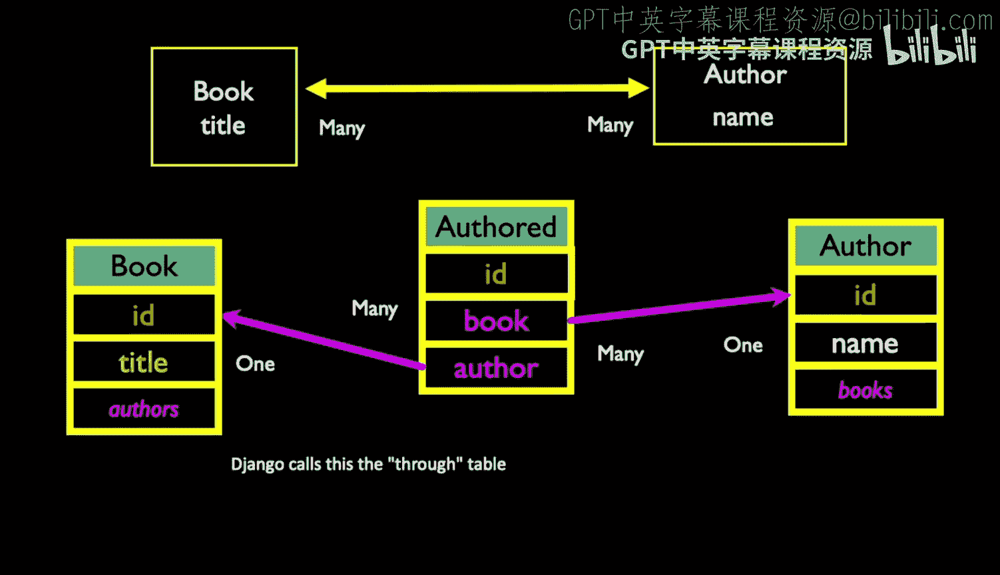

但一本书必须至少有一位作者。这就是 `0..*` 和 `1..*` 之间的微妙区别。这些数据模型可以巧妙地捕捉到这类应用功能，我们稍后会看到它如何转化为Django模型，并成为数据的业务规则。

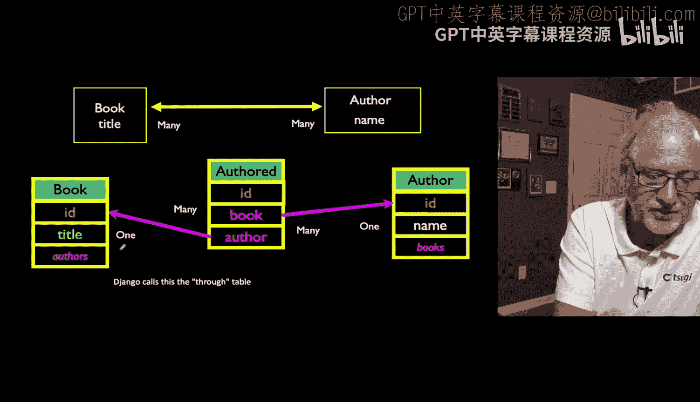

## 多对多关系的实现机制

那么，这是如何运作的呢？我们将创建两个表：`Book` 表和 `Author` 表。每个表的每一行都会有一个自增的ID主键列。

然后，我们将从“著作”表建立向外的外键。注意，“著作”表是箭头的起点，这意味着它内部包含外键列，而箭头的目标则是另一个表中的主键。

Django允许我们创建一种虚拟属性。我们将巧妙地命名它们。名称并不重要，但本质上，在 `Author` 模型内部，我们将有一个名为 `books` 的属性，它会自动填充该作者所写的所有书籍。在 `Book` 模型中，会有一个名为 `authors` 的虚拟属性，它实际上是通过读取“著作”表计算得出的，并非直接存储。这是一个包含所有作者的列表。

这是一种便捷的方式，因为Django倾向于隐藏这个中间表。事实上，你可以定义一个模型，甚至不用给这个中间表命名，Django会为你自动生成一个。它仍然存在，并且与这里展示的完全一样。但为了让你更好地理解，我宁愿在我的数据模型中展示这个表。如果你看到其他数据模型没有明确提到这个中间表，而只是有一个多对多字段，并且Django为你自动创建了这个表，请不要感到困惑。我喜欢明确地展示它。

## Django模型定义

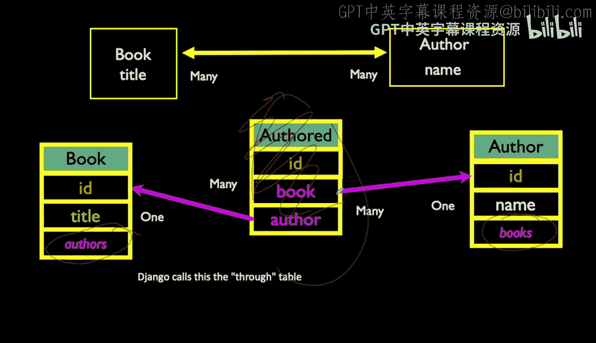

以下是我们的模型定义：

```python
class Book(models.Model):
    title = models.CharField(max_length=200)
    authors = models.ManyToManyField('Author', through='Authored')

class Author(models.Model):
    name = models.CharField(max_length=100)
    books = models.ManyToManyField('Book', through='Authored')
```

在 `Book` 模型中，`title` 是书名，`authors` 是一个指向 `Author` 表的多对多字段，其关联的中间表是 `Authored`。

在 `Author` 模型中，`name` 是作者名，`books` 是一个指向 `Book` 表的多对多字段，其关联的中间表同样是 `Authored`。

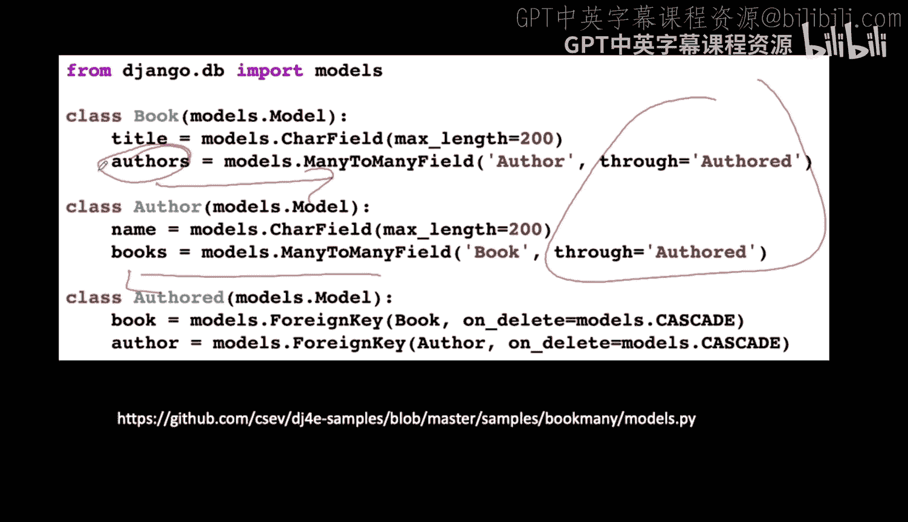

中间表 `Authored` 在两个模型中都被引用。这些 `books` 和 `authors` 属性是虚拟的，它们并不直接存储在 `Book` 或 `Author` 表的行中。当你请求时，例如检索一本书并询问“这本书的作者是谁？”，这些数据会为你动态计算出来。这在某种程度上是一种便利。

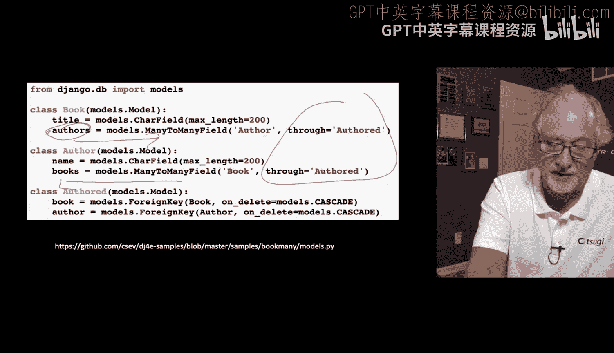

同时，这也告诉Django关于外键的信息、外键的存储位置以及这是一个多对多字段的事实，所有这些设置都是为了建立正确的关联。

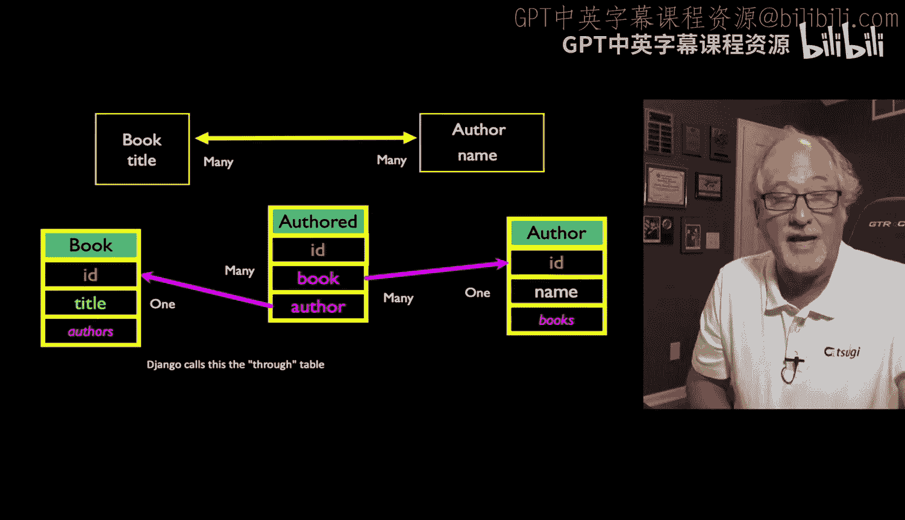

## 中间表模型

就像我说的，这里是我称为 `Authored` 的中间表。我认为这个名字很巧妙。中间表被建模为两个方向的外键。

```python
class Authored(models.Model):
    book = models.ForeignKey(Book, on_delete=models.CASCADE)
    author = models.ForeignKey(Author, on_delete=models.CASCADE)
```

这不是一个多对多字段，而是两个外键。我已经命名了它们，并将它们匹配起来。`on_delete=models.CASCADE` 的含义与之前相同。现在，这只是两个“一对多”关系：中间表有一个指向 `Book` 的“一对多”关系，和一个指向 `Author` 的“一对多”关系。

`on_delete=models.CASCADE` 意味着，如果删除一个作者，我们希望自动删除 `Authored` 表中所有与该作者对应的条目；同样，如果删除一本书，我们也希望自动删除所有与该书对应的条目。这就是 `on_delete=models.CASCADE` 在 `Authored` 表中的含义。它会清理这个表，如果外部两个表中的条目被删除，这种自动清理会为我们完成，这非常方便。我们只需通过这个 `ondelete` 语句来请求它。

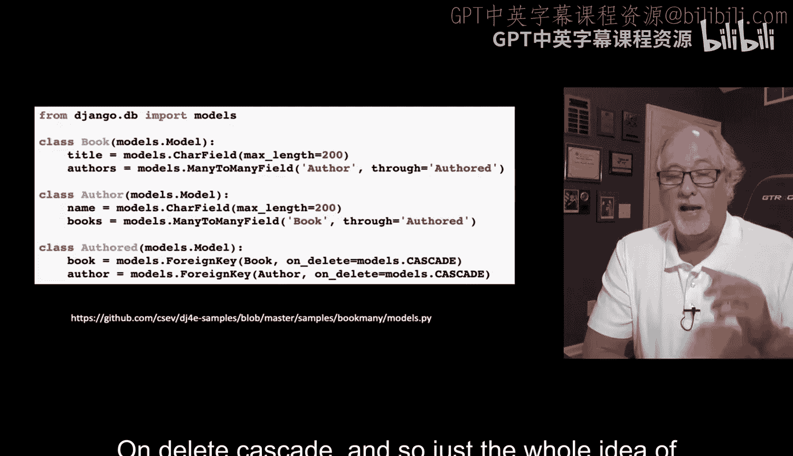

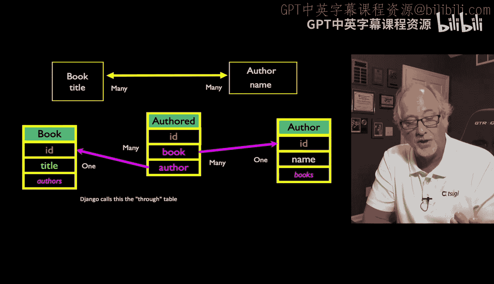

这真是太棒了。如此纯粹和简单。我不喜欢不把 `Authored` 表放在模型里的做法，因为虽然你可以那样做，然后让Django自动创建 `Authored` 表，但某些功能可能无法很好地工作，我不喜欢那样。

## 数据库迁移

假设我们创建了这个 `models.py` 文件。当然，如果你已经检出代码并运行了 `makemigrations`，它已经运行过了。但假设这是你第一次运行 `makemigrations`，你会看到它正在创建迁移文件。然后你运行 `migrate`，正如我们在之前的讲座中讨论过的，`migrate` 命令会根据迁移文件更新数据库。

`makemigrations` 和 `migrate` 都会检查哪些迁移已经执行过。`makemigrations` 寻找 `models.py` 文件中的更改或差异，而 `migrate` 则寻找迁移文件中的差异。

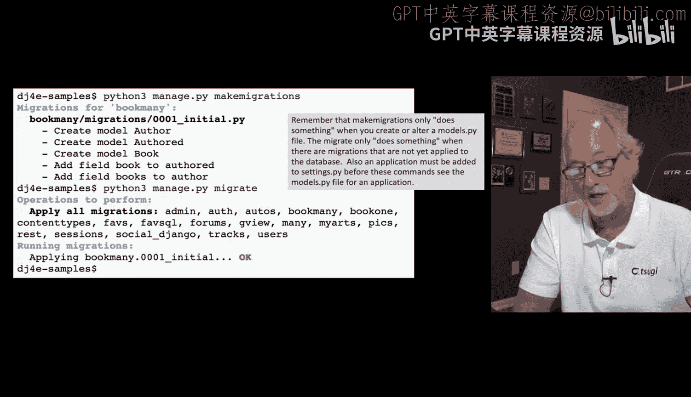

再次记住，这两个命令所查看的内容列表都基于 `settings.py` 文件中的 `INSTALLED_APPS` 变量。我之所以加入这个说明，是因为学生们总是说“我的 `makemigrations` 什么都没做”。这通常有两个原因：要么它不在 `settings.py` 文件中，要么它已经执行过了。如果你运行 `makemigrations` 时它没有执行任何操作，可以从这两个方面检查。

## 在Shell中操作多对多关系

以下是一些我们可以在Django shell中进行的操作。同样，使用 `python3 manage.py shell` 命令，你需要在包含 `manage.py` 的文件夹中运行它，也就是项目文件夹。项目可以包含多个应用。

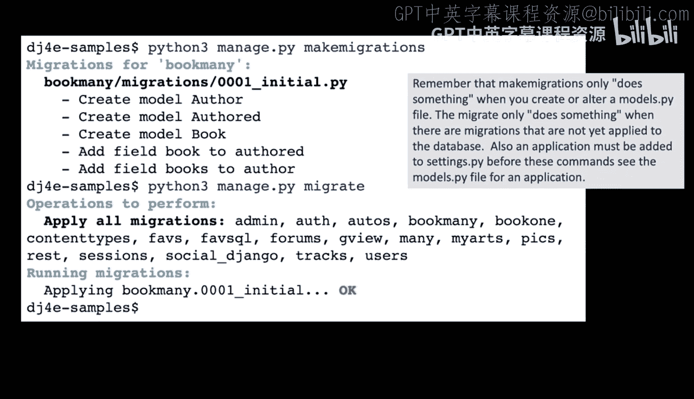

因为 `manage.py shell` 启动时会预加载所有在 `settings.py` 中注册的应用，读取它们的模型和其他一些东西，所以第一行代码 `book_many.models` 就已经存在了。这是因为Django在某种意义上已经“醒来”并预加载了所有存在的类和东西。所以，我们是在一个Django应用中，而不仅仅是在一个Python shell里。

我们导入 `book_many` 作为应用名，其模型是 `Book`、`Author` 和 `Authored`。

以下操作开始变得熟悉起来：

```python
# 导入模型
from book_many.models import Book, Author, Authored

# 创建书籍对象
b1 = Book(title='Networking')
b1.save()
b2 = Book(title='Raspberry Pi')
b2.save()

# 创建作者对象
a1 = Author(name='Kristen')
a1.save()
a2 = Author(name='Severance')
a2.save()
```

此时，我们创建了两位作者和两本书，但现在我们需要将它们关联起来。本质上，我们将创建一个 `Authored` 记录，即 `Authored` 表中的一条记录，将书 `b1` 与作者 `a2` 连接起来并保存。然后，将书 `b2` 与作者 `a1` 连接起来并保存。再将书 `b2` 与作者 `a2` 连接起来并保存。这样，我们就向 `Authored` 表中插入了三条记录，建立了这些连接。

这就像读取 `a1`、`a2`、`b1`、`b2` 的ID字段，然后将记录插入到 `Authored` 表的 `book_id` 和 `author_id` 列中。

记住，在 `Book` 模型中，我们有一个名为 `authors` 的虚拟集合；在 `Author` 模型中，有一个名为 `books` 的虚拟集合。这些并不是实际存储在 `Book` 表或 `Author` 表中的数据，而是通过读取 `Authored` 表中的相应条目生成的。

所以，如果我们查询 `b1.authors`，这就像访问那个虚拟属性。它会从 `Authored` 表中读取所有对应的作者，然后 `.values()` 方法表示实际去检索它们。

```python
# 查询书籍的作者
print(b1.authors.values()) # 输出: [{'id': 2, 'name': 'Severance'}]
print(b2.authors.values()) # 输出: [{'id': 1, 'name': 'Kristen'}, {'id': 2, 'name': 'Severance'}]

# 查询作者的著作
print(a1.books.values()) # 输出: [{'id': 2, 'title': 'Raspberry Pi'}]
print(a2.books.values()) # 输出: [{'id': 1, 'title': 'Networking'}, {'id': 2, 'title': 'Raspberry Pi'}]
```

现在我们可以看到，书1的作者列表只有一位作者（Severance）。书2的作者列表包含Kristen和我。作者1（Kristen）写了哪本书？她写了《Raspberry Pi》这本书。我们合著了那本书。作者2（我）写了哪本书？他独自写了《Networking》这本书，并且与Kristen合著了另一本书。

你还可以做很多其他事情，但你已经基本理解了：你不需要过多地直接操作 `Authored` 表。一旦一切设置好，你甚至可以在不明确知道 `Authored` 表的情况下遍历这些关系，因为当我们在创建数据模型并指定 `through` 表时，就已经预设了这些功能。

因此，`through` 表在某种程度上是一个有用且神奇的东西，但我们并不需要过多地显式处理它。

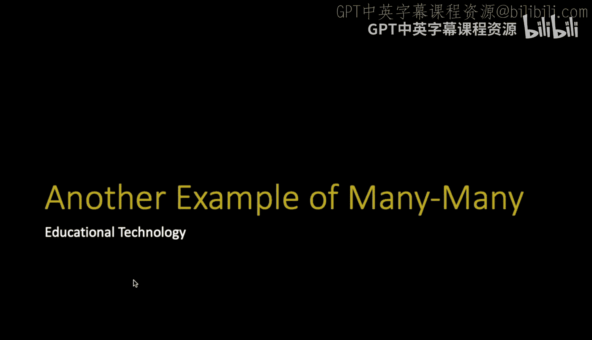

## 总结

本节课中我们一起学习了Django中多对多关系的核心概念。我们了解到，多对多关系是通过一个中间表（`through` 表）来实现的，该表将两个“一对多”关系连接起来。我们看到了如何在Django模型中定义 `ManyToManyField` 并指定 `through` 参数，以及如何在数据库层面通过外键建立这种关联。最后，我们通过Django shell演示了如何创建和查询多对多关系的数据，理解了虚拟属性（如 `book.authors` 和 `author.books`）是如何通过中间表动态计算得出的。掌握多对多关系是构建复杂数据模型的关键一步。