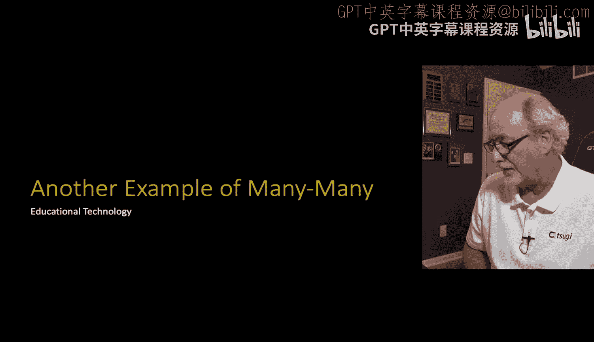
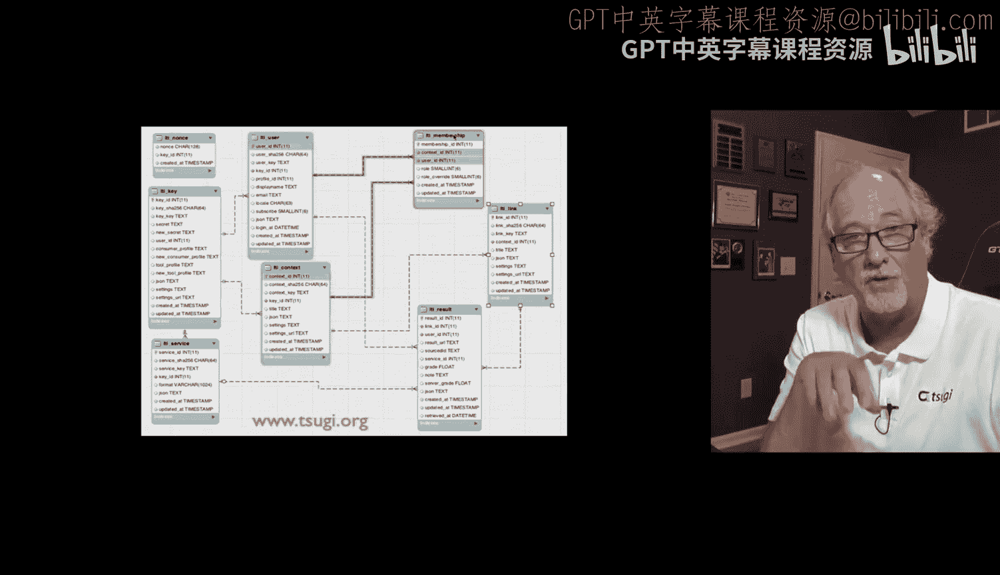
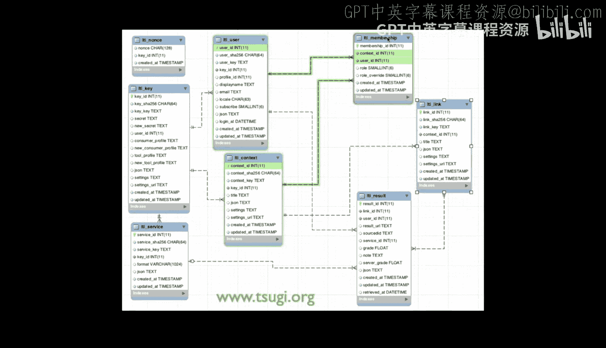
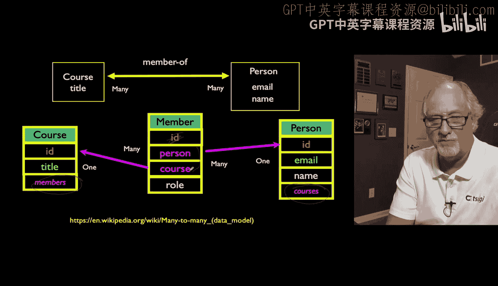
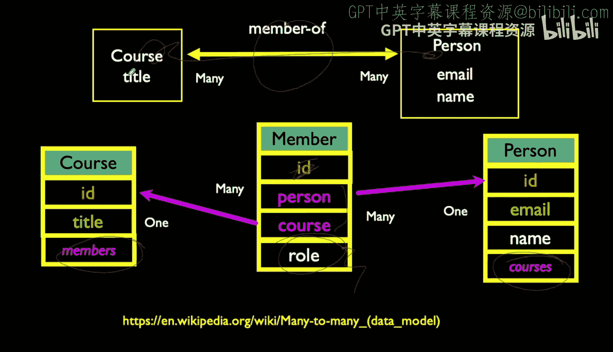
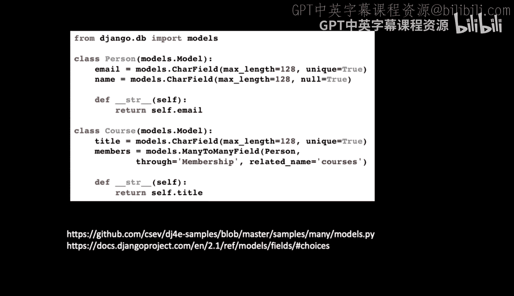
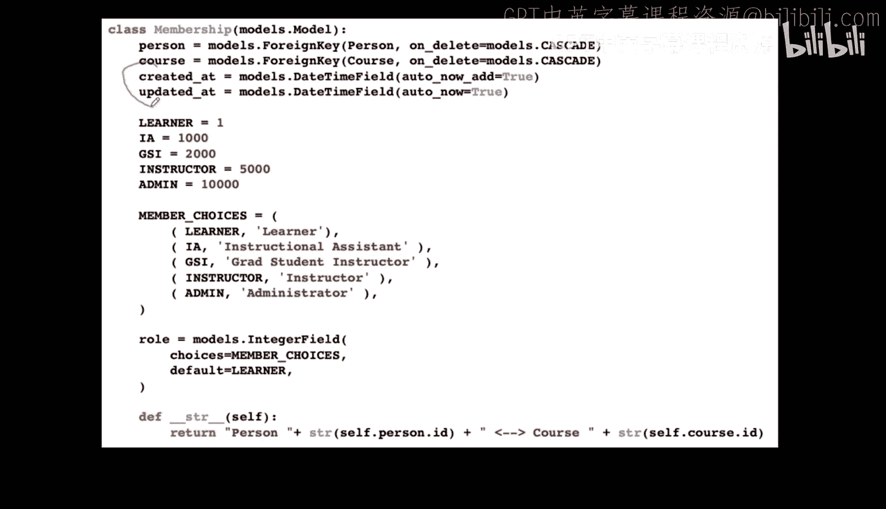
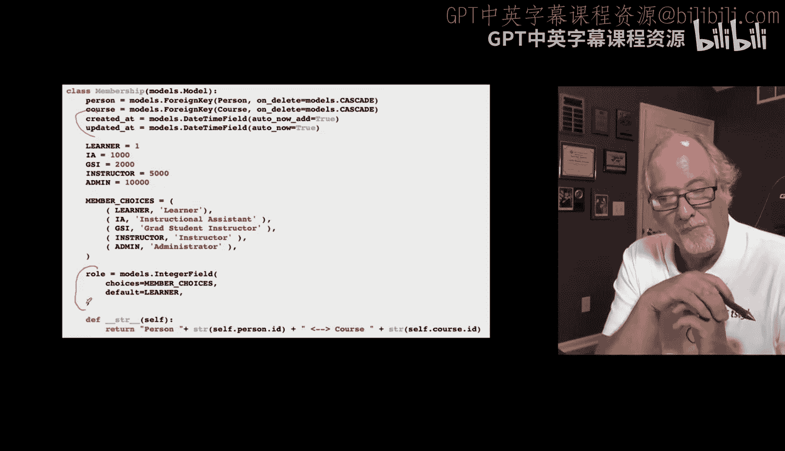
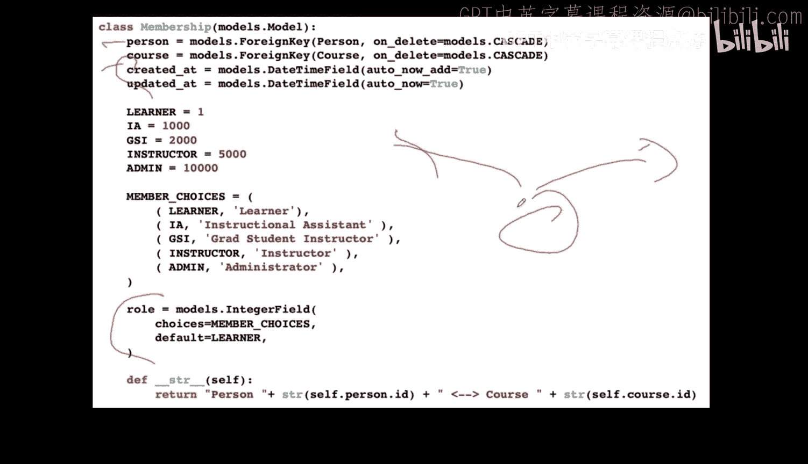
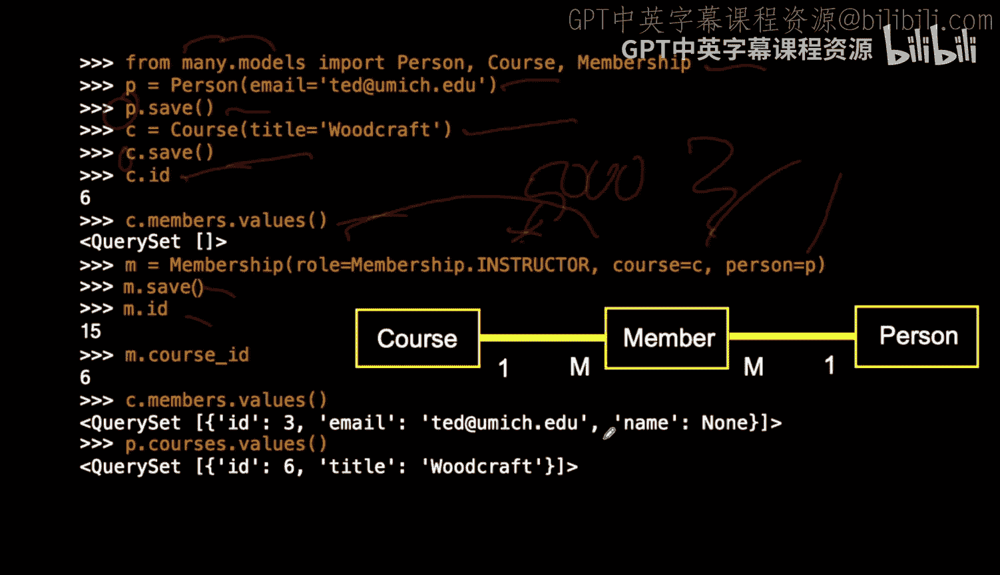

# 033：课程与会员的多对多数据模型 🧑‍🏫

在本节课中，我们将学习一个更复杂的多对多关系实例，它来自一个在线评分系统。我们将探讨如何在“人员”和“课程”之间建立多对多关系，并通过一个“会员”中间表来存储额外的关联信息，例如用户在课程中的角色。

---







上一节我们介绍了简单的多对多关系模型。本节中，我们来看看一个更贴近实际应用的例子：一个教育系统中的课程与会员关系。


这个数据模型用于追踪学生和教师在课程中的参与情况。一个人可以参加多门课程，一门课程也可以有多个人参与，因此这是一个典型的多对多关系。


为了建立这种关系，我们创建一个名为 `Membership` 的中间表（或称为“通过表”）。与之前类似，这个表包含两个外键：一个指向 `Person` 表，另一个指向 `Course` 表。这样，我们就通过两个“一对多”关系实现了“多对多”的映射。


现在，我们将在这个中间表中添加一些额外的数据，这是本例的关键不同之处。在教学中，一个人在一门课程中可能扮演不同的角色，例如学生、助教或讲师。这个“角色”信息是属于“人员-课程”这个连接本身的属性，而不是单独属于人员或课程。


因此，我们需要在 `Membership` 表中添加一个 `role` 字段来记录这个信息。这样，同一个人可以在A课程中是讲师，同时在B课程中是学生。




以下是实现这个模型的代码示例。我们首先定义 `Person` 和 `Course` 模型，然后定义包含额外字段的 `Membership` 模型。

```python
from django.db import models



class Person(models.Model):
    name = models.CharField(max_length=128)
    def __str__(self):
        return self.name



class Course(models.Model):
    title = models.CharField(max_length=128)
    members = models.ManyToManyField(Person, through='Membership')
    def __str__(self):
        return self.title

class Membership(models.Model):
    # 定义角色选项
    LEARNER = 1
    TEACHING_ASSISTANT = 1000
    INSTRUCTOR = 5000
    ADMIN = 10000
    ROLE_CHOICES = [
        (LEARNER, 'Learner'),
        (TEACHING_ASSISTANT, 'Teaching Assistant'),
        (INSTRUCTOR, 'Instructor'),
        (ADMIN, 'Admin'),
    ]
    
    person = models.ForeignKey(Person, on_delete=models.CASCADE)
    course = models.ForeignKey(Course, on_delete=models.CASCADE)
    # 记录连接创建和更新的时间
    created_at = models.DateTimeField(auto_now_add=True)
    updated_at = models.DateTimeField(auto_now=True)
    # 记录人员在此课程中的角色
    role = models.IntegerField(choices=ROLE_CHOICES, default=LEARNER)
    
    def __str__(self):
        return f"{self.person.name} in {self.course.title} as {self.get_role_display()}"
```



代码说明：
1.  `Person` 和 `Course` 是基础模型。
2.  在 `Course` 模型中，我们使用 `through='Membership'` 参数指定了自定义的中间表。
3.  `Membership` 模型包含：
    *   指向 `Person` 和 `Course` 的外键。
    *   `created_at` 和 `updated_at` 字段，由Django自动管理。
    *   `role` 字段，使用整数和 `choices` 参数来定义可选的用户角色。这种方式比直接存储字符串更高效，并且便于在管理界面中显示友好的名称。



---

了解了模型定义后，我们来看看如何在Django Shell中操作这些数据。以下是创建对象并建立关联的步骤：

1.  首先，我们进入Django Shell并导入模型。
2.  然后，创建一个人（Person）对象和一门课程（Course）对象。
3.  最后，通过创建 `Membership` 对象来将这个人以特定角色（如讲师）添加到课程中。

```python
# 在 Django Shell 中操作
from many.models import Person, Course, Membership

# 创建一个人和一门课程
p = Person(name="Dr. Chuck")
p.save()
c = Course(title="Python for Everybody")
c.save()



# 初始时，课程没有会员
print(c.members.all())  # 输出：<QuerySet []>

# 创建一个会员关系，指定角色为讲师（INSTRUCTOR，对应值5000）
m = Membership(person=p, course=c, role=Membership.INSTRUCTOR)
m.save()

# 现在，课程有了会员
print(c.members.all())  # 输出：<QuerySet [<Person: Dr. Chuck>]>
# 也可以查询这个人参加了哪些课程
print(p.course_set.all()) # 输出：<QuerySet [<Course: Python for Everybody>]>
# 查看会员详情，包括角色
print(m.get_role_display()) # 输出：Instructor
```

---



本节课中我们一起学习了如何构建一个带有额外信息的复杂多对多关系模型。我们通过创建 `Membership` 这个中间表，不仅连接了“人员”和“课程”，还成功地存储了“角色”这一关联属性。这种方法在需要记录关系本身元数据的场景中非常实用，例如社交网络的好友关系、订单与商品的关系等。掌握这种模式将帮助你设计出更强大、更灵活的Django数据模型。