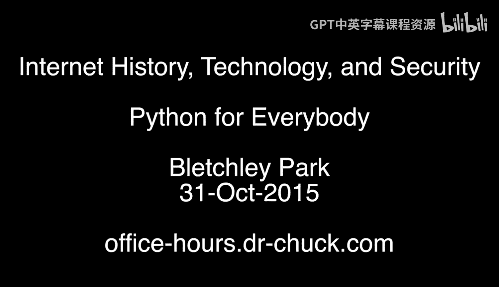
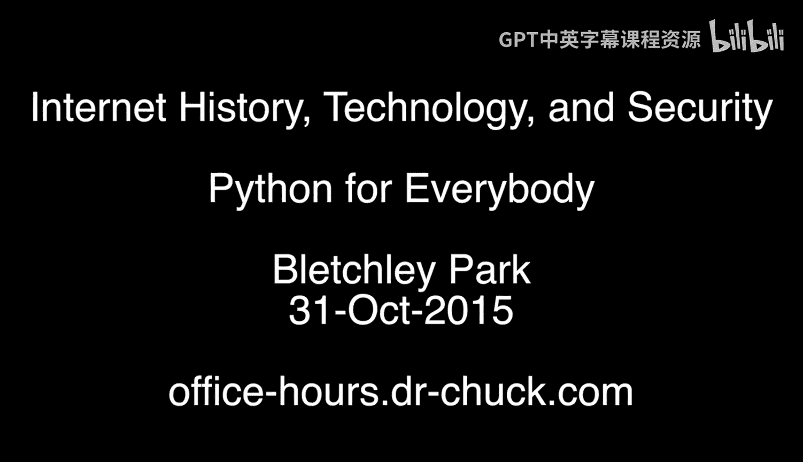

# 密歇根大学《给所有人的Django课程4/共4（部署Django应用）》：第34讲：面对面办公时间-英国布莱切利园

## 概述
在本节课中，我们将跟随课程团队，走进位于英国布莱切利园的特别办公时间现场。这里不仅是计算机科学、互联网历史和计算技术的发源地之一，也是一次特别的“同学会”。我们将通过这次活动，了解来自世界各地的学习者，并感受这个历史地点与编程学习的独特联系。

## 课程内容

大家好，我们来到了布莱切利园。计算机科学、互联网历史、技术和所有计算的起点就在这里，布莱切利园。我们举办了一次非常特别的、创纪录的办公时间活动，我想让大家认识一下你们的同学们。那么，我们开始吧。

以下是参与本次活动的同学和导师的自我介绍。

大家好，我是史蒂夫。我也是，但你应该说你是个特别的人，你不只是史蒂夫。我是Python课程所有课程的导师之一。欢迎你，史蒂夫。多年来能与你共事是我的荣幸。史蒂夫是那个做所有艰苦工作的人，而我得到了所有的赞誉。像史蒂夫和其他导师这样的人，他们实际上做了艰苦的工作。所以谢谢你，史蒂夫。非常感谢你。谢谢邀请我来，在你的帮助下，这太棒了。

大家好，我是邦瓦尔，来自法国，现在住在伦敦。很高兴来到这里。查克博士，很高兴见到你。我上过互联网历史课程，我非常喜欢它。我真的很想上关于树莓派的下一个课程。别担心，这是广角镜头，所以我并不是真的在拍你的鼻子。

我是克雷格，我正在学习Python网络数据课程，网上见。当那个人过来跟你说话时，你有遇到麻烦吗？真的吗？不过你没事，他们让你回来了。

我是史蒂夫，我上完了第一个Python课程，很快就要开始学习其他一些课程了。我发现它对于我入门这门语言真的非常非常有帮助，非常感谢。

大家好，我是珍妮，我是一名软件开发人员。我使用“Python for Everybody”课程在泰国清迈的一所国际学校教授编程课。很高兴来到英国布莱切利园。你知道那本书被翻译成中文了吗？这在泰国好用吗？不太好用。好吧，所以我想我还没那么酷。

你好，我是来自法国的阿尔诺，我在我的大学担任Arduino讲师。因为上了Python课，我忘记了Arduino的语法，这在我的工作中很尴尬。我的意思是Processing。我的意思是。你不再用Processing了，用Python代替Processing。不，我用Arduino，我应该在大学里做调试工作。到处都是游泳马拉松，然后我就在Python里把它忘了。欢迎你，你是从巴黎来的吗？是的。你从巴黎来这里。是的。我想是坐欧洲之星来的吧，不像从澳大利亚来那么远，对吧？我想没人能超过我。不，不，我不是说“不，不”，我是说你说得对，欧洲之星巴黎比我们想象的近。

我是凯文，我只从伦敦来。但能听到科·萨拉是如何组织课程以及你如何制作课程的，真的很好，谢谢你。谢谢你能来。

大家好，我是J，我是来自中国的苏。你们是学生吗？是的，我们目前在英国工作。很高兴在布莱切利园见到你们，Python课程很棒。

你好，我是扬尼斯。我使用Python很长时间了，但这是我第一次参加课程，只是为了正确地看看这门语言。谢谢你。

你好，我是伊莎贝尔。我用你的课程来复习我的计算机科学知识。是的，我正在跟你学习Python。我来布莱切利园至少五次了。就像你一样，我也是个粉丝，就像我一样。我本希望能在二战期间在这里工作。那会多么令人兴奋。是的，你知道，这里有三门课程的人都是女性。是的，非常令人印象深刻。你没有他们中最有趣的工作。但正是如此。

大家好，我是帕特里克，我上过互联网历史课程。今天对我来说是非常激动人心的一天，因为当我上那门课时，我说我想去布莱切利园，我今天就在这里了。我还说我想参加一次查克博士的办公时间，所以我今天一次就做到了两件事，这真是太棒了。我的一个想法是，这是我们的同学聚会，我有点在想，嘿，我们开个同学会吧。

大家好，我是大卫，我上过你的Python课程和互联网历史课程，非常喜欢，欢迎你，很高兴你在这里。

大家好，我是保罗，我上过Python课程，它们很棒，谢谢你。

大家好，我是来自剑桥的休，我上过你的Python课程，目前正在学习网络课程。非常兴奋能和你一起在这里，并且尝试教孩子们，所以我实际上是在学习它，因为我儿子为了考试正在学Python，所以我希望能帮助他。你离树莓派总部只有几个街区远，对吧？我们在剑桥，他们也在那里做Python相关的事情，规模很大。是的，我想以某种方式把所有这些联系起来，我想到了一个绝妙的计划。

大家好，我是罗杰。我上完了“Python for Everybody”课程，刚刚开始网络课程，我真的很期待能顺利完成它。

大家好，我是达里乌斯，我最初来自波兰，现在住在英国。我刚刚开始我的Python之旅，我应该说非常感谢你为这一切所做的一切。真的，真的很好。那么，问题是：你知道布莱切利园的历史和三位波兰密码学家吗？哦，非常厉害。但是，这里的历史学家们做得非常好，把这一点说得很清楚。这引出了我的下一个问题：你打算来参加办公时间吗？我有很多计划，我会去很多地方，所以也许我们会想办法解决。还有一件事。好吧，向我的妻子和两个女儿问好。

大家好，我是麦迪，我住在伦敦北部。我上了第一门Python课程，这样我就能跟上我小儿子在学校学习的进度。很高兴见到你。

你好，我叫安德鲁，我是个退休人员，只是为了兴趣而学习Python课程。我希望能把它和我用树莓派做的一些小项目结合起来。但我认为Python课程是一门引人入胜的课程。对于一个退休人员来说，你确实很年轻。离70岁还远着呢。

你好，我是马达姆。我和我的家人一起来的，我刚刚开始学习Python。我原本是学生物学的。对，工作，后来我想教我女儿编程。是的，在某个时候，那会变得很正常。是的，就在下一代密码破译者中。确切地说，重要的是把他们带到这个起点。在未来，情况会好得多。我们打破了这片土地，它会一直保持被打破的状态。当然。

你好，我是爱丽丝。我住在布里斯托尔。布里斯托尔。那很远。在那个方向。有几个小时车程。我几个月前上了Python课程，我打算上你的新课程，你推出了很棒的课程3。它们很好，我试过其他一些课程……我不得不把那部分剪掉。很高兴在现实中见到你。我是一名分析师，我希望能在工作中运用我学到的Python知识，我会跟着你学完顶点课程。希望到我们开始顶点课程时，我能想出办法。

我是大卫，来自利物浦。我有兴趣学习Python来提高我的编程技能，我自己正在学习成为一名技术专家。

我是辛西娅，我正在上你的Python课程，这门课非常出色。我强烈推荐给任何想学习编程的人。我现在正处于职业间歇期，在抚养孩子。这对我保持理智非常有帮助。这实际上是一个非常重要的应用场景。但是，你的职业与核反应堆或隐形飞机有关吗？不，是做一点质谱分析。哦，质谱分析。不管怎样，我知道没有计算部分它就很复杂。完全没用。质谱分析是一个大海捞针的问题，如果没有编程，我们根本无法理解数据，我以前从来不知道怎么做，我希望当我回去工作时，我实际上能知道自己在做什么。太好了。这是度过职业间歇期的一个好方法。

大家好，我叫奥芬，来自伦敦。我上过互联网历史技术课程，我期待着学习Python。很好，很好。你想成为……你在躲吗？只是我的妻子。好吧，好吧，你是摄影师。那么，我们会给你们所有人拍一张广角照片。为你们的出色、主动性和……给自己一轮热烈的掌声。

## 总结
本节课中，我们一起在布莱切利园这个具有历史意义的地点，进行了一次特别的面对面办公时间活动。我们见到了来自世界各地的课程学习者和贡献者，听到了他们学习Python、计算机历史和技术的个人故事与动机。这次活动不仅是一次知识的交流，更是一次跨越地域的“同学会”，体现了在线学习社区的活力与连接。