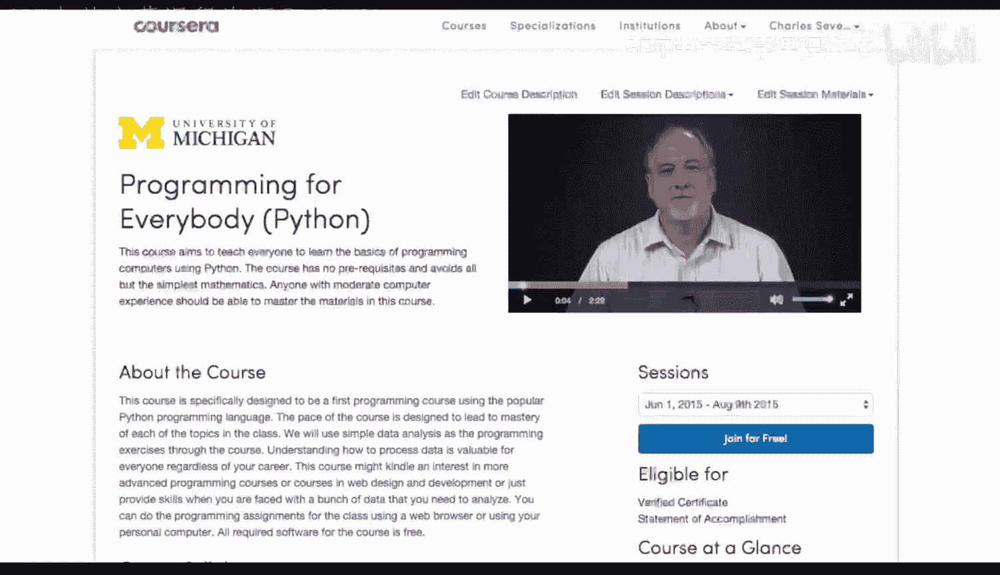

# Django for Everybody：4：部署Django应用




在本节课中，我们将学习如何将开发完成的Django应用部署到生产环境，使其能够通过互联网被用户访问。部署是Web应用开发的最后关键一步，涉及服务器配置、静态文件处理、数据库设置和安全考量等多个方面。

## 准备工作

上一节我们介绍了Django应用开发的核心流程。本节中我们来看看部署前需要完成的准备工作。

部署一个Django应用到生产环境前，你需要确保以下几点：

*   **代码就绪**：你的应用在本地开发环境中运行正常，所有功能均已测试。
*   **选择托管服务**：你需要一个服务器来运行你的应用。这可以是一台虚拟私有服务器（VPS），如DigitalOcean、Linode或AWS EC2实例，也可以是平台即服务（PaaS），如Heroku、PythonAnywhere或Railway。
*   **生产环境配置**：Django的生产环境设置与开发环境不同，需要调整设置以确保安全性和性能。

## 核心部署步骤

以下是部署Django应用的主要步骤概述。

1.  **配置生产设置**：在 `settings.py` 中，你需要将 `DEBUG` 设置为 `False`，并正确配置 `ALLOWED_HOSTS` 列表，包含你的域名或服务器IP地址。
    ```python
    DEBUG = False
    ALLOWED_HOSTS = [‘yourdomain.com‘, ‘www.yourdomain.com‘, ‘服务器IP地址‘]
    ```
2.  **设置静态文件**：使用 `python manage.py collectstatic` 命令收集所有静态文件（CSS, JavaScript, 图片）到一个目录，并通过Web服务器（如Nginx）或云存储服务（如AWS S3）来提供这些文件。
3.  **配置数据库**：生产环境通常使用更健壮的数据库，如PostgreSQL或MySQL，而不是默认的SQLite。你需要在 `settings.py` 中更新 `DATABASES` 配置。
4.  **选择WSGI服务器**：Django本身不直接处理HTTP请求。你需要一个WSGI服务器，如Gunicorn或uWSGI，来运行你的Django应用。
5.  **设置Web服务器**：使用一个Web服务器，如Nginx或Apache，作为反向代理。它接收用户的HTTP请求，将其转发给Gunicorn/uWSGI处理，并负责提供静态文件和处理SSL加密（HTTPS）。
6.  **配置域名与SSL**：将你的域名指向服务器IP地址，并为域名安装SSL证书（例如使用Let‘s Encrypt的免费证书），以启用HTTPS，保证数据传输安全。

## 一个简单的部署示例（以Gunicorn + Nginx为例）


了解了基本步骤后，我们来看一个使用Gunicorn和Nginx的常见部署方案的具体操作流程。

1.  **在服务器上安装依赖**：通过SSH连接到你的服务器，安装Python、pip、你的项目依赖（通常通过 `requirements.txt`）、PostgreSQL、Nginx和Gunicorn。
2.  **上传项目代码**：使用Git或FTP等工具将你的Django项目代码上传到服务器。
3.  **配置Gunicorn**：创建一个系统服务文件（如 `gunicorn.service`）来管理Gunicorn进程，确保应用在服务器启动时自动运行。
4.  **配置Nginx**：编辑Nginx的站点配置文件，设置反向代理规则，将动态请求转发给Gunicorn，并直接提供 `collectstatic` 收集的静态文件。
    ```nginx
    # Nginx配置示例片段
    location /static/ {
        alias /path/to/your/staticfiles/;
    }
    location / {
        proxy_pass http://127.0.0.1:8000;
        proxy_set_header Host $host;
        proxy_set_header X-Real-IP $remote_addr;
    }
    ```
5.  **应用配置并重启服务**：运行 `sudo systemctl restart gunicorn` 和 `sudo systemctl restart nginx` 使所有配置生效。
6.  **测试**：在浏览器中输入你的服务器IP地址或域名，检查应用是否正常运行。

## 部署后的维护

成功部署应用后，维护工作同样重要。

*   **日志监控**：定期检查Nginx和Gunicorn的日志文件，以便及时发现和解决问题。
*   **备份**：定期备份你的数据库和项目代码。
*   **更新**：及时更新服务器操作系统、Python包以及Django本身，以修复安全漏洞。

本节课中我们一起学习了部署Django应用到生产环境的核心概念和基本流程。从准备工作、关键配置到具体的Gunicorn与Nginx部署示例，我们了解到部署是将代码转化为可公开访问服务的关键桥梁。记住，部署是一个需要细心和反复测试的过程，对于初学者，从简单的PaaS平台开始尝试可能更容易上手。