# Django for Everybody：4：JSON - JavaScript对象表示法

## 概述

在本节课中，我们将学习JSON（JavaScript Object Notation），这是一种轻量级的数据交换格式。我们将了解JSON在Web开发中的作用，特别是它如何作为服务器与浏览器之间传输数据的“线格式”。通过本课，你将理解JSON的基本语法、它与JavaScript对象的关系，以及如何在Django视图中生成和返回JSON数据。

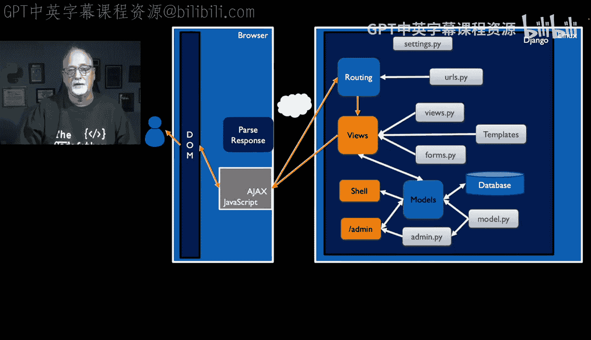

---

## 请求-响应循环回顾

上一节我们介绍了传统的Web请求-响应循环：浏览器向服务器发送请求，服务器通过URL路由到视图，视图处理并返回HTML，浏览器解析HTML并更新文档对象模型（DOM）。我们主要使用JavaScript在客户端操作DOM。

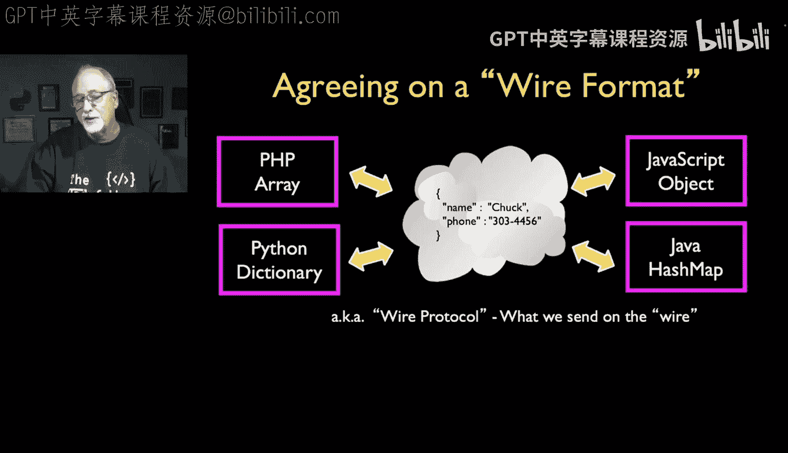

本节中，我们将向前迈出重要一步。我们将探讨如何让JavaScript直接向服务器代码发起请求，通过视图和URL获取数据，而不仅仅是获取用于渲染的HTML标记。这里的核心区别在于，我们传输的不再是HTML标记，而是数据。

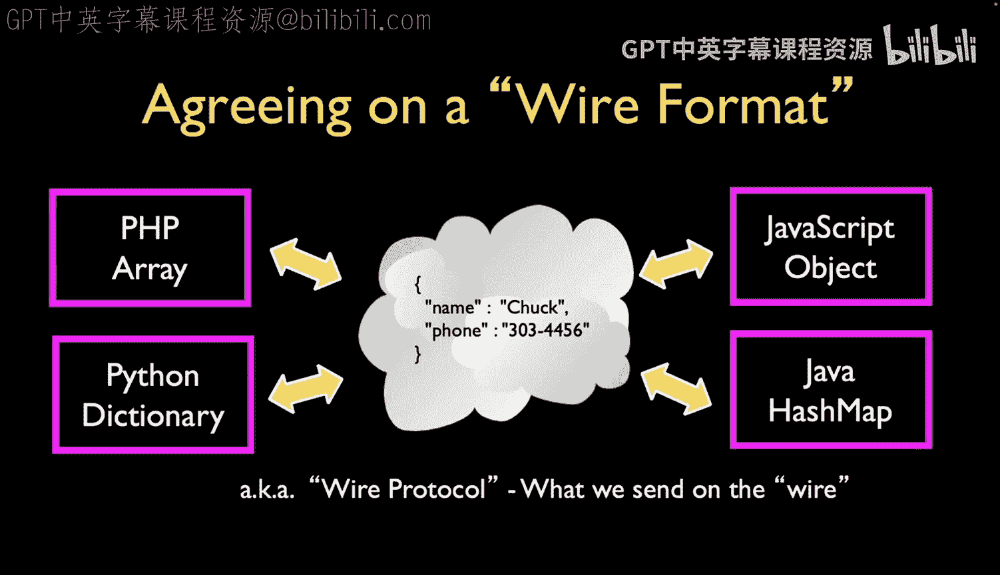

## 数据交换格式的演变

Web发展已久，传统的请求-响应循环非常有效。但随着应用复杂化，一个问题出现了：我们能否获取HTML之外的东西？随之而来的争论是：应该使用什么语法来传输数据？

最初，XML（可扩展标记语言）是首选方案。事实上，术语“Ajax”中的“X”就代表XML。然而，在实践中，我们更多时候使用的是JSON，而非XML。因此，我们需要一种各方都同意的“线格式”——一种能在网络传输中使用的通用数据表示法。

## 什么是序列化与反序列化？

不同编程语言有不同的数据结构：PHP有数组，Python有字典，JavaScript有对象，Java有哈希映射和数组列表等。为了在不同语言间交换数据，我们必须约定一种通用的线格式。

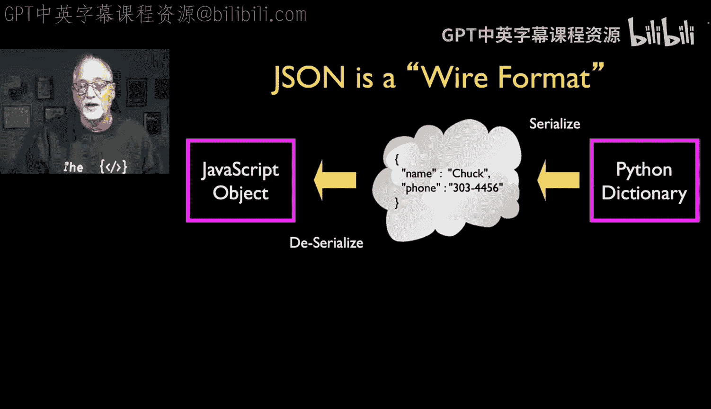

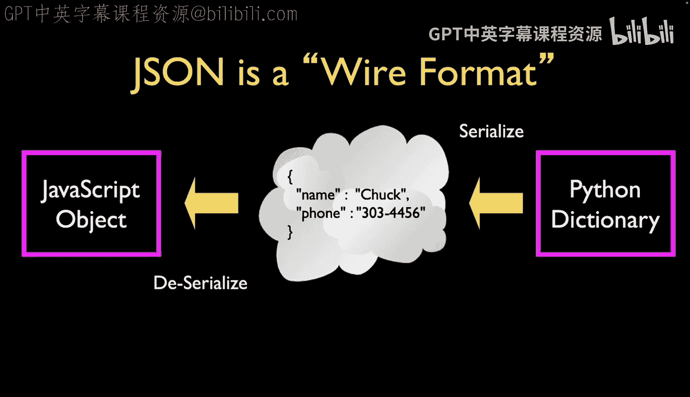

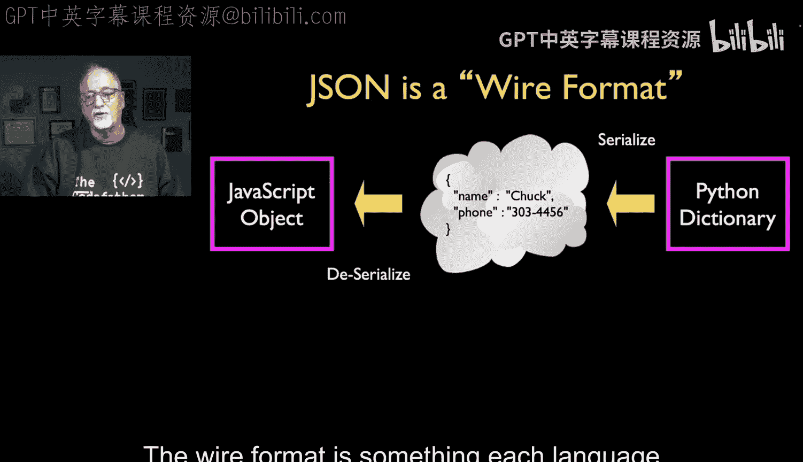

这个过程涉及两个关键步骤：
1.  **序列化**：将服务器内部的结构（如Python字典）转换为字符串，以便通过网络传输字符。
2.  **反序列化**：在接收端（如浏览器），将接收到的字符串转换回本地的数据结构（如JavaScript对象）。

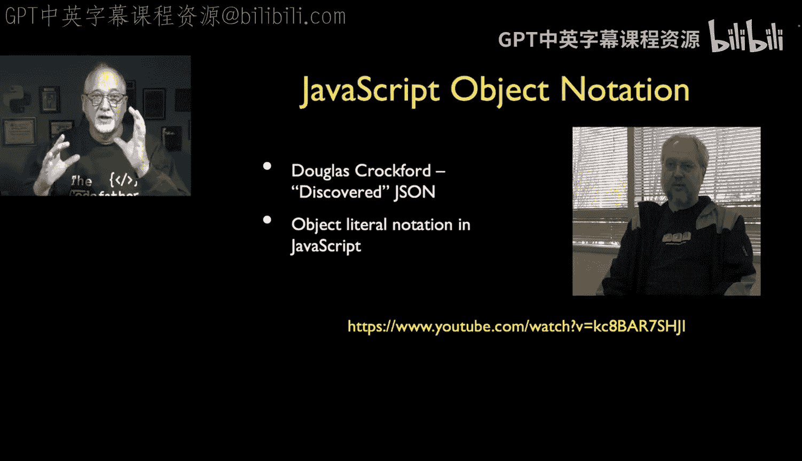

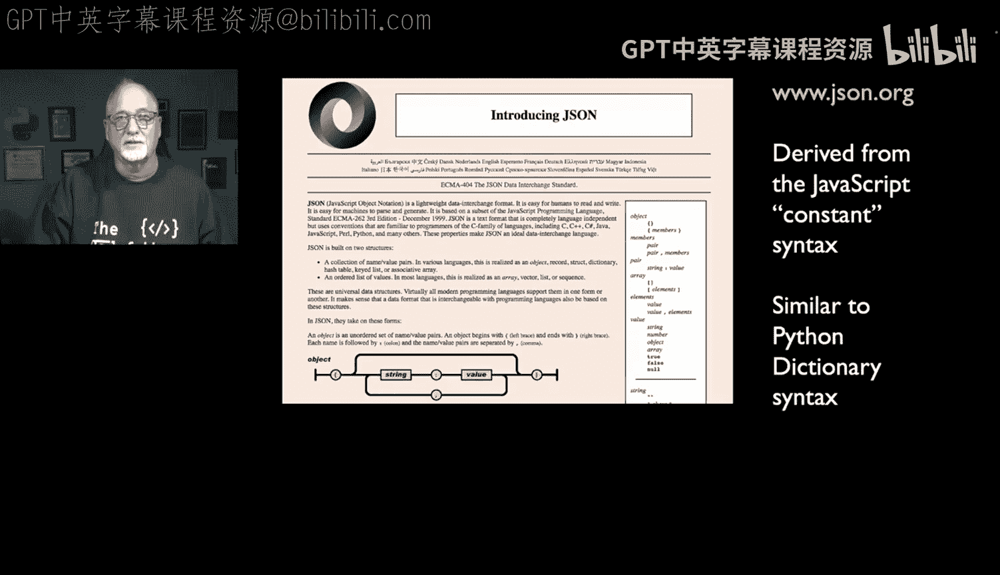

JSON就是这样一种被广泛接受的线格式。无论使用何种服务器端语言，它们都需要能够将数据序列化为JSON字符串发送，并能够将接收到的JSON字符串反序列化为本地对象。

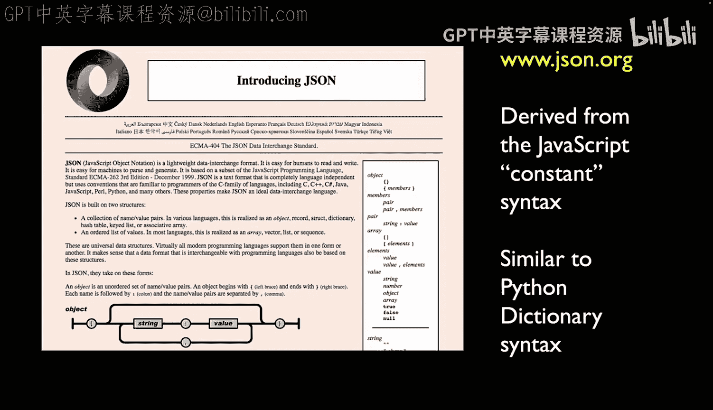

## JSON的起源与语法

JSON的流行很大程度上归功于Douglas Crockford。他并非发明者，但他认识到了这种格式的简洁与实用，并对其进行了规范。JSON语法本质上是JavaScript对象字面量语法的一个子集，它非常简单，以至于许多开发者会觉得它非常自然。

以下是一个JavaScript对象字面量的例子：
```javascript
const who = {
    "name": "Chuck",
    "age": 29,
    "college": true
};
```
JSON语法与此非常相似，它规定：
*   数据以键值对形式存在。
*   键名必须用双引号包裹。
*   值可以是字符串、数字、布尔值、数组、对象或`null`。
*   数据由逗号分隔，花括号`{}`保存对象，方括号`[]`保存数组。

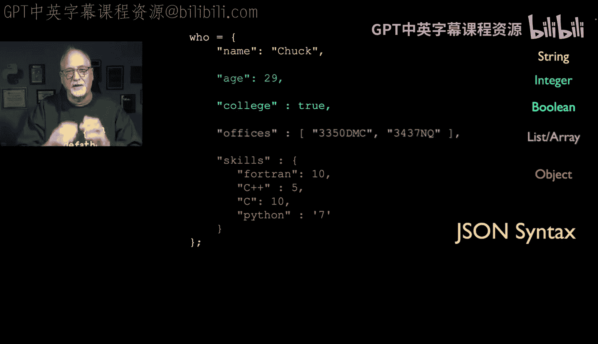

JSON与Python字典的语法也高度相似，这使得在Python和JavaScript之间交换数据变得非常直观。

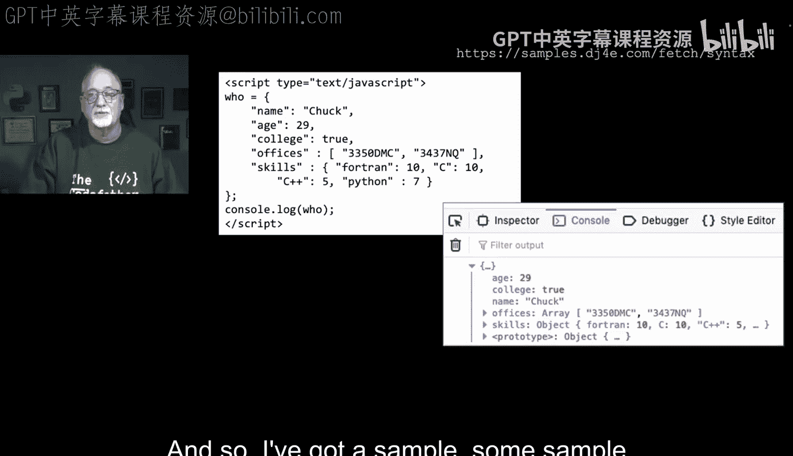

## 在Django中返回JSON

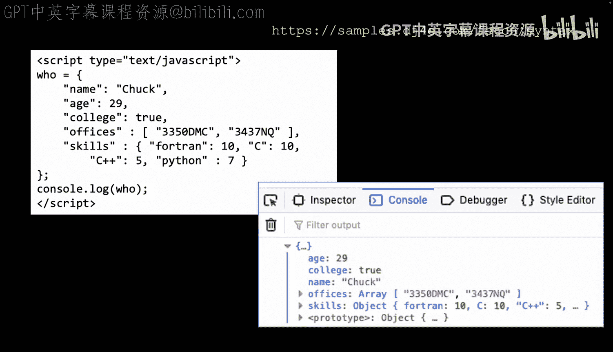

现在，我们来看看如何在Django视图中生成并返回JSON数据。

假设我们有一个简单的视图函数：
```python
import time
from django.http import JsonResponse

def json_fun(request):
    time.sleep(1)  # 仅为演示，通常不需要暂停
    data = {
        "name": "Chuck",
        "age": 29,
        "college": True
    }
    return JsonResponse(data)
```
在这个例子中：
1.  我们创建了一个Python字典 `data`。
2.  使用Django的 `JsonResponse` 类来返回这个字典。
3.  `JsonResponse` 会自动将字典序列化为JSON字符串，并正确设置HTTP响应头（例如 `Content-Type: application/json`），然后将其发送给浏览器。

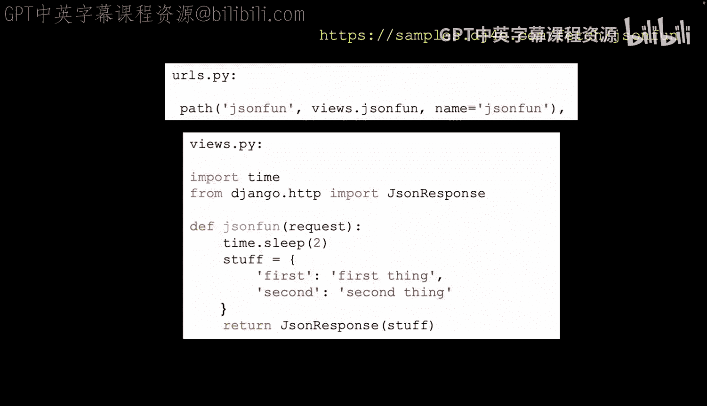

当浏览器访问这个端点时，它会收到一个JSON字符串。浏览器开发者工具可以显示原始的JSON字符串，也可以将其解析后以格式化的对象形式展示出来。

## 总结

本节课我们一起学习了JSON。我们了解到JSON是一种简洁、优雅的数据交换格式，它作为通用的“线格式”，使得不同编程语言（尤其是服务器端的Python和客户端的JavaScript）能够轻松地交换数据。我们回顾了序列化与反序列化的概念，探索了JSON与JavaScript对象字面量的紧密关系，并实践了如何在Django视图中使用 `JsonResponse` 来返回JSON数据。

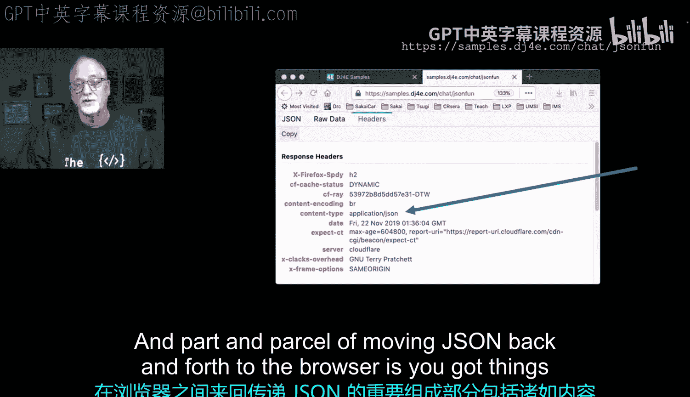

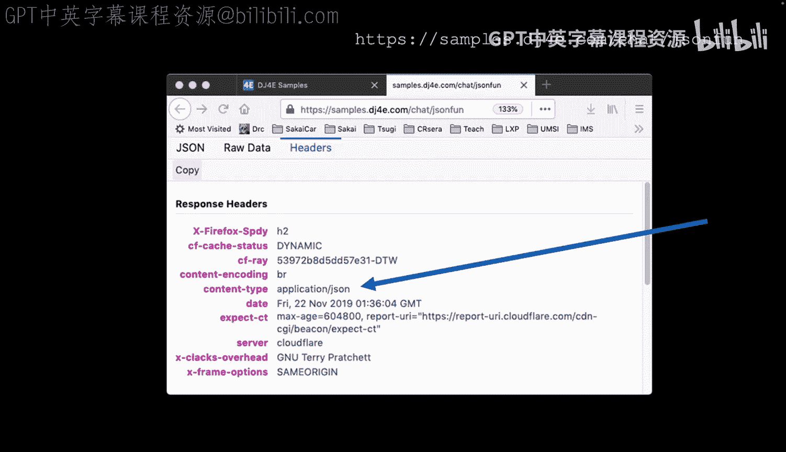

JSON的简单性使其成为现代Web开发中异步数据交换（Ajax）的基石。在接下来的课程中，我们将构建一个聊天应用，它将综合运用我们学到的JavaScript、DOM操作以及JSON数据交换技术。