# 038：JSON、AJAX与聊天应用 🗨️

在本节课中，我们将综合运用JSON与AJAX技术，构建一个简单的多用户聊天应用。该应用将通过服务器传输数据，并使用轮询机制实现实时消息更新。

## 概述

我们将创建一个基础聊天界面，并使用两个浏览器标签页模拟两个用户。在一个标签页中输入的消息，将通过异步方式自动出现在另一个标签页中。为实现此功能，我们将采用每4秒轮询一次服务器的方式获取最新消息。虽然这种方式效率不高，但它能清晰地展示AJAX与JSON的工作流程。

## 项目结构解析

上一节我们介绍了JSON与AJAX的基本概念，本节中我们来看看如何将它们整合到一个实际应用中。

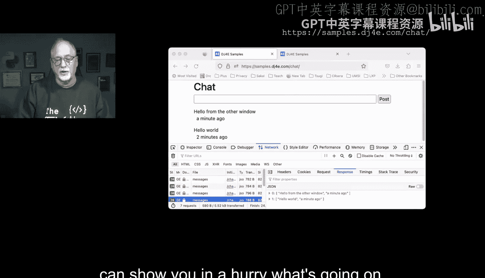

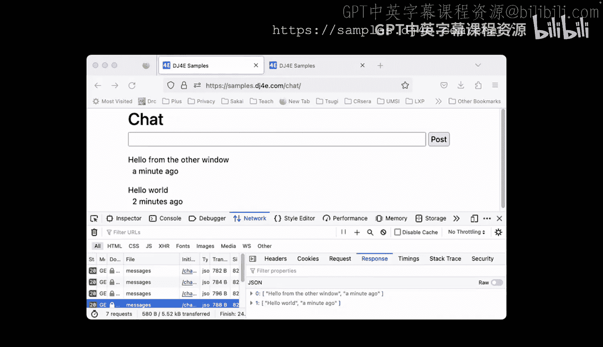

### URL配置

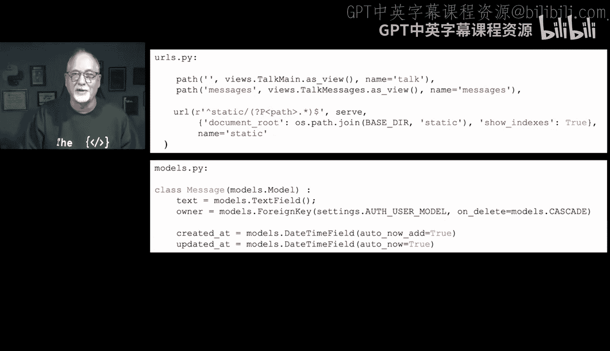

首先，查看项目的`urls.py`文件。我们定义了两个主要路径：

```python
# urls.py 示例
urlpatterns = [
    path('talk/', views.talk_main, name='talk'),
    path('messages/', views.messages_json, name='messages'),
]
```

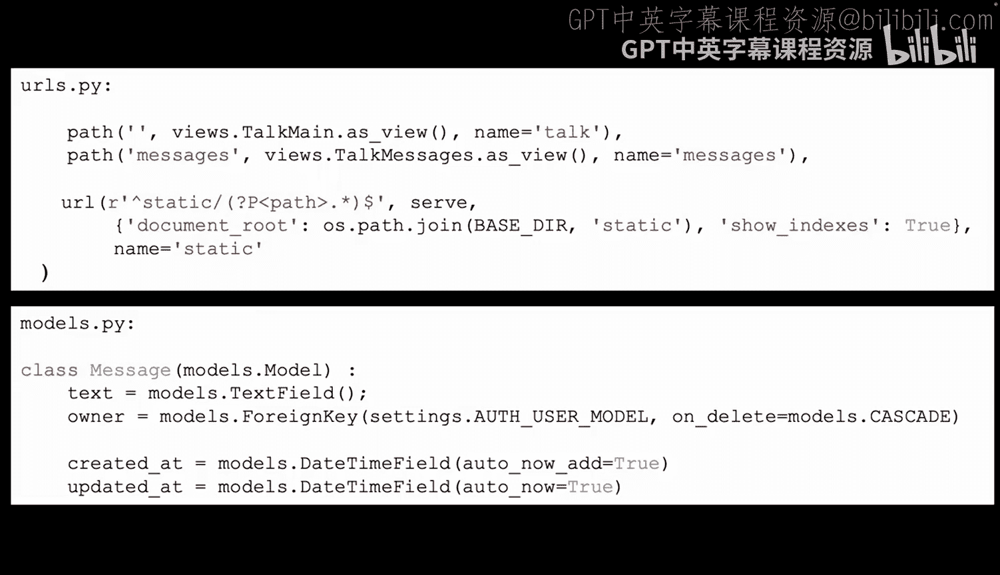

*   `talk/`：对应聊天应用的主页面视图。
*   `messages/`：这是一个JSON端点（API），用于提供最新的聊天消息数据。

### 数据模型

聊天功能的核心是一个简单的数据模型，用于存储每条消息。

```python
# models.py 示例
from django.db import models

class Message(models.Model):
    text = models.TextField()          # 消息内容
    user = models.CharField(max_length=100) # 发送者
    created_at = models.DateTimeField(auto_now_add=True) # 创建时间
```

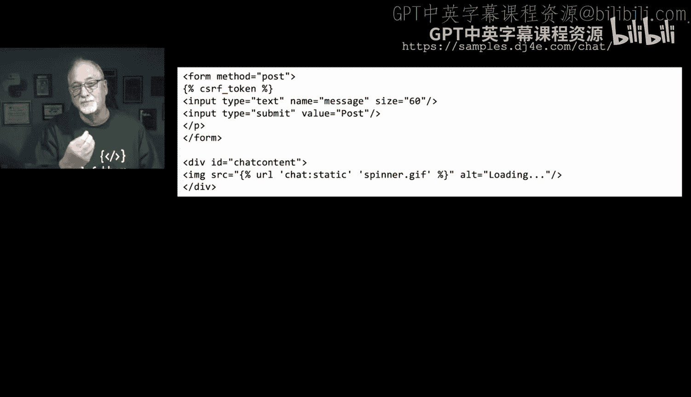

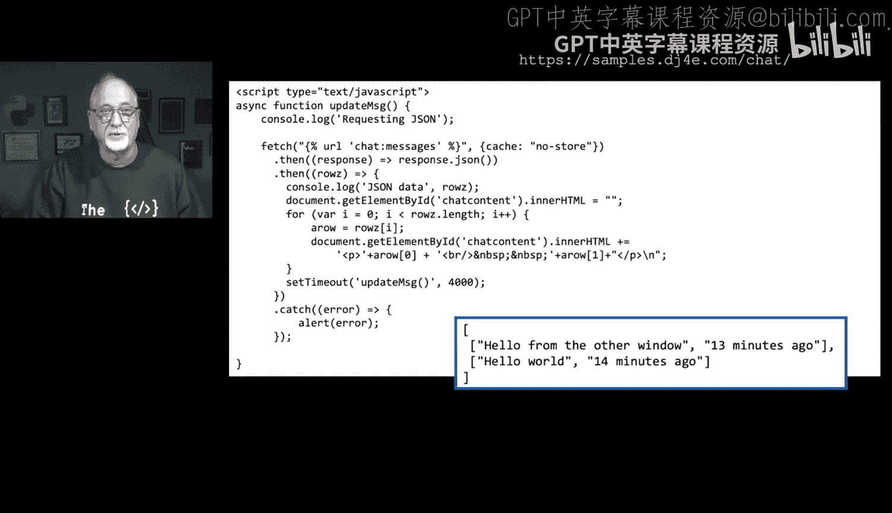

模型包含三个字段：消息文本、发送者以及自动记录的消息创建时间。创建时间将用于计算并显示“X分钟前”这样的友好时间格式。

### 视图逻辑

接下来，我们分析处理请求的视图（`views.py`）。


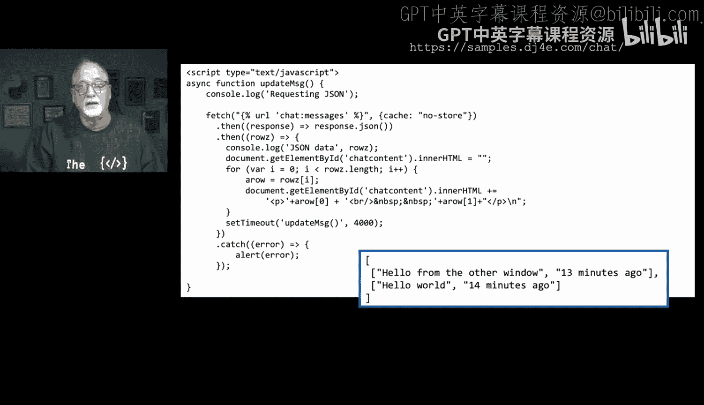

**主页面视图 (`talk_main`)**
这个视图很简单，仅负责渲染聊天界面的HTML模板。

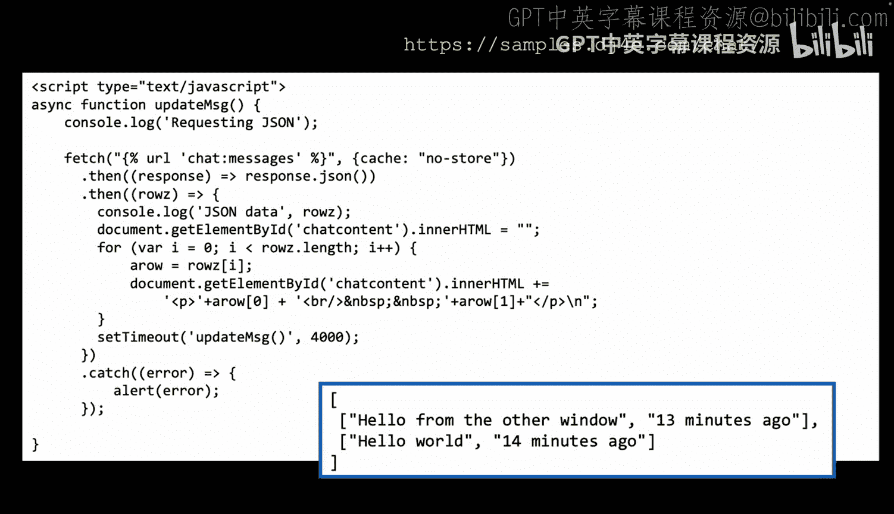

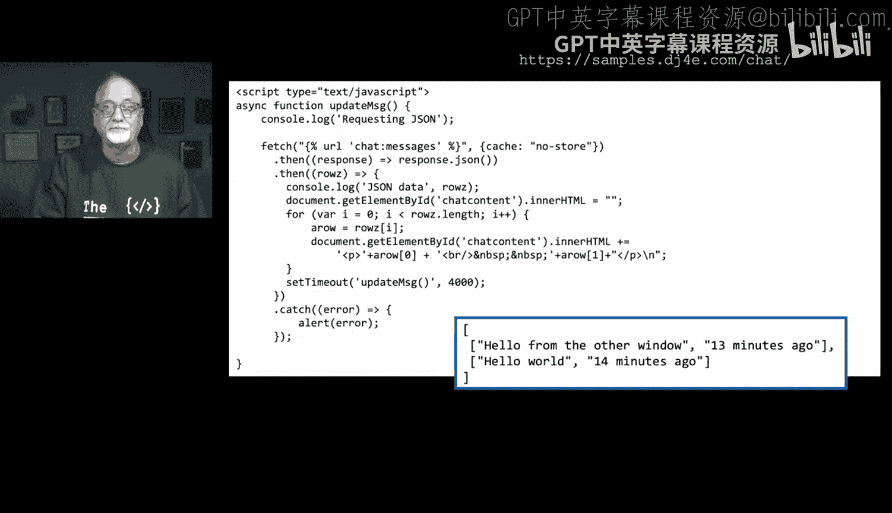

**消息提交视图 (`post_message`)**
当用户在表单中点击发送按钮时，数据会提交到这个视图。该视图将新消息保存到数据库，然后重定向回主聊天页面。

**JSON数据视图 (`messages_json`)**
这是关键视图，它处理来自前端的AJAX请求。以下是它的工作原理：

1.  接收`GET`请求。
2.  从数据库中查询最新的10条消息，按创建时间倒序排列。
3.  对每条消息数据进行处理，提取我们需要发送给前端的信息（如消息文本和友好时间格式）。
4.  将处理后的数据列表封装，并使用`JsonResponse`返回。

```python
# views.py 片段示例 (messages_json视图)
from django.http import JsonResponse
from django.utils.timesince import timesince
from .models import Message

def messages_json(request):
    messages = Message.objects.all().order_by('-created_at')[:10]
    results = []
    for msg in messages:
        # 处理数据，生成前端需要的格式
        result = [msg.text, f"{timesince(msg.created_at)} ago"]
        results.append(result)
    return JsonResponse({'results': results})
```

### 前端界面与交互

现在，我们看看用户看到的界面以及背后的JavaScript如何工作。


**HTML模板 (`talk.html`)**
模板中包含一个简单的表单用于输入消息，以及一个占位符`<div>`，其`id`为`chat-content`。初始时，这个`<div>`内包含一个加载动画（ spinner ）。

```html
<!-- talk.html 片段 -->
<form method="post" action="post">
    <input type="text" name="message" placeholder="输入消息">
    <button type="submit">发送</button>
</form>
<div id="chat-content">
    <!-- 初始为加载动画，随后会被JavaScript替换为消息列表 -->
    
</div>
```

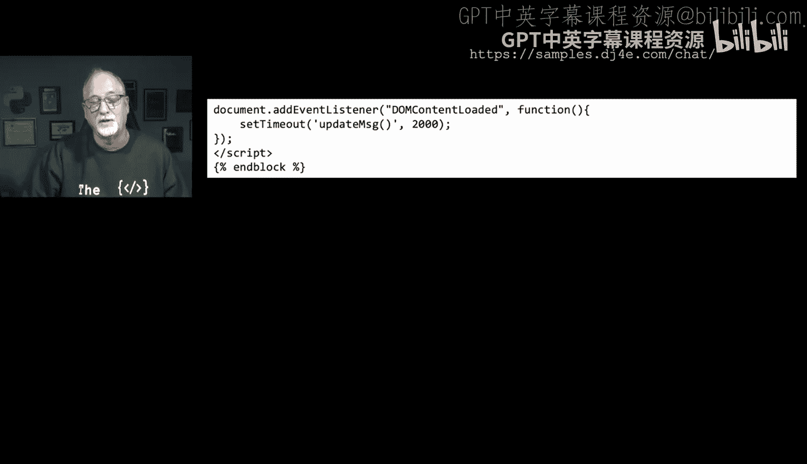

**JavaScript 动态更新**
页面加载完成后，JavaScript开始接管，实现动态更新。

以下是实现此功能的核心JavaScript代码逻辑：

1.  **定义更新函数 (`updateMessages`)**：这个函数使用`fetch()` API向`/messages/`端点发起请求，获取最新的JSON格式消息数据。
2.  **处理响应**：通过Promise链处理响应。首先将响应解析为JSON，然后得到消息数据数组。
3.  **更新DOM**：清空`chat-content` div的内容（移除旧的列表或加载动画）。接着，遍历消息数组，为每条消息生成一个包含文本和时间的段落（`<p>`标签），并将其追加到`chat-content` div中。
4.  **设置轮询**：使用`setTimeout`函数，让`updateMessages`函数每4秒（4000毫秒）自动执行一次，从而实现定期检查新消息。
5.  **错误处理**：使用`.catch()`捕获可能的网络或服务器错误，并进行提示。
6.  **初始化**：通过监听`DOMContentLoaded`事件，在页面完全加载后，等待2秒首次执行`updateMessages`函数（为了让用户能看到初始的加载动画）。

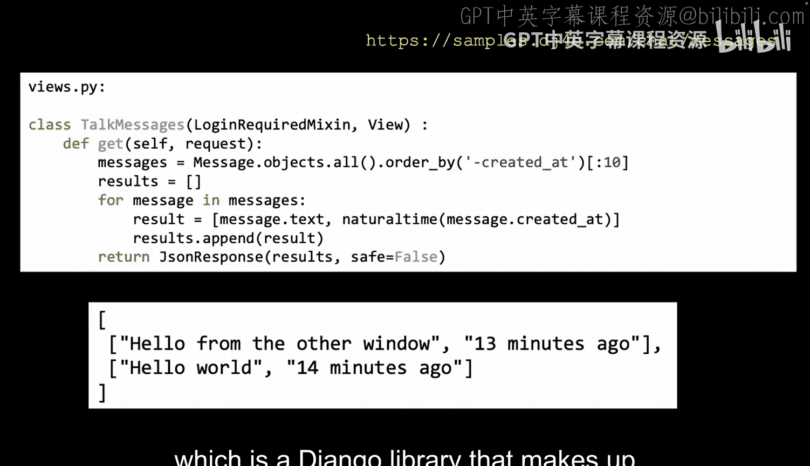

```javascript
// JavaScript 代码逻辑示例
function updateMessages() {
    fetch('/messages/', {cache: "no-store"})
        .then(response => response.json())
        .then(data => {
            let container = document.getElementById('chat-content');
            container.innerHTML = ''; // 清空当前内容
            // 假设返回的数据格式为 {results: [[消息1, 时间1], [消息2, 时间2], ...]}
            for (let row of data.results) {
                container.innerHTML += `<p>${row[0]} <br>  ${row[1]}</p>`;
            }
            // 设置4秒后再次更新
            setTimeout(updateMessages, 4000);
        })
        .catch(error => {
            alert('获取消息时出错: ' + error);
        });
}

// 页面加载完成后，启动更新流程
document.addEventListener('DOMContentLoaded', function() {
    setTimeout(updateMessages, 2000);
});
```

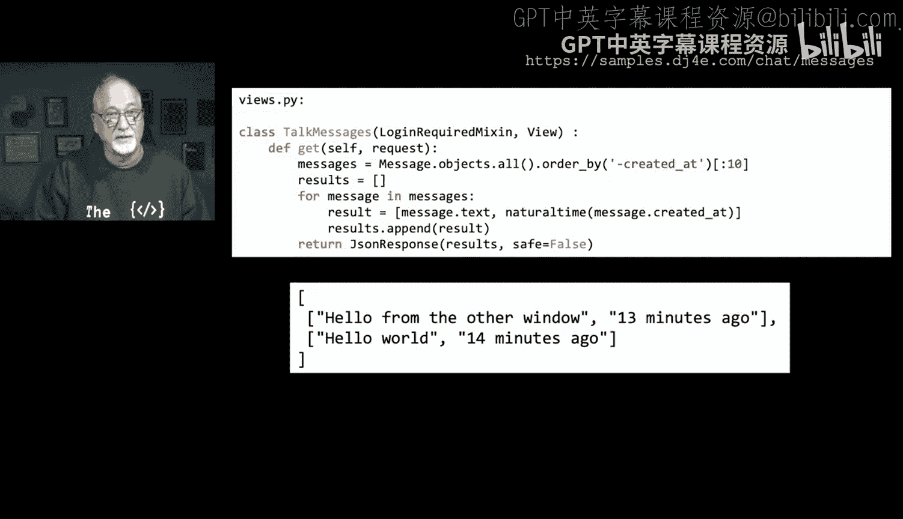

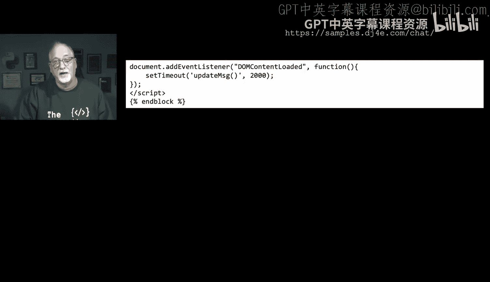

## 工作流程总结

让我们回顾一下整个应用的工作流程：

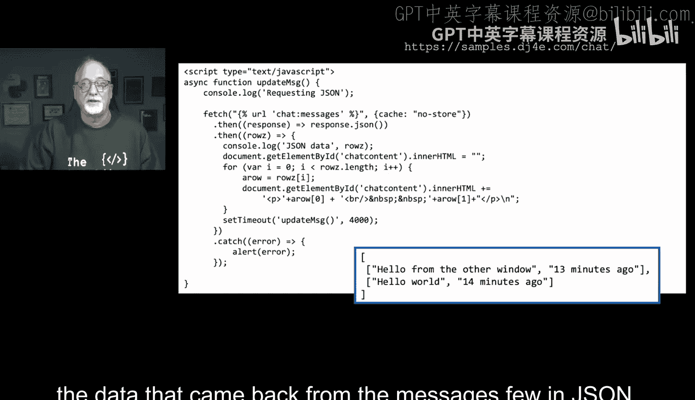

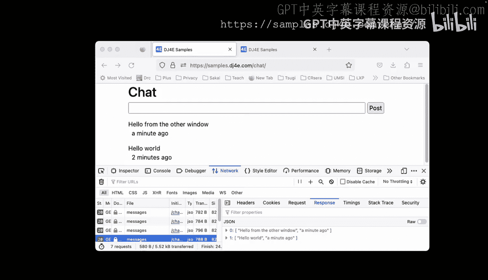

1.  用户A在浏览器标签1中打开聊天页面，看到加载动画。
2.  2秒后，JavaScript启动，向`/messages/`请求数据，并用返回的消息列表替换加载动画。
3.  用户A输入消息并提交。表单提交到服务器，消息被保存，页面刷新（重定向），短暂显示加载动画后再次被消息列表替换。
4.  与此同时，用户B在标签2中打开页面。JavaScript同样每4秒轮询一次`/messages/`。
5.  当服务器收到用户A的新消息后，用户B的浏览器在下一次轮询（最多4秒后）就会获取到这条新消息，并自动更新其页面上的消息列表，无需手动刷新。

由于DOM操作（清空和重填`chat-content`）在JavaScript函数中瞬间完成，并且浏览器通常会在函数执行完毕后统一重绘页面，因此用户会感觉更新是瞬间发生的，非常流畅。

## 本节课总结

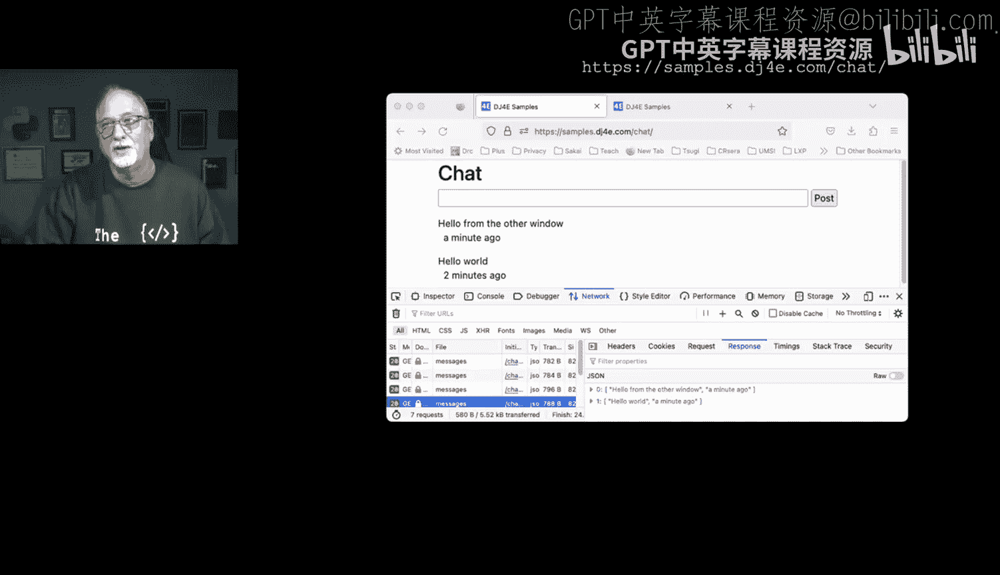

本节课中我们一起学习了如何利用JSON和AJAX构建一个动态的聊天应用。我们掌握了以下关键点：

*   **JSON作为数据桥梁**：服务器使用`JsonResponse`将数据库中的数据序列化为JSON格式，前端JavaScript再将其解析为可操作的对象。
*   **AJAX实现异步通信**：使用`fetch()` API，前端可以在不刷新整个页面的情况下，向服务器请求数据并更新页面的局部内容。
*   **轮询机制**：通过`setTimeout`定期执行AJAX请求，实现了简单的“实时”更新效果。
*   **前后端协作**：明确了后端视图（提供数据API）和前端的JavaScript（请求并渲染数据）各自的分工与协作方式。

JSON是一种强大且通用的数据交换格式，得到了几乎所有现代编程语言和平台的优秀支持。在Django和JavaScript中，对JSON的操作都非常简便，这使得它成为构建现代动态Web应用的理想选择。虽然本例中的轮询方式并非最高效的实时通信方案（更高效的方案如WebSocket），但它清晰地展示了异步数据交互的核心原理。