# Django for Everybody：4：JSON聊天示例代码详解 🗨️

在本节课程中，我们将详细解析一个使用Fetch、Ajax和`setTimeout`的简单聊天应用示例代码。这个示例将多个浏览器端的JavaScript概念整合在一起，演示了如何实现异步通信。


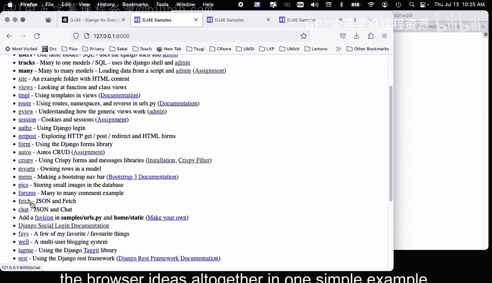

## 概述

我们将分析一个模拟两个用户在同一系统中聊天的应用。其核心机制是：一个用户发送消息后，另一个用户的屏幕无需手动刷新，就能通过异步请求自动看到新消息。我们将从URL配置、视图函数、前端JavaScript代码以及定时轮询机制等方面，逐步拆解其工作原理。

---

## URL配置与视图

首先，我们来看项目的URL配置和主要的视图函数。

### URL配置 (`urls.py`)

在`urls.py`文件中，我们定义了三个主要端点：

```python
urlpatterns = [
    path('talk/', views.talk, name='talk'),          # 主聊天页面
    path('messages/', views.messages_json, name='messages_json'), # JSON消息端点
    path('slow/', views.slow, name='slow'),          # 用于显示加载动画的端点
]
```

*   `talk/`：渲染主聊天页面。
*   `messages/`：一个返回JSON格式消息列表的API端点。
*   `slow/`：一个故意延迟的端点，用于演示加载动画。

### 主视图函数 (`views.py`)

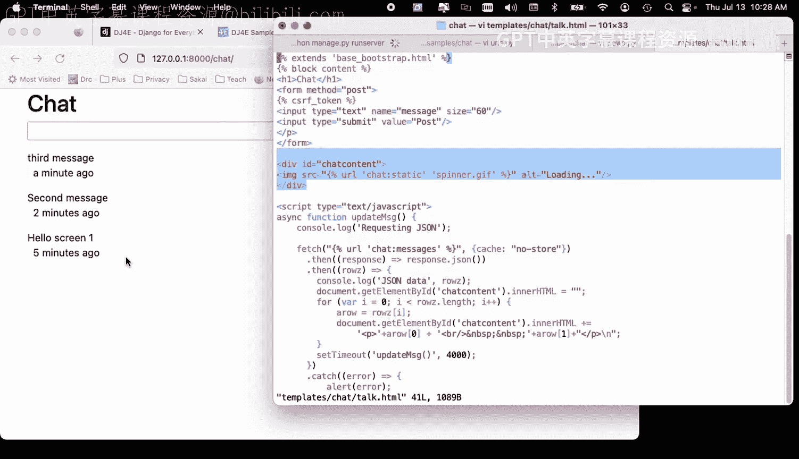

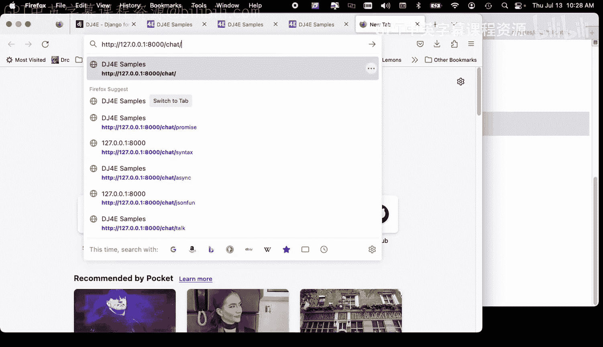

主视图函数`talk`处理GET请求，简单地渲染聊天页面模板。

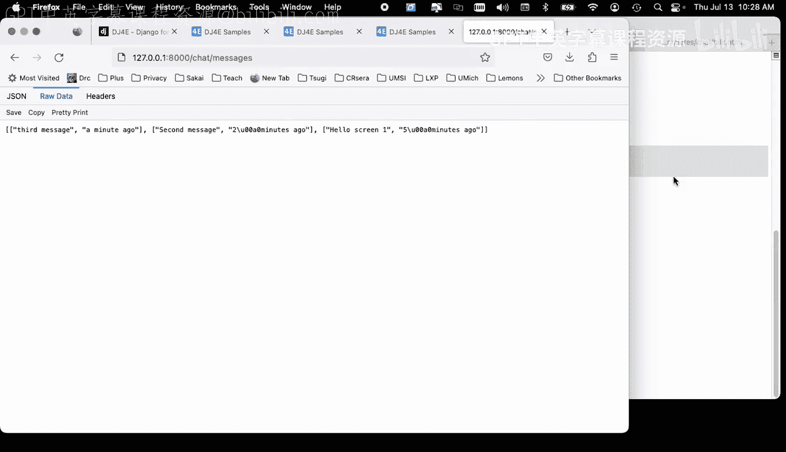

```python
def talk(request):
    return render(request, 'talk/talk.html')
```

---

## 前端页面结构

上一节我们介绍了后端的基本配置，本节中我们来看看前端页面的结构。

### 聊天页面模板 (`talk.html`)

`talk.html`模板包含了聊天应用的基本结构：

1.  一个用于提交新消息的表单。
2.  一个用于显示消息列表的`<div>`容器，其初始内容是一个加载动画（旋转图标）。
3.  引入关键的JavaScript代码。

```html
<form method="post">
    
    <input type="text" name="message" placeholder="Enter message">
    <button type="submit">Send</button>
</form>

<div id="chat-content">
    <!-- 初始加载动画 -->
    <div class="spinner">Loading...</div>
</div>

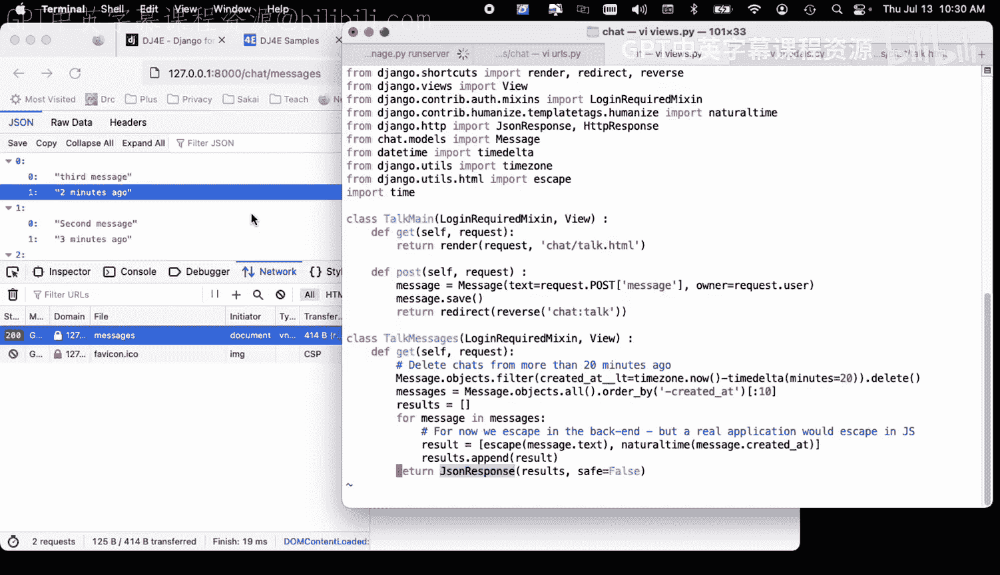

<script src=""></script>
```

当页面首次加载时，用户会看到这个加载动画。随后，JavaScript代码会通过Ajax请求获取真实数据并替换这个动画。

---

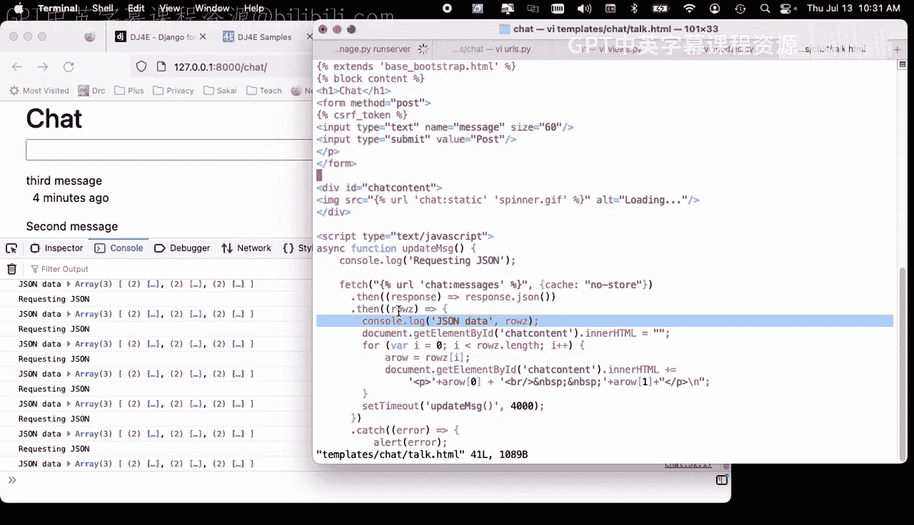

## 数据模型与JSON API

为了动态获取消息，我们需要一个提供数据的后端接口。

### 数据模型 (`models.py`)

消息数据由一个简单的模型`Message`管理，包含发送者、消息内容、创建时间等字段。

```python
class Message(models.Model):
    owner = models.ForeignKey(User, on_delete=models.CASCADE)
    text = models.TextField()
    created_at = models.DateTimeField(auto_now_add=True)
    updated_at = models.DateTimeField(auto_now=True)
```

### JSON视图函数 (`messages_json`)

`messages_json`视图负责处理对`/messages/`的请求，并返回最新的10条消息。

其工作流程如下：
1.  从数据库查询最新的10条消息。
2.  循环处理每条消息：对消息文本进行HTML转义（出于安全考虑，在后端完成），并使用`naturaltime`过滤器格式化时间（如“1分钟前”）。
3.  将处理好的数据构造成一个数组，并以JSON格式返回。

```python
from django.utils.html import escape
from django.contrib.humanize.templatetags.humanize import naturaltime
import json

def messages_json(request):
    # 获取最新的10条消息
    messages = Message.objects.order_by('-created_at')[:10]
    results = []
    for msg in messages:
        # 后端转义文本，格式化时间
        result = {
            'text': escape(msg.text),
            'time': naturaltime(msg.created_at)
        }
        results.append(result)
    # 返回JSON响应。注意：直接返回数组不是最佳实践，此处为简化示例。
    return JsonResponse(results, safe=False)
```

**关键点**：JSON API的作用不仅仅是返回原始模型数据。它经常需要从模型中获取数据，进行加工（如转义、格式化），使其更适合前端显示，然后再以JSON形式返回。

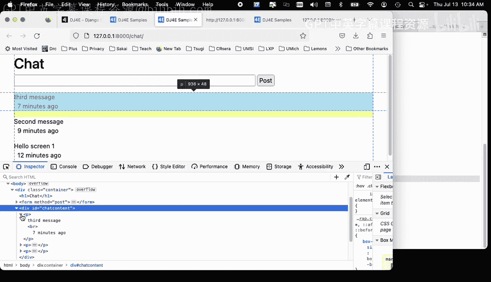

---

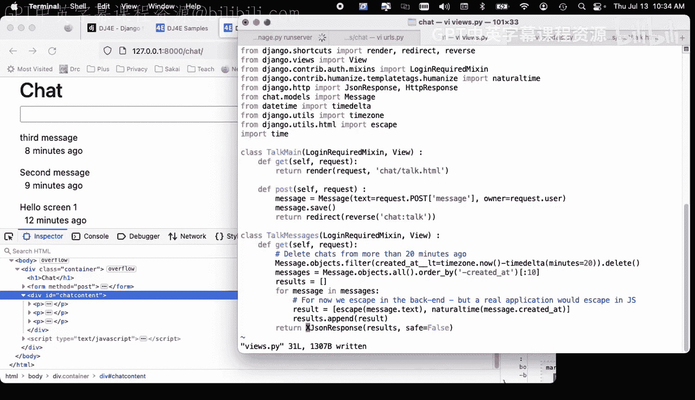

## 核心JavaScript逻辑

现在，我们进入最核心的部分：前端JavaScript如何与后端交互并动态更新页面。

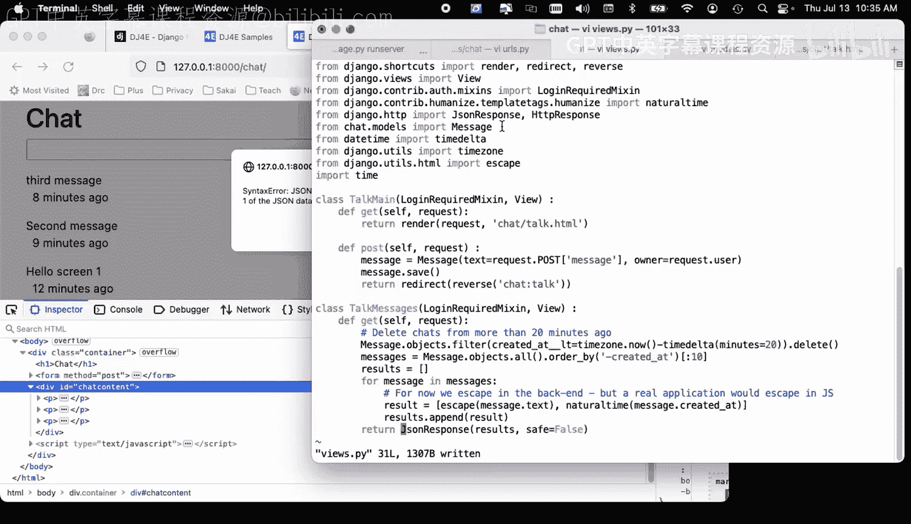

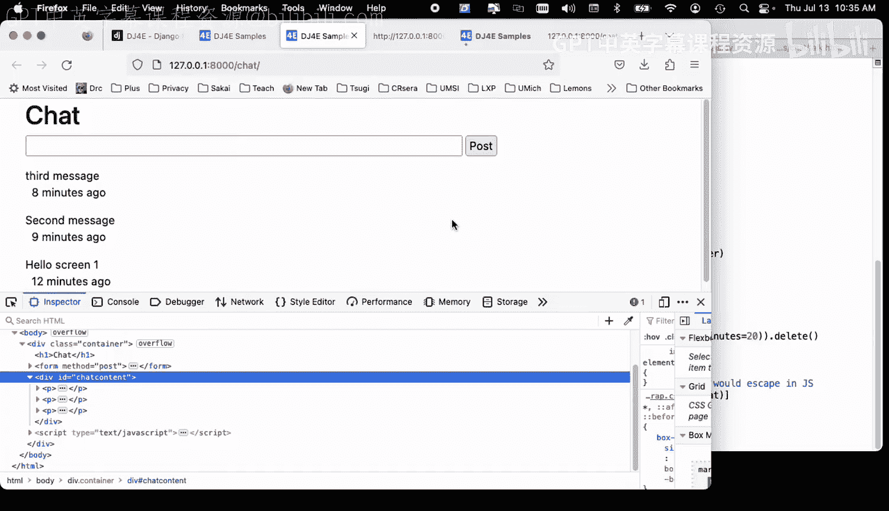

### 消息更新函数 (`updateMessages`)

`updateMessages`函数是应用的核心，它使用Fetch API异步获取消息数据并更新DOM。

以下是该函数的主要步骤：

```javascript
function updateMessages() {
    console.log('Requesting JSON...');
    // 1. 发起Fetch请求
    fetch('/messages/')
        .then(response => {
            // 2. 将响应解析为JSON对象
            return response.json();
        })
        .then(rows => {
            // 3. 成功获取数据后，更新DOM
            console.log(rows); // rows现在是一个JavaScript数组
            let contentDiv = document.getElementById('chat-content');
            // 3.1 清空容器（移除加载动画）
            contentDiv.innerHTML = '';
            // 3.2 遍历消息数组，构建HTML并插入
            for (let i = 0; i < rows.length; i++) {
                let msg = rows[i];
                contentDiv.innerHTML +=
                    `<p>${msg.text}<br> ${msg.time}</p>`;
            }
            // 3.3 成功更新后，计划下一次调用（实现轮询）
            setTimeout(updateMessages, 4000);
        })
        .catch(error => {
            // 4. 错误处理：捕获网络或服务器错误
            console.error('Fetch error:', error);
            alert('Failed to retrieve messages. Check console for details.');
        });
}
```

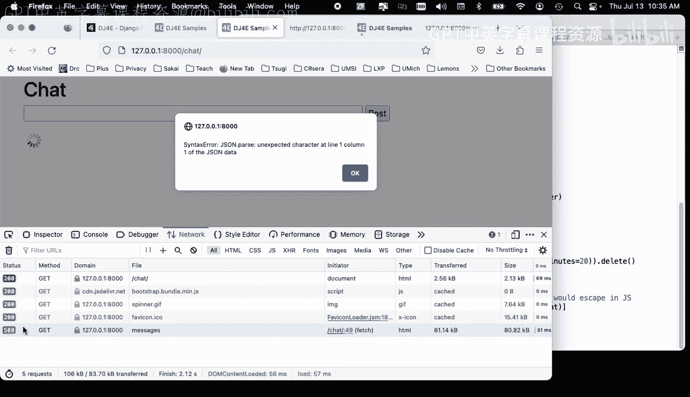

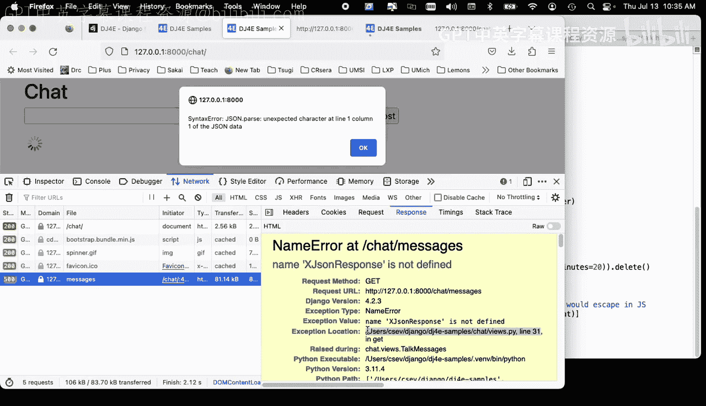

**代码解析**：
*   `fetch('/messages/')`：向JSON端点发起GET请求。
*   `.then(response => response.json())`：第一个Promise解析后，将响应体转换为JavaScript对象（数组）。
*   `.then(rows => { ... })`：第二个Promise在获得数据后执行。它清空消息容器，然后遍历数据数组，为每条消息生成HTML段落并追加到容器中。
*   `setTimeout(updateMessages, 4000);`：在成功更新后，设置一个4秒后再次调用`updateMessages`的定时器，从而实现定期轮询。
*   `.catch(...)`：捕获请求或处理过程中发生的任何错误，并给出提示。

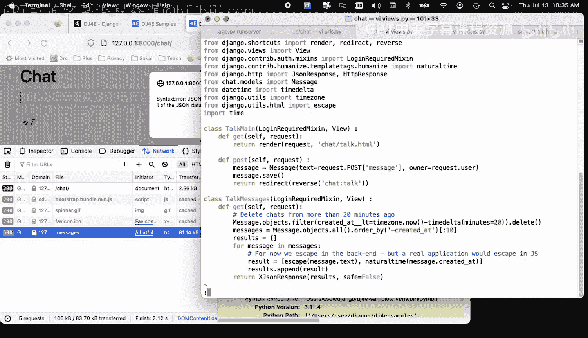

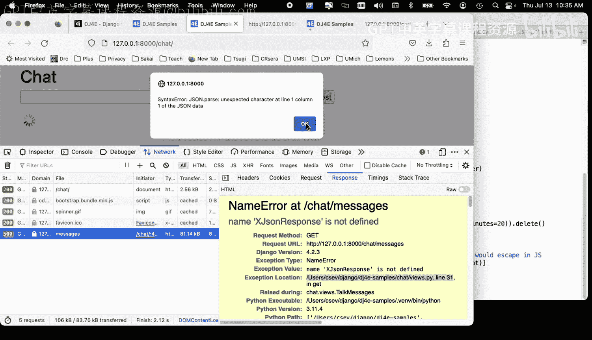

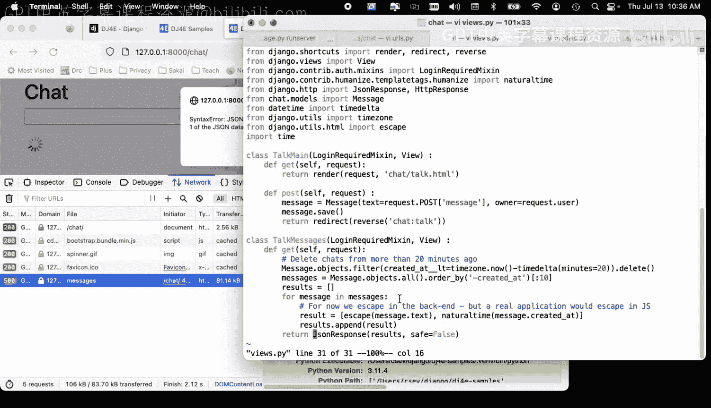

**重要概念**：`response.json()`方法将接收到的JSON字符串**解析**为浏览器可以操作的JavaScript对象或数组。

---

## 定时轮询与初始化

我们已经看到了单个更新周期如何工作，现在来看看整个应用是如何启动并持续运行的。

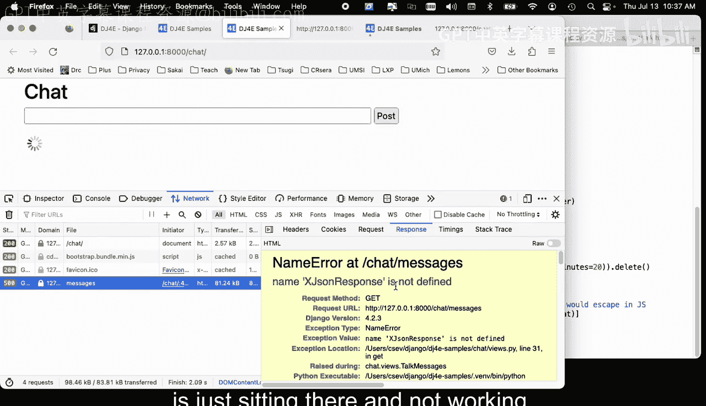

### 页面加载与初始延迟

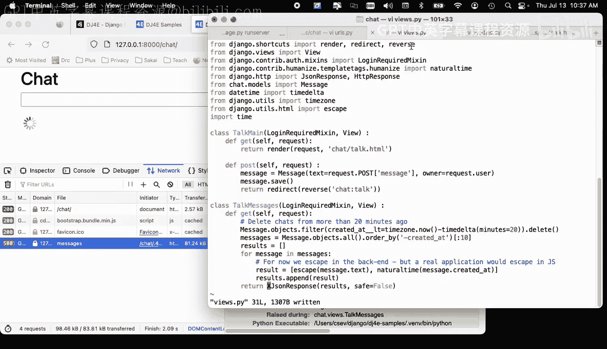

当页面加载完成后，我们并不立即获取消息，而是等待一个短暂的初始延迟。

```javascript
// 等待整个DOM加载完毕
document.addEventListener('DOMContentLoaded', function() {
    // 页面加载2秒后，执行第一次消息更新
    setTimeout(updateMessages, 2000);
});
```

*   `DOMContentLoaded`事件确保HTML文档完全加载和解析后再执行脚本。
*   第一个`setTimeout(updateMessages, 2000)`让加载动画显示2秒，然后才进行第一次数据获取，这提升了用户体验。

### 轮询机制

应用通过递归调用`setTimeout`来实现轮询：
1.  第一次`updateMessages`调用成功后，会设置一个4秒后的定时器再次调用自己。
2.  这个过程不断重复，从而每隔大约4秒就自动检查一次新消息。
3.  **注意**：错误处理`catch`块中**没有**设置新的`setTimeout`。这意味着如果某次请求失败（如服务器错误、网络断开），轮询会自动停止，防止在错误状态下持续发送无效请求。

**关于轮询的说明**：虽然本示例使用了简单的定时轮询（每4秒请求一次），但这并不是高效的方式，因为它会消耗不必要的网络和服务器资源。在实际生产环境中，应考虑使用更高级的技术，如WebSockets或Server-Sent Events (SSE)，来实现真正的实时通信。本例采用轮询仅是为了以最简单的方式演示异步更新概念。

---

## 关键要点与总结

本节课中我们一起学习了如何构建一个简单的异步聊天应用前端。

**核心机制总结**：
1.  **异步数据获取**：使用`fetch()` API从`/messages/` JSON端点获取数据，避免整页刷新。
2.  **DOM操作**：JavaScript在获取数据后，动态清空并重写`#chat-content`容器内的HTML，实现内容的局部更新。
3.  **定时轮询**：通过`setTimeout`递归调用，定期检查并更新消息。
4.  **错误处理**：使用Promise的`.catch()`方法捕获请求异常，为用户提供反馈并停止错误状态下的轮询。

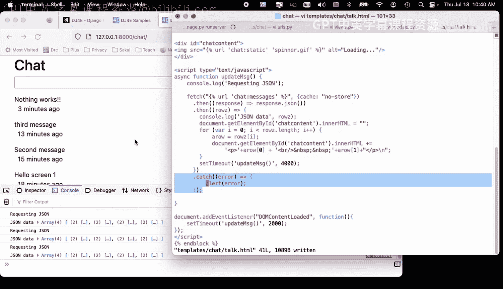

**需要注意的实践**：
*   **返回JSON数组**：本示例中，视图直接返回了一个JSON数组（`JsonResponse(results, safe=False)`）。虽然可行，但更佳实践是返回一个包含状态码和数据等信息的对象，例如：`{'status': 'ok', 'messages': results}`。
*   **轮询的效率**：如前所述，定时轮询并非实时应用的最佳选择，仅适用于教学演示。

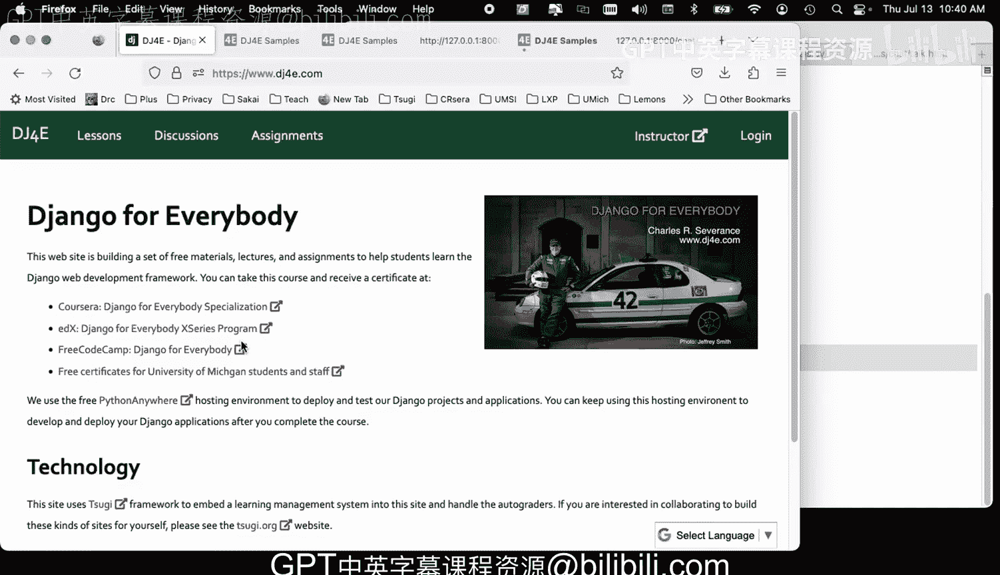

这个示例虽然简单，但优雅地将异步请求、定时器、DOM操作和错误处理等多个前端概念结合在一起，为理解更复杂的实时Web应用打下了坚实的基础。