# Django for Everybody：4.7：网站图标（Favicon）实战教程 🎯

在本节课程中，我们将学习如何在Django应用中添加和自定义网站图标（Favicon）。网站图标是显示在浏览器标签页、书签栏和地址栏旁的一个小图标，它是网站品牌形象的一部分。

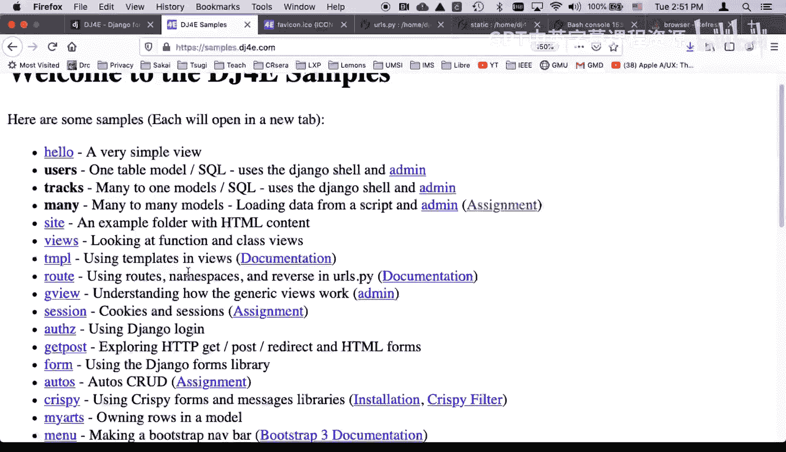

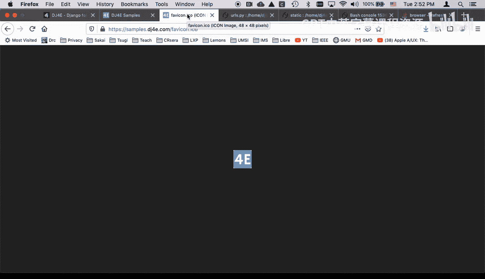

上一节我们介绍了静态文件的配置，本节中我们来看看如何为网站添加一个专属的图标。

## 理解Favicon的工作原理

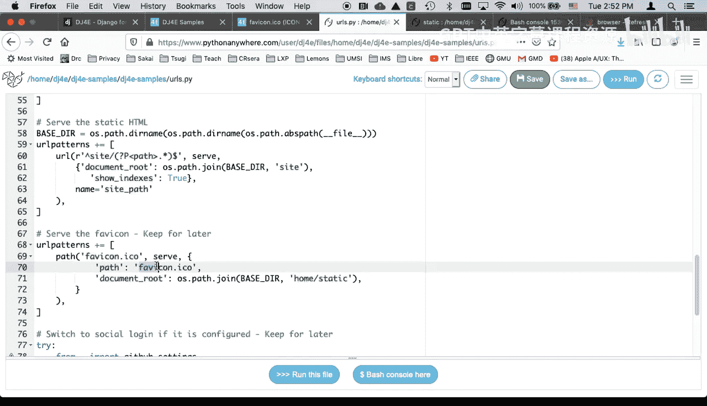

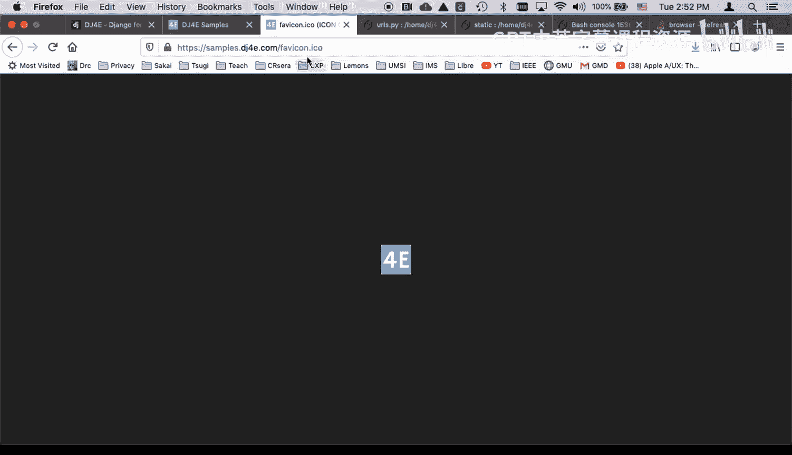

网站图标通常是一个名为 `favicon.ico` 的文件，放置在网站的根目录或静态文件目录中。浏览器会自动向网站根目录下的 `/favicon.ico` 路径请求这个图标。

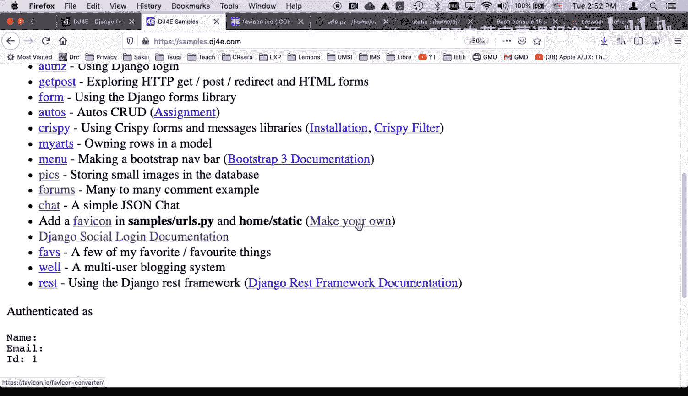

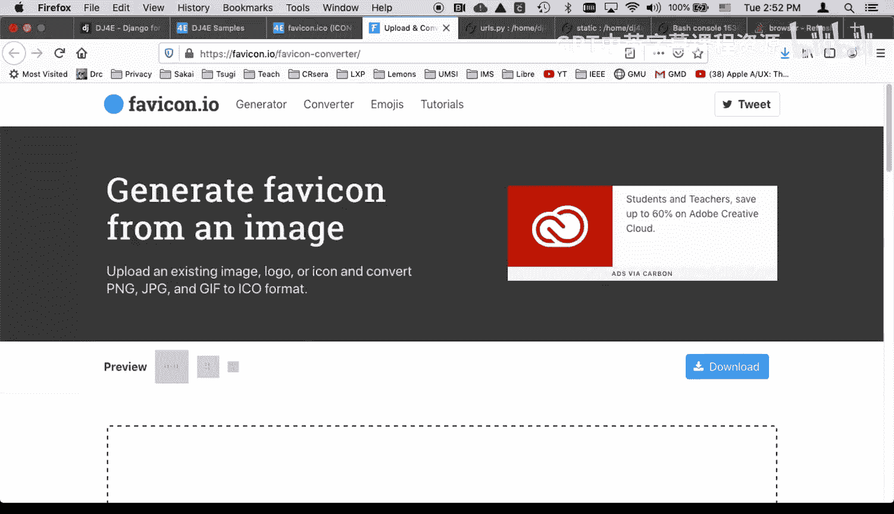

在Django中，我们通过配置静态文件服务来提供这个图标。以下是一个典型的URL配置示例，它使用 `static` 函数来服务位于 `static` 目录下的 `favicon.ico` 文件：

```python
# urls.py 示例片段
from django.contrib.staticfiles.urls import staticfiles_urlpatterns
from django.conf import settings
from django.conf.urls.static import static

urlpatterns += staticfiles_urlpatterns()
urlpatterns += static(settings.STATIC_URL, document_root=settings.STATIC_ROOT)
# 这行配置允许Django在开发服务器上提供 static/favicon.ico 文件
```

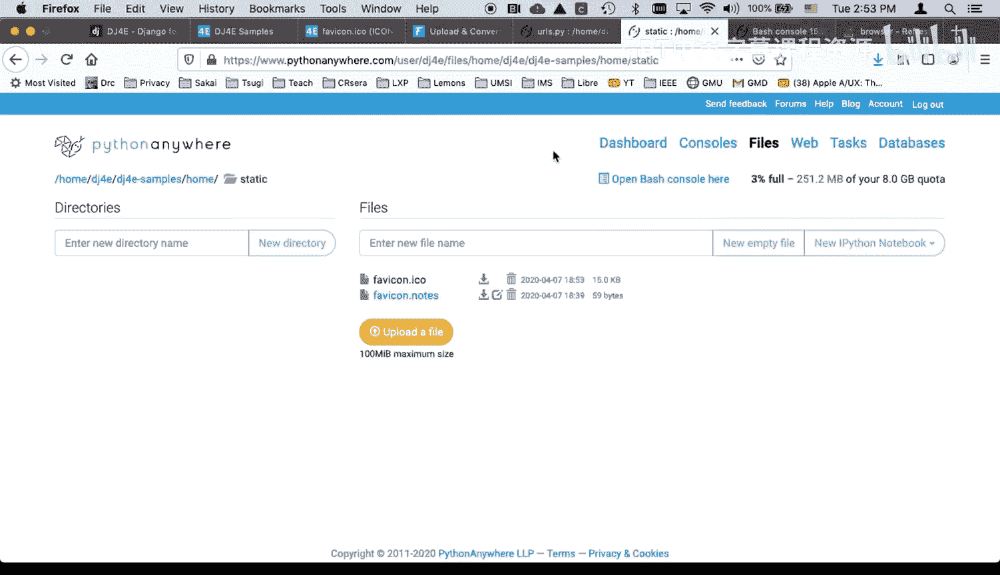

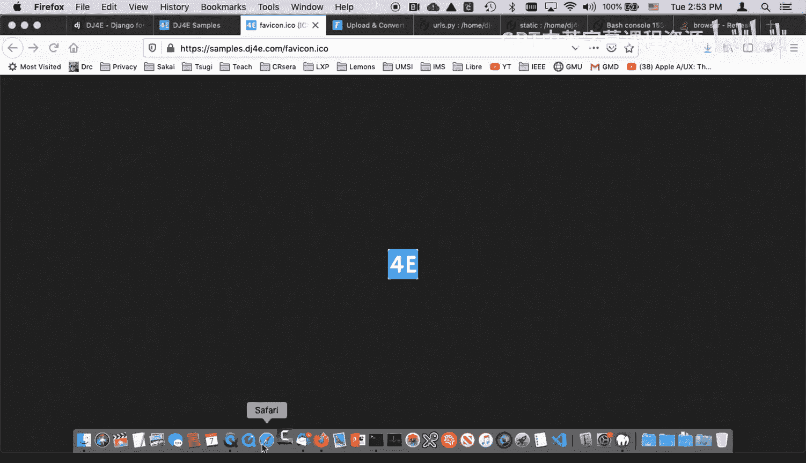

## 创建并替换自定义Favicon

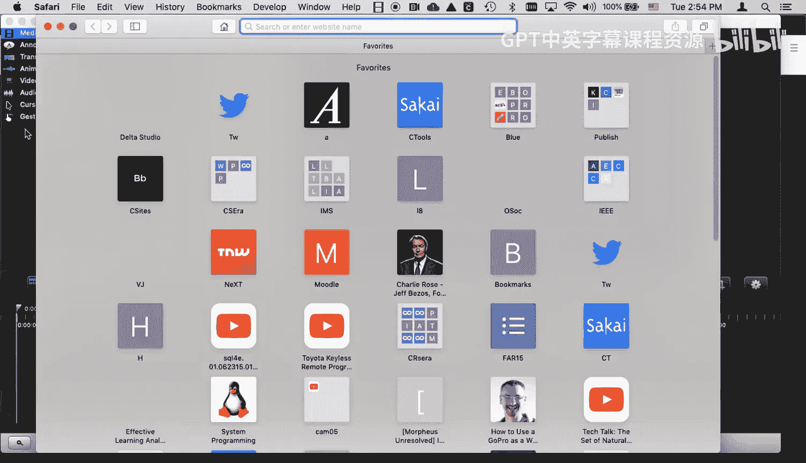

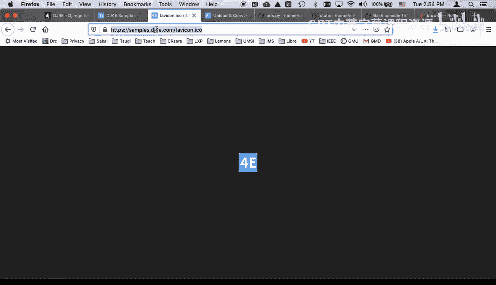

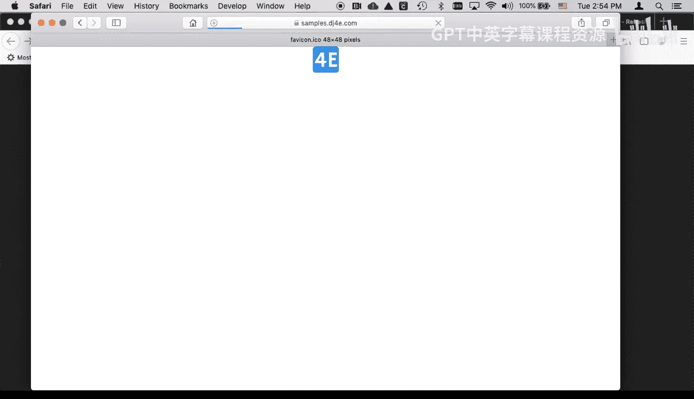

以下是创建和使用自定义图标的步骤：

1.  **准备图标文件**：首先，你需要一个图标文件。你可以使用在线工具（如Favicon Converter）将普通的PNG或JPG图片转换为ICO格式。ICO是一种专用于图标的图像格式。

2.  **替换默认文件**：将生成的新 `favicon.ico` 文件上传到你的Django项目的静态文件目录中，通常路径是 `your_app/static/favicon.ico`，并覆盖旧文件。

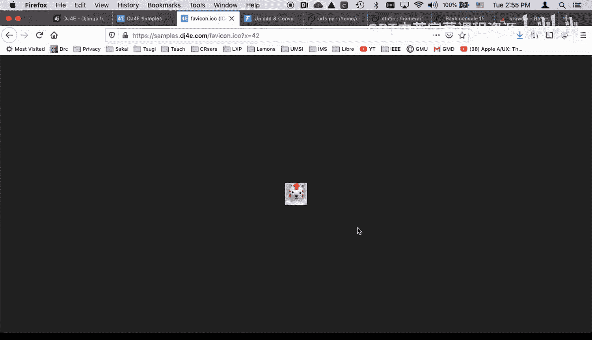

3.  **处理浏览器缓存**：浏览器会强力缓存Favicon。即使你更新了服务器上的文件，浏览器可能仍然显示旧的图标。为了解决这个问题，一个有效的方法是在访问图标URL时添加一个查询参数。例如，访问 `/favicon.ico?version=3`。因为查询参数不是路径的一部分，浏览器会将其视为一个新的资源请求，从而绕过缓存获取新图标。

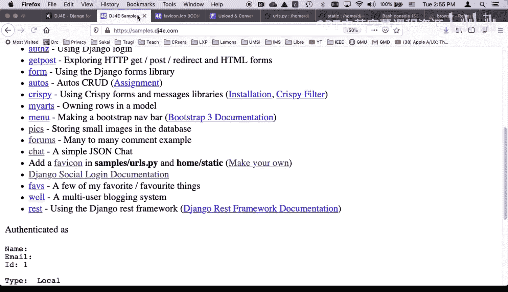

## 总结

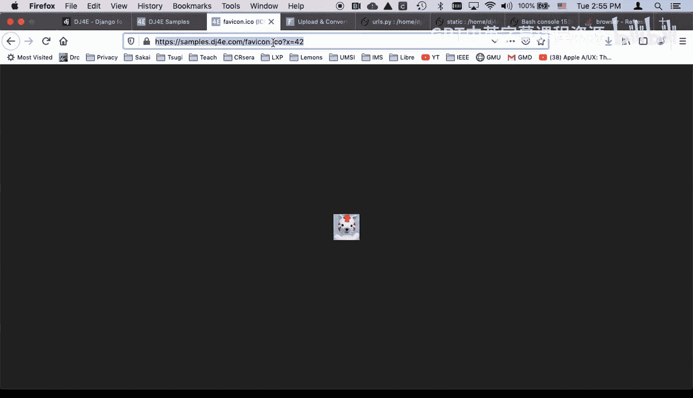

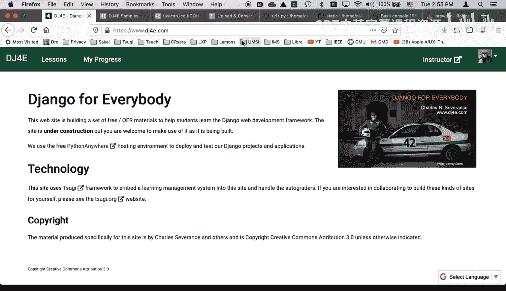

本节课中我们一起学习了Django网站图标的添加与自定义。核心要点包括：Favicon是网站品牌标识的一部分；通过Django的静态文件系统提供图标；由于浏览器缓存机制，更新图标后可能需要通过添加查询参数（如 `?v=2`）来强制刷新。现在，你可以为自己的Django应用创建一个独特的图标了。