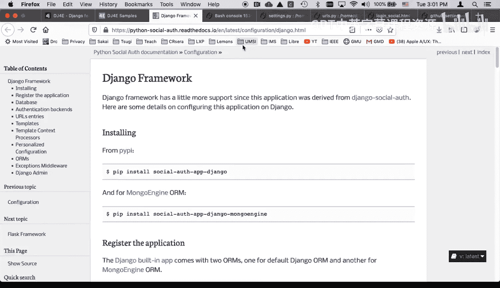
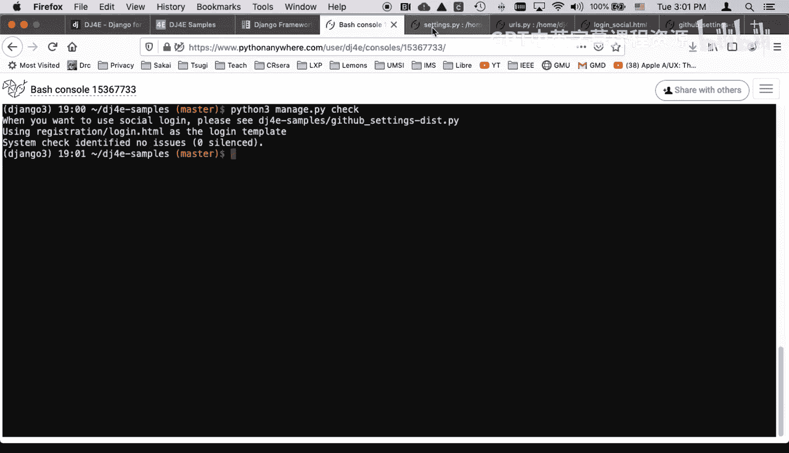
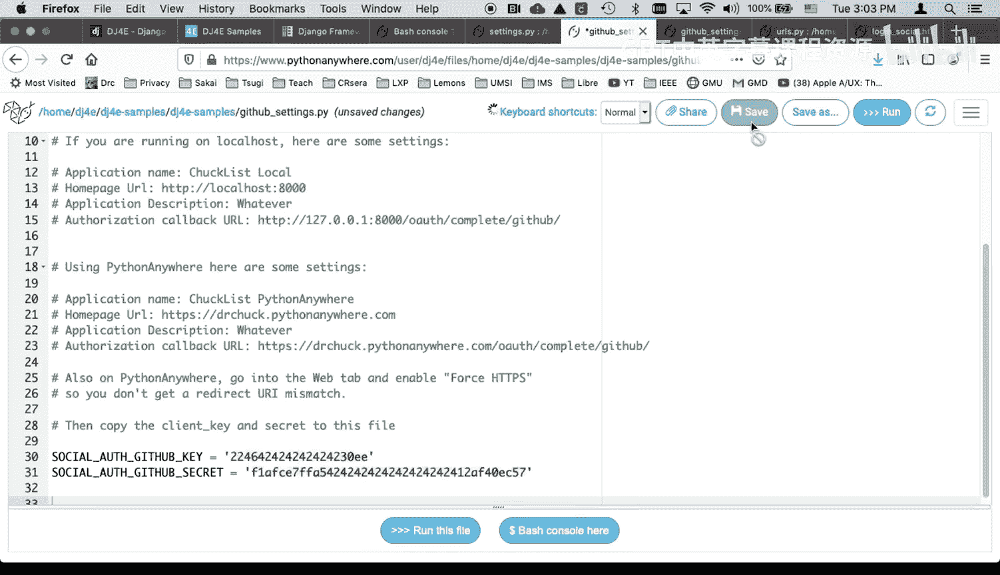
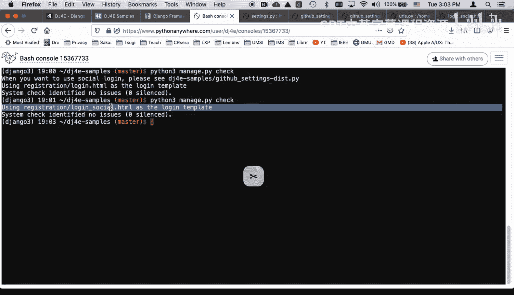
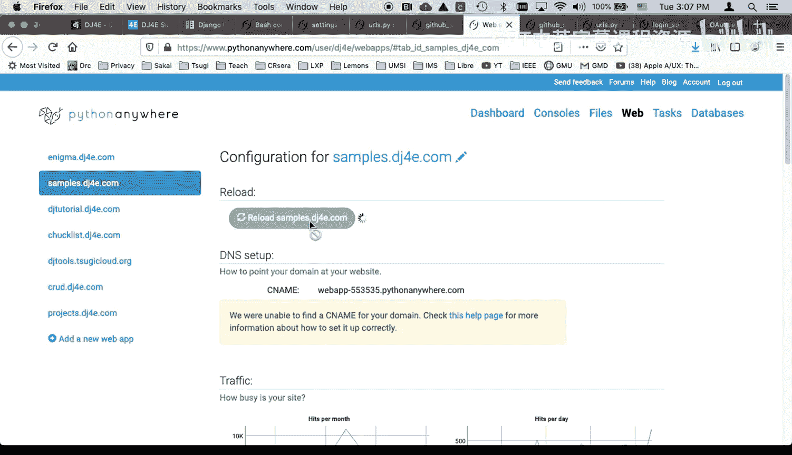
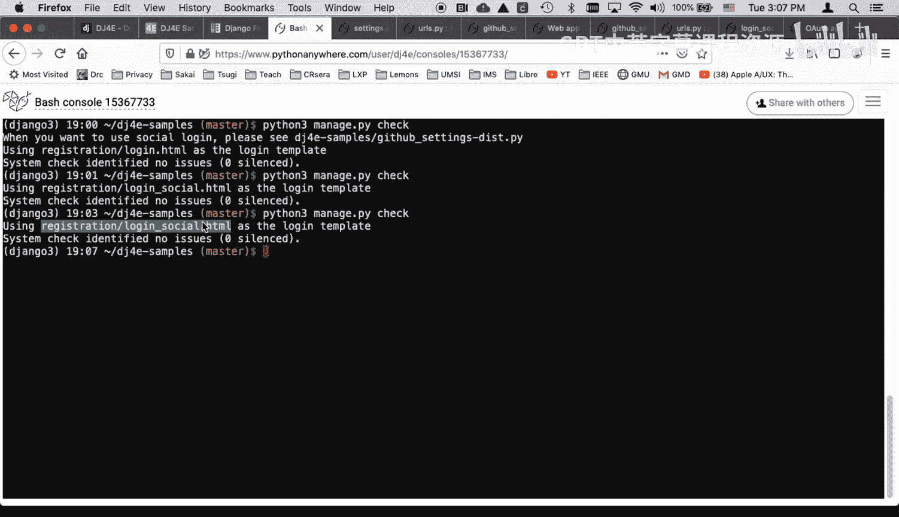
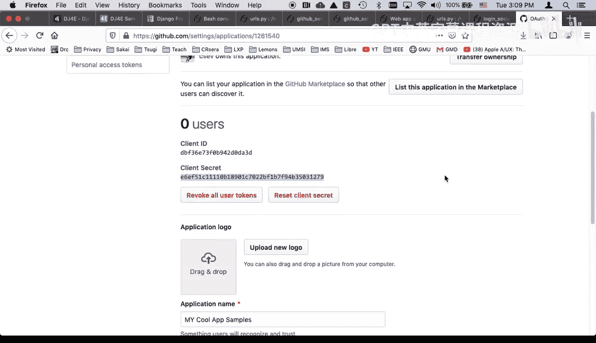
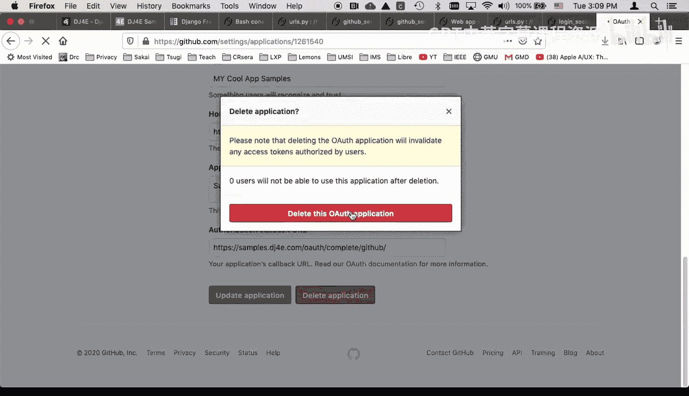
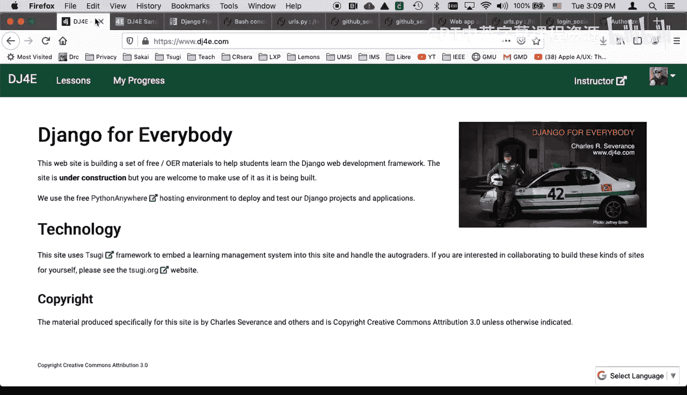

# 041：社交登录代码实战 🚀

在本教程中，我们将学习如何为Django应用集成社交登录功能，具体以GitHub登录为例。我们将使用名为`social-auth-app-django`的第三方库来实现此功能。



## 概述

上一节我们介绍了Django应用部署的基础知识。本节中，我们将深入探讨如何实现社交登录功能，让用户能够使用他们的GitHub账户登录我们的应用。这可以简化注册流程，提升用户体验。



## 配置社交登录框架

首先，我们需要配置Django设置以启用社交登录。在项目设置中，有一段代码会检查社交登录的配置状态。

```python
# 在 settings.py 中，大约第176行附近
try:
    from .github_settings import *
    SOCIAL = True
except:
    SOCIAL = False
```

这段代码尝试导入一个名为`github_settings.py`的配置文件。如果该文件不存在，它会将`SOCIAL`变量设置为`False`，并在运行管理命令时提示你配置社交登录。

## 创建配置文件

我们的项目模板中包含一个示例文件`github_settings_dist.py`。我们需要基于它创建真实的配置文件。





以下是具体步骤：
1.  在项目设置目录中，创建一个新的空文件，命名为`github_settings.py`。
2.  打开`github_settings_dist.py`文件，将其中的所有内容复制。
3.  将复制的内容粘贴到新建的`github_settings.py`文件中。

完成此操作后，再次运行`manage.py`命令时，将不再显示配置提示，因为系统现在可以找到配置文件。

## 理解登录流程切换

配置完成后，登录流程会发生变化。应用会从使用标准的`login.html`模板，切换到使用专为社交登录设计的`login_social.html`模板。

新的模板会检查`github_settings.py`中是否已正确设置GitHub的API密钥。如果已设置，页面上将显示“使用GitHub登录”的链接。这个链接指向由`social-auth-app-django`库提供的认证端点。

## 配置URL路由

为了让社交登录链接生效，我们需要在项目的`urls.py`文件中添加相应的路由。

```python
# 在 urls.py 中添加
if SOCIAL:
    # 导入社交登录相关的URL配置
    from django.urls import include, path
    urlpatterns += [
        path('social/', include('social_django.urls', namespace='social')),
    ]
```

这段代码会在`SOCIAL`为`True`时，将社交认证的URL包含到我们的项目中。

## 获取并配置GitHub OAuth密钥

目前我们的`github_settings.py`文件还没有有效的密钥。要使用GitHub登录，必须在GitHub上注册一个OAuth应用。

以下是操作步骤：
1.  访问GitHub的开发者设置页面。
2.  创建一个新的OAuth应用程序。
3.  在创建应用时，需要填写以下关键信息：
    *   **应用名称**： 你的应用名称。
    *   **主页URL**： 你的应用主页，例如 `https://samples.dj4e.com`。
    *   **授权回调URL**： 这是GitHub在认证后重定向用户回的地址，格式通常为 `https://你的域名/oauth/complete/github/`。
4.  注册成功后，GitHub会提供一个**客户端ID**和一个**客户端密钥**。
5.  将这两个值分别填入`github_settings.py`文件中的 `SOCIAL_AUTH_GITHUB_KEY` 和 `SOCIAL_AUTH_GITHUB_SECRET` 变量。



**重要提示**：务必保护好你的客户端密钥，不要将其提交到公开的代码仓库。



## 测试社交登录

完成所有配置后，就可以进行测试了。

1.  运行 `python manage.py check` 来验证配置是否正确。
2.  访问网站的登录页面。现在你应该能看到“使用GitHub登录”的按钮或链接。
3.  点击该链接，你将被重定向到GitHub的授权页面。
4.  授权后，GitHub会将你重定向回我们的应用，并自动完成登录。

登录成功后，系统会获取你在GitHub上的公开信息（如用户名、邮箱）。例如，个人资料图片（Gravatar）就会根据关联的邮箱地址显示。

## 关于其他社交平台





选择GitHub作为示例，是因为其开发者应用注册流程相对简单直接。你也可以用同样的方式集成Twitter、Google或Facebook登录。

然而，这些平台对应用的审核通常更严格，可能需要提供更多信息（如隐私政策、应用图标等）才能通过审核。GitHub是初学者实践社交登录的理想起点。

## 总结



本节课中我们一起学习了为Django应用集成GitHub社交登录的全过程。我们首先通过创建`github_settings.py`配置文件来启用社交登录功能，然后配置了URL路由。接着，我们在GitHub开发者平台注册了OAuth应用以获取必要的密钥和密钥。最后，我们完成了测试，验证了用户可以通过GitHub账户成功登录。掌握此方法后，你可以举一反三，为应用添加更多社交登录选项。