# 密歇根大学《给所有人的Django课程4⧸共4（部署Django应用）｜Django for Everybody》中英字幕 p07 07_02_05_DJ4e Crispy表单实战演练.zh_en -BV1rNibBuEwD_p7-

Through for Django for everybody in this particular walkthrough。

 we're going to be playing with the crispy Form sample。

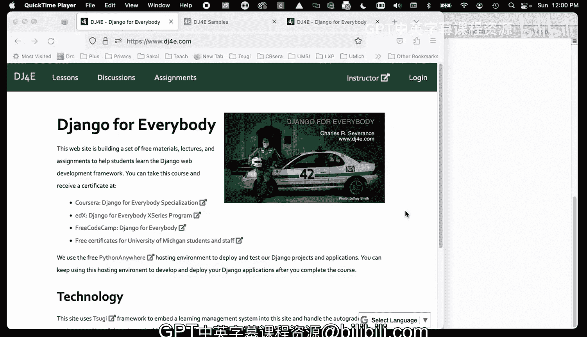

And so at a high level， we've been working on forms for a while。

 forms are some markup and we make a form object and then we render that form in using the builtin Django form rendering capability and if we look at the page。

 we do some few source。We can see that here's the form， it generates all this stuff for us。

 we didn't write this。Um。And so what's cool about this is when we're using a form object。

 let's take a look here， a form object。And then in our view， we're passing that into the template。

We create the form object， put some old data into it， and then we send it into the template。

And then we create a table tag， and then we issue the form as a table。

 All this form as table creates the table tag starts here。

 but then form as table is all these Ts and TDs， et cetera， et cetera down to slash table。

 So from from line 69 in my source code here。 here source could be different。3090， 69。

 all comes from this form as table。 And this is because we're creating a form object。

And then letting the templates。And the built in Django capabilities render that form。Now。

 what's really cool is that because this object is well defined。

 this is just an example of object or programming， allowing for flexibility， we can substitute。

The code that goes from this object and renders to a form。Let's go back here， right。

 that is form as table。 That is as table as a methods it's built into the form object that's built into Django。

 but we can extend Django and say， you know what， we don't want to use your built in form rendering。

We would rather。Use CRpy and crisppy is a library that we add to it。

 so if we just take the exact same form and we take a look at it。

 it's like look how pretty this is it's got some curve boundaries and it's got this blue highlight and it tells what things are required with asterisks and it takes the whole width up and that's a lot of HTML and CSS and if we do a view source of this we'll see that。

At some point。We have this big div right， there's this big div and all all that form there is this markup asterisk and all that stuff right。

 and there's CSS that makes all this work， et cetera， et cetera， et cetera。

 But we didn't write a single line of this HTML or CSS， this group called the Cripy form people。

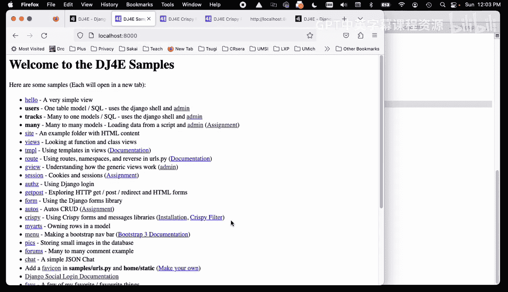

🤧。Let's take a look at the Criy so the people that built this library and all we have to do is make use of this library。

 and then we can make our forms look pretty now we have to do a little bit of work。

 but the key thing that's not going to change is if we take a look at our views。 PY in between。

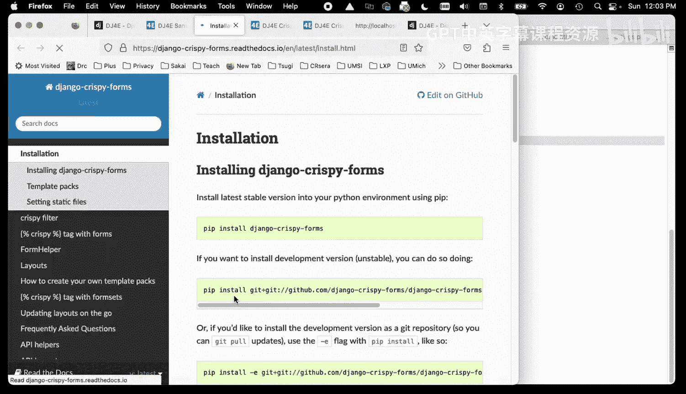

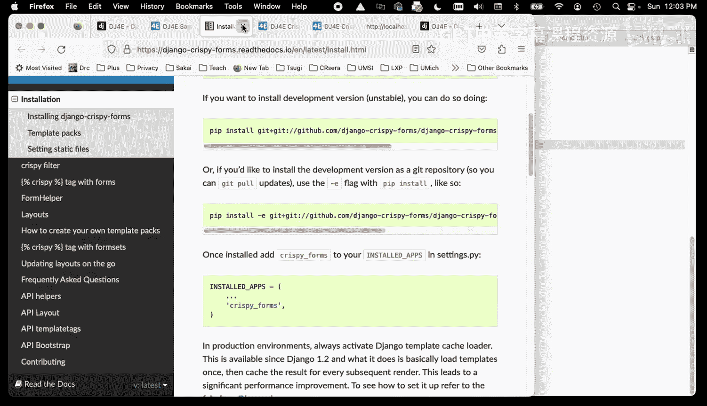

This view is the same and so if you look at URLs。pyy。

 you see that we're using the same view of my view and we're just switching templates。

 we're going to run the template， the boring template and the awesome template。

 we are looked at the boring template we've done this before and we're saying we're going to give give it a table tag and then render the form object as a table using the built in stuff。

🤧。But if we're going to do awesome， we're going to use the exact same view right the exact same view。

 and we're going to render a different template in this case we're going to render this template now。

This template。Is very similar。 The main thing that's different here in the middle is we just take the form object。

 which is the same form object that came in。Right here in our context， it same form object。🤧。

And we save form vertical Bar CRpy， Now if you read the Criy documentation。

 this is how you they have registered what's called a filter and there's a vertical bar as a Linux pipe operator so we're kind of piping。

 we're taking the form object and sending it through the Cripy library。And then that crispy。

 so you got CSRF token and then you got input type equals submit and if we take a look at the source code。

 the CSRF token is there， an input type equals submit and everything from lines 40 through 46。

Is coming from the crispy library， but we did not change。How we defined our form。

 we did not change how we passed the form into the context， we simply changed the template to say。

 I would like to render this particular form object as a crispy form。

Now there's a couple of things that we have to do as kind of prerequisites to making this happen so first off you have to do this load thing and that's just part of Jgo to say I want the Criy Form tag library to be present in this particular template and so we have to do this somewhere above where we access it。

So that's the thing we have to do in the template， I mean。

 literally these two lines load crispy form tags and a low crispy form tags。

You see that doesn't actually generate any markup that just kind of prepares the template engine to handle this form vertical bar crispy。

Now there's a couple of other things that we have to do to make this work。

 So the first thing we have to do is we have to have in our settings PY。

 we have to in our installed apps， we have to tell it that we need the crispy forms and we're using the bootsottrap5。

 There's a number of different。

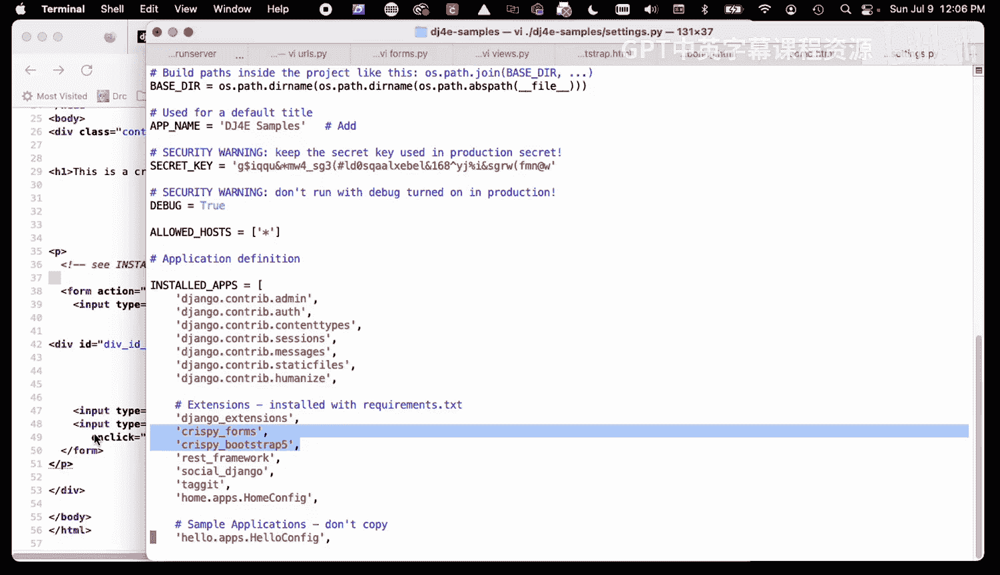

I don't know if I can find it quick enough here。

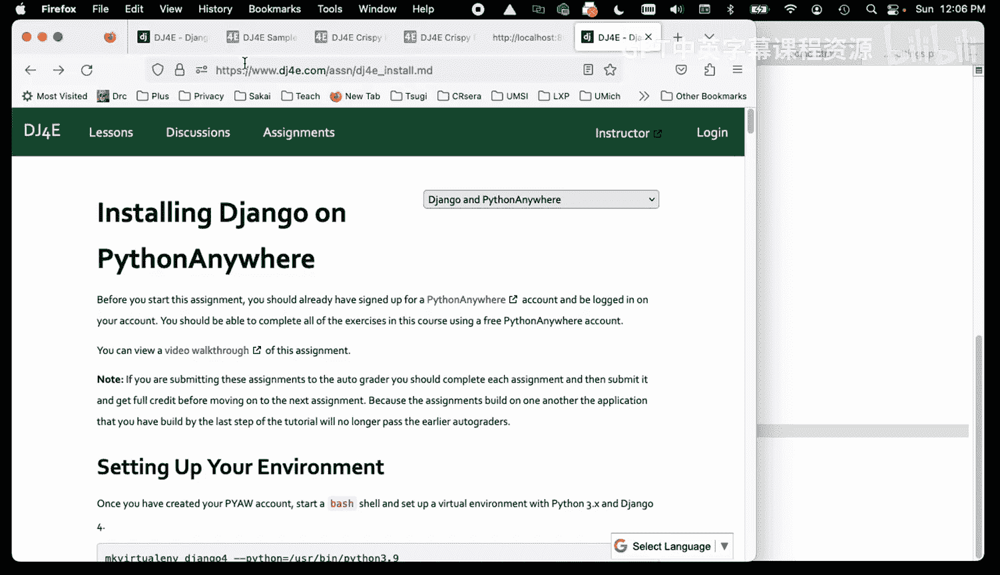

Somewhere here， let's go find the documentation。And template packs and you'll see there's a series of template packs that are for crispy and we are using for now we're using the Bootstap 5 template pack and then there's a couple of variables and again。

 you go read the CRy documentation but you need these two variables and that when you're doing your your your web reload or your run server or your managed pie check that's enough to get CRy working in your instance so that that's necessary Now one other thing that is necessary。

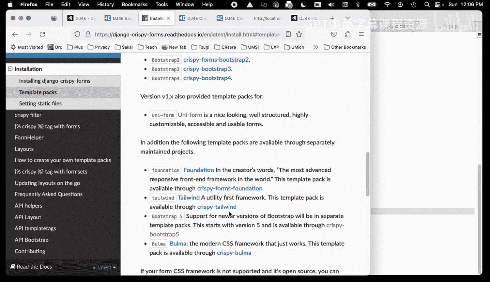

Let's see where we're at。One other thing that's necessary is there's a series of things that you installed a long time ago using a PIP command。

 and so we installed the Criy Boottap library， this is PIP installs Python extensions。

And somewhere else there is the crispy bootstrap， and then I think we'll find something let's just search for crispy。

Yeah， so we installed crispy forms。And then we installed the。The render library for Boottap 5。

 and so you may not recall when you did this， but back in a long。

 long time ago in the very first assignment when you're setting things up。

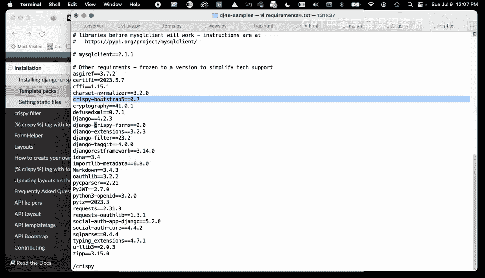

One of the things I had you do is I had you run Pip install and the assignment may be a little different because over time we have different versions of Django and all that stuff。

But this read this requirements file and it installed in your Python virtual environment。

 the Janjango4 environment or the dot V environment。

 and installed all these libraries and then in the settings， we activate these libraries。

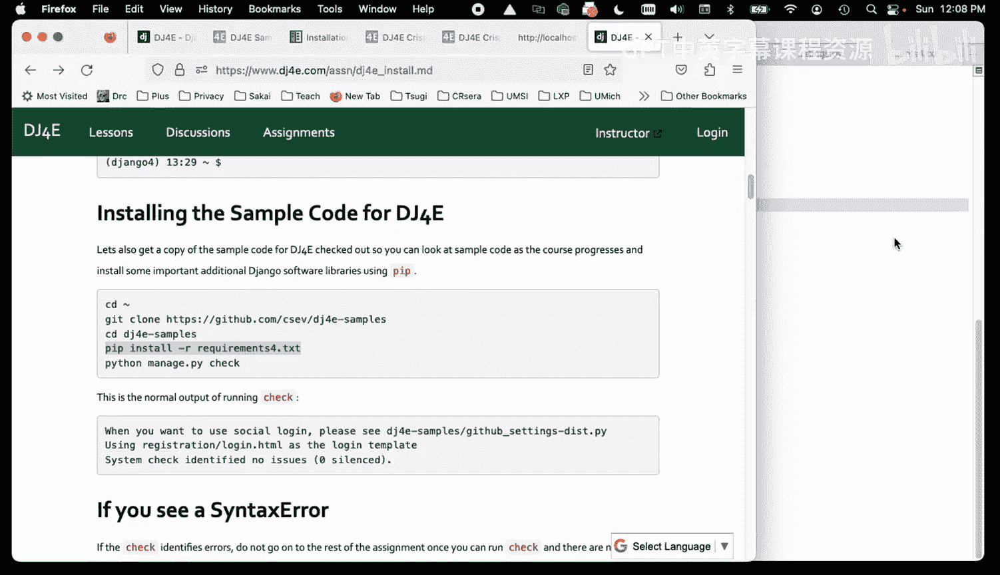

Activate the library and then we configure the library and again， how did I figure all this out。

 I go read the Criy documentation。

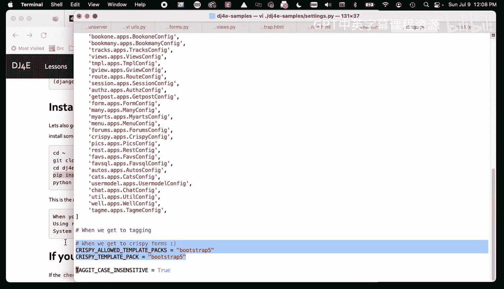

It told me how to do all this stuff and it tellss about the crispy tag， it it's the crispy filter。

 I mean it just stuff， see it says crispy filter， take your farm， but in load crispy form tags。

 I mean documentations not too hard and again。

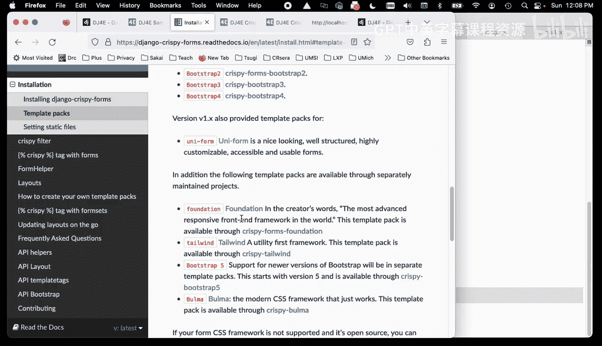

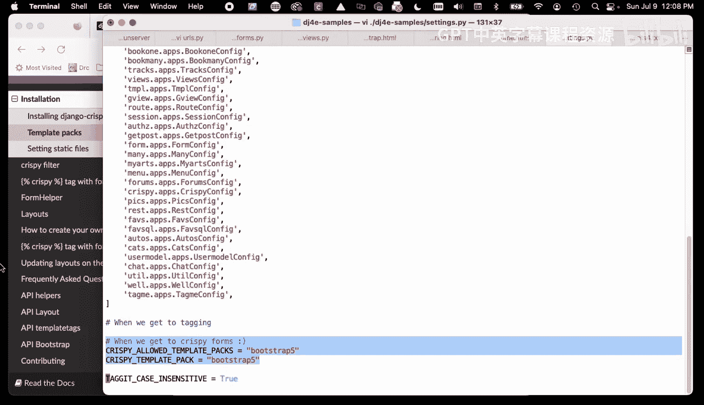

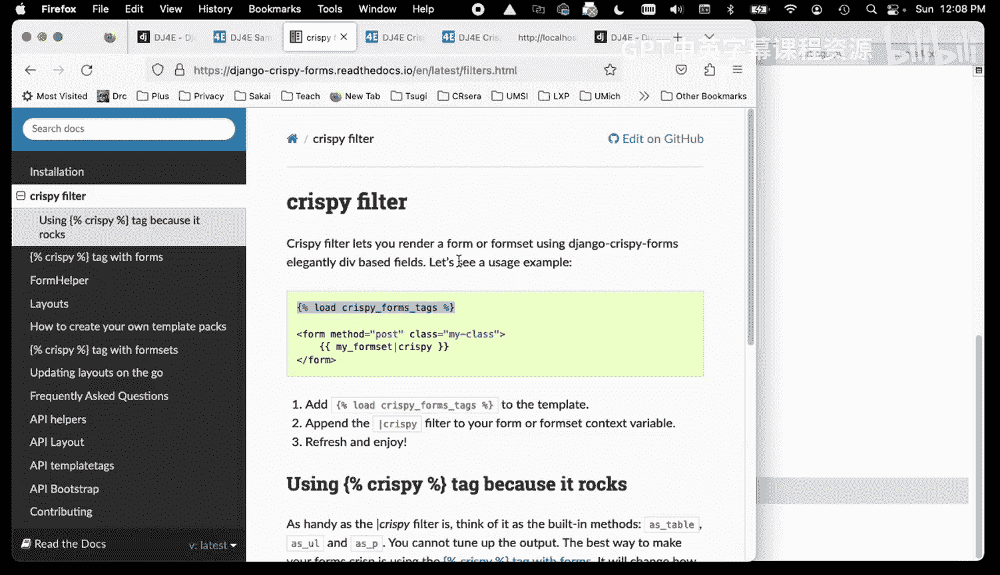

I guess a key to this thing is that it is an example of once we make an object。

 we could have written a bunch of strings right， we could have make our form be a bunch of strings。

 but instead we sort of follow the Django away and make a form object that extends forms form and then we pass that form object into our render and a way we go right。

 and then we can then leverage because this is now a standard within Django what forms look like someone can go ahead and write a crazy and wonderful crispy form library that drops in and so that's one of the beauties of making D django so object oriented so。

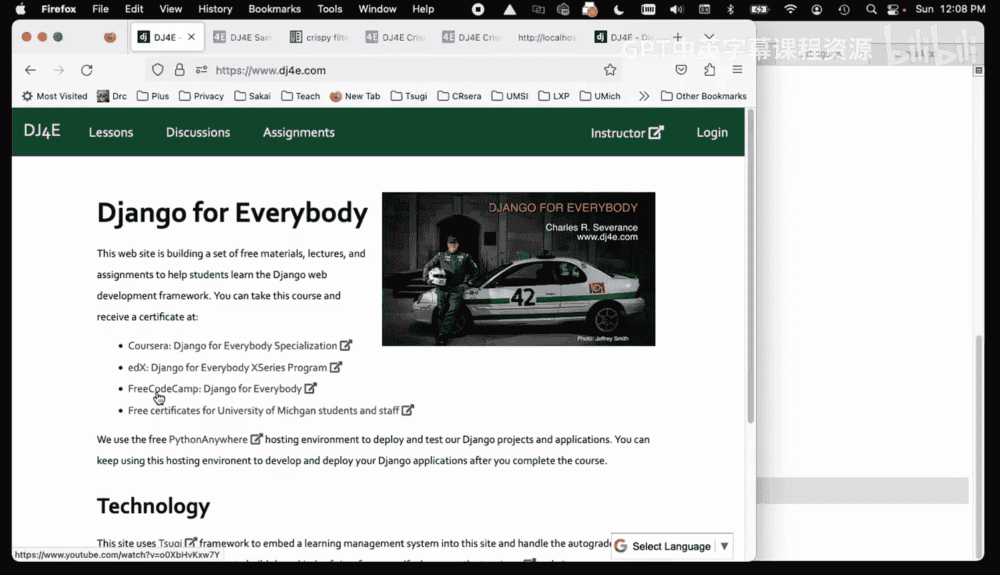

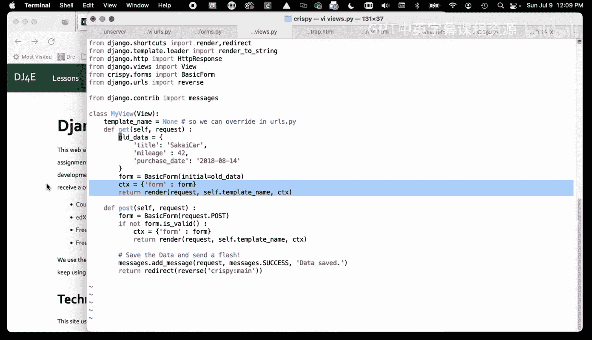

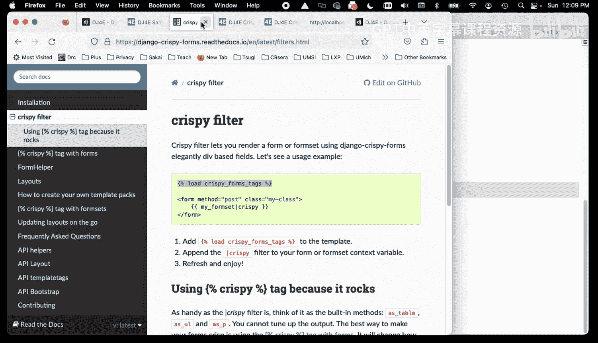

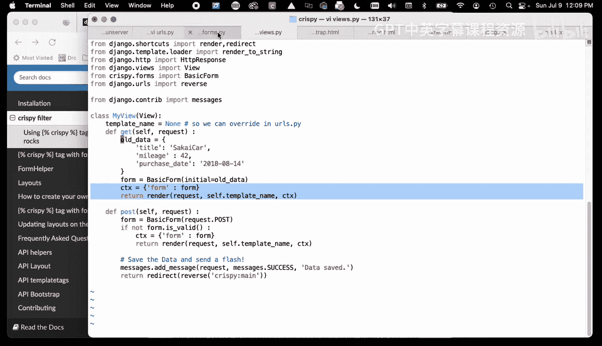

I think I'll stop there and there is our introduction to crispy Forms， cheerers。

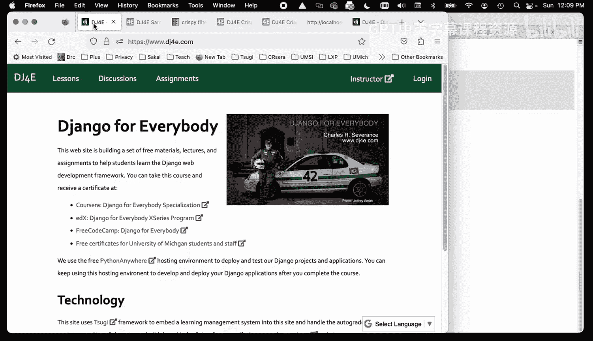