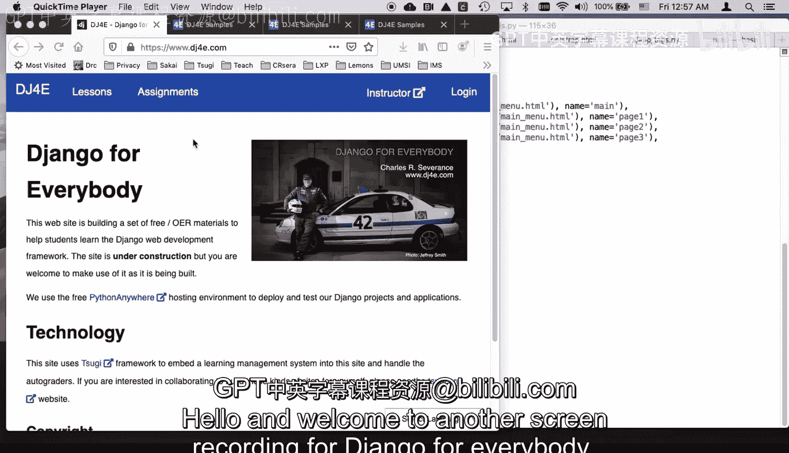
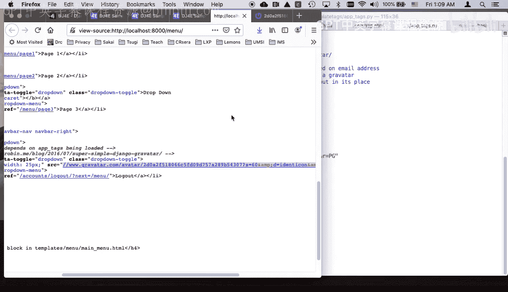
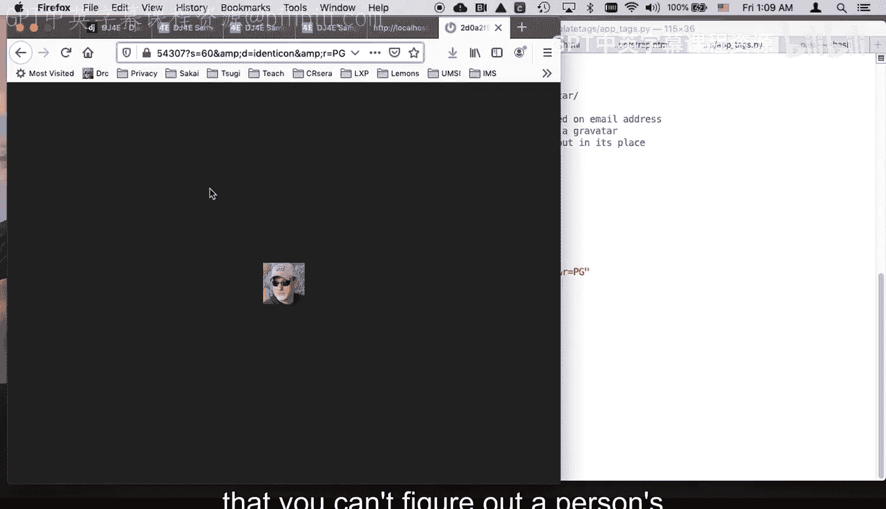
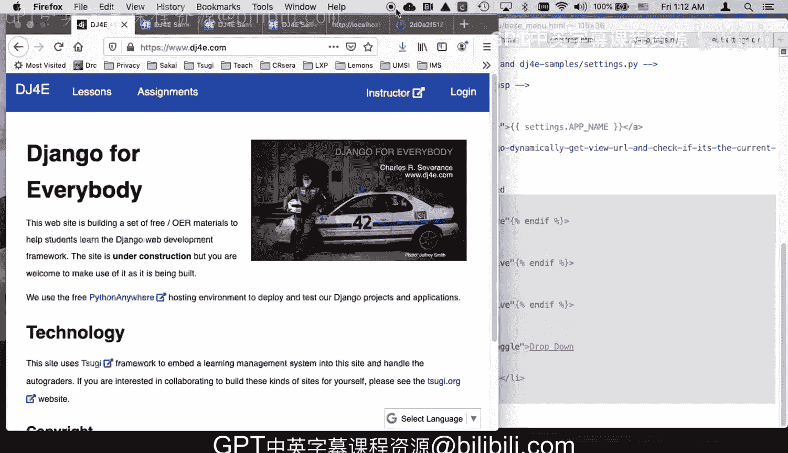

# 密歇根大学《给所有人的Django课程4⧸共4（部署Django应用）｜Django for Everybody》中英字幕 p09 09_02_07_DJ4e Bootstrap菜单-menu示例代码实战.zh_en -BV1rNibBuEwD_p9-

Hello and welcome to another screen recording for Django for everybody in this one。

 we're going to play with。

The the bootstrap menu。 So what's a bootsottrap menu。

 A bootstrap menu is a common bit that's going to be on a whole different set of pages。

 And so in this particular menu。We're going to have like a page one， a page two。

 I a page three inside of a drop down， and then we have kind of like a login drop down。

 I'm already logged in， I'll log out and that it switches when I'm logged in and it when I'm logged in it shows my graviar when I want to log in。

 I'll log in C。哦。two。Explan measure come on。Actually， I think。As call us DJ free， I think， will work。

Yeah， and so that shows a a little picture based on your email address。

 and so I'll show you how all these things work。But again， we're talking multiple pages。

 Now couple things you'll see is we are changing the highlight。Of this。

 And so if I was to into a view source， these are completely different pages。

And what you see is on the highlighted one。wasさ。Page 2 is the highlighted 1。

 I have a list tag for page 1， and then a list tag class equals active for page 2。

 And that's what makes this highlighted。 So these are different pages。 So in this menu。

 we have to know what current page we're on。 So we can look at the request path。 It's page 2。

 So we know to put active on the page 21。 So there'll be some logic inside this navigation bar。 So。

Let's take a look at some of the code。So I I'm really going to do this all in templates。

 so you see I'm using template view in the URLls。pyy and I just have I got three pages that are all going to render the menu main menu slash main menu HTML and so there's nothing in the views of any important its because I just got template view that I'm using So let's take a quick look at the the actual menu。

So。It's really quite simple because one of the things you're going to do is you're going to have these pages and lots of them。

 So you don't want all of this Hm that's needed for this header sitting in every one of the pages。

 So we will use the extends mechanism in a template to say， oh。

 let's go and grab base menu dot Hm and start with that。 So we've been working with base bootsottap。

 and bootsottap uses all kinds of pages， but it doesn't have a menu。

And it has areas that you can replace。 So We've been working with base bootst for a while。

 But now we want to do the menu。 So what we're going to see is， instead of。

Extending base bootsottrapap， we're going to extend base menu， and that's our own local file。

So you'll note that base menu extends base bootsottrap and this is the same base bootstrap we've been using all along。

And what it basically does， this app tags we'll talk about that in a second。

 That's how the gravitar works。 It is going to override this nav bar block。

 and you'll see that this goes all the way down。 That's on just one big nav tag。

 And so the naav bar comes in right here。 right after we say div class equals container。

And then we have this welcome， we have these flash messages， area for flash alerts。

 those are the messages say you congratulations， you added a file， congratulations。

 you deleted a file， and then the block content。And then the end of this container div。

 So block content。Is what we're going to override here？And。The block， nav bar。

Is what we're overriding in menu。 So this is。So block math bar is being overwritten。 So we。

 we have one template that extends another template that extends another template。

 And so we're just like any kind of objectoriented。

 we're sort of specializing and further specializing and further specializing。

 So bootsottrap can be used with or without a menu。

 But then once we add the menu to base bootstrap and we have base menu。Okay。😊。

So so this is the top part of the page and every page simply extends based menu and then puts whatever content it is it says just I would like a menu here。

So。Let's take a look at the menu。So the first thing you do is you go， I'm using bootsottap。

 So if you go read up on Boottrap， it'll tell you this is how you make a menu。

 And it tells you how to use the nav tag and what classes to put on the nav tag。

 how the container works and the header and the brand and all these little classes。

I didn't make this up。This is what Boottap said。 This is how Boottap makes it pretty and dark and curvy little things。

 And they all line up nice， et cetera， et cetera。 So I had to read that。 And， and。

 and so this pretty much is taken straight from some sample code， except for one little thing。

And that is the mechanism by which I on different pages can highlight which page I'm on。

 which is a very common something you want to do in menus。

And so we have a U tag and the U tag is this list of things。And then you have an LI。

And what we're doing here， this is a weird little bit of Django template language。

 We are causing the URL function to be called with a parameter of menu colon and main to give us a path。

So， who。Right menu colon main is slash menu if you look at URLs。

 it menu colon main is this view and it's the path that's just slash menu。

And so this is like an assignment statement in the jingangle template language。

 and it leaves the value in X， Y， Z。And now what I'm going to do is I'm going to put an if statement in。

 and all these if statements have been multi line， but you don't have to make a multi line that。

Is an if statement。 If request dot getful path is equal to X， Y， Z， The variable I just computed。

 then emit class equals active。 Otherwise， emit nothing。 So again， now。

 if we take a look at the source code。We view the source of this。

the source of the menu we scroll down， we will see that the home has a class of active。

 and the other ones do not have a class of active。 And that's why home has this little extra dark box just to give a little clue to our user that that's the one that we're working with。

And so this little pattern is repeated over and over to see if we're on page1， if we're on page2。

 and then we do the construct the drop down and the drop down is just again。

 this comes straight from the bootstap right and so we have the drop down。

 We have another URL we have a little page three link here and it shows up and this is just the text to make a cool drop down。

Okay， and that's just bootsottrap。Now。We have a left。

 We have a list that is the left side of the naP bar。

 and now we're starting the right side of the naP bar， which is also an unnumbered list。So。

This is cool。 So we basically have two versions。 One is if the user is authenticated， and then else。

 if the user is not authenticated。 So if the user is not authenticated。

 let's go ahead and log out here。 If the user is not authenticated。

 we are just going to calculate a URL to the login page， which is slash account slash login。

It's passings next to say， come back here， right？Now you know come back to the main menu so if you go to login。

 it will say next equals and it's come back here right and so that you construct that and you pass that login in so I can do DJ free and I can log in and it will come back to the main menu even though I clicked on it over here。

 but now we're in this page and in this case， user dot is authenticated is true。

So we're going to construct it to drop down。And then this shows the drop down and takes the drop down out。

Here's here oh， and we're going to in the dropdown， we're going to say log out。What。In the page。

 right， So this is the drop down menu。 So that's the menu within the drop down that we turn on and off with a。

With a carrot。 but here's the gravitar。So this is an image tag。Source equals。And then we have Oop。

 soupop， hoops， undo that。Then we have a double curly brace user piped through graviar with a size of 60。

60 pixel graviar。ok。So， that is。Making this little image。 so if we do it。

 let's do a quick inspect on that image。And inspect， okay， let's do just do view source。This image。

Is w wwgravitar do com avatar slash this long thing。And if you go read on avatar。

Graviar is a service。 It's actually a Google service that you register your email。

 and this here is a hash of your email。 And then that looks up and then gives you back this little URL。

 So if I was to。Take this URL right here。 Oh， don't do that， just。That want。Take this URL。

And I put it H TtPS column。Slash slash。It shows a little tiny picture of me。All。

 so a little tiny picture of me。 But the question is， how did this get generated。

 It got generated by passing the user object， which is the same as user ideas is I authenticated。

 except I'm piping it through a tag that I invented called Grvitar。 And again。

 this is code that is going to run， just kind of like this URL code or whoever whatever these things are。

 right。So what we have is we have a thing where we've loaded these app tags。

And so app tags are tags that we as developers can create。And then we can do things in it。

 so here's what's in app tags。So this is how you make a gravitar， you take the user's email。

 you strip it， throw away any white space， you convert it to lowercases， you encode it in UTF8。

 and then you use the M5， which is a hashing function and make a hex digest and that text digest。

 This is an MD5， this long ugly string 2D0 A2 F51。 that is a one way hash of the email address。

And if you go put that in。To a thing， then if you know it so that you can't figure out a person's email address from their gravitar。

 but you can from an email address， figure out what the gravitar is。

 so this is not actually revealing the person's email address。

So that's why we're using a one way hash and M5 of the email address。 And then I just construct。

The URL put the hash in the right place。 Put the size that 60 parameter。If you take a look。

Where are we at？This colon 60 is the second parameter to this code we wrote， so that 60 is size。

 So that's why it says 60 right there。 S equals 60 right there。And then I'm going to， you know。

 use the format， I'm going use format， and I'll put the hash in and the size in and return that as a string。

 and that goes all the way back。Here and then replaces this double curly brace。

 So all those double curly braces and piping。 That's just code somebody wrote。 In this case。

 the gravitar code is code that I wrote。 And we wrote or you could write。 and that produces this URL。

 So it's a convenient way to put that URL in there。 And it's really pretty。

 And it works out very cool。 So you write this code and it's in home template tags， app tags do P Y。

😊，And then。And then you basically have to load it in your menu Where are we at。

 You have to go get app tags and let you go。So that sums up how you can make a nice bootstrap menu and put it on your page through an extension menu。

 an extension mechanism。 So we're gonna extend it and then boom， you make a page。

 Then you extend it again。 and that puts it on the next page。 So it's pretty easy。

 It's pretty straightforward。 There's a lot of HTML。 but luckily。

 I hand that to you in the DJfr samples and you're not going have to modify that。

 It'll pretty much just work。 You'll change what's in the menu。

'll be you'll be like putting different things in as the links and and stuff。

 So you'll be working with this。 But in general， most of the hard work is done。 And as always。

 you can take a look at DJ free samples just like we always do for inspiration。

 So I hope you found this helpful， cheers。

