# 密歇根大学《给所有人的Django课程4⧸共4（部署Django应用）｜Django for Everybody》中英字幕 p12 12_03_02_JavaScript概述与发展历史.zh_en -BV1rNibBuEwD_p12-

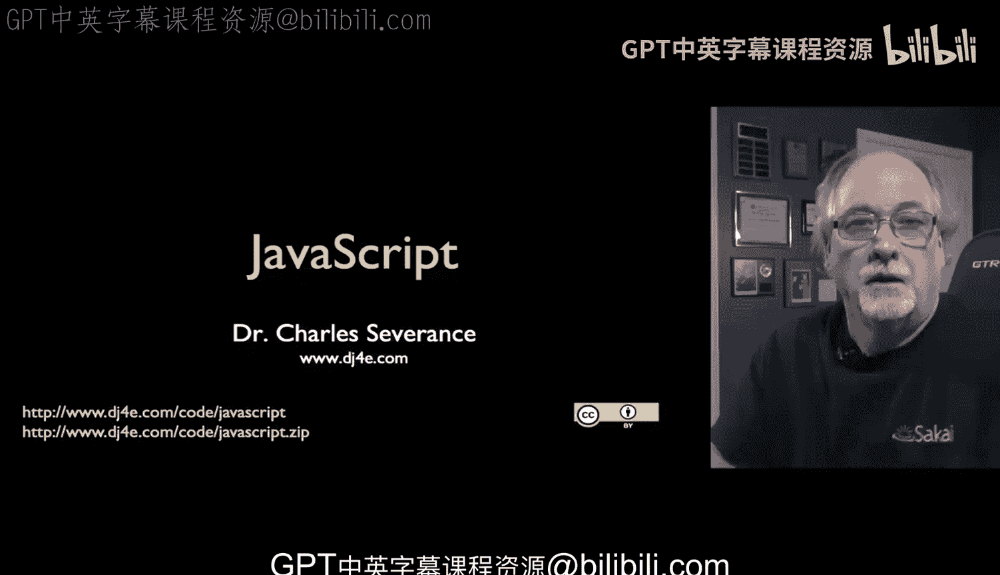

Hello and welcome to our lecture about Javascript。 Javascript is another programming language。

 and its if the Python is the only language， you know， it's quite a bit different than Python。

 So Javascript was originally designed as an addition to HTMLl and CSS。

 and it really started as a programming language inside of the browser that runs right in the browser。

 even though it's named like Javascript， like Java， it's really more like Python in how it works。

 and it except that it has a C like syntax and it's really an amazing language and a lot of people for a lot of people。

 it's their number one language， their favorite language。 And so it's worth learning Java。

 even if you love Python。😊。

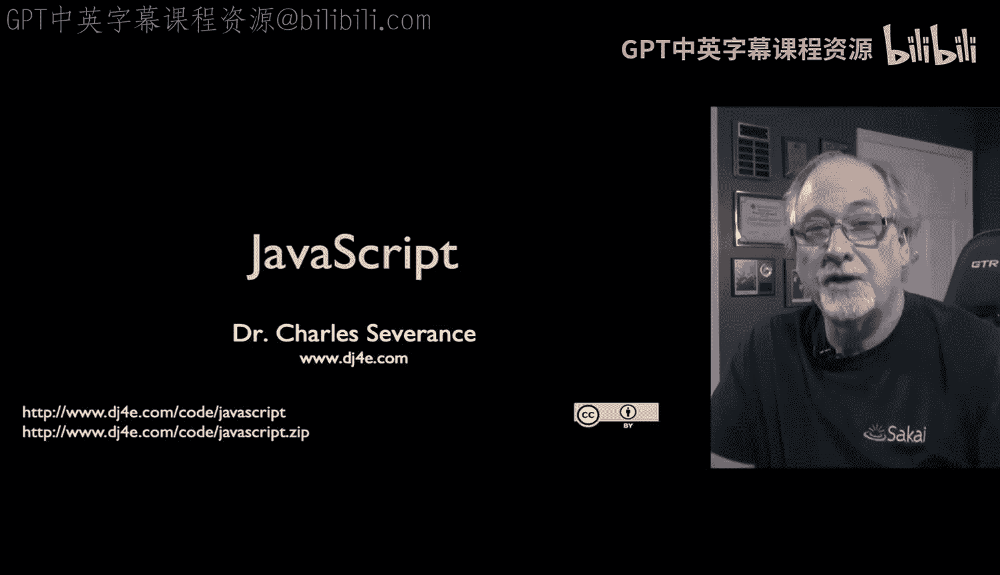

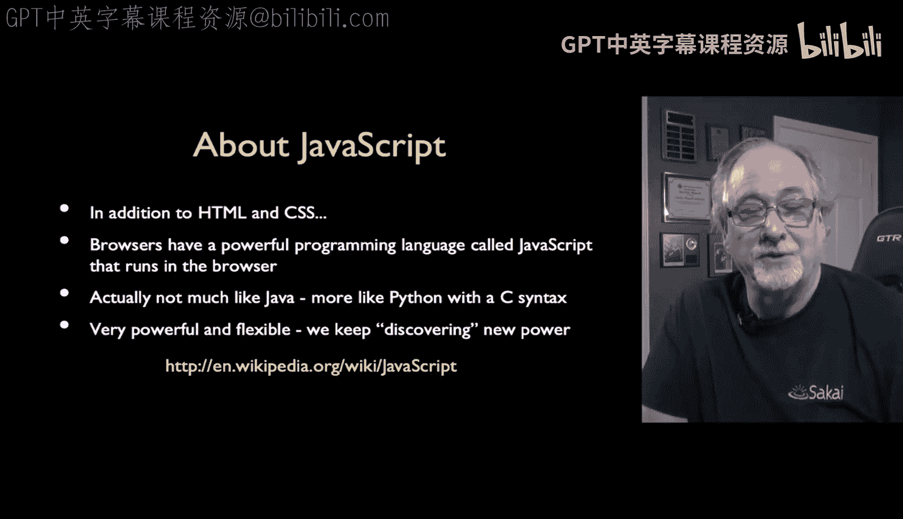

So JavaScript is an interesting language in then it was built very quickly in 10 days in 1995 by a fellow named Brennan Ike。

 Brennan was a PhD in physics and he knew a lot about programming languages and formal languages and how to build compilers really fast。

And so the idea was to make a sort of a sub version of Java。

 like a lightweight version of Java and put it in the browser。 Today。

 it's gone through a standardization process， and it's called ECma script。

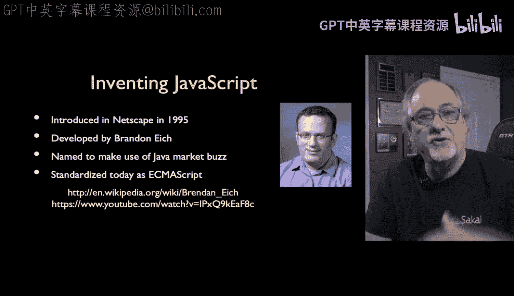

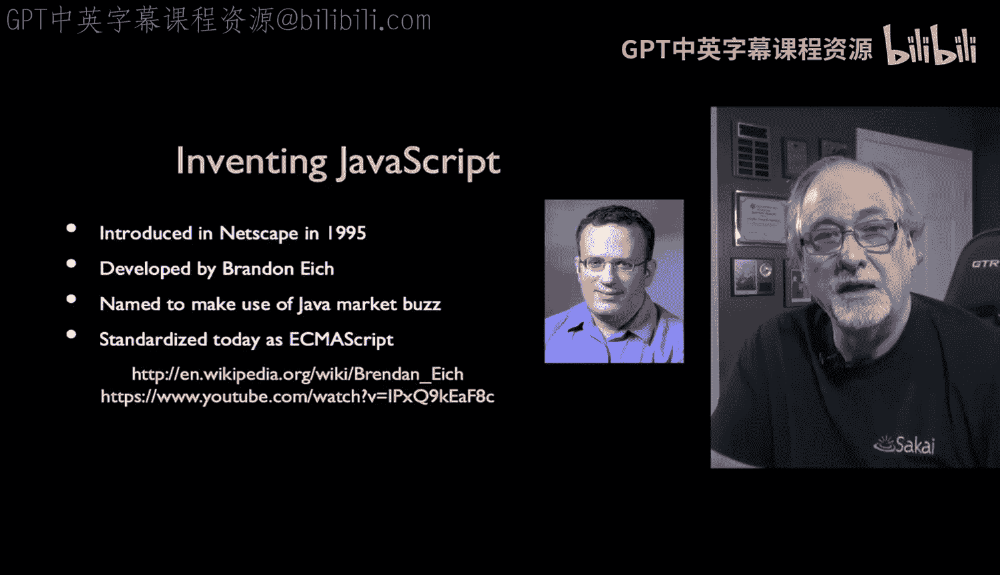

And so if we were to take a look at the history of programming languages。You you know probably oops。

 you know by now， you know Python right and Python is a great language and JavaScriptscript is the other language we're going to learn here。

 And this just sort of puts them in some context so that you understand a bit of the influences。

 So in the very beginnings in the 50s， 1950s。 we programmed in assembly language。

 And then most computers， all they could do is numeric calculations very well。

 And so languages like Fort it came along。Probably there's lots of languages and sort if you go back to the 50s and the '60s。

 people were inventing languages all the time。But a language that really， for me。

 changed everything was the sea language。Andvent in 1972。

 and I still want to do a really cool class on sea。

See he's not a good language to write everything in， it's very much like a similar language。

 it mirrors how computers really work， which is kind of different than how we program computers in a lot of ways。

But the other thing that C was doing was， it was。Acknowledging that computers were less and less about numerical computations and more more about strings and。

 you know， words and messages and things like that。 So if you， if you， you know。

 it's probably 95% of the calculations and computers have to do with moving data around。

 not numbers around。And C was great at that。 So all the languages I used up till I started using C。

They were kind of a numeric system that was sort of fighting to do characters well。

 And the C was a very well done character system。 And so it became the language C is the language。

 that's a kind of the mother language of all this。 It's the Linux is written in C。

 Python is written in C。 PhP is written in C。 JavaScriptscript is probably written in C。

 And so it's like the lowest level language that we go to these days。

 And when you're writing a language and you want it to be fast。

 the implementation of that language is often written in C。

C++ came from C as an object orientd variation and we talked a lot about object or in Python。

 we're going to talk about object or JavaScript coming up。

 and so C++ influenced a whole lot of systems that had to do in a sense。

 C++ influence Python as well。And so C++ has added an object oriented layer。

 it's actually probably the least object oriented of any of these other languages on here。

 but it had object ored concepts。C sharpp was Microsoft's version of that。 Java was open source。

The thing that became the。The sort of progenitor of jascript。 But again。

 they're not as related as you might think。 It's really Javascript came from C more than it came from Java。

 There's a few things that are imitating Java。 And， and so all of the things above this line are。

Smiconlon and curly brace。 they use semi and curly brace to end lines and to begin end blocks。

 curly brace， beginning curly braces and curly brace。

And then there is this other set of programming languages that don't use semicolon and curly brace。

 And C was the first language that did the semicolon and curly brace。

 And so these languages that are kind of below this line， bash， pearl， Python and Ph P。A really。

 actually， peach P is a semi colon a curly brace as well。 Python is the language we've been learning。

 and its， it's really the odd language。 So we're going to learn a language that's in the category that makes it easier for you to learn C or C plus plus or Java or objective scene。

 So this is worth learning， even though you know Python。😊。

There was another movement that was sort of C as a very high performance language and really aimed computer scientists to build complex systems like Linux。

 But then there were languages for like the end user that just got work done。

 but weren't seen as like super perform and for professionals， et cetera， et cetera， et cetera。

 And so bash， which is the Linux shell， where you' typing Cd and Ls。 if you're familiar with that。

 Pearl was a report generation language that introduce the concept of associative arrays。

 and most people joke about Pearl。 I don't like Pel because I can never read my code after I write it。

 I can write it， but I can't read it afterwards。 But introduced a lot of wonderful concepts like Associative arrays。

 which we would call dictionaries in Python。And Pearl。

 it really definitely influenced Python because of its ease of programming。

 So what Pearl was really good at was allowing a person with very little formal training on data structures to be able to use associated arrays and nested associatedsociative arrays to create pretty sophisticated data structures。

 and Python fellow came along with that in PhP。 also original PhP stood for pearl hypertext processor。

 now it doesn't stand for that。 But Pearl and Python and PhP or in this category。

 It sort of interpreted， easy to use languages with strings that work really nice and they just make life a lot easier。

 in languages like C， strings are very difficult so。If we take a look at this， right。

 we've learned Python and we're going to learn JavaScript next and so we're moving in， but again。

 JavaScriptscript you can think of as unlocking a whole bunch of other languages。

 And so it's worth learning it a little bit， even though in this class。

 we're not going to go into any great detail because mostly you're going to be cutting in pasting JavaScript and then tweaking it and reading it and debugging it。

 So we're really not focusing on writing too much new ja。

So there's a couple of situations where you'll find yourself writing some JavaScript。

 one is augmenting HTML， that'll be the first thing we'll do there is this thing in the browser that runs JavaScript and the way it interacts with the browser's UI is through the document object model。

You can add a library like JQury to make that interaction easier because the document object models aren't as portable across browsers as we would like sometimes。

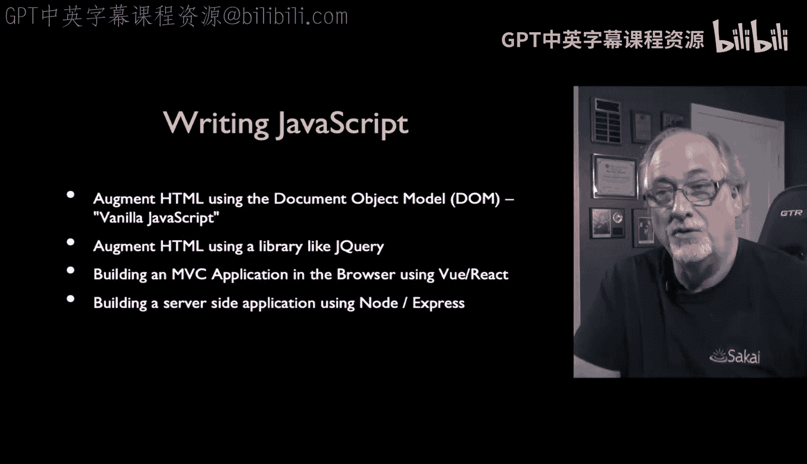

嗯。And then if you keep going， you find that you're building more and more of your application logic in the browser and so they say。

 you know what I just want to write the model and view part。

 maybe I mean the controller and view part in the browser in JavaScript using a tempemplating language and you can use like viewer reactact to do that。

And then if you keep on going， you can act JavaScript as just a language and they've implemented it inside the server using as a server based language。

 and we would use Django and Python as our server based language。

 but you can actually write your entire application front to back in JavaScript and use something like node to run the server side of it that's actually talking to the database。

There's lots and love。 JavaScriptscript is just like you're opening the door into a lot of really wonderful capabilities。

😊。

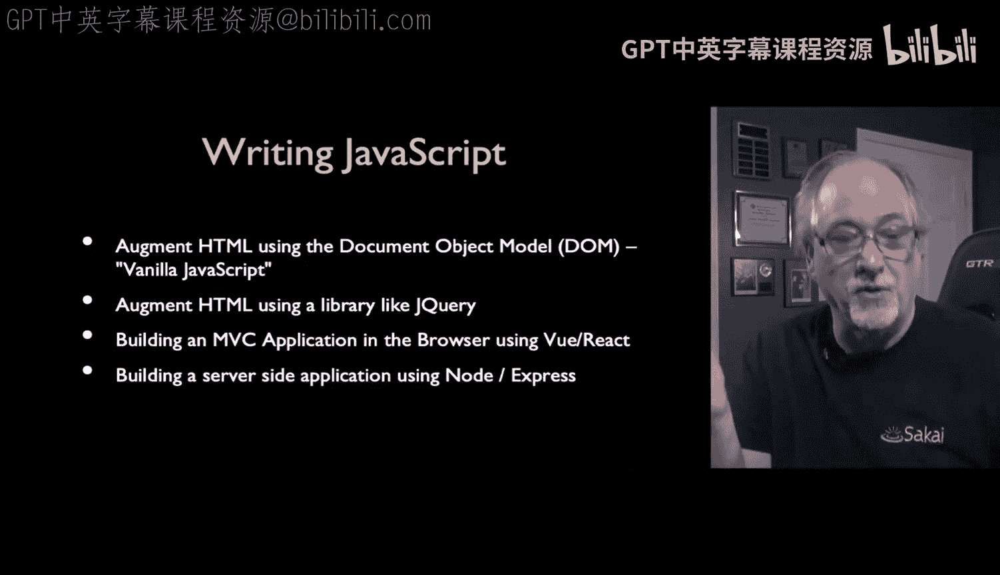

So like I said， it is in the syntax family of Java， and that is that it has silicones to end lines。

 White space doesn't matter。 Open curly brace and close curly brace start and end blocks， whereas in。

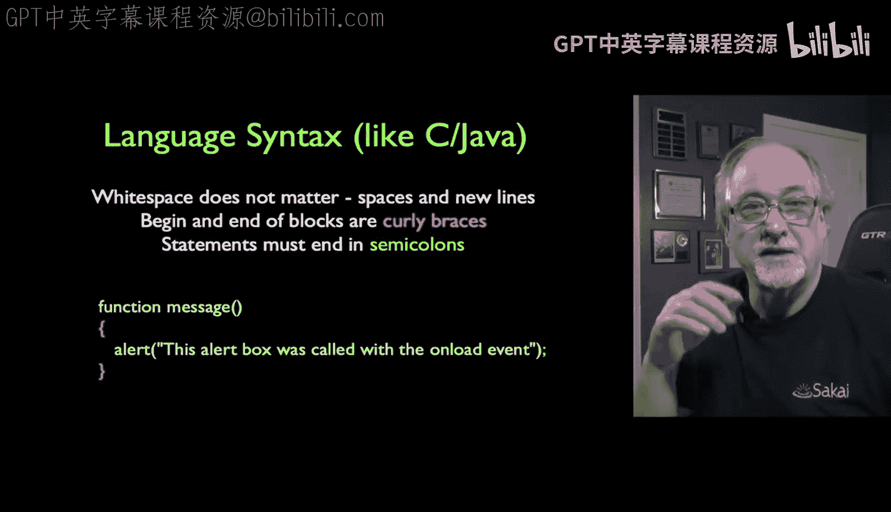

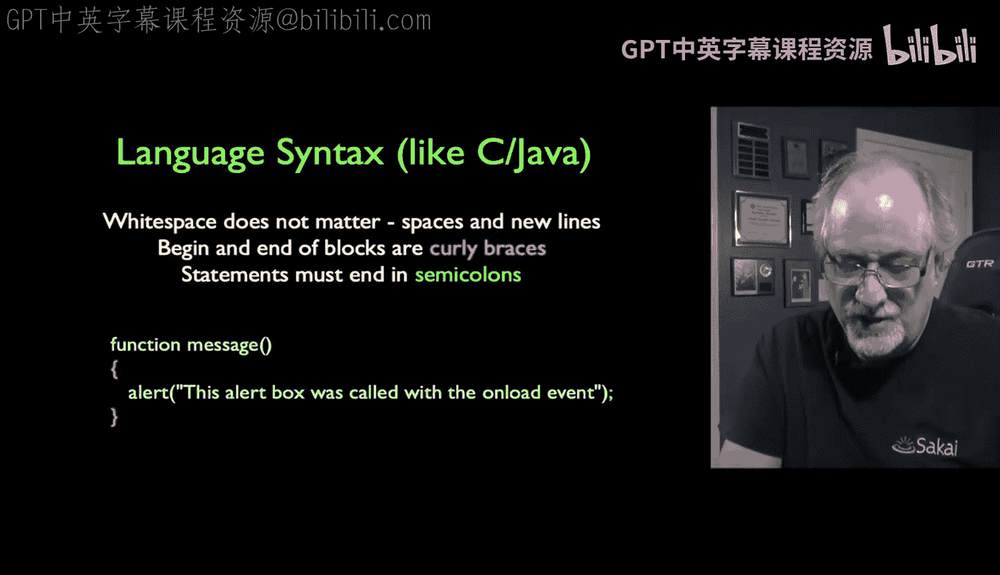

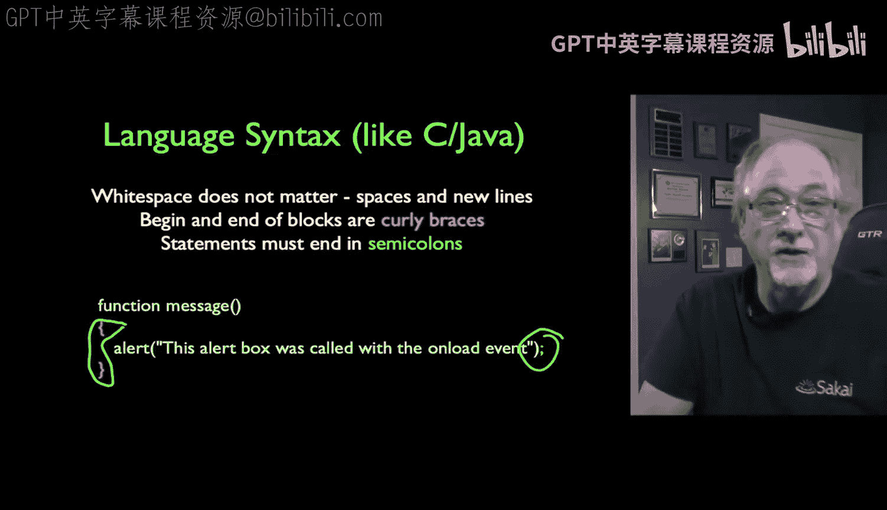

In Python， you just end a line and you indent to indicate a block of text and you de indent to indicate the end of that block of text。

 Now， I will admit。

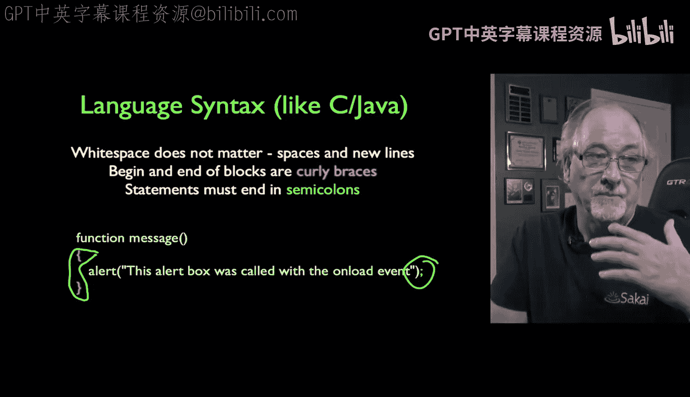

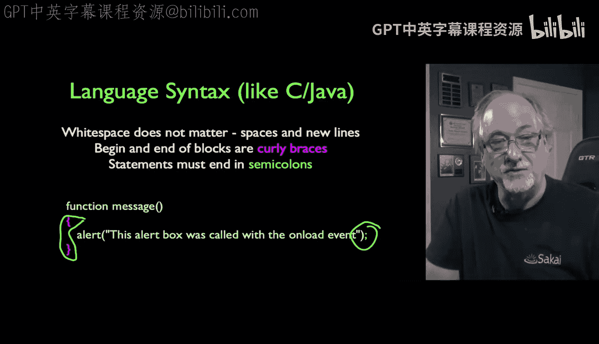

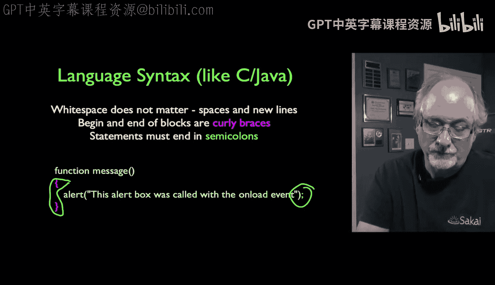

That Python is not my favorite syntax。

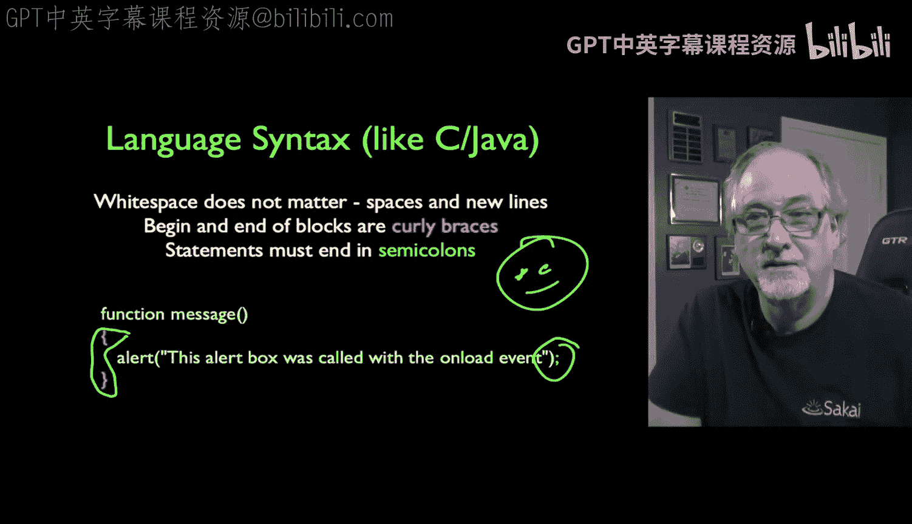

🎼It is my favorite language in that I like its libraries。 I like how it thinks about things。

 I like its object orient patterns。 I like a lot about it。

 but I do like my curly braces because for me， I like to see the beginning and then the blocks whereas in Python。

 you only see the beginning， but that's okay。 I'm just saying that now you're going to see some of this syntax。

 and it's look going to look， if Python's the only language， you know。

 it's going to look quite different。 If you know， Java， it'd be like， yeah， of course， I know that。

 I've been programming that for a long time。😊。

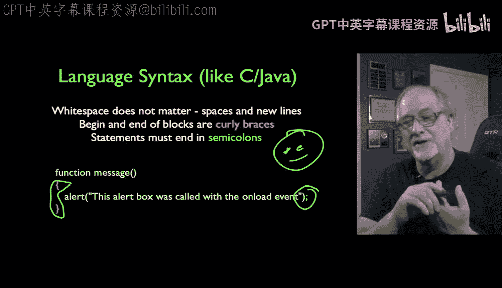

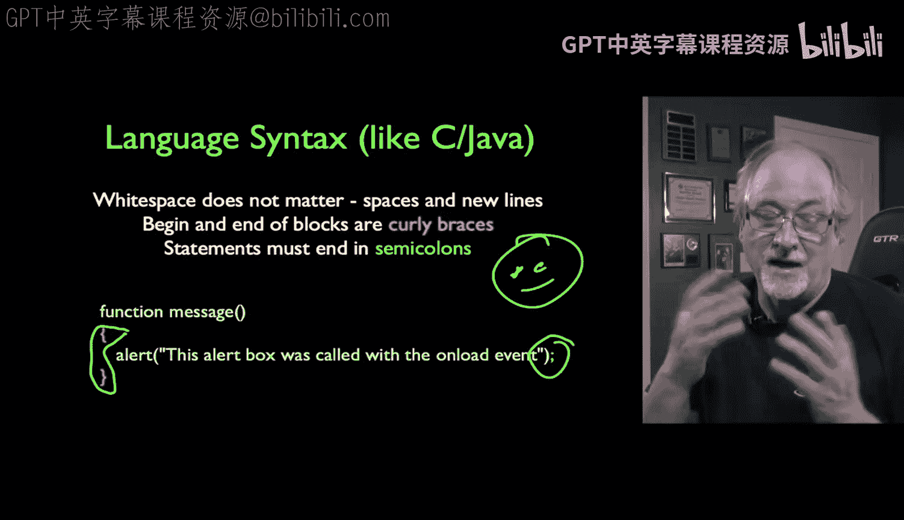

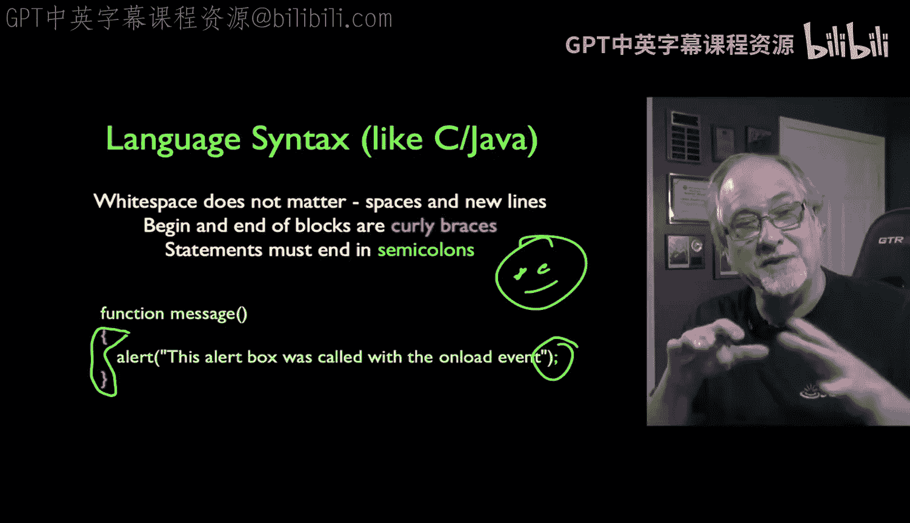

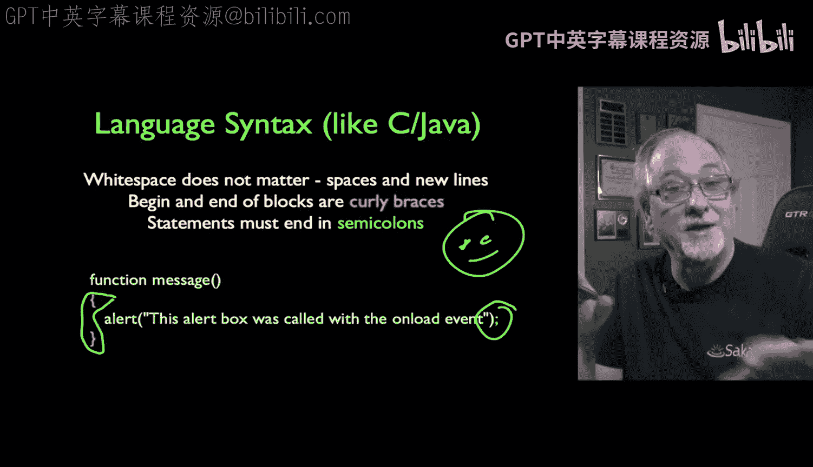

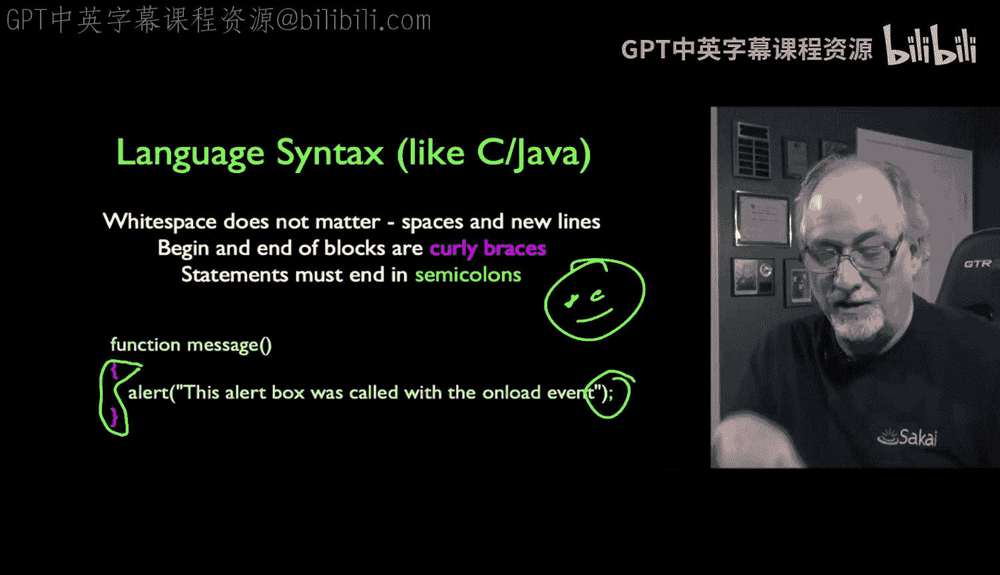

So up next， we're going to talk about how we work with JavaScript when we're sitting in a browser。

