# 密歇根大学《给所有人的Django课程4⧸共4（部署Django应用）｜Django for Everybody》中英字幕 p15 15_03_05_JavaScript函数与数组.zh_en -BV1rNibBuEwD_p15-

So now we're going to talk about JavaScript functions and JavaScript arrays。

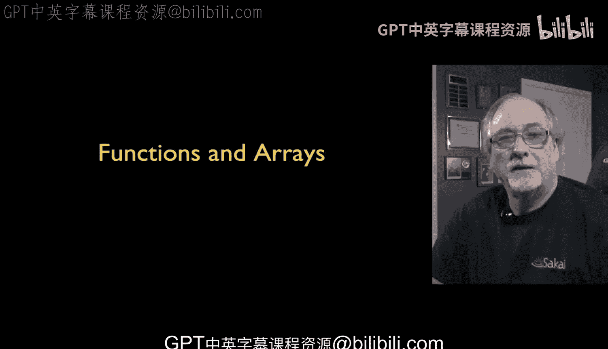

So functions use the function keyword， unlike Python this would be like in the。

 this would be like de in Python。

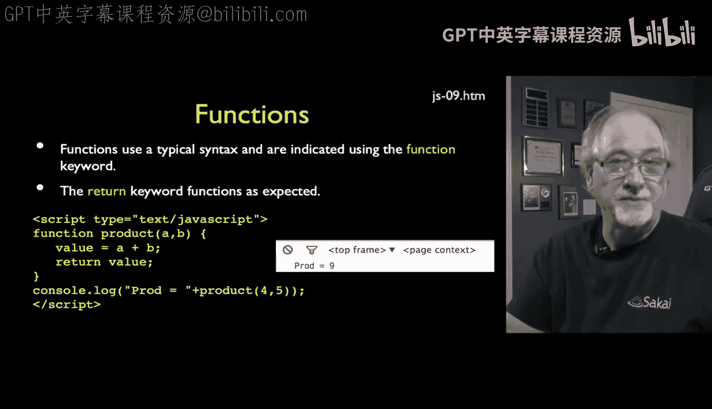

And so we basically say you know， function。And then give the name of a function and then the parameters to the function。

 and then you have a curly brace to start the function and then end the function。

move this over here and then you have return to return the resulting value and that return defines the return value that's going to be used in some expression。

 so you're cruising along， you're in the middle of an expression you encounter a function it calls the function runs the call and then the return value is what is the residual that's placed in that plus so whatever that value is in this case it's going to add four and5 and end up with9 as the result in prod equals9。

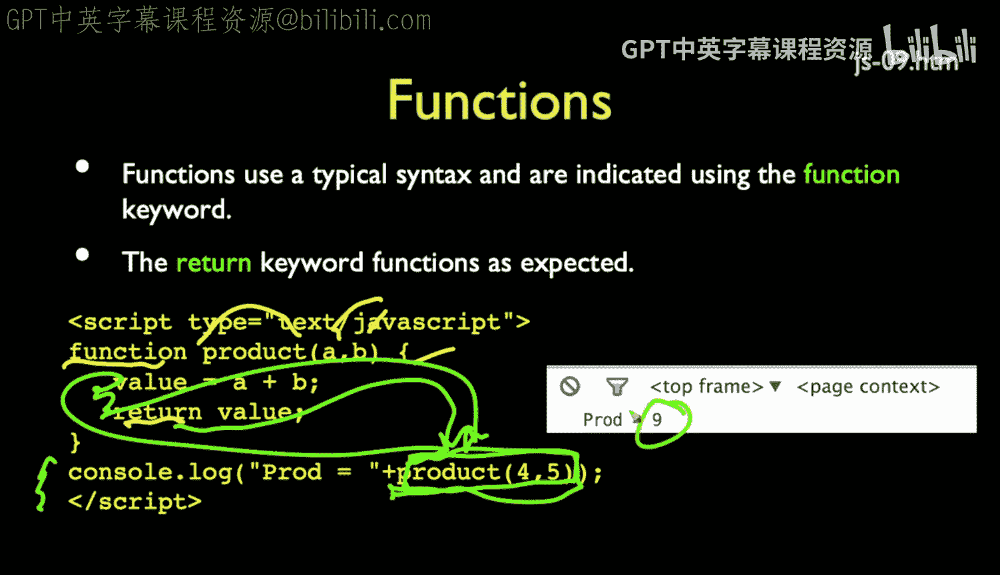

So the。So the functions other than that are like most programming languages。

Except when it comes to global variables， and so most of the time when you're working with a function。

Every variable that you define inside the function。

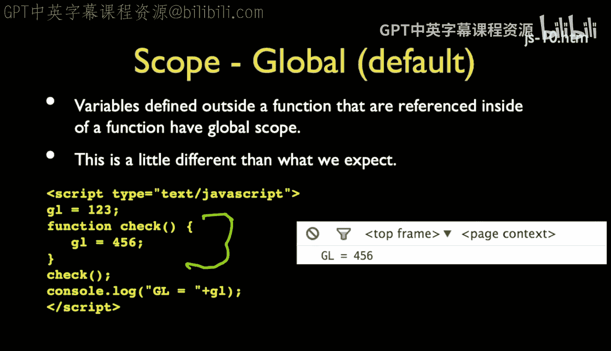

Is local to that function。 And so if you use the same variable outside the function。

 I'm doing this two lines away， but really often this functions inside of a library and that doesn't even know what variables are being used outside of it。

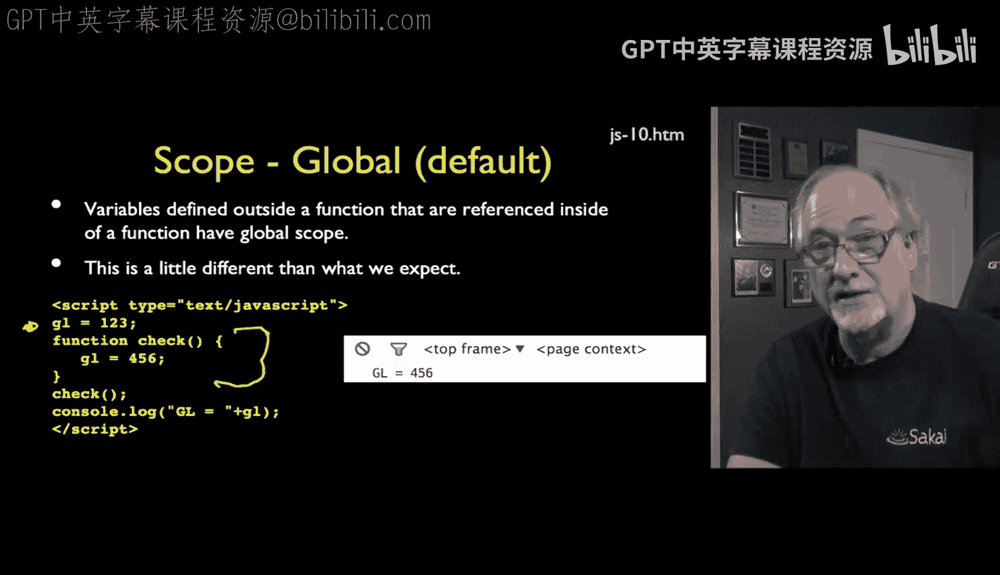

And so by by default， these two are the same and that really。

I'm not really familiar with a lot of other programming languages where the default is that that's kind of a global variable。

 If you don't make it worse， it depends on whether this global variable is defined before after termp 2。

 In this case， I'm defining the global variable before。 and I say nothing special about GL。

 and so it's global。 And so I set it to 123， then I call this function。 and it sets it to 456。

 And when we're at come back from the function， it's 456。So that's kind of weird。

 it's this weird kind of superg by default， which is not the way we usually like to run functions。

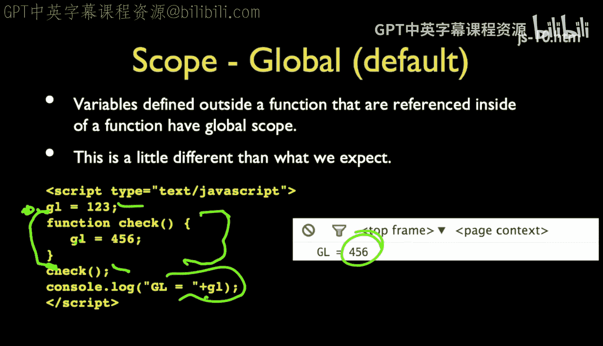

So what we do and it's really weird， there's no other programming language that makes you say don't be global。

 most other programming languages if they have a global capability and not all of them do。

 they're like， this is the weird one that's global and everything else is local。

What you do is that if you don't say it's local， it's going to be global。

So the Var keyword basically says it's local。

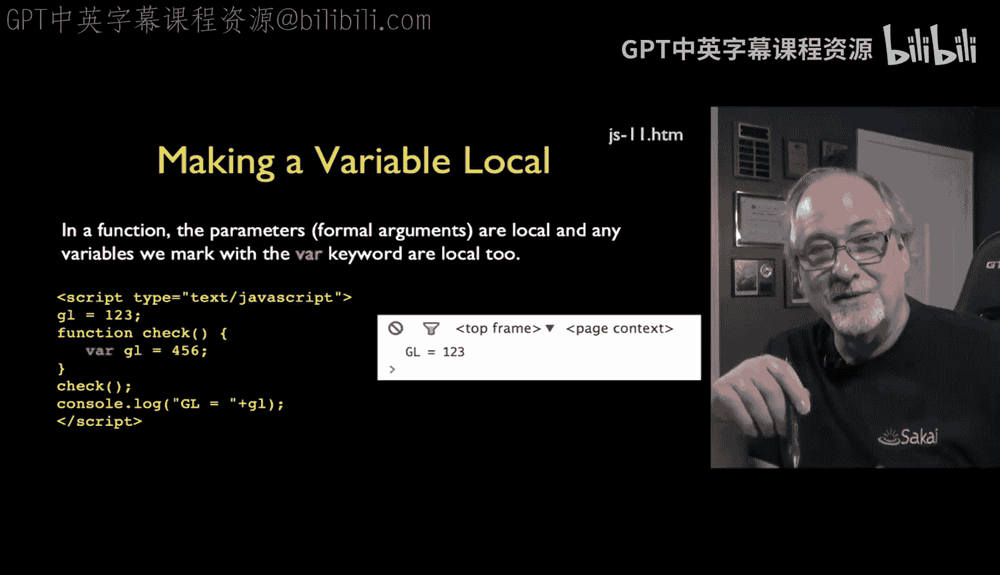

It's just， this is a variable and it's local， and so I can say， you know， var GL equals 456。

 that means that that variable has no effect。Outside the function i。e。

 the function lives in its own little silo， which is the way most functions usually work unless we explicitly bust out of the little silo。

 So in this case， if we do GL equals 123， then we call function check and we look at GL even though inside a function there's a GL that's 456。

 not the same GL。And so we get 123 when it's all said and done， so that's really quite nice。

But you didn't put a lot of vars in and one of my biggest bugs in when I write JavaScript is to forget to put the var in so I now just kind of been punished enough to know always put the var in。

So you get what you kind of expect as a default in most other programming languages that all function variables that are defined inside of a function are local unless you're very explicitly doing otherwise。

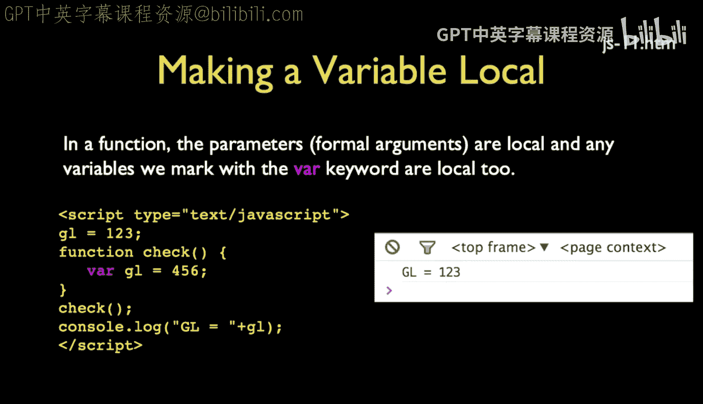

Jasscript has a raises。 They look a lot like Python lists。

So here we have an array that's three strings。Javascript has an associative structure。

 but it's not an associative array， and it's more like a dictionary。

 but it's not it's an object Objects can be many， many things and we'll talk a bunch we'll have a whole lecture on nothing but objects。

 but right now they kind of look like a dictionary， key value pair， key value pair key is name。

 value is chuck key is class values DJ3 and so that when you print that out。

A way you go now you can say a sub 0， which gives you x， which is that first element。

 and you can say B sub quote name quote。You can do that the another way to say that is B dot name。

Those two syntaxes and this confused the heck out of me when I was first learning JavaScript。

Those two syntaxes mean the same thing。They both are saying， look up。

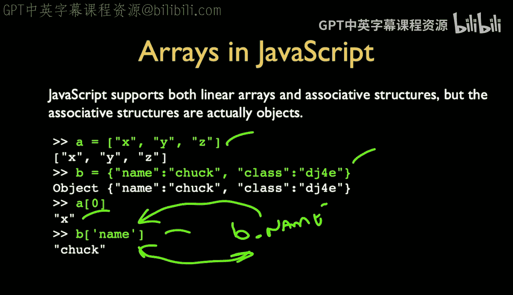

An attribute of the object B that's named name。And again， equivalently they are the same thing。

 even though for every other language you ever look at， you think those are very different creatures。

But not so in JavaScript， and it has to do with the fact that B is an object。

It is an object and so objects are the associative structures。

 but they're even more powerful than associative arrays are in some languages。Like directories。

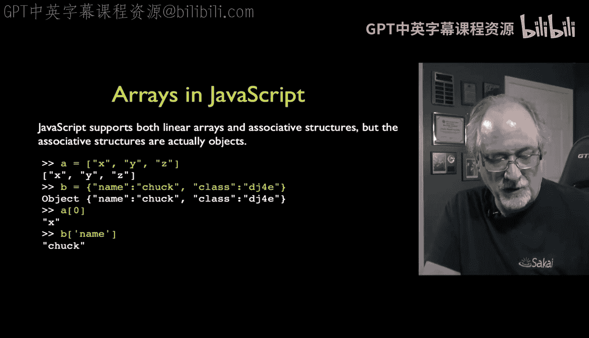

Linear arrays， you can make linear arrays， you can fill them up a couple different ways。

 you can either fill them up， you know， we start and make an array and we can push some elements in。

I don't like the name push， I like a pen better that would be what we would say if we were in Python if this were a list。

 but it works， push kind of pushes on to the end， normally push means we push onto the beginning but。

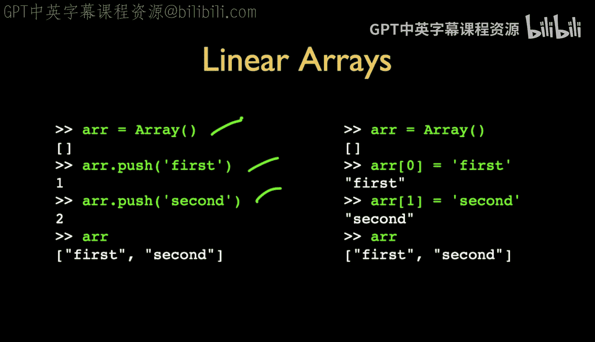

And computer science push usually means push down not append。

 but so I think Python has a JavaScript there where we say aend in Python， we say push in JavaScript。

 or we can just fill it up with the array， arrays of zero and of one。

 and then we can fill up a nice linear array if we want， and remember in JavaScript。

 arrays are arrays， they're not dictionaries， they are lists。

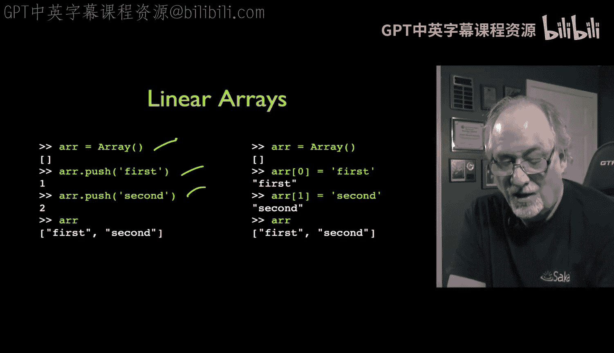

In Python Python has lists and dictionaries。🎼And JavaScriptscript has arrays and objects。

 There's other syntaxes for making arrays， you can say array and then just have a list of array list of things that make up the array and you get an array or you just use the constant form that's square brackets And this looks exactly like how we would do it in Python and so that works so in that particular line。

 you can write Python in JavaScript if you so desire Up next。

 we're going to talk about control structures。

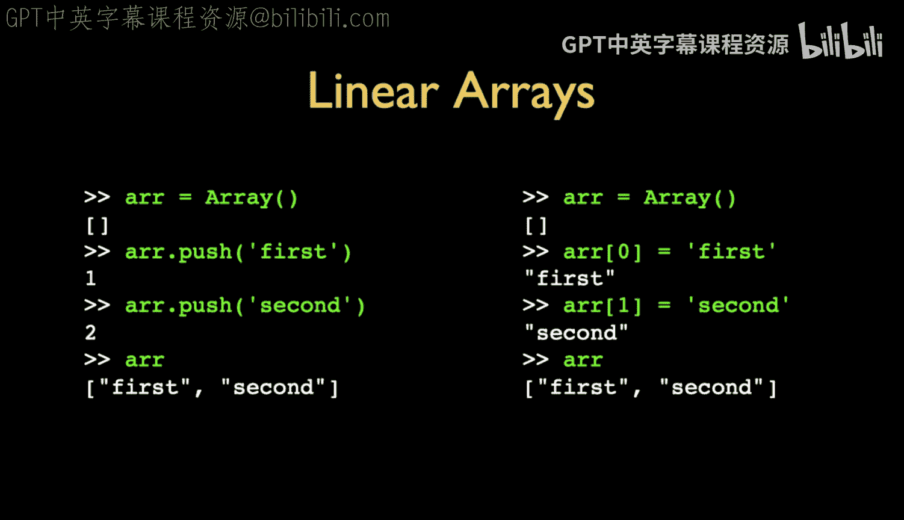

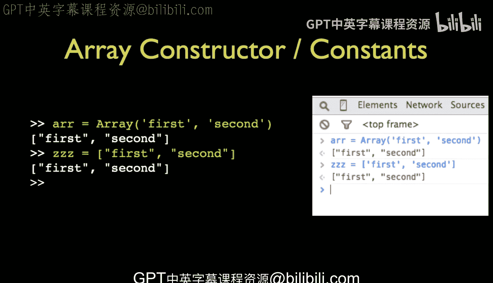