# 密歇根大学《给所有人的Django课程4⧸共4（部署Django应用）｜Django for Everybody》中英字幕 p18 18_04_02_JavaScript面向对象概念.zh_en -BV1rNibBuEwD_p18-

Hello and welcome to our lecture on object oriented programming in JavaScript。

Teach objectorient programming in Python in PhP and in JavaScript and I use the same slides over and over and over again and that's because object oriented concepts are the same So if you've taken other classes for me you've seen some of these slides they're adapted a little bit from JavaScript because JavaScript's objectorient pattern is particularly awesome。

 right？

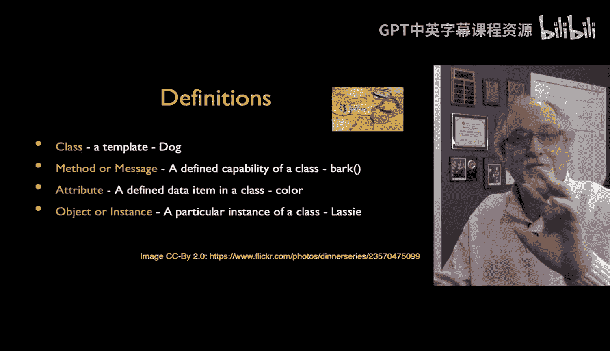

But there's this concept of a class， which is like a template。

 there's a concept of code and data in a class， whether you call the code method or message is up to you。

 whether you call the data attributes or fields。And then an object is an instance of the class。

 and so the cookie cutter is the cookie cutter is the shape that's the class and the cookie itself that can be specialized and it's an instance millions of cookies come from one cookie cutter and that's object orna so the key is is the craft of it is building the cookie cutter so that it makes awesome cookies。

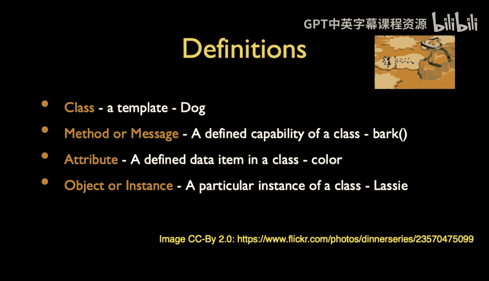

So the class like I said is the template， it's a blueprint， it's not the actual thing。

 but it is the precise instructions on how to make the thing an instance is once you make the cookie。

 you can have different frosting on it， you can have all kinds of other things。

 you can make subclasses which is what we do for inheritance。

 which make specialized versions of the class。

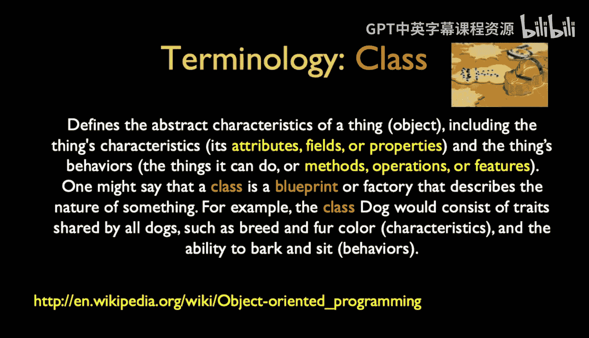

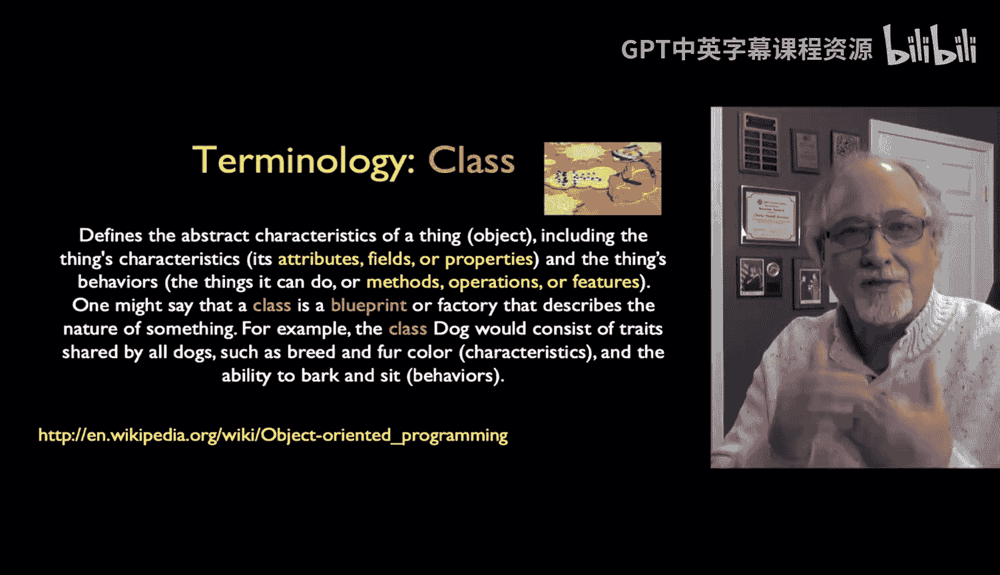

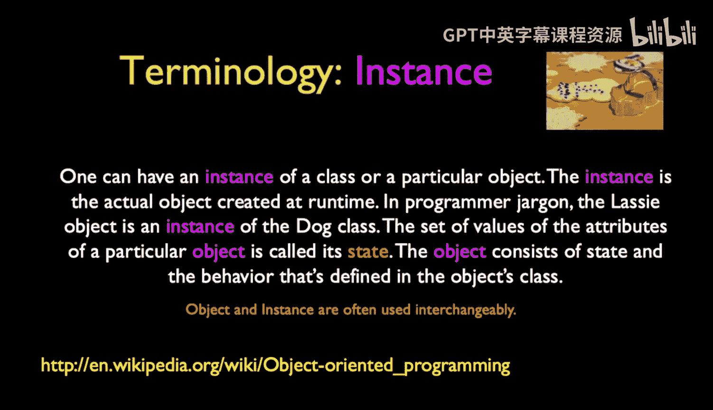

Now the methods are the code， so in classic programming we think of like code and data structures。

 algorithms and data structures， data structures are the shape of data and algorithms are the shape of the code the way the code is made to work。

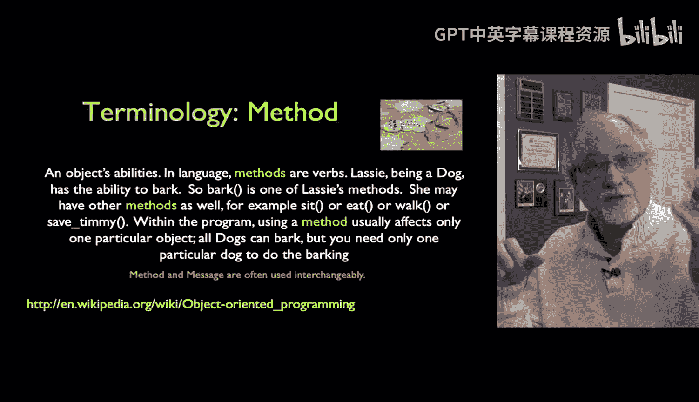

The methods are the algorithms that make up the code part of every object。

 every object has code and data， and often the code works on the data that's inside the object。

Some object oriented sort of schools of thought use method and some use message。

The more purist folks tend to use messages like you're sending a message， here's the object。

 not the class， you're sending a message to the object。

I tend to use method because method is a bit of code that lives in there and that's just because I think of things from like a Fort and RRC。

 very procedural way of thinking。

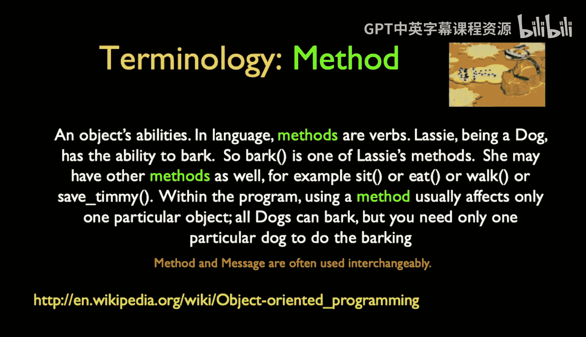

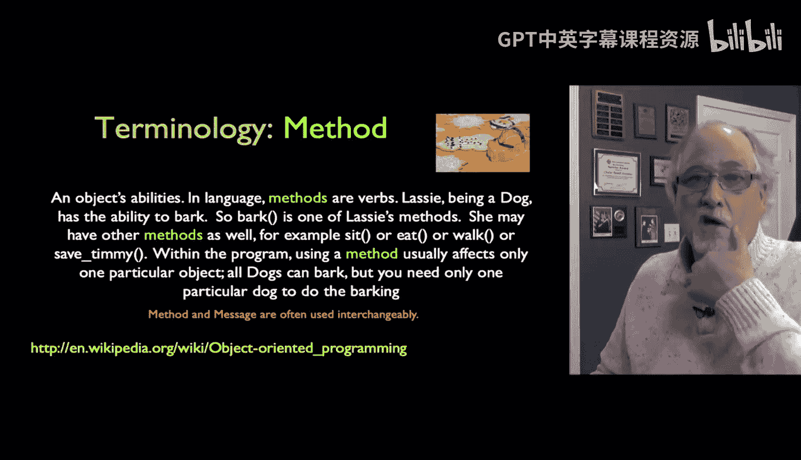

So objects in JavaScript are a little different and if you've seen me talk about objects in Python or objects in PhP or even objects in Java。

 which I taught a a long time ago。Or C++， they're very different and the key thing is it certainly is a storing reuse pattern。

 it is a mechanism to create data and encode and put it into one kind of reusable thing。

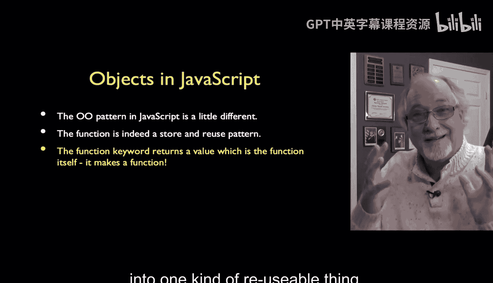

But the key thing is is that the function keyword。Is actually， in a sense。

 an executable statement and you can take and call and use the function keyword and the function is。

 in a sense， calling a function that causes code to come back to you so you can the have the function。

 create code and then assign it into the variable。 These are called first class functions and it has to do with the fact that in first class functions。

 you have this symmetry between code and data。 the code is just data and of all of the modern。😊。

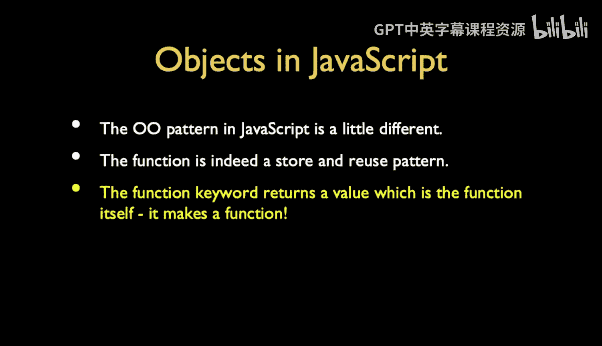

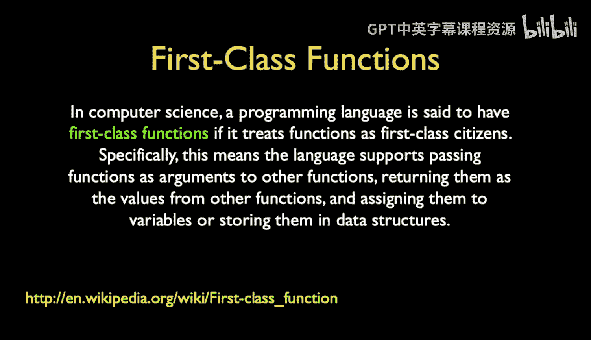

🎼Programming language is Lsp really was the original code data kind of duality JavaScriptscript is very。

 very， very much throwback to the list tradition of data and code look the same way or can be treated the same way you can have X as a variable and you can assign it to be 42 you can have it be a string or you can have it be a function that adds two numbers together and it's just X and that is kind of elegant So that's called firstclass functions and that functions themselves are the code the code in systems is manipulable as data copy around。

 use it reuse it。

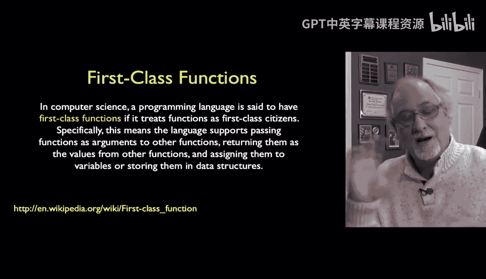

Et cetera。So up next， we're going to take a look at how we put together a sample class in JavaScript。

