# 密歇根大学《给所有人的Django课程4⧸共4（部署Django应用）｜Django for Everybody》中英字幕 p20 20_04_01_DJ4e图片-pics示例代码实战.zh_en -BV1rNibBuEwD_p20-

Hello and welcome to another code walkthrough for Jangle for everybody。In this。

 we're going to walk through the how to handle pictures。And in our DJ free samples。

 I'm going to walk through the code so first， let's walk through just how it basically works。

It's a crud application。です。Is crud。And now we have this brow to upload a file。

And so we'll upload that file。And then when we look at it， we're going to see it。

 if I click on the picture， I get kind of this overlay view。

 that's all JavaScript and then I hide it and I can upload it。

 I can edit and delete it so let me kind of walk through how this works。So first off。

Let's take a look at URLs。pyy。Theres nothing particularly special at。

The whole pattern is kind of the same。 I'll come back to this particular URL， the actual picture。

 the thing that in a sense， serves the pictures。 So if I could open this view the image in a new tab。

 Well， it's this it's this URL that's actually serving the image。

 This image is stored in the database。 And so we'll come back to that particular one。

 it's the stream file view。

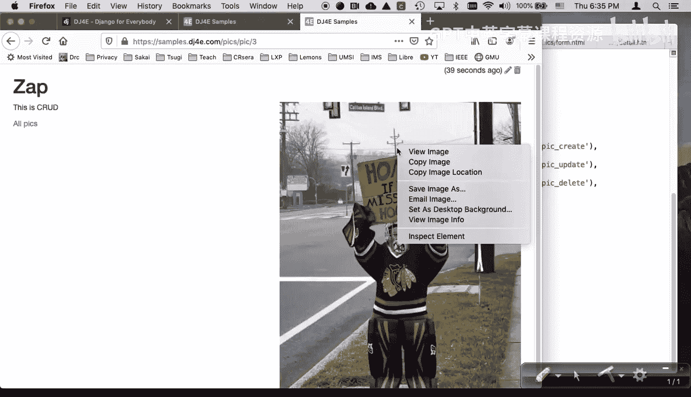

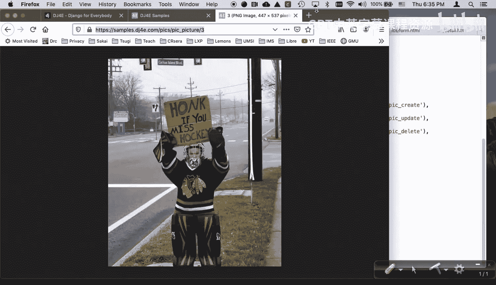

Okay。So let's go back to all PCs。And let's start taking a look first。

 let's go at the model first because this is where everything starts。

 sure let's go put the model here， put the views there。And the forms there。 Okay。

 so let's start the model。 We'll start from the back forwards。 So if we were to go look at the admin。

 I think I got the admin hidden in this particular one。嗯。Let's take a look at Amott Py。Yeah。

 I'm going so this is one of the things， let me show you how the admin works。Hope I got it in going。

 Probably don't have mymin account。Oh there we are， and you have it in then。

So if I'm to take a look at the ps。So， it turned out that。I didn't want either of。These。

 these two things to show up because it turned out it made it difficult because I wouldn't couldn't update things。

 so you won't see picture or content type here in admin。

 and I do that by excluding this and instead of doing this shortcut。

I am going to register for for the model pick this particular class。

 and it allows me to have this class wide variable called exclude so that I don't show those things。

 And so that's just a little trick on admin so that when you see it when they're in the database。

 they're just not there because you can't because the admin interface is not smart enough to update these pictures the way I want to update them so I'm going to hide that。

Yeah。So in the model， we've got a binary field which is like a blob if you're into databases and I'm allowing it to be nunll and blank and editable。

 and then there is this thing called the content type and the content type。Is。

I'm going open this in a new window。copy him his location。So if I were to do a view。

Develop a console network。One of the things when you're serving images。

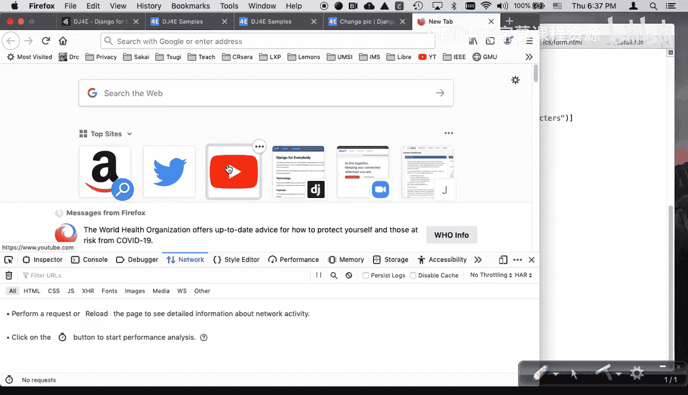

Is that you've got to you've got to set the mind type。

 So this is a get request and it' sent a bunch of data。 But if I look at the headers here。

 the response header includes this header called the content type。Oh， no， that was the icon。

What am I doing persist logs？I'll clear this， it's not the icon， that was the icon。嗯。

I you retsh this。 and so this is the actual PG。 and then the icon comes as well。 of course。

 the icon's that little picture。But content type is image slash P And G。

 And that's really important when you're uploading the file， you get to have it。

 And then you have to send it back out。 Otherwise， the browser will not know how to properly format this。

 So that is what is here。 right， That's the content type， It's just a string field。

 The content type is just a string， but it's very important to track it。 So when I am。

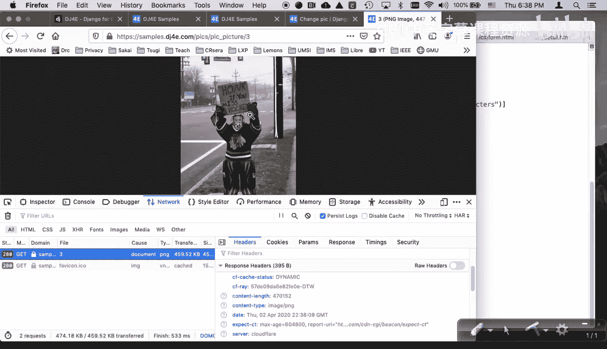

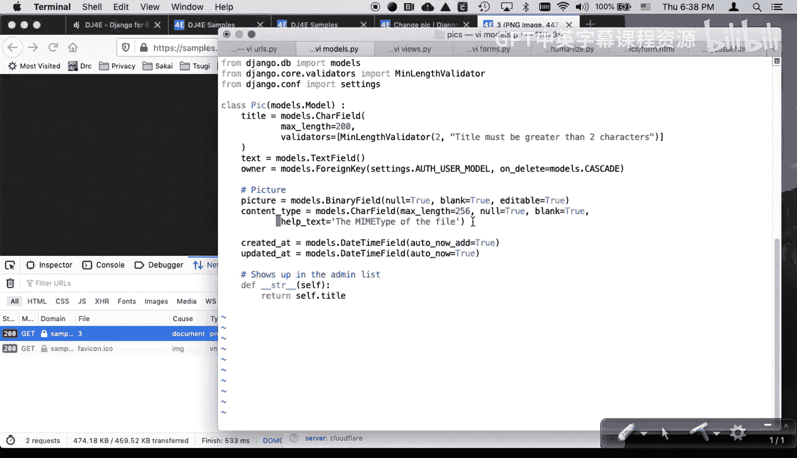

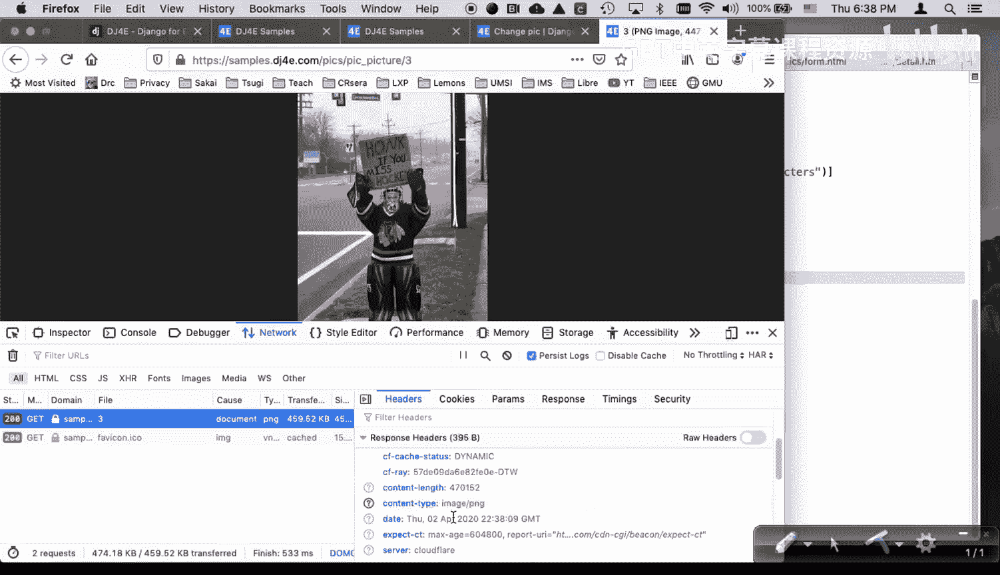

In a an ad。When I upload the file and I pick it， it's actually communicated to me as part of the uploaded data。

 but I got to remember it， I got to actual pixels go in here and the content type goes in its own character field。

 the pixel goes into the pixels of the picture， the actual colors and stuff go into this binary field。

And I'm going to use the owner， so we're going to have this we've did this before we have an owner and that's just going to be automatically created when I theres there's a owner stop PY。

There is a owner。 py。So there's owners。pyy， and that mean the owner。

pyy from the previous thing and that gets all taken care in the views。So all we got。

 it's pretty much a standard thing except we've got these two things and those are hidden from the admin。

So now let's take a look at the views。And so we're going to use the owner views again。

 and those are automatically handling all of the detail of setting the owner field and there is just not a single line of code in here that has anything to do with setting the owner field I set have this owner field in my model。

 and then I just extend for all of my other views I extend that okay。So I have an owner list view。

 an owner detail view， and you'll notice those do not require login。

I'm going to specify the template name， I'm getting a little tired of just remembering I don't necessarily like their naming conventions and so this I'm going to have my own template names here。

And。ickCreate view this one you're going to make one。Okay。

 and we're going to have a get request just like go going back because I can't quite make this one complete。

And my post request。And so the post request。Yeah i'm going to so i'm just this I might have been able to extend something or put inside but i'm just going to do all the work you'll notice i'll walk through this this will be a good review of that so let's just look at the let's look at the。

Pick Create View next， so let's take a look at forms。html。So。WellNow let's look at forms。 py。

 so the create form。 So if you think about it， if you recall。Right？

There is the views in the middle views。 And then the thing that talks to the browser that really controls our relationship with a browser is the form。

 and the thing that controls our relationship with a database is the model， right。

 So the view is interacting with the form to get what it means to do。

 And then it kind of transports it to the model。 So that would be kind of like a controller function If we're thinking a model view controller。

 This would be， but that's okay。 So， so the form。The form is what determines all of what's going on on this screen。

 and then the model。Yeah， oh yeah， that's not that's looks not good。

The model is what is going on back here。 and so you can think of the view as like manipulating both the form。

Sk。Both the form and the model。 And so it's interacting with them。

 And so you'll see when it's doing things in the beginning like。Cl。Escape。嗯。

Okay so you'll see that in the view when it's doing its work。

 it's working with the form and then eventually it's working with the model toward the end okay and so to some degree this post request is to get data from the form and handle everything when it's doing it。

Let's avoid， to some degree the hardest bits， we'll come back to that in a second。

So let's go and hit cancel and then add a pick。Add a pick basically runs this get request。

 So we're going to grab the form。 It's the create form。 and there's a little bit of work in here。

 There's the create form， and we're going to jack into just object oriented ways。

 We're to jack into the clean。 we're going to jack into the save。 But for now。

 all it's doing is this bit right here that you've been using for a while。

 And so we're going to tell it what we're going to make a picture form。 And so here's a thing。

 So there is a file field。 And so we're asking the form to include a file field。

OkayAnd so that's what puts out this file to upload less than equalalton megabytes。

 We've got a little bit of code to both have a numeric limit of the size max upload limit that's just a class wide variable and in a max upload limit text。

 which is that in text and that little file to upload less than equal2 megabytes that's because I'm doing this in the form。

 So Ive got a little bit of logic in the form and it is a model form。Which means that it takes its。

 it takes its input from it。 you I don't have to put these things in there。

 but I do have to tell it which things I actually want to do。 And so I want the title in the text。

 I don't want the owner and created out an update or kind of automatically。

 So that's why I've got the fact that inherit from the pick model。Which is this model。

 in it from the pick model and include title， text and picture now。

Title and text come from the model and picture comes from right here。

 So we're we're not if Django were our friend。It would understand this would be a file field。

 but it's not。 And so we have to actually manipulate it and convert it。 It's not hard。

 but in between。The view， I mean， the form in the model。

 we got to do a bit of work and we do it here in Formtop Py。Okay， so matter。Okay。

 so this part here in the top is all that is affected to create this screen right so that's what the get is doing。

 So if we look at the get， it makes a form。And then it renders it to self template。

 which is pickedform。html， and here we go。It's pretty straightforward Now。

 We're just going to load our Cripy form tag， extendt our base bootstrap， put out the CSRF token。

 pretty up the form and crisppy。 And that's sort of everything from title into file upload。

 And then we have a submit button and a cancel button。

 So one of the things that we're going to do is we are going to add some jque。

 And that is we're going to connect into this form。 And when the submit button is pressed。

 we're going to run this jascript code。 So that this line right here， upload form submit function。

 that makes it so that whenever the submit button， whenever this submit button here is pressed on this form this jquery is going to run。

 And so we will do a。Web developer， well， it's not going to do us much good because。Actually we can。

 so I'll show you how that works。So what we're going to do here is this a bit of code。

 I got this offstack overflow right there。 And what I'm going to do basically is I'm going to read whether or not this file is greater than or equal to 2 MBby。

 So if it's greater than 2 meby， I'm going to stop and complain with an alert statement。

 So this is a jascript。 and returning false here， saysy I'm not going to upload it。

 So let me create one with some stuff and let me browse。Let me find a really。Large file。

Okay so now I'm going to do a two web developer JavaScript console Well by the way。

 let me do a view source on this so you can kind of see that you can see all the stuff that came from base Boottap and you can see there's the CSRf token。

 there is the file input types and then here's submit and then here's the JavaScript at the bottom and this JavaScript is running code out of JQury and we'll talk about JQury right now we'll just look at it as JavaScript and we happen to be using the JQury library。

Okay， so now what I'm going to do is I'm going to press submit， and I'm going to watch this console。

 I'm going to press the submit button and code is going to run。

 and you're going to see the JavaScriptscript run。 and it's not going to be happy with this。

File Sakai， ladies of Sakai because it's too big， I think。Yeah， so there you go。

 look it said checking file size， and it complained that this ladies of Sakkaai camp。

Type must be less than two megabytes， which is exactly what I wanted。

And so that I enforce that rule right here， okay？Now it turns out that I got to also enforce it in the server because。

Somebody could easily just override that and force it to be uploaded。

But but you see that the JavaScriptscript is running in this browser， and it's kind of protecting it。

 other than that， this looks pretty much like a standard crg thing， except very importantly。

 if you're uploading files， you've got to say ink type equals multipart slash form data and that has to do with the format that the data is sent if you just had like a few text fields。

 then you don't need this， but if you have longer things like files， you need that。

 And so that is how we get through the get request。ok。😊，So now， let me。Pick a better file， P。

 my favorite。嗯。What my paw。Dangerous。One of my earliest。Okay。I don't know。I got so many little files。

ちちちち。Or Apple iPhone。s and JPg what I don't know whatever。 So this one's nice less than two。

 and I'm going to hit the post， so I'm going to hit the submit Now the post is going to come through and it's going to run this code right here。

And this is probably the trickiest part of this code。 So if you recall。

 we can construct a create form and get it back and we pull the data request dot post。 Now。

 it turns out that these little attached files like Apple iPhone Sakai Jpeg comes in in request files。

 And or none just is just in case it's not there。 Okay。

 And so what happens is is this is where we're going to do some of our work。

 We're going to actually pull data from this request do files。

 And so we're going to jack in the clean。 So clean is one of the lifecycls of a model form。

 meaning once the data comes in， it's going to ask to be cleaned。 So what we do is we call the super。

 call the superclass， the model form class and do the clean there。

 It doesn't know anything about picture because we're the one that added that。 okay。

But then we get the data in cleaned data。 and it's a dictionary at that point。

 And so I can get the picture。 So remember that the form is the part that's coming in from the browser right。

 And then I can make the picture， I can get it from there。 if I got no picture。

 I don't need to do anything special， right， If I do I am checking to see if the amount of data that I got from that upload is greater than that upload limit。

It's， it's good， so this is mostly here to check to make sure。I'm cleaning the data。

 I'm not actually saving it， but I am grabbing the picture from the form。

 and I'm checking to see if it's greater than 2 MBby。

 And then I'm going to add this is what you do in clean。 clean is just to say a nasty message。 Now。

 in this case， the nasty message I showed you before came from jascript。 But if you somehow trick。

 tricked my jascript and sent it， this clean would catch it。And so if I'm my view here。

Clean is happening right now。 Form is valid happens afterwards。 So as a side effect of clean。

 you're saying is the form valid。 And if there was an error from this or if there was an error like my title was too short。

 right， then。Oo he would come back and say titles greater than two characters。 Oh。

 we love crispy forms。 Look how pretty errors are in crispy forms。

 That is running this little bit of code right here。 If the form is not valid。😊。

And it could have been。 And in that particular case， the super got upset， right， because。

Because this min length validator triggered。 And so the super got upset and set form was not valid。

 Now， mine looked good， right， so but now the picture's gone so I can make a slightly longer title here and browse a completely。

I don't know what I'm doing。 These are really old pictures of mine， so now it's going to pass。

It's going to pass。 This is going to pass。 and I'm going to grab this。

 And I'm going to do my own check。 That's sort of a double check on this less than 2 MBby because even though the client。

Protects you。And that's the more user friendly because this is catching it after the upload happened and that might be long and two megabytes doesn't take that long。

But now it's going to come。And it's going to pass this and skip， and then it's going to come here。不。

And worked。So here's what's happening so you've got the form the form has like took all that data including the file right and cleaned it all up and I'm going to call form dot save commit equals false and then I'm going to set the owner field because I'm not extending owner view here so I got to set that owner view because I'm going to ultimately override both this post and the get and I wasn't going to get much help out of owner at that point and then I'm going to save the model so form dot save gives me back a model if I don't say commit equals falses it actually does the pick dot save also so if you save the form without commit equals falses commit equals falses means don't store it in the database。

Okay， so let's take a look at what's going on here informed Form about save。 So I have also。

Overridden form do save。 And I'm just behaving commit equals true is a default。

 But when I say commit equals false， then commit will be false。 And so I have got to call the super。

 right。Actually， this is really a nu right？Oh， I want。 Oh， no， actually。

 no matter what the commit is， this is the end users wish for commit， I am going to do a super。

 and I'm going to run a save with commit false。 no matter what this person wants it to give me commit to or not。

 I'm going to run commit false。 Then what I've got to do is I've got to grab the picture。

The picture from the form， I'm in a form。And I check to see if this is an inmemory uploaded file and there's all kind of cool magic that's happening right here。

 It's got this az， it's in memoryory， it's got this thing， it's an object， it's really nice。

 and then what I say is give me all the data， the byte array which reads all of the pixels of the file and then F dot content type is that image slash PNG and I then need to put that in the instance which is the model I've got to add to it the byte array of the text and the content type。

 I've got to store both of those things， and now I'm talking to the database。The picture， oops。

 the picture and the content type are being set as part of the save。

Then what I do is if commit is true。 Now I'm trying to mimic the save behavior。 Now。

 I'm only using this one way， right， with commit equals false。

 but someone might leave this out and call my call my form。

 I'm supposed to actually save the model if commit is true。 but in this case， commit will be false。

 So I'm just going to return the instance at this point， I have an object model。 object model。

 and in that object model。 all these two fields are exactly the way they want to be。

 And the only thing I've got to do is set the owner field。 which I'm doing right there。

 And then I'm starting it in the database。 and then I redirect。And that's how it works。

He's pretty cool。 You gotta kind of get your object oriented Zen thing going。And。Pretty awesome。

 So I'll just go through the update view， because。It's not that different than the create view。

So it looks the same on the get。 We're going to go grab the old copy out of the database。

 and then we're going to make a form and inherit all the old data。 Now， in this one。

 it's not going to put the picture out there。 It'll just put out a new one。

 So if I'm in the edit right here， it's going， it's not going to。Put the picture here。

 but it'll let me put a new picture here， because that's in the form。

 But all the old data is sitting right here。 And then， and then that renders the update form。

 And then I make my changes。 blah， blah， bh， blah， blah。I。Blah， blah， blah， right blah， blah。

 blah and and then when I post it， it's going to do this create form and the differences it's going to do a get objectject or 404 so that it pulls that old data from the database and then it does the validation automatically it calls this clean to do that validation and then then we save it。

 etc cetera， and so that's how it actually updates all of this stuff。

So the only thing left to take a look at is the detail page and so some of these things we don't have detailed pages and some we do。

 so let's take a look at this one， right？So this detail page looks just about like every detail page。

 Let's go take a look at the view。 And and so it's pretty good。 I mean we're just it looks。

 we're using the same code that we've used for everything and we're using owner detail view。

 We're telling it what model to use and I'm going to use Ps detail And most of this like again。

 humanizes to make times and dates look better。 I'll get back to that CSS in a bit。

Here you have we'll come back to this too in a second just showing you the parts that are like the way you've been doing it。

 it's got the buttons for the update， This is part of the owner code right。

 if the owner is the user we're going to write a pencil and a trash little icon and then print out the title。

And then， the text。And then some all， right， some all stuff， Okay， so that's what's familiar。

Let's now talk about what's different。So let's first talk about the Hm that generates this little picture。

 So if I do an inspect element， we'll see that what we've got here。

Is image style float right Max with that's some Css。 But the source here is picks， pick picture 3。

And so if you look what I'm doing here is I'm going to the picks， pick picture view。

 and then the pick Id， and that pick I is just the pick that came in。 And if we go back to Us now。

 that's this one。 And it goes into stream view stream file and it passes in， you know。

 an integer number as the variable P K。 So let's go take a look at that。

So that's this one and it's and I you'll notice that this is not a class based one。

 it's an old school one， mostly because hey， I'm just going to do get。The class based ones。

 we can do de get and deaf post， but this one I'm just going to do an old school thing passes in the request in the first parameter。

 which of course is that number three。That's the primary key of the image that we're trying to see。

Alright。So I'm going to do a gett object or 404。And of type pick。

 and I'm going to look it up by its primary key， which is that three， and now I have it。

And so I'm going to send an HtB response， but this is not a text response nor is an HTML response。

 this is where that content type。Going back to the model， remember， this is the mind type。

 that image slash PNG， and so whoop's come back。So as part of the response。

 So now if I can get this guy to open in a new， can I make that guy open， Come on， open a new page。

 Can I do that。Come on， Open a new page。

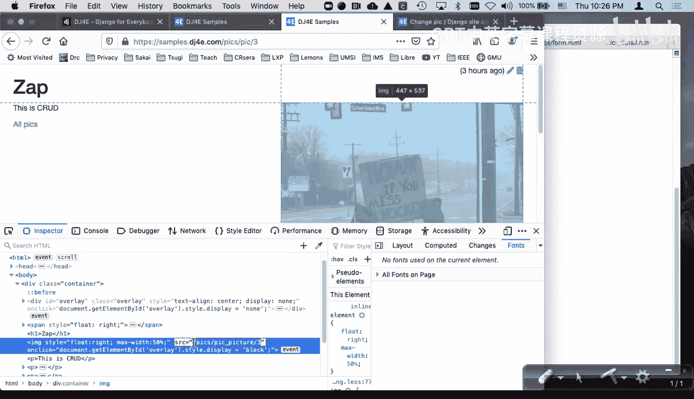

Vi image， is that going to work。Well， okay， I guess it sort of worked。

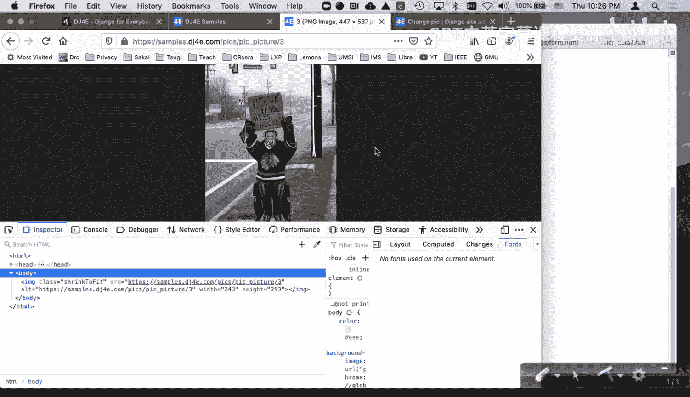

I wantna view image in new view image in。Okay， there we go。 That's what I wanted。

 I'll just go back and put this in。

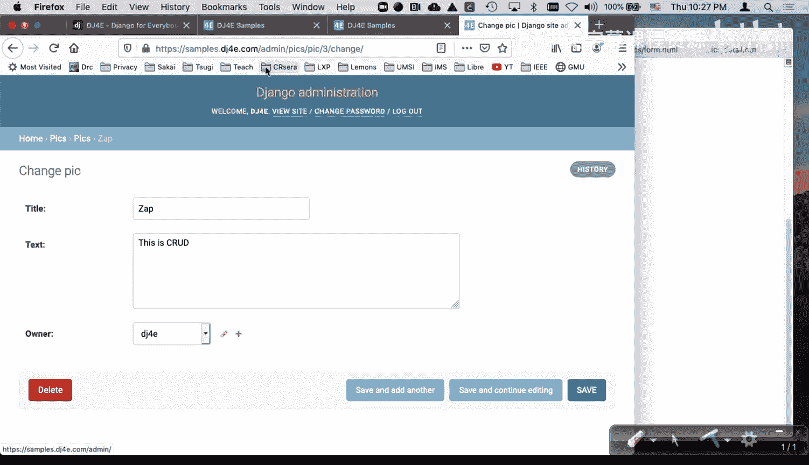

By itself， so now I can see that this is the， this is the URL that generates the picture。 Now。

 the picture is sitting in my database， right， But if I do view。

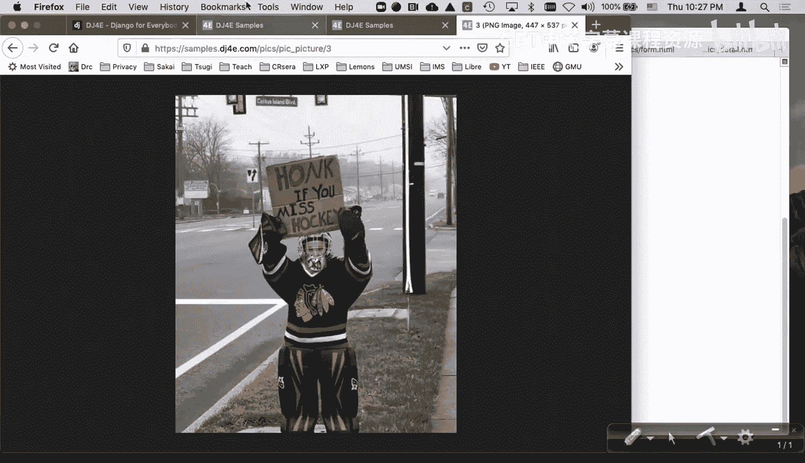

Web developer and go into network and clear the network and make sure I got。Now， it's already clear。

 persist logs and disable cash。 nowpha hit refresh。 is's going to see。That。It's coming back。

 and the response content type is image dash P G。 So to set that， to set this。

 And that's essential so that when the browser is seeing the pixels， it knows that this is a PNG。

 not a Jpeg or a GF or an MPG or a P D F or whatever。

 So this content type is something that we stored。 We got it。

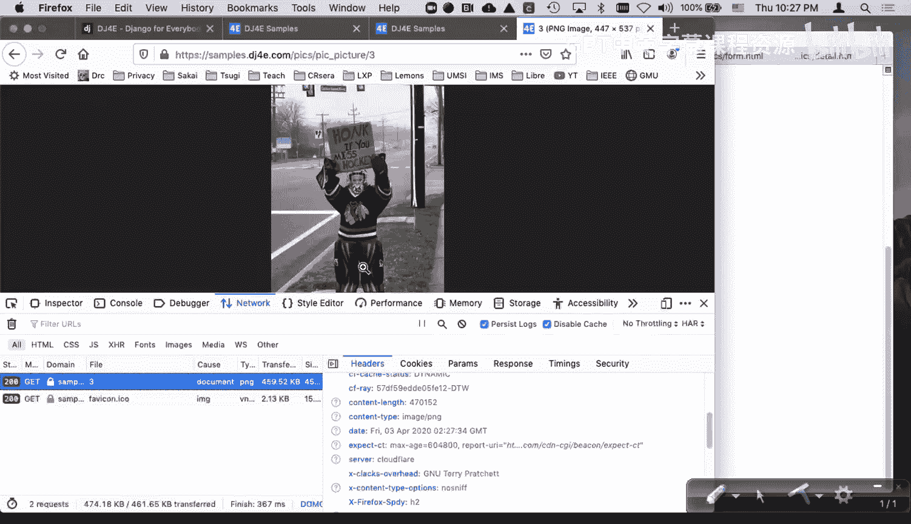

When we are doing the post and we pulled it in， we took all that stuff， and if you look at forms。 py。

 it was grabbing it here in the save method and we got it。From the form。

 And then we stored it in the database。 And now we've got it back from the database。

 And so we're just saying the content type， which is the header， is pick dot content type。

 That's a string。 And then we also have to tell it how long it is。

 But pick dot picture is the actual pixels that are the picture。

 And you have to tell it how long it is。 So if you look at content length。

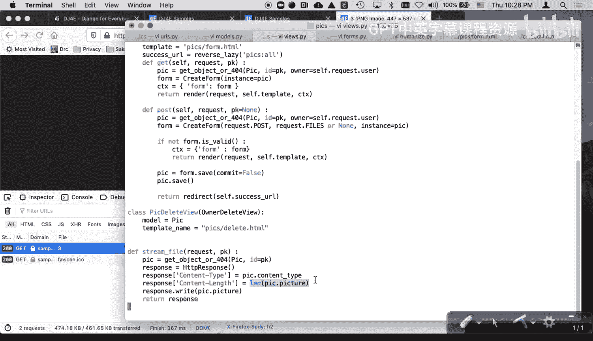

Right there，470152。

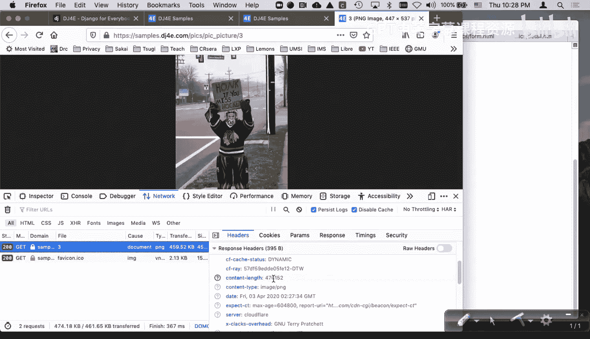

Yeah47152。 so that's content length。 We knew that from the database。

 and then we actually write the pixels。 and the place you see this is when you click on response。

 Now it's basically showing you yet at the picture。 But if you if you really looked at it。

 it's just you know fits and bytes and complete gibberish。

 And so that's what it takes to send that stream out。

 And so that's what makes it so that when I have an image tag。

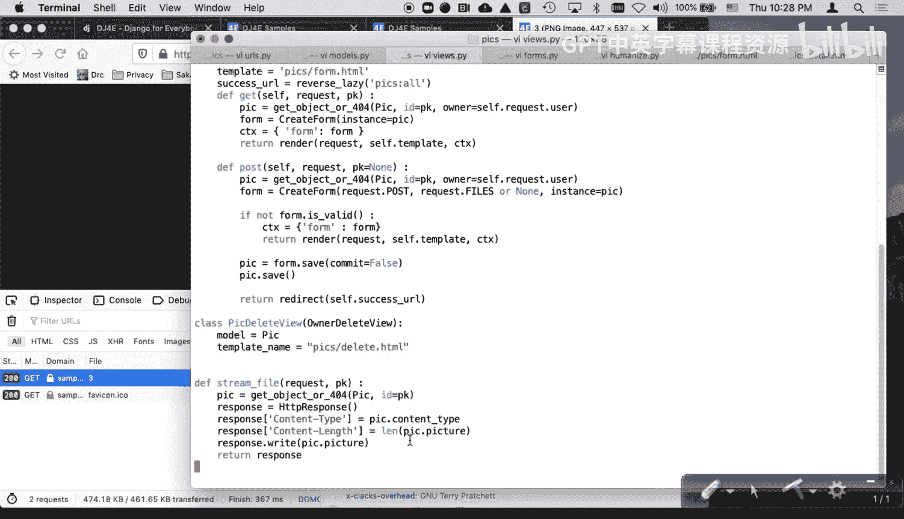

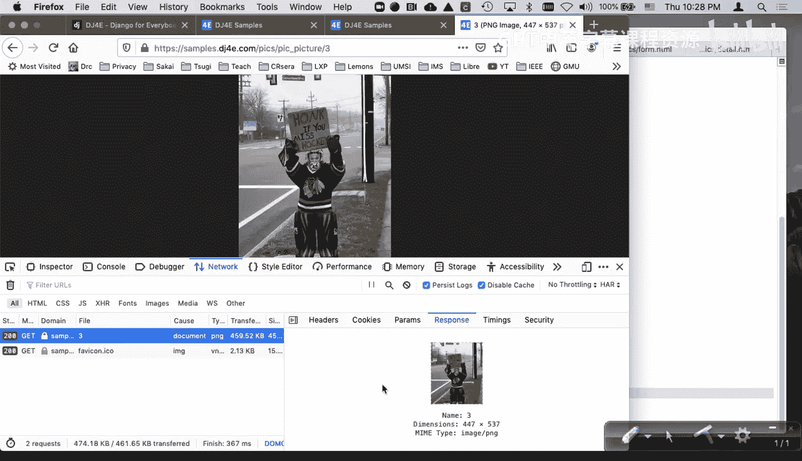

When I have this image tag， I can source， but I'm actually feeding that picture。Okay， so。

So that's how the picture gets there， but then I'm going to show you how when I click on this picture。

 I get this overlay and then when I click on the overlay。

 it goes away Now that this is there's all kind of fancy things and Boottap has modals。

 I did this with the simplest and crudeestt of CSS and JavaScript tricks。

OkaySo let's take a look at how I did that at that point now we're in JavaScript。

So first thing I've got is a CSS and it's this overlay position fixed。And you'll see that I have。

A div tag。That has the picture in it。And it's got a whole bunch of CSS in it。

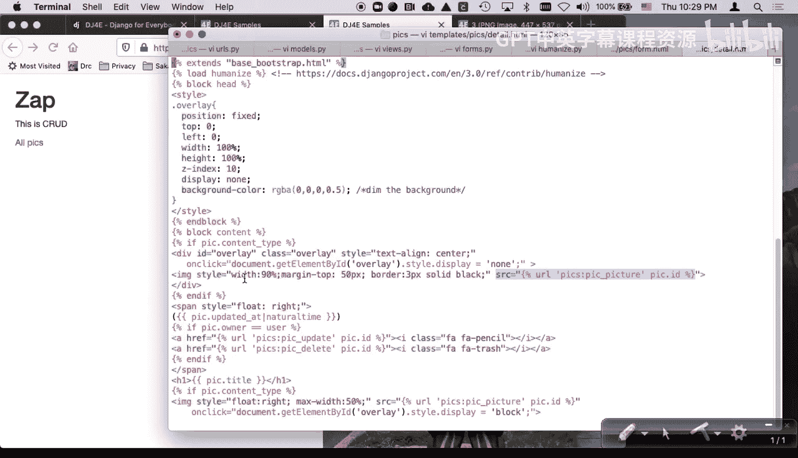

The width is 90%， the margin top， the border 3 pixel with a solid black， so you'll see this。

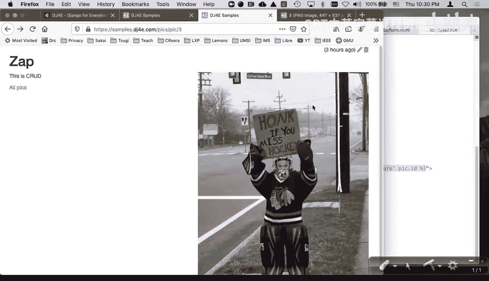

It's 90% of the width。 that's got a three pixel margin。 it's the margin top is 50 pixels。

 so there's 50 pixels here。 and so so that picture is there。But。😡，嗯。

Because this class equals overlay。 All this other stuff is there as well。 So that's not the picture。

 That's the rest of it。 So you can see that this is fixed， which means it overlaps this。

Div and the rest of the page。 This div right here and the rest of the page are like two layers。

 Z indexes 10， puts it on top。100% with， 100% height。Display none means it starts out hidden。

 And then I've got kind of this little gray。 You see this little gray bit。哎。

And then the image has this style， with 90% margin top 50 pixels that's giving me the border and the margin and making it 90% wide。

ok。

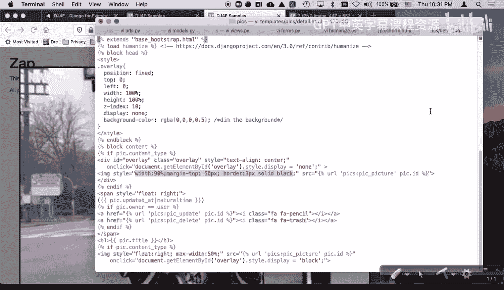

Well， let me get rid of it or hit refresh， so it's not there， it's not there。

 but if I do have you page sourcers， you page sourcers。It is there。It is there。It's just hidden。

 right， It's hidden because。I told it to be hidden。Here， so it starts out hidden。

So how does it unhide well， if I look？I've got this image here。 This is the actual image。

 that's this image that's really showing on the page， and I've got an on clickick but a JavaScript。

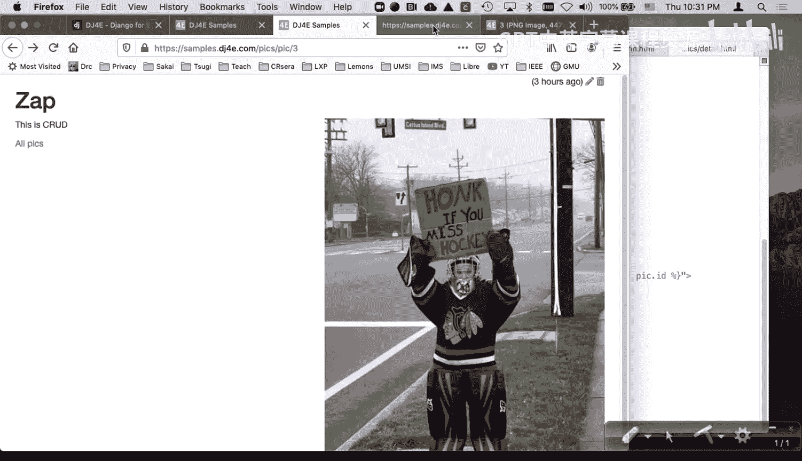

So on click。So what I'm doing is I got to on clickick there and then I say document。

ge element by ID overlay， which is looking for whatever。Tag has I D equals overlay。

 and then I'm changing its display from hidden to block。And so when that unclick happens。

When I click on goodbye。

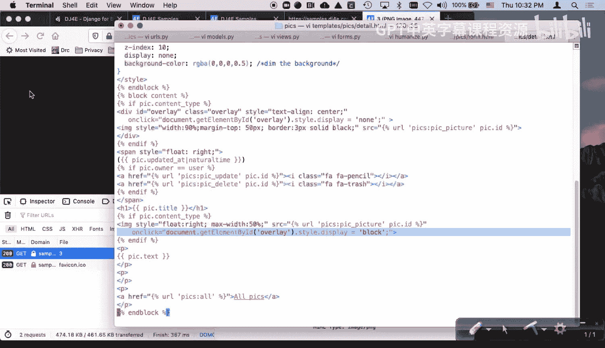

Good bye。 So when I click on this image， I've got an oncl event anywhere in this image that is going to show this other div。

 So this other div poof pops out。

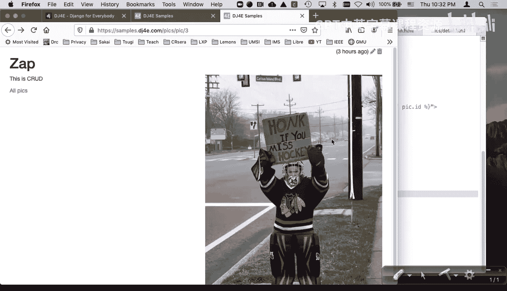

Now what I've got is an uncled method。On that div so that I can click anywhere， anywhere in here。

 including the picture or the background because that's part of the overlay。

 the overlay is the entire div in the background， so I can click anywhere， click。

 and then that triggers this document get element I style display none。

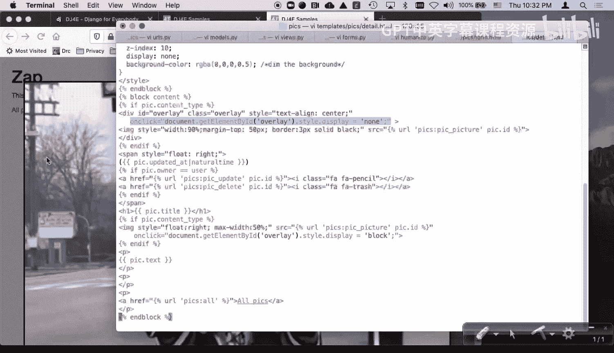

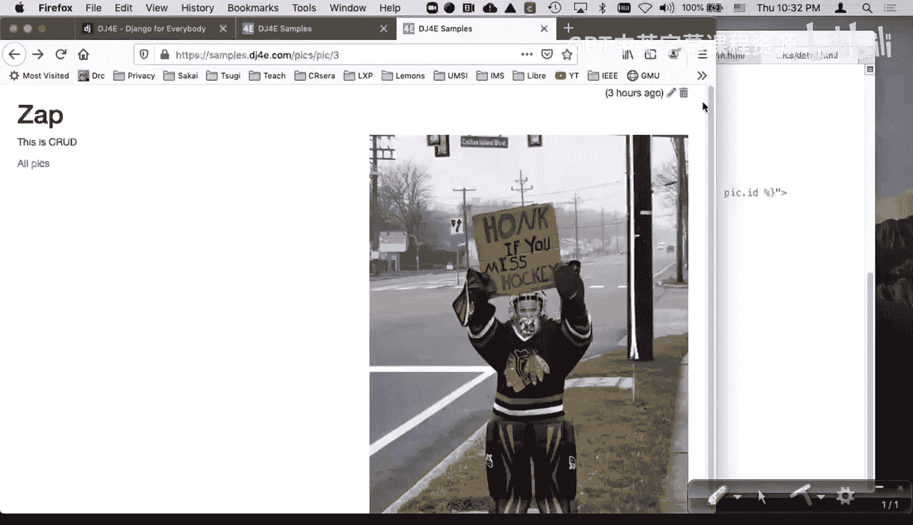

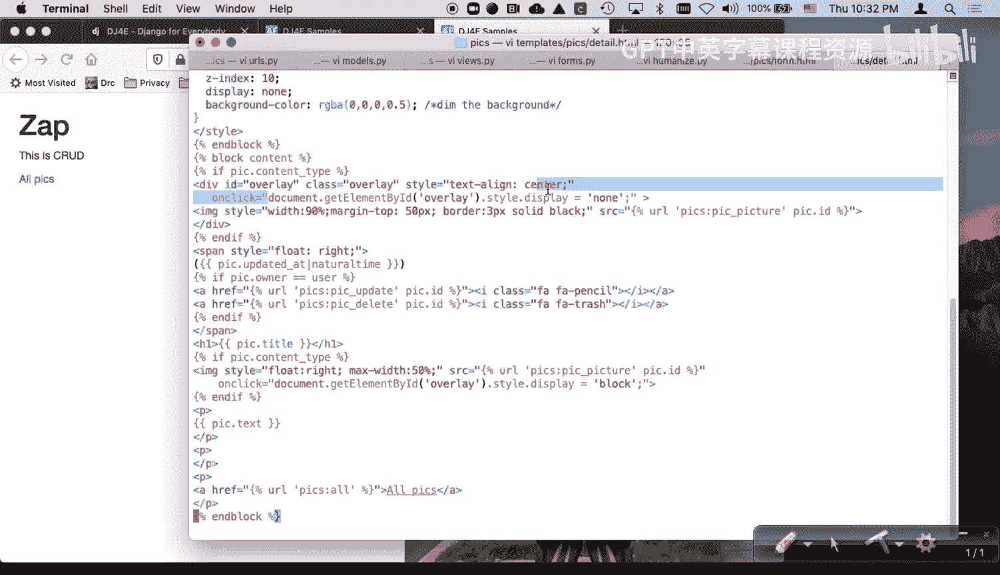

So I， it's still there。 It's hidden， so I can bring it up。 I can hide it。 I can bring it up。

 I can hide it。 I can bring it up。 I can hide it。 And I tried to make this one as simple as possible。

 There are prettier ways。 and people put little X v X up here and that hides it。

 They make a whole modal。 They use bootstrap。 They use。

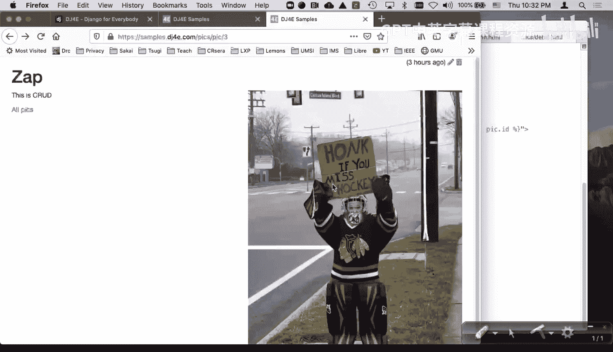

All kinds of clever things。This is like the least clever way to make a full screen。

 semi full screen pop up of an image using a bit of jascript here and a bit of jascript tier。

 and then some just slightly clever Css。 And I am sure I found most of this on stack overflow somewhere。

 so。

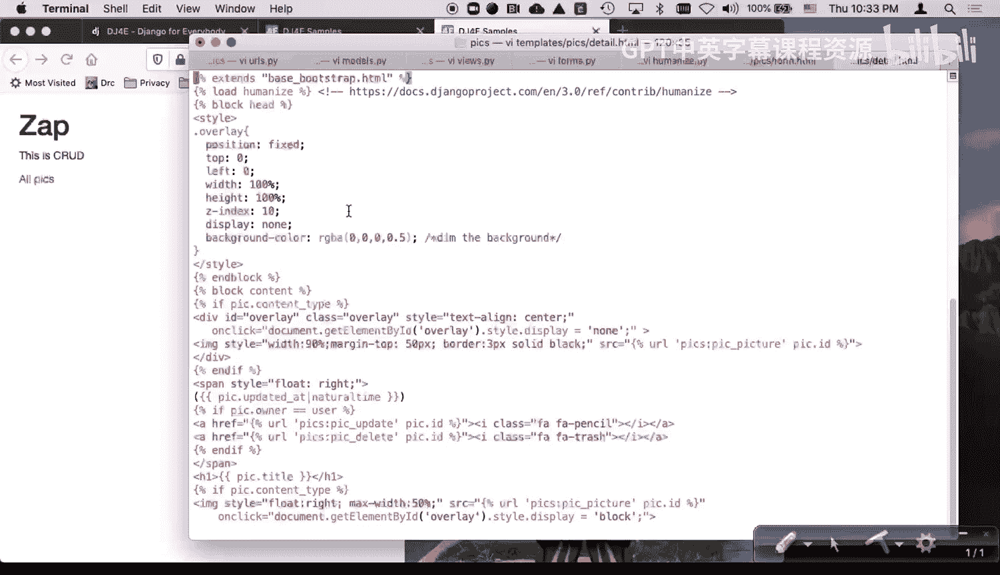

I hope that you found this particular walkthrough of how to add images to a Cr application useful。

 so hope find it useful， cheers。

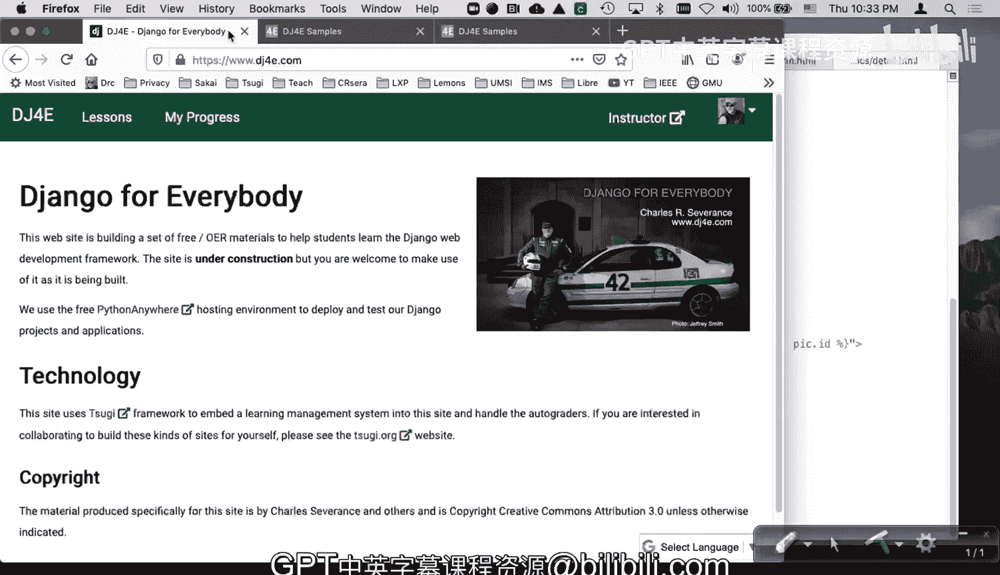