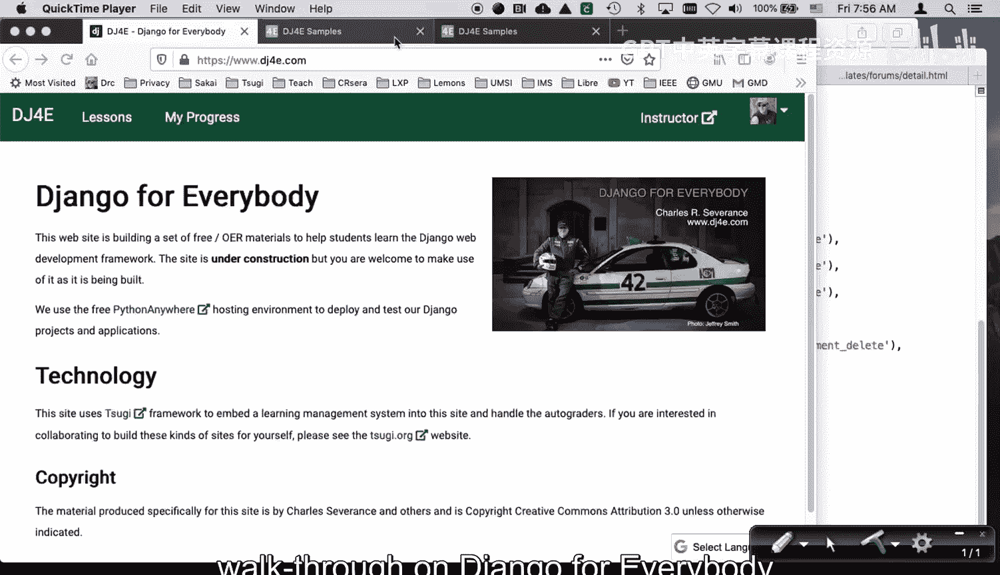
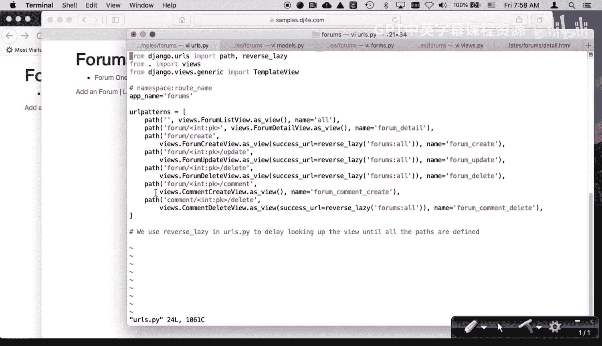
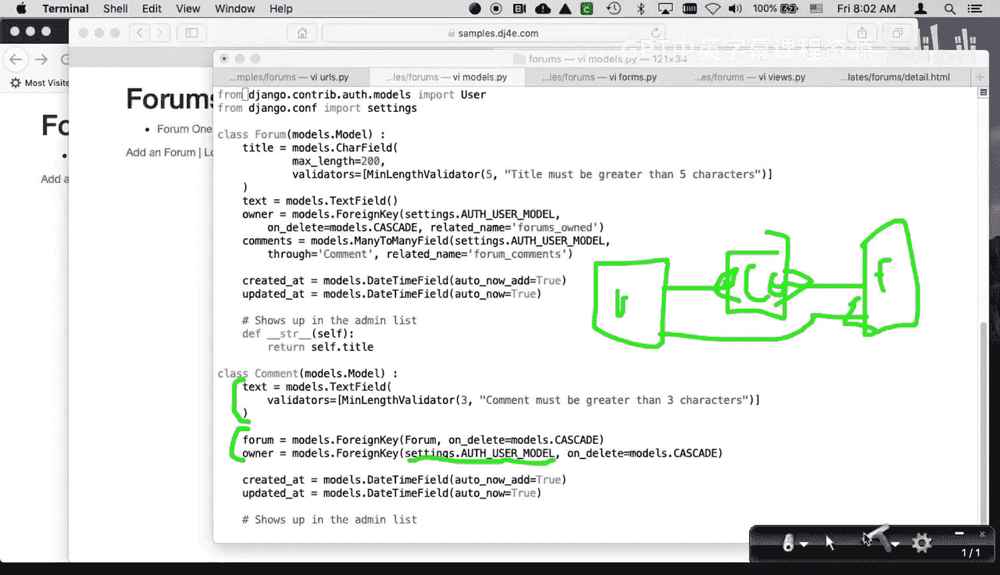
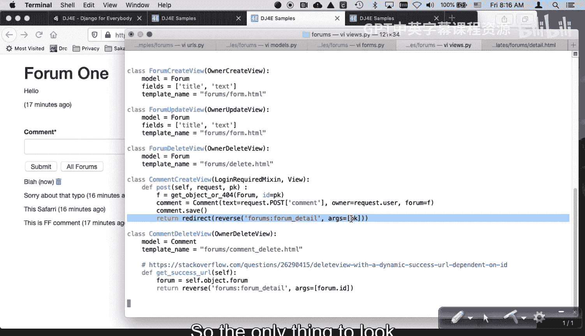
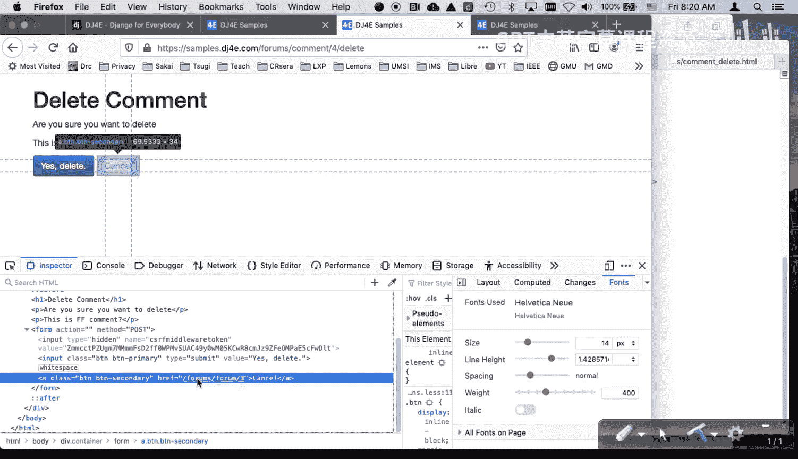
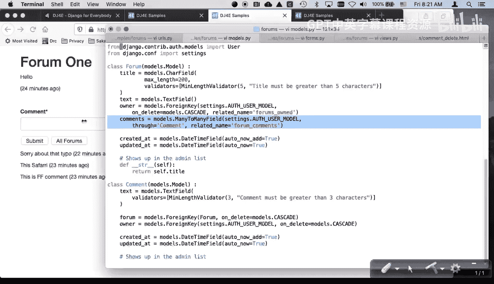
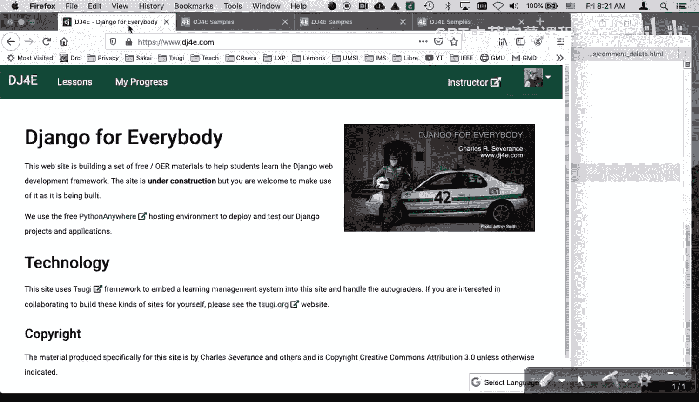

# 密歇根大学《给所有人的Django课程4⧸共4（部署Django应用）｜Django for Everybody》中英字幕 p21 21_04_02_DJ4e论坛-forums示例代码实战.zh_en -BV1rNibBuEwD_p21-

Hello and welcome to another code walkthrough onjango for everybody。

 we're going to walk through some sample code today。

 it's the code that really starts using the many to many work a bit and it's our formss code okay。

So let's just walk through how it works the idea I've got multiple。

 I've got two users logged in here， just two different users。

 this is also going to demonstrate the owner pattern again， so let's add a form。Forum。Form1。Hello。

So this is just credit at this point。嗯。And so this looks like most of the crud things that we've built。

I won't go through edit and the delete because the interesting part is here in the。

Detail page and so I can put a comment in this is。Person。This is Firefox。Comment。

 so I got one user logged in on Firefox， submit。And then I will refresh here in the other one。

 and I see Form1。 So well， let me just make a comment。And this is。Sorry。是。

So you can see that this is the Firefox comment in the Safari comment。

 And now if I hit refresh here in form 3， you can see the Safari comment and the Firefox comment。

 which I didn't even get myty of graphical error done right。 Well。

 the key is now you see the delete button is appropriate。 So the comments are owned。

And what's even more important is sorry about that。Typo。Is theres multiple of them。

Right so now if I just hit refresh here， you can see that and see these things happening and so there's for one forum each user can have many comments right and so this has to be a many to many relationship。

Yeah。So and then if I go back to all forums。this guy sees the is the edit and the delete。

 and then this one does not see the edit and the delete。

 So so you get the idea that that's pretty much what it does。

 So it's let's take a look at the code here。There is not too much tricky in the URLs。

pyy most of the URLs。pyy is like all Td things we've built。

But the comment is yet another table because there's really two tables here there's the forum table in the comment table and so we've done stuff like this where we've got two tables involved there's actually three tables involved but one of them is the user so we'll come back to this a little bit there's not too much outrageous or new in that。

嗯。😊，But we do have two models。Oops， let's get that back on。 The first model is the form model。

And this is other than。Its new many to many field， this is really very straightforward。

 It looks like almost everything we've been doing that's crud。

It's got some fields and it's got an owner key and so again， there is a table out there。

 there is a model out there， the user model that's out there， okay。And。We're， in effect。

 drawing a picture。 This is a one many。 so that oops， let's draw this。Is the pen working？And。

 come on， pen。Hang。There we go。嗯。So owner is a one to many relationship that is that there is a user table。

And then there is a forum table。And each user can have。Many forums， right。

 so each user can have many forums， so that is our table。

Now what's going to happen is the interesting part is here。

 but let's first talk about the comment table， so the comment table is down here。

And the comment table has one user can have many comments and。

One forum can have many comments as well。 And so because。In a sense， there is a。

 let me change color here。 Come on， change color。Let's go Violet。

Because there is a many to many relationship between。

Users and forums with a little bit of comment data sitting right there in the middle。

 we have to model it as， you know that has to be modeled as a completely separate table。

 right so there's only two tables here， but really there's three tables here because the user table is participating in both of these models。

And so。We'll come back to the Anita mainfield， so this is the comment。

And like connection tables or junction tables or join tables， it has two foreign keys。

 it's the most important thing， it's the keys in each direction， I guess I shouldn't change that。

 right？So come on， give me。I don't， yeah。Do。Right， so we got the user table。We got the comment table。

And we got the forum table。So formss can have any comments。Users can have many comments。

These are forum。 And so a user can have many forums。 So this， this side of it is a foreign key。

 and this is a foreign key as well， right， coming out of the comment table。

 there are two foreign keys。 And look at that。 There is a forum key aimed at the forum model and then a foreign key coming out of the comment to the user model。

Now， again， we've talked about in the lectures， we've talked about modeling data at the connection。

So the text。

That we're getting is the text。The text that we're getting at the modeling point is this text right here。

 It is the actual comment itself， and you could make a different table for it。

 but it's just as easy to model it right in the middle of the junction field。Okay。

 and so that that's pretty much it。And we have to in the。In the forums field。

 we are basically saying， look。We're going all the way through through the comment model and we're coming out the other end in the user model This related name is really。

 really important and thats that's basically a name I me draw my picture again I should have I just drawn this picture and kept it。

Ch。The user table。For table。And the comment table。Ch。TheFor has many comments。User has many comments。

Right。And so in a sense， what we're seeing here is。

This basically says that there is a relationship dot， dot， dot， dot， dot， dot， dot， dot。

Between forums and。嗯。Users， and it is in the comments table。

 The table that it goes through is the comments table。 That's what the through means。

 And then the related name equals form comments。Is actually you're installing in the user object a。

Method and attribute， something in this user model that says forum comments。

 So we're actually extending the user model。 If we were looking at the user， we could say， hey。

 what are the forum comments for this user。 And that would give us a。It would come over here。

 and it would give us a list of all the forums。 Actually， no， no sorry。

 It would come over here and give us a list of all the comments。

 But this related name is the name of this attribute。

And you don't necessarily need all the time to be able to do this。 But the problem is， after a while。

 when you're plugging so many things into the user model， you can end up with crushing。

 you can end up with name conflicts。 And so it's good to name this thing。

 even though we might not use it。 So I hope that。Hope that helps。

 So we this is a pretty straightforward thing other than the fact that the user model is our third table and。

And we're using it in both places， so there is that。嗯。Good。So the forms。

So the only place I'm using a form in here is this is this comment form so I just made it and the reason that I made a comment form because is that I wanted to be able to make it look pretty I wanted to be able to use CRy and so instead of just making this comment form on the detail page out of HTML I just made a form so I could use CRpy in the detail page so that's the forms。

The views。The views are pretty straightforward， the create the delete， we'll come back to comment。

 create and comment delete they're not all that tricky either。

 probably the trickiest thing going on in here is the forum detail view。

And we're extending owner detail view。And the template name and the model and all that stuff and we're not we're not over there's no。

 we're not going to post actually， you'll see in a second。

 we're not going to post back to this so we'll need to get。And so if you look at owner detail view。

 I guess I should open up another tab。This is Data， my heart's owner。Wonder。

Owner detail view extends detail view， which basically demands a primary key and so there is a primary key value。

 don't do that， do that。で。There is this primary key value that's going to come in。

 and that's going to come in from。The detail view， which is the second parameter。

 which is forums forum 3 my So we're going to go grab and load that object。

 I could have made that a getter 404。 I probably actually should have made that a getter 404。

 So that's going to load the form object。 And the forum object is the title in the text and the owner of the form itself。

But then what I'm going to do is I'm going to say， go get me all of the comment objects。

Filtered so that the forum value in the model equals the current form。

I this forum that that is the forum we just loaded。 That's the forum key in the model。

 So the first one is。This forum in models。 And the second one is this variable。 I could have。

 I could have changed this to be。 I'm not going to change it， but I could have changed this to be。X。

I' could change this to be x。I'm not going to save it， although it might be， maybe I'll just save it。

Make sure I got all of comment form， form form。Let's just make this be X2， because。

Ca that's the variable。 I hope my code， I hope I don't break the code by doing this。

 I'm trying to show you that this is a a field in the model。

 and this is just a variable in this view， right。Okay。

 so this is going to give us a list of comments in a sense。

 this is kind of like a list view if you're dealing with a list view。

 you got to write a for loop to go through it in the thing。

 so we got all the comments for this thing and we're passing in the comment form that's simply constructing it。

It's constructing this comment form。And then we're going to basically render。The request。So。

Now we'll close that one， and so let's take a look at this detail page。

 this detail page is what generates this forum。A lot of it's pretty much the same。

Check to see if you're the owner before you put up the little button， little pencils。

 That's quite nice。 printnt out the form title， print out the form text， print out。

This stuff is all the form tile text and how long go it with the natural time。

 So that that's pretty straightforward。 So that's really not all that tricky。

 So then what we're going to do here is if the user is logged in。

 And so it turns out that this does not require log in。

 And so the only time we're going to show this comment this comment form is if the user is logged in。

 So this part right here is if the user is logged in。BR clear equals all is what stops。

 brings this stuff back to the left margin， even though I floated these things over using CSS load the Criy form tags。

 and then I'm going to build the form， that's this comment form that goes from the word comment。

 word the text， the submitit button and the all forms。

 which is just an uncled JavaScript that sends us back to the All forms page。

And that is the end of the user authenticated because it turns out that seeing seeing all this stuff。

 seeing the actual comments， that's okay， non Logged in users can see it。

 and then if you recall going back to the views，We sent in the comments and the comments is a list of comments ordered by in descending order most recent first。

 and I guess you don't see it there， but they are most recent first。But at that point。

 we are just going to write a for loop to loop through all the comments， print out the comment text。

 print out the comment updated at， and if the owner of the comment is the current logged in user。

 put out a little trash icon。嘅。😊，Put out a little trash I cut。拣咧。So that generates the output。

That generates this page， but let's take a look at a couple of things that we're going to do。

 So you see this。This two first two things， right？We are actually going to post with action equals。

 This form right here。 The comment form bh does not post back to forums detail page。

 This is the forums detail page。 If you look at it， it points post to forum comment， create。

 So let's go back to that For comment， create is right here。

And and so it's just going to run this comment create view passing in the primary key of the forum。

 okay， so then if I go into my views。Forum， create。No， comment， create view。

So comment create view is what's going to happen when I get this post right so there the post is going to come in。

 there's going to be some a comment field， which is this text field and there is the primary key of the forum。

 not the comment So now we are going to make the connection This is where we're actually making the connection and you'll notice that I'm just saying login required view and view because I don't have an automated way to do this and so I'm going to do it by hand。

So we're in the post。We're going to go grab the forum object。By a pine primary key。

 there I am using a getter 404， so at least I blow up in the right way。

Then what I'm going to do is I am going to， let's go back to models。 I've got to fill out。

The text field， the forum field and the owner field。

 and the owner field are the two foreign keys and come back back come back in the many to many we have to have those objects available to us。

So we are going to build a new comment that this doesn't store in the database。

 The text field comes from the request post， the owner field is current request user。

 and the forum field， the foreign key in this middle connector table is this forum object that we just loaded。

And so that fully populates。A comment object。 It fully populates a comment object in that。

 in that post method。 And then all we have to do。Is we have to say save it， so the comment。

 save takes that in memory comment that we created with the two foreign keys in the comment and sticks it in the database。

And then all we have to do is redirect Now what we want to redirect back to is we want to redirect back to this detail page because we don't want to direct back to ourselves and we don't want to redirect back to all forums。

And so we have when we hit submit， we want to come back here。

 so it just looks like that thing showed up， but really it was a full request response cycle where it posted to comment。

 create view， but after the post was done， it did a redirect and we're doing post redirect。

 So it's cool anyways。 And so this is a slightly different version of the reverse。It。

 it is the same concept as what we what we've seen all along where we have like a forum Id inside a second parameter to the URL because the reverse in this URL thing。

 I wish they'd call this reverse because that's what it's doing。

 The URL is just kind of a raper for reverse。 Well， this is the two parameter form。

 So we have one parameter form of URL， which is this one， which says go URL forums call an all。

 says give me the URL to the to the view that is named all within forums here。

 I'm saying URL forums form， create form I D。 This is saying。

This one needs a primary key because if you go into URLs。pyy。The form createate demands a parameter。

 and so we're feeding it， but you can also feed that in in a reverse。

you do it with this funky format， I wish that was by position， but no it's not。

 you have to this As keyword and it's sending in a list of variables and the variable is the primary key。

 which is the number， which is this three。So redirecting to forum slash forum。Slash three。

 and that's where the three comes from。Okay。😊，Okay， so。

The only thing to look at next is what happens when I hit the delete button。

 So let's take a look at the detail page。

So。Remember that we cannot delete in a get， but we have to delete in a post。ok。So in here， I am not。

 I am。 this is the trash can。 The trash can is not going to do the deleting。

 The trash can is going to link to。Forums comment delete with comment ID。

 And so these are so there's this number three。 but each of these comments has a comment I。

 And so let's just inspect。 this is， you can see in the bottom， it's comment 7。

This one is comment4 and so that is the comment ID because we're looping in this code we are looping through for comment in comments。

 so each comment has the primary key。So with all that， I am just going to click on。It， and of course。

 we're going to have a。A vererification page that turns the get into a post in a sense。 I mean。

 it's just a page。 And so we've gone to comment， delete view。 So forums， comment 7， delete。

 And if you look at the URLs dot P Y。Forearms， comment 7， delete， right and。

We give it a name and we're going to route through to comment， delete view。

So if we take a look at our comment delete view， well。

 what's pretty cool is that we can mostly use owner De view because by now we know it the object。

 we know that we're in the comment model。The template we're going to work with。Hiss。Comment， delete。

Which is pretty straightforward。睇。😊，嗯嗯。So it's going to go find and so you'll notice we don't have a get in here。

 we don't have a post in here， and that's because we're inheriting all that from owner delete view view。

 the owner delete view now。The only thing we're overr is the get of the success URL。

 because the success URL， when we're all done， we want to go back to the forum， not 7， but 3。

See how we're going to go back to Form three and it looks like that just went away。

And so the Su URL is actually needs to be computed。Based on the current forum。

And so we are overriding the get success URL， which is part。Not exactly of owner delete view。

 but the models， the generic delete view。We are returning a string， and if you go and you read。

Selftobject。 forumum。Self dot object points to the current comment。

 so if this is we're in the middle of comment for delete。While we're running in this view。

 self dot object is the comment。Right， that's number 4， comment number 4， but comment number 4。

Dot forum is the primary key of the forum that this object belonged to By the time， oops。

 By the time we're here getting the success URL， it's actually been deleted。

 but we still have a in memory copy of it。 So we're going to go to the forums deep。 Oh， no， no。

I do not intend。Where was it。I was dragging it by mistake， trying to highlight it， right？

So it's been deleted， but we have it sitting here in the memory and so we can get its former primary key。

We can get the forum's primary key object doesn't exist in the database anymore。

 but the memory copy does， and so we know what that number is。

 so then we go to this fancy reverse again with a parameter and so that's how we get back。

Let's see what happens in the cancel。Cancel cancel。 Oh， so it's the cancel。 right。

 So the cancel does this。 The cancel generates the URL form detail with a comment。

 which is the current object。And then a foreign key into forum and the primary key of the forum。

 So comment forum I D is what generates this URL。And there is that URL。

 It goes back to the form detail page。 So if I go cancel， it goes back to the right page。

 and that's because comment， you can walk you're walking the foreign key in this particular situation。

 So I think that we pretty much have covered Aly， just check the views。 Yeah。

 we covered pretty much everything that's unique in this particular bit of code。

And again， the new part here is to have a connector model and then have a many to many field。

 the rest of this is very much similar to many of the other things that we have talked about。

 so I hope this has been helpful to you and now you can start playing with many to many kinds of connections。

 cheers。

