# 密歇根大学《给所有人的Django课程4⧸共4（部署Django应用）｜Django for Everybody》中英字幕 p24 24_05_02_浏览器中的JavaScript执行模型.zh_en -BV1rNibBuEwD_p24-

Hello and welcome to our lecture on JavaScriptscript and the browser。

 So JavaScript is a programming language， but more importantly。

 it typically runs in the browser in the browser， there are some special things。

 If you're just writing in Python， B， you've got this whole operating system。

 whether it's Windows or Mac or Linux that threads things that allows you to write a piece of code that says。

😊，Put out a prompt， wait for some input。When the input comes， write a loop。

MakeMake a URL Lib request， wait for that request， when that request comes。

 open up a database connection， put that data in the database and there's this whole thing where you're like。

 go wait， go wait， go wait， and operating system is taking care of the fact that your laptop keeps working while this program is waiting。

But that's not how it works。In JavaScript in the browser， and the JavaScript in the browser。

 this whole idea of waiting for something。Is an anathema because it does what's called cooperative multitasking。

And so in some ways， JavaScript is not just a programming language。

 but it's also kind of part of what we think of typically as the operating system。

 Weve got to help the browser work with things like document object model being updated。

 the visible window being scrolled and tabs， multiple tabs are going on。

 eventss are happening and timers are happening。

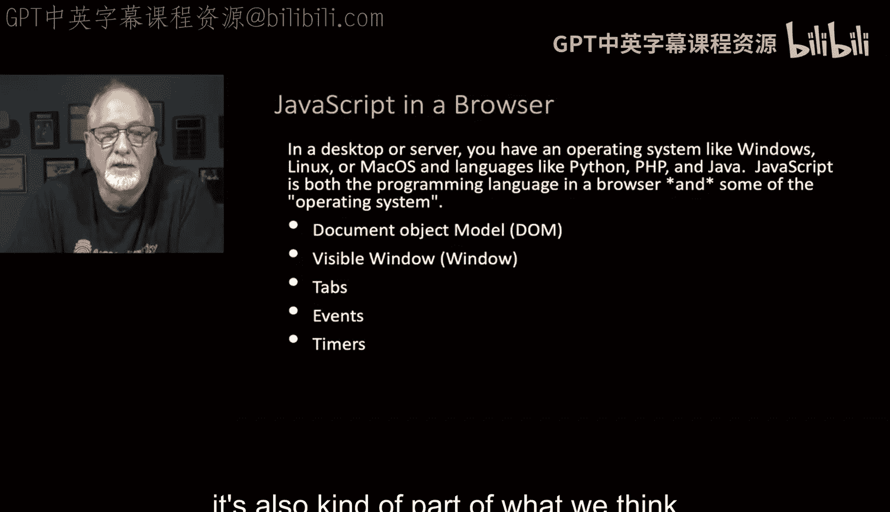

And we have much more responsibility in the browser。😡。

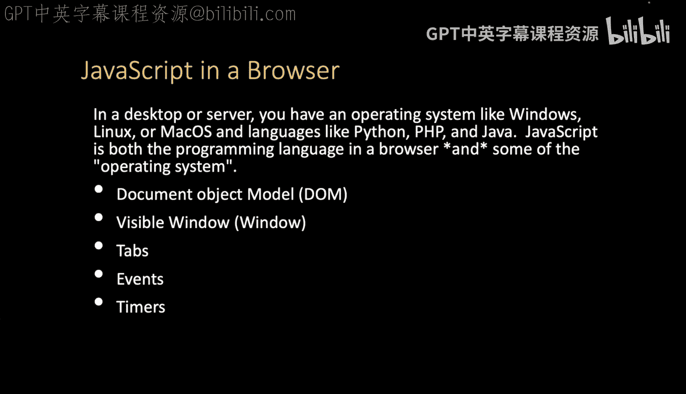

Then we do sort of in Python just running on your laptop。

So there's a couple of places that JavaScript can execute。

In line is the documents being parsse at this point， document parsing stops and then JavaScript runs。

 you can take over， you can throw away all the rest of the document if you want。

Or there's some kind of a UI event like a click or something else happening。

 a resize of a window or a timer can expire or some asynchronous activity like a retrieval of some data finishing and then activates your code Now the key thing we talked about this in JavaScript is that first class functions are essential to this execution model because we have to basically say when this happens。

 run this code and the code is data， and so to some degree we say set something up and I'm handing you some code to handle this event。

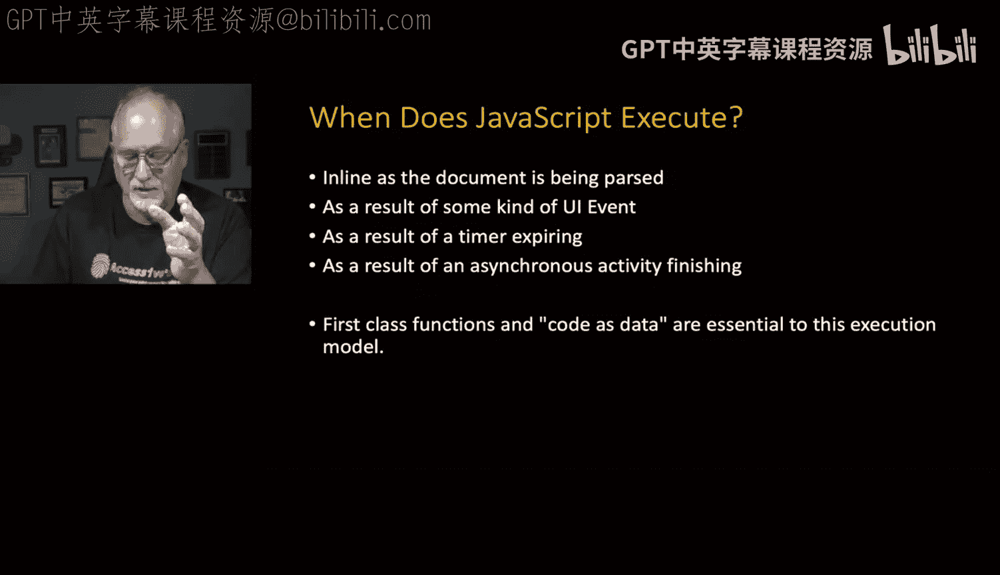

So let's take a look at this 01 Noscript。htM， this has no JavaScript and we've been talking about this all along where something comes from the server。

 here we have a header tag H1 tag and a P tag。

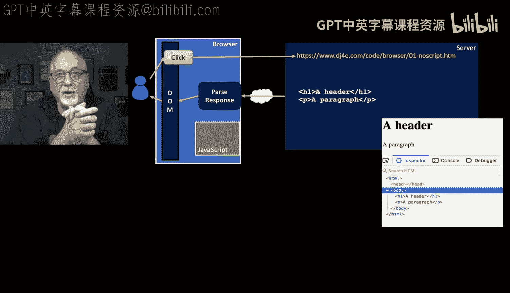

We parse the browser parses that response and then writes the document object model。

 and so when you do an inspect element， you're actually not seeing the exact text that came from the server。

 you are seeing the document object model that the browser created as it read that document and so this whole parse response and in this particular page there is no JavaScript。

 and so the JavaScript sort of is sitting there in your browser but it's not currently active。

Here is a completely different page， and this is the in sum total， it's a script tag， document。right。

Document do write in a script and a slash script， there is no HTML in this page。

 and that's because as the document is being parsed。

 it sees the script tag and then it runs JavaScript。

 the code document is a predefined object which is the document object model documentment right allows you in JavaScript to write HTML into the Dom。

So we write two lines， the exact same two lines that were in the previous example。

 and so when that's all said and done， we run the parse response， there's no HTML in this。

I've exaggerated this to make the point， of course。

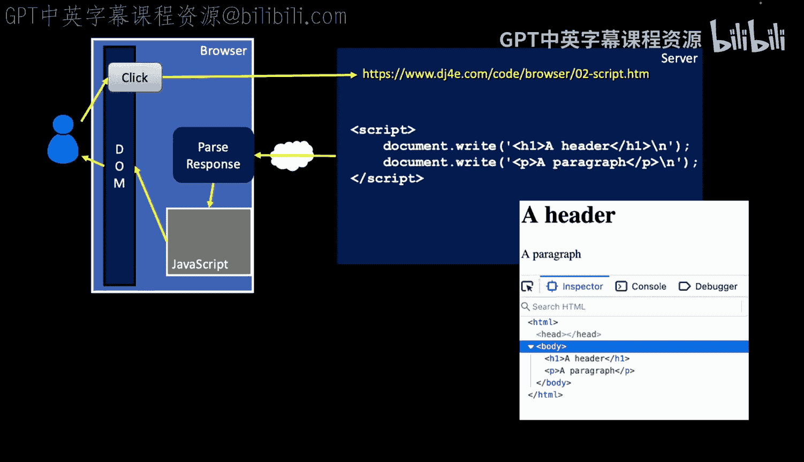

We parse the response。 we run the ja and the Javascript writes the document object model。

 The Dom belongs to JavaScript。 You when you're writing ja， you own the browser， you are in charge。

 So if you look at the inspector。The source code that came was the script。

 these four lines of script and document right document right and script，/lash script。

 but the document object model when it's all said and done is the same as in the previous example。

Now we've been doing this for a while， we've been like making certain tags like the anchor tag。

 have an onclick event， and then we call some JavaScript Now this is my funk open print close print semicom is some JavaScript except it's inside of a string which means it's being executed。

 it's actually being parsed。

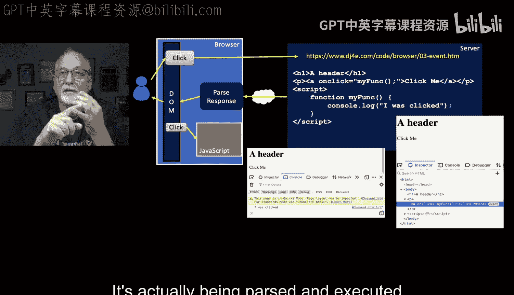

And executed at the moment that the click happens。And then in the script tag。

 we create a function called My funk and just put nice little console。 log I was clicked in there。

So the way this works is。The HTML comes JavaScriptscript doesn't actually run during the parsing except to create the function。

 There's no other thing。 It doesn't actually the log doesn't come out。

 but then later when the dom is shown， there is an event。

 you can see that there's an event associated with that anchor tag and that if you look at the document object model with In。

 you see， oh， this one has an event。 Well， it's kind of obvious this one has an event because the onclick is our way of indicating that there is an event。

Now。After the page shows up。Then you click on the word click me。😡，And then the JavaScript runs。

So the JavaScript is from a string， the string is， in a sense。

 compiled or parsed or whatever you want to say， and then the code runs。

And so the unclick event is handed a string。Of source code and again。

First class function we've been doing this all along and if you go back and think about something we used to use。

 we've been using onclick for things like the cancel key so that we can do things in there and we still it's just a way to indicate JavaScript。

You can call a function or you can just put the JavaScript right there。

 sometimes you'll see several lines of JavaScript in a onclick method Another way to run the code is as the result of a timer。

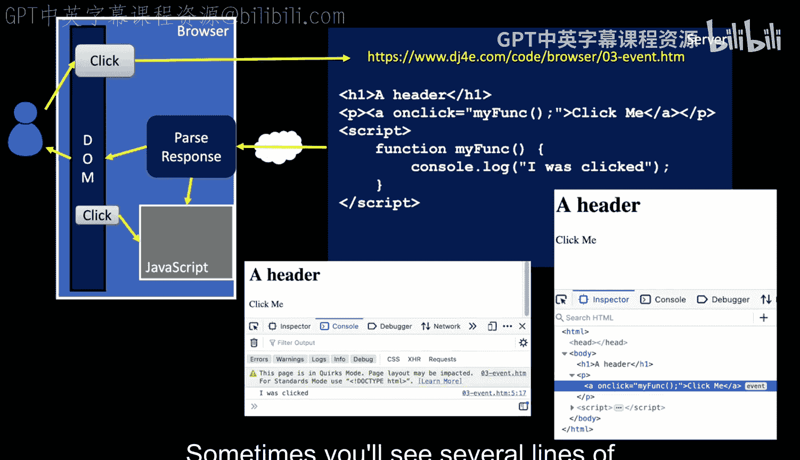

So here we have a page it's got an H1， it's got a P tag and it's got some script。

 and that's all part of the parsing of their spots， now the script basically runs。

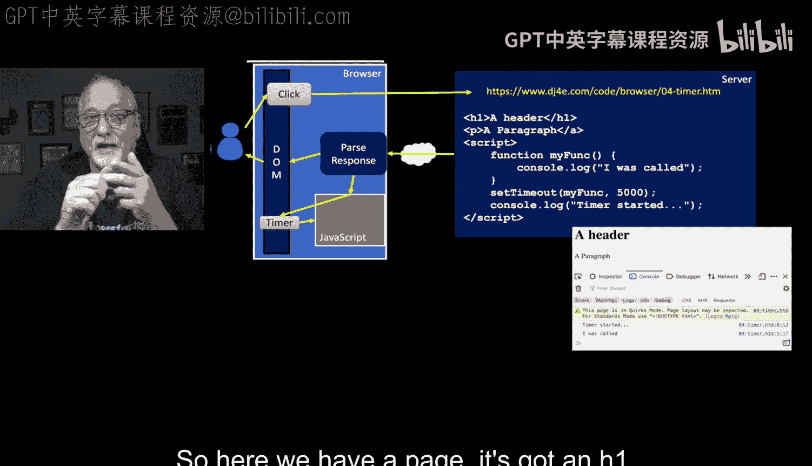

And。It says to find a function called MyFunk that says console log I was called when it's called later and then set timeout。

 MyFk 5000。 what that basically says set timeout runs immediately and returns immediately。

 it does not wait， It's not like input in Python。 It doesn't wait。

 It happens instantly you are registering a handler that's triggered5 seconds afterwards。

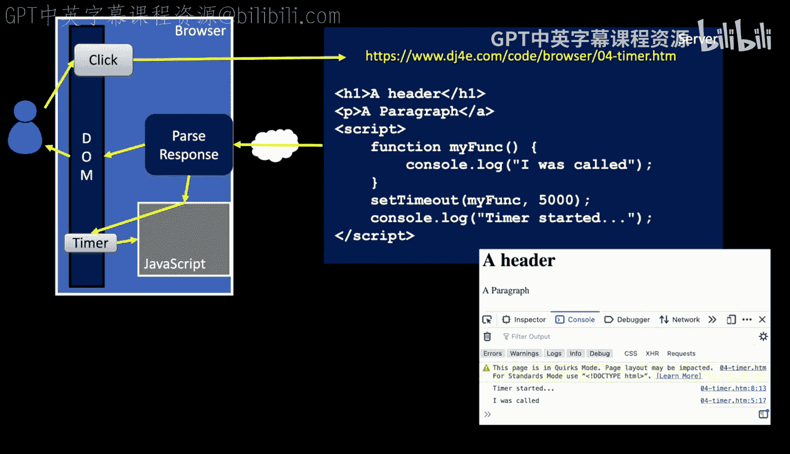

Then we say console log timer started， so if you look at the output you see that the first thing that happened was that the timer was started。

Now， if you ran this and you can 04timer do HtM， you run it and then you count5 seconds and then it says I was called。

 So this is code that you defined。 and you said I want this code to run after a delay。

 And that's one form of an event， a timer expiration event that causes your code to run。 Now。

 if you take a look at this first class functions are essential to this right and so I've changed this05 function do Htm changes this a little bit。

 Now， notice there is no parenthesesis。 Now if you put a parenthesy after my funk in the set timeout call it would actually then call my funk and the log would happen and then you get null back and the set timeout would actually fail My funk is itself with no parenthesesis is a function reference and we can see this by adding console log myfunction to it。

 so if you watch the console， you can see the variable my funk being printed out and what does it show。

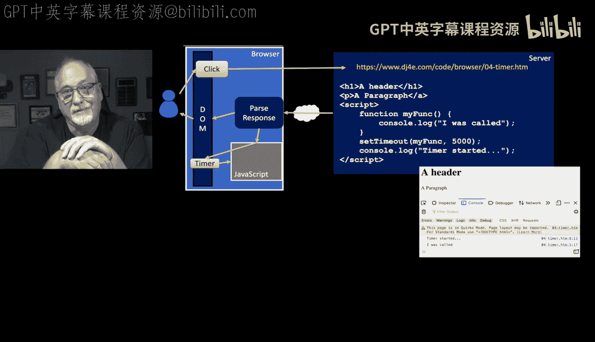

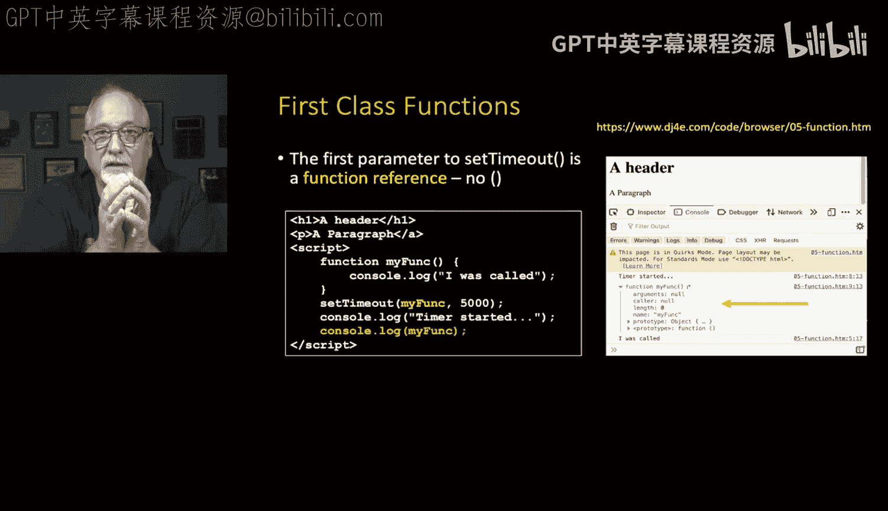

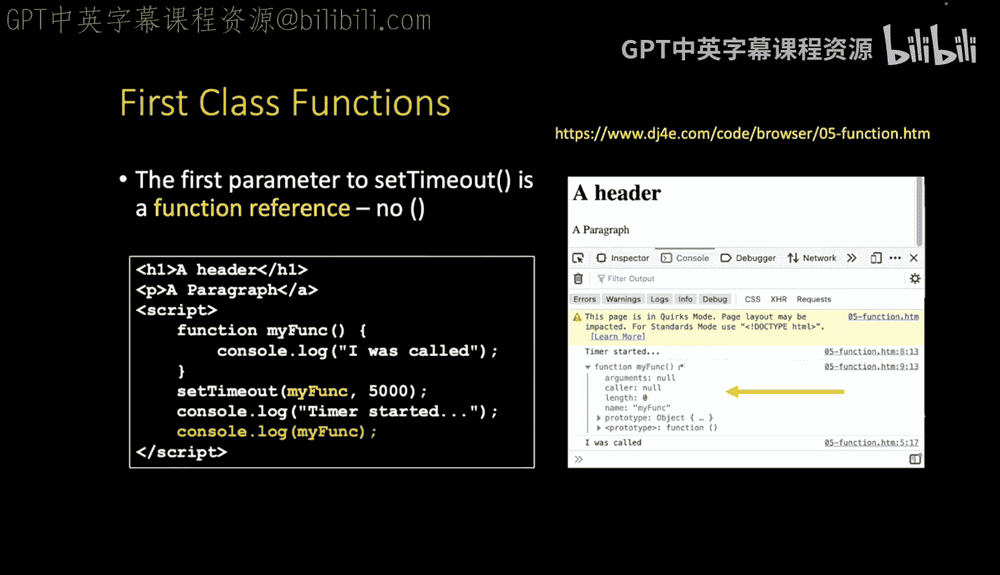

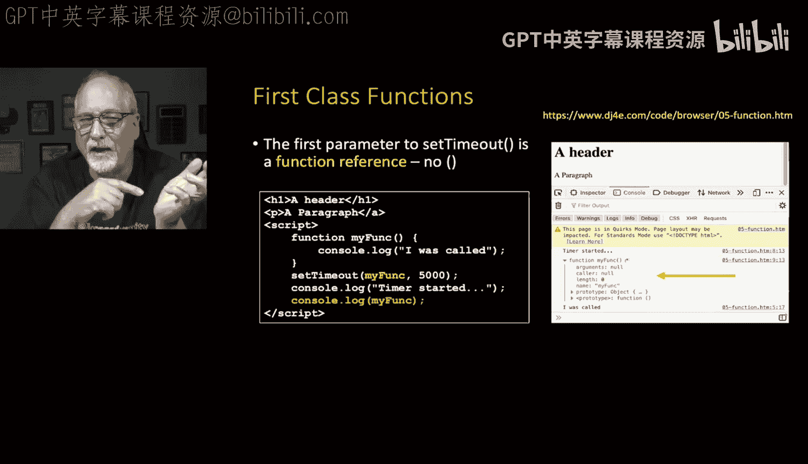

It shows a function like that's what's in my funk with no parenthe。

 my funk with app parenthetic calls my funk， but my funk without app parenthesy is the。

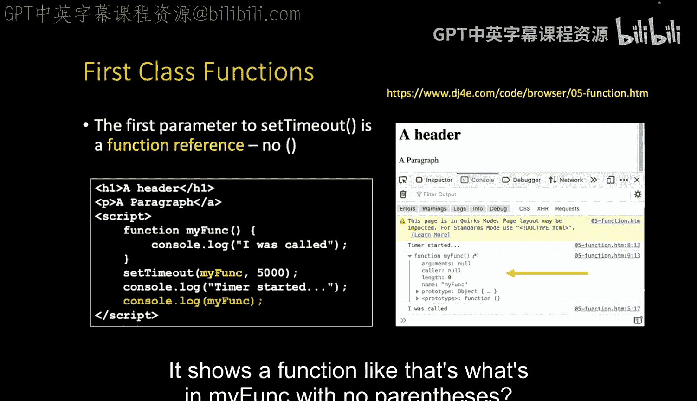

In this case， parsed source code of the MyFc function so first class functions are essential to all this eventing so up next we'll talk a little bit about the document object model。

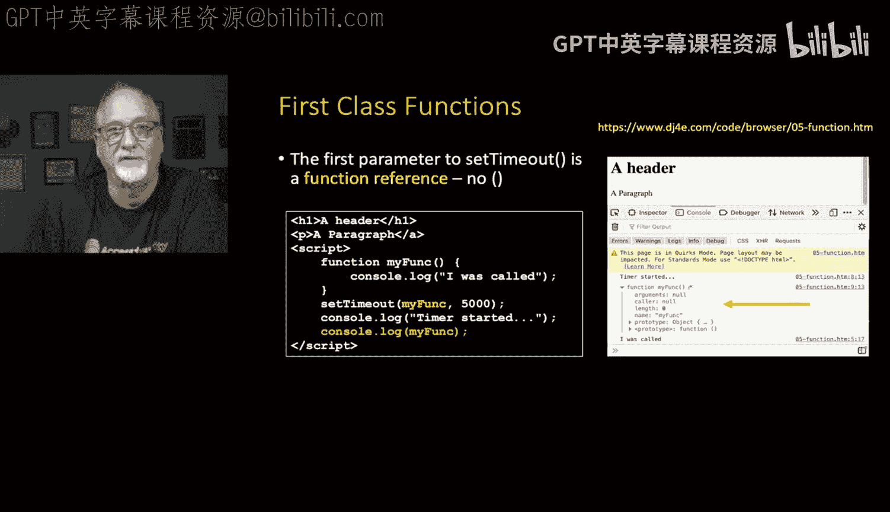