# 密歇根大学《给所有人的Django课程4⧸共4（部署Django应用）｜Django for Everybody》中英字幕 p26 26_05_04_修改文档对象模型(DOM)的JavaScript技术.zh_en -BV1rNibBuEwD_p26-

So now we're going to do more than just console。log so we can see what's going on in JavaScript。

 but we're actually going to do modifying the document object model in JavaScript。

So recall on the 01 Noscript。htm that I just used the debugger to modify the document object model。

 right？We modify the document object model and if it's visible through the window。

 then the what we changed is instantly changed， so literally we're running JavaScript on one end and the UI just changes。

 it's like it instantaneously although。If you make mistakes and you run code that runs too long。

 thus changes will be delayed because we have to finish the jascript code and let the browser do the reisplay。

 But we can change these by hand， but let's just do this instead with a trigger。 and to trigger it。

 We have to be able to grab bits of the Dom or query the document object model。

 Let's recall03 event do Hm。 and all we're showing here is that we can define a function in jascript that we can have an uncl method that calls my function after the click happens again。

 remember that those quotes are important。 oncl。

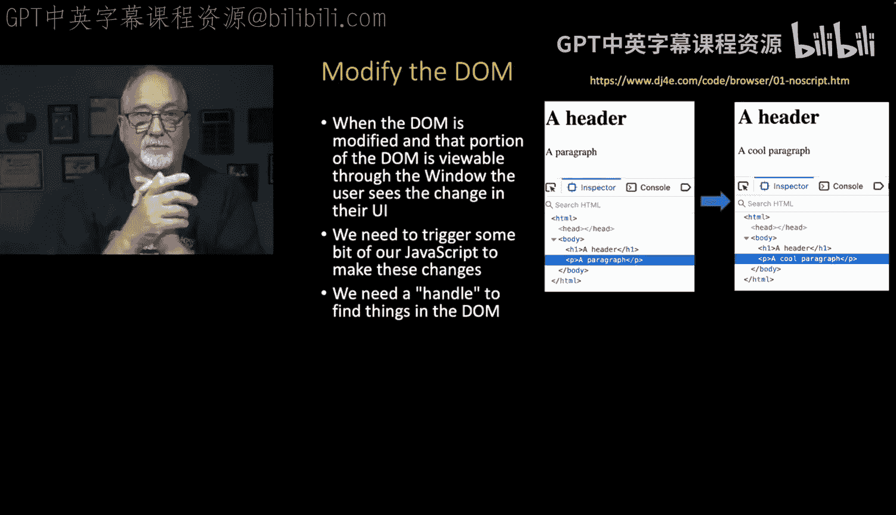

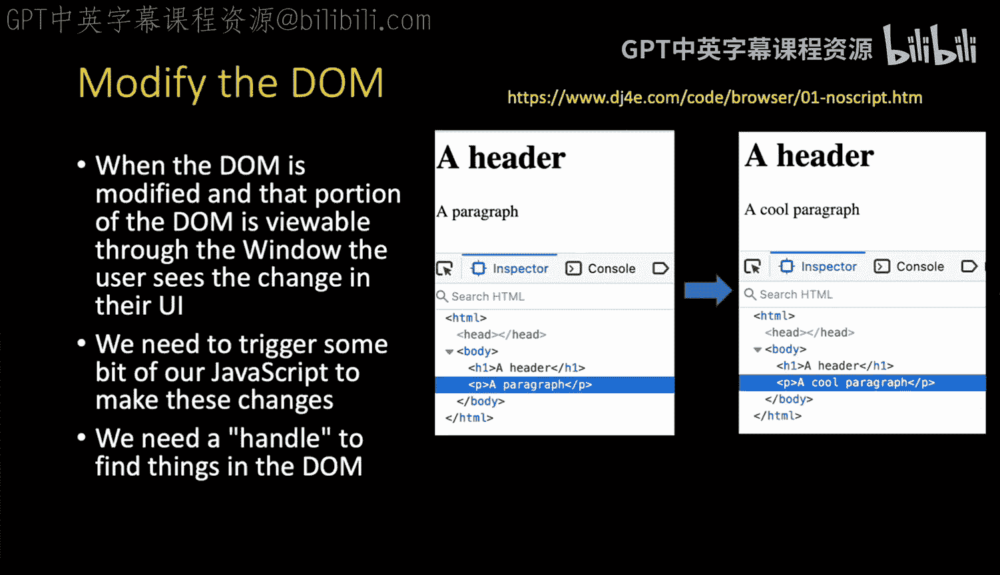

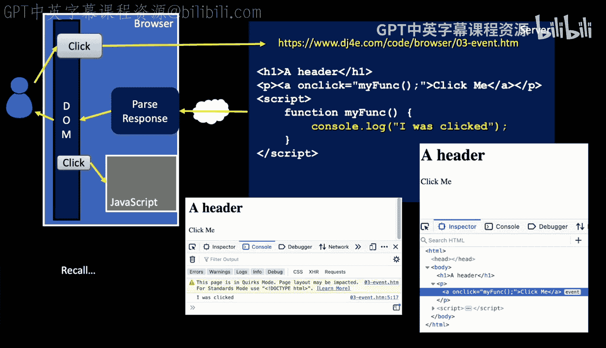

Attribute is a string， which is only parsed at the moment that you click it and then funked is called in that moment。

 So let's do something a little more interesting in that unclick method。

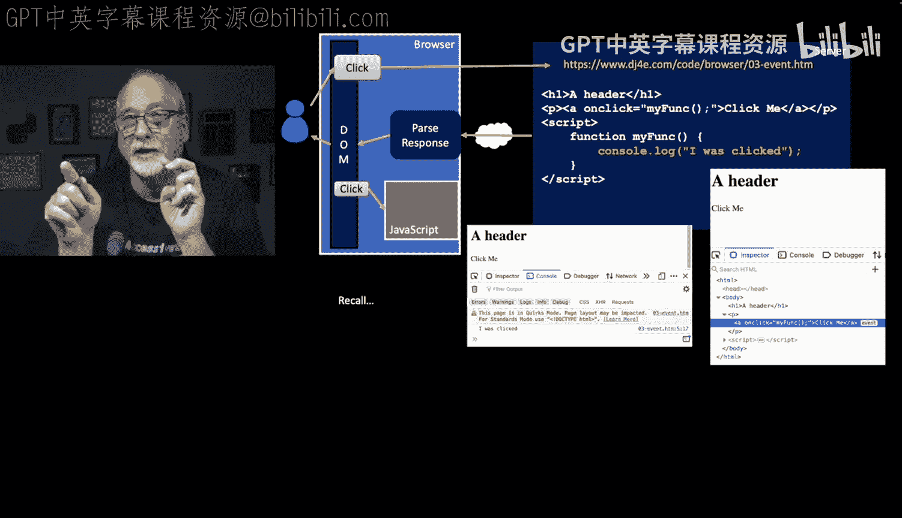

So the top part is still an ID tag， an H1， except now we put ID equals fun and you can choose anything you want for the ID it's got to be unique across the whole document。

 remember CSS， and then it has a bunch of attributes and methods。

 elements have attributes and methods and one of them is inner HTML。

And I simply assign the inner HTML。

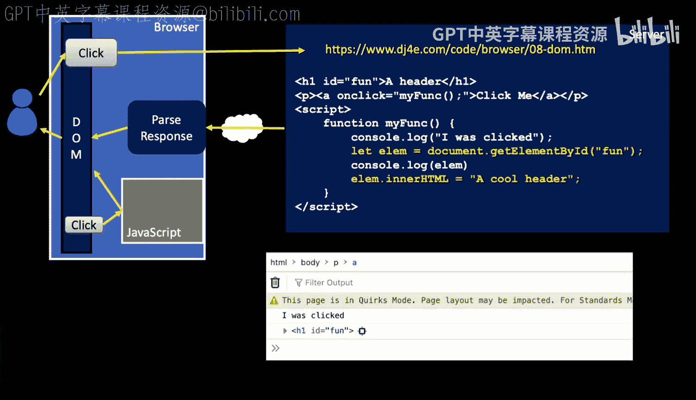

To a cool header。 And that's how you basically see that change。 We're changing the element。 Now。

 an important part of this is the function ends。So it goes back into the browser and the browser sees the change the document object model and then displays it if we did something crazy in the last line of my function that did not give the thread back to the browser it might get messed up but we're gonna just return we're going make our change the document object model this code here console log let LM equals console log LM or HTMLt that's really quick just in a blink of an eye that code runs。

 meaning there's nothing slow in it everything happens fast。

 there's nothing to wait for so everything happens fast we get the browser back to redisplay things and so you can see when you click on it。

 you can see that it says I was clicked it goes and looks the L up and it says。

 oh I just found an H1 tag and then I said it's inter HTMLt to be a cool header I could I could have appended something because I could have read it enter HTML if I felt like it。

 but then as soon as that function leaves， then it finishes then the browser takes over and then redisplays the update。

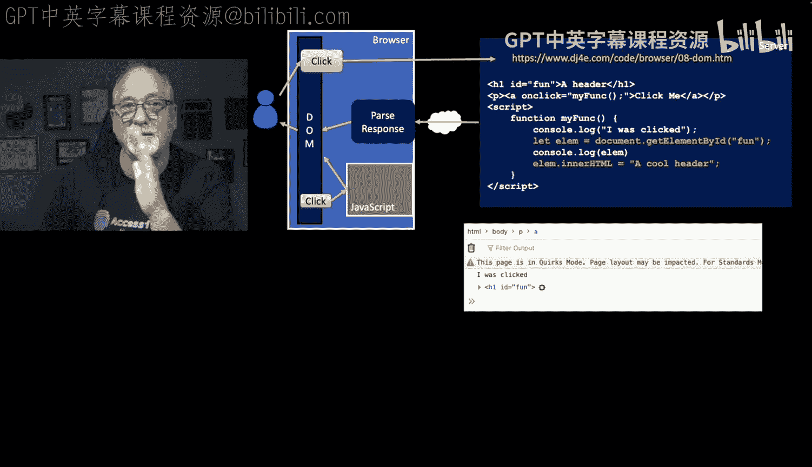

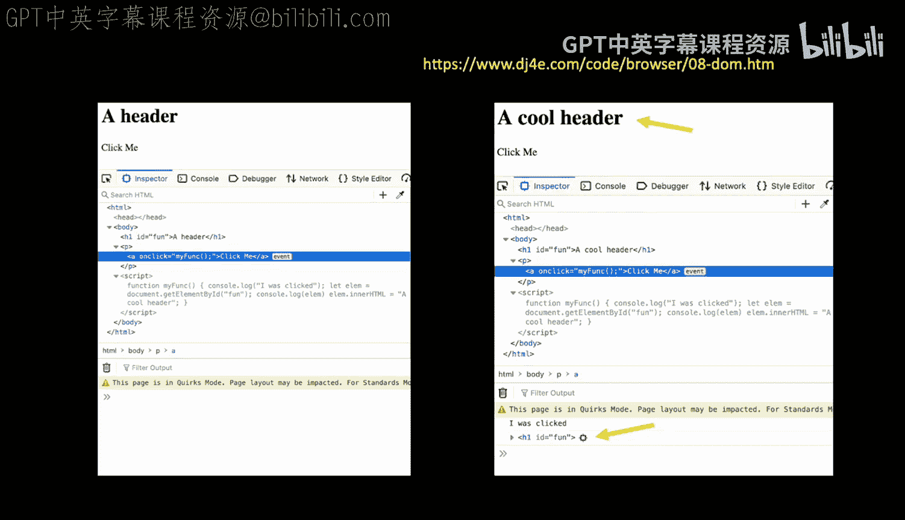

Dumb and again， everything that we did happens so rapidly。That you don't even notice it。

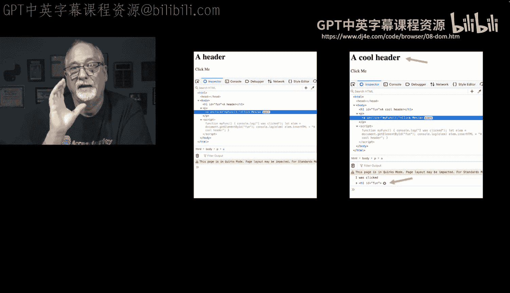

So now let's add some stuff to the dom。 We can completely build a tag， and we can add it to the Dom。

 Everything we've done so far as find a tag mess with it and then put it back。

 So let's add something to the dom。 This is a little bit of a more intricate。

But we are going and is zero， this is a source code 09-append。htm if you want to go play with it。

So we're going to have a little button， an anchor tag。

 and we're going to have an a called the add function。

And then what you'll notice is we have a UL tag and I've got an ID of Zap on the UL tag。

 and then the first item is a LI listist item tag and then slash UL。And then in the JavaScript。

 I create a global variable called counter equals1。And then I create a function called add。

 and in that function I go create a new create element documentment。

create element saysMake me a new element。 I want an element of a tag， an L tag。

And then I can set things， I can set its class name， I can set it inter HTML。

 I'm concatenating the word v counter is， and then I'm concatenating the number and。

Then I'm going to go document get Element ID Zap， now that is the UL tag。A pen child。

 So the AllI tag is a child of the UL tag and by saying a pen child。

 I say I want to make a new child of this UL tag。 and so that that's when you click it and then counter goes up by one and it's a global variable So kind of every time we call add that counter goes up。

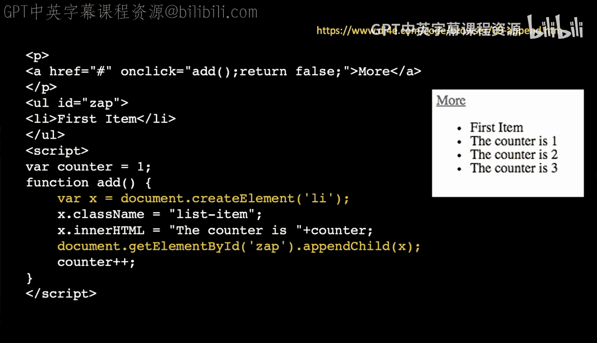

So first item， you click it， it says the Con is  one， you click it again， it adds counterors 2。

 click it again， adds counter story， you can do it as many times as you like。

 but the idea of making a new tag that's not connected to the document we make an liI tag we set some stuff in it and then we plug it into the document with a penchild if you look at the it starts out with first item and you'll notice of course that the more button has an event associated with it。

 we created that event with the on click。

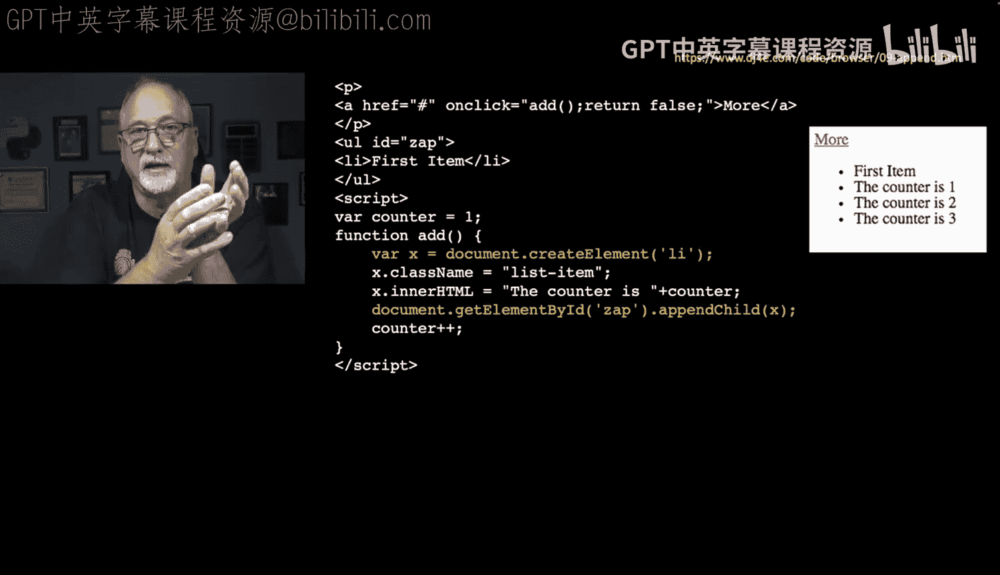

And then after we click it a couple times， boom boom boom， it just adds those things。

 so we can manipulate many things in the document object model from JavaScript。

 including changing the CSS， which means we can alter the look of things。

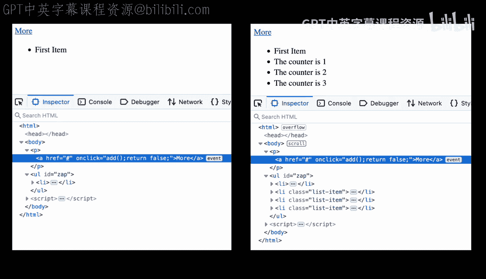

And so in this， we've got a header tag with an idea of fun， again。

 the idea a way for us to grab it in JavaScript， okay？

And then we're going to have a button with an idea of poof and a button ID of show that has the text hide and show。

And we're going to do this using add event listener， there are shorter we could use the onclick。

 but I just want to kind of get used to the notion that one of the things you do toward the end of your document is you add all the event listeners so you have all the HTML that gets displayed and then after that you add event listeners and so in this script we do document get elementement ID show and then we're going to add an event listener。

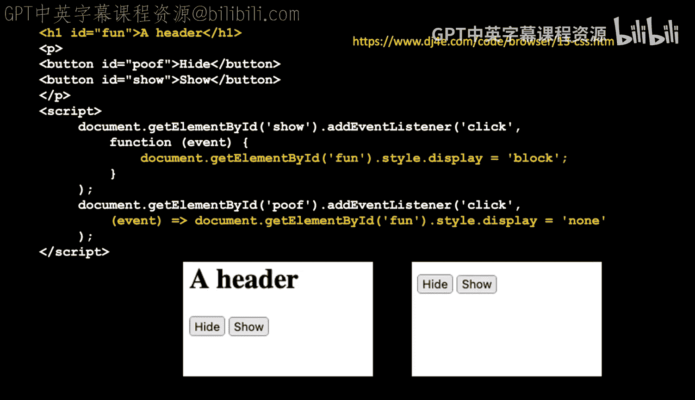

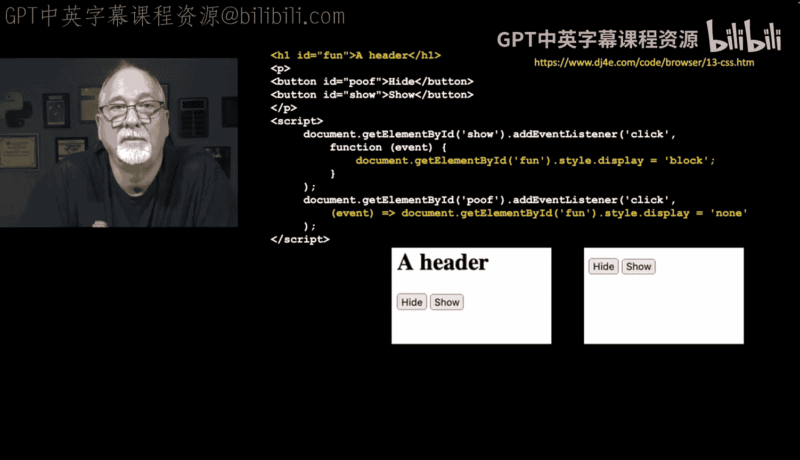

And we're looking for the click event， and it says open print， quote click， quote comma。

 and then what I have is literally code。And again， first class functions。

 the function keyword returns code so that we are doing the second parameter to add event listener。

So we are creating a function， but you'll notice the function currently has no parameters。

 and it has no name， Open curly brace， It's an anonymous function， and it only has one line of code。

 document， get element ID fun， dot style。 That's how we get our hands on the CSS display is a CSS value and we're going to set it to the string block。

 So that is our show and we'll see that when we do the poof the addd event listener。

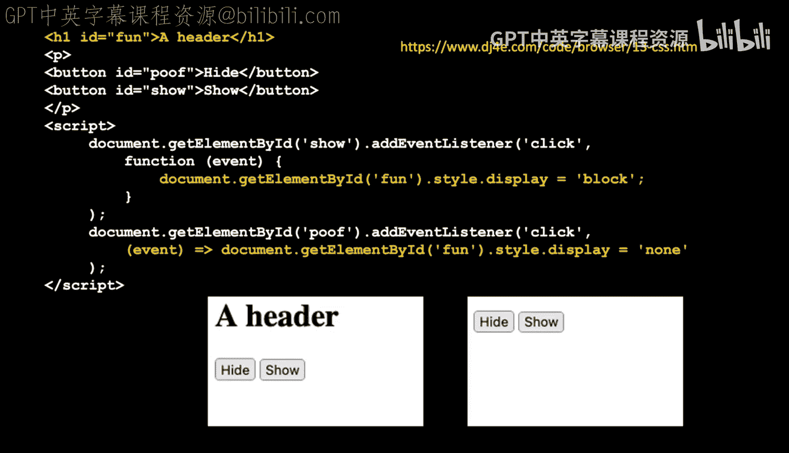

On the hide button， we're going to have an an event listener for clicking。And in this one。

 we're going to set the display none， which means it's going to hide， so you click on hideide。

But you'll see a slightly different syntax and you'll see this syntax a lot because that。Early ja。

 there was only one syntax for this。 and now there's sort of more clever syntaxes in later versions of JavaScript。

 And the key thing to remember is that this second example。

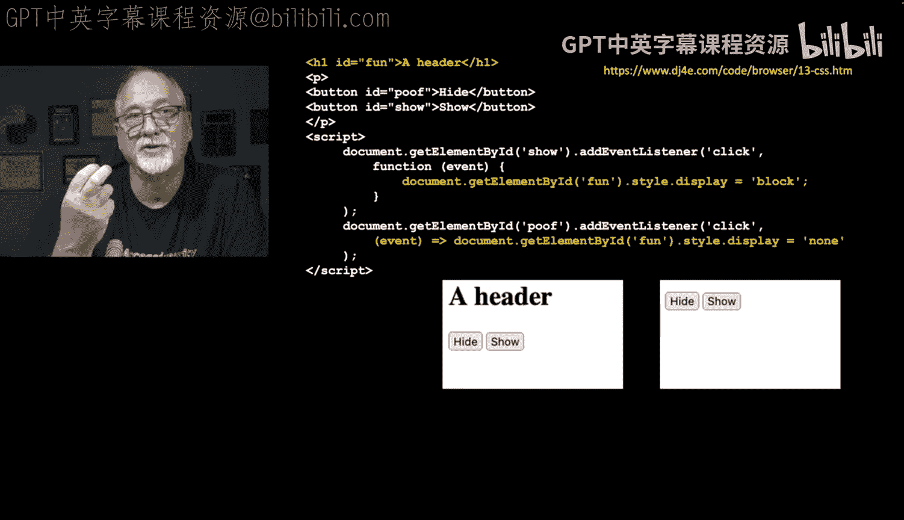

For the poof。Open trend element。Equals greater than which is kind of like a right arrow equals document getl and ID fun This is a shortcut to define a function。

 define a function with no name and so for all intents and purposes。

 these two bits of code are equivalent， we're saying when there is a click on the poof，Item。

We're going to。Call this function that has no name， but it takes as one parameter the event。

 the event is a parameter to all these little events。

tThat the browser sets up when it calls us and then we're not going to use it actually we just say document get O IDDf style。

 displayplay equals done， which makes it vanish， okay？

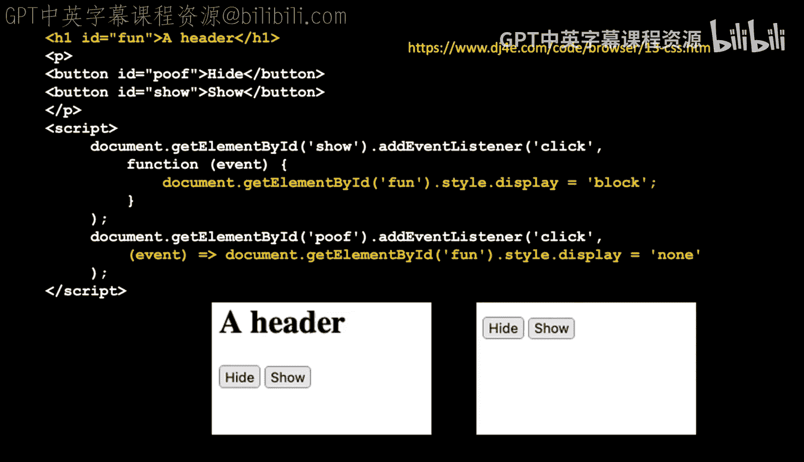

So if you run this， 13-css。hcm， you click on hide， the header goes away， you click on show。

 it comes back， you click on hide， it goes away。

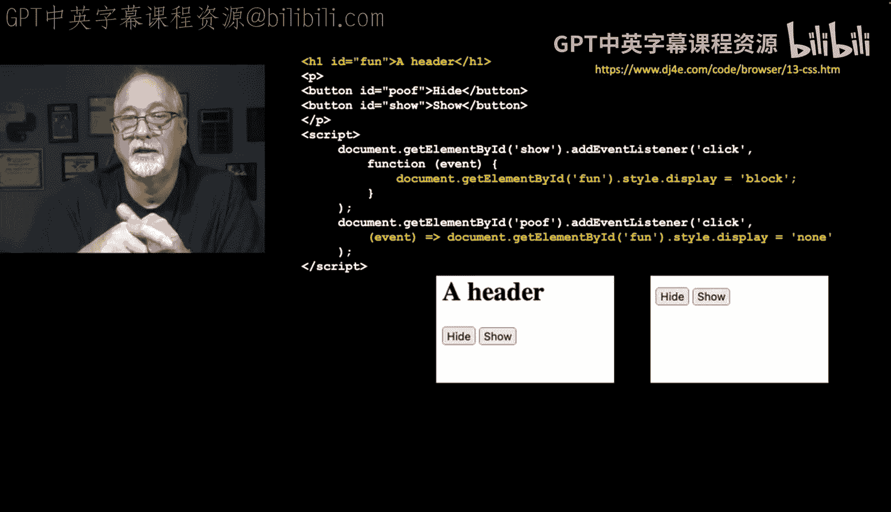

And so this is just an example of how you can modify CSS。

