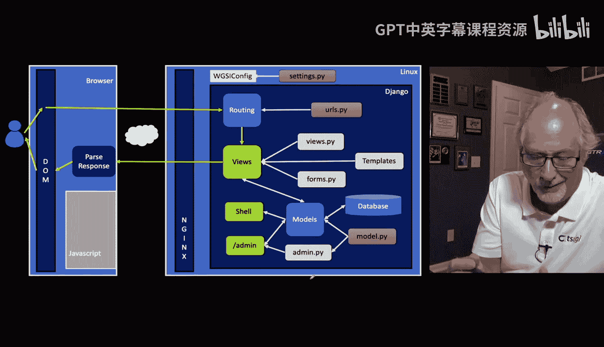
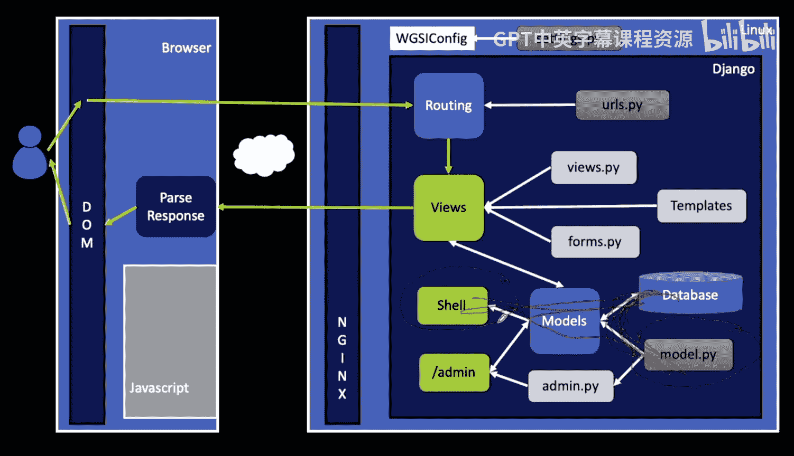
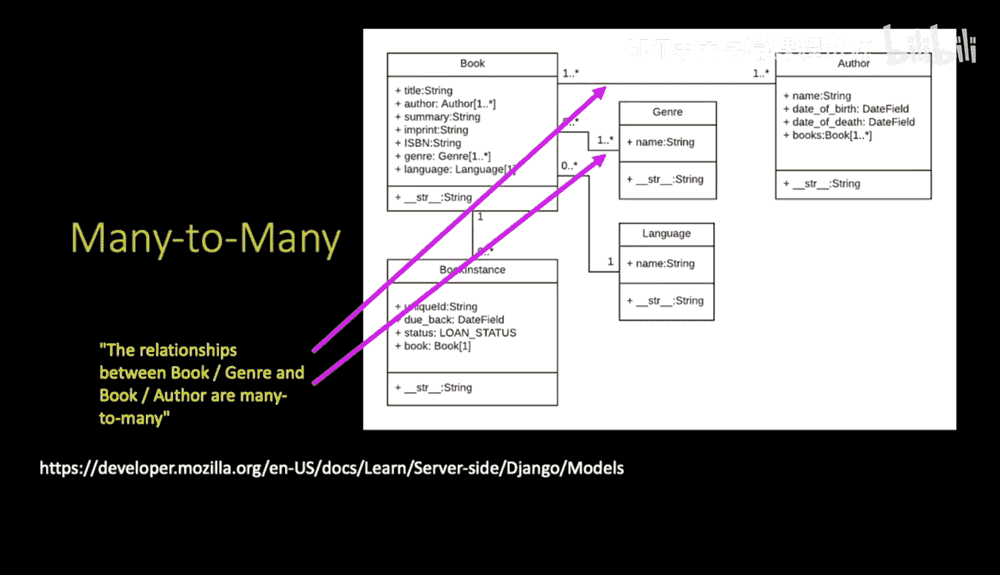
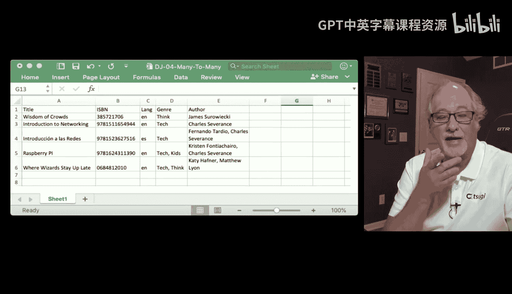
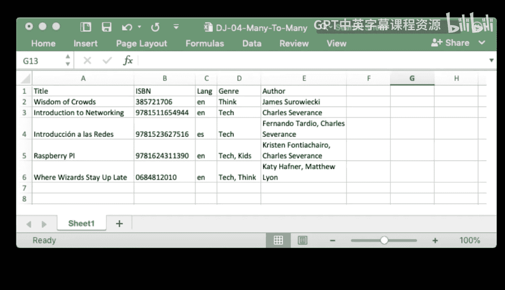
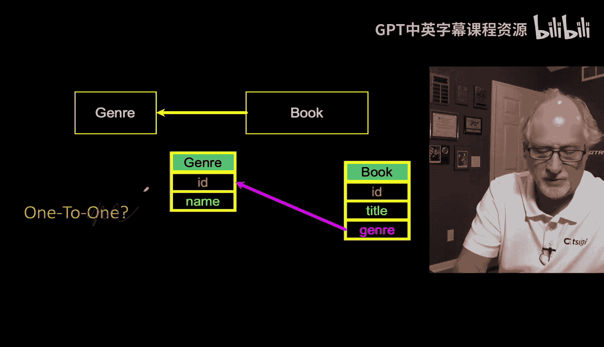
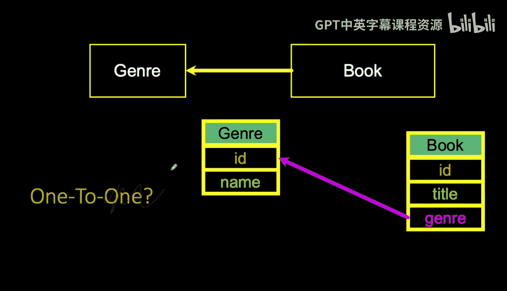
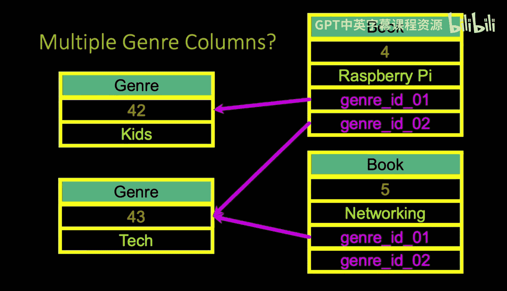
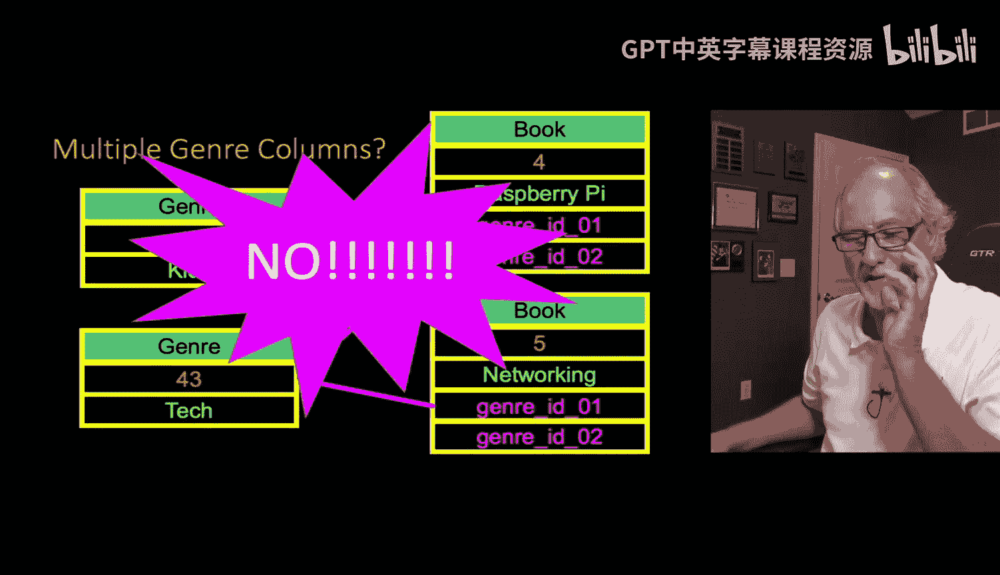

# 密歇根大学《给所有人的Django课程4⧸共4（部署Django应用）｜Django for Everybody》中英字幕 p31 31_06_02_多对多关系概述.zh_en -BV1rNibBuEwD_p31-

So now we're in the second half of our data modeling exploration。

 we've talked about one to many and now we're going to talk about many to many。 just to remember。

 we are in the bowels of a Django application， and we're really very much talking about the model dot Py file and how we mess with that。

 we're talking a little bit about the shell and how we can sort of look at the model dot py and store stuff in the database how we can like migrate and make migrations and update the database and then read and write data from the database through the models。

 And so this we're sort of narrowing in eventually we're going to see all the rest of the Django application。

 the views， the forms， the templates and done a little bit with routing and a little bit with admin。

 but just remember that we're going to look at each of these pieces in turn。

 and eventually make some sense out of them。

So。In this data model， which I think is a really cool data model because it shows a two one to many relationships and too many to many relationships。

 one very simple and one a little bit more complex。

 both the genre and the author are example of one to many and just sort of foreshadowing。

 see the one dot dot asterisk there on both ends of the links， well that basically says one or more。

Up to an infinite。 The other one's 0 dot dot。 the lines kind of covering it0 or more and one or more。

 So the one to many has one on one side。 sometimes it has0 on or or one。

 but one on one side and then0 dot dot star or one dot dot star。

 So many to many is a different kind of creature。So remember how in the last modeling exercise。

 I kind of， you'll notice I showed you genre and author and then I kind of stopped talking about it him。

 I only talked about language and book instance。

So in this one， we're going to talk about genre and author and that's because genre and author are kind of problematic because really。

Each book can have multiple authors and each book can be multiple genres。

 and so in that previous lecture I kept these really simple and you see this int here where I'm just kind of making a spreadsheet or another way to be thinking about it'd be a single single wide table with all my data in one table but I'm starting to put commas in。

 And so when you have commas in a user interface， you think of this as perhaps a multiselect where you have a list of things and you can highlight more than one of those things。

 And so anytime you sort of see this pattern， it's another form of replication。 and that is that。

The Raspberry pie book can be of the tech genre and the kids genre and the wizard stay Up late book can be of the tech genre and the thinking genre。

 right， Some books have one genre， some books have two genres， some books have one author。

 some have two， but then the problem is。They might have 10 authors or 20 authors and so how do we represent these things and if you're sort of looking at either a UI or sort of a UI or just kind of a flat data table。

 you start seeing these commas and as soon as you've see in the comm as you think yourself。

 that is an indicator that this might be a many to many relationship， so if this were a one to many。

 not one to one。This was a one to many。

This was a one to many relationships sort of like what we did with languages。

 we would have a book and that would have a genre， foreign key in it that would point to a row in a genre table and that would make some sense。

 right but。That doesn't make sense because we have to have genres more than one。

 and you could basically decide for your application developers that you cant have more than one genre。

 but the application developers would say， sorry， we're librarians and we know that there's more than one genre so you。

 the programmer， have got to come up with a data model that represents that。

And so if this was a one to many， you could have like a genre ID and each book would be able to pick a row out of the genre。

 and so they would sort of mark themselves now。This is another moment where it's a warning sign and you're like。

 well， maybe we would just have two foreign keys and we just how about books are only allowed to have two genres。

 you know。

Maybe one's not enough， but two's enough。 Oh man， let's make it three。

 And so and people who are doing data modeling earlier， early in their career， they'll be like， yeah。

 I'll just make a genre I01 genre I02。 And then later like genre I03。 and the away you go。

 And this is。Completely wrong。Because genres， of course， is a weird example。 But if it's authors。

 there are plenty of books with 8 or 9，10，11 authors， right， And so this。

 when you see yourself thinking this in your head that like， oh。

 I'll just add like an array of things here。 No， and it has to do with it。

It violates the basic notion of relations and connections and how you model stuff to the extent that you can with connections。

And so that leads us to what's called the many to Many。

