# 密歇根大学《给所有人的Django课程4⧸共4（部署Django应用）｜Django for Everybody》中英字幕 p37 37_07_03_DJ4e JSON Fetch-fetch示例代码详解.zh_en -BV1rNibBuEwD_p37-

Another video walkthrough for Django for everybody in this particular sample。

 we are going to do Json and fetch So here we are the first thing to observe。

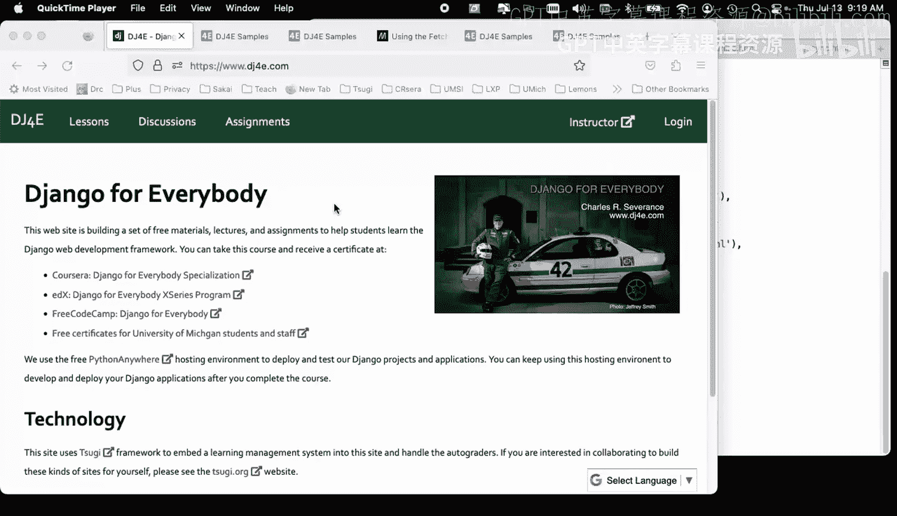

Is that JON is really just。The syntax。 So's let's view source here。

And then we're also going to view the console in this one。Let's turn a console on。And then。up a bit。

 come on， move up a bit。So here's the source code。This is just jascript。

 There's no Json coming from the server。 It's just jascript。 And I'm doing an assignment statement。

 This is the syntax for a jascript object constant open curly brace。 And then a series of string。

 key value， key value， key value， and the values can be strings。 They can be numbers。 they can be。嗯。

Boos， they can be arrays and they object， you can even have an object within the object， right？

And so all we're doing here is creating a variable called who in JavaScript and then console logging it。

And son of a gun， if that object， is， this is a parsed object， right， That is the jascript。

 I could have made a syntax error in here。 and then JavaScriptscript would say syntax error。

 But if that syntax is correct， that is just the syntax for a jascript object constant。

And so the brilliance of JO was。Let's send that exact syntax back and forth across the network。

That was the brilliance of it。 Okay so let's actually do that in the simplest possible way。

 So it means that we can build views inside the browser。

Let me load this in the browser and let me turn on the console。

 let me just turn on a console so you can see what's going on here。

Let's start with web developer tools。 Oh yeah， Favcon， fbicon， whatever。

 Let's go ahead and do that network here。So one of the things going on。

 let's take a look at this a you here， this is the JSON Fun view。

And so this Json fun view that we're hitting。 It does a time sleep， which is actually quite foolish。

 But I do that so you can kind of see when things start and then when things finish。

 And so we have sitting here。 This is Python now， And the ironic thing is this the syntax for a Python dictionary is the same as the syntax。

For a jascript object， I， I'd love to know like how explicitly that was。 Both syntaxes， I mean。

 it's a sensible syntax。 If I was inventing a language， I might use this exact same syntax。

 And so it's beautiful that jascript object syntax in。

Python constants for dictionaries are pretty much the same thing。

 and so we simply serialize these things， send them out and decsialize them。

So what's going on in this JSON fund is we're sending back a JSON response in the normal situation。

In this home view， home view， of course， is this view right here。

 we are sending back this render request is sending back an HTTP response。 I'm not I import it。

 but I don't use it。 The return value from render。Which takes the request object fetch an optional context that is an HTP response。

 and so it knows that its HTML。 and so if we just if we do a view source on this one。

 not not view source， let's do this browserrow tools， web developer tools。

 let's go to the network tab， let's hit refresh on this one。

And if we take a look at the Re response cycle， the response headers are like text HTML。

And that's because this view， the home view is returning an HttP response and in that。

Jengo is setting all these things like content length and content type。

Now we're going to send back a Json response。 So we're telling， we're telling。

Jengo that we want to send back Json， and here's our dictionary in Python。

 so please serialize that as。JSO， send it back and set the headers correctly so if we look at this one and go to the network tab and we hit refresh。

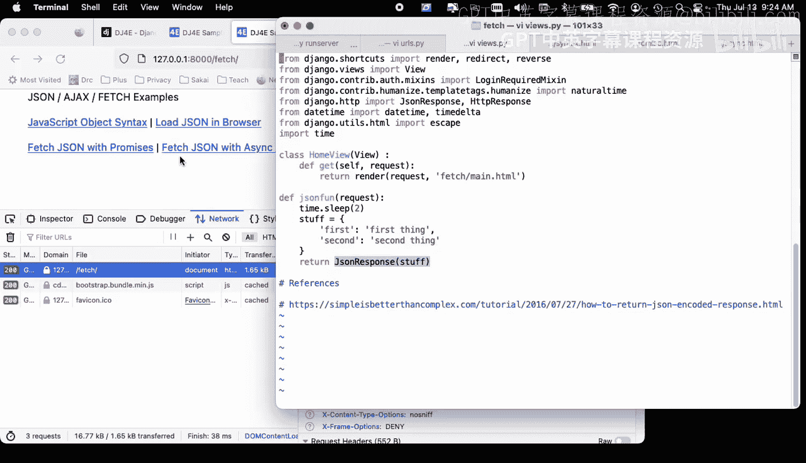

We see that there is a get request。And the response headers now are quite different application JSO。

 it's got a content length， et cea， et cetera。 And if we look at the response。Now。

 my browser is doing like clever stuff， making it pretty。 but let's just look at the raw thing。

 This is the serialized。Key value store， this is literally the text that came back from the browser。

Our browsers are trying to help us out， they're parsing it and turning it into a JavaScript object and showing it to us right and so raw and this in up here you can see says raw as well。

 you can go back and forth and see what's actually sent so this string is created by JSON response when passed that now that's serialization。

 decsialization。And I guess I call attention to it。

 but you can almost ignore it because it works so amazingly， smoothly。Okay。

 and so that is sort of the basic mechanisms of retrieving and producing we produce the JSO inside our。

Python code inside our view and then we send it back to the browser and in this case。

 we're doing just mirrorre plain old JSON fun。We're doing a get request。In the browser。Okay。

 but that's not typically how it's done I would do this to debug stuff right we go to these JSsonN URLs to see if they're blowing up because if the JSsonN URL blows up。

 let me see if I can make it blow up， let's let's see if I can make it blow up， I don't know。

Let me take this comment out。I'll take this comm out， so that means I'm going to have a syntax error。

How my server was so bad， my server won't write。I can't make a mistake if I try。

Let's see if my server starts， okay， at least my server restarted on that one。

 so now maybe I'll get a 500 error or something oops。Okay， so here's a key。

 So what you're going to find is that when this fetch happens， you're going to get a 500 error。

 and this is the output of it like it goes bad。 Now。

 the problem is is you're going to have trouble later when we're doing JO using fetchch。

 when things go wrong， you need to be able to find this response。 it won't show up in your browser。

 It shows up in your debugger right。And so the point is is these are harder debug。

 but sometimes you go to the URL explicitly and at least you see its output。

 and this is output put where I made a mistake。

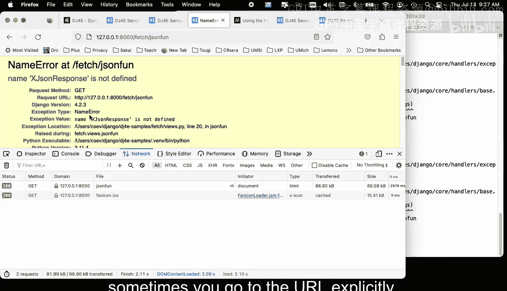

And okay， so let's just fix it all make sure it's working so the rest of it work， is it working， Yes。

 it's working okay。So you got that so there's a special kind of view and a special kind of response type。

 a JSO response， and we pass it a key value store， which in Python is a dictionary。Okay。

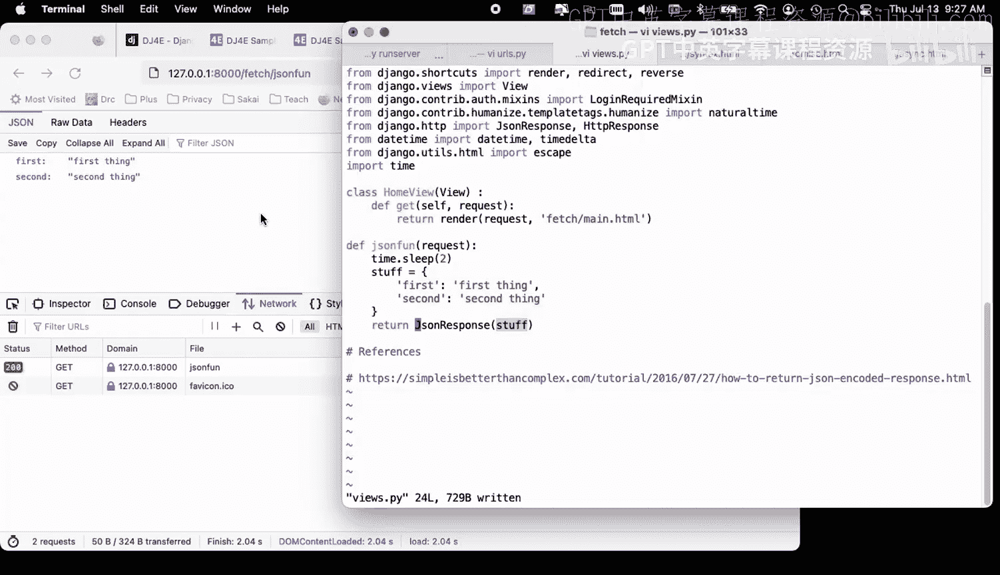

Enough of going directly。 Now we're going to use the fetch API because that's really what we want to do。

 We want to fetch this data and then we want to do something with it。

 perhaps show it in the user interface。 So I have a couple of different bits of code here。

 there's two ways to do this。 If you look at fetch， there's promise syntax and there is async await。

 and。You can have a good time if you go to your search engine and type。

 which is better promises or async await， and the answer is you have a lot of reading to do because there's a lot of opinions as to whether promise syntax or async await。

 so let's take a quick look at this code。My opinion is this is the Pro syntax。

Where you start an asynchronous action and it returns a promise。

 and then you wait for when the promise resolves， you run some code。

 and that code itself might return another promise。 And then when that second promise resolves。

 it runs some more code。And and then we have like a dot catch to say if something goes wrong in any of these three things。

 the starting the first the first asynchronous step， the second asynchronous step。

 catch it and then give us an error。And so a lot of people tend to use this syntax here because it's succinct。

The async code， I think is way more powerful， feels more powerful to me。

 because what you do is you do the fetch and you get back a value。Now。

 that doesn't mean that just means the fetch has started。

 but you can check for the error on that fetch with a catch there and do something there and like。

 quit and stop and not do the rest of it。 Again， it's doing effectively a simple thing here。

 So you notice here， I can console log it。 That doesn't mean the fetch is finished。

 But now what I can do is I can use in a weight to say， wait a second。 F this。 I'm on just wait。 Now。

 this is。This is making it I mean， I've said before that you're in a threaded environment。

 you can't wait inside of jascript code。 This is not really waiting。

 what this is doing when you see the await， it's almost like the code has been broken into two halves。

 it runs this half。 And then when you say await， it holds on to this half。

 grabs the rest of the code and makes that be an event to be run。

 And so this await syntax does all that splitting of code。

 creating the event indicating that the last half of this code is supposed to be run as a result of the event。

 So it it basically a way to kind of split this code in half and then when the event finishes。

 it's going to pick up here。 But we get to pretend it's procedural。

 we get to pretend we're in Python and we get to pretend that we are doing an input and waiting for the user to type whatever orura you are or a request dot retrieve or whatever。

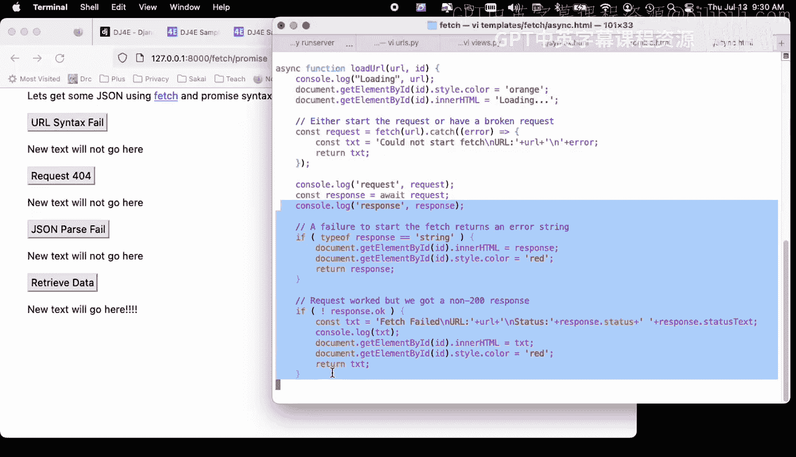

And the key thing this await says， I understand that what I'm about to do is。

I've got an effective promise， and it's started， but not finished。

 but I want to stop my current line of execution until it finishes。 Okay。

 so there are two ways to do it。 You can do promises。

 You just look at this and you see that the the a weight is a much longer bit of code。

 partly because。I put a lot more air checking into it and I got a lot of console logs， etc。

 And if you're doing something like react or a view or some kind of progressive web application。

 you want the kind of control I think that a weight does but in a normal thing it's like do this thing it works1 99。

99% of the time oh yeah and there's a message all you're in do is put up an alert box so。Again。

 you can really argue both ways whether the promise pattern or the async await pattern works better。

Lets let's just look through this code right now， how come my developer console is not here。

 developer console。Let's go into the。Console。Here we go， console。

And so what we're doing here is I am so this is just doing load URL and it's doing a bunch of errors and when things fail。

 it sends messages， okay？And so there are。So I'm calling this first with a completely broken URL that is not HTTP。

 which means the fetch blows up before it starts the request。OkayNow s broken is a valid URL。

 so that means that the fetch is going to start。But we're going to get a 404。 And so if I put in。

AndLet me just make a new tab here， so if I go to Bro。

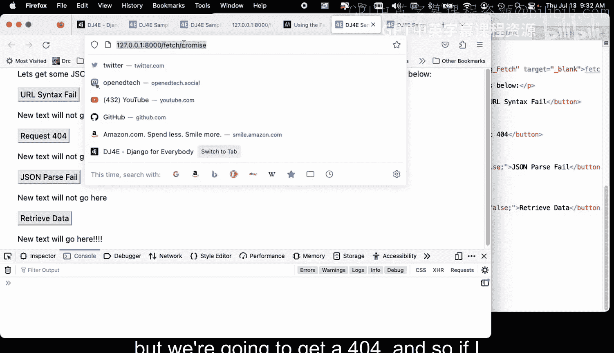

You get a 404 okay， and so when we're doing a broken。

 I'm going to get back a 404 and the question is， how does my error checking handle a 404？Now。

 if I go to fetch Main， which is this page。

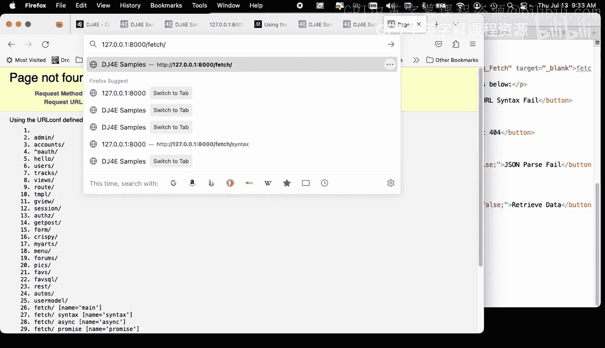

I'm going to get a 200， except I'm not getting JON and so then I'm going to get JO parse failure。

 so I'm trying to simulate all the kinds of errors that could happen。Bad URL， a 404。

 a 200 with the wrong kind of data。 And then finally， we're going to get the good stuff。

 And the good stuff is going to say， you know， it's going to actually change the thing。

 So let's you see， I'm trying to show all the possible error checking that can happen。

 So let's go ahead and without further ado。Let's。Try to fetch a ur with bad syntax。 right。

 So I get this type error。 And so that means that the catch。Right the catch happened。

The error happened up here in fetch。 the catch happened there。 Now， I'm going to get to a 404。

Now this is kind of weird because the 404， I did get a response。I did get a response。

And then it was a 404 response， but it also had some data。

 and then I tried to parse the data as JSON， and then this blew up that ran the catch Okay。

 so I got a 404 and then it blew up trying to turn it into JSON and then this catch triggered。

Now I'm going to go to this time， I'm going to go to。A good URL that's not a 404。 so I get a 200。

 if I go to the network， you can see that I went to fetch and got a 20 broken was a 404 fetchch is a if I look at the response。

You see that that's a 404 right so you got to come down here and you got to say， oh yeah。

 that that I did a fetch and it got a bad page right， so this is I've got some kind of a bug here。

Okay， so fetchch gave me a 200， but it's HTML right， if I look at it and raw that's HTML。

 and so I couldn't parse it。 and so the code that blew up in this situation was this response dot Json。

Converting the response to JON blew up。And so then I had a failure。 Now that the weird thing is。

 I can't really tell the difference between a 404 and just bad Jason。

 because this 404 sent me back text as well， right， If you look it broken， it got text back。

 it just wasn't Jason。 So now we're going to run through and the code that's finally going to run is we're going to take this first Let's retrieve the dow。

 clear all this out。

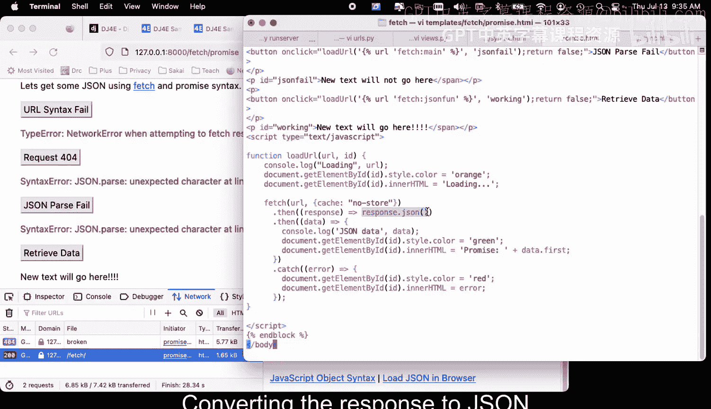

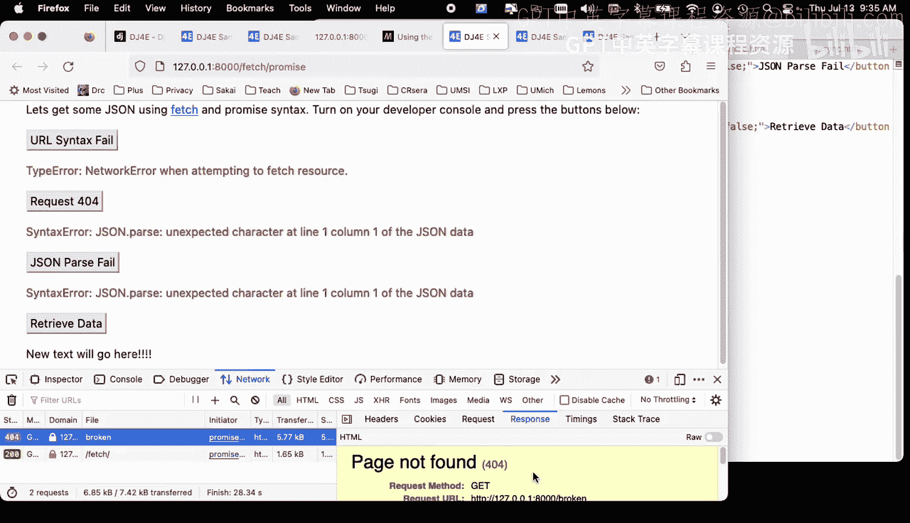

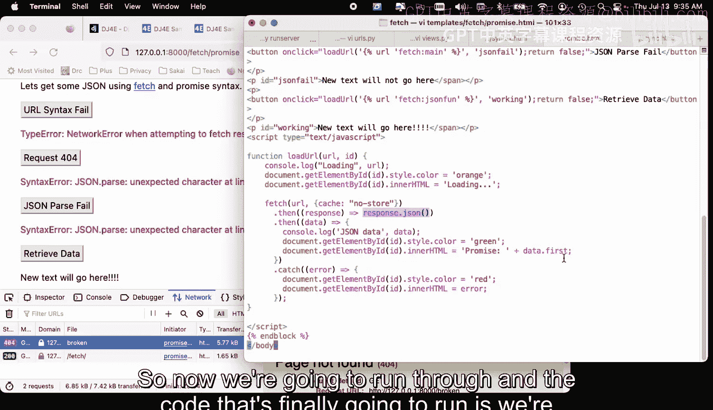

Im going to retrieve the data。 I'm going to get a 200。 Now， you'll notice it。

 It took two seconds because of that view that waits 2 seconds， right， But then I got a 200。

 I got Json， and the response was valid Json。 And so now I'm in my。

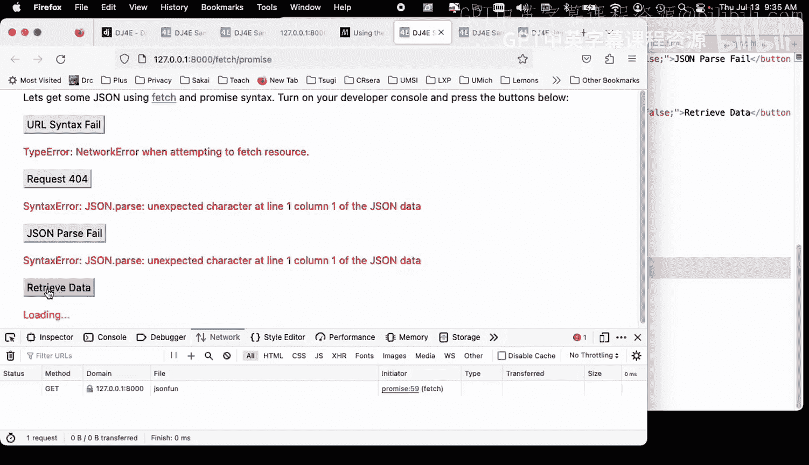

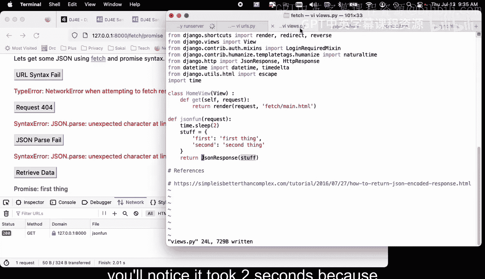

No here I'm in my code and data is that key value pair and so I can say I can say data dot first retrieved my data promise it's green。

 it's all good Okay so you can also see in the console that I had the object data object so that's the data object that I put out in console log okay。

So that's a walkthrough of the promised version of this。And again。

 I think you will probably tend to use the promise version of this， but the asy weight。

 if you're more sophisticated programmer， I feel like I get a lot more control in asy weight。

 so let's do the exact same thing with this now async await。

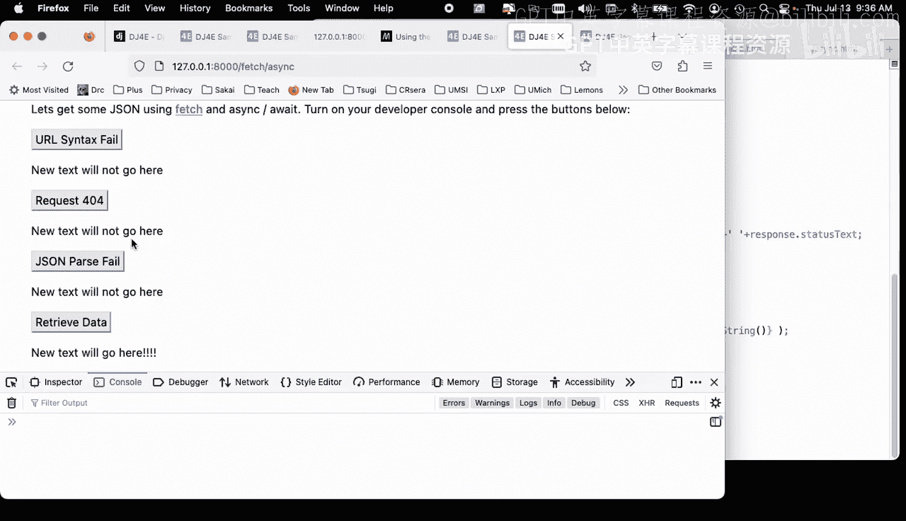

So we look at the top code， this top code is pretty much the same。First。

 we're going to trigger a syntax error， which means the fetch itself is going to fail。

 then we're going to trigger a 404。And then we're going to get a 200 that gives us doesn't give us JSsonN。

 so it's going to fail the JSsonN parsing and then we're going to make it successful Okay and so that's what these buttons all do right so let's take a look at this and so they're all calling this load URL。

去去去去。Okay。So this is cool and so now what I can do is I can start the request and catch the error in the fetch right and this is the one I couldn't do here。

 so could not start the fetch URL and then I print the air so let's run that。

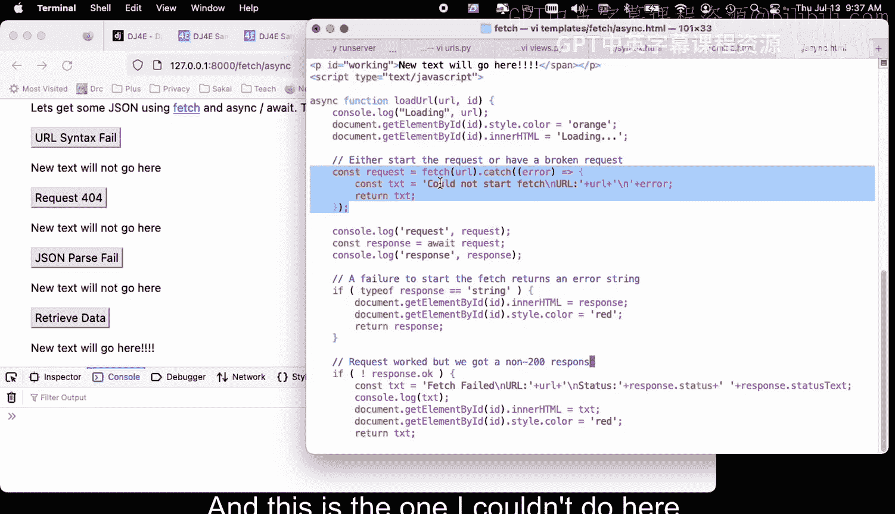

And then what's cool is I can quit。 I can stop。 I don't have to like run the catch。 So this is nice。

 It did sort of like it tells me exactly what happened。Now， if I do a 404。If I make a 404。

 that means that this fetch got a valid URL and you'll see this console log request come out。

 and then it's going to do the await and that a weight is going to take two seconds because that's where it actually。

Well'll actually know we're not doing the one that waits two seconds。

 this await is going to pause the code， and then we're going to see the console log response。

And then we're going to try to parse this， right？WeWe're going to be able to check to see that we didn't get a 200 and then come up with an error message there okay？

So let's do a 404， let's clear this console and let's make a 404 happen boom， Okay。

 so we got a response。 The status was a 404。And then we were able to process this but the response not okay。

 and I was able to have handle the exact same error with some response statuses。

 I really could see I knew this is a 404 versus just something went wrong in general。

 which we did in the previous example。Okay， so now we're going to do is we've got this。

 if the response is okay， we're going to do in another await right。

 and this we're breaking it and again this breaks the code into the stuff above it and the stuff below it and the stuff below it in effect。

Is an air。 And we can catch this one， too。 And that means that。

This response Json can either succeed at which point this code is going to run or it's going to fail at which this code is going to run Okay and so now。

We are going to go to a URL， let's go clear here and let's look at the network。

 let's clear this one and let's go to a URL that is a 200 URL， but it is not JO so we retrieve it。

 we go to slash fetchch， we look at the response and that is HTML it's HTML in that response right。

And so this happens to be this page right here， so don't get too worried about that。Okay。

 and then if we look at our console， we see that， you know。

 we got a response and the response had a 200。And we haven't yet used the body body， but then。

This code right here， a await response JSON。Runs and then eventually blows up okay。

 and so then that blows up and we can quit， we can leave， right？And so there we go。

So now let's do it successfully。 Let me clear this， Let me clear this， let me go to。The URL。

 so eventually when it's all said and done， when we are happy with our object。

We're going to change this to a green thing， but also watch for that two second thing because the actual get。

He's going to Liz watch the console， so I'll try to call out when that two second delay is happening。

So here we go， oh， I've got to click here。Thou01， 002 C。

 and so what happened was as we were starting the fetch， we got a promise with a state app。

Then we got a response with body used false， but a Sta of 200。

 and then we parsed the JSON data and we got the object kind of exactly the way we did in the first thing。

 and then we ran the success code， meaning that we parsse the object data， we see it。

 we grab the data and we put it into first thing。

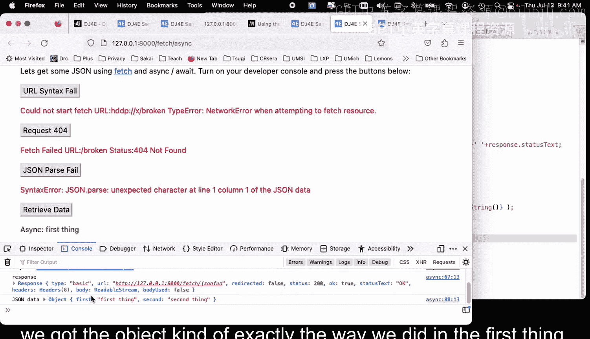

Okay。So that is a quick run through again， I encourage you to ask the internet whether or not you should use promises or async await and enjoy the discussion and the learning that you'll have because I think there's place for both of them。

 cheers。

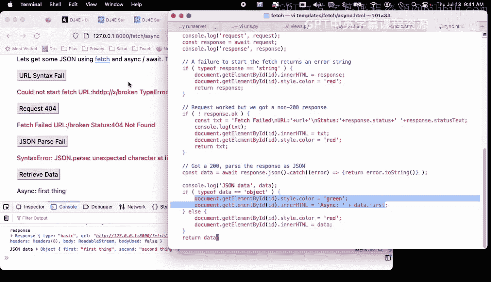

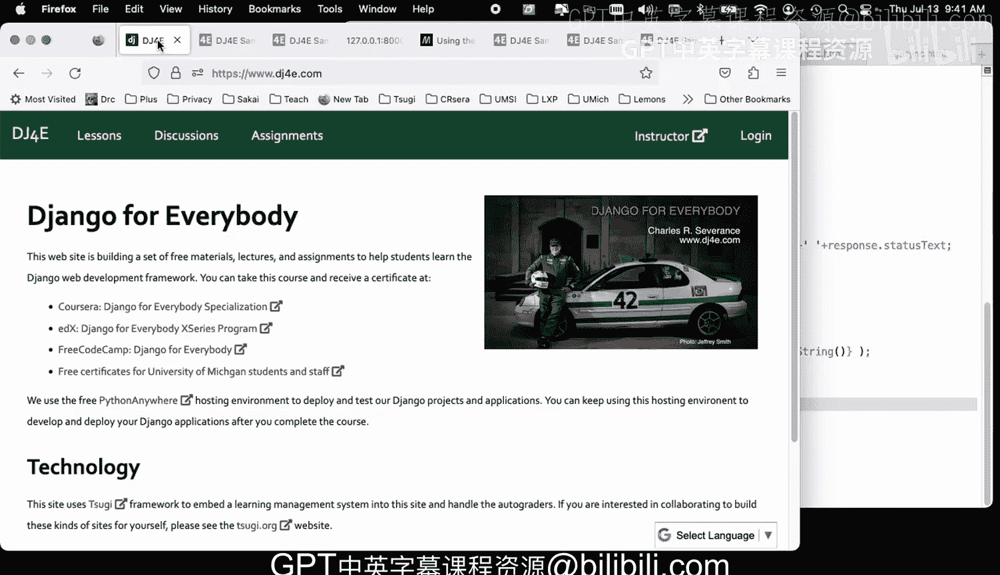