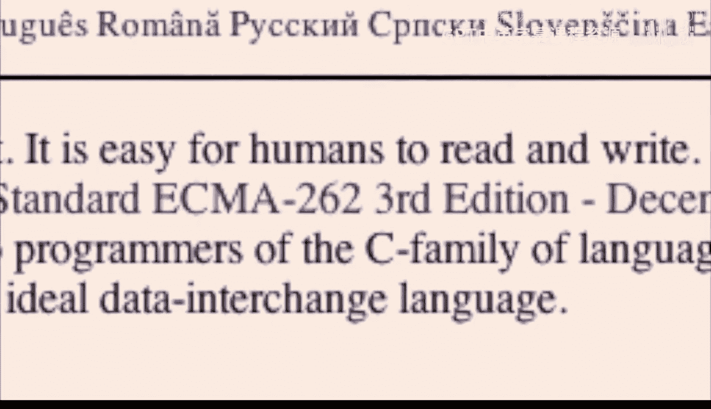
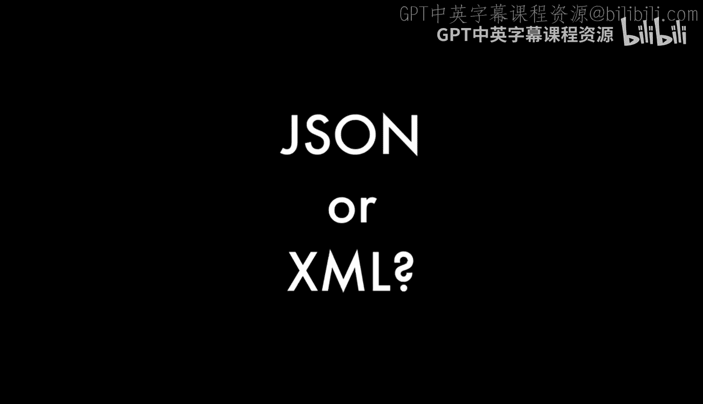

# 密歇根大学《给所有人的Django课程4⧸共4（部署Django应用）｜Django for Everybody》中英字幕 p43 43_07_01_Douglas Crockford发现JSON的故事.zh_en -BV1rNibBuEwD_p43-

🎼你是。🎼，🎼是。🎼嗯。🎼宝宝。🎼，🎼好。🎼こも？

🎼谁。🎼The。🎼Yeah。🎼Yeah。🎼，🎼あ妈。So Jason is the world's best loved data interchange format。It。

I discovered it in 2001。 I don't claim to have invented it because it already existed in nature。

 I just saw it and recognized the value of it， gave it a name and a description and showed its benefits。

 but I did not invented。 I don't claim to be the first person to have discovered it。

 There were other people who I later found out had come along the same idea in 2000。

The earliest instance I found of JavaScript being used as a data interchange format was at Netscape in 1996。

So it's an idea that's been around for a while， and if you look at other data representations like the property lists that were used at next and then later at Apple。

Except for a couple of cosmetic changes， it's the J notation as well。

 So it seems like it's an inevitable sort of representation for data。

 at least data that is intended to be consumed by programming languages and ultimately。

That's all data I started with JavaScript， but my first application was facilitating communication between programs written in JavaScript and servers written in Java。

So I recognized that even though it was born out of JavaScript。

 it could be and should be language independent。So I simplified it as much as possible。

 took as much out， tried to make the simplest possible specification for how to structure data and put it on the wire。

 and that ultimately became called Jason。🎼你是。🎼，🎼好。In 2001。

 I was in a company that started called State Software。

 and we developed a platform for doing applications which could be delivered through unmodified web browsers。

 what today is called AjaX， but in 2001 that was kind of a radical idea and not many people would believe that it was even possible or if it were that it was a good idea。

But we produced some brilliant demonstrations and we were starting to make some progress in trying to convince potential customers that they should adopt the style of application development。

And as part of the description， we'd say， and then we use this Jason idea for communicating this stuff back and forth。

And I say， Jason， what's that， I say， it's this thing we've found in JavaScript。Really great。

And I say oh， we can't use that， we just committed to XML， so no we can't， is it。

 but XML is wrong for all of these reasons， it's hugely expensive。

 it's much harder to use all of that。Well， we can't use that thing you did because it's not a standard。

 He said it is a standard。 It's a proper subset of Ecma 2，6，2， which is a standard。 They said no。

 that that's not a standard。 So I decided， if I want to be able to use this thing。

 I need to make it a standard。 So I bought Jason do org and put up a web page and sort of declare it's a standard。

That's it， that's all I did。 I didn't go around trying to convince industry in government and everybody that this is what they should do。

 I just put up a website， basically one page website and over the years people discovered it and realized oh yeah。

 this is so much easier， I'm just going to do that。🎼一生日。

🎼，🎼好。The thing I never understood about XML for data interchange。

 Okay so basically generally the pattern is you've got a query， you send it to the server。

 it gives it to the database and you get back this XML thing and then you have to send queries to that in order to get the data out of it And it said why can't you just give it to me in a form where I know what it is and I can use it immediately。

 And so that was the main benefit of Jason， I think wasn't that。

Curly braces are so much better than angle brackets。 I mean， ultimately that none of that matters。

 The thing that mattered was that the data structures that Jason likes to represent are exactly the same data structures that programming languages represent。

 You know， when Ajax was formulated， the X and Ajax was supposed to be for Xml。

 And the smart kids right away， realized， well， this is too hard。 we don't want to be doing Xml here。

 And some of them discovered， hey， you can use Jason here instead and it is so much easier。

 so much faster。So they start doing that and for a while there was a debate where some people were arguing。

Jesse James Garrett said the X stands for XML， so you can't use anything but XML。

 that didn't last very long。There were a number of other alternatives to XML that were being considered around those times。

 but Jason was the only one that was designed specifically for Ajax。

Probably the boldest design decision I made in designing Jason was to not put a version number on it。

 so there is no mechanism for revising it。So Jason， we're stuck with it。

 whatever it is in its current form， that's it。And that turns out to be its best feature because it it wants to be a low level thing。

 it's， it's basic infrastructure it's。The thing that you pile everything else on。 know。

 it's sort of the equivalent of alphabet in a language。 You know。

 we might make up lots of words and lots of ways of having sentences。

But it's very uncommon to make up new letters。 And that's sort of the place。Where Jason lives。

 So it's good that it's not going to change。 I expect maybe someday。We'll find that。

They're really important things that Jason doesn't do like cyclical structures。

 graphs are not easily represented in Jason， they can be。

 but it requires a level of interactiondirect， a little bit more work someday when we might decide we don't want to do that work。

And then we replace Jason with something else。 We will not extend Jason to do that。

 We'll replace Jason。And even after we do that replacement。

 everything that was ever developed that still uses Jason will still work because Jason will never change。

