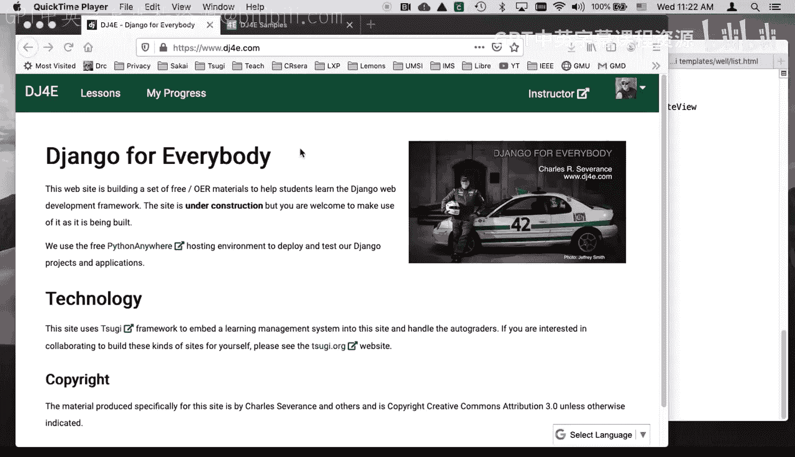
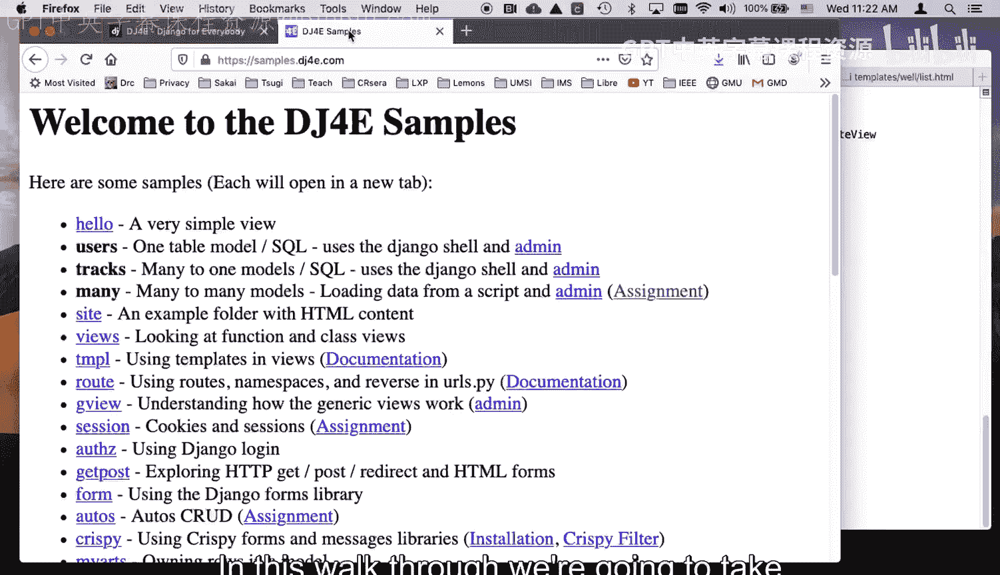
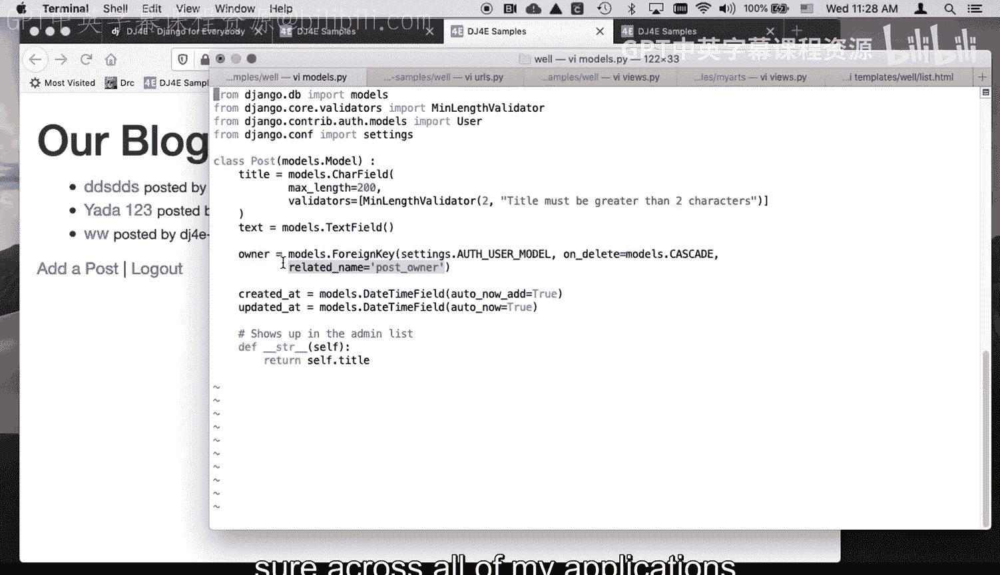
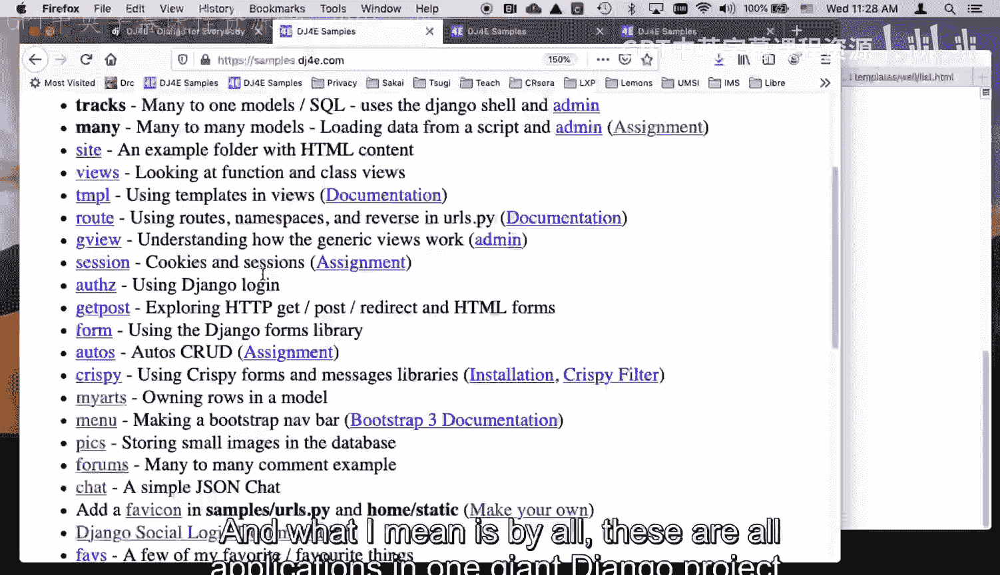
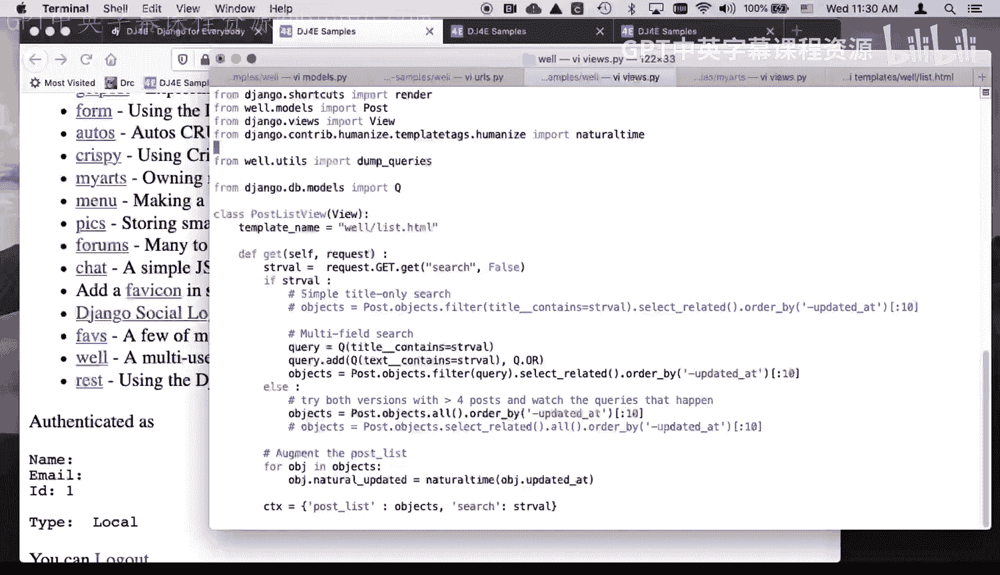
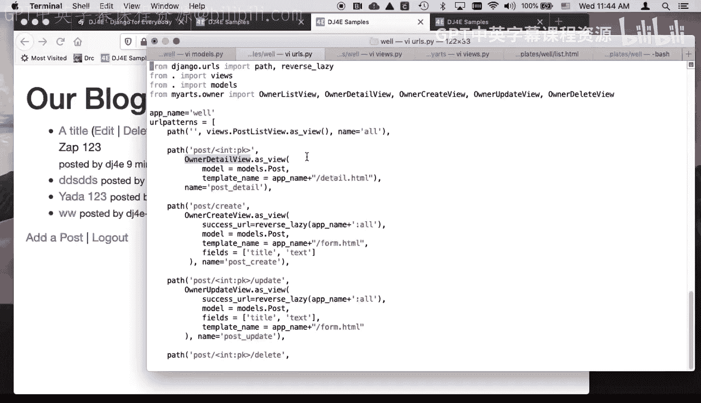
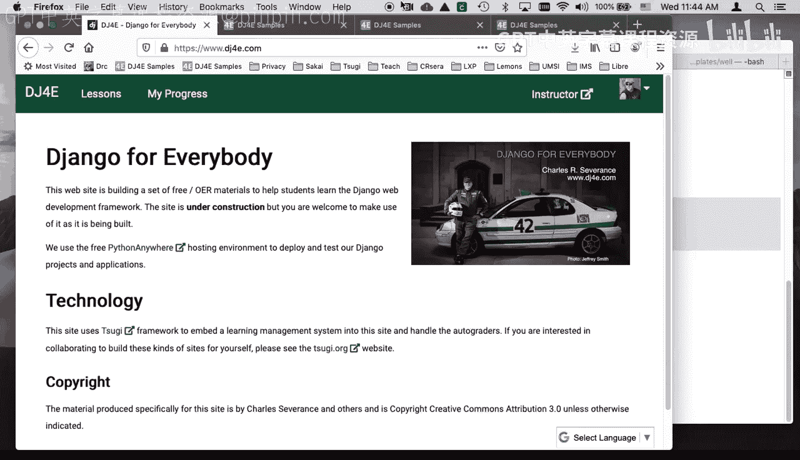

# 密歇根大学《给所有人的Django课程4⧸共4（部署Django应用）｜Django for Everybody》中英字幕 p45 45_08_02_DJ4e搜索功能-well示例代码实战.zh_en -BV1rNibBuEwD_p45-

Hello and welcome to another walkthrough for Django for everybody in this walkthrough。

 we're going to take a look at the sample code called Well the well is the name well is based on a long time early pre internet forum in Berkeley。

 California and so you can go look up the well， So the basic idea of the well is it looks exactly like。

My arts， pretty much a clone of my arts。So if you recall my arts， you had。You know， articles crud。

Article， article submit。Article crd， the， you know， just the basic article crd， right， So。

 so the only difference between this and the well is there's a search box here so I can search for things that have yada in them。

 and then I can clear the search box。 and that's it。So first。

 let's observe something that we can observe from the outside when I do a search。

The search is a get parameter。 And the reason for that is that we want this。

Get parameters are get URLs or item potent。 So that basically says。

 go to my blog and find all the blog posts that mention 1，2，3， so I could。I could put that in as。

Cl my search here， and I could do。Let's search for DSs。Yes， S search here。

So that is this URL is the search for the ones that are DSSS。

 So now I've bookmarked both these and now that is going to be a short link to the ones that say DSSS。

 So what I'm going to do is clear this search now and this will show you something about item potentent URLs I'm going to say you 4 or56。

I was here submit。 So now I have two that have the word yada in the title。

 but watch what happens when I go to the URL that I bookmark。So I see now two posts。

 so the key of item potent is not that you get the exact same page。

You get the exact same logical page， not the exact same text every time it's not like a cache that just clones the text。

You know， I， I go to this before and then I go to it now。 and if I。If I then delete this one。

And then I go to this again。 That's the ones that have yada in them。

 And so that's why we're going to do a search for yada。 And， and it's really quite simple here。

I'll show you everything， but let's just start with an inspect element so you can see what's going on here。

The the first little trick here is you can construct that URL and we go， this goes way back。

 this goes way back to a form without a method equals post， which means it's a get method。

 which means that this。Name equals search becomes。It just goes on and it does a get request。

 so instead of doing a post request， which we've been doing for weeks now。This does a get request。

And it adds a get parameter。 Okay， And so we've got a， in our view， our main view that is， well。

 we're seeing a get parameter。 It is not a different view。 We're getting a view with a get parameter。

 And that also means that if I inspect element on this little undo icon that I made。Inspect。

All I'm doing is I'm making a link to slash well without the parameters。 So it's super easy。 So like。

 get rid of the search is just go to a different URL。 I could have done it Well。

 it isn' an anchor tag。 It's a H tag Look， So I've just gone to well， and it's not there。

 it's the same view。 So， so searching。 And if you were to go and take a look at how。Amazon or Google。

 they do search。 They are forever putting that stuff in the URL so that you can then bookmark them。

And so I'll get rid of those， I'll get rid of those bookmarks later。

 but you see how that's that is I potent。That's the get when I said weeks ago。

 I said get URLs or item potentent， I can now sort of show you in code that we're writing how that works。

Okay， so let's take a look at our code。 I'll clear my search here。

 The code here is a pretty straightforward。 We've got a really simple model that was pretty much taken straight from the My arts code。

 This is like a， it's， you know， it's got a。It's got a name。

 I called it post instead of articles because I've got all these applications running at the same time。

 so I have to change it from the names here and there related name is when we're we're poking a lot of。

We're putting a lot of foreign keys into owner across my Jnangle project。

 so you got to be careful to choose a name for related names so you don't end up with a collision。

 you can't just say owner or whatever so I call this post owner so that you don't back in the owner model。

Back in this model right here， the offth user model。

There we're pushing in effect methods or attributes into that model。 And so we got to name them。

 and so this related name is really quite important to make sure across。All of my applications。

 And what I mean is by all， these are all applications in one giant Dngo project。

 So this name here wants to be。 and lots of these applications are using owner。

And they're making a foreign key into the off model， which is perfectly okay。

 It's just you got to be careful about the related name。 So that's why that's there。

So let's take a look at the URLs。pyy。The main URL that we're going to change is this one， right。

 It's the list view， and here it is in the list view。And。I don't know which way to go first here。

 let's compare and contrast this list view with the views in my arts。So in， in my arts。

 the list view， I could just borrow owner list view， which was like extended generic list view。

 And I just say my model's article。 and it was good。

 But now I got to do a whole bunch more work here。 So I actually am going to。

And I might have been able to do this by sort of overriding a few methods like we have done in the past。

 But I just decided that I would simply。Write all the code。 And so I'm just extending view here。

 So I'm only extending view to make post list view。

I'm still following the pattern so I can say what the model is。 I'm not sure I even use that。

See if I use model。Yeah， I don't even need that。长台。Am I using that。It was kind of。Yeah。

 so I'm using the template name here， so I still going to use the template name。

But I didn't need the model because I am the reason I didn't need the model is I'm just explicitly using post in all the places and。

So。Just get that so it's not I mean I don't like I don't like code that does nothing it's all it's all in mistake Okay。

 so the get request most of this is in a get request there is no post here because in the list view the list view which is this view there is no post this form is a get request that's a get request。

And all it does is we are going to do a get request。

 and we're going to do two versions of that get request。

 and we're going to have one version of the get request based on whether there's a search get parameter or not。

 So we're basically saying， go grab a get parameter。

That the get parameter using the get method of a dictionary， the big uppercase get is the dictionary。

 and lowercase get is the name of the method in Python searches the key and in default is false。

If we get a string， then we've got a search and filter， but let's start with this。

All we're doing here is we're grabbing the objects。

 And this is the kind of code that is done automatically in ownerless view。

 which is then genericist view， right， So this is just， I'm just doing the code。 Now。

 the thing I get to do with this that's really nice is I can go through and augment this object list。

 Now So this is a list of objects。 and I'm going to change each object。 and I'm going to add a field。

 undo， undo， undo， I don't know what I just did。 undo， undo undo。That I want。So this is an object。

 So objects is a list of objects， and then I'm going to grab it and I'm going to add a field so you can you can sort of in the middle。

 you can add this natural dash updated， and I'm going to base it on updated at。

 which is the long ugly looking date。 It's a real date， but it's a long ugly looking date。

 and I'm going to run that through the natural time filter。

 which again is something built into Django that puts in this 15 hours ago thing。

 which is much nicer than just putting the date out。ok。

And so we're going to send the objects in this post list。Yeah。

 which is the list of objects and then we're going to send the strength the search value in。

Just so we can show that yes， that so that when we want to see this yada， so you can actually。

Change this。Right so we want to we want to put this back in right so we're going to pass that into the template and then we're going to render the template。

Dump queries this code just to show the queries that are actually being run。

 if I was running this locally， So let's take a look at the code。 So for most of this。

 literally it's the same thing。对。So I'm just， I mean it。嗯。It's basically looping through。

 It's doing a little bit more tricky stuff here。 It's if the text is less than 100。

 I'm putting it all in in the list， I'm only going to put。So。IfThe post length is less than 100。

 slices 099。I can't see that。Oh， that's because I'm not the owner。 That's because I'm not the owner。

Posted by DJ free samples who am I in this situation。 Let's add a post。睇气睇懂。1，2，3， submit。Yeah。

 so it's showing， it's showing this detail that that's what I was confused about。

 See this little detail， whoops not what that end if。That post text length greater than 100。

 So there's actually a bug in this code right here。 And since I'm running it on samples。

 it'll take me a while to get it updated。 but I'll just point out that there's a bug here and I want to fix it。

Because I really this， this if post owner IDd， that's our standard like to show the edit and delete。

 And I inadvertently had this code that's showing the actual text。

 This is what I wanted to look like， I wanted a title and I wanted a short summary。

 So you'd have to go into here to get the whole summary， but the short summary of the text。

 So this code， when you run it again， you will see after I update all this and push it through Github and run it in production。

We'll fix this， okay？And so that that is what makes list keep that nice and short。

 99 might be too long of thing。 I'd rather that stuck to one line， but whatever。

Posed by the username in this case， there's the username， that's nice。

And a URL into the post details。 So this is really straightforward stuff other than that little cool bit there。

 putting the summary in。But the only thing we really added here is this form。

And we are going to do a form it's going to because we haven't said action equals on the form tag。

 it is going to post right back to the same URL that it came to， I mean。

 not post it's going to do a get because there's no method equals post here it is going to get right back to this same URL and I have。

The input with a placeholder， the placeholder is what gives me this little searchy bit thing。

 See that it's not really the string search。 It's a placeholder if it's empty。

 and then I have value equals Oh no， undue。Value equals search here。

Which is taking the old search value。2 old search value。 Zap was there。

And so that that's putting that back in there and of course it's escaping it and so if we were。

 you know， there's no HTMLl entity problem here， whatever， and I put this in it if，Right。

 and that you don't have to put these on separate lines。 You see me doing a lot of that。

 or I'm having the if and if on separate lines。 But here I just have it like right in the middle of a line。

 And that just is going to emit that text in the middle of that line。

I'm using a font awesome icon for the search so that I get this little search button that's kind of cute。

 That's a thing called font awesome。 You can go look that up。

And then I have a link that goes back to Well call and all。 I could probably call this like a。

Request path or something because its really would be the same thing instead of URLl well call。

 I could just go back to the request path， which would be slash well slash。

 but it doesn't matter well call all is nice。 And then I throw another font awesome in there。

 which gives me a little undo thing。 And we've been using these little font awesome creatures for a while now。

 And so that's really all that is needed to get this new bit of user interface into the output。

In so really the only thing left to show you is the code where it handles the search。

So there is a filter。Post objects， all order by。That's what happens if it's not searching。

 So what you see here is all we've done is instead of saying all， we say filter。

And there's a couple of ways you can do filters， you can do like just if you're doing one field。

 this is a really funky syntax it uses two underscores， title is a field in models。

pyy right title is a field in models。pyy double underscore contains that is like an operator and then this is a string value。

 which is just a string here in our Python code。Now I want to actually search through both the title and the text。

 so I'm going to have to make myself a combined search， so I'm going to make a query。

And I'm going to use this D models Q， which means allow I can create a query in and I could do it in a really long yucky query there。

 but I would like to I'm going to start with a query that says the title contains the string。

 and then I'm going to add to that an or clause。We're stuck in Python， right， is's not SQL。

 We're stuck in Python， so weve got to have this funky thing。So this says。

These two things create a thing that basically says， if the title contains that string。

 whenever it was Zap。If the title contains that string or if the text contains that string。

 select it。Now， instead of all， I put filter query。 so I pull the query in and then select related。

 This is an efficiency thing that says， look， I'm going to actually look at all the data。

 So run that whole filter， run the user name do a bunch of stuff。

 So I got to comment toward the bottom of this the talks about select related。

 And then the order by and then show me just the first 10。 That's the same。 And there we go。

 And then we augment that and then away we go。 and so search is either in this case。

 search is either the get request from the former get。This is that value in this particular instance？

Or it is false。 And then that triggers， of course， this bit of code in the template， so。

That's pretty much it， I mean I certainly probably overted it， it's not that complex。

And then so I want to show you only one more thing for this before we wrap it up。

And that is a new pattern。So you'll notice if you look in here， there is only one view。

 There is just the post list view。And if we take a look at articles， we've got these views。

 the detail view， the create view， the update view and the delete view。

 and they all extend owner create view and then just change these variables。

I overwrote this list view because I had a whole bunch of other things I wanted to do that ownerless view wasn't going to do for me。

喂。And so but you'll notice that in the well， I don't have those。

 so let me show you how these are and you'll notice I have edit views， right？I got them。

 they're still there， and there are templates。CD templates。我要。

Demplates are there and as a matter of fact， in this one。

 I changed the default name of the templates because I'm kind of tired of putting underscores in front of certain things。

but let me show you how i solve the problem of where are the views，They're actually， fully in。

URLs not P1。So here is。So I import owner list view on a detailed view owner create view and owner update view。

And so what I'm saying is map the post slash int PK， which of course， is the detail file， right。

 post int PK。And I would like you to call owner detail View。

 which is a class that's come from my arts dot owner as view。

And then you can put a series of key value pairs in that override the default values of。

 say model and template name。And so I'm saying models equals models do post。

 I know that that's the name of my model， right？And then template name equals。

 And now I'm even saving。I'm taking the app name， which happens to be sitting conveniently in a string here and concatenating at the detail s HTML。

And so that is the view， and of course， name equals as just part of the URLs thing。

And you'll notice that when I do the create view， I set the success URL， the model， the template。

 and now remember I want to hide some of the fields I want to show which fields are there and which fields aren't right and so if we look at this views you see like which fields you actually want to show because I don't want to show the created at etc cetera and the updated a right in the models。

I don't want to put owner out， I don't want to put created ad out， so I'm going to give a list。

Go to give a list。 come back。 I want to give a list of the fields I want to show on my create form。

 So again， these are sort of class wide variables that turn into object object instance variables when it makes this view and it overrides all these things。

 And so all the stuff that I was doing in views dot P Y。

I am now doing in u do py and just re usinging owner create view。And。You see an update and delete。

 They're all kind of there， right， And so I don't actually need to put the views in。

 And this is really， it looks a little more complex。

 but I think it's a lot prettier than putting these s views in over and over。

 So that's a pattern that you may want to use。 It made it easier for me to rename from well to something。

Something else if I wanted to because really well as only hard codeed one place in here。

 so that's kind of cool。Okay。😊，So。There's a couple of lessons here， you know， one is this searching。

One is the search and how that works， but then also a new way to create views that never really leave you or else。

pyy you could built and remember we I built this owner detail view to meet my needs so things like template view that's something that isnt just a bunch of code somebody wrote so。

Okay， well， I hope this walkthrough of the Well sample application has been useful to you， cheers。

