# 密歇根大学《给所有人的Django课程（简介、开发Web APP、特征和库、JavaScript和JSON）｜Django for Everybody》中英字幕 p04 04_01_01_理解DJ4E自动评分器.zh_en -BV1Kt421V7EE_p4-

Hello and welcome to another walkthrough for Djago for everybody today。

 I'm going to actually sort of fast forward a little bit into the future and show talk a little bit about how the auto grader works。

 I'm going to go about to the middle of the course and show you an application that you're going to be working on called the autos Crd application。

 An autos Crud。 It's kind of our destination。 The idea。😊。

Is that it's got to create update and delete and it talks about login， cetera， et cetera。

 and so I'll take a look at the assignment for this。And it tells you how to log into this。

 you're going to have to make your own account and this is your assignment and there's a lot to this assignment。

 I want to point out to you that one of the things that we always encourage you to do before you submit to the autograder is to do your own testing。

Okay， and so let's just do some testing here。 Let's run this program， the implementation。

 I'm going it's going to log in， add a make， add an auto， view the makes。All right。

 so I'm going to log in。DJ4 E Crud and there's a password there， and so we'll go to the autos one。

Let's add a make。So we're going to do a dodge。'sAdd the make。

 we're kind of running through this manual test， then added auto selecting the make。Add an auto。

And one。1，2，3，4。Some comments pick the make dodge and this is code it it can break right you know view the make update the make and press cancel。

 update the make and press cancel it it should go back to the list so what I've given you on a lot of these more complex assignments is an outline of things that you should test right。

And then if you update this and I'm going to update the makes， I' got to view the makes。

 I' got to update the make， I'm going to say Dodge exclamation point and submit it and you'll notice that this changed automatically because of third normal form and all that stuff and so you're supposed to write this code and then submit this to the Ograder。

So the way the autograder works is you are going to submit it。

 so you're going to get your homework all done and you're going to test it and then you are going to submit it to the autograder。

And then， and you'll say evaluate。 Now， one thing you'll notice is this takes a little while。

 And that's because this is doing a whole bunch of request response cycles。 So let me just show you。

 well， I mean， and if it's good， it tells you， I like what you I like this。 I like this。 I like this。

 I like that。 I like that。 And then， you know， it figures out your score。😊。

And you can see the pages that it's actually retrieving by looking at this show hidede retrieve page。

 So let me just kind of show you a little picture of what's going on。So normally。

 you're sitting here and you got your browser and you're using Python anywhere and you're writing code and your testing code。

 right， You're testing the code in the browser， just like I was doing。Here， that's。

 I'm just me in my browser。 and I'm doing stuff。 And I'm working in Python anywhere， right。

 And so let's go ahead and make a console in Python anywhere， and I'll say。

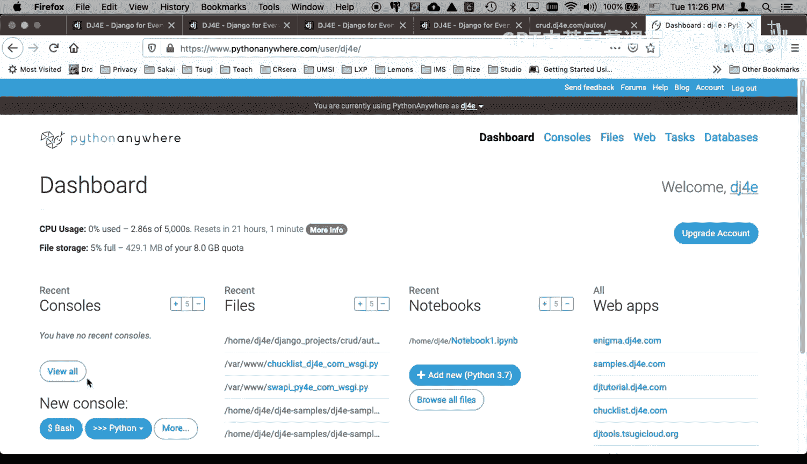

Work on Jnangle 3， because I always say that， oops， work on。Jiango3。

And I'm going to go into CD Jngle projects。CDCd。And so here's my code for CRd right that's that's the code that I've got for CRD。

 You might be doing this with your you know fullscreen editor， but I am basically at this point。

 I am working up here where I'm in my browser and I'm working on Python anywhere and I'm making changes and I'm testing those changes in another tab right so the code that I'm running。

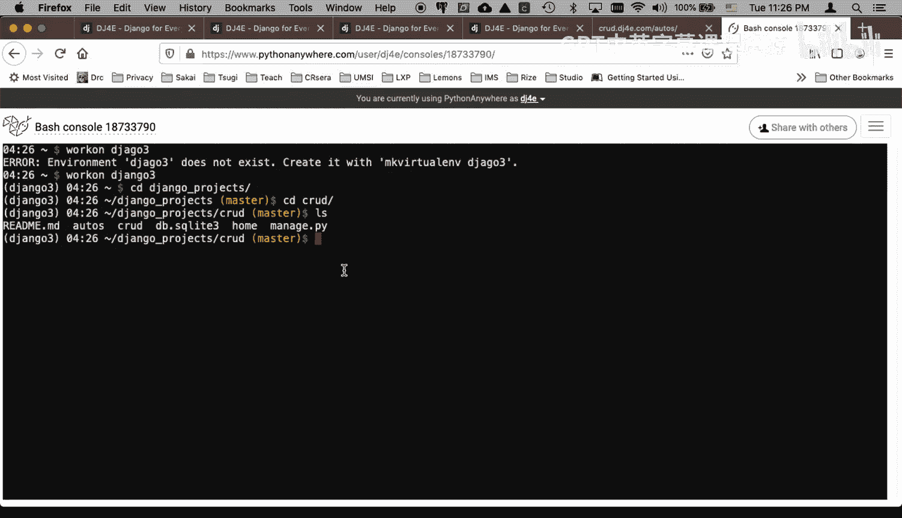

Right。Is running right here。 So let me just make a little mistake here。

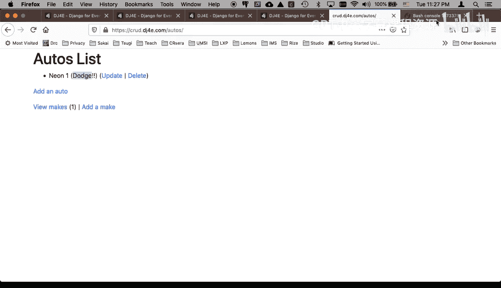

Auts。URls。 py and。Let's just。Break both the update and the delete。 I'm commenting these paths out。

 and then I'm going to go to my web tab， os。

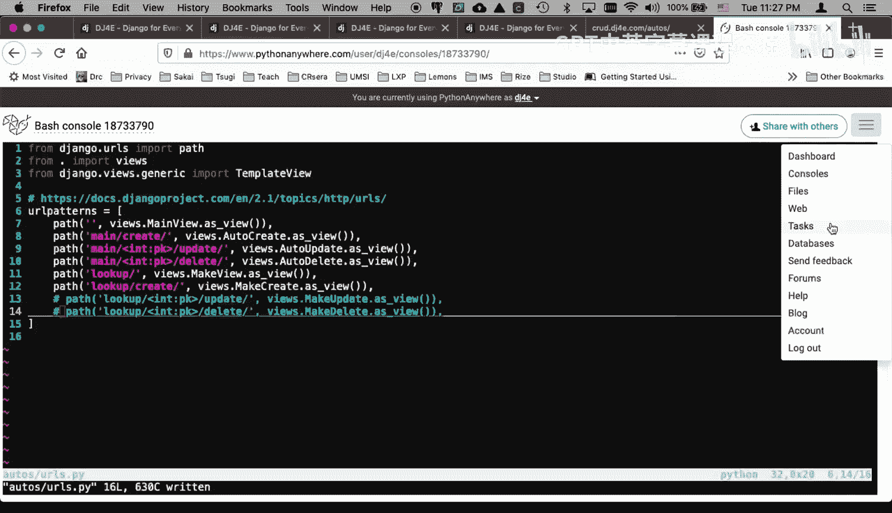

Web open a new tab and I got to reload， so I'm want to reload to crud， I'm going to reload crud。

So I messed up my just messed my code up， right？So you can see。So the code is mostly working， right。

 but when I click the update like add make it's going to work right I can make a forward that part's working。

 but as soon as I hit this update button，Oh waitai， what happened。No。Oh， oh， no。

 it's the makes that I broke。 Sorry， I broke the makes。Now when I update this one。

 it's going to blow up okay。I almost didn't， I meant to break it。So what'll happen here is。

I'm breaking it。 I I'm talking up here to the system。 If I go and I run this in the autograder now。

 this DJ4 dot com is going to make requests to Python anywhere and。Get answers back。

 And sometimes it likes the pages that it gets， and sometimes it doesn't。

 The safest thing to do is test it by hand。But now if I go back to the autograder。I mean。

 I I saw this error。 And what I should do is fix the error。

 but now I'm going to go to the autograder， and I'm going to rerun the autograder。 And again。

 this takes a while。 And the longer these auto the more steps the autograder is taking。

 The longer it's going to take sometimes it willll take about 20 seconds。 So I think it's done。

 So now we can see it's doing good。 it logged in。 It added a make。It's deleting makes。

 it's doing something。And， oh， look， here we go。 Page may have errors H to B Sta 40，4。

 did not find a form with a submit button。Now， you could just call your your teaching assistant or me and say what's wrong。

 Or you can click this button called show and hidede retrieve page。 And now it's saying， look。

 the autograr is looking at this page。 This is the exact URL that it's looking at。

 You can even click and you can open that URL。 You'll see it's exactly this URL， right。

And so what you need to do is then you need to fix your application。F your application。

 which I'm going to do right now。

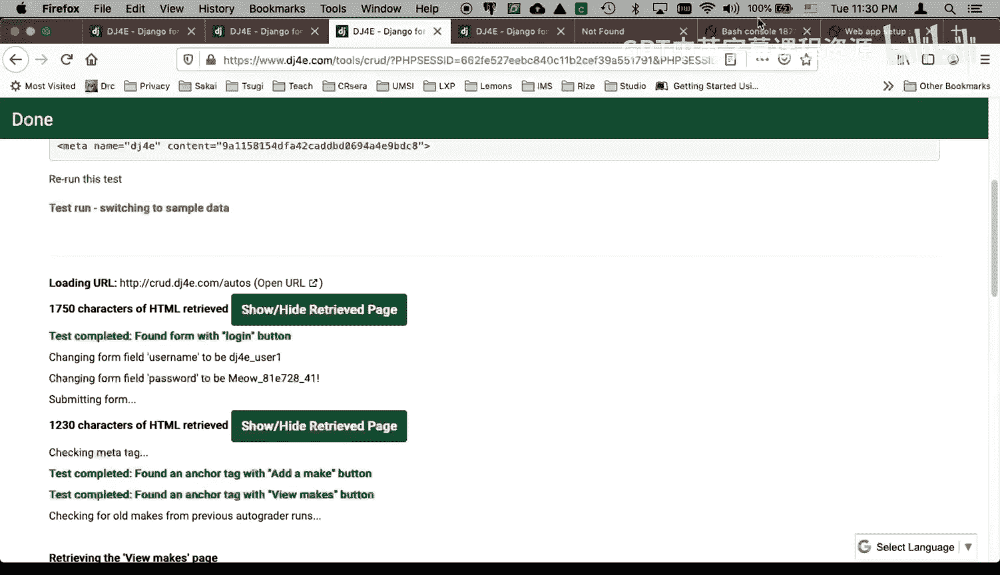

I'm going to undo come back。Undo， undo， save that。 And then I'm going to reload my application because I'm not going to fix it。

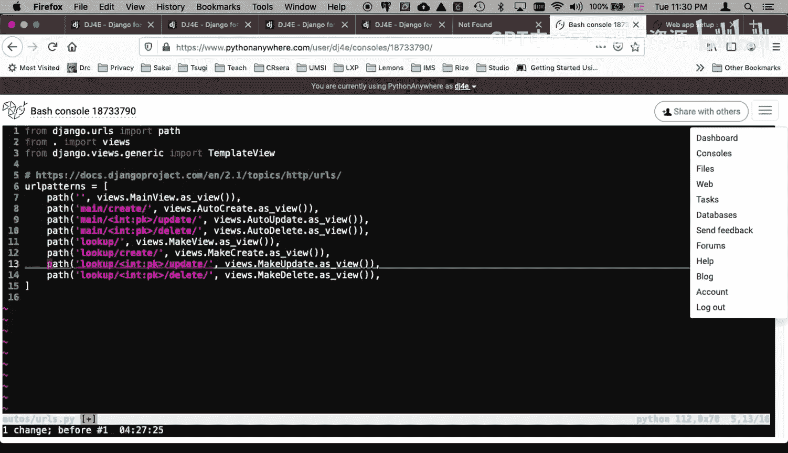

Take a moment。So now that I put those routes back in， this update will work。Now that code works。

 and if I run the autograder。Ca I got this thing to rerun the same test。 You can， you can redo it。

 So then it's running the test， running the test， running the test。And now it's done。

So now it made it past。 It's all green， it's all green， It's all green and。

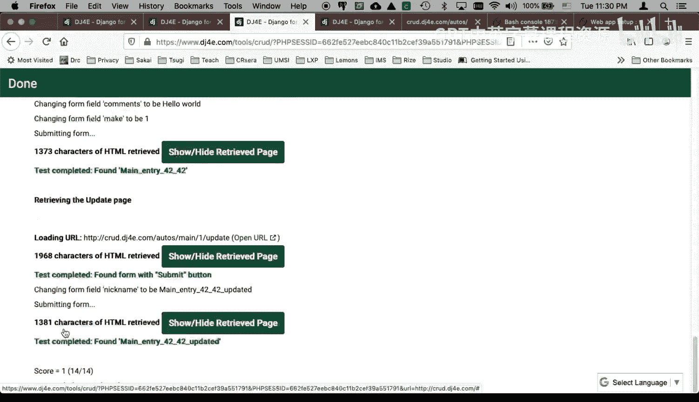

We got we got a good score。 So the key thing is to get used to this idea that you should test your code。

 run through all the scenarios。 When you run the autograder。

 it will take some time because it's actually doing all of the things it's pretending to be a browser。

 DJfr do com is pretending to be a browser in order to test your URL。 And then at some point。

 if it has made it through all the tests it wants to do。

 then it sends the grade to the appropriate gradebook inside the learning management system。

 But the key thing is， is to get used to the idea that scroll to the bottom。

 look for what went wrong。 and then see what it was that it was seeing。

 this particular one is working。 and you can you can see it。

 and the autograder is not trying to trick you and it's not trying to mislead you。

 the autograder is as best I can do it， telling you everything it's doing everything it's looking for。

 and when it can't find something。 it shows you the page that it was looking at and that。

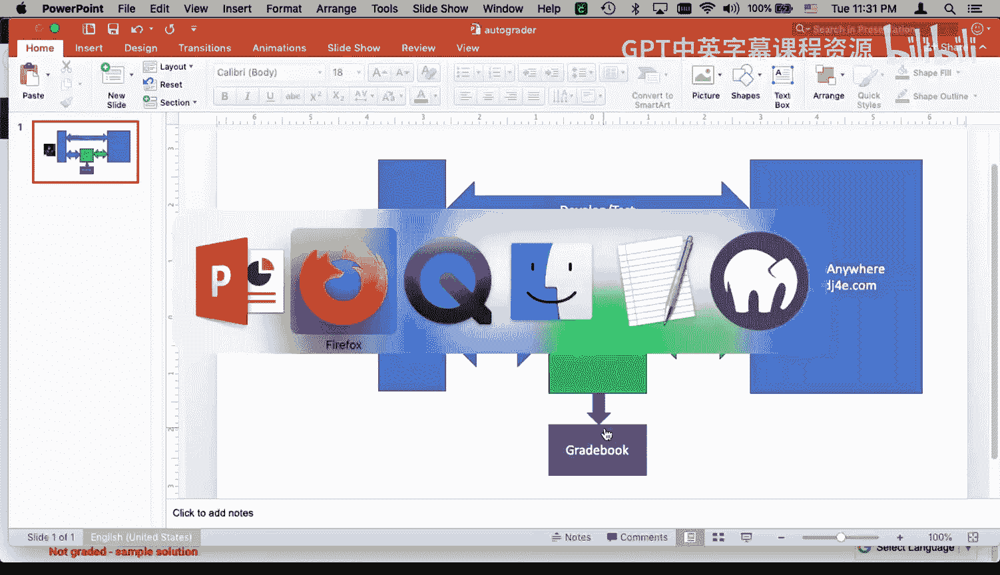

Page wasn't right。Okay， so you'll get used to the auto grader。 It's a good helper and a good friend。

 make sure to look for the manual testing section in your assignments and do the manual tests it will save you a lot of time and it's just easier to fix your application by running your application yourself and then making changes to your application and then reloading your application and and the way you go。

 So I hope this little。

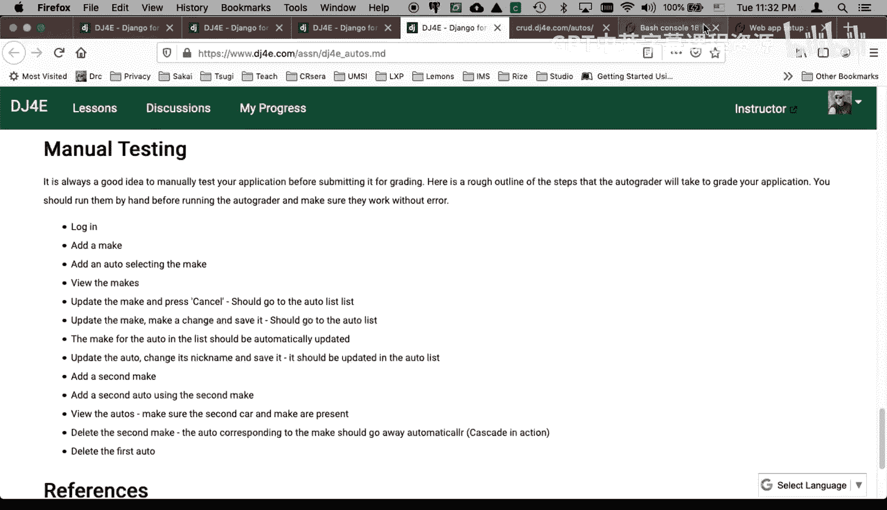

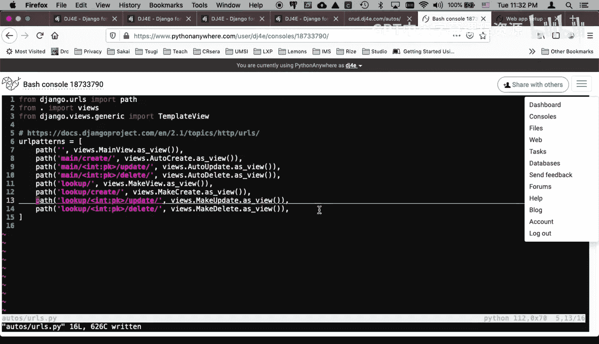

Summary of how the autograder works has been useful to you cheers。

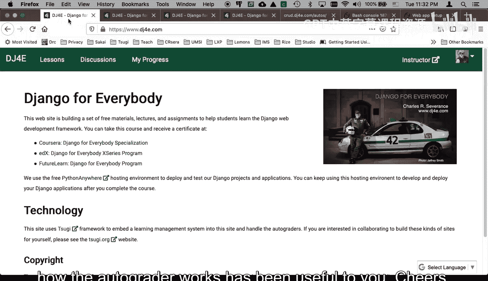