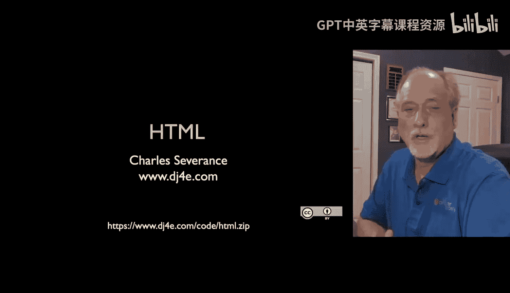
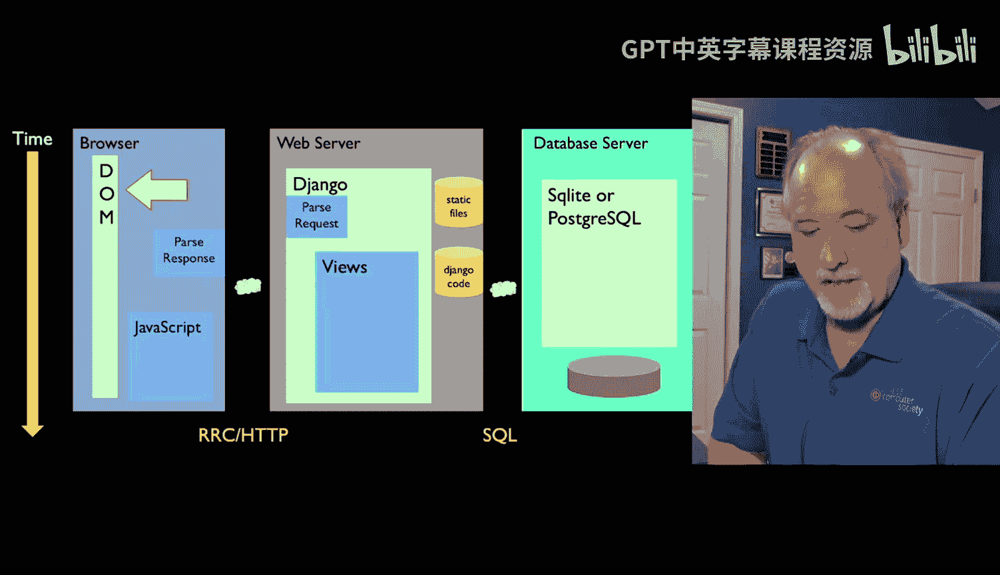
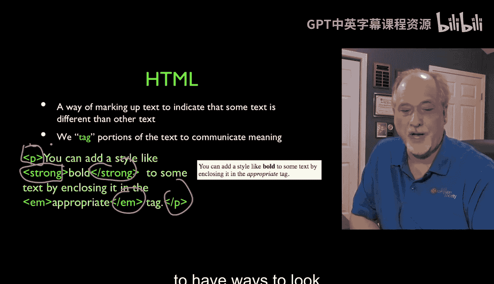
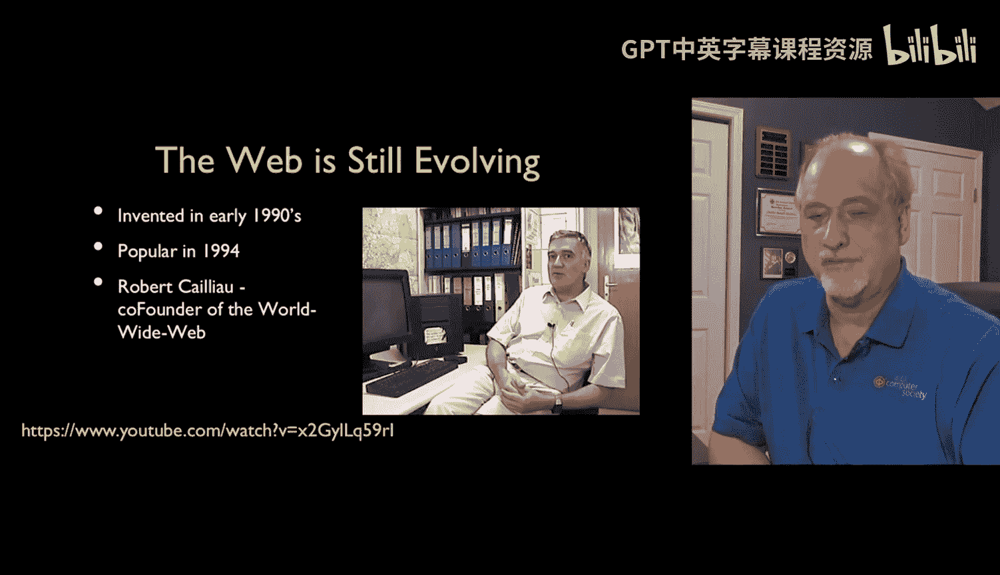
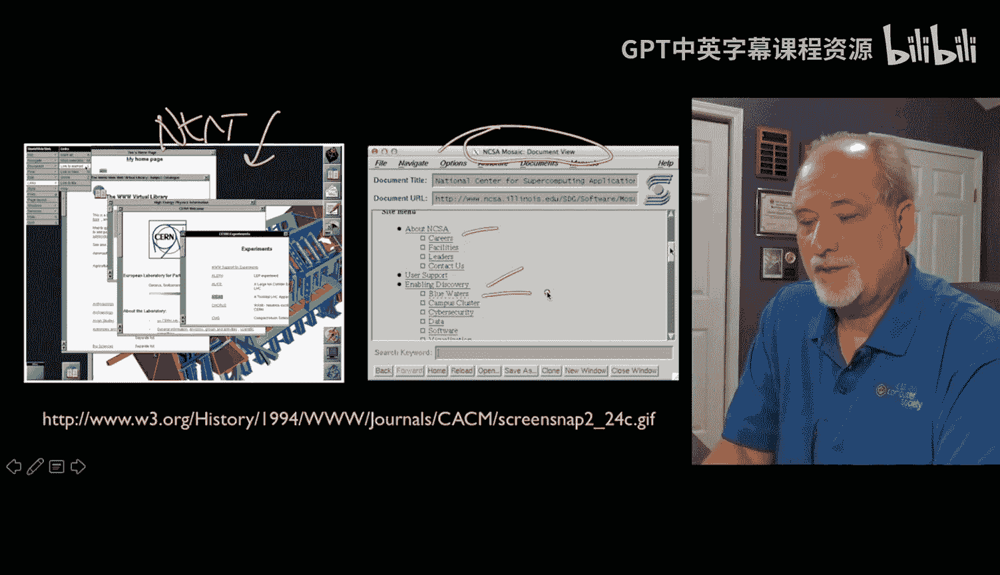
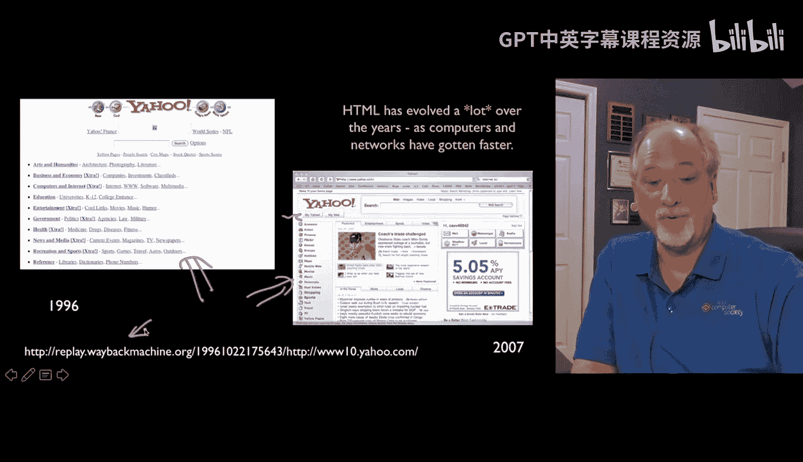
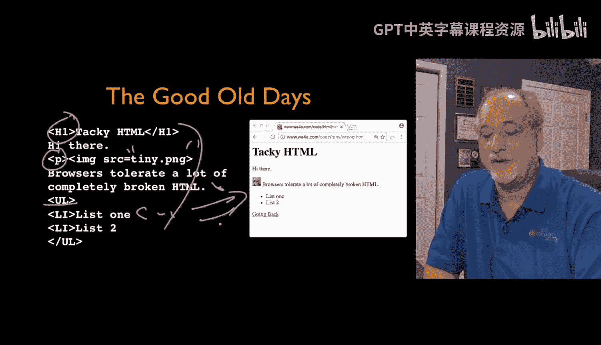
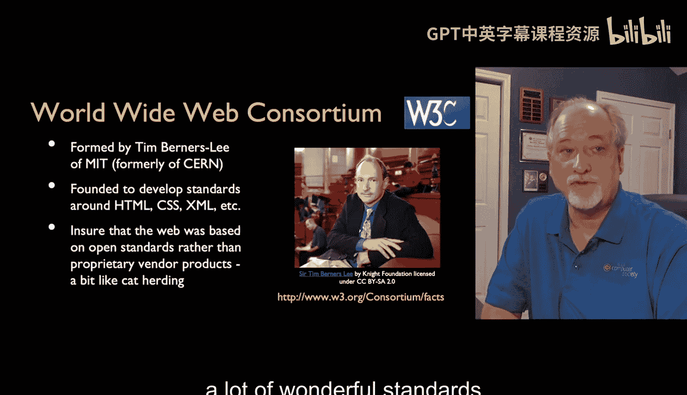
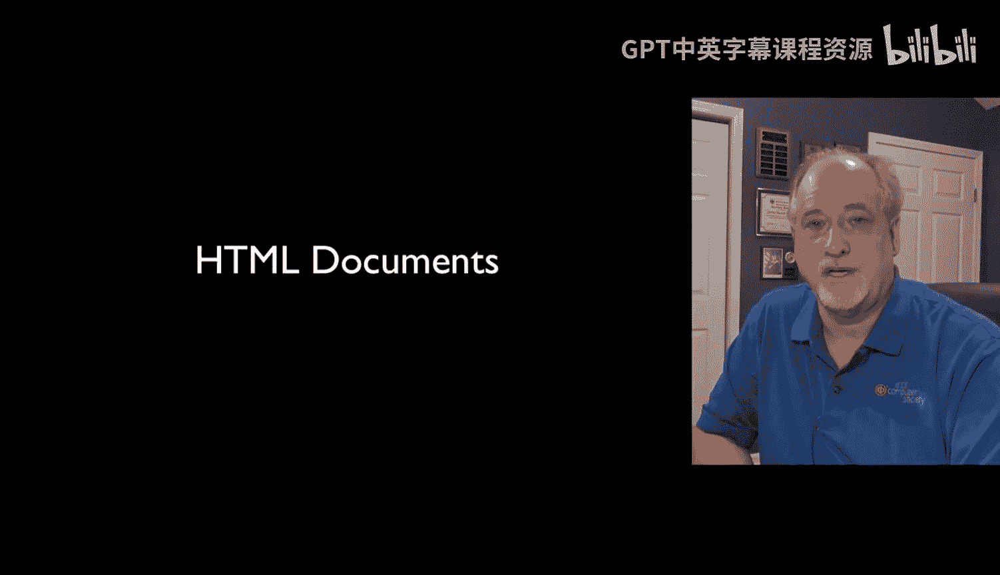

# Django for Everybody：10：HTML超文本标记语言第一部分

## 概述

在本节课中，我们将要学习超文本标记语言（HTML）的基础知识。我们将了解HTML在请求-响应周期中的位置，回顾其历史发展，并探讨编写规范HTML的重要性。

## HTML在请求-响应周期中的角色

上一节我们介绍了Web应用的基本通信模型。本节中我们来看看HTML在其中扮演的具体角色。

当我们点击一个链接时，浏览器会向网络服务器发送请求。服务器运行代码，可能查询数据库，然后生成响应。这个响应通常就是HTML。浏览器接收HTML后，会解析它并构建文档对象模型（DOM），最终呈现出我们所看到的网页。

在本讲座中，我们将主要关注响应部分，即HTML本身，以及它如何被解析和呈现。

HTML是一种使用特殊字符（如 `<` 和 `>`）来添加标签的技术，这些标签用于指示我们希望在网页上看到的内容。例如，`
` 是段落标签，`<strong>` 标签使内容加粗，`<em>` 标签用于强调。

我们通过这些标签来“标记”内容，从而传达语义信息。

## HTML与Web的演进

Web技术，包括HTML和超文本传输协议（HTTP），是相对近期的发明，至今发展不足三十年，并且仍在持续演进。HTML和CSS正处于技术的前沿。

回顾早期，HTML的设计初衷与今天大不相同。在20世纪90年代初，它运行在NeXT计算机上。早期的浏览器，如来自CERN的NeXT浏览器，每个内容都在新窗口中打开，图片也不是内联显示的。随后出现的NCSA Mosaic是第一个在UNIX、Windows和Macintosh上普遍可用的浏览器，它具有灰色背景、蓝色链接，访问过的链接会变成紫色。

早期的网页与今天我们所见的截然不同。那时，人们仅仅因为能够点击链接并看到事情发生而感到惊奇和满足。而今天，商业利益驱动着网页必须设计得极其精美，关注像素数量、元素对齐、布局和导航外观。因此，我们现在需要创建美观的网页，而在过去，能拥有一个正常工作的网页就足以让人惊叹。

当然，计算机性能已大幅提升，能够处理视频和图像。在过去，图像对网络带宽和计算机显示时间来说成本都很高，这影响了当时网页的设计方式。使用“时光机”（即互联网档案馆）回顾这些旧网页是件有趣的事，你会发现其中很多仍然能够工作，这本身就很神奇。

## 早期HTML的“狂野西部”时代

在早期，HTML有点像“狂野西部”。浏览器不希望显示“破碎”的HTML，因此它们会主动补偿错误。

那时，标签可以是大写的，段落标签可能没有闭合，列表标签可能没有结束，属性甚至可能没有用双引号括起来。存在各种各样不规范的情况。实际上，你可以把这样糟糕的页面代码放入浏览器，它仍然会尝试显示。

所以，虽然从技术上讲HTML是一种非常精确的语言，并且你可能犯语法错误，但浏览器在解析HTML时极其灵活。然而，这并不意味着你会得到可预测的结果。浏览器可能会进入所谓的“怪异模式”。

## 标准化与W3C的建立

为了建立我们今天所拥有的标准环境，万维网的创始人之一蒂姆·伯纳斯-李帮助成立了一个名为万维网联盟（W3C）的组织。

W3C决定，不能仅仅让各个浏览器厂商自行定义HTML，而是应该编写一份规范来定义HTML是什么。然后，多个厂商可以基于此规范生产浏览器。虽然这花费了一些时间才取得成功，但由于每个厂商都需要构建浏览器，他们与万维网联盟合作，在90年代中后期（大约1994年至1999年）制定了许多优秀的Web标准。

## 编写规范的HTML

一旦我们有了规则，我们就倾向于遵循这些规则。

因此，标签需要小写，像 `src="image.jpg"` 这样的属性必须用双引号括起来，必须有开始标签和结束标签。现在，我们对HTML的要求更加精确，并尽可能规范地编写它。

这样做是为了从浏览器中获得最佳的性能和渲染效果。如果你不编写规范的HTML，浏览器将自行决定如何渲染内容；而如果你编写规范的HTML，你才能真正控制浏览器的布局方式。

## 总结

本节课中我们一起学习了HTML的基础知识。我们了解了HTML在Web请求-响应流程中的关键作用，回顾了其从早期简单、容错性强的“狂野西部”状态，发展到今天由W3C标准严格规范的过程。我们认识到，编写规范、精确的HTML对于确保网页在不同浏览器中具有一致的外观和性能至关重要。

下一节，我们将深入探讨HTML文档本身，查看一些HTML示例，并详细学习HTML的语法。