# 密歇根大学《给所有人的Django课程（简介、开发Web APP、特征和库、JavaScript和JSON）｜Django for Everybody》中英字幕 p11 11_03_04_WA4E-HTML超文本标记语言第二部分.zh_en -BV1Kt421V7EE_p11-

Welcome back， So let's talk about some of the basic syntax of HTML。

 The first thing is to look at the overall document layout and they start with an HTML tag。

 you might have a thing called a doc type up here and we can put in one if we like。

 but HTML is the outer tag and then there is a head tag and an endhead tag and this is sort of non-printing information we set styling up。

 we declare the title of a page， perhaps load some JavaScript and then the printable page of the content is in between a body tag and mostly what we're going to talk about is the stuff that we put in as page content。

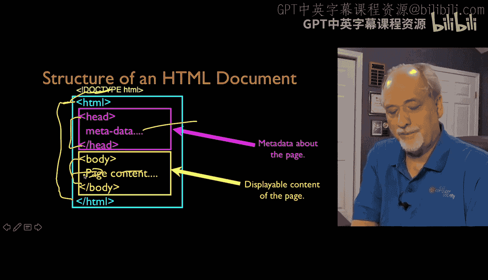

So you'll find that there are special file names that we use。

 it really has to do with the fact that what we do is we make a directory within the web server and when we go visit the directory。

 the web server looks through a series of files that it' configured to look to things like indexed。

html indexed。htm or index。php and each one has a slightly different order in a slightly different set of things it might even be called default。

hm or default。asP if you're on a Windows box it is configurable so different systems do things differently。

 but usually index。hm is probably the safest thing unless you're doing php。

 which we will be doing later in index。phP and so those are usually the safebed Now when you're viewing things off of disk which we can do if you download all the code that I've got in htl。

 zip then you'll have to open the index。html by hand。

So we can put multiple files in the same directory and then we can use them in what are called relative links and so we can create easily create links between one file and another and so you'll tend to see if you look at the zip file that you've got a whole bunch of files in the same directory and with little anchor tags they point back and forth between each one。

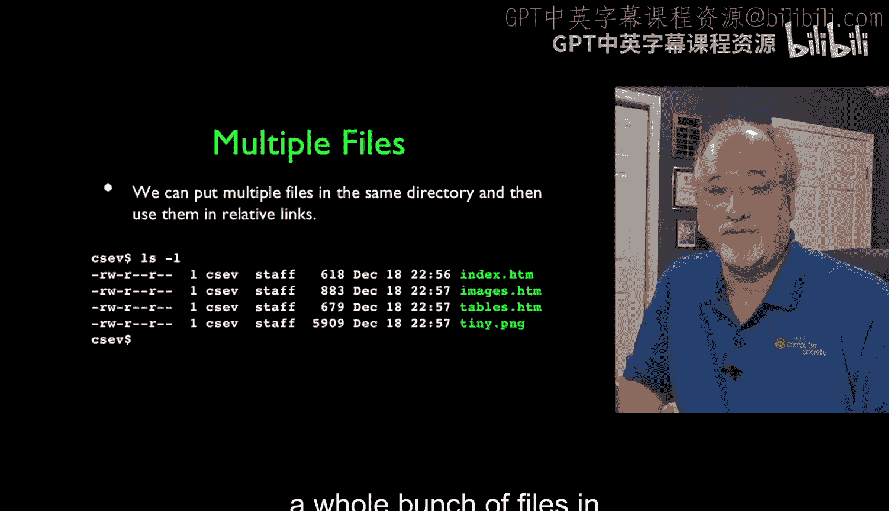

And so like I said， you got tags like the paragraph tag， the strong tag and the emphasize tag。

 they have to start， they have to stop， but another thing that's really important about HTML is the fact that most of the time we are logically marking up the text and so we're saying we want this。

Stuff right here to be a paragraph， but the end of the lines that we put in the HTML that we write are not really that important What happens is is depending on the width of the browser。

 if you change the width of the browser，The text will be rerap。

And that's because there's still a paragraph， but we don't want to hardcode it because we're not working on paper。

 Sometimes browsers are really large， sometimes browsers are really small。

 sometimes you're on a phone right and on a phone browsers really small。

 And so you don't want to tell exactly how many pixels it is wide except when you start doing really fancy layout but in things like paragraphs。

 you just say， hey， make it a paragraph and rewrap it。

 And that also the rewrapping then also changes how tall the pages are because the narrower pages that kind of extends the page down。

 but the white space inside of the HTML is really generally ignored and the lines are generally ignored。

 there are some tags like the pret that changes that。

 So white spaces is respected and new lines are respected。

 but most of the time we just let the browser rewrap things and it's good。

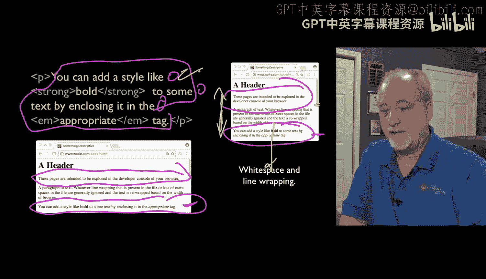

You have beginning tags and ending tag。 So there's a beginning tag。 And then here's the ending tag。

 The slash is our indication of an ending， and they're paired， and they're also nested。

 So this P tag has a strong tag within it and an M tag within it。

 And that's totally okay because this whole thing is a paragraph。 And this is a piece of bold text。

 So they have a beginning and end and slash is the end。

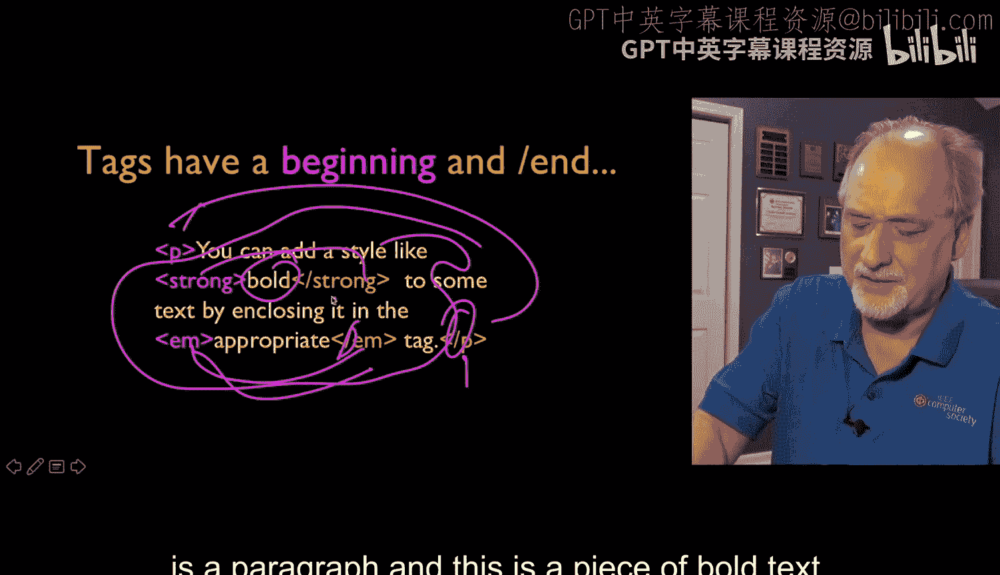

You can also have a self-closing tags that have like an image tag that has like a slash and that means that you don't have to have like a slash image over here that's the same you just put a slash here and it self closeses Another thing that you will get used to is the fact that you can put on the opening tag attributes so key value pairs and you'll go define what you go the documentation on the image tag and it'll say oh。

 put a source attribute on to say what picture what file we want to display as the picture of the image tag is to show pictures basically。

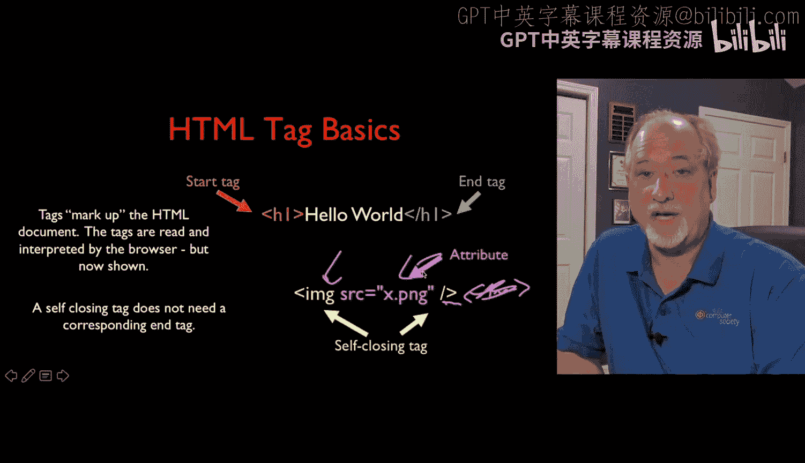

So given that less than and greater than in other things are special characters。

 we have to have a way to print the special characters so how do we print a special character well we use Ampersand LT semiical and there's a whole list of these things HTML special characters。

And you can look them up and you don't there's some that are kind of fun like the special characters for the decade to cards。

 there's mathematical special characters and you go look these up and you can find them The key thing is you don't you know they're cute and you'll see that I'll use some of these arrows in the things that I'm doing but the key ones that you really need to know about are less than greater than an amp or cent and just。

Because Ampersand becomes a special character， less than greater than our Ampersand are really the special characters in HTML。

And and so to represent less than you do am% LT am% GT and M% percent MP semi going to get those things right HTML comments like in any programming language。

 any situation， the start of an HTML comment is less than exclamation dash dash it's a little clunky but we just want to make sure it's really clear and so dash dash less than comments can go across many lines if that's what you want to do so that works as well。

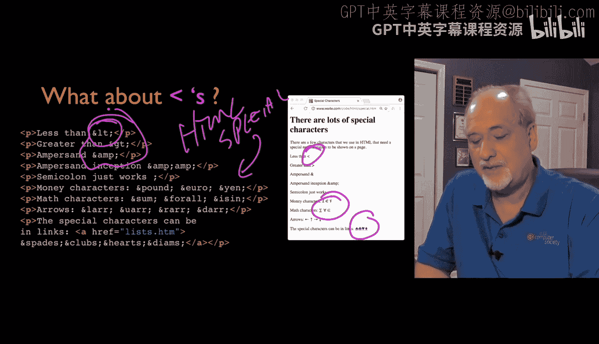

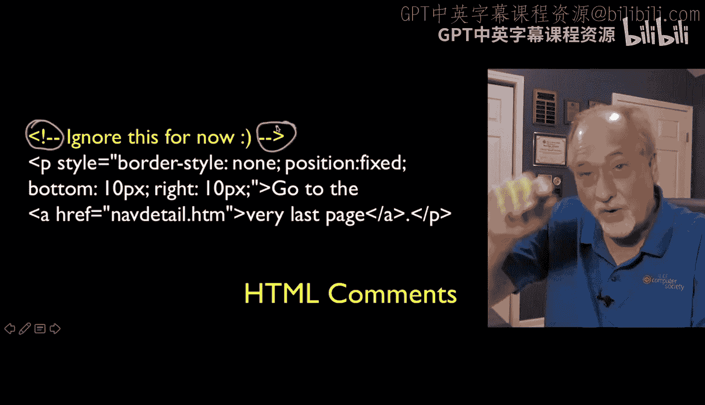

Links is a critical element of HTML is why search engines work。

 it's why you know when we were first when I first saw it。

 I'm like I click on the thing and there's a new page。

 isn't that amazing right and so hyperlinks is the H in HTML。

 it's the H and HTTP and so it is how we in effect use this thing that we're sort of just scribbling on to create knowledge that Google then can extract。

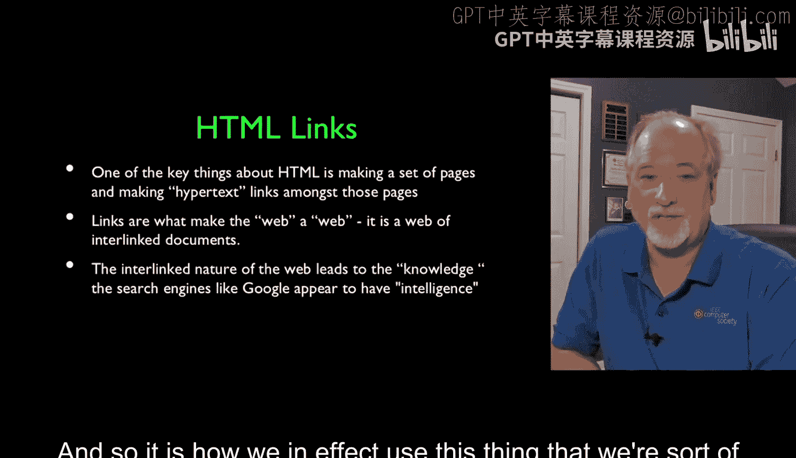

And so the anchor tag， the A tag is the tag that we use to do these things and so you know there's a header one。

 a paragraph and the anchor tag has this is the start tag and this is the end tag and so the text that's clickable is second page and you can see that it's clickable right there it is styled with a underline and blue to indicate that it's a link and and so there is the HR which stands for hypertext reference and then it's a attribute so it's key value with double quotes and then this is another URL and so that's like in effect putting that URL up and going into that next page so it's a hotspot。

In the early days， and I'll show you a few of these， these links were like the coolest thing ever。

 And so we made them pretty colors like the blue with the dash。

 People didn't sort of when they first saw the web， they didn't know to click places。

 So we sort of dialed them quite brightly。 And then because you were often。😊。

Scanning and searching the whole web because the web wasn't so big in the beginning。

 we would mark them as purple after you'd been to it。

 so you could sort of slowly but surely work your way through the whole internet as it existed back in the old days and keep track of the ones so you didn't have to go back to the ones that you'd seen before。

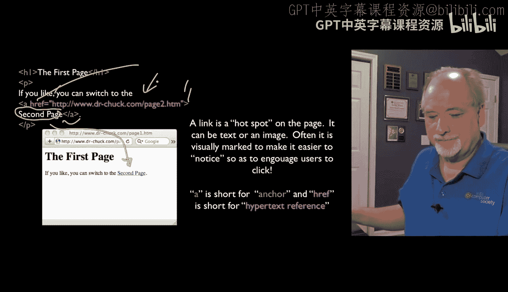

And that was an absolute link and here's one with a relative link and that assumes that we are now in the same folder。

 same directory on the server where we have A HRF and so here's the start tag。

 here's the end tagag and then first page is the clickable stuff and you'll note that that is a purple link because I have already been there because page1。

hM was exactly where I just came from and so you click on that and you can go back and forth and those are the pages we played with in the HtTP lecture。

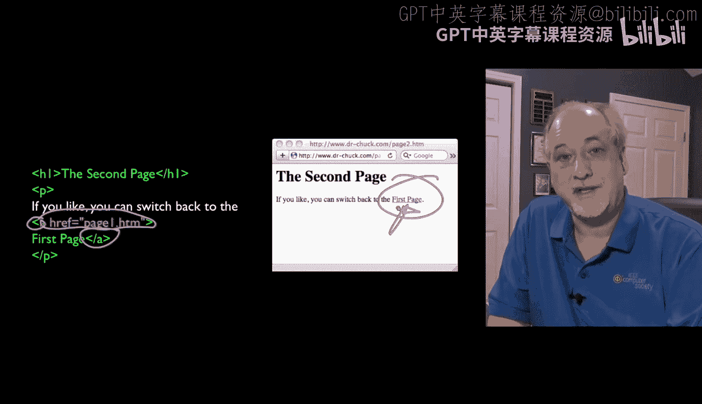

And so these absolute references are references that start with， you know HtTP or HtTPS or whatever。

 and relative references don't。 And so that basically means that this page1。

hM file has to be in the same folder as whatever file we happen to be viewing right now on the same server。

 so if you want to switch folders or switch servers。

 you have to use absolute references and if you are just moving between files on the same server you can use relative references。

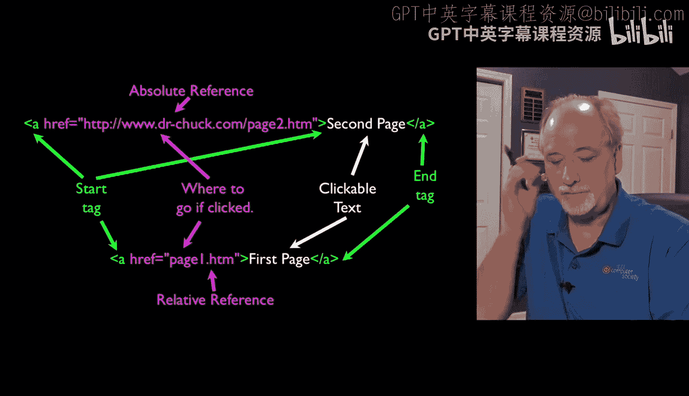

Images are a big a lot of fun and CSS will see how to wrap text。

 one of my favorite things was to wrap text。 There is an image tag which we saw before image and then the source equals is the attribute and then in quotes the name of the file and you know it can either be an image that's all by itself in this case it's this paragraph is what we're seeing and you can see that this image is a tiny image but it's sort of like blah。

 blah blah blah the image right here works kind of like a character you got to be careful because the image is can be really big that's why we had a tiny image and you could even for example in this case I have an anchor tag。

And the clickable part of the anchor tag is an image。

 so if you click right there that will move you to list。htm。

And so you can make an image be hypertext reference as well now we're going to do much more with these things and this is just at this point the basics lists are an important part of HTML。

 there's ordered lists and unordered lists and so the unordered list starts with the UL tag and ends with the UL tag and then that sort of bounds the whole list and then each list element。

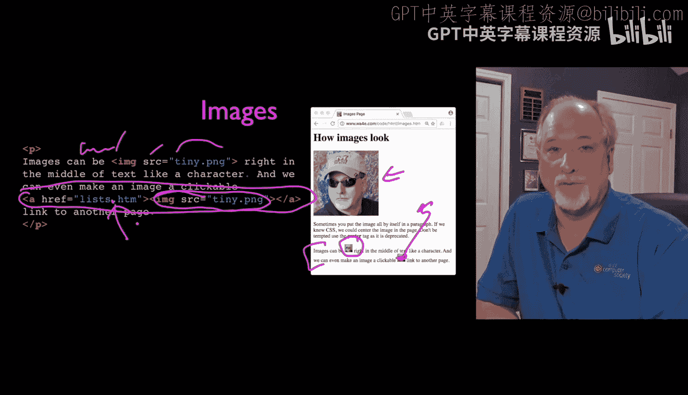

Starts with an LI list item and slash L and I want a little bit of spacing if you don't put them in paragraphs。

 you don't quite get the default spacing this blank lines really coming from the paragraphs。

 so I'm putting a list of paragraphs basically it doesn't have to be a list of paragraphs you could make a little denser list with a list of links or something but I'm putting paragraphs in。

And so you can see that I have LI to NLI， L to NLI I'm putting some links in here， et cetera， et cea。

 and so dot dot dot dot dot and it puts all the bullets in， it does the indenting automatically。

 we'll see in a bit how we can control all that formatting and do different things if we want to do those different things。

 but for now we're just going to play with the default formatting and learn the HTML。

 which is our way of representing that we want to list on the screen。

 but we're not so fancy about exactly how it's supposed to look so in HTML we really are looking for the meaning of the page。

 not how pretty it is。

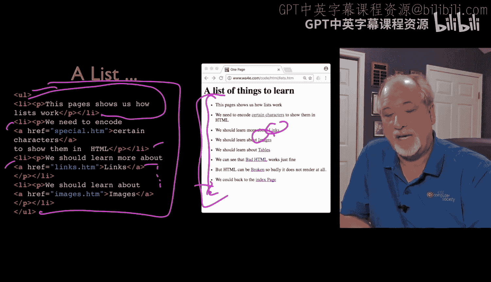

Tables tables have a bit of a checkered past in the early days。

 people tended to use tables to lay pages out on grids and they would just put you know a paragraph here and a paragraph here and then a paragraph underneath it and they would move to move them around and they would put images in some of the table cells and that turned out to be really bad and that notion of tables is graphic layout is long gone and we use CSS now which is the next lecture。

So but tables were always a good idea for tabular data。

 and so if you have something that sort of makes sense is like a list of cars with some make model mileage columns and a list。

 then you mark them up and so the table markup is pretty straightforward。

 we start a table with the table tag and then we have a series of rows using the TR tag。

TR to slash Tr and then if there's a header line which can be formatted a little bit different you know we do a T to slash T and then this basically says it's going to be a three column table because we have three table headers1。

2，3 And then we're going to put TDs for the data TD stands for data123 And so that's the Ford edge and then mile of that and on and on and on and on as we go and so it's not hard to build them you kind of have to keep track of how many of these things you've got and there are tricks where you can make a table that has like four things。

But then in one row， this expands so that that's I can't erase it。 cant erase it。

 So there are ways to do things where call a data element spans more than one column call span。

 for example， but its the key to tables is that we use them for tables。

 We don't use them for arranging things that are not themselves row， row， row， row， row。

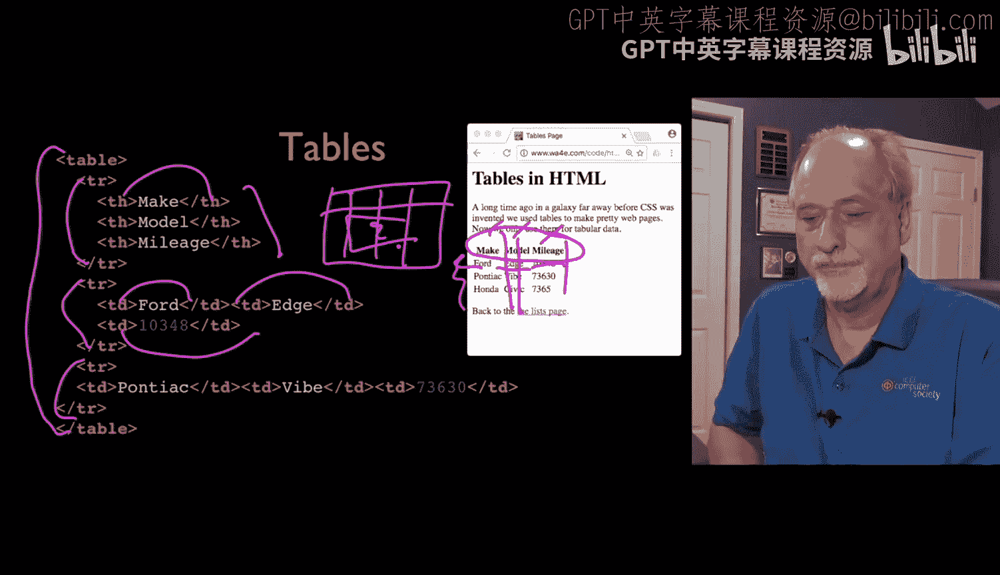

So I'm going to stop there， I'm going to record some exploration of some sample code at wwww4 e。

web applicationsforeverbodydy。com/code/ht and I really am intending that you will these are very simple pages but the idea is to look at them in developer mode and take a look at them and then you can see how the various things work and you can also then look at the source code and see oh here's how a pretag works or where's the pretag no。

哦。Yeah， so we look at the source code， take a look at things and show that the line wrapping does not actually matter。

 we look at pre tagag in another one， it I'll record some walkthroughs of all this sample code and but I encourage you to take a look at it because it has a lot of good examples of the basics of HTML。

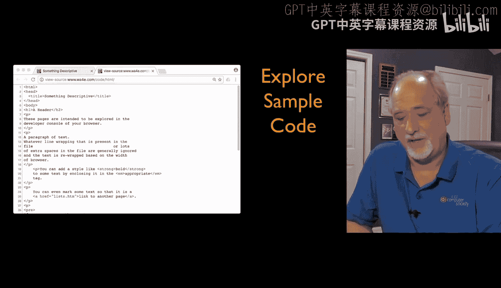

And so HTML is a continually evolving thing， it's a very creative space， it's a lot of fun。

 to be really we have to avoid the temptation of trying to make everything look pretty in the HTML。

 but instead delegate that to the CSS， which is what we're going to talk about next。

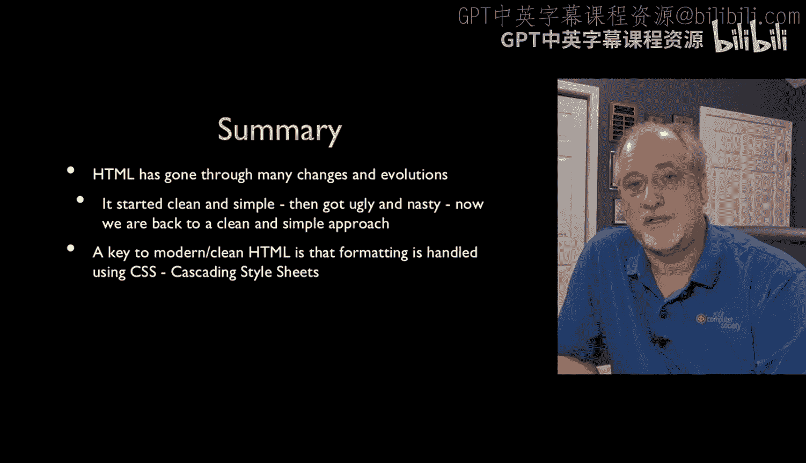