# 密歇根大学《给所有人的Django课程（简介、开发Web APP、特征和库、JavaScript和JSON）｜Django for Everybody》中英字幕 p16 16_04_04_WA4E-CSS层叠样式表第二部分.zh_en -BV1Kt421V7EE_p16-

So welcome back Now we're going to talk about how you use CSS within HTML。

 how you take these CSS rules and apply them to the various parts of HTML。

 and there are three basic ways that we do this， One is we take an HTML tag and use the style attribute and just put those little CSS key value you know CSS settings right there very close The other thing is you can put it in the background of the HTML document usually in the head area and the other probably most common thing。

 especially when the styles get large is an external style sheet that's a separate loaded file with a separate request response cycle。

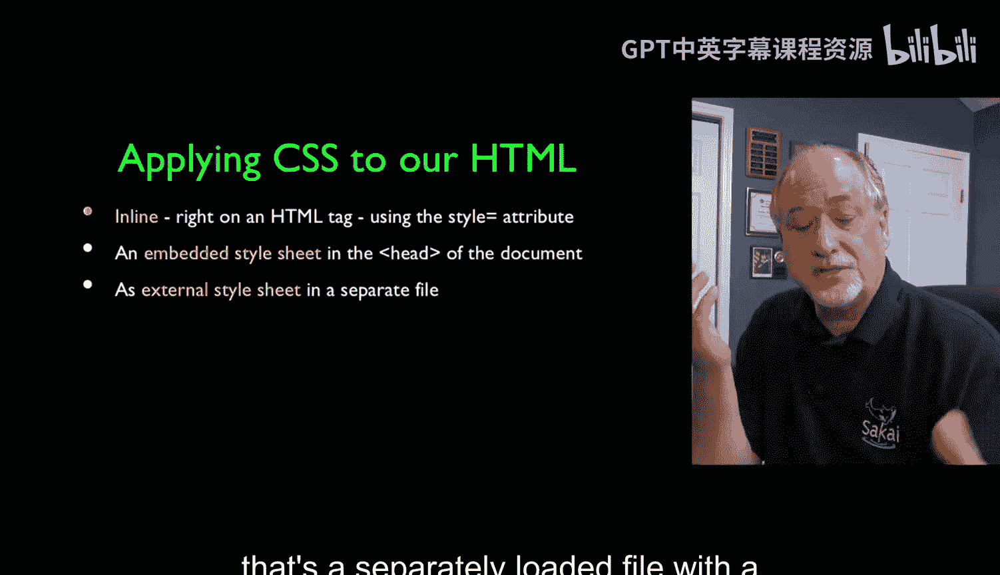

So we'll start with sort of the simplest but sort of least used of these things and that is。

 like I said， you can put a style attribute on any tag and you say any attribute you know you say it's got a double quote and a bunch of stuff in another double quote and in there is a series of CSS rules that are basically CSS setting like border style colon and then the border style setting that you want。

 And so in here I'm saying I would like a solid border。

 I would like it red and I'd like it to be five pixels and that effectively determines how that particular thing gets painted right in this particular one I said font family monospace for that particular paragraph so this paragraph is painted with a font family monospace and so you can just put these things here I put on the body tag I want an aerial Sans font。

 So the whole body is not times new Roman except for the fact that this particular one is monospace and so these two tags are rendering opinions about what the font supposed to be。

But because this one is closer， the monospace wins here。

 but the aerial wins everywhere else because none of these other tags render an opinion and so that's kind of the cascading bit。

 meaning the closer it is， the more priority that it has unless of course they put important up here and important is something we'll talk about later。

 you can make be farther away override the local， but it's not something you want to use too much if you're using important that's a trouble。

 but don't worry about important right now。Just imagine cascading means the closer the higher priority。

 closer to the tag the statement of CSS is than the higher priority that it is。

 So another place that you can put the CSS is right there in the header right So instead of putting it on a tag we can use a style tag in the header And so here we have the header of the document right the head the body starts down here。

 And up here we're going to set a set of rules。 And now we're using the thing where we have to say which thing a tag it goes to。

 So now I can say the body tag even though there's only want a body tag we want a font family aerial sor。

 And because。

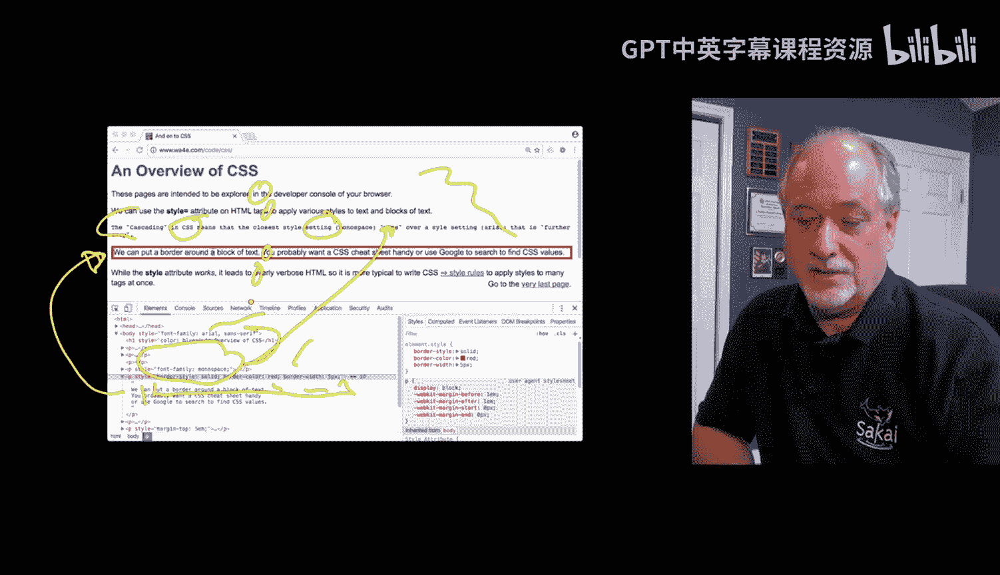

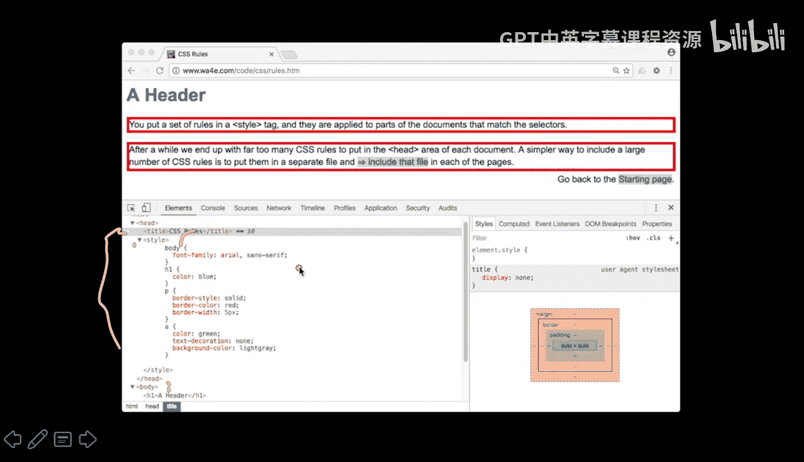

They're all inheriting from the body tag， then all the paragraphs inherent from this and the headers inherit。

 et cetera， et cetera， so it's like body on down in this particular case。The header1。

 which is this is blue and paragraphs are supposed to have a solid border， red， five pixels。

 and so border style border color， etc cetera。 and that means that each of the two paragraphs here are away you go and I'm going to dig into the anchor tag and here's my little anchor tag and I'm telling the anchor tag that I would like to have a green font and I would like no underline the default is to underline them if you look at links they're always underlined。

I'm overriding that and then I want the background color of that text to be light gray。

 and so this is a set of rules all that HTML is down here lower down and there are no style tag。

 there are no style attributes on the tags because we have basically said for all paragraph tags。

 for all anchor tags for all H1 tags， and for all body tags and we put it up here in the top of the document。

Now the problem is lots of most websites have multiple pages and this gets really frustrating after a while。

 so you really want to pull some of those widely used or repeated things out into a file and include them and all we do is take pretty much that same set of CSS rules and we put them into a file and in this case we'll put them in the same file。

 same directory same folder as the HTML although you can put the you can pull these things off of a website if you want so HB colon slash slash or whatever but you put a link in here until it's a CSS and it's going to be a style sheet and then you give it an HR which is then going to pull this file in and sort of expand it is right there in the middle of a style tag and so it knows it's a CSS and it pulls it in so that's how you change your HTML。

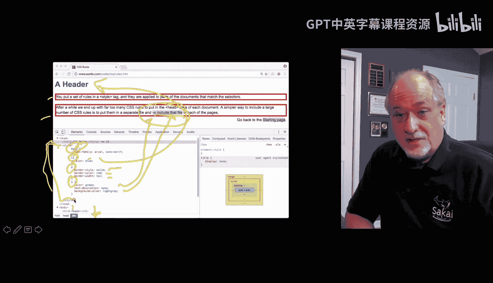

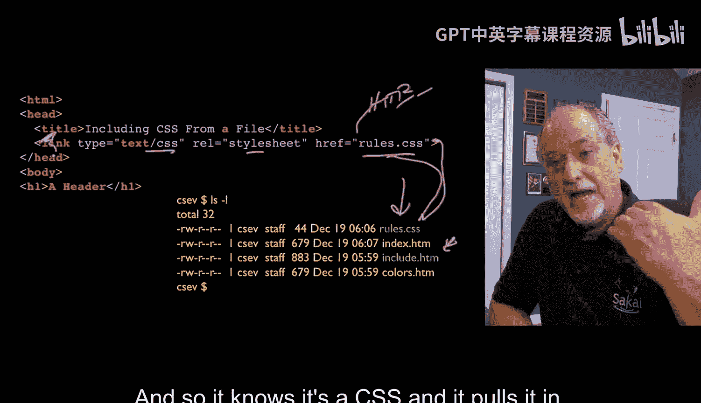

So now if we take a look at the next example we see that in this next example we've got a link right and down here we've got no style。

 ignore this little thing that's how we're putting this little don't ignore that page but in the real stuff here you know we've got this we've taken our you know weve got our pretag we've moved it in。

 we've got some things here we've got we've got all that stuff that we've done right and if you look。

Here is that rules。css file rules has all that same stuff， H1 bordercol a tag。

 all that stuff that we put in the head now is sitting in this rules file and we're just pulling it in right here in one fell swoop and it accomplishes the exact same thing and so this including in a separate file。

Is by far a superior way to do it than putting it in the head tag so。

 but sometimes you have to like change two things and you put them in the head tag and you up。

 you know， you use all three of these ultimately， but。

Generally you tend to start with a large amount of CSS in a file and then you tweak in the head and you might tweak on a tag here and there and that's kind of how these three things tend to work together and the whole cascading thing works out well。

 you can put the link first and then style tag second and then it kind of overrides some of the stuff that are during the linked and then you can have something on a tag which overrides the stuff that's in the head。

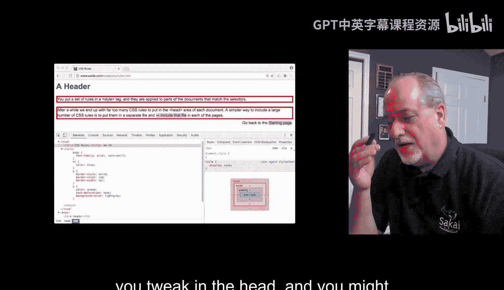

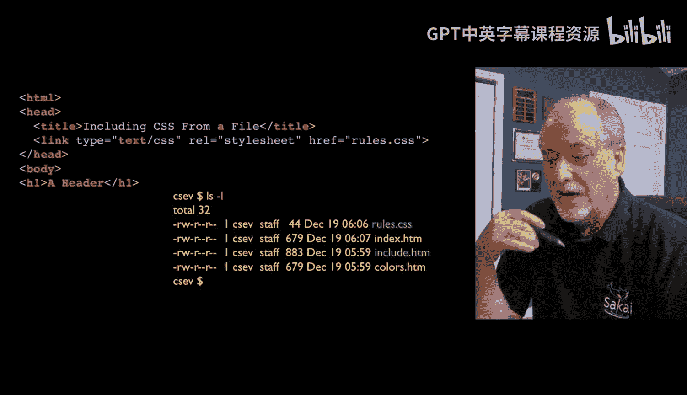

Unless， of course， it says it important。

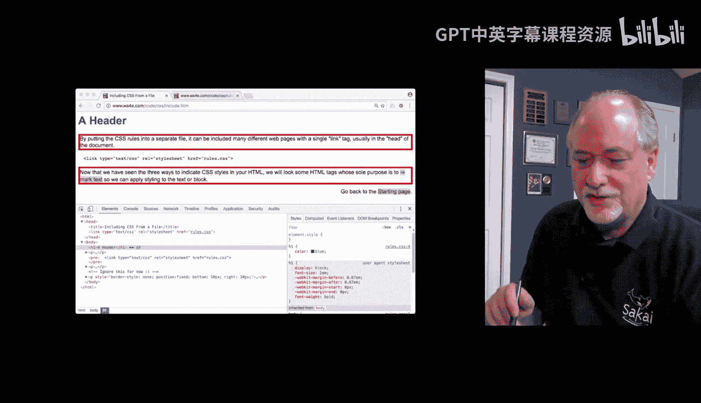

So as the world went from hacking， look and feel in HTML to。You know。

 finally tuning look and feel in CSS。All these tags paragraph H1 body。

 They all had default styles that had kind of evolved。

And links and all that stuff that evolved and a lot of pages depended on those default styles working and so they couldn't say。

Welcome to CSS and now all the styles， a paragraph that's unsled will look terrible。

Not that they look great。And so what we couldn't take the paragraph tag。 everything had a style。

 That's the problem all the existing tags had a something on them。

 so they had to make new tags and the new tags that they made are the span and the div tags。

 The key to the span in the div tags is span is an inline tag that has no styling associated with it。

 No default styling proof。 It is。Defined as having no styling and the div tag is a tag that has no styling associated with。

 but it's a block tag。 And so we sort of use these to sort of mark text。

 but don't inherit without inheriting any styling from some long ago 199394 defaults。

 And so the span tag is。San tag here。 it's kind of broke over line。

 The span tag has no styling except that styling which you add。 In this case。

 I'm adding it with a style attribute。 And the same thing is true for a div tag， right， The div tag。

 and and also divs can be within div。 So this is a nested div right。

 there's an outer div and an inner div。 And basically you know that styling the div has no style whatsoever。

 right The span has no style whatsoever。 So if you just put something in a span tag and you don't do don't you don't sort of render an opinion about what it looks like。

 the span doesn't change it。 It just as it inherits from whatever else is there。

And so if we take a look at this right so here we have a P tag with a green border。

 one pixel border solid Now the interesting thing is you say well did the paragraph tag have styling it turns out it does it has some margin in padding to make it look better right and so the paragraph tag is not an unsled tag it is expected to create blank space around itself and so yeah we got so the paragraph tag has a default style it's supposed to have a default style but then if you look at the div tags that we've got here like this div tag this div tag remember goes all the way down to here this div tag I just put a blue around so you kind of know what's going on right so this blue goes from here to here。

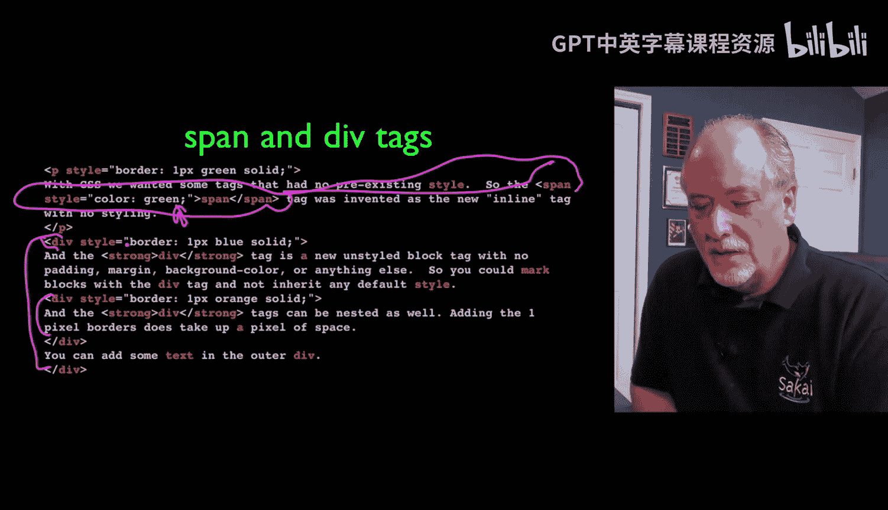

But you can see right away that the div tags have no padding or margin or side a little white space to make them look prettier。

 And that's okay， you've got to do that。 You've got to add the padding in the white space。

 They just start with nothing。 It's just a block。And the span tagag。

 this one here changed it green because we put a style color equals green right there and okay。

 so we did that。🤧Um。And the div tag and you'll notice interestingly。

 because the divs I'm using end up with a one pixel border as their style。

 meaning they start with nothing。 you can even see that if you look really close。

 it's impossible but you can zoom in this orange the blue border takes up space and then the orange borders on inside of it and that's one pixel wide So I'm adding to these through the style attribute。

 I'm adding CSs to them but they start with absolutely nothing and they kind of look ugly when you just like put something in a divs like right next to each other because they didn't want anything And again they're nested and there's reasons because we'll use divs to say this is the main body and then there's divs within the main body and then this is the navigation。

 this is the footer， eta， eta， etc ceter。 And so we have divs are ways to describe blocks without adding CSS styling by default and' as such letting you define all the CSS for you。

So these are。Cool， they're like the non tagags， the untags。

 the tags that don't cause anything to happen， but lets you cause everything to happen。

 so they're really important。

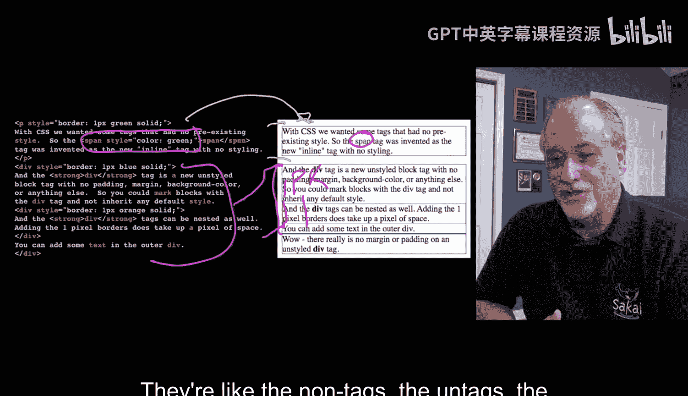

They're really important。 So the next thing I want to talk about is。

Making a sort of finer selection of which tags that you want to apply a rule to right a rule to and so if we look at this tag right here。

 this is the body tag and that basically says I want everything from body to slash body then everything inherits so unless it's overridden I want。

Ariial San serif to happen。Okay and I can do that with a paragraph tag。

 but I want to show you this other thing， so there' is a way to mark a tag。

 let's find this one where's first， first right there。So there's this ID attribute。

 an ID attribute is an attribute that was added kind of specifically for CSS as well and so you can only mark one tag per document with an ID and then there's this class tag and you can mark as many tags as you want in the document with a class tag and the idea is like ID tags or for chunks like main page like left navigation。

 top navigation or something that's only going to appear once on the page。

And so if you want to sort in effect。In effect， what Poundine first means is look through the whole document。

 find a tag。Where's divide equals first， where's that stop？They're right there。

Find the tag that's got an idea first and then paint it with v rules the class。

Can happen more than once once， but more space， let's see classes more space here that's there。

 and so that basically says let's change clear and change color here。

 More space says look through all the document and find all the class There's that that paragraph。

Ooh， do I not close that paragraph， oops， mistake on my HTML here？Yeah。

 so that basically says change the margin left， that means shove this in and change the margin right and shove it in。

 so we'll see all these things。And loud and then you can also see a situation where when you put classes on。

 you can have more than one and so this basically will respond both to the shout and to the loud class Okay。

 so let's take a look at what this page looks like。

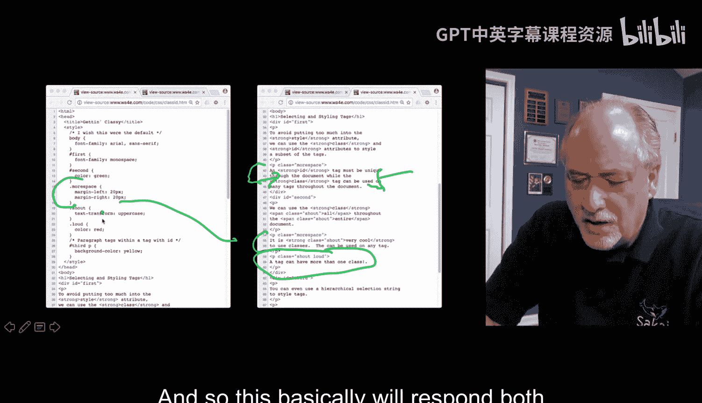

So here we go。It's a little busy。So if we take a look at first， it grabs this tag here。

 the div tag is first。And then if we look at like more space。

 this more space is affecting this one and it's shoving it in both on the left and the right。

 and that's because it's this paragraph more space。Okay， shout， let's find the shout ones。

 and we can see them right here， they're all the loud ones， so that is red。That shout an loud。

OhHere's one that shout， oh， entire has been shouted。And all has been shouted。

 so you notice these guys are lowercase， but shout is a text transformed to uppercase so you can even change the case of things and then like in third for example。

 whereas third at third says within so this says find the third div which is right there and find all the p tags within the third div。

 this p tagag in this P tag and then apply a background color yellow to all those which leads to this right here okay。

And so。Pound sign means find ID and apply， dot means find class and apply。

 you can have multiple classes。Pll in the definitions from two classes， shout space load。

 go find this whatevers in CSS， and then you can kind of have hierarchical things and this is quite useful because you can just you don't have to get special it saves you putting classes on。

It saves you from putting classes on all the paragraph tags here， you don't have to do anything。

 but you don't you're not affecting the paragraph tags outside here。

 you're only affecting the paragraph I think of this as go find third and the paragraph tags within。

Third， and then do something to them and that way otherwise you'd be making more classes than you need to be。

 and so it' this is a very welllike technique for really fine tuning your selection。

 your selector for CSS to touch only the things that you want to touch。

So up next we'll talk about images and colors and fonts and a few other things。

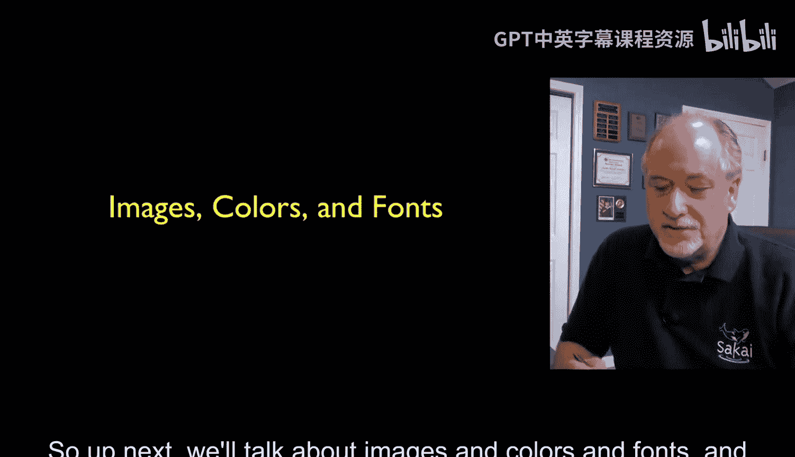