# 密歇根大学《给所有人的Django课程》：CSS层叠样式表第三部分：图像、颜色与字体 🎨

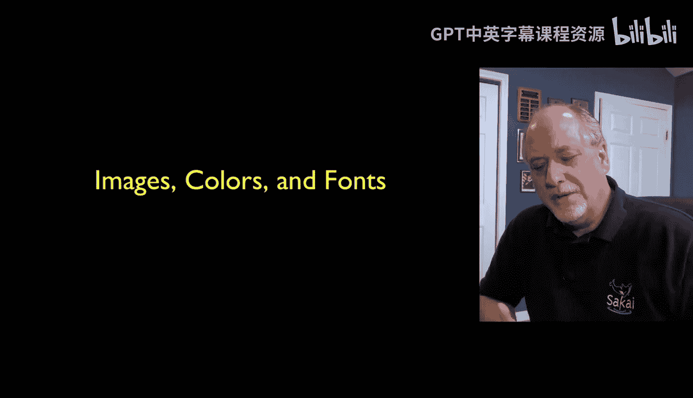

在本节课中，我们将学习如何使用CSS来美化网页，具体包括如何控制图像、颜色和字体。这些是让网页从功能化走向美观化的核心技能。

上一节我们介绍了CSS选择器和盒模型，本节中我们来看看如何运用这些知识来装饰我们的内容。

## 图像与浮动布局

CSS可以让我们灵活地控制图像的位置和外观。一个常见的技巧是使用`float`属性让文本环绕图片。

以下是一个让图片浮动到右侧并添加边框的CSS代码示例：

```css
img {
    float: right;
    margin: 1em;
    border: 2px solid black;
}
```

*   **`float: right;`**：将元素（如图片）从正常的文档流中“取出”，并使其浮动到其容器的右侧。后续的文本内容会环绕它。
*   **`margin: 1em;`**：在图片周围添加边距，`1em`大约等于当前字体中字母“M”的宽度，这能创建舒适的留白。
*   **`border`**：为图片添加一个2像素宽的实线黑色边框。

有时，在浮动元素之后，您可能希望后续内容不再环绕，而是回到左侧边界正常显示。这时可以使用`clear`属性。

```html
<br clear="all">
```

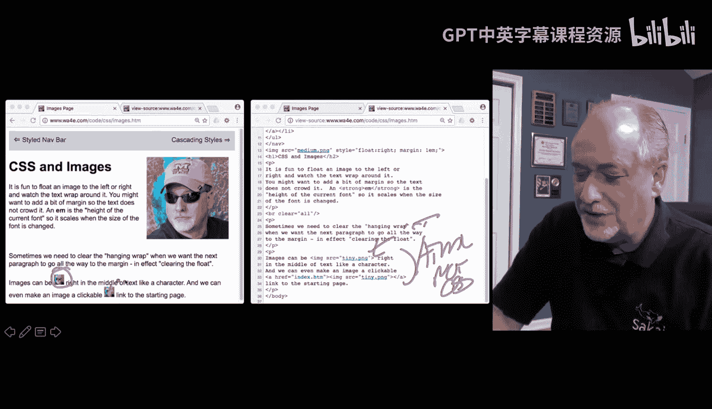

这个`<br>`标签会清除所有浮动效果，确保其后的内容从新的一行开始，不受之前浮动元素的影响。

## 颜色的使用

颜色是视觉设计的基础。CSS提供了多种方式来指定颜色。

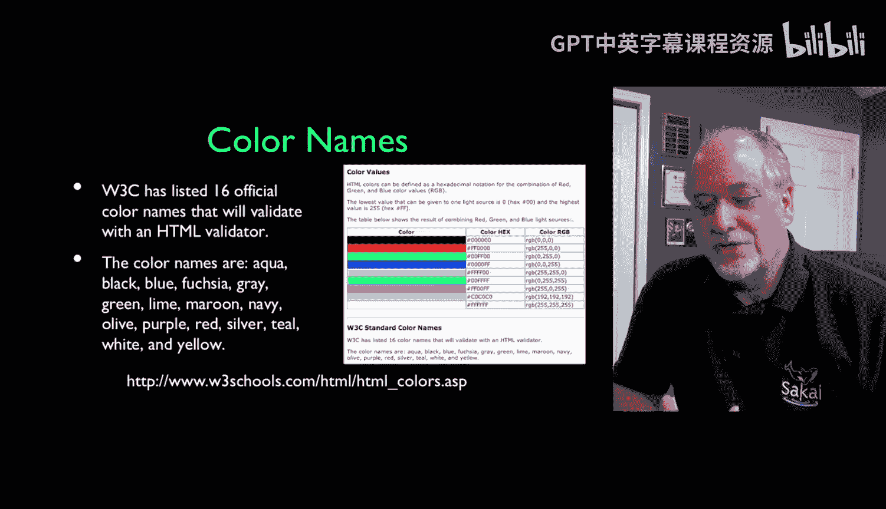

以下是定义颜色的几种主要方法：

1.  **颜色名称**：使用预定义的颜色名，如 `red`、`green`、`blue`。这种方法简单直接，适合快速测试和原型设计。
2.  **十六进制代码**：使用`#`开头的六位十六进制数，格式为 `#RRGGBB`。例如，`#FF0000` 是纯红色，`#00FF00` 是纯绿色，`#FFFFFF` 是白色。每两位数字代表红、绿、蓝的强度（00-FF，即0-255）。
3.  **RGB/RGBA值**：使用 `rgb(red, green, blue)` 函数，参数是0-255的数字。例如，`rgb(255, 0, 0)` 是红色。`rgba()` 则多了一个透明度（Alpha）参数，范围是0（完全透明）到1（完全不透明），例如 `rgba(255, 0, 0, 0.5)` 是半透明的红色。

选择配色方案可以借助在线调色板工具，它们能帮助您创建和谐美观的颜色组合。

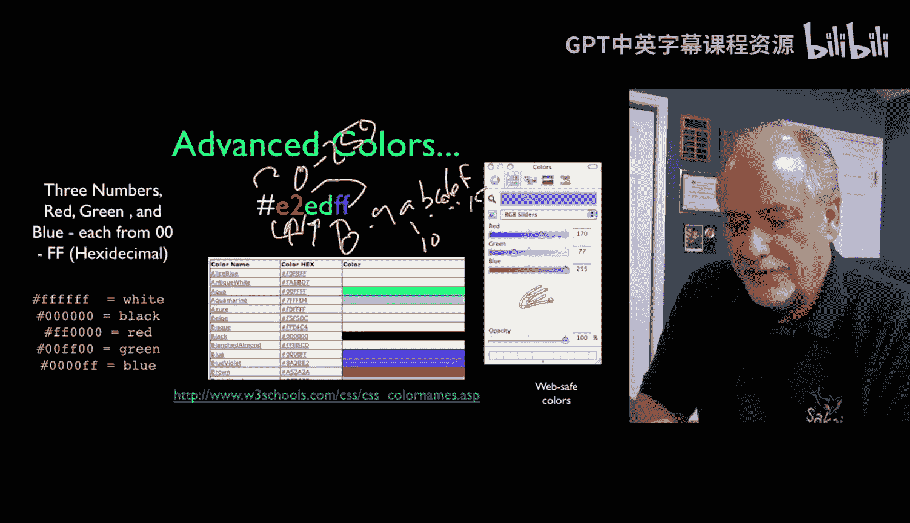

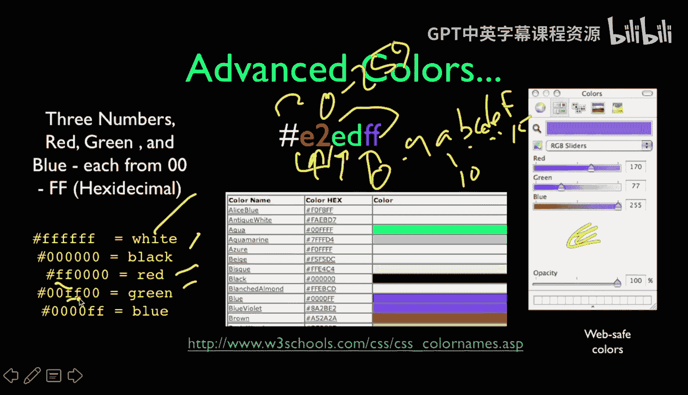

## 字体的控制

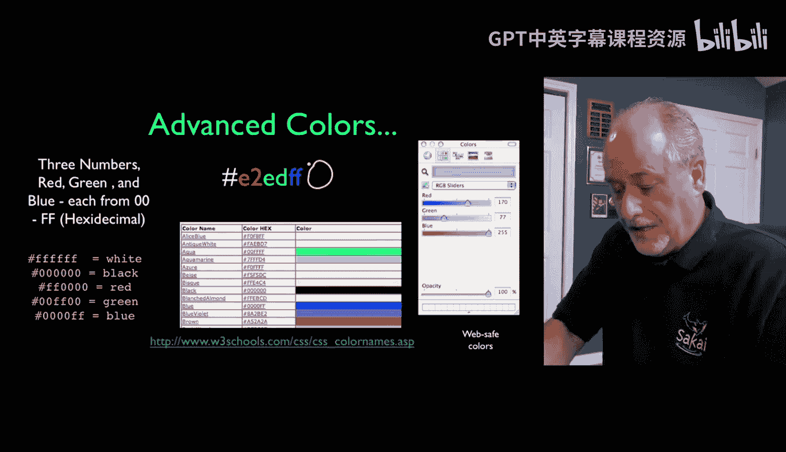

字体极大地影响网页的可读性和风格。默认的衬线字体（如Times New Roman）在屏幕上可能不够清晰，因此通常推荐使用无衬线字体（如Arial, Helvetica）。

设置字体时，需要使用 `font-family` 属性，并提供一个字体栈（font stack）。这是因为不同操作系统安装的字体不同，字体栈可以指定优先使用的字体列表，如果第一个不可用，则尝试下一个，最后以一个通用字体族（如 `sans-serif`）作为兜底。

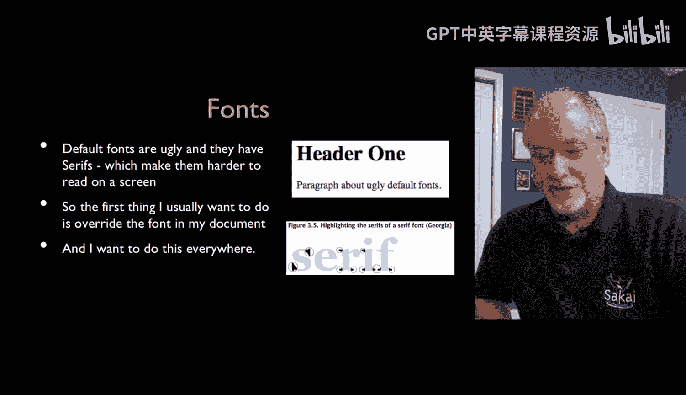

```css
body {
    font-family: "Segoe UI", Tahoma, Geneva, Verdana, sans-serif;
}
```

在这个例子中，浏览器会依次尝试使用 Segoe UI、Tahoma 等字体，如果都不可用，则使用系统默认的无衬线字体。

您还可以控制字体的其他样式：

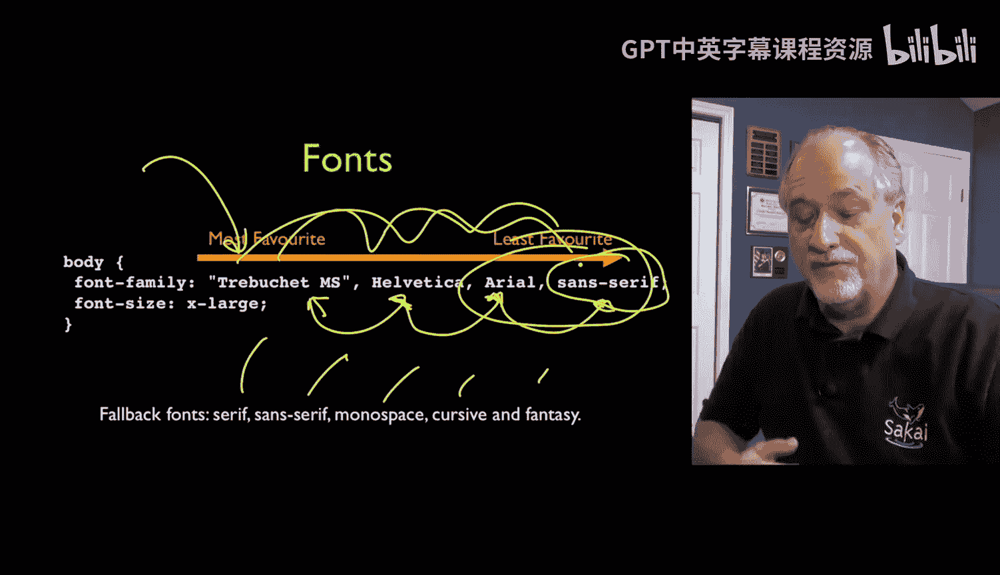

*   **`font-weight: bold;`**：设置粗体。
*   **`font-style: italic;`**：设置斜体。
*   **`text-decoration: none;`**：常用于移除链接的下划线。
*   **`font-size`**：设置字体大小。可以使用 `px`（像素）、`em`（相对于父元素字体大小）、`rem`（相对于根元素字体大小）等单位。相对单位（如 `em`, `rem`）在响应式设计中更具灵活性。

## 链接样式的定制

链接（`<a>`标签）有多个特殊的状态，可以分别设置样式，以提供更好的交互反馈。

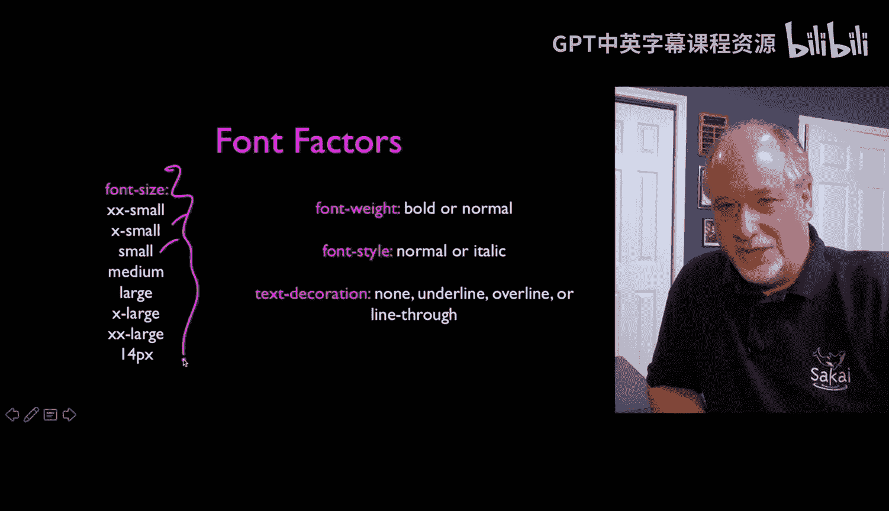

以下是链接的四种主要状态：

*   **`a:link`**：未访问过的链接的样式。
*   **`a:visited`**：已访问过的链接的样式。
*   **`a:hover`**：鼠标悬停在链接上时的样式。
*   **`a:active`**：链接被点击瞬间的样式。

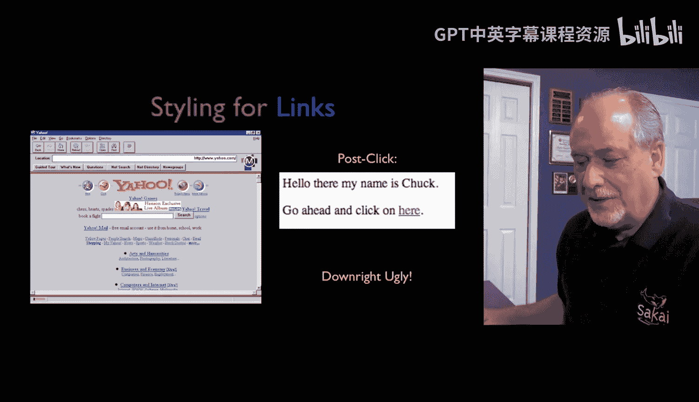

一个常见的样式设置是移除默认的下划线，并在鼠标悬停时重新添加或改变颜色：

```css
a {
    color: black;
    text-decoration: none; /* 移除下划线 */
}

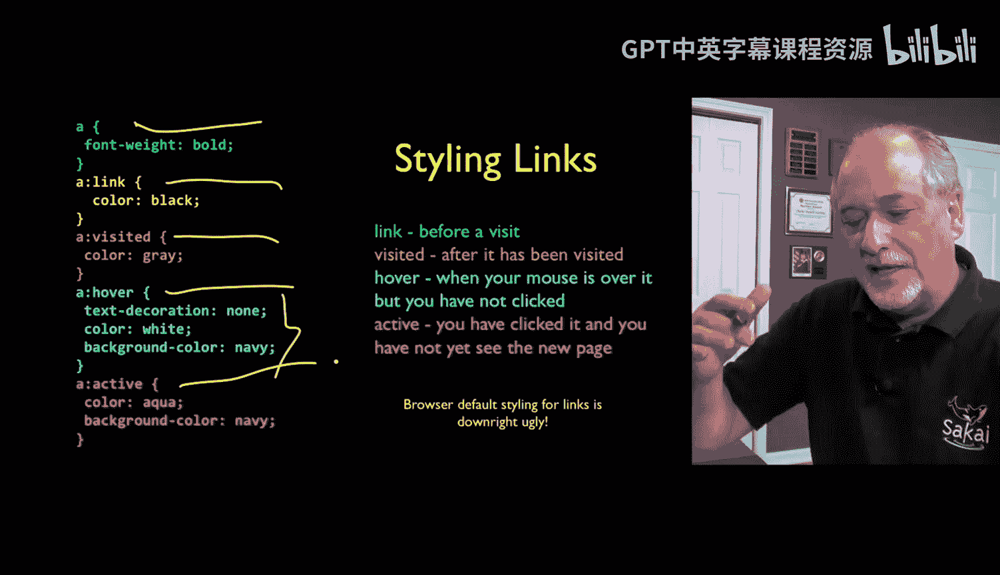

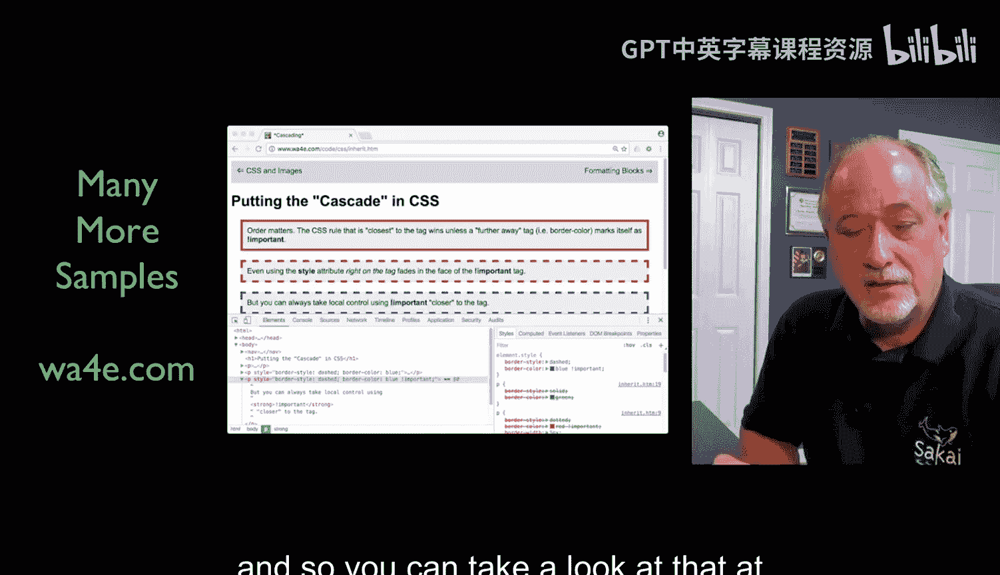

a:hover {
    text-decoration: underline; /* 悬停时显示下划线 */
    color: blue;
}
```

## 总结

本节课中我们一起学习了CSS在美化网页方面的几个关键应用：通过`float`和`clear`控制图像与文本的布局；使用颜色名称、十六进制码或RGB值来定义色彩；通过`font-family`字体栈来确保字体的跨平台一致性，并控制其大小和样式；最后，我们还了解了如何为链接的不同状态定制样式，以提升用户体验。

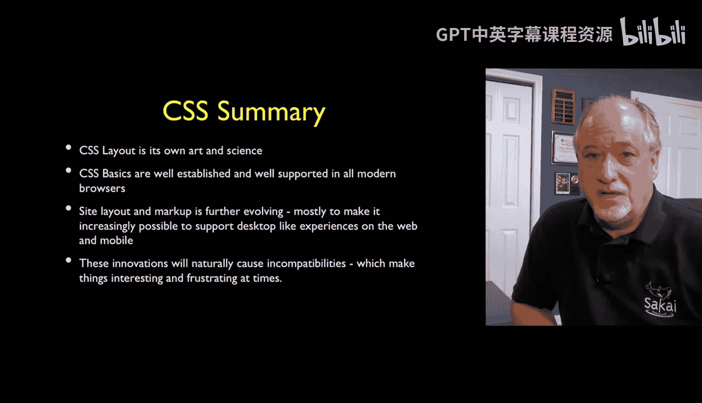

CSS是一门不断进化的艺术与科学，虽然基础概念相对稳定，但新的属性和技术（如Flexbox、Grid布局、CSS自定义属性等）一直在涌现。掌握这些基础知识，您就已经能够显著改善网页的外观。对于更复杂和精美的设计，可以借助像Bootstrap这样的前端框架，或者深入研究CSS的广阔世界。希望本教程对您的学习有所帮助！