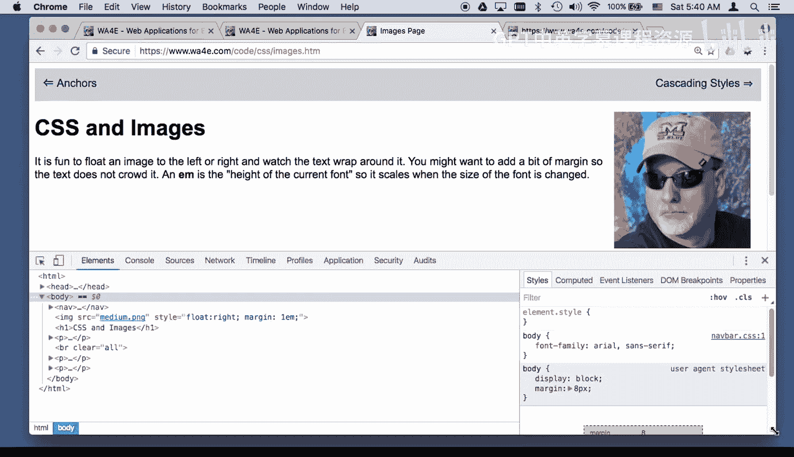
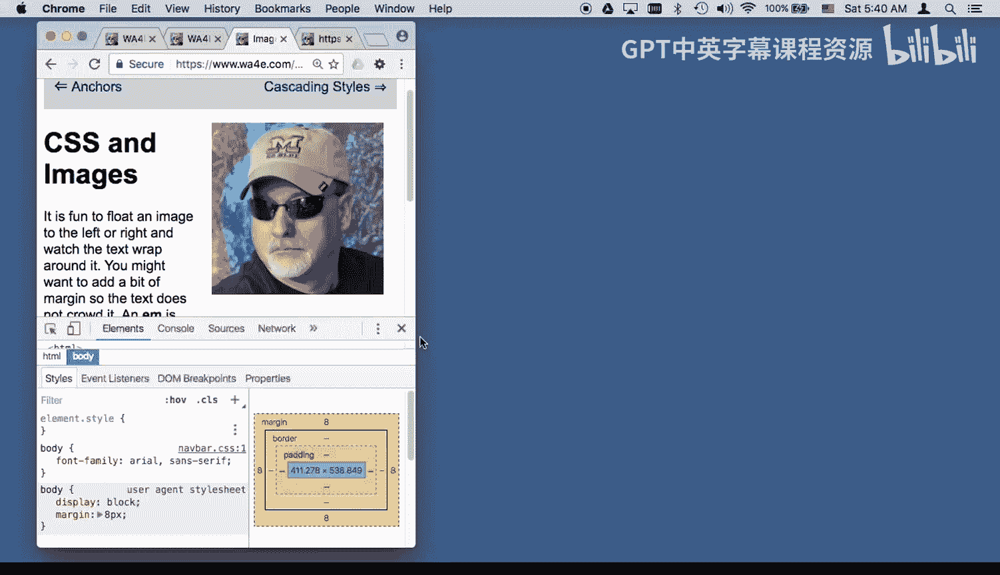
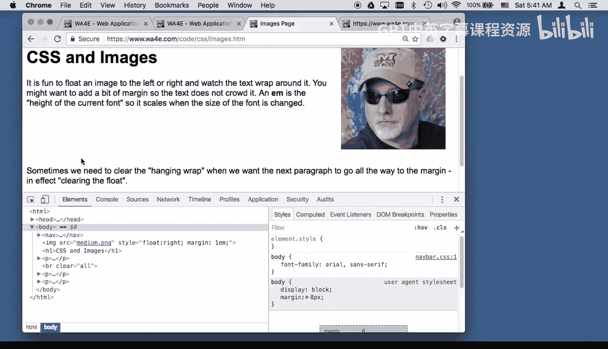
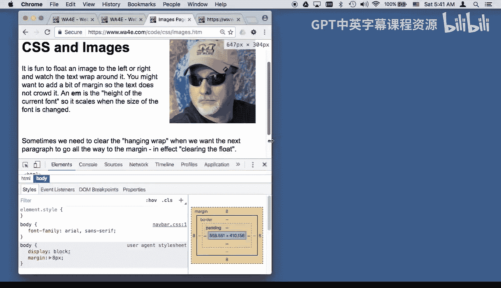
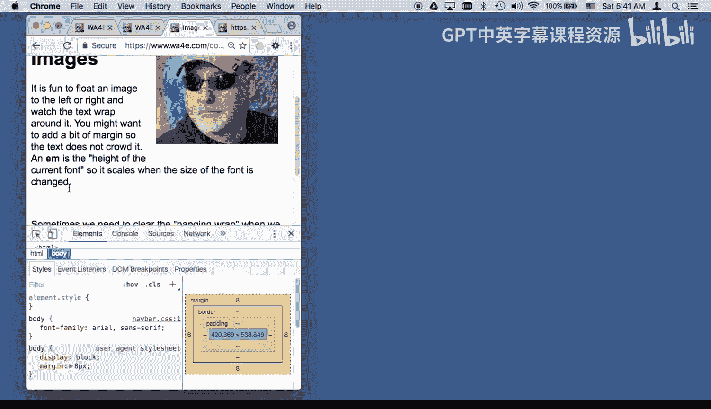
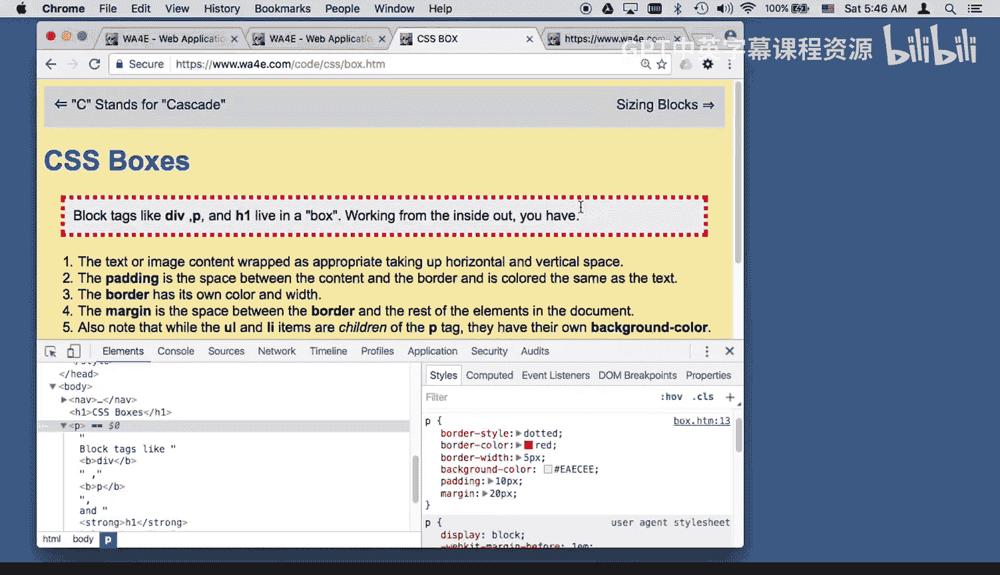
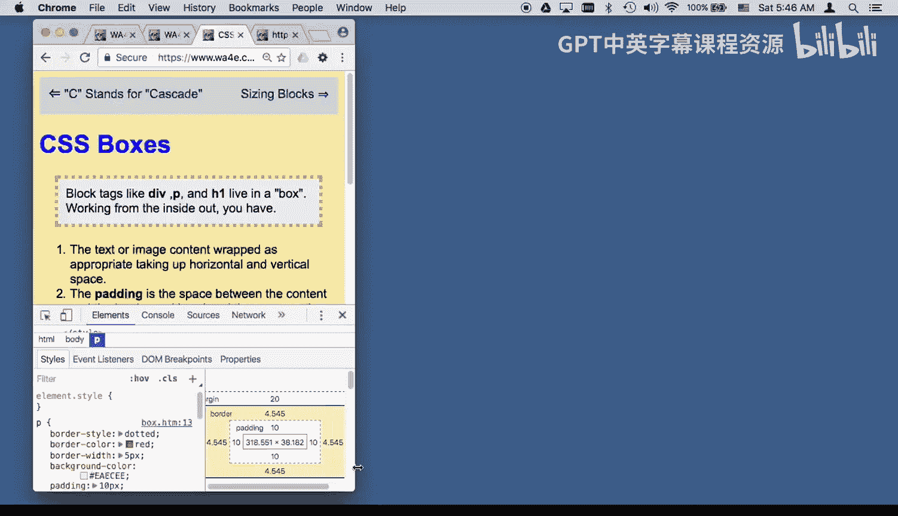
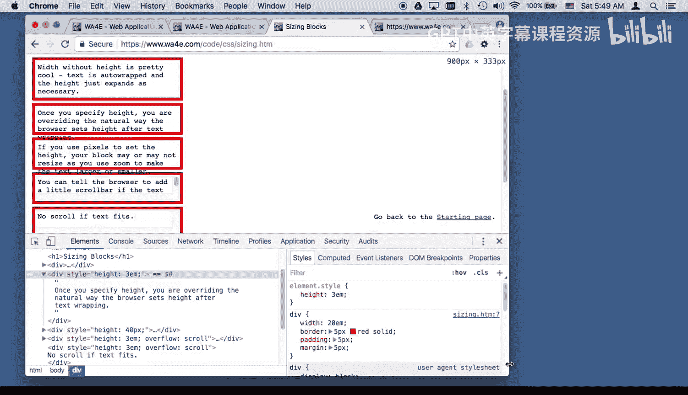
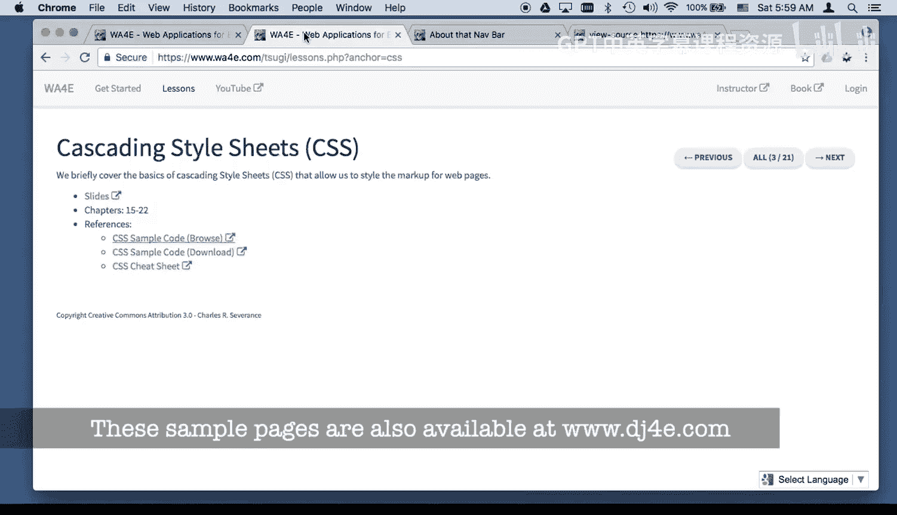

# Django for Everybody：19：CSS代码详解第二部分

在本节课中，我们将继续深入学习CSS，探索字体、颜色、链接样式、图片布局、盒模型、定位以及层叠规则等核心概念。我们将通过具体的代码示例来理解这些样式如何影响网页的呈现。

## 字体设置

上一节我们介绍了CSS的基础选择器，本节中我们来看看如何控制网页的字体。字体是网页设计中的重要组成部分，CSS提供了多种方式来指定字体。

以下是设置字体的几种方法：

*   **使用通用字体族**：浏览器内置了一些通用字体族，如 `serif`（衬线体）、`sans-serif`（无衬线体）、`monospace`（等宽字体）。这些字体在所有浏览器中都有，常被用作备用字体。
    ```css
    font-family: sans-serif;
    ```
*   **使用系统字体**：你可以指定用户系统上可能存在的字体，如 `Arial` 或 `Helvetica`。为了兼容性，通常需要提供一个字体列表，浏览器会按顺序尝试加载。
    ```css
    font-family: Arial, Helvetica, sans-serif;
    ```
*   **使用网络字体**：现代网页设计常通过链接引入外部字体文件。例如，通过 `<link>` 标签从Google Fonts等服务加载字体。浏览器会下载并缓存这些字体以供使用。
    ```html
    <link href="https://fonts.googleapis.com/css?family=Lato" rel="stylesheet">
    ```
    ```css
    font-family: 'Lato', sans-serif; /* 指定Lato字体，并以sans-serif作为备用 */
    ```

## 颜色定义

颜色是美化网页的关键。CSS提供了多种定义颜色的方式。

以下是几种常见的颜色定义方法：

*   **颜色名称**：CSS支持一些预定义的颜色名称，如 `red`、`green`、`blue`。这些名称在所有浏览器中保持一致。
    ```css
    color: red;
    ```
*   **十六进制颜色码**：这是最常用的方式，使用 `#` 开头，后跟六位十六进制数字。每两位分别代表红、绿、蓝（RGB）的强度。
    ```css
    color: #8b4513; /* 一种棕褐色 */
    ```
*   **颜色选择器**：在HTML5的表单中，`<input type="color">` 元素会提供一个可视化的颜色选择器，方便用户选取颜色。选取的值会以十六进制格式返回。

## 链接样式





链接（`<a>` 标签）的默认样式是蓝色（未访问）和紫色（已访问）。CSS允许我们通过伪类选择器来定制链接在不同状态下的外观。



以下是链接的几种状态及其样式设置：





*   **`a:link`**：设置未访问链接的样式。
    ```css
    a:link { color: red; }
    ```
*   **`a:visited`**：设置已访问链接的样式。
    ```css
    a:visited { color: orange; }
    ```
*   **`a:hover`**：设置鼠标悬停在链接上时的样式。
    ```css
    a:hover { color: white; background-color: navy; text-decoration: none; }
    ```
*   **`a:active`**：设置链接被点击瞬间（但页面尚未跳转）的样式。这个状态通常非常短暂。
    ```css
    a:active { color: yellow; }
    ```

## 图片布局与浮动

CSS的 `float` 属性可以让文本环绕图片，这是实现图文混排的经典方法。

以下是关于图片浮动和清除浮动的要点：

*   **`float: left;` 或 `float: right;`**：使图片向左或向右浮动，后续的文本内容会环绕在图片周围。
    ```css
    img { float: left; margin-right: 15px; }
    ```
*   **`clear` 属性**：当一个元素被设置为 `clear: both;` 时，它会移动到所有浮动元素的下方，确保自己不再被浮动元素影响。这常用于在浮动内容之后开始新的段落或区块。
    ```html
    <br style="clear:both">
    <!-- 或 -->
    <div style="clear:both"></div>
    ```
*   **图片作为链接**：可以将 `` 标签包裹在 `<a>` 标签内，使图片本身成为一个可点击的链接。

## 层叠与优先级

CSS中的“C”代表“层叠”（Cascading）。样式规则的优先级决定了当多个规则冲突时，哪一个会生效。

以下是CSS优先级的基本规则：



*   **就近原则**：通常情况下，距离HTML元素更近的样式规则（如行内样式）会覆盖较远的规则（如外部样式表）。
*   **`!important` 规则**：在样式声明后添加 `!important` 会赋予该规则最高优先级，可以覆盖其他规则。
    ```css
    color: red !important;
    ```
*   **`!important` 的层叠**：如果多个 `!important` 规则冲突，则同样遵循就近原则，距离元素更近的 `!important` 规则胜出。



**注意**：虽然 `!important` 功能强大，但过度使用会导致样式难以维护和管理，通常被视为一种“最后手段”。

## 盒模型

CSS将每个元素视为一个矩形的盒子，这个盒子由内到外包括内容、内边距、边框和外边距。



以下是盒模型的组成部分：

*   **内容**：元素的实际内容，如文本或图片。
*   **内边距**：内容与边框之间的透明区域。内边距会继承元素的背景色。
    ```css
    padding: 10px;
    ```
*   **边框**：围绕在内边距外部的边界线。可以设置其样式、宽度和颜色。
    ```css
    border: 5px solid black;
    ```
*   **外边距**：边框与其他元素之间的透明区域。外边距是透明的，显示的是父元素的背景。
    ```css
    margin: 20px;
    ```
整个元素在页面中占据的总宽度是：`内容宽度 + 左右内边距 + 左右边框宽度 + 左右外边距`。高度计算方式类似。

## 尺寸控制与溢出处理

我们可以控制元素盒子的尺寸。当内容超出设定的尺寸时，就需要处理溢出问题。

以下是控制尺寸和处理溢出的方法：

*   **设置尺寸**：使用 `width` 和 `height` 属性。建议使用相对单位（如 `em`，基于字体大小），这样在用户缩放页面时布局会更灵活。
    ```css
    width: 20em; /* 大约20个字符的宽度 */
    height: 3em; /* 大约3行文字的高度 */
    ```
*   **`overflow` 属性**：当内容溢出盒子时，此属性决定如何处理。
    *   `overflow: visible;`：默认值，内容会溢出并显示在盒子外部。
    *   `overflow: hidden;`：溢出的内容被直接裁剪掉，不可见。
    *   `overflow: scroll;`：无论内容是否溢出，都会显示滚动条。
    *   `overflow: auto;`：仅在内容溢出时显示滚动条。

## 定位

CSS的 `position` 属性允许你精确控制元素在页面上的位置。

以下是几种常见的定位方式：

*   **`position: static;`**：默认值。元素遵循正常的文档流排列。
*   **`position: relative;`**：元素先放置在正常文档流中的位置，然后可以通过 `top`、`right`、`bottom`、`left` 属性相对于其原始位置进行偏移。它原本在文档流中占据的空间会被保留。
    ```css
    position: relative; top: 20px; left: -10px;
    ```
*   **`position: absolute;`**：元素脱离正常文档流，相对于其**最近的非 `static` 定位的祖先元素**进行定位。如果找不到这样的祖先，则相对于整个文档（`<body>`）。它不再占据原来的空间。
    ```css
    position: absolute; top: 40px; right: 30%;
    ```
*   **`position: fixed;`**：元素脱离正常文档流，相对于**浏览器窗口**进行定位。即使页面滚动，它也会固定在窗口的同一位置。常见的“返回顶部”按钮就用此实现。
    ```css
    position: fixed; bottom: 20px; right: 20px;
    ```

## Z-index 层叠顺序

当使用定位（特别是 `absolute`、`fixed`、`relative`）导致元素重叠时，`z-index` 属性控制它们的堆叠顺序。

以下是关于 `z-index` 的要点：

*   **数值越大，越靠前**：拥有较高 `z-index` 值的元素会覆盖较低值的元素。
    ```css
    z-index: 100; /* 位于上层 */
    z-index: -1; /* 可能位于背景之后 */
    ```
*   **默认值**：元素的默认 `z-index` 是 `auto`，可视为 0。
*   **注意事项**：`z-index` 只对定位元素（`position` 值不是 `static`）生效。在复杂的页面中，管理多个 `z-index` 值可能会变得棘手。

## 导航栏实例分析

最后，让我们简要分析一个简单导航栏的实现思路，它综合运用了以上多个概念。

以下是实现一个导航栏的关键CSS步骤：

1.  **设置容器**：通常使用 `<nav>` 或 `<div>` 作为导航栏容器，设置其背景色和高度。
    ```css
    nav { background-color: lightgray; height: 3em; }
    ```
2.  **样式化列表**：导航项通常用列表 `<ul>`、`<li>` 实现。需要移除列表默认的圆点符号和内外边距。
    ```css
    nav ul { list-style-type: none; padding: 0; margin: 0; }
    ```
3.  **水平排列**：将 `<li>` 设置为 `display: inline-block;` 或使用 `float`，使它们水平排列。
    ```css
    nav li { display: inline-block; }
    ```
4.  **样式化链接**：设置 `<a>` 标签的样式，如颜色、内边距，并移除下划线。
    ```css
    nav a { color: darkblue; text-decoration: none; padding: 0.5em 1em; display: block; }
    ```
5.  **定位特定项**：可以使用 `position: absolute;` 将某些导航项（如“返回”按钮）定位到容器的特定角落。
    ```css
    .back { position: absolute; left: 20px; }
    ```



本节课中我们一起学习了CSS的多个核心概念，包括字体与颜色的定义、链接状态的样式控制、图片的浮动布局、决定样式生效的层叠规则、构成页面布局基础的盒模型、对元素尺寸和溢出内容的控制、用于精确布局的定位技术、管理元素重叠顺序的Z-index，最后还分析了一个导航栏的简单实现。掌握这些基础知识是进行有效网页样式设计的关键。CSS功能强大且细节丰富，需要不断练习才能熟练运用。