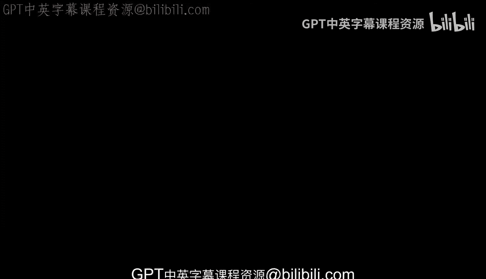

# 密歇根大学《给所有人的Django课程（简介、开发Web APP、特征和库、JavaScript和JSON）｜Django for Everybody》中英字幕 p21 21_04_02_面对面办公时间：印度孟买IIT科技节.zh_en -BV1Kt421V7EE_p21-

🎼，So hello， everybody。

We're here at ITT TechFest and this is wonderful I gave a lecture here but then we've been here for about 45 minutes to an hour just talking and asking questions just outside the lecture hall I keep worrying they're gonna to kick us out because we're making so much noise during the next lecture but I just wanted to say hi and give everybody a chance to wave and say hi to the rest of the class Okay so here we go so we'll say hi say hi you can say hi hi what's your name Okay we'll come back and talk to you later I'm Oh nice to meet you。

Hi， I'mlan'm Chaaz。Otherwise known as。TensorFlow man。Hi， I am乒。Hi， I'm Denishish。Im Su， I'm Meie。

 the thick。helello，我是man，系。拍一下。H in summer。 Go blue。 Go blue。 Hi， I'm on。😊，He you guys back？

Don't run away。 Hi I am Devon。 Hi， I good。What up I'm Jay okay， let' see I'm Prince。 hi， I'man。 I。

 Okay， I am Nla。Okay， do we get everybody？Okay， so this is Chuck， but here we're in India。

 so we have to， this is sort of an American thing。Because in India。There are cows。So。

So we're at IIT Mon Bay having a great time and we have pictures of cows， so I'll see you next time。

 cheers。