# Django for Everybody： 22： 数据库工作原理 🗄️

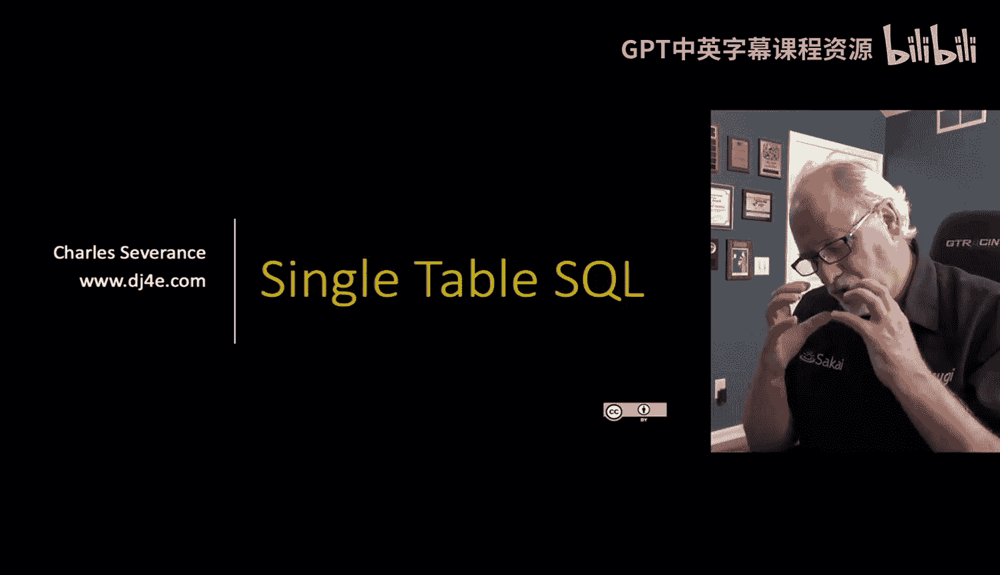

在本节课中，我们将要学习数据库的基本工作原理，特别是SQL（结构化查询语言）的历史背景、核心概念及其重要性。我们将从数据库技术出现之前的时代讲起，逐步理解为什么SQL会成为现代数据库交互的标准。

## 从磁带时代到磁盘时代 💾

上一节我们介绍了SQL的重要性，本节中我们来看看数据库技术是如何从物理存储介质发展而来的。

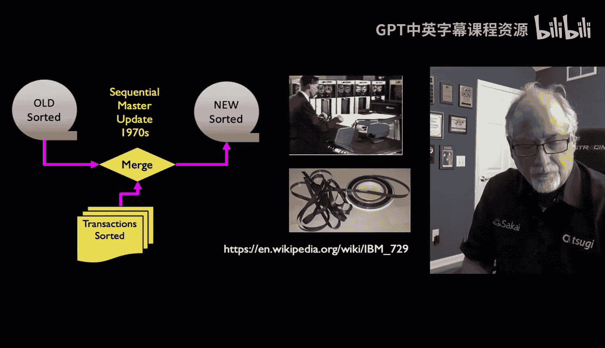

在数据库出现之前的“旧时代”，计算机没有足够的内存或磁盘来存储所有数据。早期甚至没有磁盘，使用的是磁带。磁带是一种物理介质，数据按顺序存储。要访问磁带末端的数据，必须快速或倒带，这个过程非常耗时，并非“随机访问”。随机访问（如内存或磁盘）允许你在大致固定的时间内到达任何位置。

这种物理限制导致了一种特定的数据处理模式。例如，在银行场景中，白天的所有交易会被记录在穿孔卡片上。晚上，操作员会将这些交易卡片按账户排序，并与存储昨日余额的磁带进行合并处理。这个过程可能持续数小时，效率低下。

幸运的是，磁盘驱动器的发明改变了这一切。磁盘也是磁性介质，但数据存储在高速旋转的盘片的同心圆磁道上，并由一个磁头快速移动来读写。这使得访问数据的速度（例如，等待盘片旋转到特定位置）从几分钟缩短到了百分之一秒级别，实现了真正的随机访问。

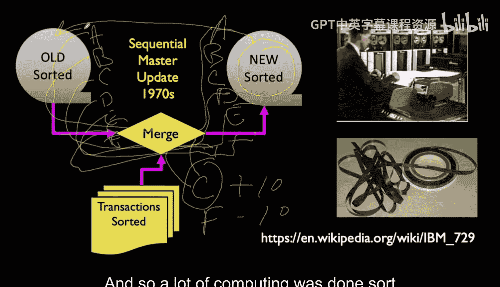

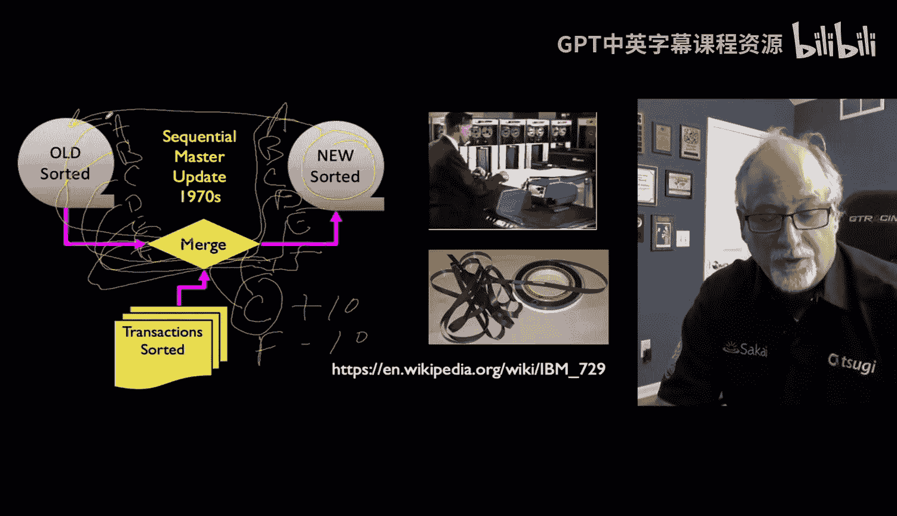

## 数据库标准化与SQL的诞生 📜

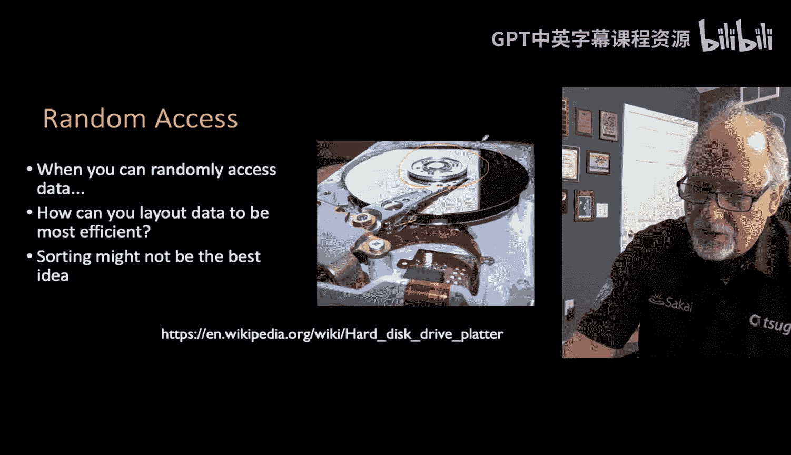

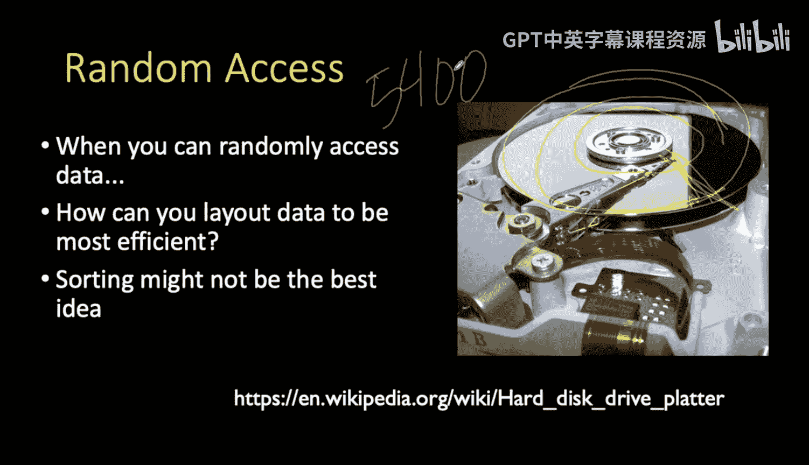

上一节我们了解了存储介质的进步，本节中我们来看看这如何催生了数据库标准化和SQL语言。

拥有了磁盘这项强大的新技术后，问题变成了：如何最好地利用它来构建数据库？在20世纪60-70年代，各大计算机厂商（如IBM、DEC）开发了各自专有的数据库技术（如索引顺序存取法、网状数据库）。客户一旦选择了某个厂商，就会被其技术“锁定”，难以切换，且价格受制于人。

美国联邦政府（通过国家标准与技术研究院NIST）采购了大量计算机，意识到了供应商锁定的风险。因此，NIST要求数据库厂商必须制定一个统一的标准交互语言，否则将停止采购。这迫使厂商们坐下来共同制定标准。

恰逢其时，一种基于数学关系模型的“关系型数据库”理论出现了，它被认为是存储和检索数据的更好方式。SQL（最初可能代表“简单查询语言”）作为这个标准被推出。它的核心思想是：**程序员无需关心数据在磁盘上的具体物理存储结构（如柱面、磁道），而是通过一种简单的语言来表达想要进行的“增、删、改、查”操作。**

以下是SQL核心操作的概念：
*   **CREATE**： 创建数据库结构（如表）。
*   **READ**： 查询数据。
*   **UPDATE**： 更新现有数据。
*   **DELETE**： 删除数据。

SQL成为了一个美丽的抽象层。它允许不同的数据库系统（包括旧式的和新式的关系型数据库）使用同一种语言进行交互。当关系型数据库的性能最终赶上并超越旧式数据库时，应用程序无需重写，只需切换底层数据库即可。这推动了长达十多年的惊人创新。

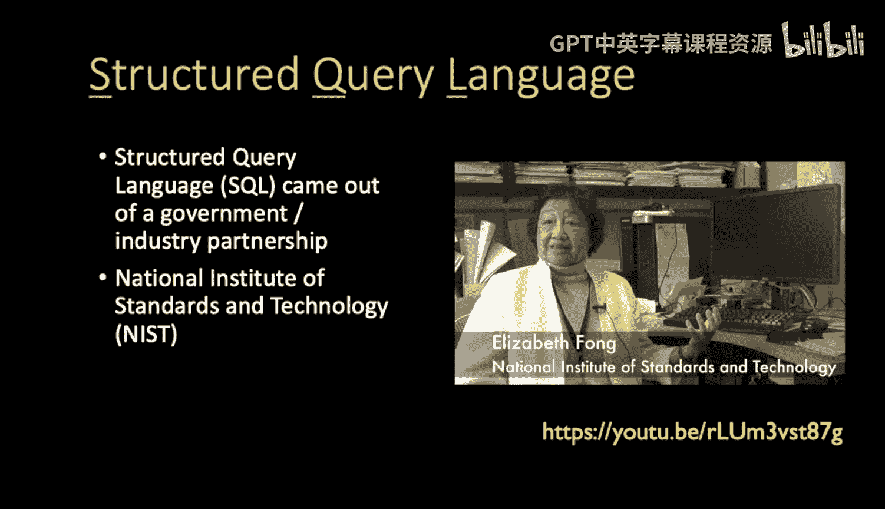

## 关系型数据库与常见系统 🏗️

上一节我们看到了SQL作为抽象层的力量，本节中我们来看看它主要服务的“关系型数据库”以及一些常见系统。

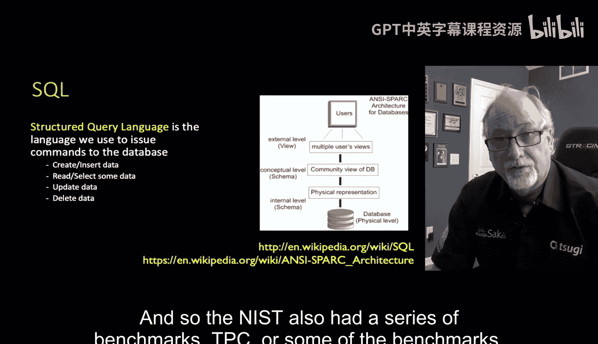

关系型数据库最初是一个数学构想，旨在用**行和列**的表格（关系）以及它们之间的**连接**来最优地表示数据网络。尽管其数学基础优美，但早期的实现效率不高。随着时间推移，其理论优势才通过优化转化为实际的性能优势。

现在有许多常见的数据库系统：
*   **PostgreSQL** 和 **MySQL**： 功能强大的开源数据库。
*   **Oracle** 和 **SQL Server**： 复杂的商业数据库。
*   **SQLite**： 我们将在本课程中使用的嵌入式数据库。它非常轻量、快速，将整个数据库存储在单个文件中，适用于移动应用或嵌入式系统，但不适合高并发的生产级网站。

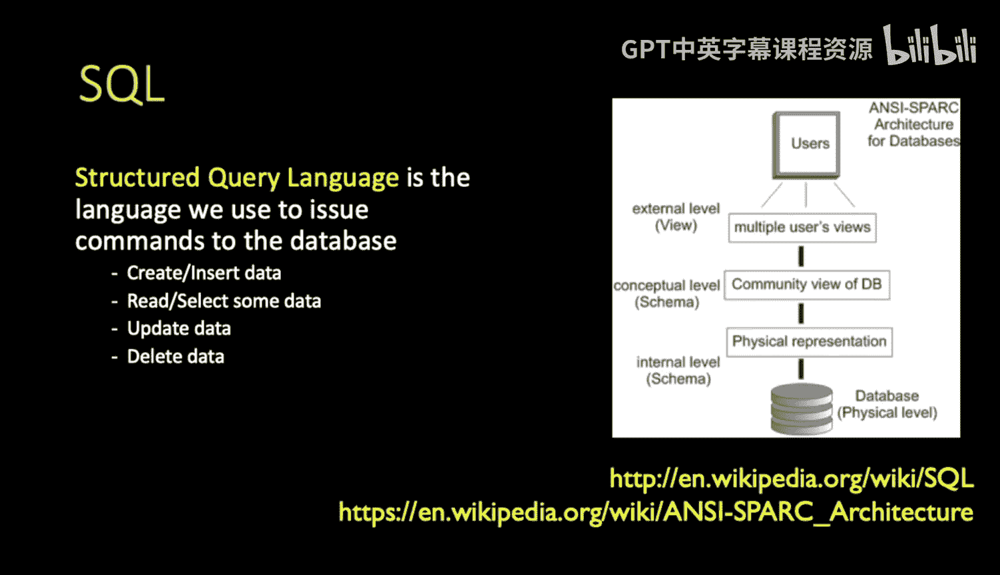

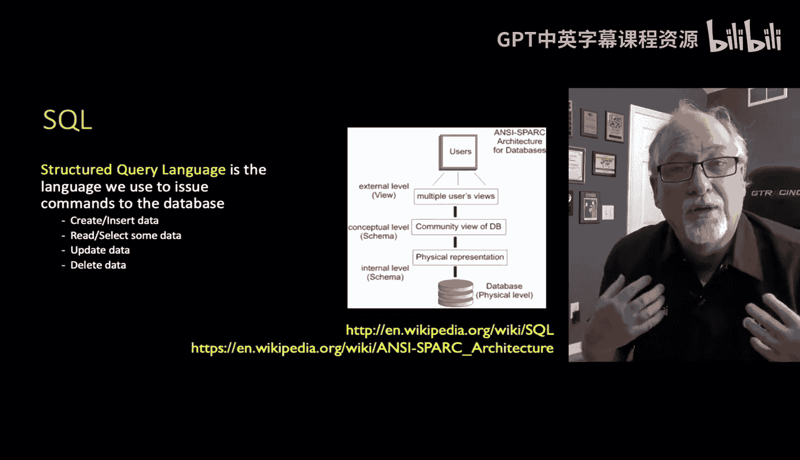

**关键点**： 尽管这些系统在内部实现和规模上不同，但它们都使用SQL语言。因此，在本课程中学到的关于SQLite的知识，同样适用于其他数据库系统。

## 数据库模式：与数据库的契约 📝

上一节我们介绍了各种数据库系统，本节中我们来看看使用数据库的第一步：定义模式。

要与数据库协作，首先需要定义一个“模式”。模式是你与数据库软件之间的一份契约，它规定了数据的“形状”：
*   有哪些列（字段）？
*   每列存储什么类型的数据（如整数、文本、浮点数）？
*   文本列的最大长度是多少？

定义模式后，数据库软件（如Postgres、MySQL）就能根据这份契约来优化其在磁盘上的数据存储结构。这些数据库软件包含了价值数十亿美元的研究成果，用于最优地存储和检索数据。你只需要声明“我将有这些列”，剩下的优化工作交给数据库完成。

一旦模式确立，你就可以基于它来执行所有SQL操作：插入数据、查询数据、更新数据和删除数据。

## 总结 🎯

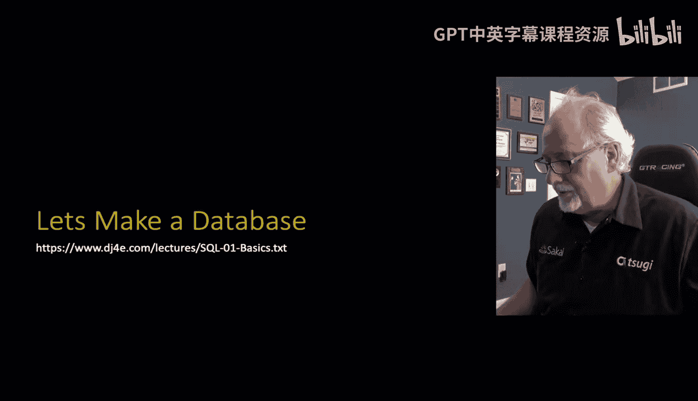

本节课中我们一起学习了数据库技术的发展历程。我们从磁带顺序访问的局限性，讲到磁盘随机访问带来的革命。我们看到了厂商锁定问题如何促使SQL成为数据库交互的通用标准语言。SQL作为一个抽象层，隐藏了复杂的物理存储细节，允许开发者通过声明式的语言操作数据，并促进了关系型数据库等技术的演进。最后，我们了解了定义数据库模式的重要性，它是应用与数据库之间高效协作的基础。接下来，我们将开始动手编写SQL语句来创建和操作数据库。