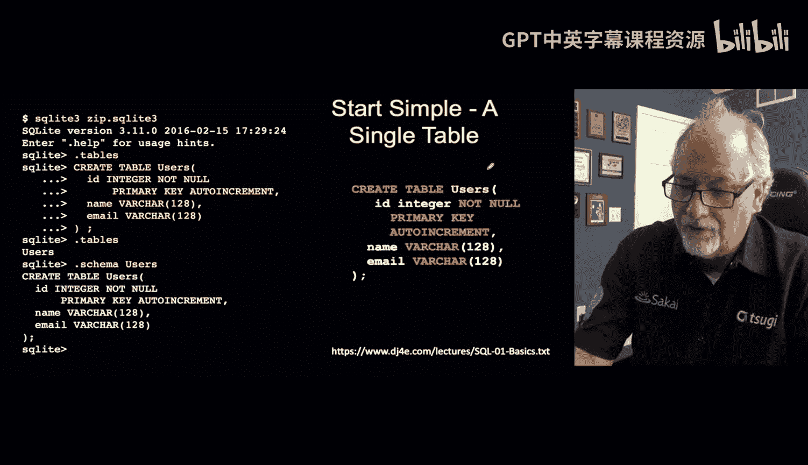
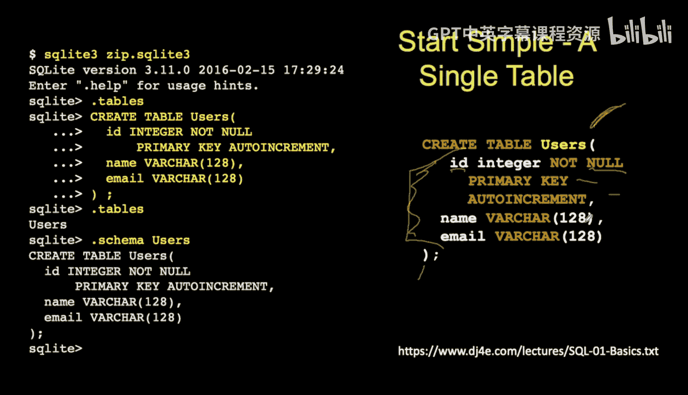
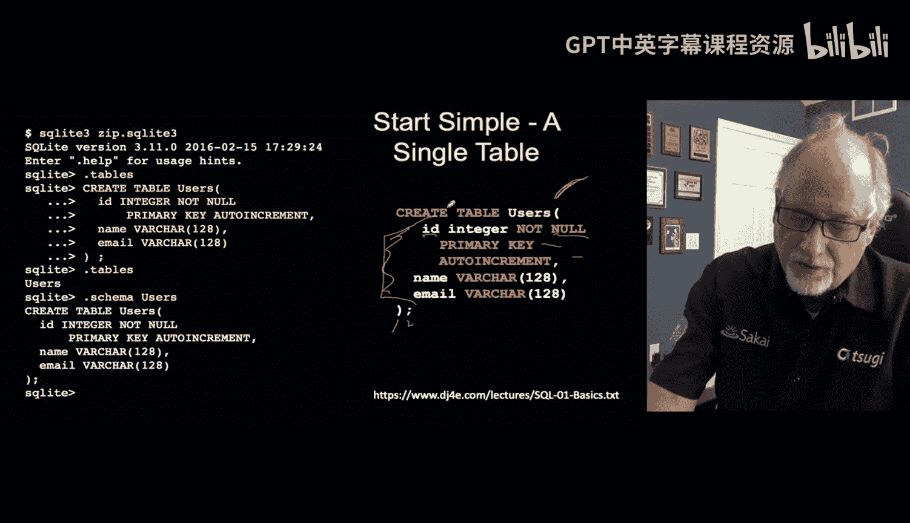
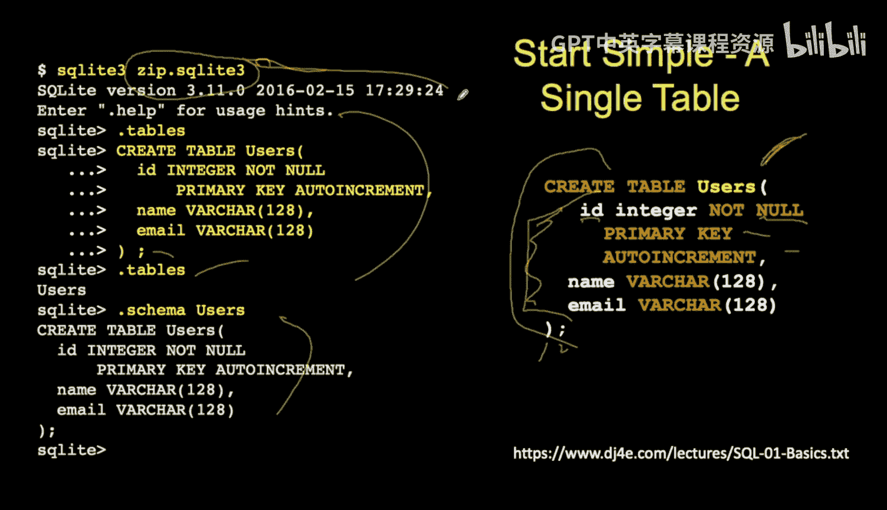
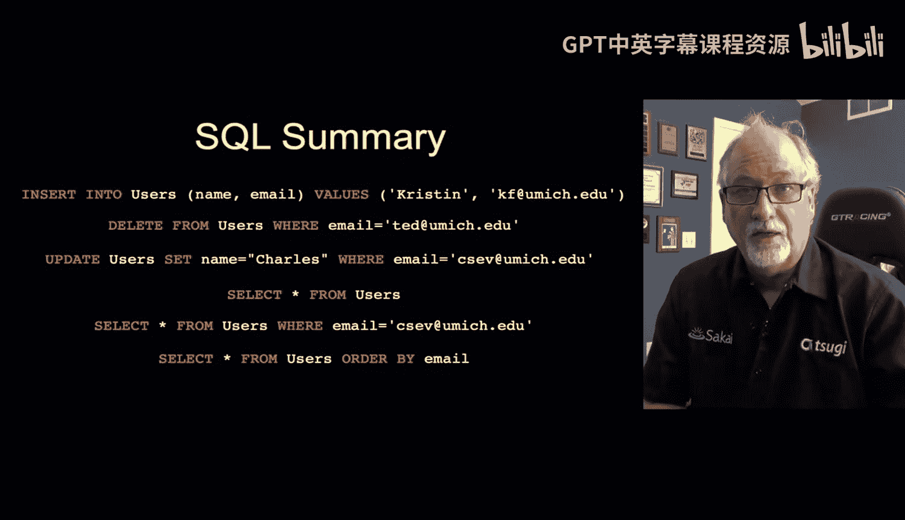
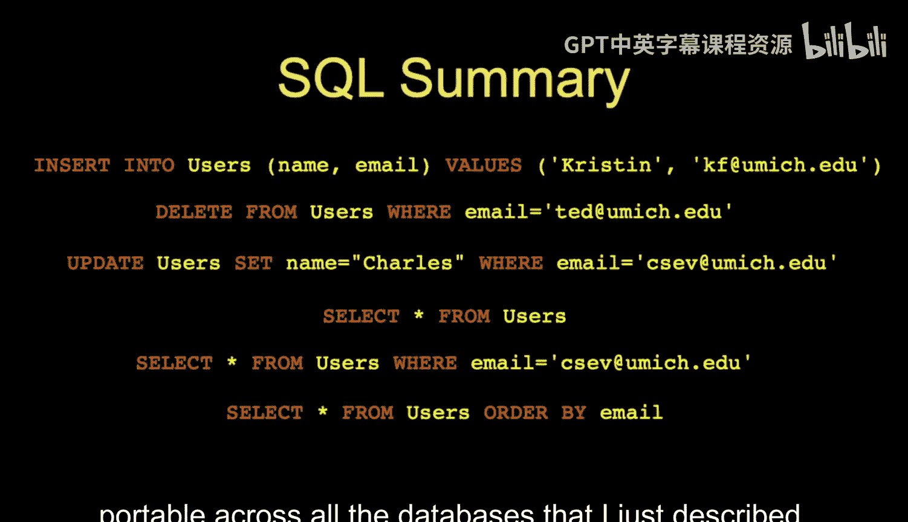
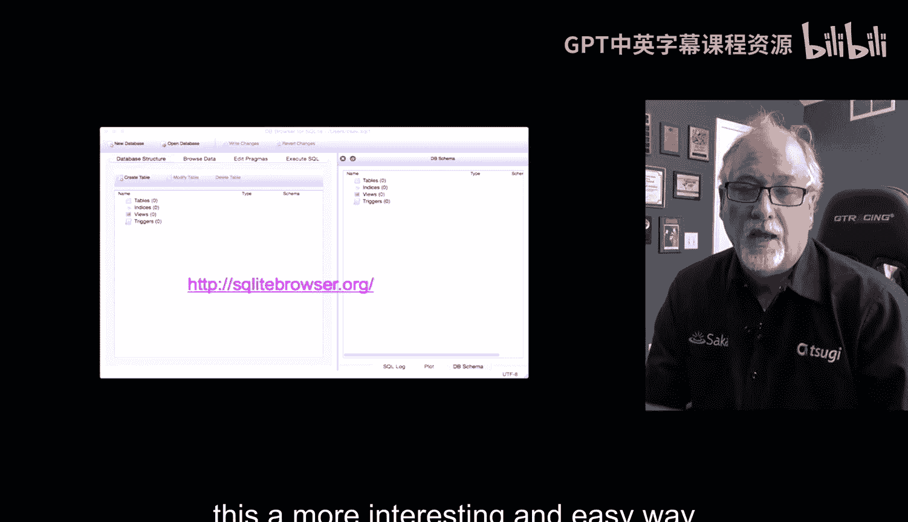

# Django for Everybody：23：结构化查询语言SQL简介 🗃️

在本节课中，我们将学习结构化查询语言（SQL）的基础知识。SQL是与数据库交互的核心语言，我们将通过实际操作来了解其基本语法和核心概念。

## 概述

我们将从如何连接到SQLite数据库开始，逐步学习创建表、插入数据、查询、更新和删除数据等基本操作。这些是使用任何数据库都必须掌握的核心技能。

## 连接到数据库并创建表

首先，我们需要进入一个命令行环境来操作SQLite。如果你使用的是类似PythonAnywhere的平台，可以打开命令行工具。SQLite是一个轻量级数据库，它将所有数据存储在一个文件中。



使用以下命令启动SQLite并指定数据库文件：
```bash
sqlite3 zip.sqlite3
```
执行后，你会看到 `sqlite>` 提示符，表示已进入SQLite命令行界面。



以下是几个有用的SQLite元命令：
*   `.tables`：列出当前数据库中的所有表。
*   `.schema`：查看指定表或所有表的创建语句（即结构定义）。

现在，让我们创建我们的第一个表。SQL语句的语法与其他编程语言有所不同。

```sql
CREATE TABLE Users (
    id INTEGER NOT NULL PRIMARY KEY AUTOINCREMENT,
    name VARCHAR(128),
    email VARCHAR(128)
);
```
这条 `CREATE TABLE` 语句定义了一个名为 `Users` 的表，包含三列：
*   `id`：整数类型，不能为空，是自动递增的主键。主键是表中每一行的唯一标识符。
*   `name`：可变长度字符串，最多128个字符。
*   `email`：可变长度字符串，最多128个字符。

**核心概念**：定义表结构就是与数据库建立一个“契约”。例如，我们将 `email` 列定义为 `VARCHAR(128)`，这意味着你无法插入超过128个字符的数据。数据库会严格执行这个契约以优化存储和保证数据完整性。违反契约（如插入129个字符）会导致操作失败。



执行创建语句后，使用 `.tables` 命令可以看到 `Users` 表已存在。使用 `.schema Users` 可以再次查看它的结构定义。

## 操作数据：增删改查 (CRUD)



上一节我们创建了表结构，本节中我们来看看如何向表中添加和操作数据。SQL的核心操作可以概括为增（Create）、查（Read）、改（Update）、删（Delete），即CRUD。

### 插入数据 (INSERT)

使用 `INSERT INTO` 语句向表中添加新行。

```sql
INSERT INTO Users (name, email) VALUES ('Chuck', 'csev@umich.edu');
INSERT INTO Users (name, email) VALUES ('Ted', 'ted@umich.edu');
```
这条语句指定了要插入数据的表名 (`Users`)、列名 (`name, email`)，以及对应的值。值的类型必须与列定义的类型匹配，否则操作会失败。

### 删除数据 (DELETE)

使用 `DELETE FROM` 语句从表中删除行。**非常重要**：务必使用 `WHERE` 子句来指定删除哪些行，否则将删除表中的所有数据。

```sql
DELETE FROM Users WHERE email = 'ted@umich.edu';
```
**核心概念**：你可以将 `DELETE FROM Users` 理解为“删除Users表中的所有行”。`WHERE` 子句的作用就像一个过滤器，在上述例子中，它将被删除的行限制为 `email` 等于 `'ted@umich.edu'` 的那些行。这相当于一个隐含的循环：遍历所有行，仅删除满足条件的行。

### 更新数据 (UPDATE)

使用 `UPDATE` 语句修改表中已有的数据。同样，必须使用 `WHERE` 子句来精确指定要更新哪些行，否则会更新所有行。

```sql
UPDATE Users SET name = 'Charles' WHERE email = 'csev@umich.edu';
```
这条语句将 `email` 为 `'csev@umich.edu'` 的用户的 `name` 更新为 `'Charles'`。`SET` 关键字用于指定要修改的列及其新值。

### 查询数据 (SELECT)

使用 `SELECT` 语句从表中读取数据，这是最常用的操作。

```sql
-- 查询所有列的所有数据
SELECT * FROM Users;

-- 查询特定列的数据
SELECT name, email FROM Users;

-- 带条件的查询
SELECT * FROM Users WHERE email = 'csev@umich.edu';
```
*   `SELECT *` 表示选择所有列。
*   `FROM Users` 指定从哪个表查询。
*   `WHERE` 子句用于过滤结果，只返回满足条件的行。你可以将其读作“选择Users表中所有满足...条件的行”。

数据库擅长搜索和排序。我们可以使用 `ORDER BY` 子句对结果进行排序。

```sql
-- 按name列升序排序
SELECT * FROM Users ORDER BY name;

-- 按email列降序排序
SELECT * FROM Users ORDER BY email DESC;
```
通过在关键列上创建索引，可以极大地提高搜索和排序的效率。

## SQL的通用性与工具





以上介绍的 `INSERT`、`SELECT`、`UPDATE`、`DELETE` 以及 `WHERE`、`ORDER BY` 等子句，构成了SQL最核心和通用的部分。现代主流关系型数据库（如MySQL、PostgreSQL、Oracle）都支持这些标准语法，这使得SQL知识具有很强的可移植性。

当然，不同数据库也有各自的扩展和特定语法（例如限制返回行数的子句可能不同），但核心思想是一致的。

为了更直观地操作SQLite数据库文件（后缀通常为 `.sqlite3` 或 `.db`），除了命令行，你还可以使用图形化工具 **DB Browser for SQLite**。你可以下载并安装它，用它来打开数据库文件、浏览表格内容，甚至直接执行SQL命令，这对初学者非常友好。

## 总结



本节课我们一起学习了SQL的基础知识。我们掌握了如何连接SQLite数据库，使用 `CREATE TABLE` 定义表结构，并通过 `INSERT`、`SELECT`、`UPDATE`、`DELETE` 语句进行数据的增删改查。我们还强调了 `WHERE` 子句在更新和删除操作中的关键作用，以及使用 `ORDER BY` 进行排序。


这些单表操作是SQL的基石，约占日常使用的60%。接下来，我们将探讨多表SQL和表之间的关系（连接查询），并学习如何通过Django的ORM（对象关系映射器）来连接数据库，从而在Web开发中更高效地使用数据。