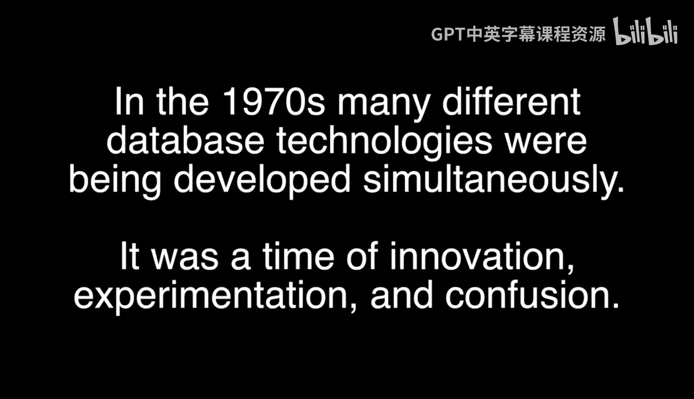
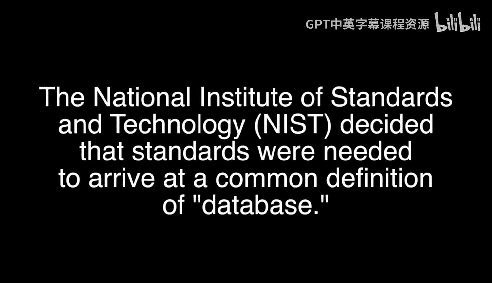
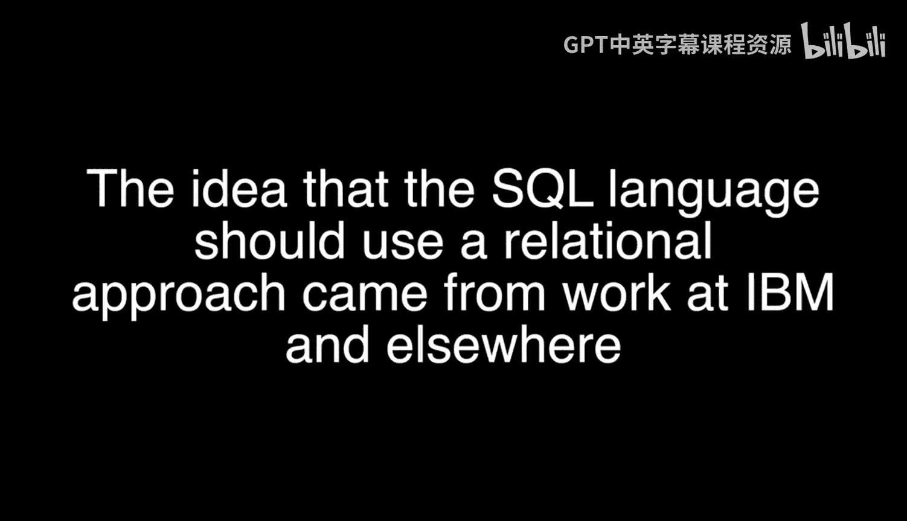
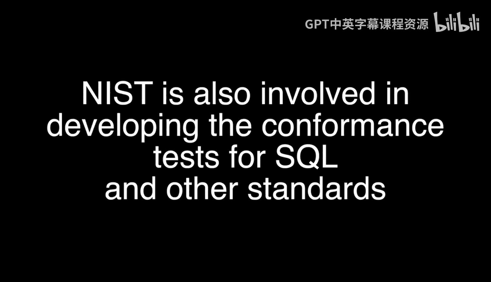

# 数据库发展简史：第25章：SQL标准的诞生与影响





在本节课中，我们将跟随利兹·方的讲述，了解SQL标准是如何在数据库技术发展的关键时期被创建出来的。我们将探讨其背后的驱动力、核心概念以及它对整个软件行业产生的深远影响。

## 概述

数据库技术的发展并非一蹴而就。在早期，市场上存在多种不同的数据库产品和技术路径，这给用户的选择和应用开发带来了困扰。本节内容将回顾那个百家争鸣的时代，解释行业为何以及如何走向标准化，并最终催生了SQL这一通用的数据库查询语言。

## 市场需求的驱动

最初，市场上涌现出许多数据库产品。随着技术发展，用户面临一个现实问题：如何在不同的产品之间做出选择？例如，是购买IBM、Oracle的产品，还是选择更便宜的方案？这种选择困境开始普遍出现。

## 应用多样性与标准化需求

数据库管理系统（DBMS）之上可以构建的应用种类极其繁多。为了确保应用程序能在不同的平台上运行，就需要建立某种统一的标准。早期的数据存储方式多样，包括层次结构的文件系统（如IBM的IMS）、网状结构或平面文件。业界一直在争论哪种数据模型更优，后来我们认识到数据需要自我描述标签（即元数据，现在常称为模式）。

## 数据库系统研究组的贡献

为了解决这些问题，数据库系统研究组提出了一套参考模型或规范，定义了数据库管理系统应具备的最小功能集。一个合格的DBMS必须能够**存储、检索、修改、组织、删除和操作数据**。这成为了一项技术规范。

## 标准化组织的成立

与此同时，一个名为X3H2的NC小组（现称Insight，隶属于美国国家标准协会）成立了。这个小组被称为数据管理语言组，旨在推动标准化工作。唐·多伊奇和兰·加拉格尔等人都参与其中。

## 标准化的核心：接口与语言

进行标准化时，人们意识到，需要统一的不是产品的全部能力，而是交互的接口。这就像灯泡可以有红色、白色等多种多样，但需要标准化的是灯泡与灯座之间的接口。对于软件系统而言，标准化的核心就是**通信接口或共同语言**。



## 关系型数据库与SQL的兴起

当时，IBM的克里斯·戴特提出了关系型数据库理论，他谈论规范化，并引入了“表”这个易于理解的概念来描述平面文件。为了从表中检索数据，一种简单的查询语言应运而生，其基本形式如下：



```sql
SELECT column_name
FROM table_name;
```

例如，从员工表中查询信息：
```sql
SELECT name
FROM employee;
```

## 符合性测试的重要性

采纳标准后，符合性测试变得至关重要。用户需要确保所购买的产品符合特定版本的ISO标准（如JTC1）。否则，应用程序可能无法正常工作。无论底层是Oracle、Sybase还是Microsoft SQL Server，用户都希望自己的应用程序（例如学生课程记录系统）能够跨平台运行。这正是市场的需求。

## 认证实验室与产品清单

为此，设立了经过认证的实验室（如Nav Labs）。这些实验室对产品进行验证，并发布一份经过认证的、符合标准的产品清单。采购时，用户可以要求产品必须“符合SQL标准”，并依据这份清单进行购买。这是由支付费用的用户驱动的严格需求。

## 标准化时机的把握

时机决定一切。标准化进行得太早，可能会扼杀创新，因为新的想法无法进入已被标准固化的市场。标准化进行得太晚，则会出现过多互不兼容的技术变体，让用户面临艰难选择。SQL的成功，正是在恰当的时机把握住了平衡。

## 总结

本节课我们一起回顾了SQL标准诞生的历史背景。我们了解到，市场的多样化选择困境、应用程序对可移植性的需求，以及业界对统一交互语言的共识，共同推动了SQL标准的建立。标准化的核心在于定义通用的接口和语言，而非限制功能。同时，符合性测试确保了标准的实际效力，而对时机的精准把握则是SQL能够取得成功并持续促进创新的关键因素。