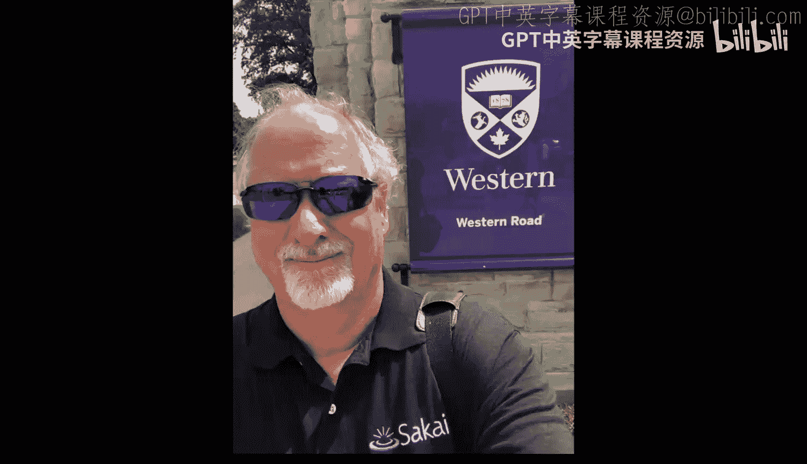

# 密歇根大学《给所有人的Django课程（简介、开发Web APP、特征和库、JavaScript和JSON）｜Django for Everybody》中英字幕 p26 26_05_02_面对面办公时间：安大略省基奇纳.zh_en -BV1Kt421V7EE_p26-

Hello everybody here we are in Kitchener Ontario， I'm here working with a learning management system vendor called desiresIre to Learn to help them work on their implementation of a protocol called learning Tos in ourverability。

 which turns out to be the way the auto graders sends grades back to Coursera so I want you to meet some of your fellow students and they can talk a little bit about the course and tell us their name。

Hi yeah hi Tasie and Sala， I finished the first four courses with a Python for everybody I'm waiting for the capstone。

 hopefully things go excellent， thank you。Hey， how's it going to Louis to Burbon。

 I just finished the first two courses of Python there and super stoked what Me Doctor？

Chauck and the rest of the community and learning Python and look forward to continued learning with the Coursera products。

Thanks for Thanks for coming up from Toronto Yeah no worries hi hi， my name is Jugger。

 I'm doing the python for everybody course and completed to the first two courses of Python and。

Super excited to do the third one as well as the capstone course， thanks to Ch。🎼Cheers。

 hey I am Hermann， I am doing Python for everybody from Coursera and I am on Coto。

 It's really exciting cheers。Hi I'm Dave， I just finished Python for everybody and the web design for everybody and I'm looking forward to doing the Jjango course when it's available Co Yeah so。

I don't know where I'm going to see you next， it's coming up on campus teaching in the fall this semester。

And I'm teaching a Django class， which I hope to turn intojango for everybody。

In upcoming so I'm going to be kind of busy building auto graders and all those kinds of things for my Jane class。

 so I hope to see you sooner later at an upcoming office hours， cheers。

