# Django for Everybody：2.1.6：理解模型-视图-控制器（MVC）🎯

在本节中，我们将学习一个在Web开发中广泛使用的架构概念：模型-视图-控制器（MVC）。理解MVC有助于我们清晰地组织代码，并理解Django框架各部分是如何协同工作的。

## 概述

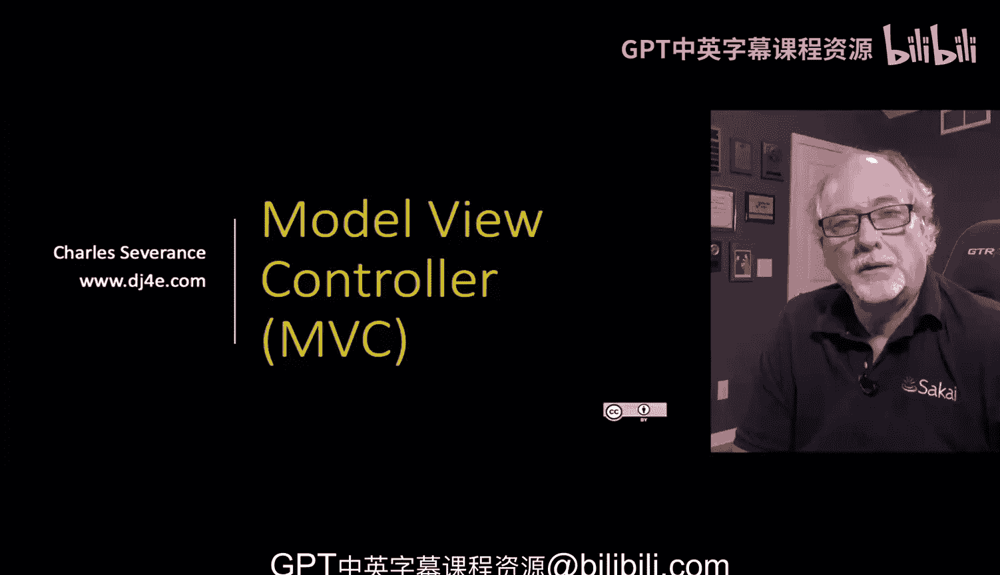

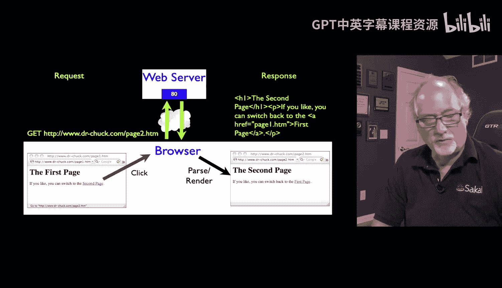

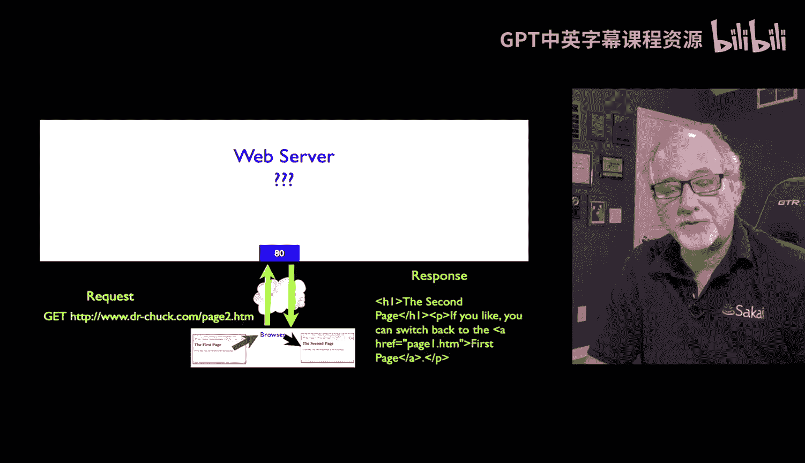

MVC是一种将应用程序逻辑分为三个核心组件的设计模式：**模型（Model）**、**视图（View）**和**控制器（Controller）**。它不依赖于特定的编程语言或操作系统，是Web开发中一种通用的架构思想。虽然它不是理解Web服务器工作原理的绝对核心，但掌握这套术语对于开发者之间的沟通至关重要。

## 请求-响应循环回顾

在深入MVC之前，我们先回顾一下基础的请求-响应循环。用户通过浏览器点击链接，浏览器会拦截这个动作，向运行在80端口的Web服务器发起一个GET请求。Web服务器处理这个请求，并最终返回一个网页。这就是基本的请求-响应过程。

```
用户点击 -> 浏览器发送GET请求 -> Web服务器处理 -> 返回网页
```

我们本节课的重点，就是详细探讨Web服务器内部在处理请求时具体做了什么。

## 理解MVC的三个组件

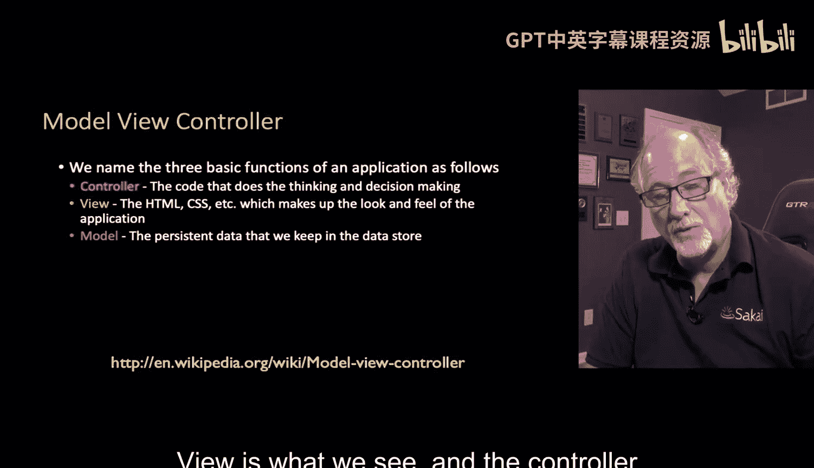

模型-视图-控制器这三个术语，帮助我们清晰地划分Web服务器内部的工作。任何一部分工作都可以归类为模型、视图或控制器。它的价值在于，当讨论代码时，我们可以明确地说“这部分是控制器逻辑”。

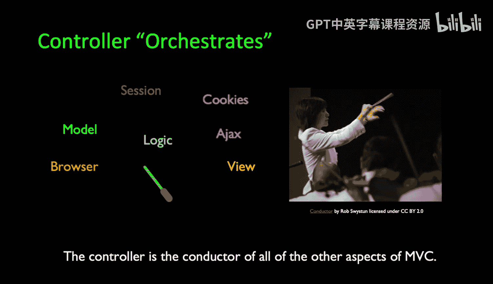

尽管从逻辑顺序上，叫“控制器-视图-模型”或“模型-控制器-视图”可能更准确，但“模型-视图-控制器”（MVC）这个说法更顺口，因此被广泛使用。

以下是三个组件的定义：

*   **控制器（Controller）**：它决定了“接下来发生什么”。控制器是处理请求的起点，它定义了事件的执行序列，并在处理结束后决定下一步的去向。你可以把它看作是协调整个流程的“胶水”。
*   **视图（View）**：这是我们最终看到的东西。视图通常是请求-响应周期的终点，服务器生成视图（如一个HTML页面）并将其返回给浏览器。
*   **模型（Model）**：这代表了应用程序中的持久化数据存储，通常指数据库。请求-响应周期常常需要与模型交互，例如向数据库插入新数据、更新已有数据，或者从数据库中读取数据以便在视图中展示。

## 典型的Web请求处理步骤

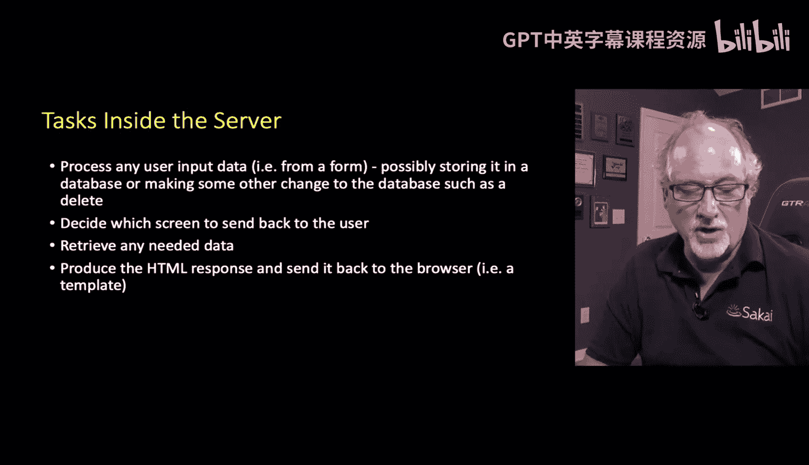

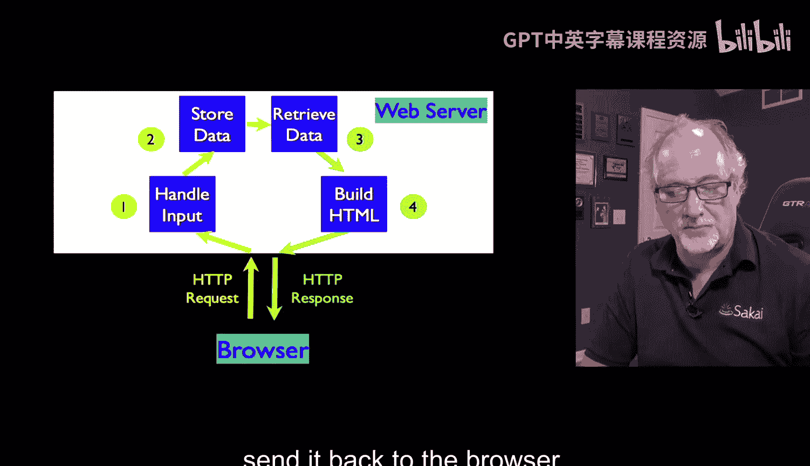

当一个请求到达Web服务器时，通常会经历一系列典型的步骤，这些步骤清晰地体现了MVC的分工。

以下是处理一个包含数据的请求（如表单提交）的常见步骤：

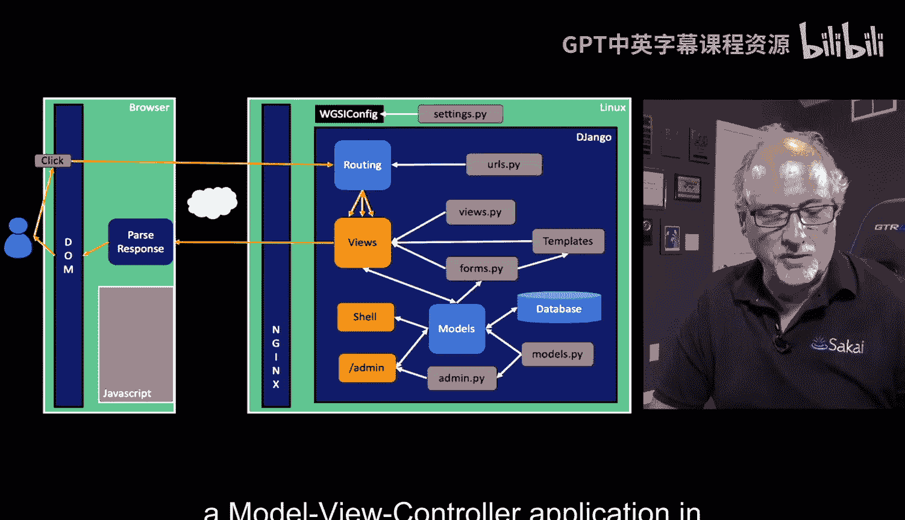

1.  **接收与处理数据（模型/控制器）**：如果请求中包含需要处理的数据（如表单数据），控制器会接收这些数据，进行验证，然后通过模型将其存储到数据库中。
2.  **决定下一步（控制器）**：数据存储完成后，控制器需要决定接下来将用户引导至哪个页面。例如，跳转到一个“感谢”页面，或者返回应用首页。
3.  **获取展示数据（模型）**：确定了目标页面后，可能需要从数据库中检索一些数据来填充这个页面。
4.  **生成并返回响应（视图）**：最后，使用模板等技术，将数据和HTML结合，生成最终的视图（HTML响应），并将其发送回浏览器。

```
请求进入 -> 处理/存储数据 -> 决定路由 -> 检索数据 -> 渲染视图 -> 返回响应
```

## MVC在Django中的映射

Django框架的设计深受MVC模式的影响。虽然命名上略有不同（Django有时被称为MTV框架：Model, Template, View），但其核心思想是相通的。

我们可以将Django的组件映射到MVC概念上：

*   **URL配置 (`urls.py`) - 控制器**：`urls.py` 文件是控制器的核心部分。它根据接收到的URL请求，决定将请求路由到哪个处理函数（视图）。这正体现了控制器“决定接下来发生什么”的职责。
*   **视图函数 (`views.py`) - 控制器 & 视图**：`views.py` 中的视图函数承担了控制器和视图的双重角色。
    *   **控制器角色**：它可能包含处理输入数据、决定重定向到其他页面的逻辑（例如，使用 `redirect()` 函数）。
    *   **视图角色**：它负责组织数据，并调用模板来生成最终的HTML输出。
*   **模型 (`models.py`) - 模型**：`models.py` 完全对应MVC中的模型。它定义了数据结构，并提供了与数据库交互的所有方法，无论是存储数据还是检索数据，都是通过Django的模型层来完成的。
*   **模板 (`templates/`) - 视图**：模板文件专门负责数据的呈现，是视图层中专注于展示的部分。它们与 `views.py` 协同工作，生成最终的用户界面。

## 总结

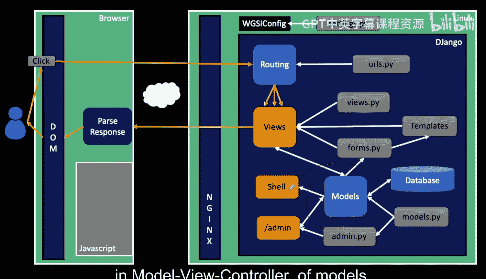

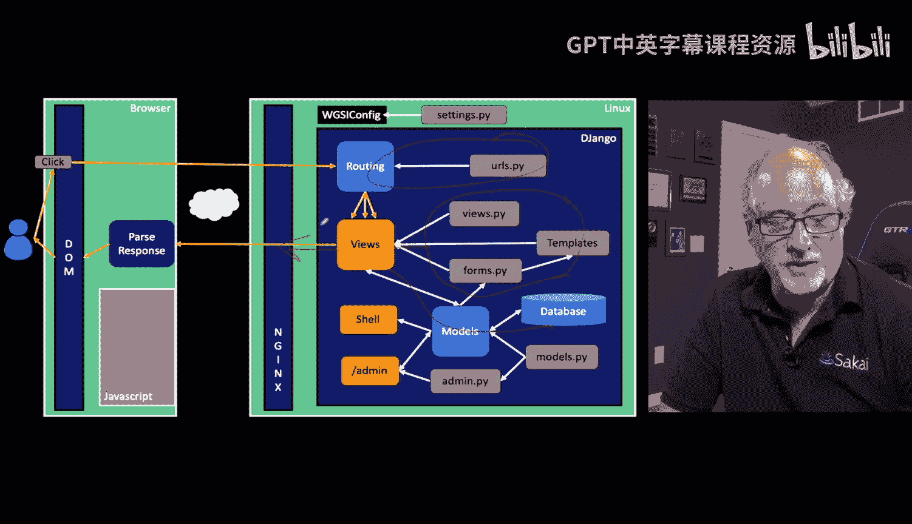

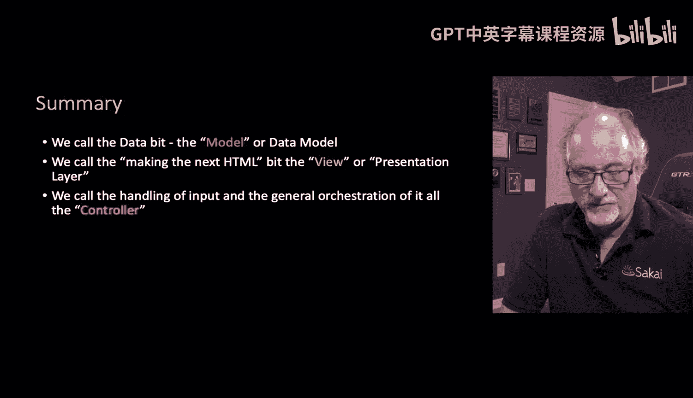

本节课我们一起学习了模型-视图-控制器（MVC）这一重要的Web架构模式。我们了解到MVC将应用逻辑分为**模型**（数据）、**视图**（展示）和**控制器**（流程控制）三部分。通过回顾典型的请求处理步骤，我们看到了这三个组件是如何协同工作的。最后，我们将MVC概念映射到了Django框架的具体组件上：`urls.py` 和部分 `views.py` 逻辑充当**控制器**，`models.py` 对应**模型**，而 `views.py` 的数据处理与模板渲染则共同构成了**视图**。理解MVC有助于我们更好地设计和理解Django应用程序的结构。