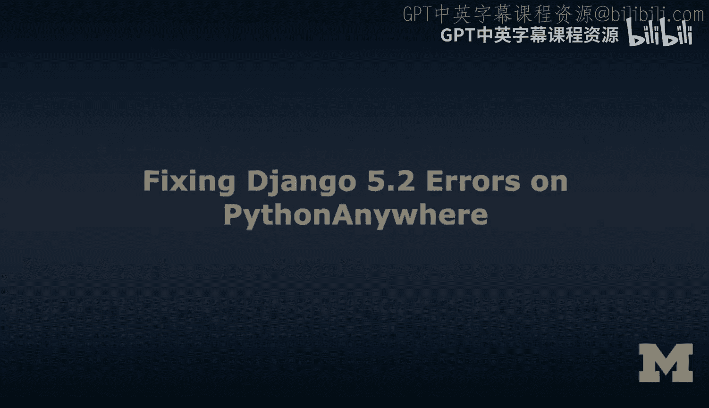
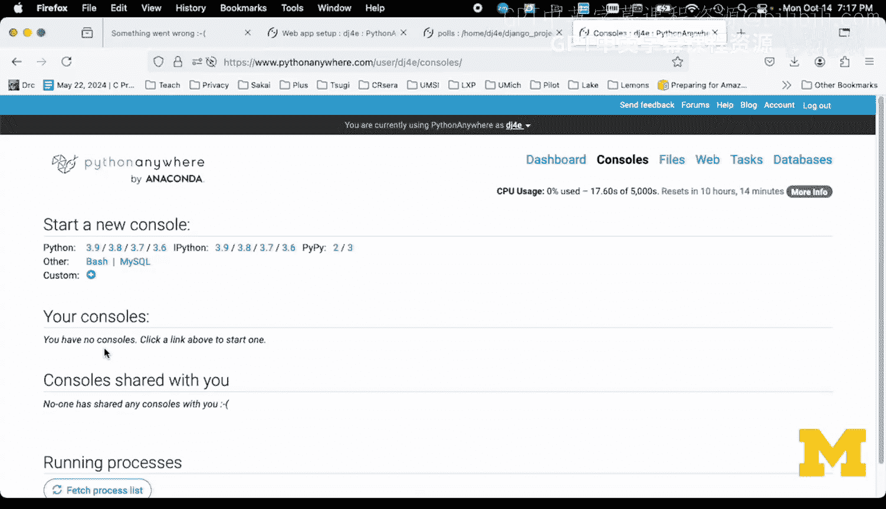
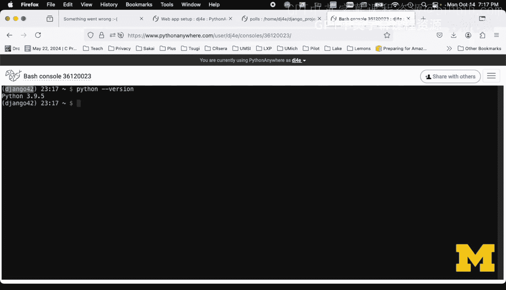
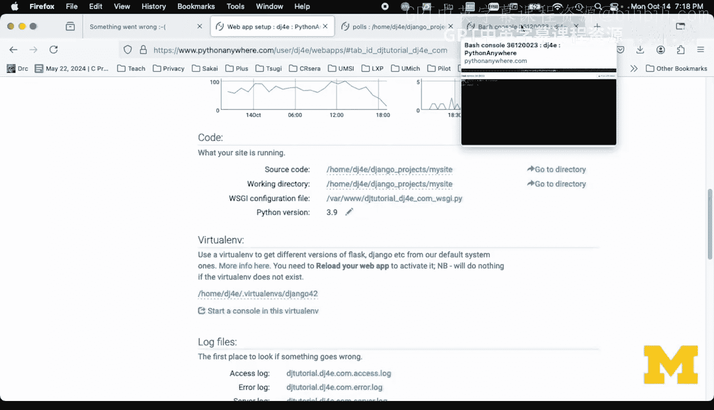
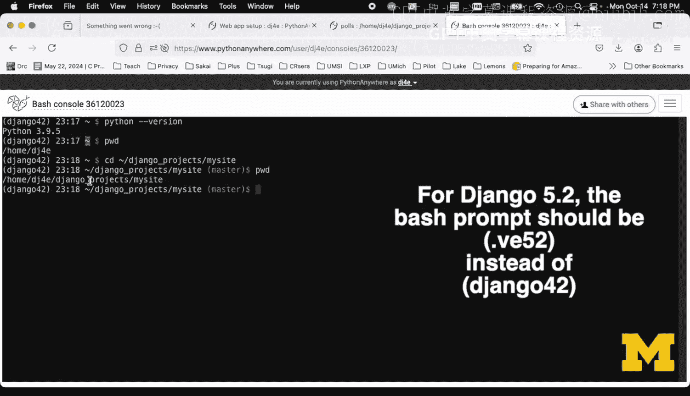
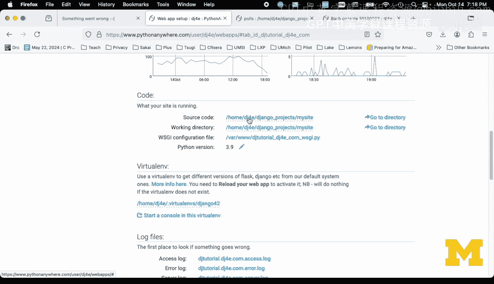
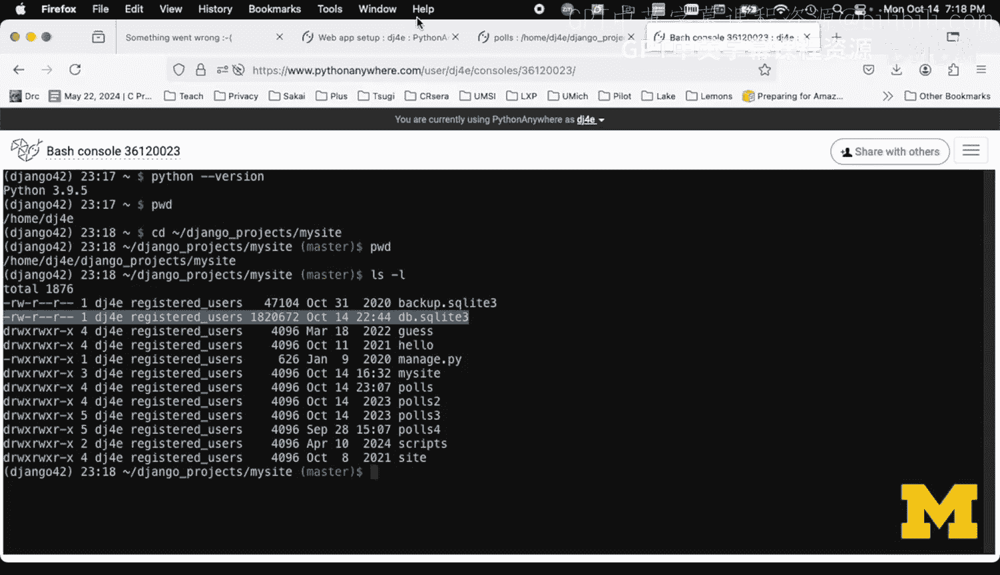
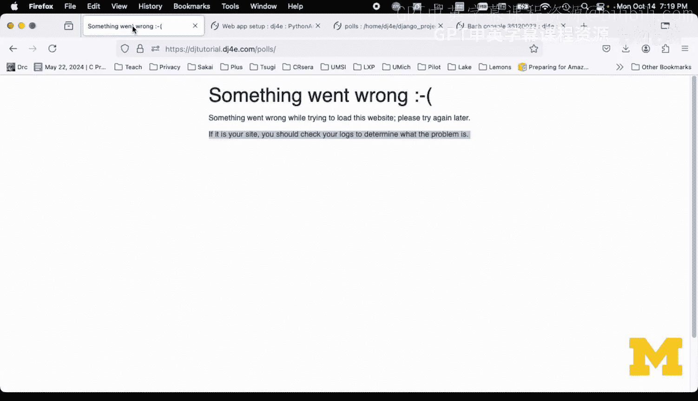
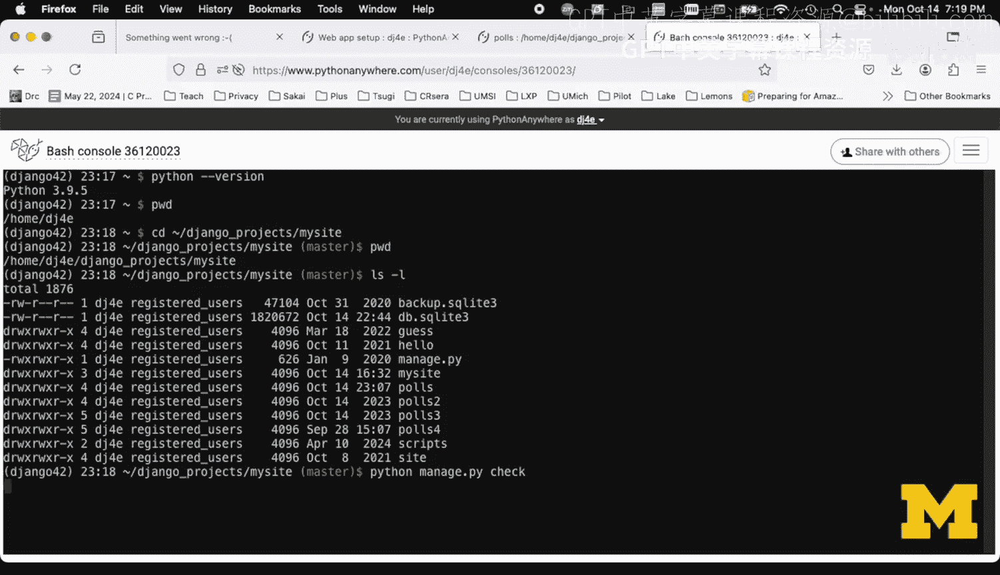
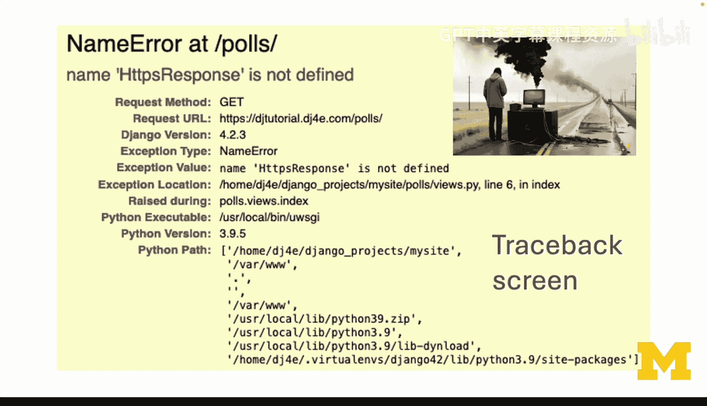

# 密歇根大学《给所有人的Django课程（简介、开发Web APP、特征和库、JavaScript和JSON）｜Django for Everybody》中英字幕 p29 03_01_07_在PythonAnywhere上修复Django-5-2错误.zh_en -BV1Kt421V7EE_p29-

Hello and welcome to my virtual office hours where I try to help you work through various kinds of Django。

 broken Django applications that you're running on Python anywhere as part of my Django for everybody effort。

So there's two basic errors that you run into and you run into them because you're coding along in your thing。

 you save a file， you hit the reload button， and then。Something's not working the way you expect it。

The sort of most frustrating thing is the startup failure。

 and this is where you see something went wrong when you navigate to your application on Python anywhere。

What this really said is we're trying to get your application started and we have failed in doing that。

And we don't know what to do。 we can't show your application because it doesn't run。

 Your application is so broken that Python anywhere can't even start it。

So you can start an application and if you start it。

 you can still have bugs or problems in your application。

 and those are these yellow screens with a traceback and you'll get used to learning these yellow screens。

 some of them are easier to solve than others and。Sometimes the answer is right there in front of you like it is in this one that says。

 hey， line 6 is unviews。pyy is wrong， and it tells you what's wrong that HPS response is not defined。

Um，And then sort of other times you' got to scroll up and down and you got to pass tracebacks and。

Ignore the stuff and kind of read between the lines。 Its。

 it's part of programming these things called tracebacks。

 especially when you're using a library like django。

 there's a bunch of library code that it's deep in light piece of library code using something you've given it。

 And it blows up， and you kind of got to figure out where it is that your part starts in their part ends。

 And it's a little bit tricky。 So we'll do a couple of these things。 So let's start with。

Startup failure。So let's go ahead and take a look at my application。 This is the application。

 So while students are running this at this exact moment。

 they're a little confused because my sample application is currently broken。 So here we are。

 my sample Dinggo tutorial polls application。 hit refresh， and it says something went wrong。Now。😔。

It says if this is your site， you should check the logs to determine what the problem is。 Okay。

 now I'll that's not the easy way。 That's the hard way。 I would say if it's your site。

 you should check your logs or run， go under your folder and run Python managed by check to see what the problem is。

So usually this happens when you press3load button。

 you can press threeload button either in your files。

When you're editing a file and you hit the reload button in the file that's the fast way。

But this reload。 Now， the key thing is， is that。Your application， when it's running。

 is sitting on one of the Python anywhere servers ready to receive requests。

And when you make a change， you want your changes to reflect in that application so you reload it。

Now see this spinning thing。There's actually a lot of things that are going on when that spin thing has happened。

So I'll just show you some of the things this web page is configuring the interface between your application and Python anywhere。

 and you should never need to change this， but I'll just point out some of the things that are happening as you're starting。

So first， to start your application， it changes into your source code folder。

Because that's where managed dot Py is， that's where， views dopyy is。

 that's where all your stuff is at。And then it changes into the working directory。

And the key to that directory is that's where your like Db。sql light file is。

 and all you need to do is to get these right。The other thing that's important。

 I wish this was in slightly different in order is their virtual environment。 Now， right now。

 we're working with Tngo 2 4。2。 And so you have to know this。

 The very first assignment goes through in great detail how to set this up。

 You shouldn't have to change it。 It might have some error saying oh， that's not there， something。

 And in each of these， you' got to put your own name in this。 right， DJ3 is my account name。

And then once it goes into the virtual environment。It runs this。Whiizkey configuration file。

This is the equivalent。Of。Python manage pi run server。 That's the command。

 You're never supposed to run in the command line。 I'll go ahead and run it in the command line。

 and you'll see what happens。 And again， we set this up in the very first assignment and you shouldn't have to change it。

 So if you， if you made a few changes to your code inside your application and it's blowing up。

 you generally don't suspect any of this。 You suspect that it's the code in your application。

 because this web app set up is outside your application guiding Python anywhere to get things started。

Now， once Python anywhere is starting in your application， it is starting in your settings do py。

 So the next thing that runs as it attempts to start。Is Se。pyy。And then it runs URLs。pyy。

And you see mine a little more complex than yours and has different versions in it because I've been building all this stuff for a long time。

 And then within settings that Py， you have these installed applications。

 and then that tells it to go through each of the folders here and fire those up so you can have a mistake in your poles application。

 right。And so that's what's going on。 And if at the end of。You know。

 if somehow in the middle of Se do Py， it's failing。Right。If it doesn't， if it gets through here。

 OK and you don't have errors in your code。That's so bad。It runs。 doesn't mean you have no bugs。

 It just means that you don't get the something went wrong here。

 So it has to have made it through the end of Setting do py and through the end of like your URLs do Py poles。

 It's going to load views。 and it's going to use load URLs。 it's going to load models。Admin and apps。

 you can make a typo in any one of these things that is fatal to the startup。And so。The key thing is。

 wow， that's a lot to look at。And so we got to save ourselves。

 and all we know is that something went wrong。 So what I tell you is to go into consoles。

And create a bash console you can， if you end up with extra consoles， you can just wipe them out。

 you're only allowed to have two， so I'm going to start a bash console。

NowEvery time you start a bash console， you got a few things that you just got a check over and over and over again。

 First is here comes， here comes。 there we go。 First is are you in the correct virtual environment。

 And again， depending on the course when you're taking the course， this may change。

 But the virtual environment sets the Python version， the Django version and all of the dependencies。

 Now that was set up in the very first assignment and also in the very first assignment。

 It sets you up to automatically go into that。Now you can do things like the Python minus minus version。

To see what version you're at so the virtual environment now the interesting thing is that virtual environment is matched here that Django 4。

2 is the name of your virtual environment， so it's important that this string match this string。

Then the other thing that you see in this bash is prompt is the tilt， which means home directory。

 So if I do P W D， you see that I'm in home DJ4E。 So this is where you have to type over and over and over again T slash django。

 And we set this all up in the very first。Jinggo projects， My site。And so then that's where。

 So if you look at PWDino， you see it's in home DJ forri Dgo projects of my site。 Well。

 if you look at Web， it's matching。 So that's where all your source code is。

 that's where your working directory is。 So if I go into here。

And I do L S minus L。 You see that my DB SQite is here。 so Web app set up。

Work director says that's it should say the working directory where you will read the My SQL light now。

 again， you shouldn't suspect this， you just probably made a change in one of your other files。So。

The short answer is you get to something went wrong， you're going to get bash console。

 you change directory into。

Jingangle projects my site， and then you type Python。

So you'll notice managed do Py is in this folder。Banage， pie， check。

So what managed byche is doing is it's literally going through the exact same set of steps。

Of reloadjango tutorial。gjfred。com。It's you're already in the folder。

 You're seeing the settings dot P Y。 So this is loading the settings。 this is。If I go in here right。

 if I go back。Check is inside your application， loading settings， loading URLs。

 and then based on settings， it is then loading all of the applications that are listed in settings。

 Now， if you have it folder here and there's no application listed for it in settings。

Models that p won't load， etc。Okay。So Python manage P check loads and parses and looks for errors in all that Python code。

Now。What we see here is it's blowing up， and that's good。P anywhere can't start us。

 and I can't start it manually because as it's loading things up as it's going through all those files。

 it's blowing up。 Now， here， it's a trace pack。 And I apologize for how hard these trace packs are to read。

 But there's some patterns to look at。Right， this is， that's a django library file。

 You probably can ignore most of the stuff。 It's django。 It'sjango。 And like， okay， now here we go。

 we are running the import of URLs do py and my site my site。 That's fine。

 That doesn't mean this is necessarily broken right？ because it's in the middle of importing that。

 And now it's trying to import the views dot py。 I the URLs from my polls。

 import the views from my polls。 And now at the very end， this is like chances are good。

 This is what's really wrong。 So it says line 1 in module Pols views do py。

 there this is the line of code。 and it says no module namejango Https。 So like， oh okay。

 let's go in there So let's go into polls。Hes do PY， and I must have paceed this wrong。

 so it's not reallyjango HtTP， it'sjango HttPS。So I save it。Now。

 a lot of you will be tempted to just hit the reload here and then go test it again， right。

 and that's not a bad thing， but the way I like to do it is I like to run the check again。

And then when the check works， then I feel really confident because sometimes you've made more than one mistake。

 So it's really quick to run check。Enit a file， save it， run check， edit a file， saveve it。

 and when you get to the point where check is happy。Then。

You can go and reload your entire application。So now it's running and running and running and reloading that application。

 Wizge Config， Se pie， URLs， etcter。 So now I go back here and I hit refresh。And it works。

And so I'm fine。So。There is one other place， so I'm going to go back and make that mistake again。

 I just put that mistake back in。Save it。And then reload it。So sometimes it's just like one in 20。

 There's something so subtle that Python managed P checks。 I this one managed P would check。

 But if you get to the point where you're still getting the error。

There is a place that you can look at。So there are two logs that we can find interesting。

So I'm going to start by looking at the error log。And the key to the analog log is these are anything that's gone wrong。

 But for a very long time， there's all kinds of things that are going wrong in this application。

 And so this is。In sort of chronological order。 So you've got to go to the bottom to see the most recent one。

 And so what you'll notice is that what we're seeing in this error log is exactly the same output。

That we saw here。And it's just more it's just less convenient。And so what are we complaining about？

出出出出。Line 1， it tells us that's the problem。 It's in that file， which we already saw that。

 And so we've got all these exceptions。 There we go。 So that's a little bit different order。

 It's showing the things that are wrong。 So now let me go ahead and fix it。And reload it。Fix it。

Reload it。Save it， Reload it。Okay。So that's our first walkthrough of。A startup failure。

So now we're going to make another mistake and then we're going to blow it up。

And to see a traceback screen。So now I've made a different mistake。

 a mistake that is a traceback error。Okay， so let's go back and take a look at the status of our application and now miraculously。

It comes up， right？ So the previous error was it just won't start， but now it won't start。

 And it's got a bug in your code。 What's nice about that is when you're seeing one of these yellow traceback screens。

 It means pretty much everything that's on this web page， worked flawlessly。

 and it got to your application， It got to your files。

 it got through your settings in your URLs doesn't mean there's not bugs in them。Okay。But。

It means that it's running code and as it's running code， something is failing。

 So it's not failing during loading。 it's failing because it's executing a request。

So now it's making it into my view。And so these are called tracebacks。

 and there are sometimes quite a bit of information。

 It tries as hard as it can for the simplest ones to summarize here in this yellow part what's going on。

 And I made a really simple error。Okay。🤧嗯。And so it's right here。

 But sometimes you' got to look down here and you' got to find your way。

 And sometimes these trace specs are a lot longer。 But eventually。

 you kind of work your way through the errors。These aren't really errors in Django。

 These are places where the error is happening in Django。

 and eventually you find the variable that are the line that's causing your problem。

 So then you go like oh okay cool I'm going to go edit that views do P Y in polls right？my site。

Palls。We used our Py， and it's line 6 now before。Before I fix this。

 you'll notice that there are these little yellow triangles。

And these little yellow triangles are from your text editor。

And they're kind of pre parsing this and looking for errors。

 And it's found two errors in what we're doing。 The first errors， I took this import H P response。

 which is from the sample code。And I import， it says it's imported， but not used。

 And then if we go on line 6， it says there is no name HtTPS response。 Well。

 that's because I put this S in just to mess it up。But， here's the thing。These files all loaded。

But in the code when it executes is when this is getting。 so so it's like all everything worked。

 right， the URLs do Py found its way， the views loaded， they ought， you know they had enough。

Few enough problems that they loaded。 It made it through here， loading， and it made it through。

Viewed up pi。 If you look at the previous when it didn't load， I just changed one thing here。

 and it was， it made it all the way to my application before it blew up。

 Now it's running the application or I have to do a request blowing up with the something went wrong before you even send it a request。

 It's already broken。 So I'm going to just fix this。So you'll notice that when I hit the save button。

 all the little upside down arrows， the little yellow triangles go away。 So that's a good sign。

 not a guarantee， but it's trying to help you avoid mistakes。

 Sometimes you're cut and pasting things in here。 You've cut and pasted something twice， E cetera。

 et cetera， et cetera。And hit reload on this。And there it works。

That basically is the kinds of things when you see a traceback。

 there are all kinds of things that can go wrong with a traceback。

 you can have a missing template file， you can have a syntax error and a template file。

 you can have an include that wasn't included the right way your database migrations may not have been and you just kind of got to read all this stuff at the top and get used to it。

And and so I hope that this has been helpful and helps it so that helps you to be able to debug some of your applications。

 cheers。

