# 密歇根大学《给所有人的Django课程（简介、开发Web APP、特征和库、JavaScript和JSON）｜Django for Everybody》中英字幕 p31 05_02_02_Django数据模型.zh_en -BV1Kt421V7EE_p31-

Hello and welcome to our lecture on simpleim Django models。

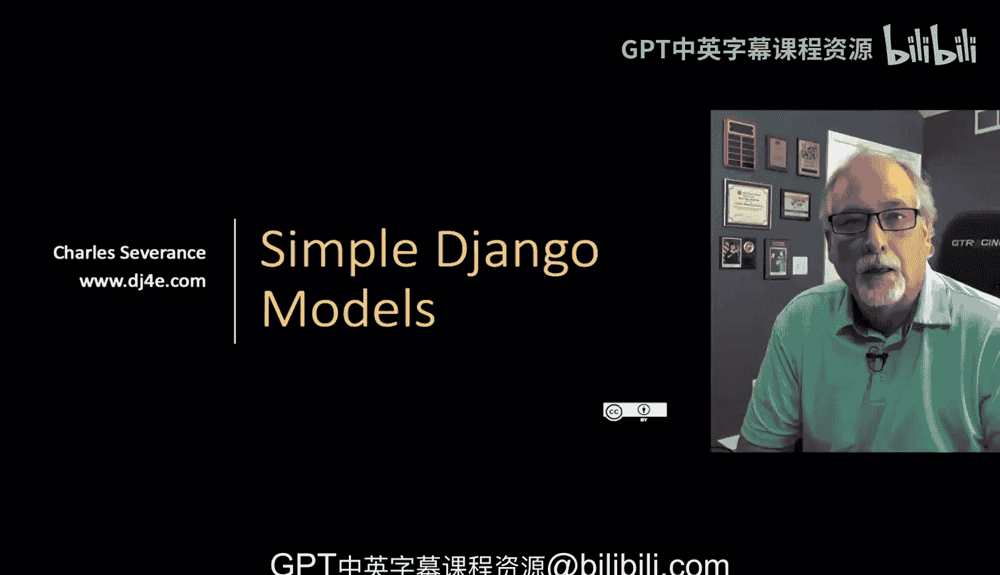

As you've seen in previous lectures， we talked about SQL structured query language and that's how we talk to databases and it's beautiful because it allows portability up to a point across databases and we talked about all the create table stuff and so this is just a bit of review where you we can type these commands to SQL light。

 we run SQL light， we run a create table statement and we do it to say dot tables that we go。

 we can ask kind ofchema users， we did all this in a previous lecture and so that's basically how SQL works。

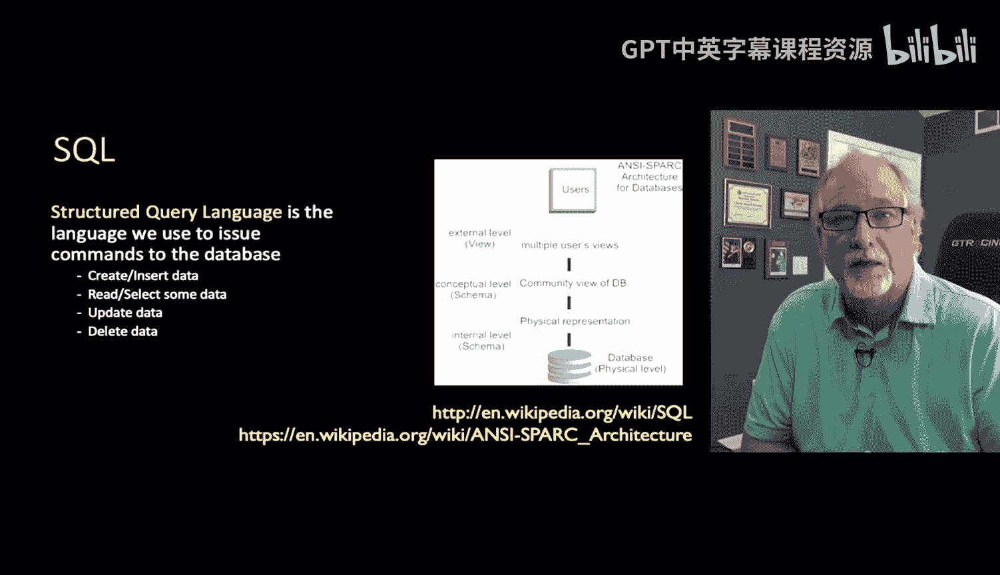

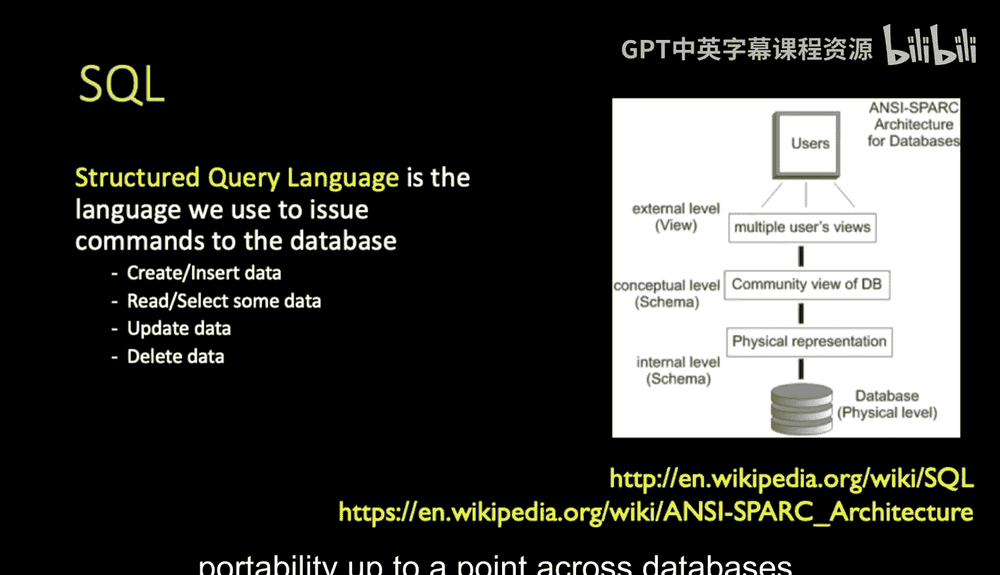

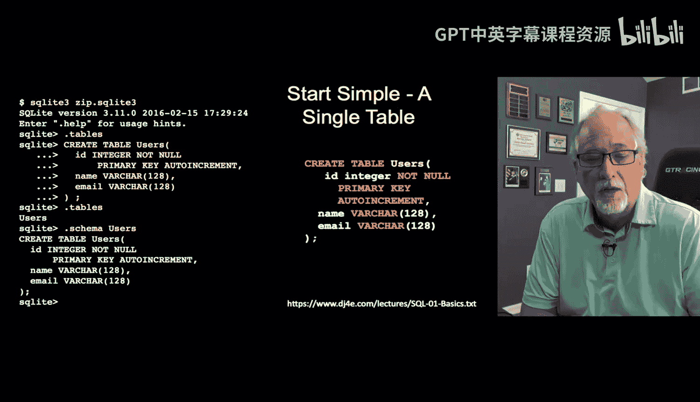

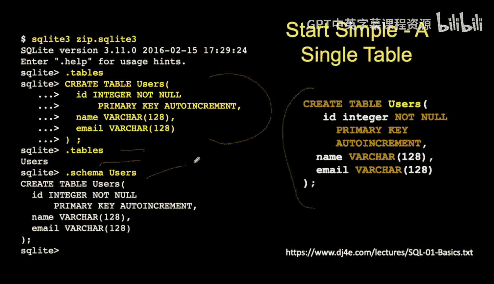

And here's a series of SQL commands from a previous lecture just kind of as review。

 it's pretty simple CRD now one of the problems is as I mentioned is that different databases like Postgres and MySQL do all this stuff identical。

 but then some more subtle things like how foreign keys work which we'll learn in a bit or how they do limits like pulling like 25。

 next 25， Next 25 that's a little bit different。

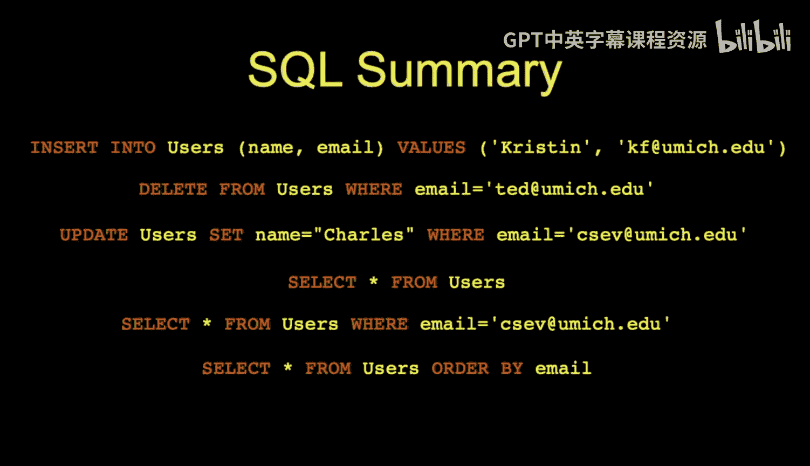

And so if you want to build an application that talks across more than one database。

 you' got to think a little bit and one solution to this also to kind of limit the fancy SQL you have to learn。

 I like to say that。

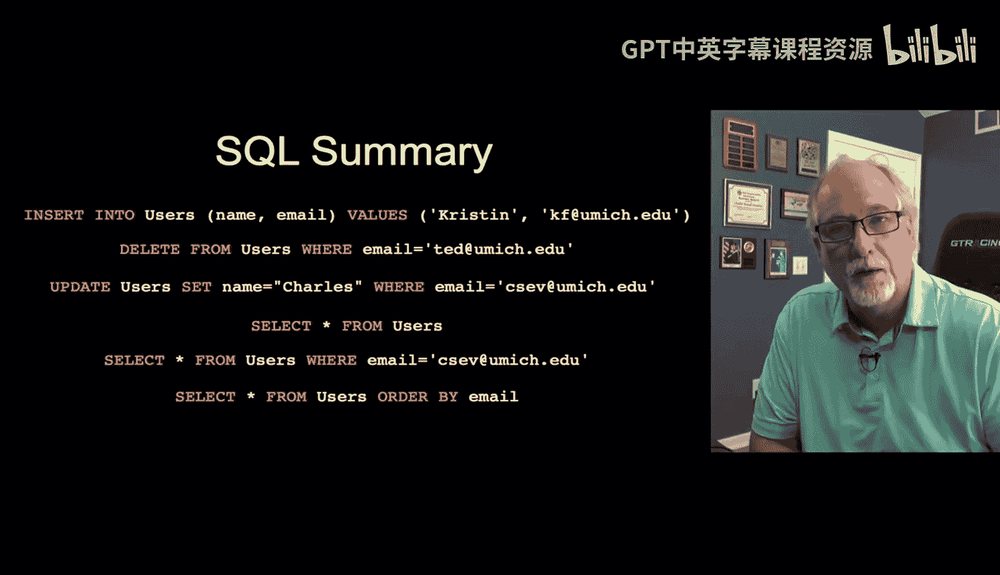

You know you can learn the first 60% of SQL in about three hours and the last 40% is literally a lifetime I mean and so it's advanced SQL is difficult to do it's really hard to teach a class in advanced SQL I can teach you advanced features。

 but then there are so many features that you just can't learn in a class because which database you're using and they're different for every database。

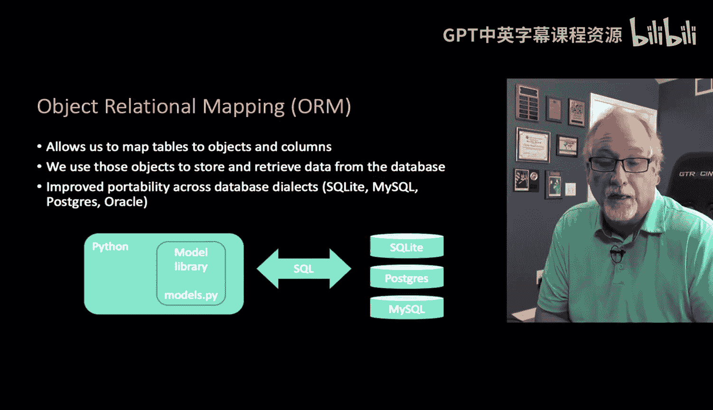

So one of things that's happened in the past decade or so is the emergence of what's called object relational mappers and that is to you have the physical database layer and then you have SQL which is an abstraction。

 it's a imperfect abstraction and then Django builds another abstraction on top of that called object relational mappers so we just create Python object and we ask that to be placed in the table now the object may have a name and an email address and you know a birthday or something in it。

 it can have all kinds of data in that object and then that maps into a name and an email address and we have to tell it like do we want this to be indexed and all these other kinds of things we communicate through the ORM so we leave the OM alone now injango as we get more advanced you can also sort of bypass the orRM because the way the objects are mapped into the tables is predictable。

The names of the columns is predictable and so it's kind of like it's a shortcut for。

 I like to think it's like the 80% of the most common things you do with a database are easily done with an object relational model but object ORM。

But ultimately， once you get to the more advanced things you tend to not be able to do that with an ORM。

 you get to the point where writing the SQL is easier than using the ORM。

 but for about 80% writing ORM code is way easier than writing the SQL。

The other thing that OM does is it allows you to。Have multiple databases because the ORM code inside of Django knows the difference between SQLite。

 Postgress and my SQL。

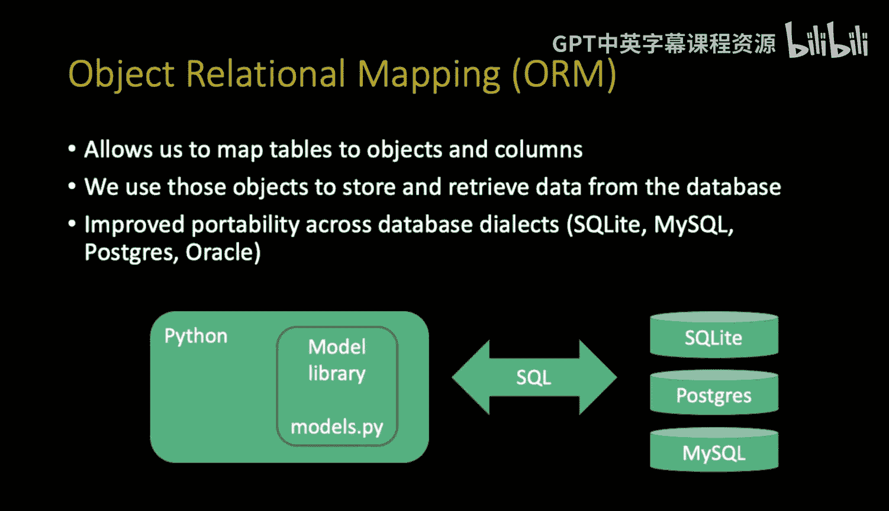

And so you could actually started an application that uses SQ flight during all your development and then when you dev to production you just go like。

 you know what， let's just use my SQL or Postgress instead and that's quite cool。

I find them limiting， and so just I want you to know both how to use objects and how to use SQL。

 but understand that most of what you're going to do is to use the object relational mapping and we get a lot of power。

With with this， so if we look at sort of the way we communicate to the database or the way we define the database。

In SQL， we create a table and that right there is portable。

 but once you start doing things like adding auto increment columns and things like that。

 it stops being portable。

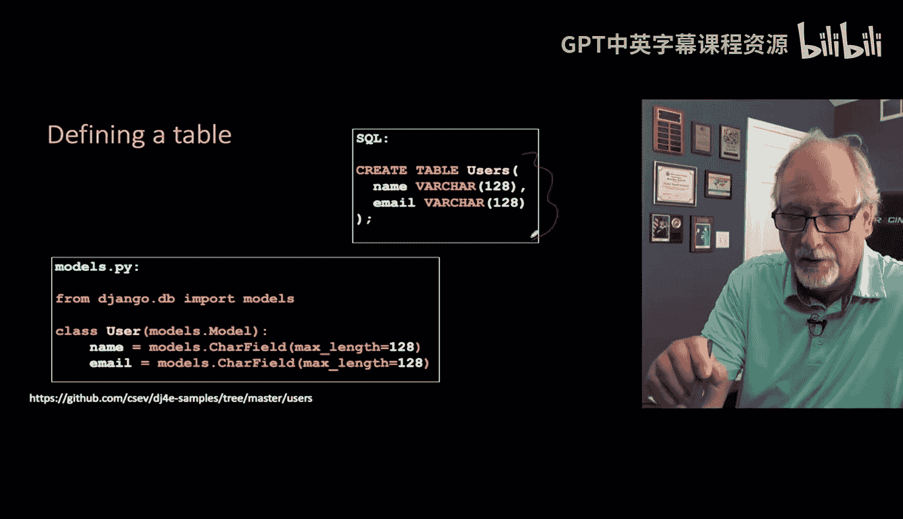

And so that's the way we do it， but in Django， the way we do this is we have a file called models。

pyy and it's in the application folder。And then we are going to use object orientation。

 so we're going to from Django。db， that's a package。

 we're going to import models and models is now class and we are going to create a class called user。

This is going to be equivalent to the name of the table， and we're going in the definition。

 we're going to extend models。 model and so there's a lot of this is called extending。

 it's called inheritance。We're going to get a lot of features and functionality。Excuse me。あ。

We're going to get a lot of fixture and functionality from this code， so there's probably 20。

000 lines of fancy code that we didn't write that we're using by extendingmodels。mod。

 we're getting all that。And then within here we create a couple of attributes that basically says give me a character field Model is a class。

 char field is a method within that class。 max length equals 128， and that gives us the name。

 These two things are equivalent and what happens is is when we build this and we do what's called run a migration。

 then Django will make this table for us， but then we have this abstraction that we can use to talk to it。

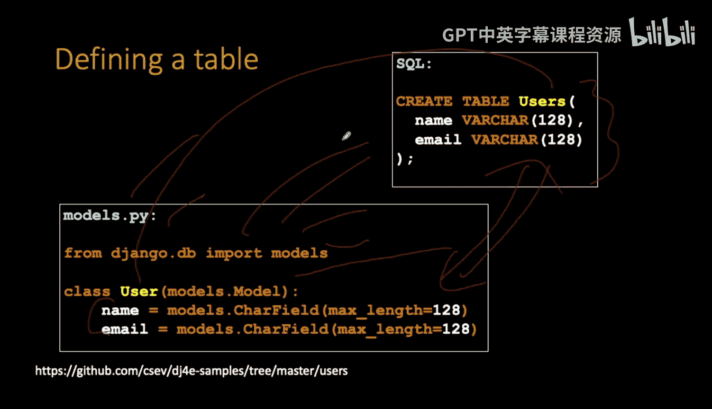

So this is called a migration and so you have to be in the projects folder and so once you create a migration inside of your Django application then you go up into the Django project and you say Python3 manage do PY now manage Py is kind of like the thing that starts everything so make migrations is actually creating files because the idea with migrations is that you would debug your migrations like on your development environment and then once you know you would move them to production so youd make the migrations in development environment you get them right and then you'd like check them into Gitthub perhaps and then in production you would pull your migrations out of GitHub and then the migration so the make migrations。

The make migrations bit that is creating a set of migration scripts。

 and you can see that it's making these files and their actual files and you can go find those files like 001 initial PY。

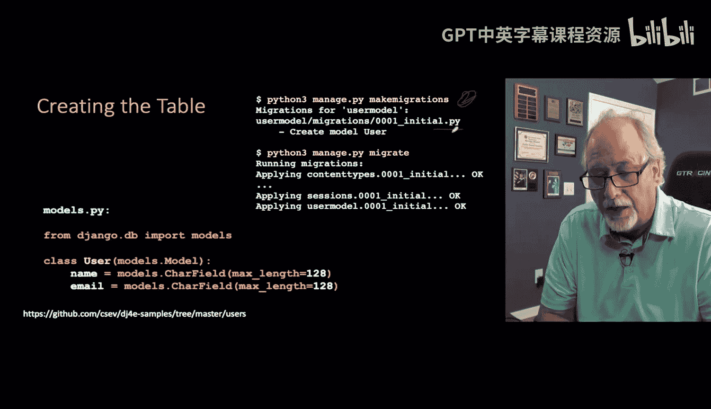

Then the migrate is reading the migrations and then actually changing the database。

 so that's the one where you might be able to make a migration and that and it doesn't matter what database you're going to use could be your development in SQLite and production in my SQL。

You would do migrate in both of those and in your development it would make an SQL light database and in your production。

 it would make my SQL database and put the tables in and the SQL might even be quite subtle and it will be subtly different between them。

 but you don't care， so migrate is the act of creating the database。

Now in our development environments， we're going to be creating a file called Db。sqI3。

And so if you get all messed up， you don't have to remake your migrations。

 they're just sitting there kind of as part of your source code， and you can like get rid of the Db。

sqLite3 file and then run the migrations again if you get kind of messed up。

So the make migrations reads this and creates these other little files， you can take a look at them。

 they're kind of like Django's internal files， they're Python。

 it's just you're not going to write them by。By yourself。

 but then the migrate reads the 001 initial dot Py and then actually creates SQL commands and runs those SQL commands for us。

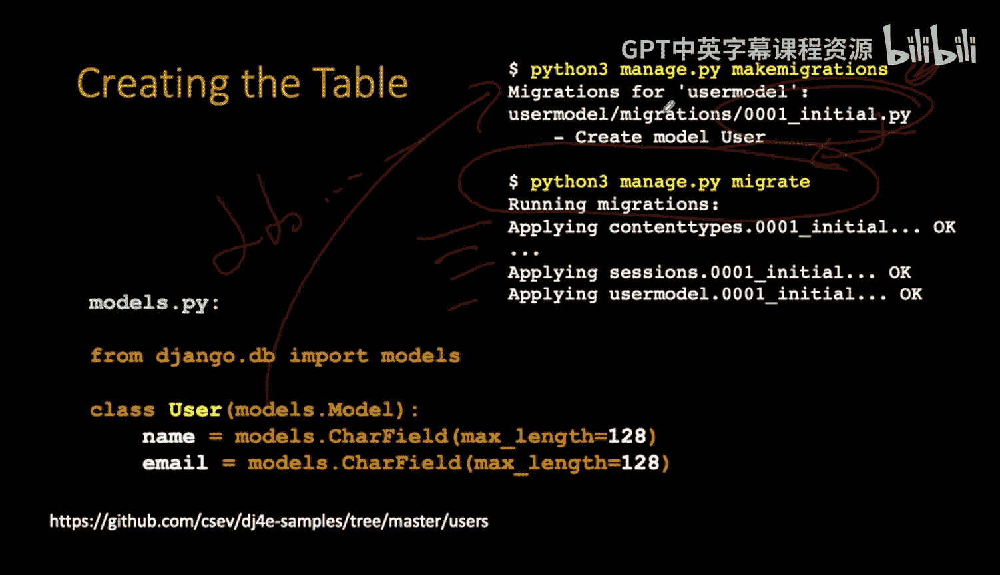

And so if we jump after we've done this， we see this file Db。sQLI3。

 and we can jump in and take a look again， you have to be in the right folder so you'd be in the Django underscore projects。

And then the folder of the project， but there'd be a file called D SQLI3 go into a Linux command line。

 type SQLite 3 DBSQite3， and you will find a whole bunch of things when you go into SQLite and you type tables you will see that django has a bunch of migrations that are all there from the sessions and stuff we're going to learn how to use later authorization etc。

 et ceter。 But then the particular data model that you created which is a user data model there's a table in there for that and if we use the schema command SQI3 and we say。

 hey， what is in that user model underscore user table and it you she a create statement right and so this is the actual create statement that the Django sent to SQLite to create the table and I was talking about some of these things are quite predictable the name of the column is quite predictable ID name email etcter it adds the ID feel for you automatically and most of it's portable like this part here is quite portable but this ID statement here。

Pmary key auto increment turns out that if you're in mySQL or Oracle or a Postgress or SQL light。

 that's a little different， but literally the migrate takes care of all that because the mi knows that thing and as mySQL changes。

 that particular syntaxt doesn't change very much， but as mySQL changes。

 then the django stuff changes and it all kind of works out。

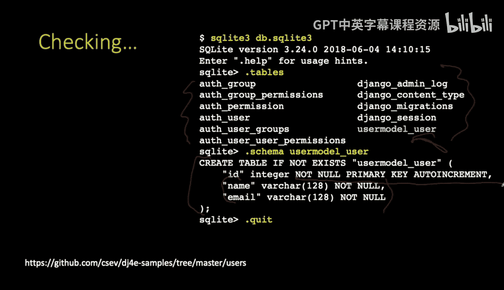

And so you can sort of run these commands and then sneak back into the database and you can see what they've done。

So I'm very predictable。I'm going to spill my coffee on my computer。So。

You can also talk you're talking at the low level when you're running the SQI command。

 but you can also be in that folder， same folder that has Db。

sQite and managepyY and then you can start what's called the shell。

 so this is different than the Linux shell and you see the prompt change from dollar sign to three Cheevrons。

And it's not the same as the Python shell， although it is the same as the Python shell with a whole bunch ofjango libraries that are premounted。

 okay and so if you just say，Python3 you'll get this but this next command that is from user model models import user that will fail unless you let managed。

pyystar your shell because again it loads a bunch of objects and classes into your space and then all of a sudden user model。

 models works users there， etc okay so this is pulling from your models。pyy file that you built。

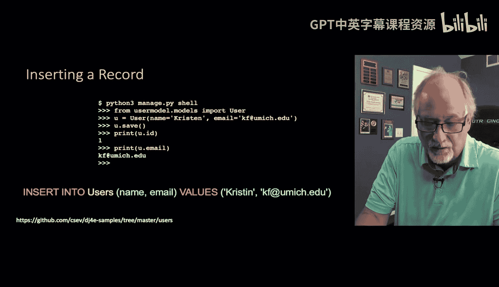

And so user model is the application name and models is the Model。 Pwi file。

 we import the user model， which is in this case， a class user is a class。

And we're going to do a constructor call and so we're going to say let's make a new user set the name to Kristen in the email to that email。

 and this actually has not done anything in the database this creates。

 in effect just a Python variable。And then to force it to readwritten to the database。

 we call U dot save and so save is a method on this new user object， capital user。

 capital user is a class。We're using a constructor to construct from the class an actual instance an object and then we get that into U。

 the instance object， and then that object sits in our memory until we say save and then it also pushes it back to the database now one of the things that the save does it assigns and effect a serial number。

or a row ID the if you look at these， they start pretty predictably at one， two， three， four five。

 but if you're getting a bunch of things coming in from a bunch of places。

 then the database just assigns each object， each row and that's part of that whole。

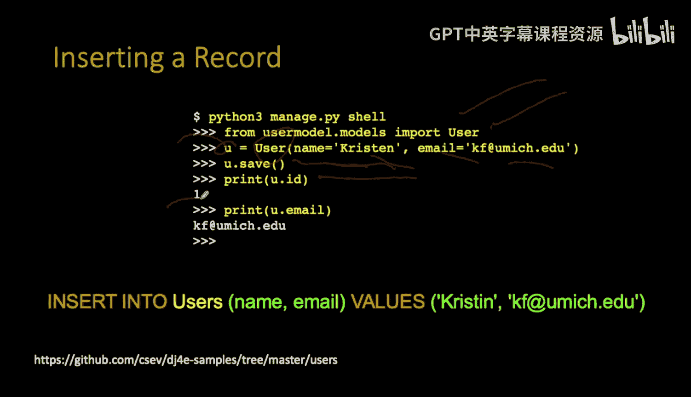

Autto increment thing come on go back up this whole auto increment thing that says hey database。

 I'm gonna put records in， I'm gonna to give you the name in the email and you come up with a number。

 but then when you're done I want you to tell me what the number is and this is how you get that number by saying oh print U ID Now if you printed U ID before you did to save it wouldn't exist and then print U dot email you can see this email is just the data we put in but now this is not only in your you variable but it's also in the database as well okay。

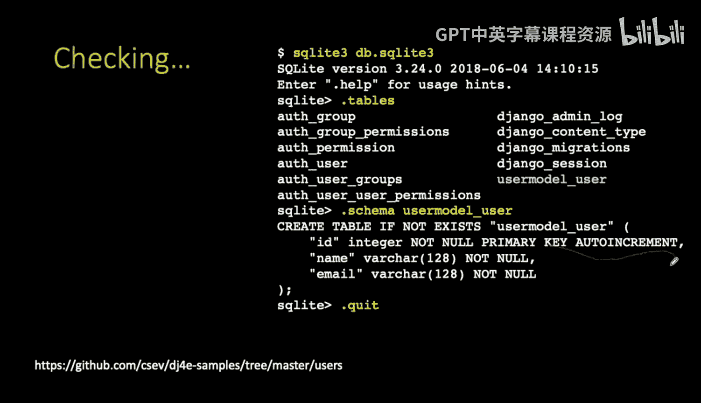

Now。We can。Dig a little bit into how this object relational mapping is working。

And so if you're in the middle， you're doing things like that last statement。

 you can from DjangoDB importport connection and then ask connection。queries。

 and then what it does is it just shows you a little bit of debug data and what it did。

 how it started。The fact that it ran an insert statement and again this looks kind of familiar is it's making up SQL for you for that insert the save statement right that save statement there。

 it's making that insert for you and then you can actually see what it's doing right and so this save you know set up a thing and save it you don't need to know insert into or whatever because because the object relational model does it for you right and this is kind of what we did before insert into capital users by hand。

And so again， you will find this ORM is going to save you a whole bunch of time for 80% of the things that you do with the database。

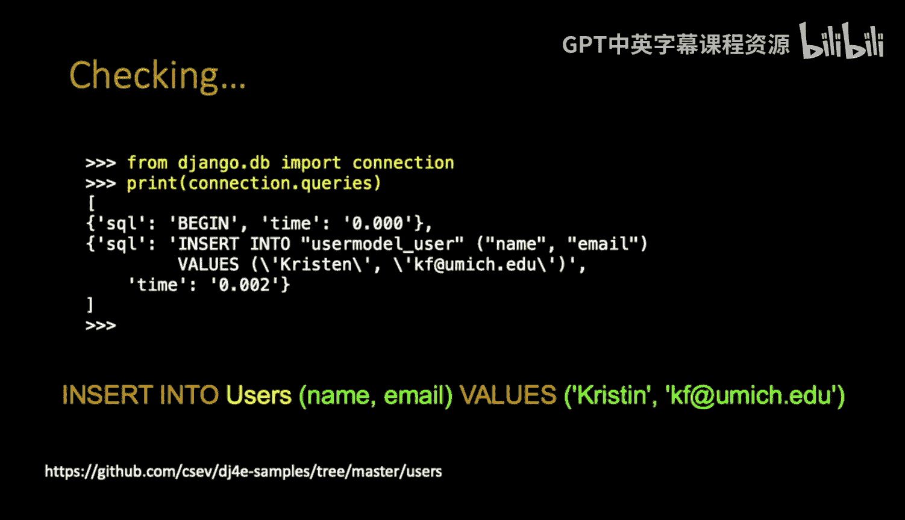

And so you can do basic crud operations with this object relational Maper， the save is the insert。

You can select is basically user object values that's like select star。

 so give me all of the objects， aware clause is user objects filter and there's your where clause。

 this is a emails a column name and C7U。edduu is a value in that column values is actually go get them so you can create kind of a query so if you don't put values on you get sort of a query that's not yet executed and then values says go do it do it now。

诶。So you can do a different you can delete something where you say and so this is a little different syntax。

 this is kind of a selector that says these are the variables to select and dot delete says I mean the rows to select and then delete those rows values says retrieve the rows。

 delete says get rid of the rows and then you can again the same kind of thing this is kind of likeware clauseuse。

 user objects filter email equals C7 image study to you dot update and then change this column in a way and you can you know go retrieve all the values and there are things that correspond to lots of the SQL like give me all these values order by email etctera。

 ettera， etc。

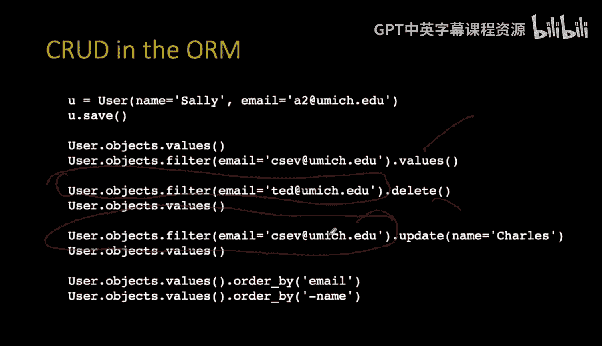

There it's。It's kind of a one to one mapping and you will， again。

 you're going to do a lot of programming using this ORM in Django and every once in a while you'll sneak down to SQL and that's why I sort of teach you the SQL first。

And there's lots and lots of fields that might not actually be represented exactly the same way in the database。

 so for example， an email field databases commonly don't have email fields。

 there might be some databases that have emails and know that don't but because the object relational mapper is a layer between you and the database and you say I'd like this to be an email field then it can add rules and stuff like validity checking etc。

 to say you know what that doesn't look like an email address。And so there's all of these things。

 and these are very useful。And later we'll talk about connecting tables and we'll use things like foreign keys and many to many fields and one fields and are more those are less about the data and more about the connections between tables。

 which we'll talk in coming up soon。

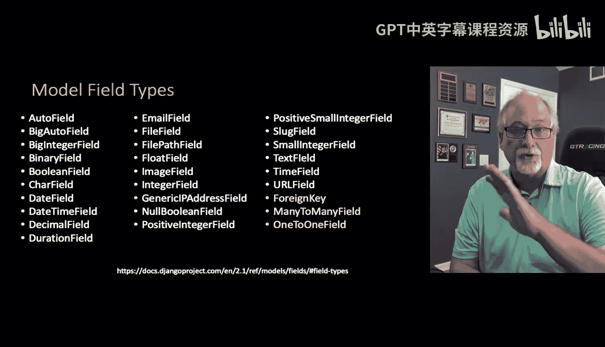

And so just to give you sort of a bit of a sense of where you're at。

 this is our application right and so we have a browser on the left hand side with a user doing some clicking by now you may have created a URLs。

pyY file， and that takes the syntax of the get request。

 slash this slash that s whatever and routes it to a particular view coming from the views。pyY file。

 you may or may not have made one of those templates and forms help produce output。

But the models are our interaction between us in the database。

 and so the actual code we write in Django can talk through the models to the database。

 which you may not have done yet， but this shell is talking through the Django models to the database as well。

 and if you're starting to use the admin user interface。

 the mid user interface talks to the database through the models and it's inform by the kind of things that you add to admin Py if you want to use the Djago admin interface and have your models shown a particular way。

 it's got a bunch of defaults but often you want to override those defaults and so that's what you put in and the model PY file informs this connection between the database and it also sort of informs the kind of code you write here in a view code in Python or in the Python shell。

 that's kind of the Django shell which is a Python shell with all that stuff added to it。

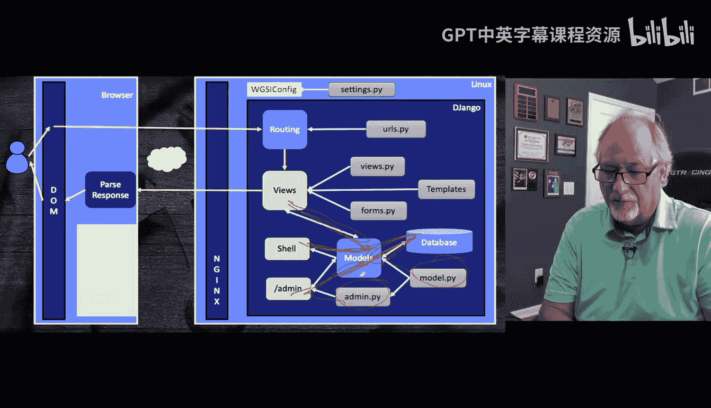

Okay so this model。t pY is critical to defining our relationship between all of our Python code and the inV user interface and the actual database。

And so you'll see a recorded demo where I go through a bunch of those things。

 which I kind of just showed you it's just actually doing it in a demo form。

 but it's all mostly in this lecture。And so the Django model is Django's version of an object relational Maper。

 you can write Python code after a while especially if you have an IDE that can show you what objects have and stuff。

 you tend it's a lot easier to write whereas SQL you have to know it and write it。

 you gain database portability， you can create these migrations to both build your initial schema in your database and then evolve that schema as your application involves。

 that's one of the more valuable things if you're building straight up SQL going from like version one of your database to version two of your database it is kind of frustrating and difficult。

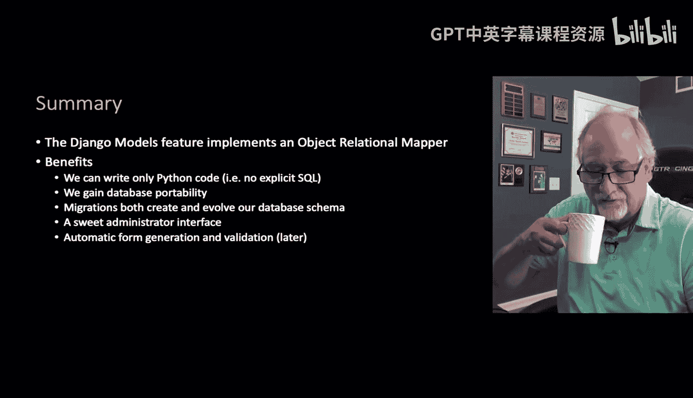

Sometimes migrating and evolving a database is harder than actually writing the SQL code in the first place。

And Jenangle gives you right out of the box， this's a really cool administrator interface。

 the models do P and admin PO informs that。And later we're going to have all this automatic form generation and so what we're doing here is it seems like we put like three lines of code into some file and then a whole bunch of magic happens and that's really how Django works and the idea is is that way you as the developer can focus on the columns of your database and forms that you want to put up and spend less and less time sort of manually building HTML it's very sort of brittle and SQL that's less brittle but still brittle and so that's the idea and so it's a little hard when you're getting started because you like just the amount of code you write is so small and to what that accomplishes is so great。

 but after a while when you get all these little tiny pieces figured out then all of a sudden you're like okay now I want to solve that and user's problem and you can spend all your time solving that problem rather than just making databases and those kinds of things。

So see in the next lecture， cheers。