# 密歇根大学《给所有人的Django课程（简介、开发Web APP、特征和库、JavaScript和JSON）｜Django for Everybody》中英字幕 p32 06_02_03_Django迁移.zh_en -BV1Kt421V7EE_p32-

So it's pretty easy to get confused when you're first looking at data models， migrations。

 and the database itself， and so I want to go through this in a little bit more detail。

So the make migrations is what reads the models。pyy files and then it creates what are called migrations and the key thing is is this is guided by the list of applications in settings。

pyy so if you make a new thing and make a new application and you edit the model file and you try to run a make migrations and it doesn't see anything like what did it just do well did you edit your settings。

pyy because there is a thing called installed apps in your settings。pyy。

Now migrations are portable across databases this means that the migration is a logical description of what the tables should look like and they're an evolution。

 What they mean is like the first version of this table from the first models pi when migrations was first run as001 and then if you change models do py and you run a migration again it looks at the changes from the migration 001 to models do py and then 002 and then 002 is not like wipe it all out and start over it's like 0 wait you just added one column I'll go ahead and add that column but it's not done it in a way that's actual SqL So migrations are themselves kind of Python like。

And they're portable across databases， which means that you might on your computer use SQL light and in production you might use my SQL and the migrations are the same for both of them because they're just saying。

 here's the columns， here's the types， here's what they're supposed to be now。

That's contrast that with a migration， Mi command。 The Mi command reads all the migrations and then knows what database it's talking to and runs the Sql commands to create the necessary tables and or evolve the necessary table。

 So it looks and says， oh， here's the first migration。 Here's the second migration。

 Here's the third migration。 I'll make the table。 I'll change the table， I'll change the table。

 I'll change the table。 And at the end of all the the migrate then goes through all the migrations and then has a database table that reflects the sum total of the migrations which also reflects the latest the latest models pyfi。

 So it's a little complex。 It has to do with database portability and the fact that we want to separate out the portable parts of this for from the non-portable parts to this。

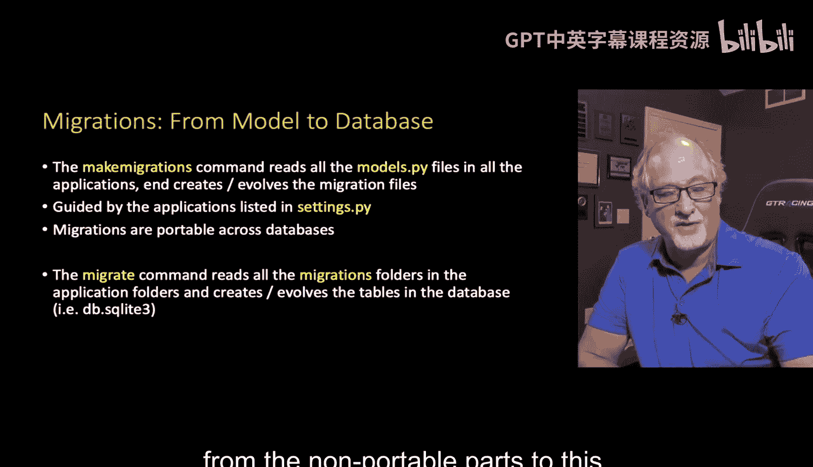

So if you look at the make migrations。And here's in DJ free samples， my little sample stuff。

 there's lots of models in there and if you take a look at all the models。pyy。

 you see that for every application in the DJfr samples project， you see a models。

pyy file and that's a Python code that's class book， blah， blah， blah。

That's very portable and that's how we in our Python code in our Django code see the database model and when you run the make migration that produces these migrations files and they're just in like autos migrations001 initial do PY etc。

 so you see some of the ones I have here there's actually two of them so it sort of made the first one and then then I must have changed the models file and then I ran make migrations again and it showed it recorded how that model changed from the first version of the Model file to the second version。

If you can look at these， don't edit them， you can check them into GitHub， but don't edit these。

 but take a look， they're a very portable representation， they kind of look like the models。pyY file。

 you're not supposed to change them you're supposed to generate them with make migrations。

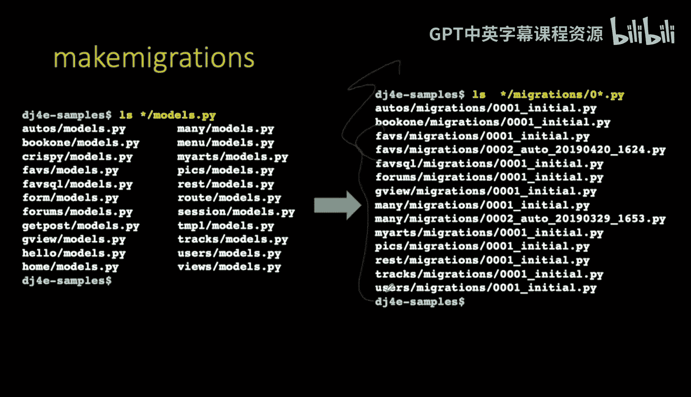

And again， those can go into GitHub。Now。The migrate basically reads all those migration files。

And not just one， but if there's a sequence of migration files。

 it applies them all in order as needed。 And if the database has the first and second migration applied。

 but not the third one， it knows that and says， you know what I'm going to just tweak this database that already exists that's already running and then add a column or change the width of a column or whatever it is that you've asked to be done by editing your models do Py。

 So in the migrate is done you then end up with a whole bunch of tables in your database and they're all based on the name of the application and the name of the the model within the application。

 And so somewhere in here is。

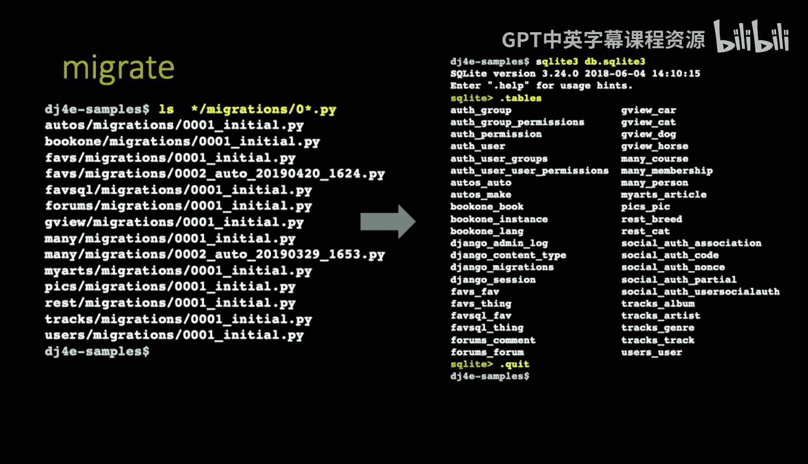

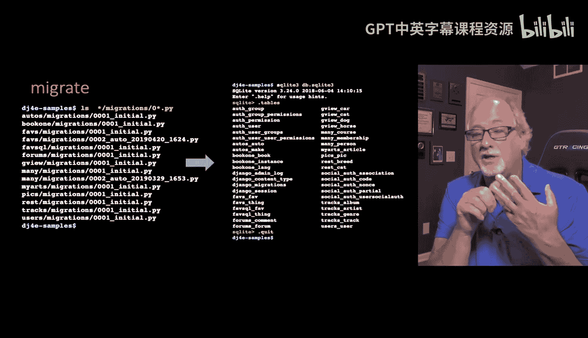

呃。Book one book， book one instance in book one la， though they're all sitting there。

 and so those are all the tables and we took a look at those tables before。

 but that's the migrate that goes from all the little migrations spread across all of the applications in this project and then puts a database together that has all those things。

And I keep saying that the migrations are all about evolution， right？Because if you take a look here。

You see one little table called Django migrations and what Djago's doing in that Django migrations table is remembering which of those migrations have already been applied to this database。

 so as it's going through the migrations， it says， oh。

 here's one that's not yet done in this database， so I got to tweak the database just a little bit。

 so it remembers the migrations that have been done。

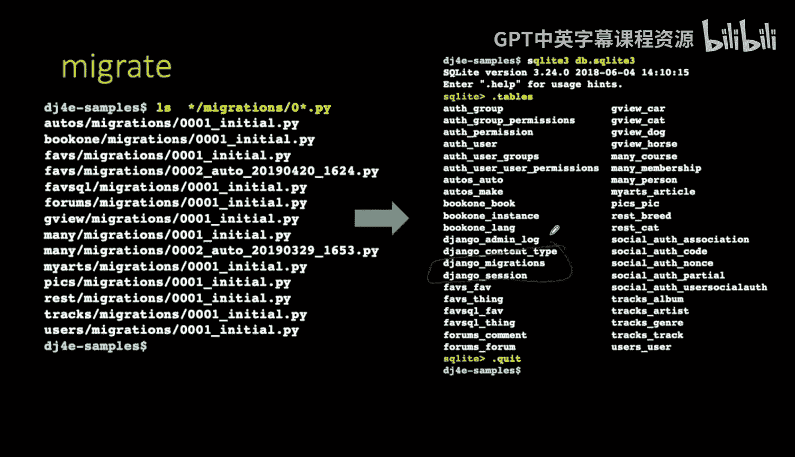

It's pretty fascinating in these little tiny applications。

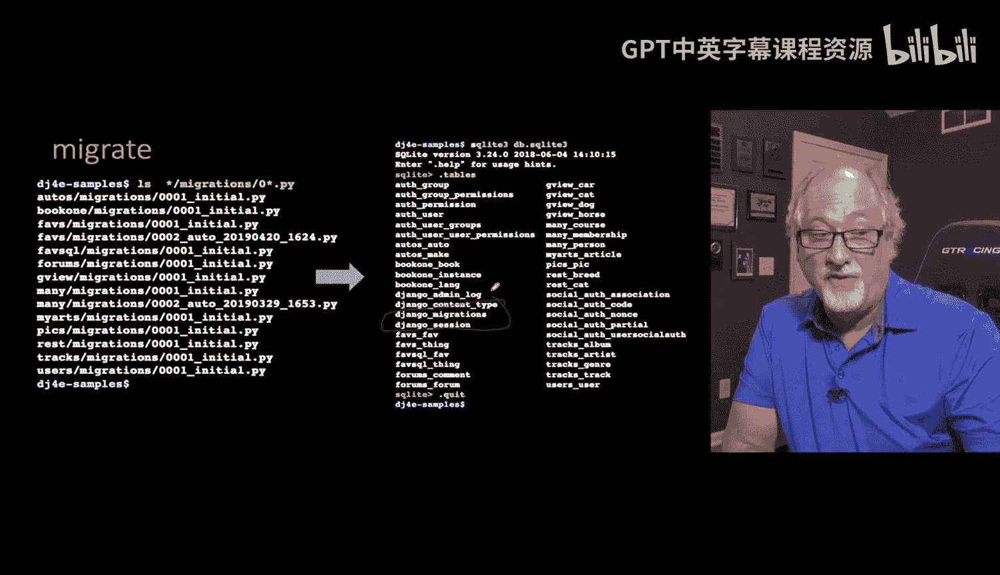

We we don't always need to be so clever about that so sometimes what you want to do is just like I'm confused I'm going rerun the make migrate because you're not really running production you're just really doing it over and over again so you can rerun the make migrate and the way you do this is you basically simply delete the file you go you can delete these files I would delete all the ones that start with zero right if you're going to rerun make migrate just make rerun make migrations delete all the ones that start with zero just and this is an application migrations and then get rid of all these and then you can rerun the migrate make migrations and it will read your models py file and then it will do all of the necessary things to recreate the migration file。

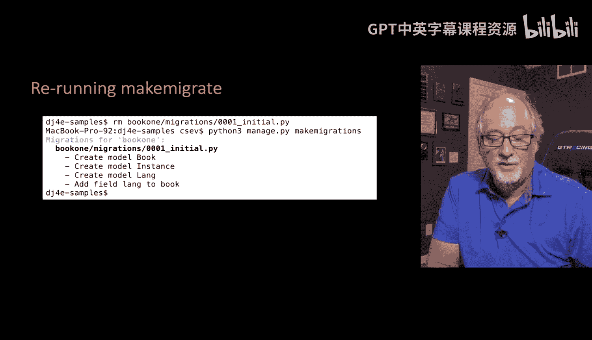

Now that's not the database， that is the instructions on how to create the database。

So that's how you rerun make migrate。

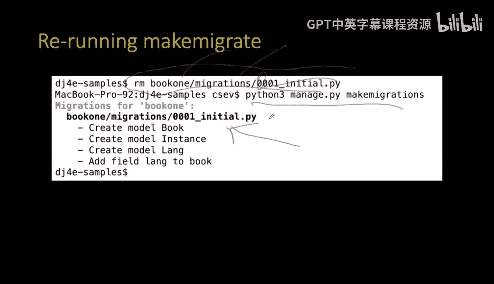

You can run migrate from scratch this is actually easier so you can kind of wipe out the migrations for one application and I did that just wiped out the book one here。

 that's what I did and started over but。

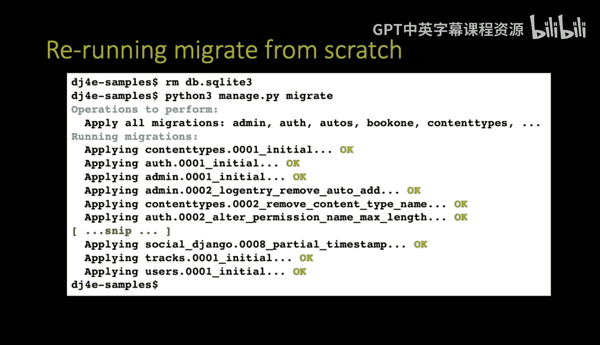

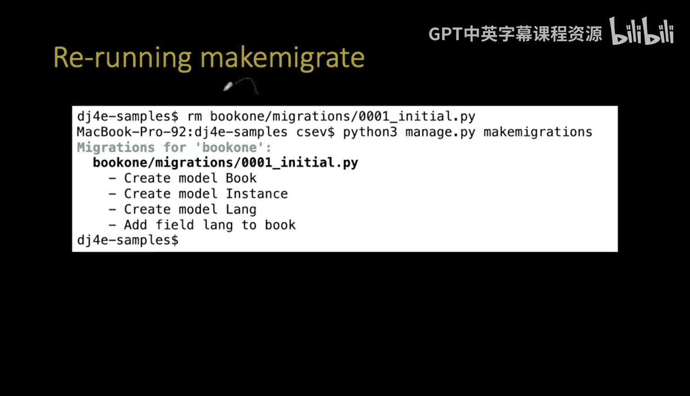

You can wipe out all the migrations in all the database and everything by just removing the file in this case because we're running SQLite。

 just wipe out the file Rmdv do sqite because after migrate。

 that's where everything ends up is in that file。 So then you wipe that out。 It's gone。

 Now you might have create an administrator account or something and you're gonna wipe that out too。

 you're going to wipe the data out， you're gonna to wipe the tables out。 it's all gone。

 it's one thing I like about SqLite， you remove this one file and it's literally all gone and then you rerun Python managed migrate and it reads all the migrations and makes you a nice。

 clean， perfect empty database。 So if you're kind of stuck。

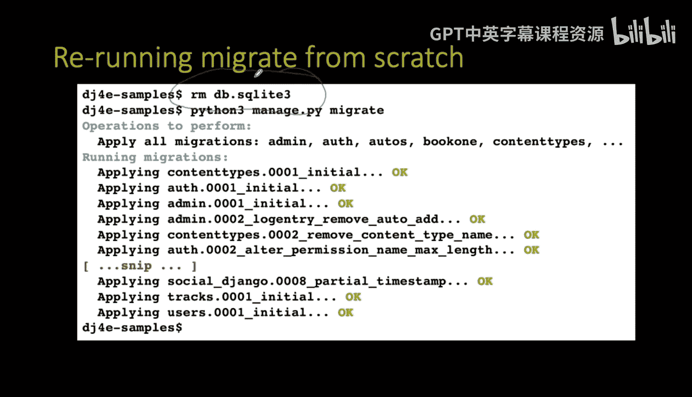

And you're not afraid of losing your data， which in most of the beginning programmers。

 it's okay to wipe out your SQLite thing and run migrate again， just go ahead and try it。Like I said。

 if you made an inmin account， well， you got to make it again， but that's the worst that you can do。

 so at least in these beginning applications。

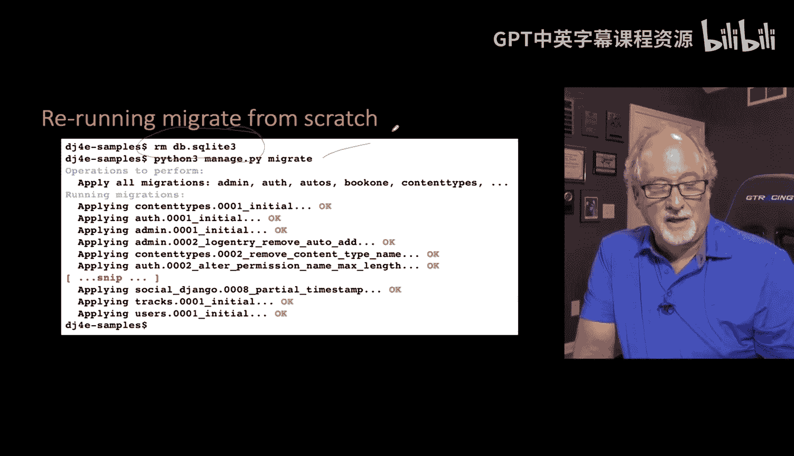

So now that we've talked about how to come up with a data model， how to encode it in Jjagomod。 PY。

 how to do migrations， and how to migrate stuff and how to make a database out of it。

 now we're going to talk about the kind of Python code that you can run to update these models in the database。

