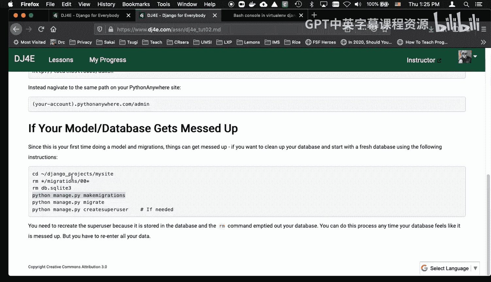
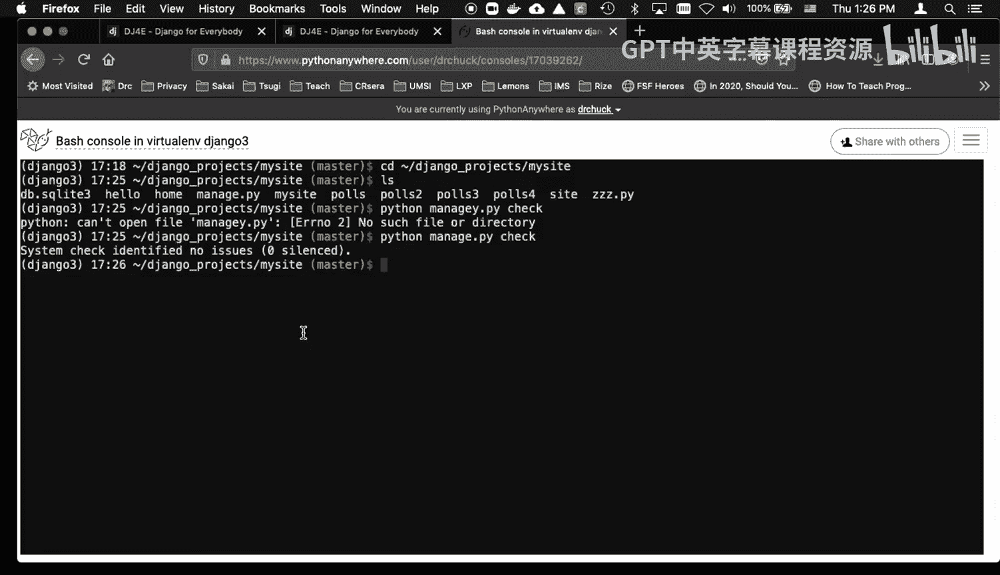
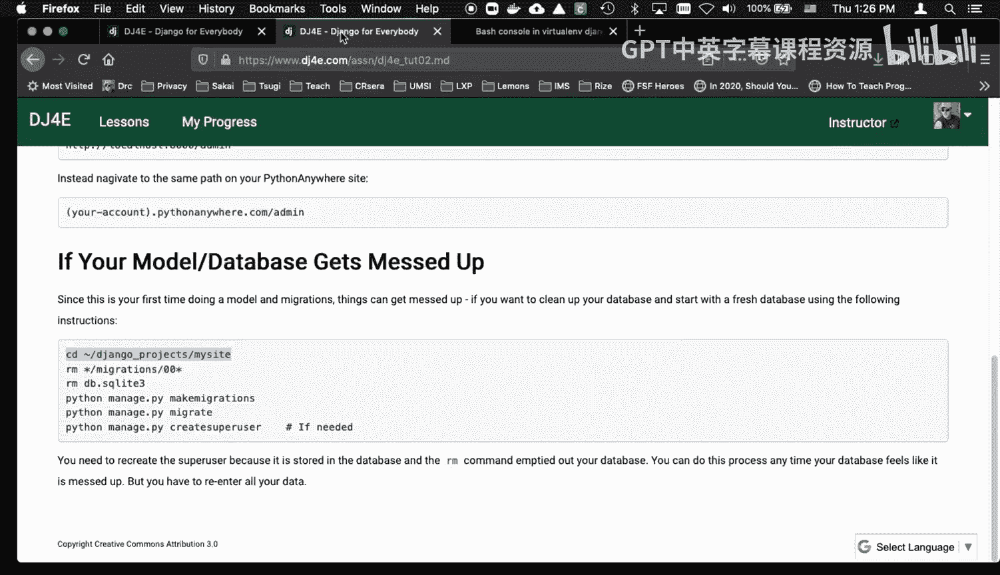
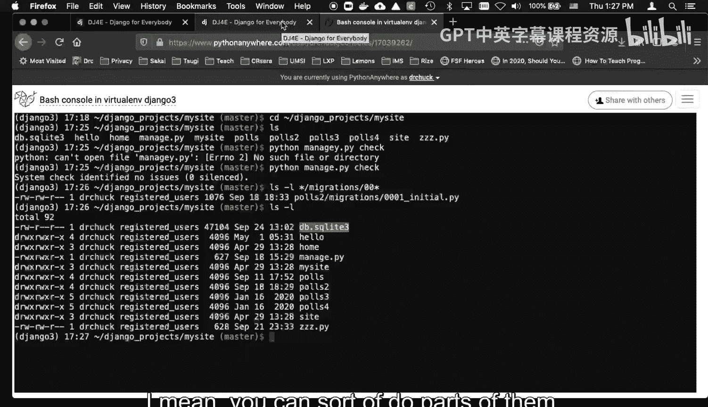
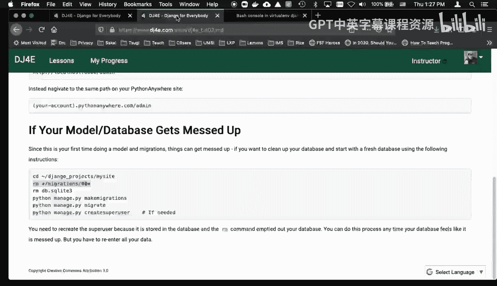
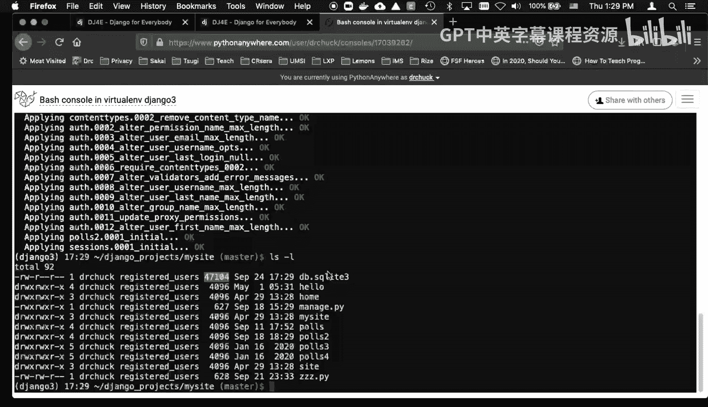
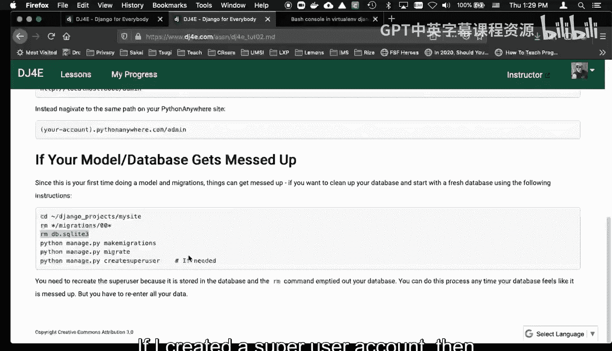
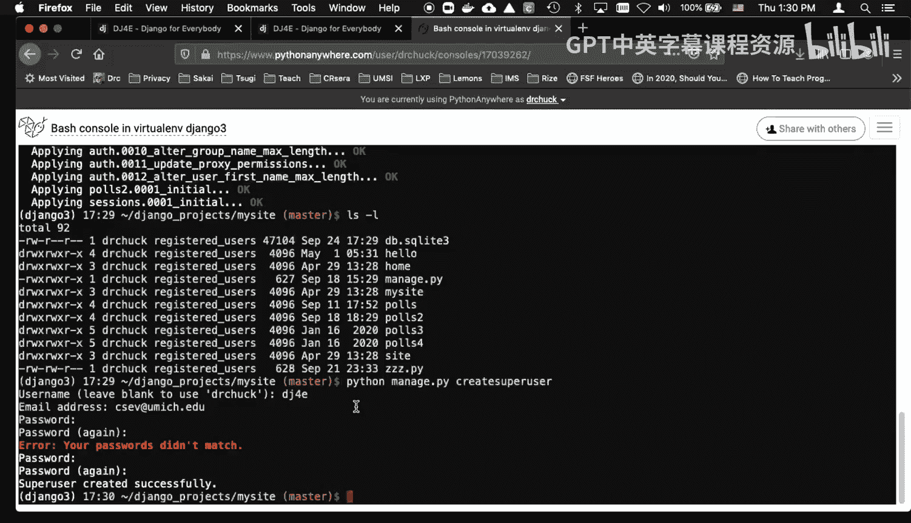
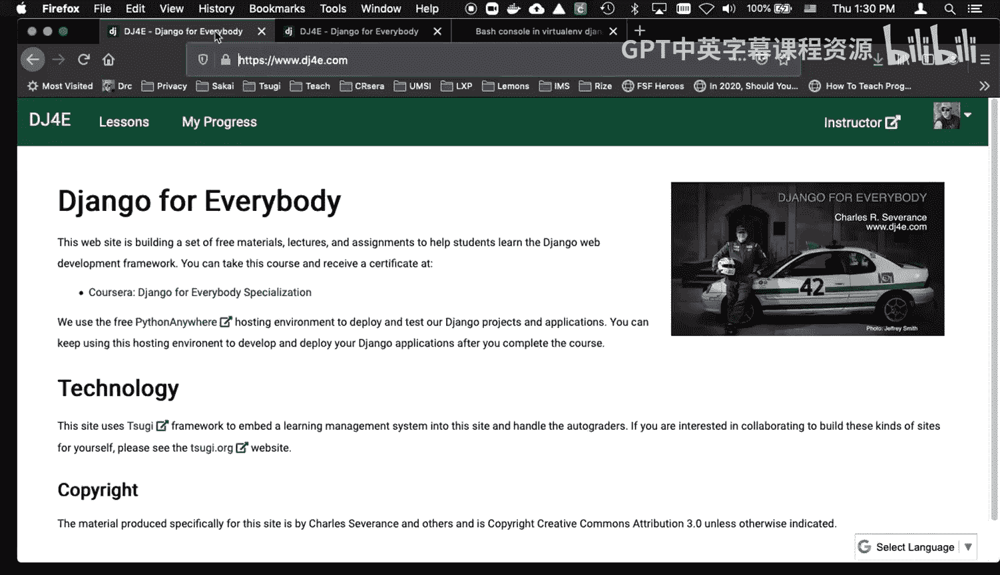

# 密歇根大学《给所有人的Django课程（简介、开发Web APP、特征和库、JavaScript和JSON）｜Django for Everybody》中英字幕 p34 08_02_01_重置SQLite3数据库.zh_en -BV1Kt421V7EE_p34-

Hello and welcome to another walkthrough for djago for everybody。

 This is kind of a supplement to tutorial2 In tutorial2， you're playing with models。 Py。

 and if you go through the tutorial， they'll have you do a thing and then they'll do another thing and they're kind of showing you migrations and how the migrations happen。

 And if you get them to have a mistake。You know， if you make a mistake， then。

You can get to the point where you need help or whatever and sometimes it's easier to just like wipe out your database。

 but if you've added a question or added some choices or build models， you got to do all that stuff。

 but it's sometimes just easier to reduce some of those things so I'm going to show you what to do if your model s database gets messed up and like you managedpyym migrations and migrate are not doing what you think or they're giving you weird errors Now they're getting a syntax error make sure you do a Python managed Py check right before you declare that your database is messed up。

So let me go into my。Go into my site。So here I am here's all my files。So here I should do it。

 before I declare that the database is a problem， managed PY check。You know， oops。Oh。

 I messed that up。I am in my purchase environment， of course。Okay， so we got no issues now。

 so that's good。

So there's I got a couple commands here。 Let me explain this before I'm going。

Actually， delete these。 I want to show you where the migration。 I probably showed you this。

So I have a thing called polls2 and I got all the polls running， so this is like in tutorial2。

 the migrations are in files with this with a number and their Python files。

 so if you recall migrations are portable representations of what happens in the database。

And then the migrate。Creates the file D toQ light。So you you need if you want to really start over。

 you got to get rid of both the migrations and the Db dot SQL like file。

 and then you can start completely fresh if you， I mean， you could sort of do parts of them。

 but I'm like， a if you're messed up here twotor2， it's probably easier to just get rid of them both。

 So at this point， my application is going to stop working。 so I get rid of the migrations。

And then。

I get rid of my database。And so at this point， the only thing I got that has to do with anything with a do with my database is a few models。

pyy files， and this is where we are editing our code。

 and so this polls to models Py in my particular example is the code that's going to be effective because I。

Just because I've got all the versions running at the same time， that's why you're seeing this。

So the next thing to do is Python3 or Python manage。あPワ。Make migrations。

So what Make Mis is doing is it's reading all these models py files and it's writing this file。

 so I got rid of that file， but now if I do an LS， you'll see that it's come back。

And sometimes you might see an 002， et cetera， and then you throw it away and you make it fresh and you should only see an 001。

 and then you can say Python。Manage PY， migrate。And then咧。Well， if you'll do an LS。

I need control C there。 and if I do an LS， you'll see that dirt。wait a second。 How come that。

The F DBSQL 83 is zero size， so I'm going to do Python 3。Python manage。Sorry， my Mac。Migine。

So that's reading。That's reading these files， plus a whole bunch of other ones and actually creating databases。

 so now if I say Ls minus L my DBSQLI3 is back。

And I might have to create a super user if I created a super user account。

 then I'm going to have to create one again right and so I'm going to do that。

E J 4。诶， joke。S。I studying to you。I should make my passwords easier to type now at this point。

Things should start working。 But again， if I created any data like a question or something。

 it was gone。 It was going at that moment。 When I got rid of that database， D B S Q I 3。

 it is literally gone。 So it's gone now。 And a away we go。 And so I I。And again。

 this is just if you can't seem to make these migrations or migrates work， back up， start over。

 and then reduce some of the work， and that probably will be a good way to get things done， cheers。

