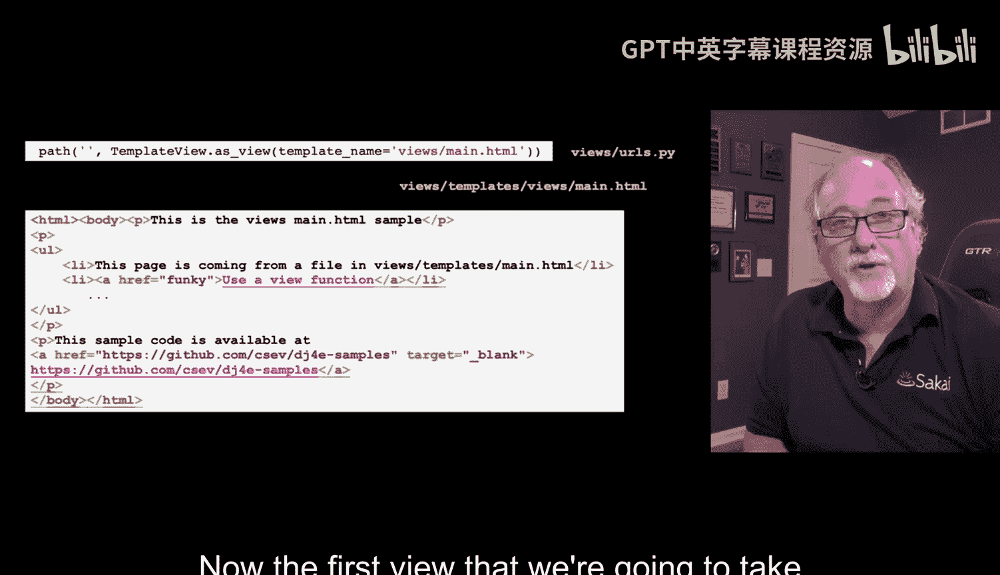
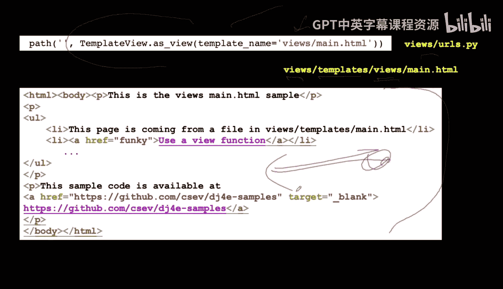
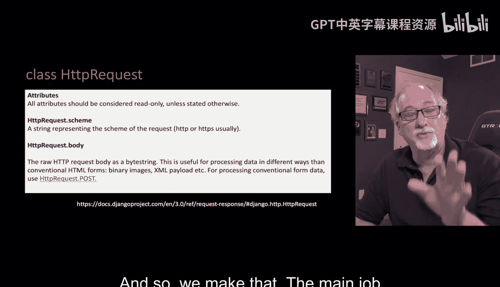
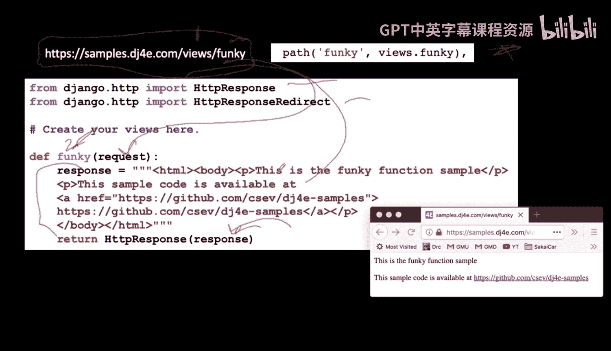
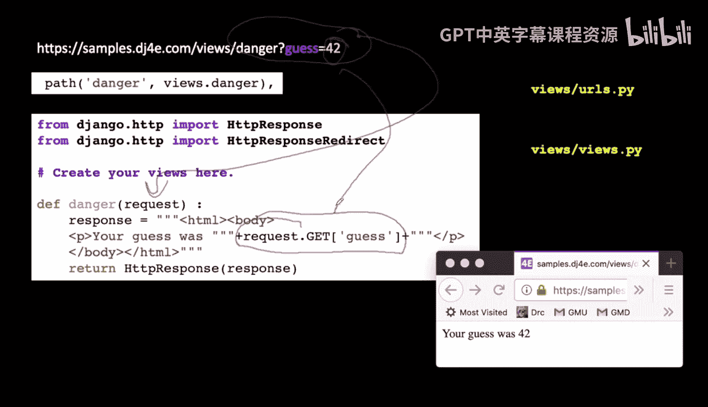
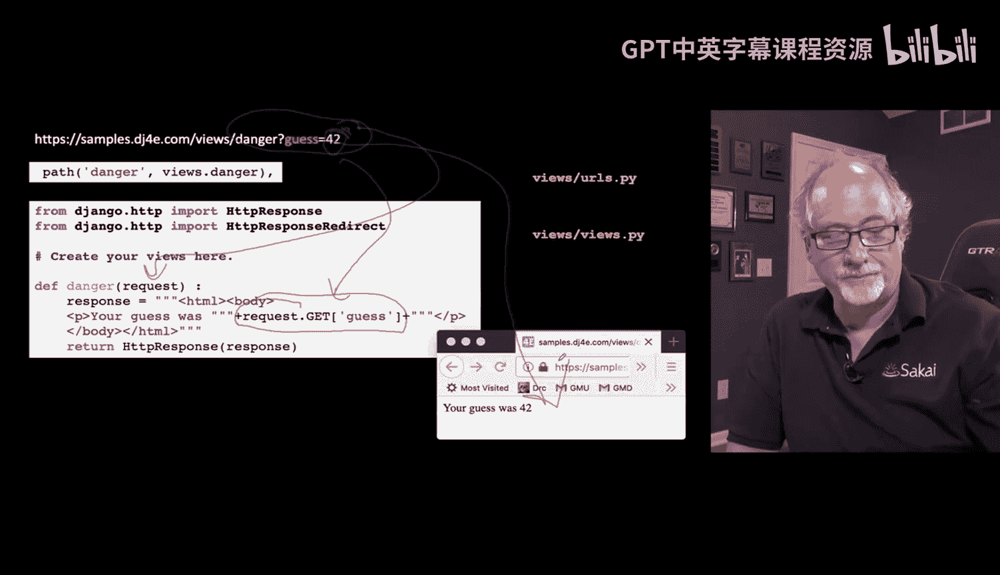

# Django for Everybody：第11章：Django视图


在本节课中，我们将学习Django视图（View）的核心概念。视图是处理Web请求并返回响应的关键组件。我们将探讨如何编写视图代码，从最简单的静态页面渲染到处理带有参数的动态请求。

## 概述

视图是Django MTV（Model-Template-View）架构中的“V”。它负责处理业务逻辑：接收一个Web请求（`HttpRequest`对象），并返回一个Web响应（`HttpResponse`对象）。本节课我们将学习几种编写视图的方法。

## 使用TemplateView渲染静态页面

上一节我们介绍了URL配置，本节中我们来看看如何创建最简单的视图——渲染一个静态HTML文件，而无需编写任何Python逻辑。



Django提供了一个便捷的类视图 `TemplateView`。你只需要在`urls.py`中指定要使用的模板文件，Django就会自动处理请求并返回该HTML文件。

**代码示例：**
```python
# 在 urls.py 中
from django.views.generic import TemplateView

urlpatterns = [
    path('', TemplateView.as_view(template_name='views/main.html')),
]
```



在这个例子中，当用户访问网站根路径时，Django会查找并渲染 `views/main.html` 这个模板文件。需要注意的是，模板文件的路径结构通常是 `应用名/templates/应用名/`。这种看似重复的命名（例如 `views/templates/views/`）是为了避免不同应用间的模板文件命名冲突，因为Django的模板名称在所有应用中都是全局的。

这种视图适用于简单的、不需要从数据库读取数据的静态页面。

## 编写函数视图

当我们需要处理更复杂的逻辑时，就需要编写自己的视图函数。每个视图函数至少接收一个参数：`request`对象。

`request`对象（`HttpRequest`类的实例）封装了所有来自浏览器的请求数据，例如URL、请求方法（GET/POST）、查询参数、请求体等。视图函数的工作就是处理这个`request`，并返回一个`response`对象（通常是`HttpResponse`或其子类）。

以下是编写一个简单函数视图的步骤：

1.  **定义函数**：在`views.py`中定义一个函数，第一个参数必须是`request`。
2.  **编写逻辑**：在函数体内编写处理请求的业务逻辑。
3.  **返回响应**：函数必须返回一个`HttpResponse`对象。

**代码示例：**
```python
# 在 views.py 中
from django.http import HttpResponse

def funky(request):
    html = """
    <html>
    <body>
        <h1>Funky Page</h1>
        <p>This is a funky page.</p>
    </body>
    </html>
    """
    return HttpResponse(html)
```



```python
# 在 urls.py 中关联URL
from django.urls import path
from . import views

urlpatterns = [
    path('funky/', views.funky),
]
```

当用户访问 `/funky/` 路径时，Django会调用`funky`函数，并将包含请求信息的`request`对象传递给它。函数返回一个包含HTML字符串的`HttpResponse`，Django会将其发送回用户的浏览器。

## 从请求中获取参数

在实际应用中，我们经常需要处理带有参数的请求，例如通过URL查询字符串（`?key=value`）传递数据。这些参数可以通过`request`对象轻松获取。

`request.GET`属性是一个类似字典的对象，它包含了所有通过URL查询字符串传递的参数。

以下是处理带参数请求的方法：

1.  访问 `request.GET` 字典。
2.  使用键名来获取对应的值。



**代码示例：**
```python
# 在 views.py 中
from django.http import HttpResponse

def danger(request):
    # 从查询字符串中获取名为 ‘guess’ 的参数值，例如 ?guess=42
    guess_value = request.GET.get('guess', '')  # 第二个参数是默认值
    html = f"""
    <html>
    <body>
        <h1>Danger Page</h1>
        <p>Your guess was {guess_value}.</p>
    </body>
    </html>
    """
    return HttpResponse(html)
```

```python
# 在 urls.py 中
path('danger/', views.danger),
```

现在，如果用户访问 `/danger/?guess=42`，视图函数会从`request.GET[‘guess’]`中取出值`’42’`，并将其插入到返回的HTML页面中。这就是视图与用户输入进行交互的基本方式。

## 总结





本节课中我们一起学习了Django视图的基础知识。我们了解了视图作为请求处理器的角色，并掌握了三种创建视图的方法：
1.  使用内置的`TemplateView`来快速渲染静态模板。
2.  编写自定义的函数视图来处理请求并返回简单的`HttpResponse`。
3.  在函数视图中通过`request.GET`字典来获取URL中的查询参数，实现动态内容生成。


理解`request`（输入）和`response`（输出）对象是掌握Django视图开发的关键。在接下来的课程中，我们将学习如何将视图与模板和模型结合，创建更加强大和动态的Web应用。