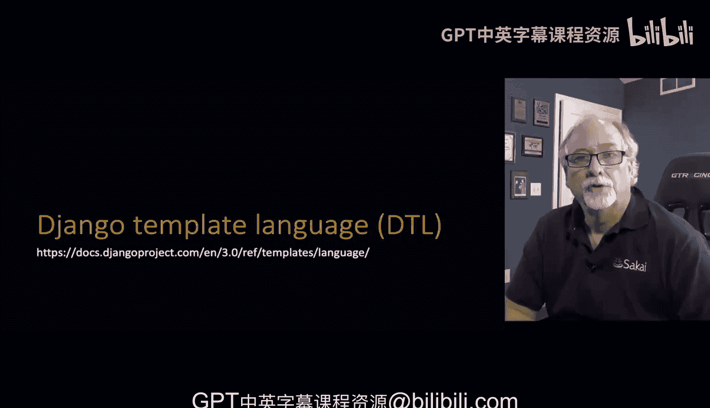
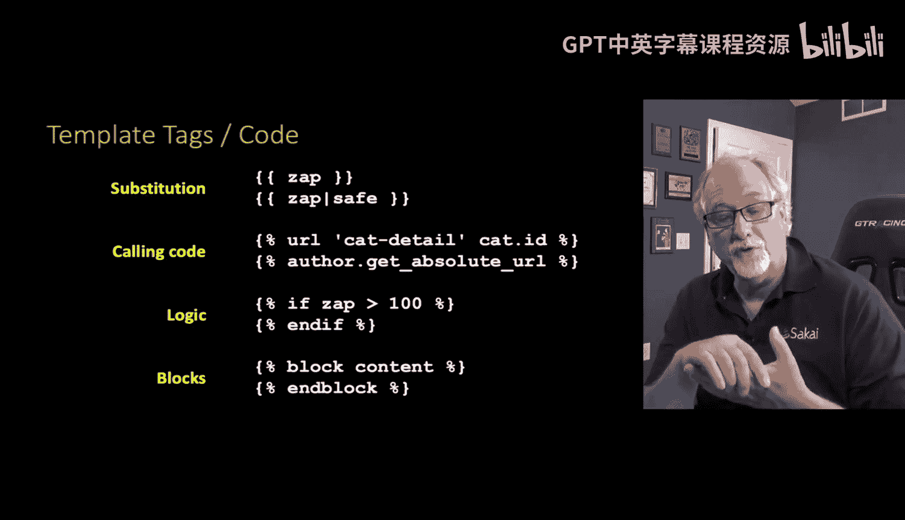
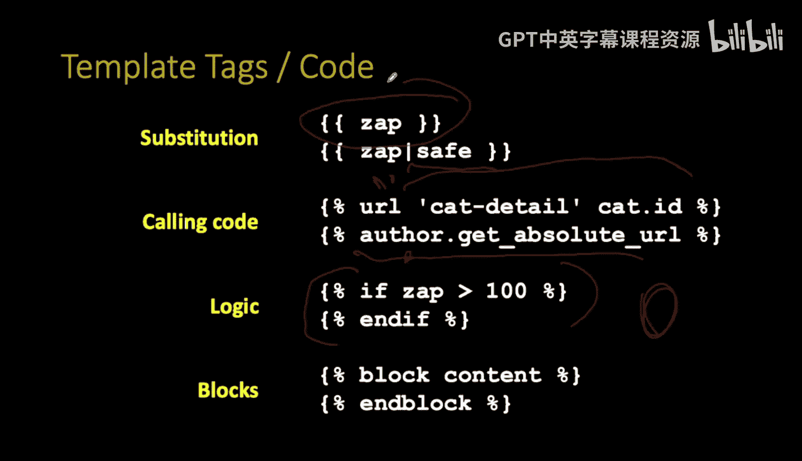
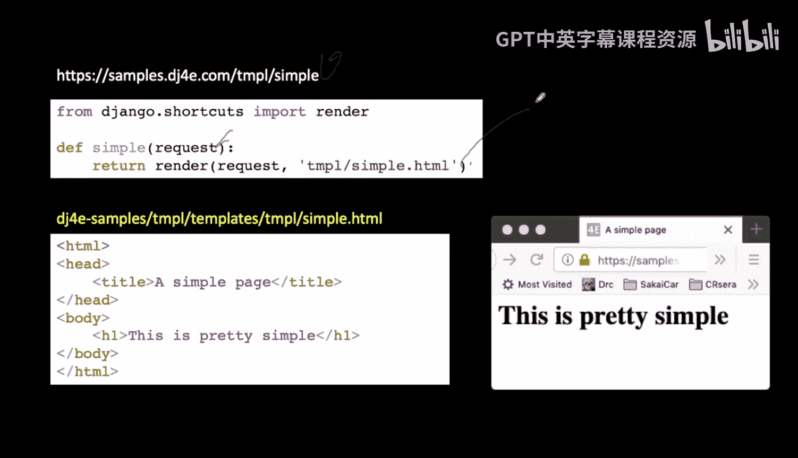
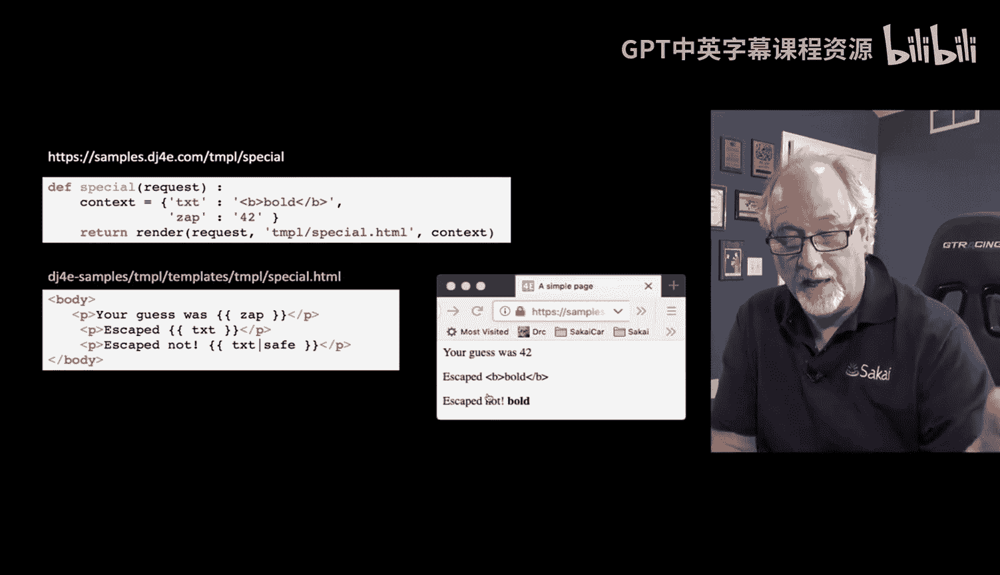
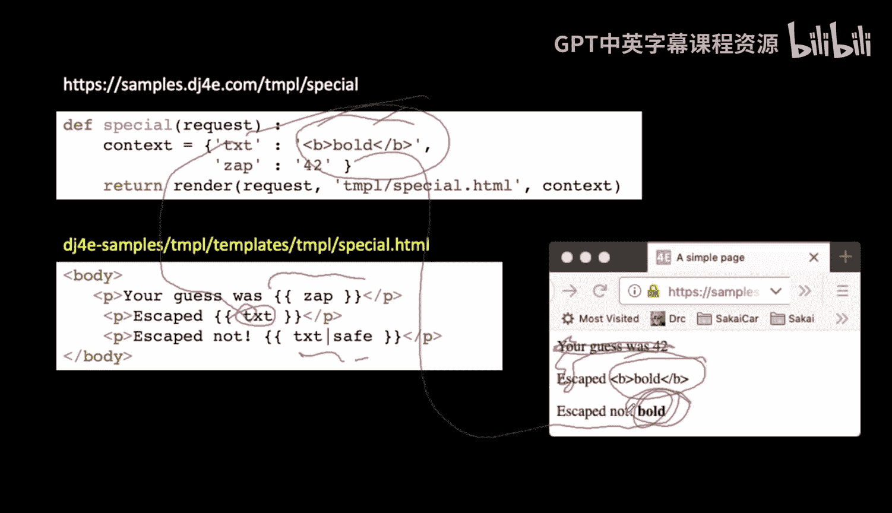
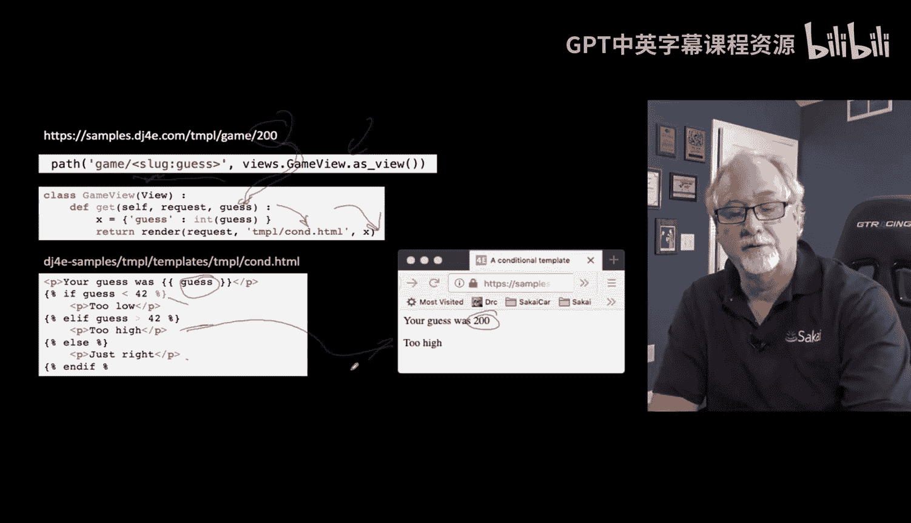

# Django课程：第14章：Django模板语言（DTL）详解

## 概述

在本节课中，我们将深入学习Django模板语言（DTL）。我们将探讨其核心语法、功能以及如何安全地使用它来动态生成HTML内容。DTL是Django默认的模板引擎，其设计兼顾了功能性与安全性，是构建动态Web页面的重要工具。

## 模板语言基础



上一节我们介绍了模板的基本概念，本节中我们来看看DTL的具体语法和功能。

DTL使用双花括号 `{{ }}` 进行变量替换。这种语法也被许多其他模板引擎采用，有时甚至被称为“Mustache”语法，因为花括号形似胡须。在Django中，所有通过双花括号输出的内容都会**自动进行HTML转义**，这是防止跨站脚本（XSS）攻击的关键安全特性。

如果你确定内容是安全的，并希望直接输出HTML，可以使用 `safe` 过滤器来禁用自动转义。其语法为 `{{ variable|safe }}`。`|safe` 部分被称为过滤器，它修改了变量的输出方式。

## 核心语法元素

DTL不仅支持变量替换，还支持逻辑控制、循环和模板继承。以下是其主要功能：



*   **变量替换与转义**：使用 `{{ variable }}`。这是最常用的功能，用于将上下文中的数据插入到HTML中。
*   **逻辑控制**：使用 ` ... ` 和 ``。其语法类似Python，便于理解。
*   **循环**：使用 ` ... ` 来遍历列表或查询集。
*   **代码执行与URL解析**：使用 `` 标签执行代码，例如 `` 用于根据视图名称和参数生成URL。
*   **模板继承**：使用 ` ... ` 定义可替换的块，允许子模板扩展和覆盖父模板的特定部分。

## 实践示例：从简单到复杂

让我们通过一系列代码示例，具体了解这些功能如何应用。

### 静态模板渲染

最简单的用例是渲染一个不需要任何动态数据的静态HTML模板。

```python
def simple_view(request):
    return render(request, ‘myapp/simple.html‘)
```

对应的模板 `simple.html` 就是普通的HTML文件。Django提供了一个内置的 `TemplateView` 类视图，专门用于处理这种简单场景。



### 变量替换

现在，我们向模板传递一些动态数据。以下视图向模板传递了一个键为 `‘zap’`、值为 `42` 的上下文。



```python
def guess_view(request):
    context = {‘zap‘: 42}
    return render(request, ‘myapp/guess.html‘, context)
```

在模板 `guess.html` 中，我们使用双花括号来引用这个变量：

```html
<p>Your guess is {{ zap }}</p>
```

最终，浏览器将显示“Your guess is 42”。`{{ zap }}` 会被自动转义后替换为上下文字典中 `‘zap’` 键对应的值。

### 理解 `safe` 过滤器

为了展示自动转义和 `safe` 过滤器的作用，我们传递一个包含HTML标签的字符串。

```python
def safe_view(request):
    context = {
        ‘zap‘: 42,
        ‘txt‘: ‘<b>Bold Text</b>‘
    }
    return render(request, ‘myapp/safe_demo.html‘, context)
```

在模板 `safe_demo.html` 中，我们以三种方式输出 `txt` 变量：

```html
<p>Escaped: {{ txt }}</p>          <!— 显示：<b>Bold Text</b> —>
<p>Safe: {{ txt|safe }}</p>        <!— 显示：Bold Text （加粗） —>
```

第一个输出被转义，用户看到的是原始的 `<` 和 `>` 字符。第二个输出使用了 `safe` 过滤器，浏览器会将其中的 `<b>` 和 `</b>` 解释为HTML标签，从而使文本加粗显示。**重要提示**：只有在你完全信任该变量的内容时（例如，它来自你的系统，而非用户输入），才应使用 `safe` 过滤器。

### 循环与条件判断



DTL可以处理列表等数据结构，并进行逻辑判断。

```python
def loop_view(request):
    f = [‘apple‘, ‘orange‘, ‘banana‘, ‘lychee‘]
    n = [‘peanut‘, ‘cashew‘]
    context = {
        ‘fruits‘: f,
        ‘nuts‘: n,
        ‘zap‘: 42
    }
    return render(request, ‘myapp/loop.html‘, context)
```

在模板 `loop.html` 中，我们可以遍历列表并使用条件判断：

```html
<ul>

    <li>{{ x }}</li>

</ul>

<p>

    Number of nuts: {{ nuts|length }}

    No nuts available.

</p>
```

`` 标签会遍历 `fruits` 列表，为每个元素生成一个列表项。`` 标签检查 `nuts` 变量是否存在（非空），如果存在，则使用 `length` 过滤器输出其长度。

### 访问嵌套对象

DTL支持通过点号 `.` 访问对象的属性或字典的键，从而遍历复杂的数据结构。



```python
def nested_view(request):
    context = {
        ‘outer‘: {‘inner‘: 42}
    }
    return render(request, ‘myapp/nested.html‘, context)
```

在模板 `nested.html` 中，可以这样访问嵌套的值：

```html
<p>The value is {{ outer.inner }}</p>
```

这将输出“The value is 42”。DTL能够处理对象、字典、列表等多种嵌套结构。

### 处理URL参数

最后，我们看一个处理来自URL的参数的例子。假设URL模式捕获了一个名为 `guess` 的参数。

```python
# urls.py 中的路径可能类似：path(‘game/<int:guess>/‘, views.GameView.as_view())
class GameView(View):
    def get(self, request, guess):
        # guess 参数已被路径转换器转为整数
        context = {‘guess‘: guess}
        return render(request, ‘myapp/game.html‘, context)
```

在模板 `game.html` 中，我们可以根据这个猜测值进行逻辑判断：

```html
<p>Your guess is {{ guess }}.</p>

    <p>Too high!</p>

    <p>Too low!</p>

    <p>Exactly right!</p>

```

## 模板继承 🧩

上一节我们介绍了DTL的基本语法，本节中我们来看看如何通过模板继承来高效地组织代码。

模板继承允许你创建一个基础“骨架”模板，其中包含网站的通用结构（如页头、页脚、导航栏），并定义一些可以由子模板填充的“块”（block）。

以下是基础模板 `base.html` 的示例：

```html
<!DOCTYPE html>
<html>
<head>
    <title>My Site</title>
</head>
<body>
    <div id=“sidebar”>
        
        <ul><li><a href=“/”>Home</a></li></ul>
        
    </div>
    <div id=“content”>
        
    </div>
</body>
</html>
```

子模板 `child.html` 使用 `` 来继承基础模板，并可以覆盖或填充其中定义的块：

```html


My Amazing Page


    <h1>Welcome!</h1>
    <p>This is the content of the child template.</p>

```

这样，`child.html` 生成的页面将具有 `base.html` 的整体结构，但标题和主要内容区域被替换为子模板中定义的内容。这种方式极大地减少了代码重复，提高了可维护性。

## 总结



本节课中我们一起学习了Django模板语言（DTL）的核心知识。我们了解了如何使用 `{{ }}` 进行安全的变量替换，以及如何通过 `safe` 过滤器在必要时输出原始HTML。我们探索了 `` 标签的强大功能，包括实现条件逻辑（`if/else`）、遍历数据（`for`）、生成URL以及最重要的——通过模板继承来构建可复用的页面布局。

DTL语法直观，与Python相似，并且将安全置于首位（默认自动转义），是开发Django应用程序时生成动态内容的可靠工具。掌握DTL是成为高效Django开发者的关键一步。