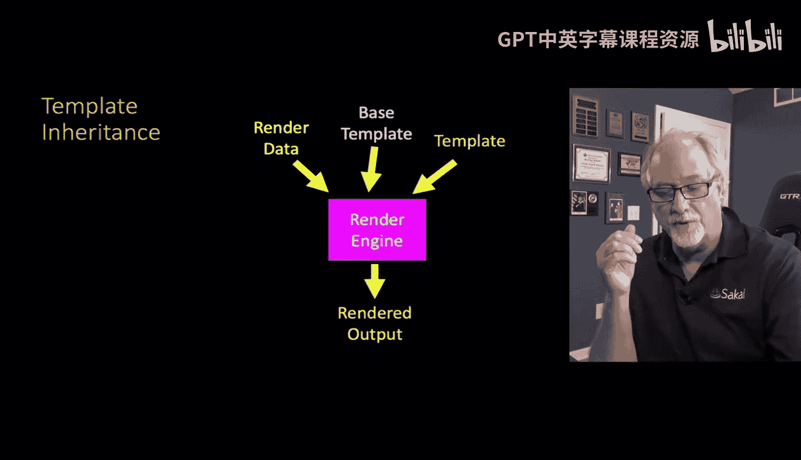
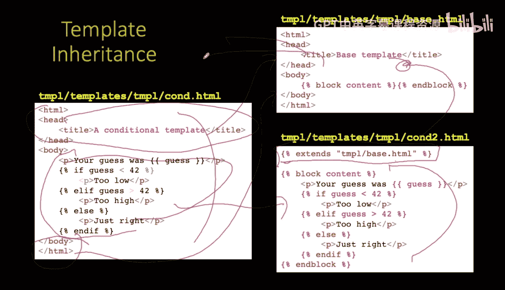
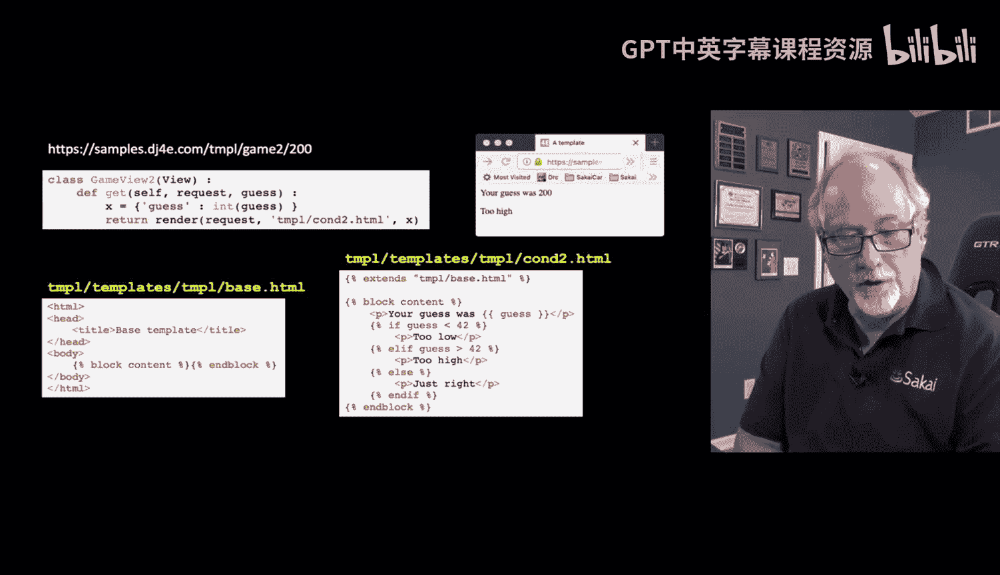
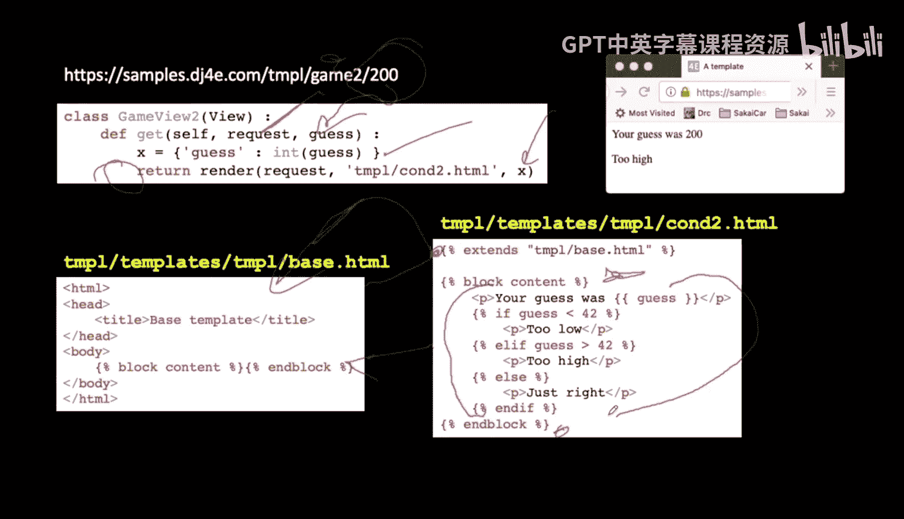
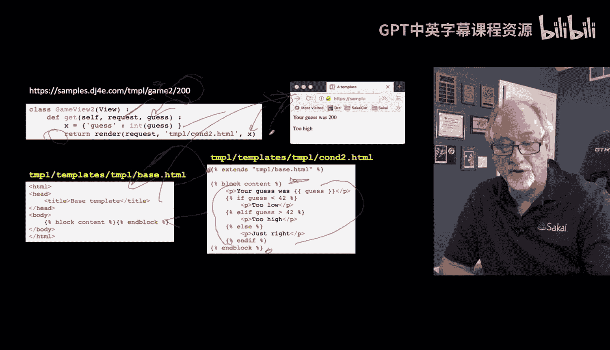
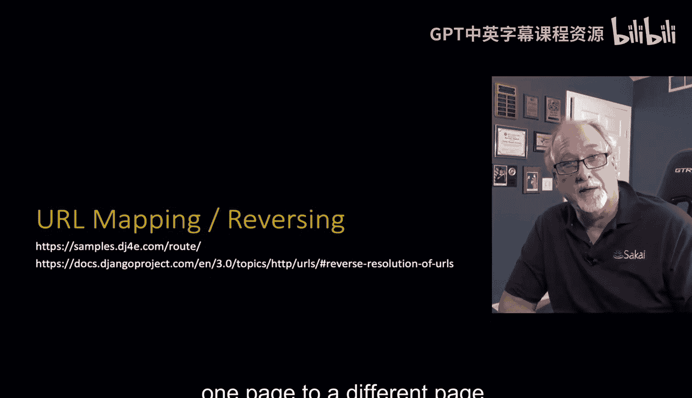

# 密歇根大学《给所有人的Django课程（简介、开发Web APP、特征和库、JavaScript和JSON）｜Django for Everybody》中英字幕 p41 15_03_07_Django模板继承.zh_en -BV1Kt421V7EE_p41-

So now we're going to talk about a technique called template inheritance and this and other times it's a great time to review object render programming because I'm just going to like use object render programming definitions and words and not completely explain them so you got to know what a class is。

 you know itself is those kinds of things and I've got a great online lesson that you can go read and listen to and understand objects and I'll explain it to you in 30 or 40 minutes so。

Inheritance actually from that lecture is the notion in object learning programming to not repeat yourself you have some kind of a shape and then you make a bunch of objects that mirror that shape but you can also with inheritance you can have a shape that makes another shape like a shape in general that's a triangle and so you can inherit that all triangles have everything shapes have and all squares have everything shapes have and all circles and it's just a way of capturing information once writing code once and then not repeating yourself functions are a form of DRY don't repeat yourself modules are but。

Inheritance is the key and inheritance kind of can get in our way as programmers because it leads to smaller and smaller code if you're going make five things each of these five things is really small because we make a big thing over here and we inherit all five of those things from it but then you look at it and like oh I don't understand that right I don't understand these only one line functions what are they doing well the answer is there's 50 lines out here that we're inheriting from so we'll see some of that I'll try to kind of allude to that part where look there's a magic over there and a lot of what you do in Django is use classes and objects that you didn't even create meaning that they've got data inM like dot scheme or request dot scheme and so this is just also a way of trying to simplify the way you handle sort sort of things objects that are handed to you and then you hand objects to other parts of Django。

So。Template rendering basically says， okay， here's some render data and here's a template。

What happens now is there's this thing called a base template and the base template and the template combined together to be sort of like the ultimate template。

 and then you pass in the render data and produce the rendered output。

So let's just say that we had a bunch of pages and we were doing the same thing over and over again Now we will soon do this with navigation because you want to put a menu at the top of every page and literally that menu could be 40 or 50 lines of HTML and you do not want to repeat that menu every time at the top of the page So you want to put that one place and then you want to make many pages that have the same top navigation so that your pages as you go between them look like the navigation is the same So we're going to do this in a very。

 very simple way。 So we have one template， this con do h that we've been playing with。

 you'll notice it has some HTML and a title and a body tag and some of this and then it's got this stuff。

 Well let's say we wanted a bunch of pages that had that everything but the body So what we basically then do is。

We take parts of this， like the repeated parts， and we put it into a template。

And then we take the part that we're going to change every time and we put it into a template that then extends。

 so see this one here has one line that says extends template based on HTML so this one uses everything in here but then adds some stuff so the basic idea is we split this one big template into reusable parts and non-reusable parts。

 and then we have a bunch of templates that come off a base。

We call it base commonly an object oriented world because it's like the thing that we're basing it on so you know that's this is the base and then we're going to build on it base build something else on top of it so how this works in practice we have a view here we're going to call this view game2 right so we're going to use the URL game2 we have a classbased view we have a get method in there the request data comes in as request we told it to parse the slug off the end and pass it to us in the variable guess。

We make a template which is exactly what we did before where we have a key of guess and the values the actual guess itself。

 and then we pass that template in the variable x into render and we tell it to go read Temple con2 which is the condition of the second conditional one and the thing is is there's nothing in the Python code in the views dot Py that knows about the base。

What happens is the only place that is in the only place that the base is noted is in the Con2 template itself that says。

 hey， go grab this one and extend it。Now the way it works starts out a little counterintuitive。

 it says with it really says start with this template here and then push this content into the base template and this block content and endblock it basically that tells what I want to replace is you're replacing blocks in the base template so all the stuff in the Con2。

 H that is between the block and the end Block is what is then pushed into the base template and then in a sense the base template with those blocks replaced is what is returned as a result of the render and then returned to Django as the HtTP response We're going to use these a lot when we start doing navigation we're going to go crazy with these things。

So up next， we want to talk about URL mapping and reversing where we have to actually make a link in one page to a different page。

