# 密歇根大学《给所有人的Django课程（简介、开发Web APP、特征和库、JavaScript和JSON）｜Django for Everybody》中英字幕 p42 16_03_08_反转Django视图与URL.zh_en -BV1Kt421V7EE_p42-

So now we're going to take a quick look at URL mapping and URL reversing This has to do with basically routing and it really allows us to generate links from one page to another。

 So we're in the middle of a page and we want to make a link to a different page weve got to figure out what the string of that is So again we're sitting here in the middle of our code we're in the views and this URL mapping is basically a set of functions that allow us to read the URLls。

pyy in a way if all these functions didn't exist， allowed us to read URLs。

pyy we would write a bunch of functions to do that And so these are just now part of Django and so often these are used in the view sometimes they're actually used right inside URLspyy to come up so it's like if you know the name of a view what would be the URL to get to that view and sometimes views have just a URL and sometimes they' are URL plus a parameter and that's all set up here and so it's like give me a link to a view please and then。

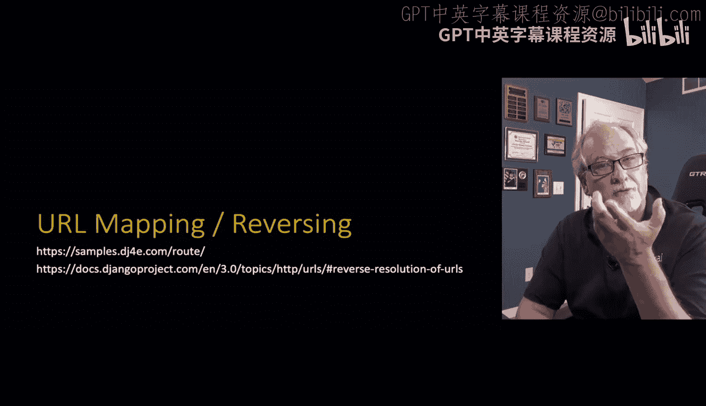

Jjago looks in the URLs。pyy potentially across applications and gives you that string and it's just to avoid hardcoding the strings it's really the idea and so this is just a common problem。

 this is the documentation right from the Django website。

 you don't want to hard code these things you actually can， but then if you rename an application。

 the whole idea you could make a Django project that had four or five applications and then you could re some of those in a different Django project and add some more applications so you know you don't want these applications to have too many hard coded decisions。

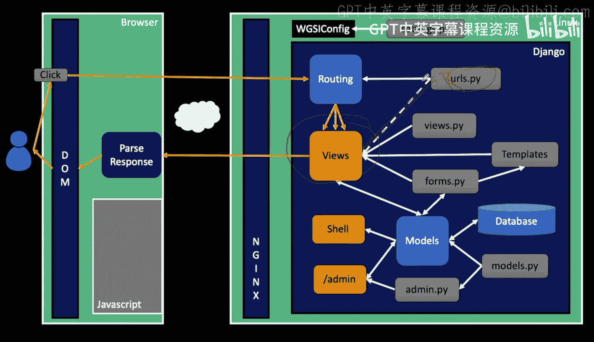

And it might be easier to hard code some of these things。

It is actually in the long run much easier from a maintenance perspective。

 and so it's just a it's better maintenance， it's another don't repeat yourself。

Or doing a table lookup rather than hard coding strings It also lets you hunt around in your code to see where it is that you're talking to that other application because we're gonna to do login eventually login is another place。

 It's not in our application but our application is going to have to generate login URLs by asking the login application。

 Hey， what's the URL to log in what's the URL to log out。

 and that's where we'll mostly start doing this。 So I want to talk about it now So when we get to log in and log out。

 you'll have that will make more sense to you。 and it also is some of the stuff that you're doing from the tutorials。

 you're putting these reverse lookup things in and you may or may not know what they are and my goal here is to give you a little sense of what really they're there for So let's take a look at an example So here we have our URLs py and most of it I mean this is the application route So if you're looking in the samples it's in the route application the main thing that we've added is some names names are here to look up these paths We don't really want to look it up by this path mapping because。

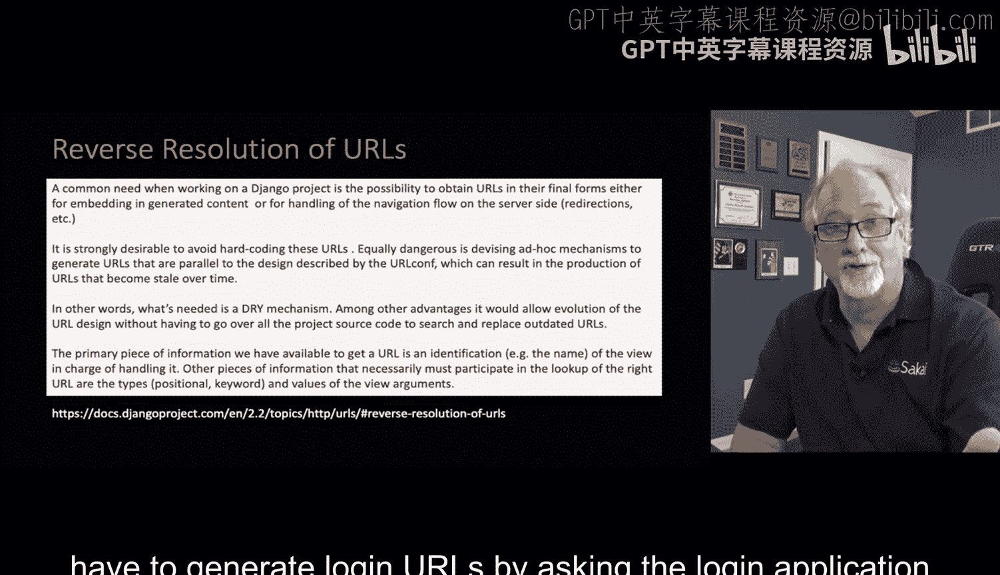

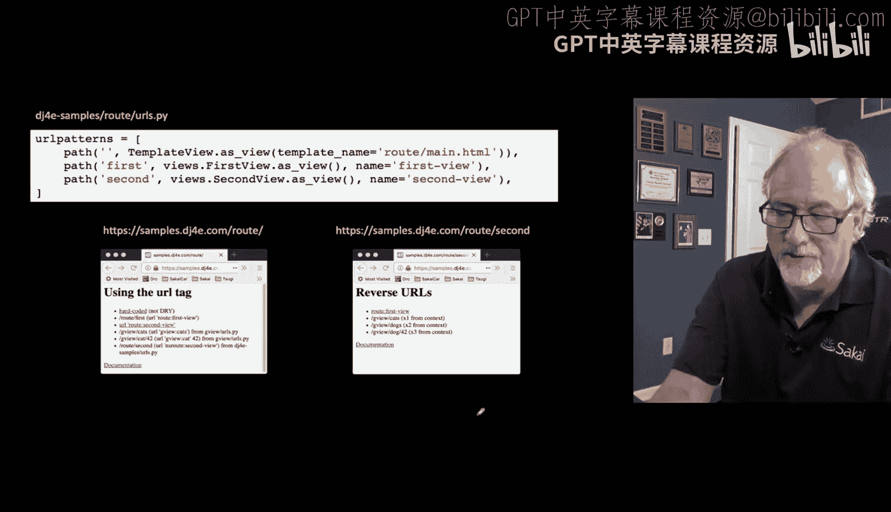

actually change， so we're basically saying this view in your views。

t Py second view is going to be referenceable by this second dash view。

 I named them differently very much on purpose。

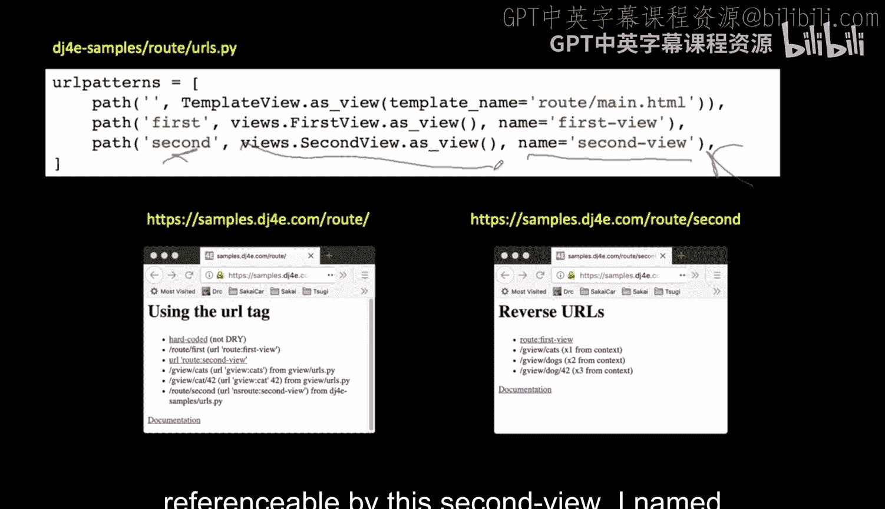

So here's what happens if you just go to the route/lash route， the name of my application。

 it pulls up this main slash HTML and so the first thing I want to show you is what a hardcoded URL looks like Now we know that you know blah。

 blah， blah sample slash route slash second is going to go to that second view because the application's name is route and the view name is second。

And that's good that will work， it's not going to break。

 but this is where you lose flexibility as you try to recombine applications from one into the other。

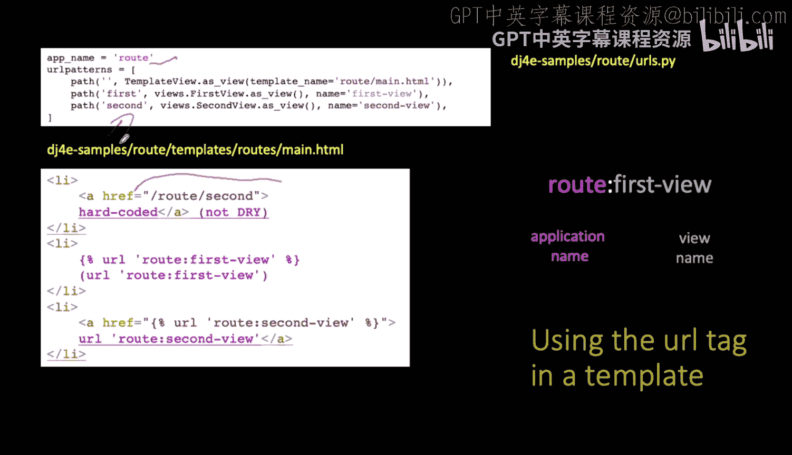

And so in a sense， what we're asking to do here is we're going to instead use this URL utility and so in our template we use curly brace percent and then we're running a utility that's been plugged into the template system that is like when we're running the URL function as it were。

 and we're going to pass a string to it and that is。

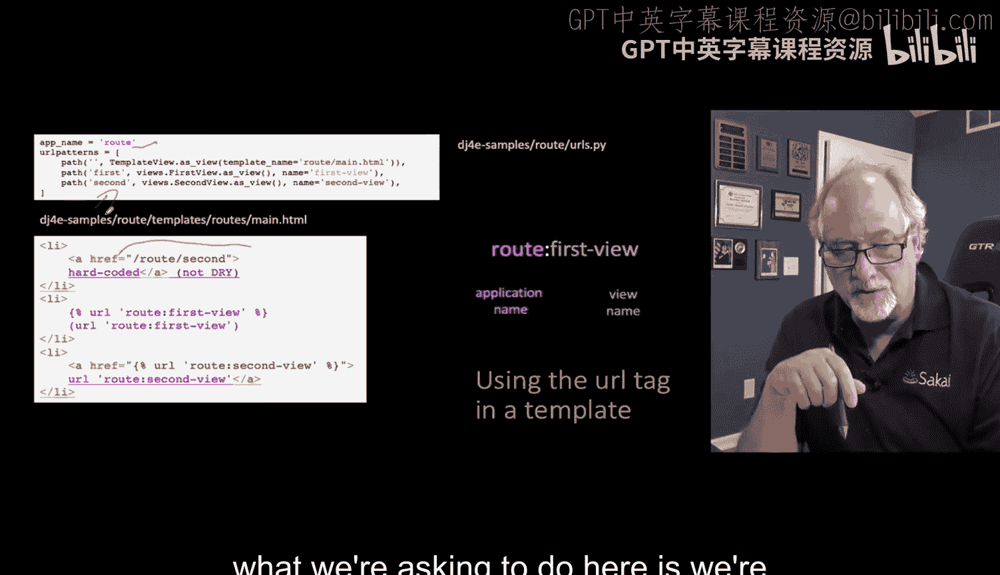

Within the route application， the view that is named Second view， so that goes into this file。

 the route routeurs。pyy， redone the views until it finds second view。

 and then it reverse generates the path that works for that。Now in this case。

 these two strings are going to be the same and yes。

 that looks a little uglier but the key is is that we can make changes here and this will not the top one route/lash second will not reflect the changes。

 but if we're looking it up by name we can do all kinds of crazy things and remap stuff quite naturally and so again it's just this URL command。

 the name of the view， the application colon the view。

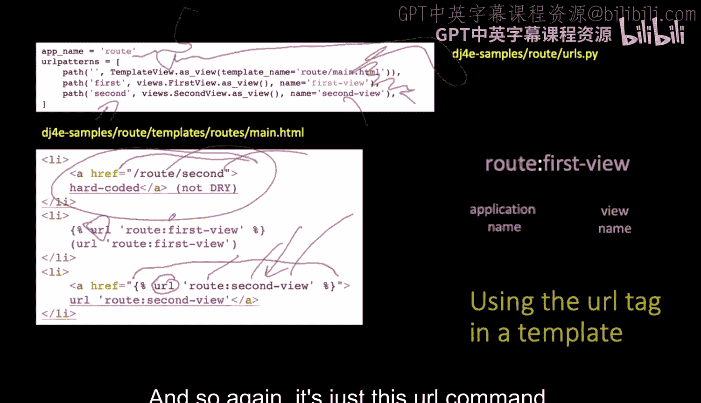

So this is what it looks like when it's all said and done there's no parameters to this。

 so if you take a look at this， this route second view ends up under this hardcod the route slash second view。

 the hardcoded ones ends up under the string in the URL output I mean the page output we just see its slash route slash first is a thing that comes out from running the code URL and passing route colon first view in so that's what it looks up。

And we can make a link， this is now an HR and the actual the actual path is sitting there in the HR。

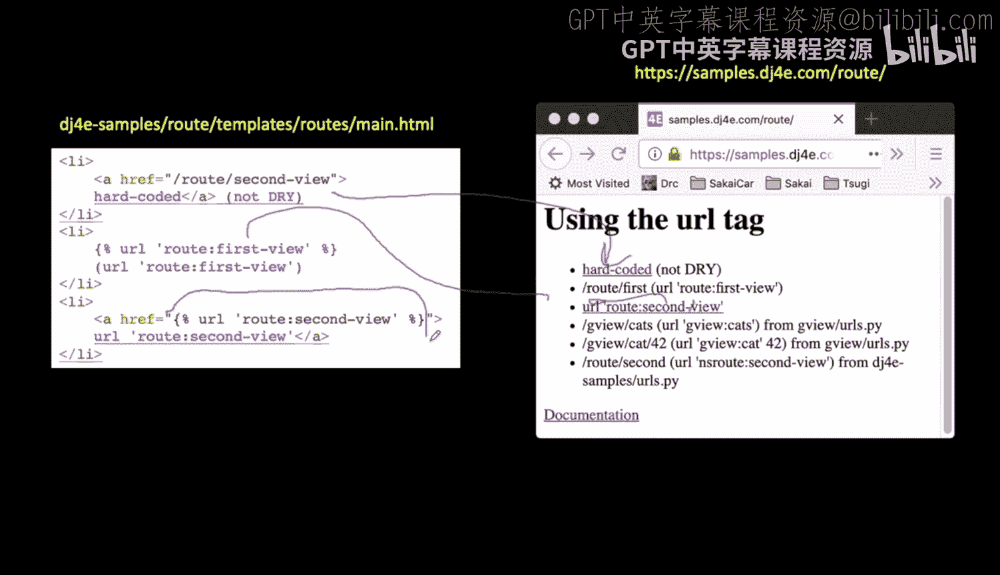

So now we're going to see how we do this when we're going from one application to another。

 so an application we're going to look at in just a bit is this thing called the generic View。

 it's application called GVi。

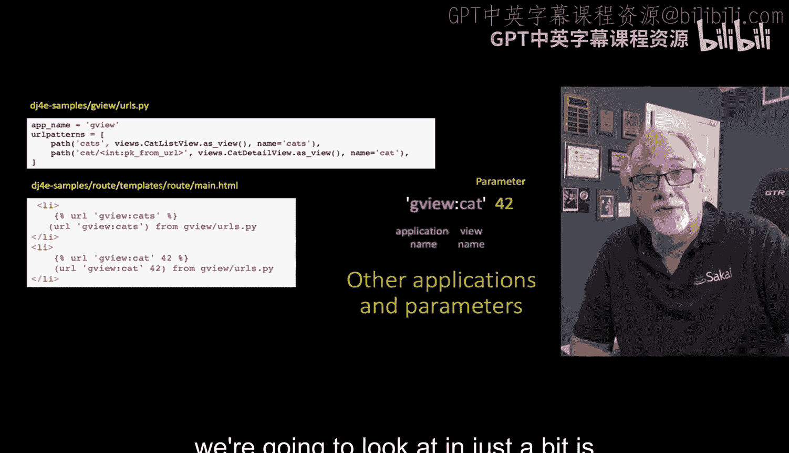

we want to make a link to that application and we know that there are two views。

 there's a list view in a detail view， and all we have to do is go take a look at the URLs。

pyy and we know that it's an application it's an application G view and theres this view has a name and that view has a name。

 the view that is all the cats is got a name of cats and the view for a single cat is cat。

 but the cat one takes a parameter， it's an integer number which is cat number 42 or whatever。

And so we're sitting here in the route application， route application， HTMLt。

 and we can now go create a URL that actually is pointing to another application and a view within that other their application。

 so this is a URL for GVcas and that'll just look it up。

 so now we don't even have to know what the URL patterns are inside of GV/cas。

Now we can look at GVCAT， which is this URL， but you'll notice that this has a parameter。

 and so we actually have to add a second parameter， which is that 42 number。

 and so this will generate the URL straight to the detail page for a single cat。

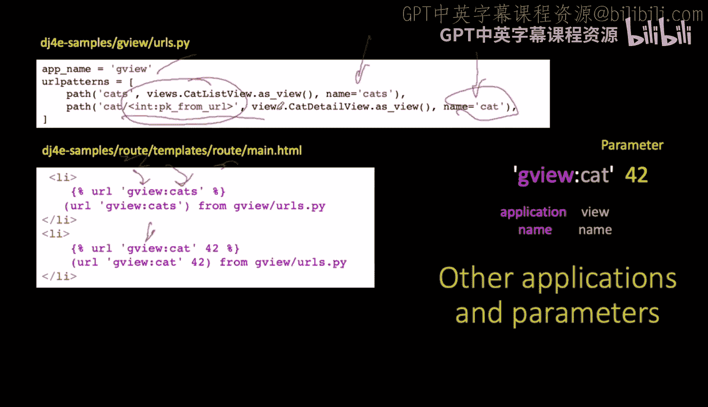

Now there's a lot of nice stuff about this so for example， if you omit this。

 it's going to look this GV cat up and find it and say you know what。

 I'm supposed to have an integer and it'll blow up on you if you get that wrong or if you put up 42 on this one on the GVcas you're not supposed to have a number on that but GVca you are supposed to have a number So this is one of the nice things about this reverse URL lookup in that we can there's some air checking that goes on because if it could just blow up silently and in many ways when code blows up silently it's worse than blowing up in a spectacular fashion because if it blows up in a spectacular fashion。

 you can fix it。

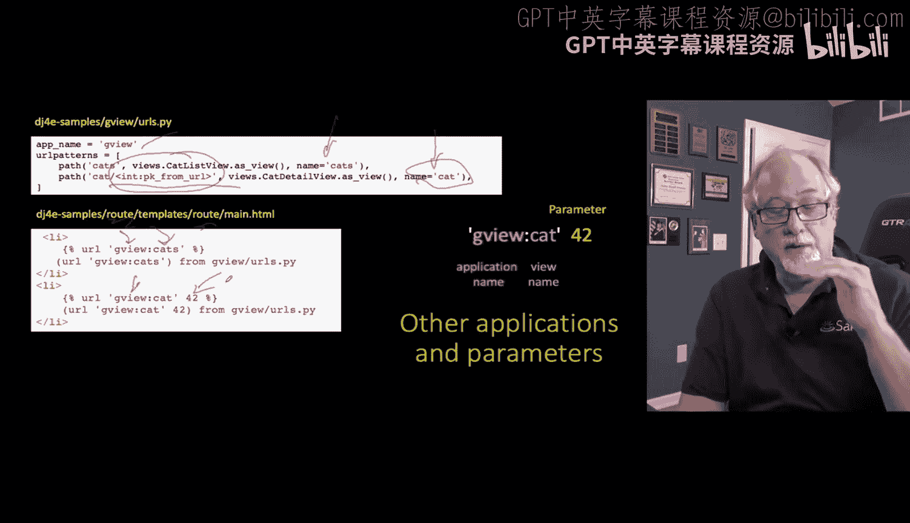

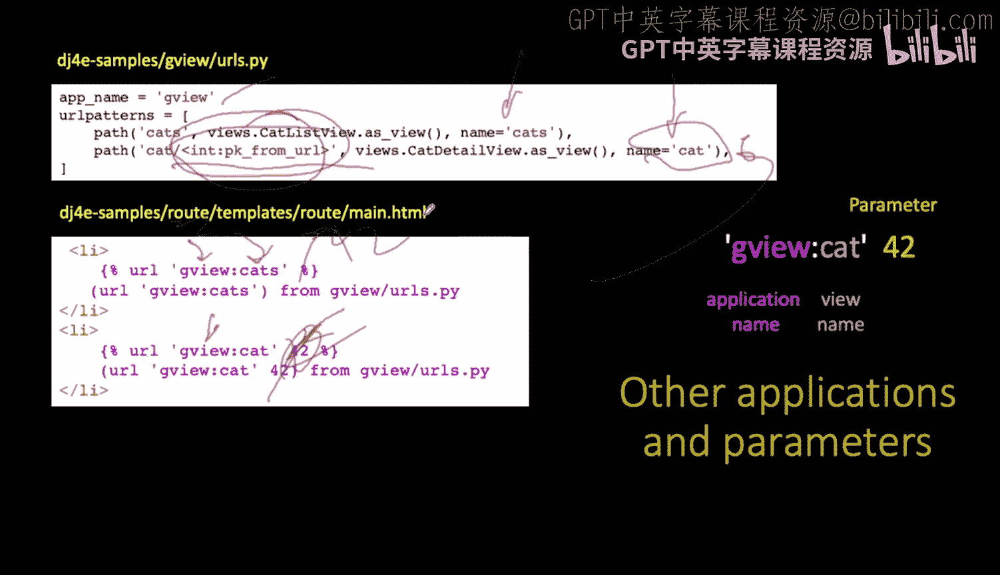

So this is what it looks like。 So this GVi Cats URL and GVi Cat 42。

 this one that actually is the detail page that demands a parameter。

 it constructs that just fine okay。So that's going from the route application to the。

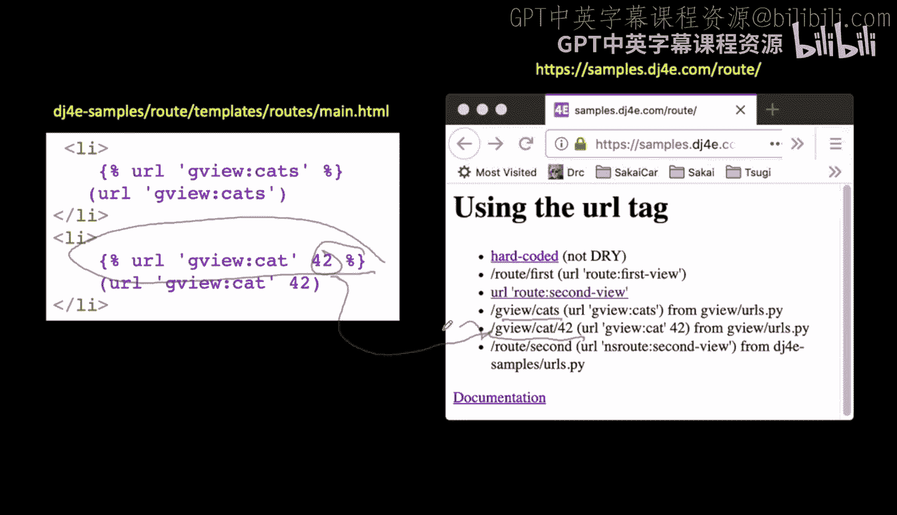

G view application。Now you can also this is kind of subtle and we will need it when we start doing social login using GitHub。

 so I'll just mention it because we're deep in it right now and so basically this is actually the overall DJfr samples URLs。

pyY and that's the one that's pulling all the URLs together kind of in the same folder is settings。

pyY。And so you're pulling in a bunch of URLs and these live in an application of their own name。

 but we can actually give them a name of our own to reference them so you can actually name them you can reference them with the name they were already already given by the application that we're talking to or we can say you know what I'm gonna to call these social colon or NSsro colon so if we take this route application and include all those URLs and we're going to use a namespace of NS route you still can say colon or you can also say NS routeute and so you can see that in this example right we can go to the second view of route or we can go to the second view of NSS and so there's route is the way one way in but NS route is our own way in in case we somewhere have an application named route or something like that and so this allows for a second way to access these URLs using a namespace and its it's not in the URLs。

 PY in each application。

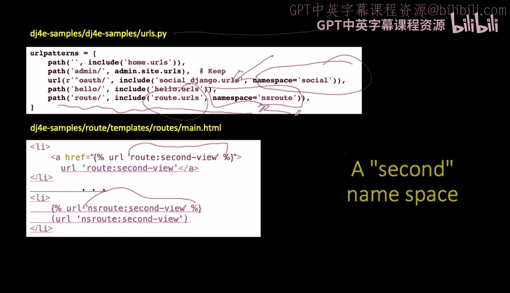

It is in the URLs。pyy for the Django project。So I just finished showing you all that in the templates。

 but we can also do this in Python and we'll find that sometimes in like models。pyy or views。

pyy or even sometimes in aminpyy we'll need to sort of be able to find a view in the same or another application and automatically construct it sometimes in formspyy we're going to do it as well and so this you tend to call this reverse or reverse lazy to look these things up and the URL feature inside of the template is pretty much just calling this reverse lazy automatically because the parameters are kind of the same So well I just want to show you how to do some of those things that I just showed you in templates how you can do them in Python as well So here's the one in templates we just have this little plug to a template called the URL plug it takes one parameter and looks up in the URLspyy of the first application the URL named first view maybe there's parameters in this case there's not and then it generate。

It's a path to that slash route slash first right and so that's what how you do it it's really under the covers calling this reverse lazy and so these reverse and reverse lazy are。

You are from the Djangot URLs。Library and so in this view there's nothing tricky about this view it's just a classbased view we have a get method we pass in all the request stuff。

 but basically we can call reverse lazy and pass it the exact same string。

 this exact same string which is go into the G view application work your way down until you find the cats or go into the G view application go in and find the one for dogs or in this case this is the dog detail and it requires a number and so the G view dog go find that one and then the second parameter is 42 so make me one for that and in Python U U2 and U3 are all just strings which I'm passing in through some context under the variables x1 x2 and x3。

There are really lousy choices of variable names， but I do that sometimes to point out that they're arbitrary capricious and all they have to do is match and so then like the X1 matches in this substitution now we're just doing string substitutions which is different than calling the URL but it's still just a bunch of strings。

 you called reverse lazy in your Python code and now you're just pulling that string into with double curly braces。

And so this is how it ultimately works， we can you know we get these we're just showing how this output turns out where we go reverse lazy for GVU Catts GVU Dog or GVU dogg with an argument at 42。

 we pass it in， we replace it， and so this is how it prints out GVca slash GVdog slash GV Dog 42 and so that's how that reversing works in Python。

And you'll see that certain situations， whether you're like in a model， sometimes you're in a model。

 it's very common in a model to want to put something about the reverse in it。

And the reverse lazy says delay until later to look it up。

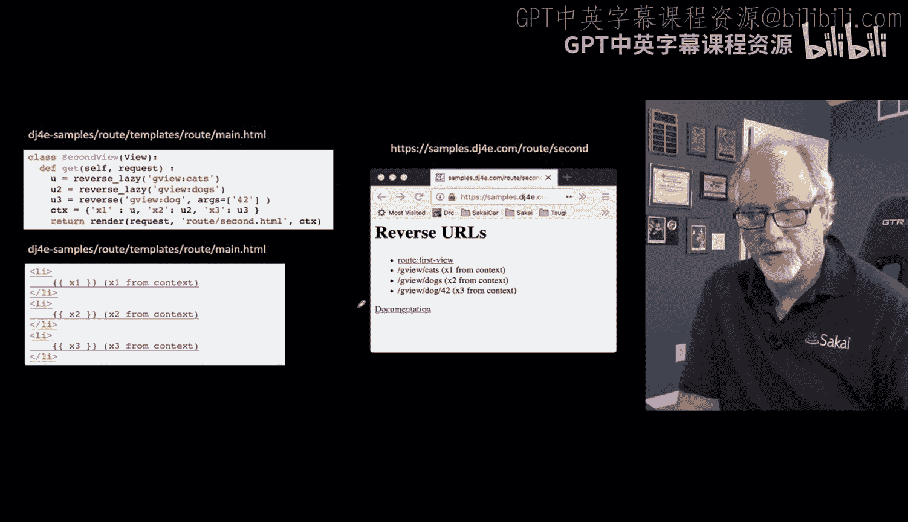

So up next， we're going to put this all together and ultimately start writing using the generic views because we're going to look at list pages and detail pages and in time we're going to look about delete pages and update pages and Django has these wonderful features that make it work really simply with very little code we want to talk about it because sometimes the less code you write the harder it is to understand。

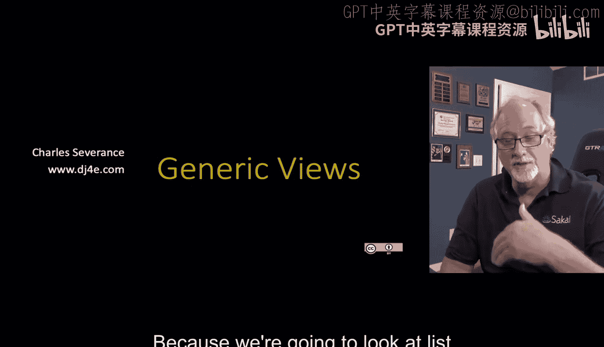